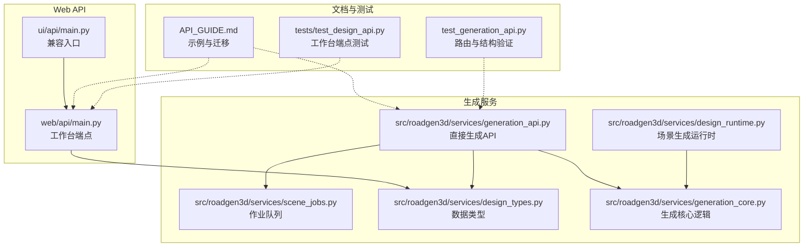
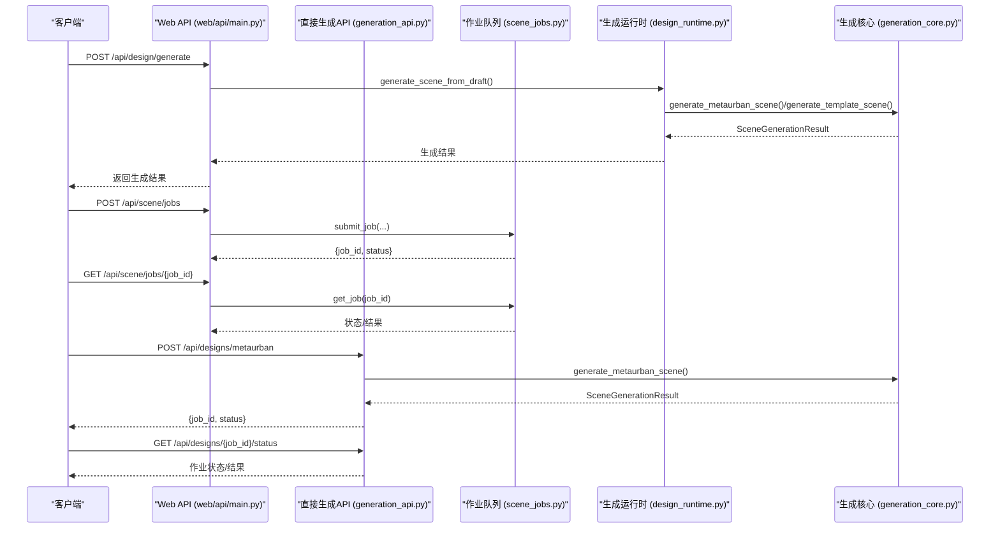
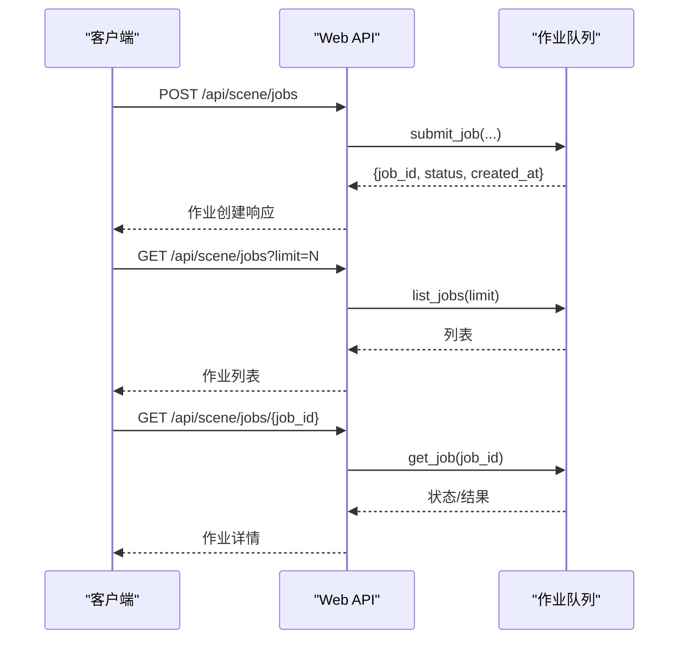
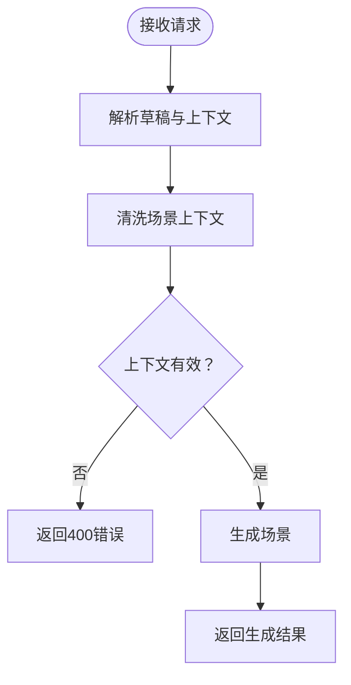
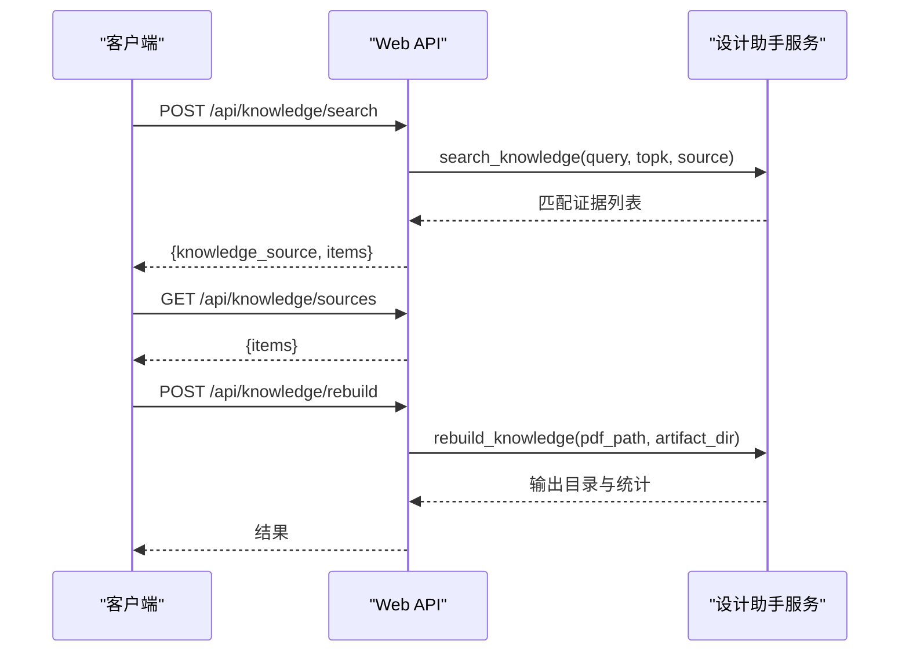
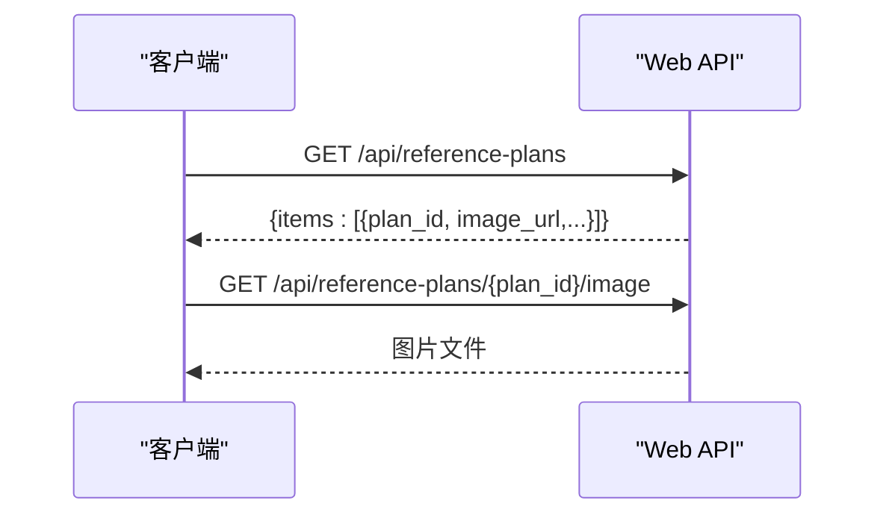
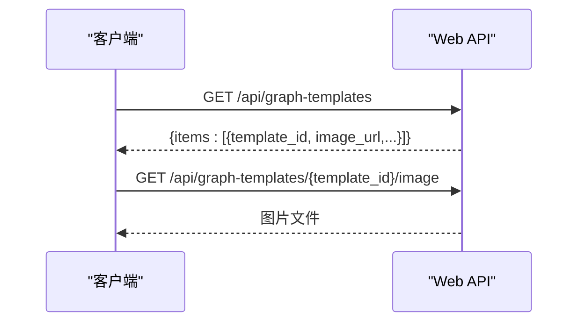
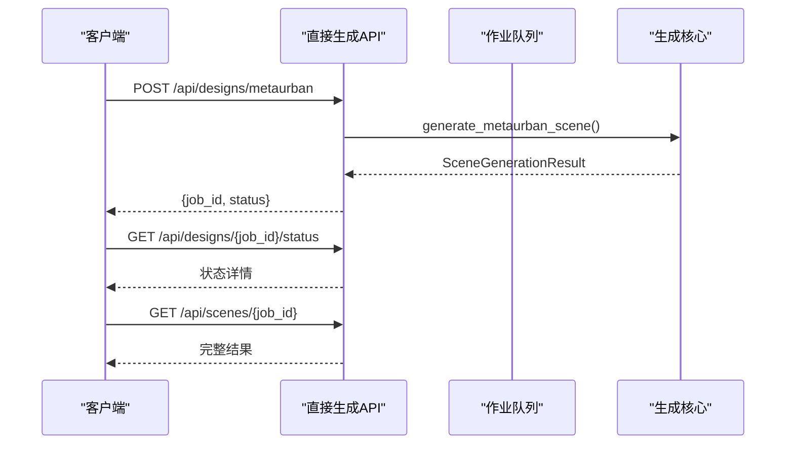
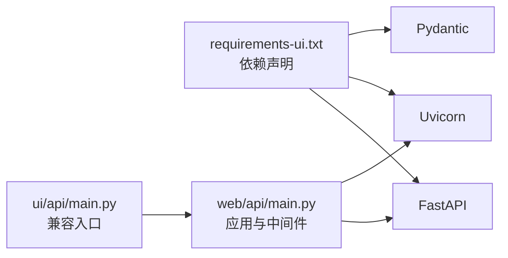
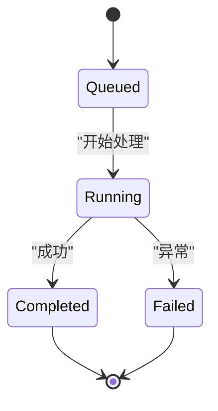

# API接口参考

<cite>
**本文引用的文件**
- [web/api/main.py](file://web/api/main.py)
- [ui/api/main.py](file://ui/api/main.py)
- [src/roadgen3d/services/generation_api.py](file://src/roadgen3d/services/generation_api.py)
- [src/roadgen3d/services/scene_jobs.py](file://src/roadgen3d/services/scene_jobs.py)
- [src/roadgen3d/services/design_types.py](file://src/roadgen3d/services/design_types.py)
- [src/roadgen3d/services/design_runtime.py](file://src/roadgen3d/services/design_runtime.py)
- [src/roadgen3d/services/generation_core.py](file://src/roadgen3d/services/generation_core.py)
- [API_GUIDE.md](file://API_GUIDE.md)
- [test_generation_api.py](file://test_generation_api.py)
- [tests/test_design_api.py](file://tests/test_design_api.py)
- [requirements-ui.txt](file://requirements-ui.txt)
</cite>

## 目录
1. [简介](#简介)
2. [项目结构](#项目结构)
3. [核心组件](#核心组件)
4. [架构总览](#架构总览)
5. [详细组件分析](#详细组件分析)
6. [依赖分析](#依赖分析)
7. [性能考虑](#性能考虑)
8. [故障排查指南](#故障排查指南)
9. [结论](#结论)
10. [附录](#附录)

## 简介
本文件为 RoadGen3D 的 REST API 完整接口参考，覆盖以下关键端点与能力：
- 场景作业管理：POST/GET /api/scene/jobs；GET /api/scene/jobs/{job_id}；GET /api/scenes/recent
- 设计生成：POST /api/design/generate
- 知识检索：POST /api/knowledge/search；GET /api/knowledge/sources；POST /api/knowledge/rebuild
- 参考规划：GET /api/reference-plans；GET /api/reference-plans/{plan_id}/image
- 图形模板：GET /api/graph-templates；GET /api/graph-templates/{template_id}/image
- 参考标注转换：POST /api/reference-annotations/convert
- 直接生成（Web Viewer 专用）：POST /api/designs/metaurban；POST /api/designs/template；POST /api/designs/osm；GET /api/designs/{job_id}/status；GET /api/scenes/{job_id}
- 健康检查：GET /api/health

同时提供认证、速率限制、版本控制、客户端实现示例、错误处理策略、异步作业轮询机制、迁移指南与向后兼容性说明。

## 项目结构
- Web API 入口位于 web/api/main.py，提供工作台相关端点（场景作业、知识检索、参考规划、图形模板等）。
- UI 兼容入口 ui/api/main.py 导出 web/api/main.py 的应用实例。
- 直接生成 API（Web Viewer 专用）位于 src/roadgen3d/services/generation_api.py，提供异步生成与状态轮询。
- 作业队列与状态管理位于 src/roadgen3d/services/scene_jobs.py。
- 数据类型与生成选项位于 src/roadgen3d/services/design_types.py。
- 场景生成运行时位于 src/roadgen3d/services/design_runtime.py。
- 生成核心逻辑位于 src/roadgen3d/services/generation_core.py。
- 示例与迁移指南见 API_GUIDE.md。
- 单元测试覆盖了设计 API 的行为与路由结构。

**图表来源**
- [web/api/main.py:1-286](file://web/api/main.py#L1-L286)
- [ui/api/main.py:1-6](file://ui/api/main.py#L1-L6)
- [src/roadgen3d/services/generation_api.py:1-294](file://src/roadgen3d/services/generation_api.py#L1-L294)
- [src/roadgen3d/services/scene_jobs.py:1-205](file://src/roadgen3d/services/scene_jobs.py#L1-L205)
- [src/roadgen3d/services/design_types.py:1-368](file://src/roadgen3d/services/design_types.py#L1-L368)
- [src/roadgen3d/services/design_runtime.py:1-460](file://src/roadgen3d/services/design_runtime.py#L1-L460)
- [src/roadgen3d/services/generation_core.py:1-445](file://src/roadgen3d/services/generation_core.py#L1-L445)
- [API_GUIDE.md:1-337](file://API_GUIDE.md#L1-L337)
- [test_generation_api.py:1-146](file://test_generation_api.py#L1-L146)
- [tests/test_design_api.py:1-523](file://tests/test_design_api.py#L1-L523)

**章节来源**
- [web/api/main.py:1-286](file://web/api/main.py#L1-L286)
- [ui/api/main.py:1-6](file://ui/api/main.py#L1-L6)
- [src/roadgen3d/services/generation_api.py:1-294](file://src/roadgen3d/services/generation_api.py#L1-L294)
- [src/roadgen3d/services/scene_jobs.py:1-205](file://src/roadgen3d/services/scene_jobs.py#L1-L205)
- [src/roadgen3d/services/design_types.py:1-368](file://src/roadgen3d/services/design_types.py#L1-L368)
- [src/roadgen3d/services/design_runtime.py:1-460](file://src/roadgen3d/services/design_runtime.py#L1-L460)
- [src/roadgen3d/services/generation_core.py:1-445](file://src/roadgen3d/services/generation_core.py#L1-L445)
- [API_GUIDE.md:1-337](file://API_GUIDE.md#L1-L337)
- [test_generation_api.py:1-146](file://test_generation_api.py#L1-L146)
- [tests/test_design_api.py:1-523](file://tests/test_design_api.py#L1-L523)

## 核心组件
- FastAPI 应用与中间件：CORS 允许跨域，版本号在应用构造函数中声明。
- 设计助手服务：负责草稿生成、知识检索、场景生成、作业队列与最近场景列表。
- 直接生成服务：提供 MetaUrban/Template/Osm 设计的异步生成与状态查询。
- 数据类型：统一的请求/响应模型、作业状态、生成结果、场景上下文等。
- 场景生成运行时：处理设计草稿到最终场景的完整流水线。
- 生成核心逻辑：提供直接的场景生成API，绕过LLM工作流。

**章节来源**
- [web/api/main.py:81-267](file://web/api/main.py#L81-L267)
- [src/roadgen3d/services/generation_api.py:27-294](file://src/roadgen3d/services/generation_api.py#L27-L294)
- [src/roadgen3d/services/scene_jobs.py:42-205](file://src/roadgen3d/services/scene_jobs.py#L42-L205)
- [src/roadgen3d/services/design_types.py:131-368](file://src/roadgen3d/services/design_types.py#L131-L368)
- [src/roadgen3d/services/design_runtime.py:1-460](file://src/roadgen3d/services/design_runtime.py#L1-L460)
- [src/roadgen3d/services/generation_core.py:1-445](file://src/roadgen3d/services/generation_core.py#L1-L445)

## 架构总览
下图展示工作台端点与直接生成端点的调用关系与数据流。

**图表来源**
- [web/api/main.py:173-215](file://web/api/main.py#L173-L215)
- [src/roadgen3d/services/generation_api.py:131-265](file://src/roadgen3d/services/generation_api.py#L131-L265)
- [src/roadgen3d/services/scene_jobs.py:57-114](file://src/roadgen3d/services/scene_jobs.py#L57-L114)
- [src/roadgen3d/services/design_types.py:222-304](file://src/roadgen3d/services/design_types.py#L222-L304)
- [src/roadgen3d/services/design_runtime.py:336-396](file://src/roadgen3d/services/design_runtime.py#L336-396)
- [src/roadgen3d/services/generation_core.py:267-342](file://src/roadgen3d/services/generation_core.py#L267-342)

## 详细组件分析

### 场景作业管理（工作台）
- POST /api/scene/jobs
  - 请求体：包含草稿、场景上下文、补丁覆盖、生成选项
  - 响应：作业创建响应（job_id、status、created_at）
  - 错误：400（输入校验失败/运行时错误），404（作业不存在，仅在查询时）
- GET /api/scene/jobs
  - 查询参数：limit（默认20，范围1..100）
  - 响应：作业列表（每项含状态、时间戳、结果引用）
- GET /api/scene/jobs/{job_id}
  - 响应：指定作业的完整状态与结果
- GET /api/scenes/recent
  - 查询参数：limit（默认12，范围1..100）
  - 响应：最近成功场景的摘要与链接

**图表来源**
- [web/api/main.py:188-221](file://web/api/main.py#L188-L221)
- [src/roadgen3d/services/scene_jobs.py:57-114](file://src/roadgen3d/services/scene_jobs.py#L57-L114)

**章节来源**
- [web/api/main.py:188-221](file://web/api/main.py#L188-L221)
- [src/roadgen3d/services/scene_jobs.py:42-114](file://src/roadgen3d/services/scene_jobs.py#L42-L114)

### 设计生成（工作台）
- POST /api/design/generate
  - 请求体：draft（草稿）、scene_context（场景上下文）、patch_overrides（补丁覆盖）、generation_options（生成选项）
  - 响应：生成结果（包含布局、网格、查看器URL、摘要）
  - 场景上下文支持多种布局模式（template/osm/metaurban/graph_template），并可携带地理/参考信息
  - 错误：400（输入非法/缺少AOI等）

**图表来源**
- [web/api/main.py:173-186](file://web/api/main.py#L173-L186)
- [src/roadgen3d/services/design_types.py:222-240](file://src/roadgen3d/services/design_types.py#L222-L240)

**章节来源**
- [web/api/main.py:173-186](file://web/api/main.py#L173-L186)
- [src/roadgen3d/services/design_types.py:202-240](file://src/roadgen3d/services/design_types.py#L202-L240)

### 知识检索与管理
- POST /api/knowledge/search
  - 请求体：query（查询）、topk（默认6）、knowledge_source（默认graph_rag）
  - 响应：知识来源标识与匹配证据列表
- GET /api/knowledge/sources
  - 响应：可用知识源清单（键、标签、描述、条目数等）
- POST /api/knowledge/rebuild
  - 请求体：pdf_path、artifact_dir（可选）
  - 响应：重建输出目录与分块数量

**图表来源**
- [web/api/main.py:239-253](file://web/api/main.py#L239-L253)
- [web/api/main.py:223-237](file://web/api/main.py#L223-L237)
- [tests/test_design_api.py:87-102](file://tests/test_design_api.py#L87-L102)

**章节来源**
- [web/api/main.py:239-253](file://web/api/main.py#L239-L253)
- [web/api/main.py:223-237](file://web/api/main.py#L223-L237)
- [tests/test_design_api.py:87-102](file://tests/test_design_api.py#L87-L102)

### 参考规划
- GET /api/reference-plans
  - 响应：参考规划列表，每项包含图像URL（通过 /api/reference-plans/{plan_id}/image 获取）
- GET /api/reference-plans/{plan_id}/image
  - 响应：图片文件（FileResponse），404 若未找到

**图表来源**
- [web/api/main.py:106-123](file://web/api/main.py#L106-L123)

**章节来源**
- [web/api/main.py:106-123](file://web/api/main.py#L106-L123)

### 图形模板
- GET /api/graph-templates
  - 响应：图形模板列表，每项包含图像URL（通过 /api/graph-templates/{template_id}/image 获取）
- GET /api/graph-templates/{template_id}/image
  - 响应：图片文件（FileResponse），404 若未找到

**图表来源**
- [web/api/main.py:125-142](file://web/api/main.py#L125-L142)

**章节来源**
- [web/api/main.py:125-142](file://web/api/main.py#L125-L142)

### 参考标注转换
- POST /api/reference-annotations/convert
  - 请求体：annotation（标注数据）、compose_config（组合配置）
  - 响应：转换后的图形数据、摘要统计、资产提示等
  - 错误：400（输入无效）

**章节来源**
- [web/api/main.py:144-154](file://web/api/main.py#L144-L154)

### 直接生成（Web Viewer 专用）
- POST /api/designs/metaurban
  - 请求体：参考方案ID、车道数、车道宽、人行道宽、道路总宽、路段长度、起始方向、块序列、块数、随机种子
  - 响应：{job_id, status}
- POST /api/designs/template
  - 请求体：模板ID、车道数、车道宽、人行道宽、道路总宽、长度、随机种子
- POST /api/designs/osm
  - 当前占位：返回失败（OSM 生成尚未实现）
- GET /api/designs/{job_id}/status
  - 响应：作业状态、时间戳、结果（完成时）、错误信息
- GET /api/scenes/{job_id}
  - 响应：完成场景的完整结果（布局、网格、查看器URL等）

**图表来源**
- [src/roadgen3d/services/generation_api.py:131-284](file://src/roadgen3d/services/generation_api.py#L131-L284)
- [src/roadgen3d/services/scene_jobs.py:81-114](file://src/roadgen3d/services/scene_jobs.py#L81-L114)
- [src/roadgen3d/services/generation_core.py:267-342](file://src/roadgen3d/services/generation_core.py#L267-342)

**章节来源**
- [src/roadgen3d/services/generation_api.py:131-284](file://src/roadgen3d/services/generation_api.py#L131-L284)
- [API_GUIDE.md:79-167](file://API_GUIDE.md#L79-L167)

### 健康检查
- GET /api/health
  - 响应：服务健康状态和默认PDF路径、工件目录
- GET /api/designs/health
  - 响应：生成API健康状态

**章节来源**
- [web/api/main.py:92-99](file://web/api/main.py#L92-L99)
- [src/roadgen3d/services/generation_api.py:287-290](file://src/roadgen3d/services/generation_api.py#L287-290)

## 依赖分析
- 版本与依赖
  - FastAPI、Uvicorn、Pydantic 等核心依赖在 requirements-ui.txt 中声明
  - 应用版本号在 web/api/main.py 中设置
- 路由与中间件
  - CORS 允许任意来源/方法/头
  - UI 兼容入口导出 web/api/main.py 的应用实例

**图表来源**
- [requirements-ui.txt:1-12](file://requirements-ui.txt#L1-L12)
- [web/api/main.py:81-89](file://web/api/main.py#L81-L89)
- [ui/api/main.py:1-6](file://ui/api/main.py#L1-L6)

**章节来源**
- [requirements-ui.txt:1-12](file://requirements-ui.txt#L1-L12)
- [web/api/main.py:81-89](file://web/api/main.py#L81-L89)
- [ui/api/main.py:1-6](file://ui/api/main.py#L1-L6)

## 性能考虑
- 异步与轮询
  - 工作台端点支持提交作业并轮询状态，避免长连接阻塞
  - 直接生成端点当前为同步执行（v2.0目标：实现后台任务队列与持久化存储）
- 资源与设备
  - 生成过程依赖 PyTorch 等重依赖，建议在 GPU 或高性能 CPU 上运行
- 建议
  - 对高频查询增加本地缓存（如知识检索结果）
  - 限制单次 topk 与批量查询规模，避免过载
  - 使用分页与合理 limit 控制响应大小

## 故障排查指南
- 作业状态长期为 queued
  - 首次加载模型可能耗时较长；检查服务器日志与资源占用
- "Reference plan not found"
  - 确认参考方案ID有效；内置方案可在实现中查阅
- torch 未安装
  - 安装 PyTorch 依赖以支持场景生成
- OSM 场景缺少 AOI
  - OSM 场景上下文必须提供有效的地理边界框（aoi_bbox）
- OSM 生成尚未实现
  - /api/designs/osm 端点当前返回失败状态

**章节来源**
- [API_GUIDE.md:303-327](file://API_GUIDE.md#L303-L327)

## 结论
本接口文档系统性梳理了 RoadGen3D 的 REST API，涵盖工作台与直接生成两类路径，并对异步作业、知识检索、参考规划、图形模板与错误处理进行了详细说明。建议在生产环境中引入后台任务队列与持久化存储，以提升可靠性与扩展性。

## 附录

### 认证、速率限制与版本控制
- 认证
  - 默认未启用鉴权；如需保护，请在部署层添加反向代理或网关的鉴权策略
- 速率限制
  - 未内置速率限制；建议在网关或反向代理层配置限速策略
- 版本控制
  - 应用版本号在 web/api/main.py 中声明；直接生成端点遵循 API_GUIDE.md 的版本语义

**章节来源**
- [web/api/main.py:82](file://web/api/main.py#L82)
- [API_GUIDE.md:1-13](file://API_GUIDE.md#L1-L13)

### 客户端实现示例
- Python SDK 示例（轮询状态、获取查看器URL）
  - 参考 API_GUIDE.md 中的示例脚本与注释
- FastAPI 测试客户端
  - tests/test_design_api.py 展示了如何使用 TestClient 调用工作台端点

**章节来源**
- [API_GUIDE.md:227-266](file://API_GUIDE.md#L227-L266)
- [tests/test_design_api.py:183-307](file://tests/test_design_api.py#L183-L307)

### 异步作业状态轮询机制
- 工作台
  - 提交作业 → 轮询 GET /api/scene/jobs/{job_id} → 成功后从作业记录中提取结果
- 直接生成
  - 提交生成 → 轮询 GET /api/designs/{job_id}/status → 成功后 GET /api/scenes/{job_id} 获取完整结果

**图表来源**
- [src/roadgen3d/services/scene_jobs.py:144-178](file://src/roadgen3d/services/scene_jobs.py#L144-L178)
- [src/roadgen3d/services/generation_api.py:251-284](file://src/roadgen3d/services/generation_api.py#L251-L284)

### 迁移指南与向后兼容性
- v1.x → v2.0 主要变更
  - 移除了 Gradio UI 与 /api/chat 端点（LLM 相关端点迁移到可选模块）
  - Web Viewer 保持不变；生成逻辑保持一致
  - 新增了直接生成API，提供更高效的场景生成路径
- 升级步骤
  - 更新依赖（requirements-ui.txt）
  - 客户端从 LLM 草稿流程切换为直接生成流程
  - 如需 LLM 辅助设计，按需启用可选 LLM 模块

**章节来源**
- [API_GUIDE.md:269-300](file://API_GUIDE.md#L269-L300)

### 数据类型与参数规范

#### 场景上下文（SceneContext）
- layout_mode: "template" | "osm" | "metaurban" | "graph_template"
- aoi_bbox: Optional[Tuple[float, float, float, float]]
- city_name_en: Optional[str]
- reference_plan_id: Optional[str]
- graph_template_id: Optional[str]

#### 设计草稿（DesignDraft）
- normalized_scene_query: str
- compose_config_patch: Dict[str, Any]
- citations_by_field: Dict[str, Tuple[str, ...]]
- design_summary: str
- risk_notes: Tuple[str, ...]
- parameter_sources_by_field: Dict[str, str]

#### 生成选项（GenerationOptions）
- manifest_path: Path
- artifacts_dir: Path
- out_dir: Path
- object_manifest_v2_path: Optional[Path]
- ground_material_manifest_path: Optional[Path]
- sky_manifest_path: Optional[Path]
- model_name: str
- model_dir: Optional[Path]
- local_files_only: bool
- device: str
- export_format: str
- placement_policy: str
- policy_ckpt: Optional[Path]
- program_ckpt: Optional[Path]
- policy_temperature: float

**章节来源**
- [src/roadgen3d/services/design_types.py:202-368](file://src/roadgen3d/services/design_types.py#L202-L368)
- [src/roadgen3d/services/generation_core.py:84-135](file://src/roadgen3d/services/generation_core.py#L84-L135)