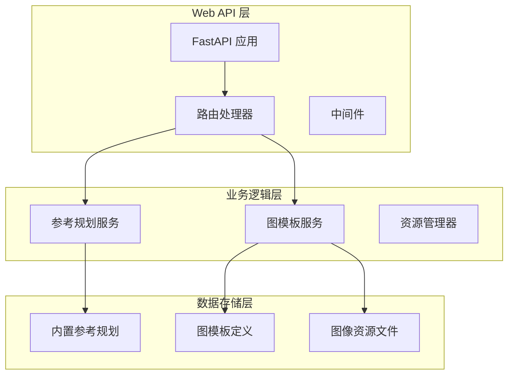
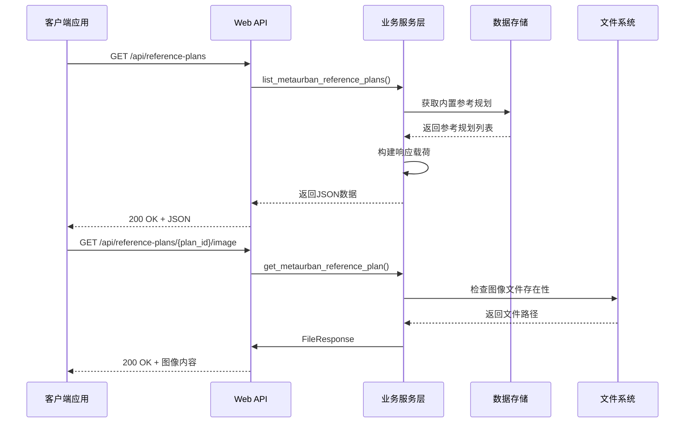
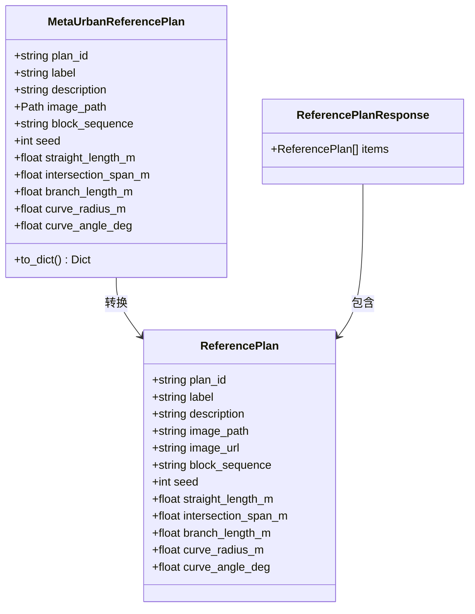
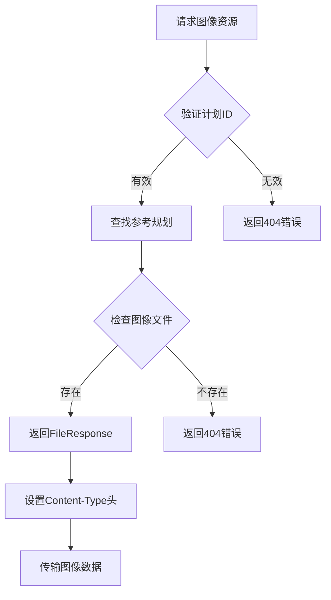
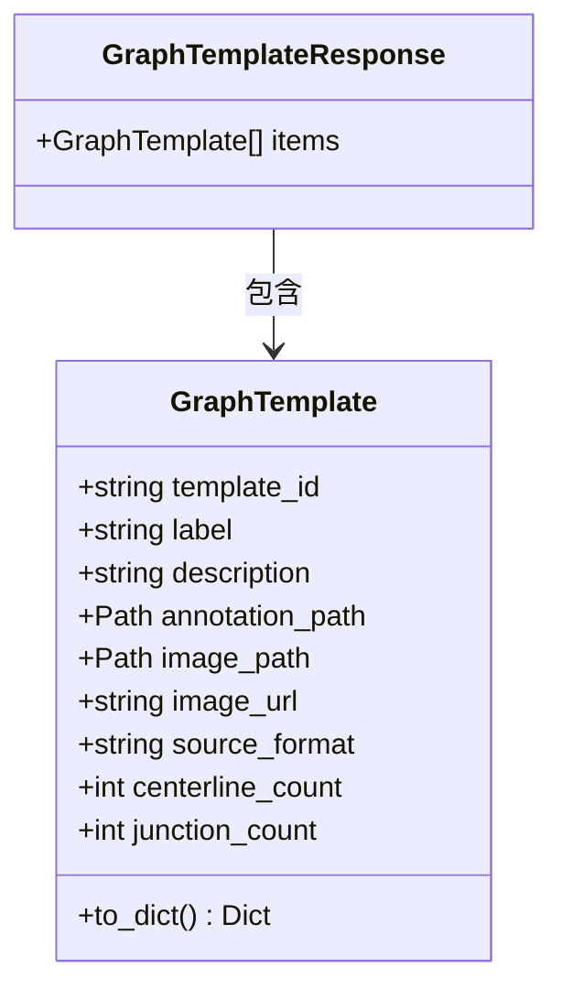
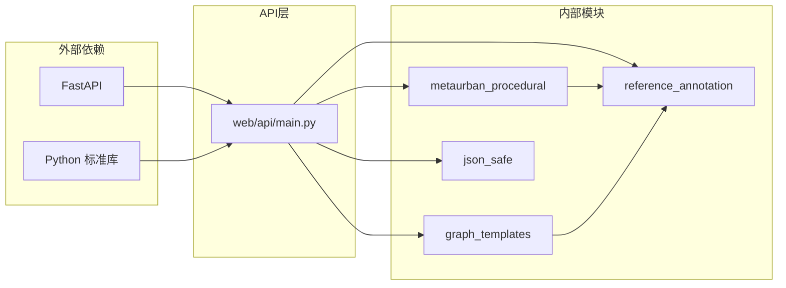

# 参考资源管理

<cite>
**本文档引用的文件**
- [web/api/main.py](file://web/api/main.py)
- [src/roadgen3d/metaurban_procedural.py](file://src/roadgen3d/metaurban_procedural.py)
- [src/roadgen3d/graph_templates.py](file://src/roadgen3d/graph_templates.py)
- [src/roadgen3d/reference_annotation.py](file://src/roadgen3d/reference_annotation.py)
- [assets/graph_templates/hkust_gz_gate/annotation.json](file://assets/graph_templates/hkust_gz_gate/annotation.json)
- [web/workbench/src/types.ts](file://web/workbench/src/types.ts)
- [web/workbench/src/app.ts](file://web/workbench/src/app.ts)
- [web/viewer/src/scene-graph.ts](file://web/viewer/src/scene-graph.ts)
- [web/viewer/vite.config.ts](file://web/viewer/vite.config.ts)
- [tests/test_design_api.py](file://tests/test_design_api.py)
</cite>

## 目录
1. [简介](#简介)
2. [项目结构](#项目结构)
3. [核心组件](#核心组件)
4. [架构概览](#架构概览)
5. [详细组件分析](#详细组件分析)
6. [依赖关系分析](#依赖关系分析)
7. [性能考虑](#性能考虑)
8. [故障排除指南](#故障排除指南)
9. [结论](#结论)

## 简介

参考资源管理API是RoadGen3D项目中用于管理和访问参考规划及图模板的核心接口系统。该系统提供了两种主要类型的参考资源：

1. **参考规划（Reference Plans）**：基于MetaUrban的程序化生成系统，提供预设的街道布局参考方案
2. **图模板（Graph Templates）**：结构化的道路网络模板，包含详细的几何信息和语义标注

这些API接口支持完整的资源生命周期管理，从资源发现、元数据查询到图像资源的获取和缓存策略优化。

## 项目结构

参考资源管理API位于项目的Web服务层，采用FastAPI框架构建，主要包含以下关键组件：



**图表来源**
- [web/api/main.py:1-286](file://web/api/main.py#L1-L286)
- [src/roadgen3d/metaurban_procedural.py:104-121](file://src/roadgen3d/metaurban_procedural.py#L104-L121)
- [src/roadgen3d/graph_templates.py:41-51](file://src/roadgen3d/graph_templates.py#L41-L51)

**章节来源**
- [web/api/main.py:81-142](file://web/api/main.py#L81-L142)

## 核心组件

### 参考规划系统

参考规划系统基于MetaUrban的程序化生成算法，提供预设的街道布局方案。每个参考规划包含：

- **元数据信息**：计划ID、标签、描述、种子值等
- **几何参数**：直线段长度、交叉口跨度、分支长度、曲线半径等
- **图像资源**：PNG格式的参考图像文件

### 图模板系统

图模板系统提供结构化的道路网络模板，支持更复杂的场景生成需求：

- **注释数据**：详细的几何和语义信息
- **中心线信息**：道路中心线的坐标和属性
- **节点连接**：交叉口和连接关系
- **设施标注**：街道家具和其他基础设施的位置

**章节来源**
- [src/roadgen3d/metaurban_procedural.py:82-121](file://src/roadgen3d/metaurban_procedural.py#L82-L121)
- [src/roadgen3d/graph_templates.py:78-93](file://src/roadgen3d/graph_templates.py#L78-L93)

## 架构概览

参考资源管理API采用分层架构设计，确保了良好的可维护性和扩展性：



**图表来源**
- [web/api/main.py:106-123](file://web/api/main.py#L106-L123)
- [src/roadgen3d/metaurban_procedural.py:164-176](file://src/roadgen3d/metaurban_procedural.py#L164-L176)

## 详细组件分析

### 参考规划API

#### 列出参考规划

**端点**: `GET /api/reference-plans`

该接口返回所有可用的参考规划列表，每个规划包含完整的元数据信息：



**图表来源**
- [src/roadgen3d/metaurban_procedural.py:82-101](file://src/roadgen3d/metaurban_procedural.py#L82-L101)
- [web/workbench/src/types.ts:60-73](file://web/workbench/src/types.ts#L60-L73)

#### 获取参考规划图像

**端点**: `GET /api/reference-plans/{plan_id}/image`

该接口提供指定参考规划的图像资源，支持浏览器直接显示和缓存：



**图表来源**
- [web/api/main.py:115-123](file://web/api/main.py#L115-L123)
- [src/roadgen3d/metaurban_procedural.py:170-176](file://src/roadgen3d/metaurban_procedural.py#L170-L176)

### 图模板API

#### 列出图模板

**端点**: `GET /api/graph-templates`

该接口返回所有内置的图模板列表，每个模板包含：



**图表来源**
- [src/roadgen3d/graph_templates.py:78-93](file://src/roadgen3d/graph_templates.py#L78-L93)
- [web/workbench/src/types.ts:79-89](file://web/workbench/src/types.ts#L79-L89)

#### 获取图模板图像

**端点**: `GET /api/graph-templates/{template_id}/image`

该接口提供图模板的可视化图像，支持缓存和CDN优化：

**章节来源**
- [web/api/main.py:125-142](file://web/api/main.py#L125-L142)
- [src/roadgen3d/graph_templates.py:102-105](file://src/roadgen3d/graph_templates.py#L102-L105)

### 数据模型和类型定义

#### 参考规划数据结构

参考规划在前端和后端都有对应的类型定义，确保数据一致性：

| 字段名 | 类型 | 描述 | 示例值 |
|--------|------|------|--------|
| plan_id | string | 规划唯一标识符 | "hkust_gz_gate" |
| label | string | 规划显示名称 | "HKUST-GZ Gate" |
| description | string | 规划详细描述 | "Approximate the HKUST(GZ) gate frontage..." |
| image_path | string | 图像文件路径 | "/assets/hkust-gz/image.png" |
| image_url | string | 图像访问URL | "/api/reference-plans/hkust_gz_gate/image" |
| block_sequence | string | 块序列 | "SXSOXS" |
| seed | number | 随机种子 | 17 |
| straight_length_m | number | 直线段长度(m) | 34.0 |
| intersection_span_m | number | 交叉口跨度(m) | 22.0 |
| branch_length_m | number | 分支长度(m) | 26.0 |
| curve_radius_m | number | 曲线半径(m) | 18.0 |
| curve_angle_deg | number | 曲线角度(deg) | 60.0 |

#### 图模板数据结构

图模板提供更丰富的几何和语义信息：

| 字段名 | 类型 | 描述 | 示例值 |
|--------|------|------|--------|
| template_id | string | 模板唯一标识符 | "hkust_gz_gate" |
| label | string | 模板显示名称 | "HKUST-GZ Gate Graph" |
| description | string | 模板详细描述 | "Checked-in street graph template..." |
| annotation_path | string | 注释文件路径 | "assets/graph_templates/hkust_gz_gate/annotation.json" |
| image_path | string | 图像文件路径 | "assets/hkust-gz/image.png" |
| image_url | string | 图像访问URL | "/api/graph-templates/hkust_gz_gate/image" |
| source_format | string | 数据源格式 | "roadgen3d_reference_annotation_v2" |
| centerline_count | number | 中心线数量 | 6 |
| junction_count | number | 交叉口数量 | 3 |

**章节来源**
- [web/workbench/src/types.ts:60-93](file://web/workbench/src/types.ts#L60-L93)
- [src/roadgen3d/reference_annotation.py:117-129](file://src/roadgen3d/reference_annotation.py#L117-L129)

## 依赖关系分析

参考资源管理API的依赖关系相对简单，主要依赖于内部的服务模块：



**图表来源**
- [web/api/main.py:21-29](file://web/api/main.py#L21-L29)

**章节来源**
- [web/api/main.py:14-29](file://web/api/main.py#L14-L29)

## 性能考虑

### 缓存策略

参考资源管理API采用了多层缓存策略来优化性能：

1. **服务器端缓存**：图模板加载使用LRU缓存，避免重复解析JSON文件
2. **客户端缓存**：图像资源支持HTTP缓存头，减少带宽消耗
3. **静态资源优化**：Vite开发服务器支持静态文件缓存

### 图像资源优化

- **格式支持**：支持PNG、JPEG、WEBP等多种图像格式
- **尺寸控制**：通过像素每米比例控制渲染精度
- **懒加载**：前端实现图片懒加载，提升页面性能

### 并发处理

API接口支持高并发访问，通过异步文件读取和流式传输优化大文件下载体验。

## 故障排除指南

### 常见问题和解决方案

#### 404错误处理

当请求不存在的参考规划或图模板时，API会返回404状态码：

```mermaid
flowchart TD
A[API请求] --> B{资源是否存在}
B --> |否| C[抛出HTTPException(404)]
B --> |是| D[正常处理请求]
C --> E[返回404错误响应]
```

**图表来源**
- [web/api/main.py:118-123](file://web/api/main.py#L118-L123)

#### 图像文件缺失

如果图像文件不存在，API会检查文件系统并返回相应的错误信息：

**章节来源**
- [tests/test_design_api.py:292-306](file://tests/test_design_api.py#L292-L306)

### 调试建议

1. **验证资源路径**：确保图像文件存在于指定的资产目录中
2. **检查权限设置**：确认Web服务器有读取文件的权限
3. **监控日志输出**：查看API服务器的错误日志以诊断问题

## 结论

参考资源管理API为RoadGen3D项目提供了完整而高效的参考资源管理系统。通过标准化的RESTful接口，用户可以轻松地发现、选择和使用各种参考规划和图模板资源。

该系统的主要优势包括：

- **模块化设计**：清晰的分层架构便于维护和扩展
- **类型安全**：前后端一致的数据类型定义确保数据完整性
- **性能优化**：多层缓存策略和流式传输提升用户体验
- **易于集成**：标准化的API接口便于第三方应用集成

未来可以考虑的功能增强包括：资源版本管理、批量操作接口、高级搜索过滤等功能，以进一步提升系统的实用性和灵活性。