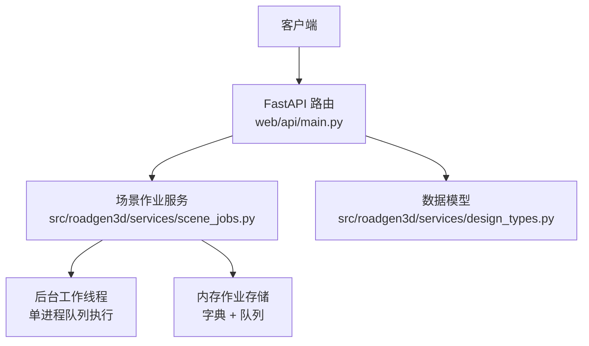
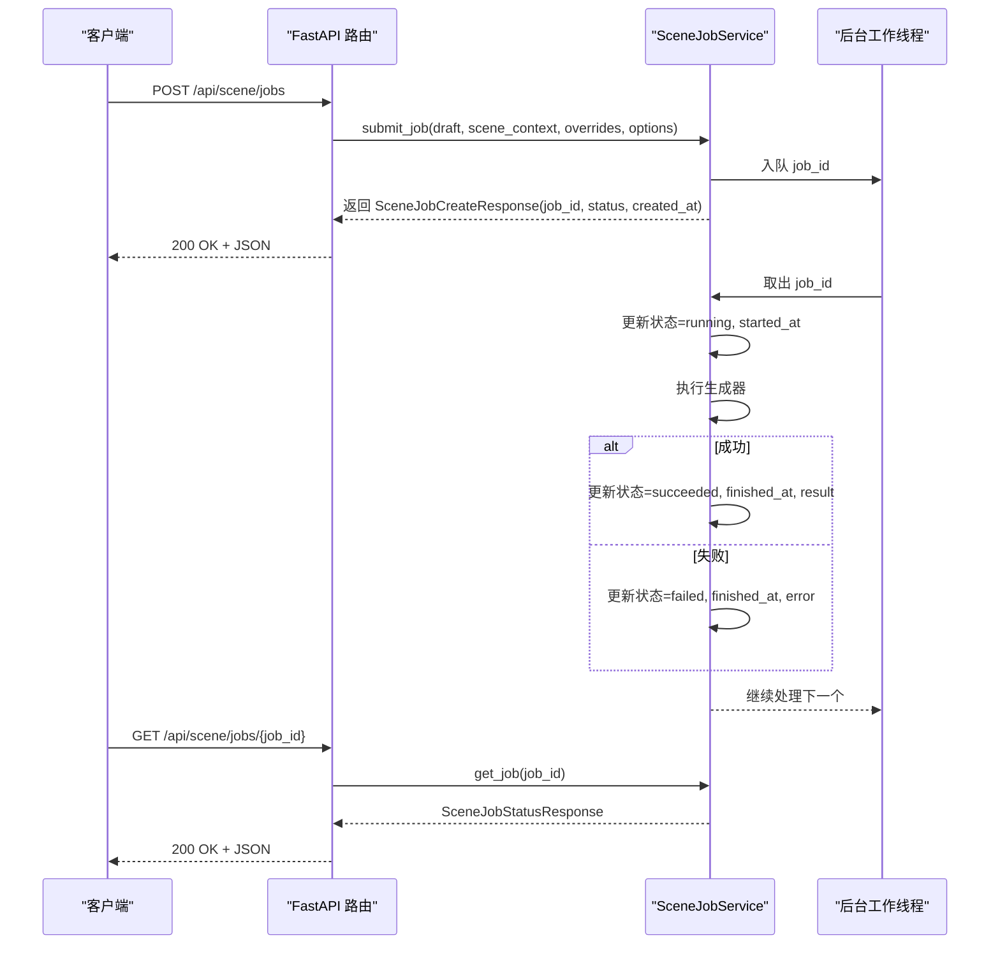
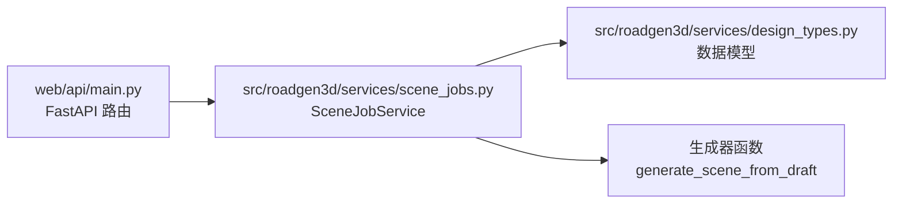
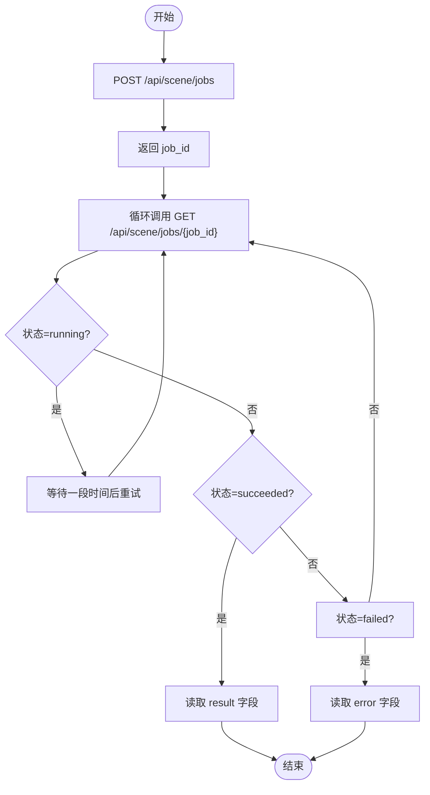

# 场景作业管理

<cite>
**本文引用的文件**
- [web/api/main.py](file://web/api/main.py)
- [src/roadgen3d/services/scene_jobs.py](file://src/roadgen3d/services/scene_jobs.py)
- [src/roadgen3d/services/design_types.py](file://src/roadgen3d/services/design_types.py)
- [tests/test_scene_jobs.py](file://tests/test_scene_jobs.py)
</cite>

## 目录
1. [简介](#简介)
2. [项目结构](#项目结构)
3. [核心组件](#核心组件)
4. [架构总览](#架构总览)
5. [详细组件分析](#详细组件分析)
6. [依赖关系分析](#依赖关系分析)
7. [性能与并发特性](#性能与并发特性)
8. [故障排查指南](#故障排查指南)
9. [结论](#结论)
10. [附录：接口规范与最佳实践](#附录接口规范与最佳实践)

## 简介
本文件面向“场景作业管理”API，系统性梳理并规范以下三个REST端点：
- POST /api/scene/jobs：提交异步场景生成作业
- GET /api/scene/jobs：列出最近作业（支持分页）
- GET /api/scene/jobs/{job_id}：查询指定作业状态

文档涵盖请求参数模型、响应数据结构、状态码定义、异步作业工作流、客户端实现建议、错误处理策略、超时与重试机制等。

## 项目结构
该功能由Web入口路由与作业服务两部分组成：
- Web层：在FastAPI应用中注册路由，负责参数校验、异常转换与JSON安全序列化
- 作业服务：在内存中维护作业队列、状态机与后台线程，完成实际生成任务

图表来源
- [web/api/main.py:188-215](file://web/api/main.py#L188-L215)
- [src/roadgen3d/services/scene_jobs.py:42-177](file://src/roadgen3d/services/scene_jobs.py#L42-L177)
- [src/roadgen3d/services/design_types.py:340-367](file://src/roadgen3d/services/design_types.py#L340-L367)

章节来源
- [web/api/main.py:188-215](file://web/api/main.py#L188-L215)
- [src/roadgen3d/services/scene_jobs.py:42-177](file://src/roadgen3d/services/scene_jobs.py#L42-L177)
- [src/roadgen3d/services/design_types.py:340-367](file://src/roadgen3d/services/design_types.py#L340-L367)

## 核心组件
- 请求模型
  - SceneJobCreateRequestModel：提交作业时的请求体
- 响应模型
  - SceneJobCreateResponse：作业创建成功后的返回
  - SceneJobStatusResponse：作业状态查询返回
  - SceneGenerationResult：作业完成后携带的生成结果
  - SceneRecord：最近场景列表项
- 作业服务
  - SceneJobService：作业提交、状态查询、列表、等待完成、后台执行

章节来源
- [web/api/main.py:53-58](file://web/api/main.py#L53-L58)
- [src/roadgen3d/services/design_types.py:340-367](file://src/roadgen3d/services/design_types.py#L340-L367)
- [src/roadgen3d/services/scene_jobs.py:42-177](file://src/roadgen3d/services/scene_jobs.py#L42-L177)

## 架构总览
异步作业生命周期：
1. 客户端调用POST /api/scene/jobs提交作业
2. 服务端接收请求，解析草稿与上下文，入队并返回作业ID
3. 后台线程从队列取出作业，更新状态为运行中并执行生成
4. 生成成功则写入结果，失败则记录错误
5. 客户端通过GET /api/scene/jobs/{job_id}轮询状态
6. 作业完成后可从最近场景列表或直接查询结果

图表来源
- [web/api/main.py:188-215](file://web/api/main.py#L188-L215)
- [src/roadgen3d/services/scene_jobs.py:57-177](file://src/roadgen3d/services/scene_jobs.py#L57-L177)

## 详细组件分析

### 接口一：POST /api/scene/jobs
- 方法与路径：POST /api/scene/jobs
- 功能：提交异步场景生成作业
- 请求体：SceneJobCreateRequestModel
- 响应体：SceneJobCreateResponse
- 状态码：
  - 200：成功
  - 400：运行时错误（如生成器抛出异常）
- 参数与校验：
  - draft：草稿对象（内部解析为DesignDraft）
  - scene_context：运行时场景上下文（模板/OSM/MetaUrban/图模板）
  - patch_overrides：参数覆盖映射
  - generation_options：生成选项映射

请求体模型 SceneJobCreateRequestModel 字段说明
- draft: Dict[str, Any] —— 设计草稿，包含标准化场景查询、参数补丁、引用等
- scene_context: Dict[str, Any] —— 运行时场景上下文，支持layout_mode、AOI、城市名、参考计划ID、图模板ID等
- patch_overrides: Dict[str, Any] —— 参数覆盖（键值对），用于临时修改生成参数
- generation_options: Dict[str, Any] —— 生成选项（键值对），用于控制生成行为

响应体模型 SceneJobCreateResponse 字段说明
- job_id: str —— 作业唯一标识
- status: str —— 当前状态（创建后为"queued"）
- created_at: str —— ISO时间字符串（UTC）

章节来源
- [web/api/main.py:53-58](file://web/api/main.py#L53-L58)
- [web/api/main.py:188-201](file://web/api/main.py#L188-L201)
- [src/roadgen3d/services/design_types.py:340-349](file://src/roadgen3d/services/design_types.py#L340-L349)

### 接口二：GET /api/scene/jobs
- 方法与路径：GET /api/scene/jobs
- 查询参数：
  - limit: int，默认20，范围[1,100]
- 功能：列出最近作业（按创建时间倒序）
- 响应体：包含items数组，每个元素为SceneJobStatusResponse
- 状态码：
  - 200：成功
- 注意：返回的items不包含result字段（仅状态）

响应体模型 SceneJobStatusResponse 字段说明
- job_id: str
- status: str —— "queued"|"running"|"succeeded"|"failed"
- created_at: str
- started_at: str —— 作业开始时间（运行中或已结束时填充）
- finished_at: str —— 作业结束时间（已结束时填充）
- error: str —— 失败原因（失败时填充）
- result: SceneGenerationResult | None —— 成功时填充

章节来源
- [web/api/main.py:203-207](file://web/api/main.py#L203-L207)
- [src/roadgen3d/services/design_types.py:352-367](file://src/roadgen3d/services/design_types.py#L352-L367)

### 接口三：GET /api/scene/jobs/{job_id}
- 方法与路径：GET /api/scene/jobs/{job_id}
- 路径参数：
  - job_id: str —— 作业ID
- 功能：查询指定作业的当前状态
- 响应体：SceneJobStatusResponse
- 状态码：
  - 200：成功
  - 404：作业不存在

章节来源
- [web/api/main.py:209-215](file://web/api/main.py#L209-L215)
- [src/roadgen3d/services/design_types.py:352-367](file://src/roadgen3d/services/design_types.py#L352-L367)

### 数据模型与类型
- DesignDraft：结构化设计草稿，包含标准化查询、参数补丁、引用等
- SceneContext：运行时场景上下文，支持多种布局模式与参数
- SceneGenerationResult：生成结果，包含布局与可视化文件路径、查看器URL、摘要等
- SceneRecord：最近场景记录，便于前端展示

章节来源
- [src/roadgen3d/services/design_types.py:177-240](file://src/roadgen3d/services/design_types.py#L177-L240)
- [src/roadgen3d/services/design_types.py:307-337](file://src/roadgen3d/services/design_types.py#L307-L337)

### 作业服务与后台执行
- 提交作业：生成唯一job_id，记录草稿、覆盖参数、生成选项与上下文，入队并通知等待者
- 状态流转：queued -> running -> succeeded 或 failed
- 后台线程：从队列取出作业，更新started_at，调用生成器，成功写入result，失败写入error
- 等待完成：Condition等待条件满足（succeeded或failed），支持可选超时

章节来源
- [src/roadgen3d/services/scene_jobs.py:57-177](file://src/roadgen3d/services/scene_jobs.py#L57-L177)

## 依赖关系分析
- Web路由依赖设计服务（DesignAssistantService）进行作业提交与查询
- 作业服务依赖生成器函数（默认generate_scene_from_draft）执行实际生成
- 数据模型来自design_types模块，确保前后端一致的序列化与反序列化

图表来源
- [web/api/main.py:188-215](file://web/api/main.py#L188-L215)
- [src/roadgen3d/services/scene_jobs.py:42-177](file://src/roadgen3d/services/scene_jobs.py#L42-L177)
- [src/roadgen3d/services/design_types.py:340-367](file://src/roadgen3d/services/design_types.py#L340-L367)

章节来源
- [web/api/main.py:188-215](file://web/api/main.py#L188-L215)
- [src/roadgen3d/services/scene_jobs.py:42-177](file://src/roadgen3d/services/scene_jobs.py#L42-L177)
- [src/roadgen3d/services/design_types.py:340-367](file://src/roadgen3d/services/design_types.py#L340-L367)

## 性能与并发特性
- 单进程内存队列：使用Queue与Condition实现线程安全的状态变更与通知
- 后台线程：守护线程持续从队列取任务，避免阻塞主线程
- 等待策略：wait_for_job支持可选超时，避免无限阻塞；默认轮询间隔约0.5秒
- 并发访问：通过Lock保护共享状态，Condition用于等待状态变化

章节来源
- [src/roadgen3d/services/scene_jobs.py:52-55](file://src/roadgen3d/services/scene_jobs.py#L52-L55)
- [src/roadgen3d/services/scene_jobs.py:102-113](file://src/roadgen3d/services/scene_jobs.py#L102-L113)

## 故障排查指南
- 400 错误（POST /api/scene/jobs）
  - 生成器抛出异常：服务端捕获并返回400，错误信息来自异常消息
  - 建议：检查草稿与上下文是否合法，参数覆盖是否有效
- 404 错误（GET /api/scene/jobs/{job_id}）
  - 作业ID不存在或已被清理
  - 建议：确认作业ID正确，或重新提交作业
- 作业长时间处于"queued"或"running"
  - 检查后台线程是否存活，确认生成器是否阻塞或异常
  - 建议：增加日志或监控，必要时重启服务
- 结果缺失
  - succeeded但result为空：服务端会抛出运行时错误（在同步等待时）
  - 建议：客户端在succeeded后仍需检查result字段存在性

章节来源
- [web/api/main.py:199-201](file://web/api/main.py#L199-L201)
- [web/api/main.py:213-215](file://web/api/main.py#L213-L215)
- [src/roadgen3d/services/scene_jobs.py:122-136](file://src/roadgen3d/services/scene_jobs.py#L122-L136)

## 结论
场景作业管理API采用“提交即返回”的异步模式，通过作业ID实现状态轮询与结果获取。其核心优势在于：
- 易于集成：简洁的请求/响应模型
- 可观测性：清晰的状态流转与错误信息
- 可扩展性：后台线程与队列便于替换为持久化任务队列

生产环境建议：
- 使用持久化队列（如Redis/数据库）替代内存队列
- 增加作业过期清理策略
- 实现指数退避的客户端重试逻辑
- 添加作业取消与优先级控制

## 附录：接口规范与最佳实践

### 接口规范总览
- POST /api/scene/jobs
  - 请求体：SceneJobCreateRequestModel
  - 响应体：SceneJobCreateResponse
  - 状态码：200, 400
- GET /api/scene/jobs
  - 查询参数：limit(int, 默认20, [1,100])
  - 响应体：包含items数组，元素为SceneJobStatusResponse
  - 状态码：200
- GET /api/scene/jobs/{job_id}
  - 路径参数：job_id(str)
  - 响应体：SceneJobStatusResponse
  - 状态码：200, 404

章节来源
- [web/api/main.py:53-58](file://web/api/main.py#L53-L58)
- [web/api/main.py:188-215](file://web/api/main.py#L188-L215)
- [src/roadgen3d/services/design_types.py:340-367](file://src/roadgen3d/services/design_types.py#L340-L367)

### 异步作业工作流程
- 创建作业：提交草稿与上下文，立即返回job_id
- 轮询状态：定期调用GET /api/scene/jobs/{job_id}
- 获取结果：当status为"succeeded"且result非空时，读取生成产物

图表来源
- [web/api/main.py:188-215](file://web/api/main.py#L188-L215)
- [src/roadgen3d/services/scene_jobs.py:102-113](file://src/roadgen3d/services/scene_jobs.py#L102-L113)

### 客户端实现要点
- 作业ID管理
  - 保存job_id并在后续轮询中复用
  - 对于批量提交，维护作业ID到业务实体的映射
- 状态检查
  - 初始阶段快速轮询（例如每秒1次），稳定后降低频率（例如每5-10秒）
  - 遇到"running"保持轮询，遇到"succeeded"停止轮询
- 结果解析
  - succeeded时读取result中的布局与可视化路径
  - 若result为空，应视为异常并提示用户重试或检查服务端日志
- 错误处理
  - 404：作业不存在或已过期，提示用户重新提交
  - 400：服务端错误，显示错误信息并允许用户重试
  - 5xx：网络或服务异常，建议指数退避重试
- 超时与重试
  - 设置最大轮询次数或总超时时间
  - 失败重试采用指数退避（如1s, 2s, 4s, 8s），上限不超过10-30s
  - 避免过于频繁的轮询导致服务压力

章节来源
- [tests/test_scene_jobs.py:60-68](file://tests/test_scene_jobs.py#L60-L68)
- [src/roadgen3d/services/scene_jobs.py:102-113](file://src/roadgen3d/services/scene_jobs.py#L102-L113)