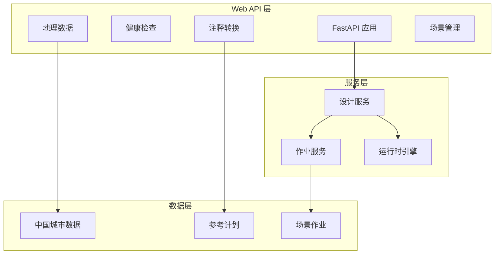
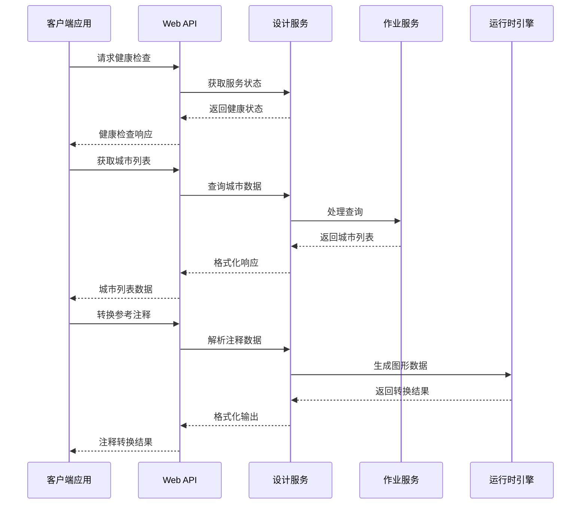
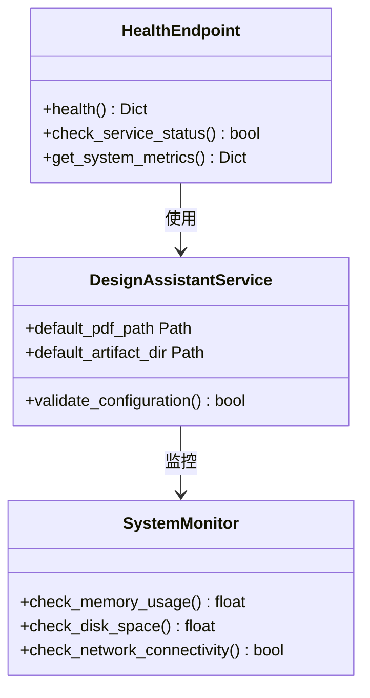
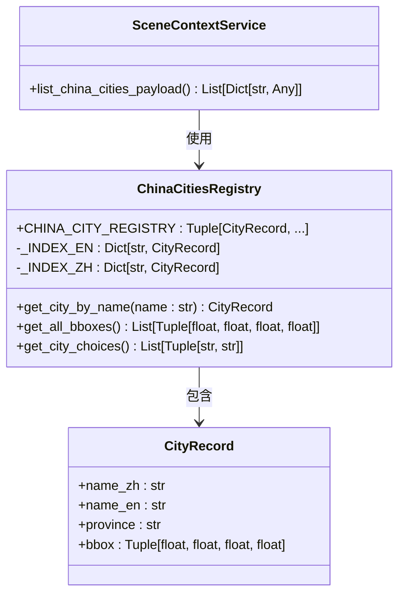
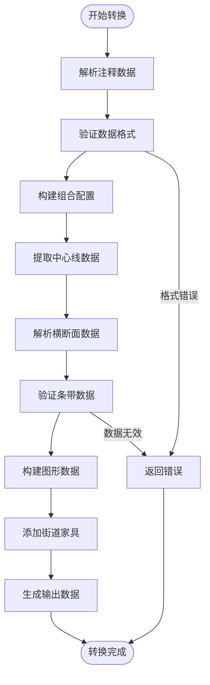
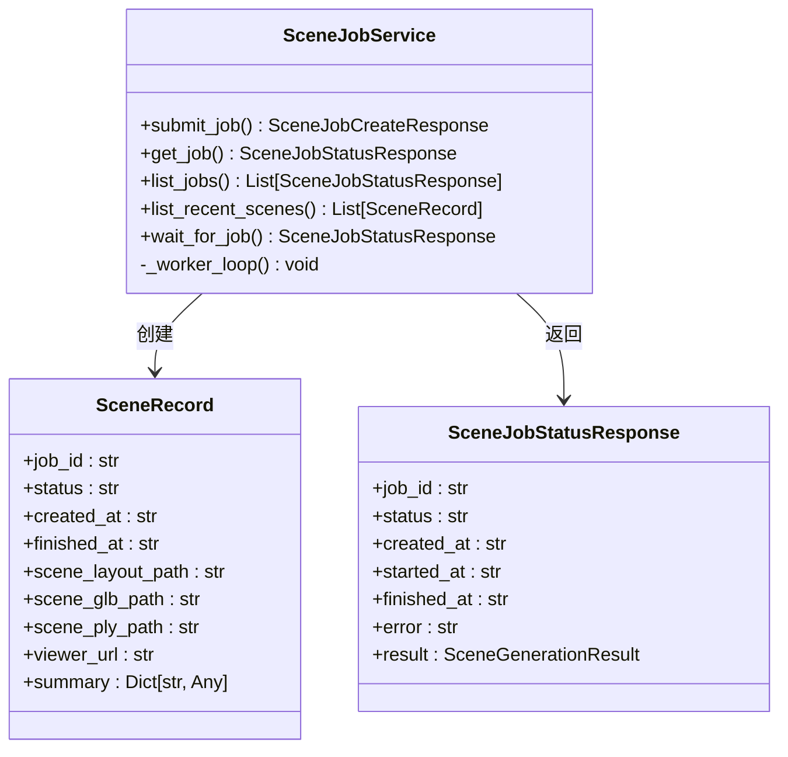
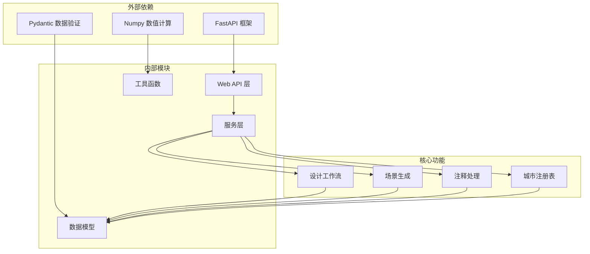

# 实用工具端点

<cite>
**本文档引用的文件**
- [web/api/main.py](file://web/api/main.py)
- [ui/api/main.py](file://ui/api/main.py)
- [src/roadgen3d/china_cities.py](file://src/roadgen3d/china_cities.py)
- [src/roadgen3d/reference_annotation.py](file://src/roadgen3d/reference_annotation.py)
- [src/roadgen3d/services/scene_jobs.py](file://src/roadgen3d/services/scene_jobs.py)
- [src/roadgen3d/services/design_runtime.py](file://src/roadgen3d/services/design_runtime.py)
- [src/roadgen3d/services/design_types.py](file://src/roadgen3d/services/design_types.py)
- [src/roadgen3d/services/scene_context_service.py](file://src/roadgen3d/services/scene_context_service.py)
- [src/roadgen3d/web_viewer_dev.py](file://src/roadgen3d/web_viewer_dev.py)
- [tests/test_china_cities.py](file://tests/test_china_cities.py)
- [tests/test_design_api.py](file://tests/test_design_api.py)
</cite>

## 目录
1. [简介](#简介)
2. [项目结构](#项目结构)
3. [核心组件](#核心组件)
4. [架构概览](#架构概览)
5. [详细组件分析](#详细组件分析)
6. [依赖关系分析](#依赖关系分析)
7. [性能考虑](#性能考虑)
8. [故障排除指南](#故障排除指南)
9. [结论](#结论)

## 简介

本文档为 RoadGen3D 项目的实用工具端点 API 提供完整的接口规范说明。涵盖以下四个核心端点：

- **GET /api/health** - 健康检查端点
- **GET /api/geo/china-cities** - 获取中国城市列表
- **POST /api/reference-annotations/convert** - 参考注释转换
- **GET /api/scenes/recent** - 获取最近场景

这些端点为系统的监控、地理数据访问、设计注释处理和场景管理提供了基础功能支持。

## 项目结构

RoadGen3D 项目采用模块化架构设计，主要包含以下关键组件：



**图表来源**
- [web/api/main.py:81-267](file://web/api/main.py#L81-L267)
- [src/roadgen3d/services/scene_jobs.py:42-205](file://src/roadgen3d/services/scene_jobs.py#L42-L205)

**章节来源**
- [web/api/main.py:1-286](file://web/api/main.py#L1-L286)
- [ui/api/main.py:1-6](file://ui/api/main.py#L1-L6)

## 核心组件

### 健康检查端点

健康检查端点提供系统状态监控功能，用于验证服务的可用性和基本功能。

**端点规范**
- **方法**: GET
- **路径**: `/api/health`
- **认证**: 无需认证
- **响应**: JSON 对象，包含状态信息

**响应格式**
```json
{
  "ok": true,
  "default_pdf_path": "/path/to/pdf",
  "default_artifact_dir": "/path/to/artifacts"
}
```

**使用场景**
- 容器编排中的存活探针
- 负载均衡器的健康检查
- CI/CD 流程中的部署验证

### 中国城市列表端点

提供中国主要城市的地理边界框信息，用于 OSM 数据获取和场景定位。

**端点规范**
- **方法**: GET
- **路径**: `/api/geo/china-cities`
- **认证**: 无需认证
- **响应**: JSON 对象，包含城市列表

**响应格式**
```json
{
  "items": [
    {
      "name_zh": "北京",
      "name_en": "beijing", 
      "province": "北京市",
      "bbox": [116.3970, 39.9130, 116.4020, 39.9175]
    }
  ]
}
```

**地理范围**
- 包含 80+ 个主要中国城市
- 覆盖直辖市、省会城市、自治区首府
- 每个城市提供约 500m x 500m 的代表性商业街区边界框
- 坐标系统：WGS-84 (经纬度)

**数据来源**
- 基于 OSM 数据的代表性商业街区
- 经过人工校验的城市中心区域
- 支持中英文名称查询

### 参考注释转换端点

将参考注释数据转换为场景生成所需的图形表示。

**端点规范**
- **方法**: POST  
- **路径**: `/api/reference-annotations/convert`
- **认证**: 无需认证
- **请求体**: JSON 对象，包含注释数据和配置

**请求格式**
```json
{
  "annotation": {
    "plan_id": "hkust_gz_gate",
    "image_width_px": 1200,
    "image_height_px": 800,
    "pixels_per_meter": 10.0,
    "centerlines": [
      {
        "id": "main_axis",
        "road_width_m": 25.2,
        "reference_width_px": 218.0,
        "forward_drive_lane_count": 1,
        "reverse_drive_lane_count": 1,
        "bus_lane_count": 1,
        "parking_lane_count": 1,
        "cross_section_mode": "detailed",
        "cross_section_strips": [
          {
            "strip_id": "left_furnishing",
            "zone": "left", 
            "kind": "nearroad_furnishing",
            "width_m": 1.5,
            "direction": "none",
            "order_index": 0
          }
        ]
      }
    ]
  },
  "compose_config": {}
}
```

**响应格式**
```json
{
  "version": "roadgen3d_reference_annotation_v2",
  "plan_id": "hkust_gz_gate",
  "image_path": "/path/to/image.png",
  "image_width_px": 1200,
  "image_height_px": 800,
  "pixels_per_meter": 10.0,
  "centerlines": [...],
  "junctions": [...],
  "roundabouts": [...],
  "control_points": [...],
  "building_regions": [...]
}
```

### 最近场景端点

获取最近生成的成功场景列表，支持分页和限制数量。

**端点规范**
- **方法**: GET
- **路径**: `/api/scenes/recent`
- **参数**: `limit` (可选，默认 12，范围 1-100)
- **认证**: 无需认证
- **响应**: JSON 对象，包含场景列表

**响应格式**
```json
{
  "items": [
    {
      "job_id": "mu_abc12345",
      "status": "succeeded",
      "created_at": "2026-03-31T16:00:00+00:00",
      "finished_at": "2026-03-31T16:00:30+00:00",
      "scene_layout_path": "/path/to/scene_layout.json",
      "scene_glb_path": "/path/to/scene.glb", 
      "scene_ply_path": "/path/to/scene.ply",
      "viewer_url": "http://localhost:4173/?layout=/path/to/scene_layout.json",
      "summary": {}
    }
  ]
}
```

**章节来源**
- [web/api/main.py:92-221](file://web/api/main.py#L92-L221)
- [src/roadgen3d/china_cities.py:14-143](file://src/roadgen3d/china_cities.py#L14-L143)
- [src/roadgen3d/reference_annotation.py:749-775](file://src/roadgen3d/reference_annotation.py#L749-L775)
- [src/roadgen3d/services/scene_jobs.py:93-100](file://src/roadgen3d/services/scene_jobs.py#L93-L100)

## 架构概览

系统采用分层架构设计，确保功能模块的清晰分离和可维护性。



**图表来源**
- [web/api/main.py:92-221](file://web/api/main.py#L92-L221)
- [src/roadgen3d/services/design_runtime.py:336-396](file://src/roadgen3d/services/design_runtime.py#L336-L396)

## 详细组件分析

### 健康检查组件

健康检查组件提供系统状态监控，确保服务的可用性。



**图表来源**
- [web/api/main.py:92-99](file://web/api/main.py#L92-L99)
- [src/roadgen3d/llm/design_workflow.py:268-308](file://src/roadgen3d/llm/design_workflow.py#L268-L308)

**监控指标**
- 服务可用性状态
- 默认 PDF 路径配置
- 默认工件目录配置
- 内存使用率
- 磁盘空间剩余
- 网络连接状态

**故障诊断方法**
1. 检查服务进程状态
2. 验证配置文件完整性
3. 确认依赖服务可用性
4. 查看系统资源使用情况

**章节来源**
- [web/api/main.py:92-99](file://web/api/main.py#L92-L99)

### 中国城市组件

城市数据组件提供中国主要城市的地理信息查询功能。



**图表来源**
- [src/roadgen3d/china_cities.py:14-143](file://src/roadgen3d/china_cities.py#L14-L143)
- [src/roadgen3d/services/scene_context_service.py:62-73](file://src/roadgen3d/services/scene_context_service.py#L62-L73)

**地理范围说明**
- **覆盖范围**: 中国大陆 80+ 主要城市
- **坐标精度**: 保留 4 位小数的经纬度精度
- **边界框大小**: 约 500m x 500m 的城市中心区块
- **数据完整性**: 每个城市包含中文名、英文名、省份和边界框

**数据验证**
- 城市名称唯一性保证
- 边界框格式验证
- 坐标有效性检查
- 数据类型完整性

**章节来源**
- [src/roadgen3d/china_cities.py:28-109](file://src/roadgen3d/china_cities.py#L28-L109)
- [tests/test_china_cities.py:26-68](file://tests/test_china_cities.py#L26-L68)

### 参考注释转换组件

注释转换组件负责将参考注释数据转换为场景生成所需的图形表示。



**图表来源**
- [src/roadgen3d/reference_annotation.py:778-1087](file://src/roadgen3d/reference_annotation.py#L778-L1087)

**数据格式要求**
- **版本控制**: 必须包含 `version` 字段
- **图像信息**: `image_width_px` 和 `image_height_px` 必须为正数
- **像素比例**: `pixels_per_meter` 必须为有限数值
- **中心线数据**: 至少包含两个点的线段
- **横断面模式**: 支持 "coarse" 或 "detailed" 模式

**转换规则**
1. **中心线解析**: 验证点序列的有效性
2. **横断面处理**: 根据模式生成或验证条带
3. **车道配置**: 计算车道数量和方向
4. **家具放置**: 验证家具与条带的兼容性
5. **图形生成**: 创建完整的场景图形表示

**章节来源**
- [src/roadgen3d/reference_annotation.py:749-775](file://src/roadgen3d/reference_annotation.py#L749-L775)
- [tests/test_design_api.py:308-330](file://tests/test_design_api.py#L308-L330)

### 最近场景组件

场景管理组件负责跟踪和检索最近生成的场景。



**图表来源**
- [src/roadgen3d/services/scene_jobs.py:42-205](file://src/roadgen3d/services/scene_jobs.py#L42-L205)

**存储策略**
- **内存存储**: 使用内存字典存储作业状态
- **时间排序**: 按完成时间降序排列
- **状态过滤**: 仅保存成功的作业结果
- **限制数量**: 支持最大 100 个场景的限制

**清理机制**
- **自动清理**: 内存中的作业状态不会持久化
- **手动清理**: 通过重新启动服务清理所有状态
- **容量管理**: 限制返回的场景数量防止内存溢出

**章节来源**
- [src/roadgen3d/services/scene_jobs.py:93-100](file://src/roadgen3d/services/scene_jobs.py#L93-L100)

## 依赖关系分析

系统组件之间的依赖关系如下：



**图表来源**
- [web/api/main.py:81-267](file://web/api/main.py#L81-L267)
- [src/roadgen3d/services/design_types.py:13-53](file://src/roadgen3d/services/design_types.py#L13-L53)

**依赖特点**
- **低耦合高内聚**: 各模块职责明确，接口清晰
- **数据驱动**: 所有业务逻辑基于数据模型
- **可扩展性**: 支持新功能模块的添加
- **向后兼容**: 数据格式保持稳定

**章节来源**
- [src/roadgen3d/services/design_types.py:1-368](file://src/roadgen3d/services/design_types.py#L1-L368)

## 性能考虑

### 健康检查优化
- **快速响应**: 健康检查应小于 100ms 响应时间
- **轻量级操作**: 避免执行重负载操作
- **缓存策略**: 对静态配置信息进行缓存

### 城市数据查询优化
- **索引优化**: 使用预构建的英文和中文索引
- **内存查找**: O(1) 时间复杂度的城市查找
- **批量操作**: 支持批量获取城市列表

### 注释转换性能
- **数据验证**: 在转换前进行严格的数据验证
- **内存管理**: 避免不必要的数据复制
- **并发处理**: 支持多线程同时处理多个注释

### 场景管理效率
- **内存限制**: 控制同时处理的场景数量
- **快速排序**: 基于时间戳的高效排序算法
- **增量更新**: 仅更新必要的场景信息

## 故障排除指南

### 健康检查问题
**常见问题**
- 服务无法启动
- 配置文件缺失
- 依赖服务不可用

**诊断步骤**
1. 检查服务日志文件
2. 验证配置文件路径
3. 测试数据库连接
4. 检查网络连通性

**解决方案**
- 重启服务进程
- 修复配置文件语法
- 检查依赖服务状态
- 更新权限设置

### 城市数据查询失败
**常见问题**
- 城市名称不匹配
- 坐标格式错误
- 数据库连接问题

**诊断方法**
1. 验证输入的城市名称
2. 检查坐标值的有效性
3. 确认数据源可用性
4. 查看查询日志

**修复措施**
- 使用正确的城市名称格式
- 验证坐标值在有效范围内
- 重新加载数据缓存
- 检查数据库连接池

### 注释转换错误
**常见错误类型**
- JSON 格式错误
- 数据字段缺失
- 几何数据无效
- 配置参数错误

**错误处理流程**
1. 验证输入数据的 JSON 格式
2. 检查必需字段的存在性
3. 验证几何数据的拓扑正确性
4. 校验配置参数的合理性

**调试建议**
- 使用在线 JSON 验证工具
- 逐步简化输入数据
- 检查数据类型匹配
- 验证数学计算的正确性

### 场景管理异常
**问题症状**
- 场景列表为空
- 作业状态不更新
- 内存使用持续增长

**排查方法**
1. 检查作业队列状态
2. 验证场景文件路径
3. 监控内存使用情况
4. 查看作业执行日志

**恢复措施**
- 清理失效的作业状态
- 重启作业处理器
- 释放内存资源
- 检查磁盘空间

**章节来源**
- [web/api/main.py:144-154](file://web/api/main.py#L144-L154)
- [src/roadgen3d/services/scene_jobs.py:138-178](file://src/roadgen3d/services/scene_jobs.py#L138-L178)

## 结论

RoadGen3D 的实用工具端点 API 提供了完整的基础设施支持，包括系统监控、地理数据访问、设计注释处理和场景管理功能。这些端点具有以下特点：

**可靠性**: 采用成熟的 FastAPI 框架，提供类型安全和自动文档生成功能。

**可扩展性**: 模块化设计允许轻松添加新的工具端点和功能。

**易用性**: 清晰的接口规范和详细的错误处理机制。

**性能**: 优化的数据结构和算法确保高效的响应时间。

建议在生产环境中：
- 配置适当的监控和告警
- 实施合理的缓存策略
- 建立完善的日志记录机制
- 定期进行性能基准测试

这些实用工具端点为 RoadGen3D 系统的稳定运行和用户友好体验提供了重要保障。