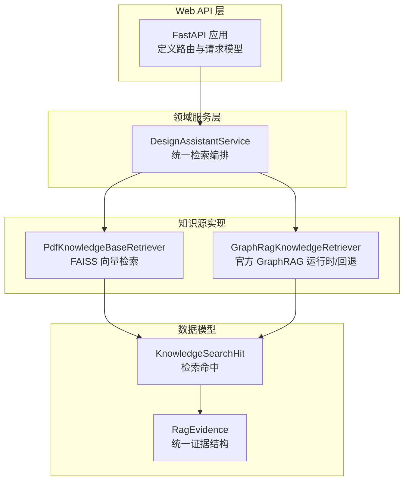
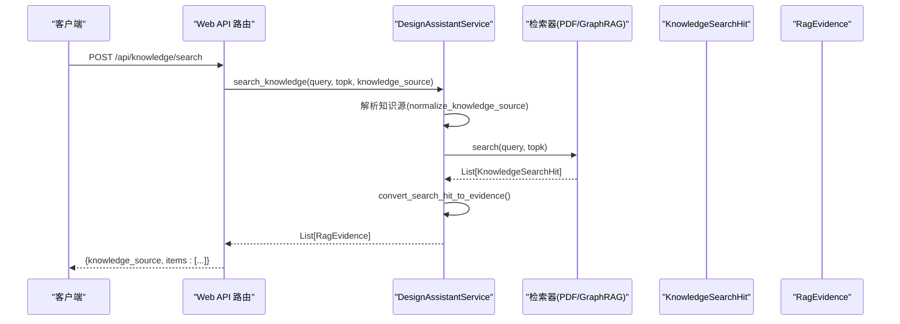
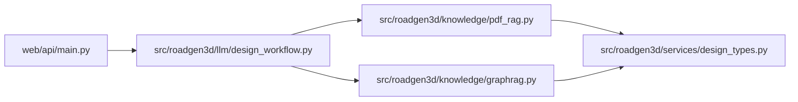

# 知识检索服务

<cite>
**本文引用的文件**
- [web/api/main.py](file://web/api/main.py)
- [src/roadgen3d/llm/design_workflow.py](file://src/roadgen3d/llm/design_workflow.py)
- [src/roadgen3d/knowledge/pdf_rag.py](file://src/roadgen3d/knowledge/pdf_rag.py)
- [src/roadgen3d/knowledge/graphrag.py](file://src/roadgen3d/knowledge/graphrag.py)
- [src/roadgen3d/services/design_types.py](file://src/roadgen3d/services/design_types.py)
- [scripts/knowledge/build_pdf_knowledge_base.py](file://scripts/knowledge/build_pdf_knowledge_base.py)
- [scripts/knowledge/rebuild_graphrag_runtime.py](file://scripts/knowledge/rebuild_graphrag_runtime.py)
- [tests/test_design_api.py](file://tests/test_design_api.py)
</cite>

## 目录
1. [简介](#简介)
2. [项目结构](#项目结构)
3. [核心组件](#核心组件)
4. [架构总览](#架构总览)
5. [详细组件分析](#详细组件分析)
6. [依赖分析](#依赖分析)
7. [性能考量](#性能考量)
8. [故障排查指南](#故障排查指南)
9. [结论](#结论)
10. [附录](#附录)

## 简介
本文件为 RoadGen3D 设计助手中的“知识检索服务”API提供完整接口文档，覆盖以下三个核心接口：
- GET /api/knowledge/sources：列举可用的知识源（hybrid、pdf_rag、graph_rag）
- POST /api/knowledge/search：执行知识检索，支持多源融合与排序
- POST /api/knowledge/rebuild：重建 PDF 文档知识库

文档同时解释了 KnowledgeSearchRequestModel 与 KnowledgeRebuildRequestModel 的参数、响应数据结构、不同知识源的特点与适用场景、搜索最佳实践、重建触发条件与配置项，并提供具体调用示例与性能优化建议。

## 项目结构
知识检索服务位于 Web API 层与领域服务层之间，Web API 定义请求模型与路由，领域服务负责解析与调度检索器，底层分别对接 PDF RAG 与 GraphRAG 检索能力。

图表来源
- [web/api/main.py:223-253](file://web/api/main.py#L223-L253)
- [src/roadgen3d/llm/design_workflow.py:507-744](file://src/roadgen3d/llm/design_workflow.py#L507-L744)
- [src/roadgen3d/knowledge/pdf_rag.py:344-423](file://src/roadgen3d/knowledge/pdf_rag.py#L344-L423)
- [src/roadgen3d/knowledge/graphrag.py:230-423](file://src/roadgen3d/knowledge/graphrag.py#L230-L423)
- [src/roadgen3d/services/design_types.py:157-174](file://src/roadgen3d/services/design_types.py#L157-L174)

章节来源
- [web/api/main.py:223-253](file://web/api/main.py#L223-L253)
- [src/roadgen3d/llm/design_workflow.py:507-744](file://src/roadgen3d/llm/design_workflow.py#L507-L744)

## 核心组件
- 请求模型
  - KnowledgeSearchRequestModel：包含 query、topk、knowledge_source
  - KnowledgeRebuildRequestModel：包含 pdf_path、artifact_dir
- 响应模型
  - 统一证据结构 RagEvidence：包含 chunk_id、doc_id、section_title、page_start/page_end、text、source_path、score、relevance_reason、knowledge_source、parameter_hints
  - 搜索命中 KnowledgeSearchHit：包含 chunk（KnowledgeChunk）与 score
- 检索器
  - PdfKnowledgeBaseRetriever：基于 FAISS 的向量检索
  - GraphRagKnowledgeRetriever：优先官方运行时，否则回退到合并文本
- 编排服务
  - DesignAssistantService：解析知识源、编排检索、转换证据

章节来源
- [web/api/main.py:60-69](file://web/api/main.py#L60-L69)
- [src/roadgen3d/services/design_types.py:157-174](file://src/roadgen3d/services/design_types.py#L157-L174)
- [src/roadgen3d/knowledge/pdf_rag.py:146-154](file://src/roadgen3d/knowledge/pdf_rag.py#L146-L154)
- [src/roadgen3d/knowledge/graphrag.py:194-216](file://src/roadgen3d/knowledge/graphrag.py#L194-L216)
- [src/roadgen3d/llm/design_workflow.py:507-744](file://src/roadgen3d/llm/design_workflow.py#L507-L744)

## 架构总览
下图展示从 Web API 到检索器再到证据输出的整体流程。

图表来源
- [web/api/main.py:239-253](file://web/api/main.py#L239-L253)
- [src/roadgen3d/llm/design_workflow.py:507-744](file://src/roadgen3d/llm/design_workflow.py#L507-L744)
- [src/roadgen3d/knowledge/pdf_rag.py:409-422](file://src/roadgen3d/knowledge/pdf_rag.py#L409-L422)
- [src/roadgen3d/knowledge/graphrag.py:403-422](file://src/roadgen3d/knowledge/graphrag.py#L403-L422)

## 详细组件分析

### 接口：GET /api/knowledge/sources
- 功能：返回可用知识源列表，包含 hybrid、pdf_rag、graph_rag
- 返回字段：
  - items：数组，每个元素包含
    - key：知识源键值（hybrid/pdf_rag/graph_rag）
    - label：显示名称
    - available：是否可用
    - description：描述
    - artifact_count/item_count：资源数量统计
    - 其他状态字段（如 last_build_status、runtime_error 等，视具体源而定）

- 可用性判定逻辑
  - hybrid：当 pdf 与 graph 任一可用即整体可用
  - pdf_rag：默认 PDF 文档知识库构建产物存在
  - graph_rag：GraphRAG 快速开始项目存在且可运行或有合并文本回退

章节来源
- [web/api/main.py:234-237](file://web/api/main.py#L234-L237)
- [src/roadgen3d/llm/design_workflow.py:241-253](file://src/roadgen3d/llm/design_workflow.py#L241-L253)
- [src/roadgen3d/knowledge/graphrag.py:269-338](file://src/roadgen3d/knowledge/graphrag.py#L269-L338)

### 接口：POST /api/knowledge/search
- 功能：根据查询词在指定知识源中检索，返回证据列表
- 请求体：KnowledgeSearchRequestModel
  - query：必填，查询字符串
  - topk：可选，默认 6，返回前 k 条
  - knowledge_source：可选，默认 graph_rag，允许值 hybrid/pdf_rag/graph_rag
- 响应体：
  - knowledge_source：实际使用的知识源
  - items：数组，每项为 RagEvidence 对象

- 检索流程
  - 解析知识源（normalize_knowledge_source）
  - 获取对应检索器（hybrid 会串联多个源）
  - 执行 search 并去重排序
  - 转换为 RagEvidence（包含参数提示、相关性理由等）

- 搜索结果格式（RagEvidence）
  - chunk_id/doc_id/section_title/page_start/page_end/text/source_path/score/relevance_reason/knowledge_source/parameter_hints

- 知识源特点与适用场景
  - hybrid：合并 PDF 与 GraphRAG，适合需要跨源互补的综合检索
  - pdf_rag：面向 PDF 文档的向量检索，适合条款、规范类内容
  - graph_rag：面向图谱化社区报告与文本单元，适合语义关联与长文本摘要

章节来源
- [web/api/main.py:239-253](file://web/api/main.py#L239-L253)
- [src/roadgen3d/llm/design_workflow.py:507-744](file://src/roadgen3d/llm/design_workflow.py#L507-L744)
- [src/roadgen3d/services/design_types.py:157-174](file://src/roadgen3d/services/design_types.py#L157-L174)
- [src/roadgen3d/knowledge/pdf_rag.py:409-422](file://src/roadgen3d/knowledge/pdf_rag.py#L409-L422)
- [src/roadgen3d/knowledge/graphrag.py:403-422](file://src/roadgen3d/knowledge/graphrag.py#L403-L422)

### 接口：POST /api/knowledge/rebuild
- 功能：重建 PDF 文档知识库（构建 chunks、embeddings、FAISS 索引）
- 请求体：KnowledgeRebuildRequestModel
  - pdf_path：可选，PDF 文件路径
  - artifact_dir：可选，输出目录
- 响应体：KnowledgeBuildArtifacts（包含构建产物元信息）

- 失败回退策略
  - 若首选嵌入器失败，自动回退到本地 CLIP 嵌入器进行构建
- 触发条件
  - 新增/更新 PDF 文档后
  - 嵌入维度或索引损坏
  - 需要调整分块大小/重叠参数

章节来源
- [web/api/main.py:223-233](file://web/api/main.py#L223-L233)
- [src/roadgen3d/llm/design_workflow.py:90-110](file://src/roadgen3d/llm/design_workflow.py#L90-L110)
- [scripts/knowledge/build_pdf_knowledge_base.py:52-87](file://scripts/knowledge/build_pdf_knowledge_base.py#L52-L87)

### 数据模型与转换

#### KnowledgeSearchRequestModel
- 字段
  - query：字符串，必填
  - topk：整数，默认 6
  - knowledge_source：字符串，默认 graph_rag，允许 hybrid/pdf_rag/graph_rag

章节来源
- [web/api/main.py:65-69](file://web/api/main.py#L65-L69)

#### KnowledgeRebuildRequestModel
- 字段
  - pdf_path：字符串，可选
  - artifact_dir：字符串，可选

章节来源
- [web/api/main.py:60-63](file://web/api/main.py#L60-L63)

#### KnowledgeSearchHit 与 KnowledgeChunk
- KnowledgeSearchHit
  - chunk：KnowledgeChunk
  - score：浮点数
- KnowledgeChunk
  - chunk_id/doc_id/section_title/page_start/page_end/text/source_path

章节来源
- [src/roadgen3d/knowledge/pdf_rag.py:146-154](file://src/roadgen3d/knowledge/pdf_rag.py#L146-L154)
- [src/roadgen3d/knowledge/pdf_rag.py:116-128](file://src/roadgen3d/knowledge/pdf_rag.py#L116-L128)

#### RagEvidence
- 字段
  - chunk_id/doc_id/section_title/page_start/page_end/text/source_path/score/relevance_reason/knowledge_source/parameter_hints

章节来源
- [src/roadgen3d/services/design_types.py:157-174](file://src/roadgen3d/services/design_types.py#L157-L174)

#### 搜索命中转换
- convert_search_hit_to_evidence 将 KnowledgeSearchHit 转换为 RagEvidence，并注入参数提示与相关性理由

章节来源
- [src/roadgen3d/llm/design_workflow.py:704-723](file://src/roadgen3d/llm/design_workflow.py#L704-L723)

### 检索器实现要点

#### PdfKnowledgeBaseRetriever
- 使用 FAISS IndexFlatIP 进行余弦相似度检索
- 支持 Sentence-Transformers 或 CLIP 嵌入器
- 检索流程：编码查询向量 → 搜索 topk → 构造 RagEvidence

章节来源
- [src/roadgen3d/knowledge/pdf_rag.py:344-423](file://src/roadgen3d/knowledge/pdf_rag.py#L344-L423)

#### GraphRagKnowledgeRetriever
- 优先使用官方 GraphRAG 运行时（local/basic），若不可用则回退到合并文本
- 描述状态：包含 artifact_count、item_count、runtime_mode、needs_rebuild、last_build_status、runtime_error 等
- 检索流程：尝试官方运行时 → 回退到文本记录 → 构造 RagEvidence

章节来源
- [src/roadgen3d/knowledge/graphrag.py:230-423](file://src/roadgen3d/knowledge/graphrag.py#L230-L423)
- [src/roadgen3d/knowledge/graphrag.py:459-590](file://src/roadgen3d/knowledge/graphrag.py#L459-L590)

### 搜索最佳实践
- 查询词优化
  - 明确目标：尽量包含“地点/设施/规范条文”等关键实体
  - 结构化表达：将“宽度/高度/坡度/密度”等参数显式化
- 结果排序
  - 默认按 score 降序；hybrid 源会先聚合再排序
  - 可通过 topk 控制召回规模
- 知识源选择
  - 图纸/条款类：优先 pdf_rag
  - 图谱/社区报告：优先 graph_rag
  - 综合场景：优先 hybrid

章节来源
- [src/roadgen3d/llm/design_workflow.py:507-744](file://src/roadgen3d/llm/design_workflow.py#L507-L744)

### 知识库重建触发条件与配置
- 触发条件
  - 新增/替换 PDF 文档
  - 嵌入维度或索引损坏
  - 需要调整分块策略（target_chars/overlap_chars）
- 配置选项
  - pdf_path：输入 PDF 路径
  - artifact_dir：输出目录（chunks、embeddings、index）
  - embedder-backend：auto/sentence_transformers/clip
  - clip-model-dir：CLIP 模型本地目录（回退时使用）
  - target-chars：分块字符数近似值
  - overlap-chars：分块重叠字符数

章节来源
- [web/api/main.py:223-233](file://web/api/main.py#L223-L233)
- [scripts/knowledge/build_pdf_knowledge_base.py:21-49](file://scripts/knowledge/build_pdf_knowledge_base.py#L21-L49)

## 依赖分析
- Web API 依赖领域服务进行业务编排
- 领域服务依赖检索器实现具体检索
- 检索器依赖底层知识库（FAISS/PDF 文档、GraphRAG 输出）

图表来源
- [web/api/main.py:223-253](file://web/api/main.py#L223-L253)
- [src/roadgen3d/llm/design_workflow.py:507-744](file://src/roadgen3d/llm/design_workflow.py#L507-L744)
- [src/roadgen3d/knowledge/pdf_rag.py:344-423](file://src/roadgen3d/knowledge/pdf_rag.py#L344-L423)
- [src/roadgen3d/knowledge/graphrag.py:230-423](file://src/roadgen3d/knowledge/graphrag.py#L230-L423)
- [src/roadgen3d/services/design_types.py:157-174](file://src/roadgen3d/services/design_types.py#L157-L174)

## 性能考量
- 检索性能
  - FAISS IndexFlatIP：适合中小规模文档；大规模需考虑分片或更高效索引
  - GraphRAG 官方运行时：依赖外部环境与缓存，建议预热与复用
- 分块策略
  - target_chars/overlap_chars 影响召回精度与速度，建议结合业务调优
- 并发与缓存
  - 对相同查询可做缓存（注意版本控制）
  - 多源检索时建议先聚合再排序，避免重复计算

## 故障排查指南
- 常见错误
  - 未找到知识源：检查 pdf_path/artifact_dir 是否正确
  - GraphRAG 运行时异常：查看 last_build_status/runtime_error
  - 嵌入器导入失败：确认 sentence-transformers 或 FAISS 安装
- 诊断步骤
  - 调用 GET /api/knowledge/sources 查看各源可用性与状态
  - 使用 POST /api/knowledge/rebuild 重建 PDF 知识库
  - 使用 GraphRAG 重建脚本验证官方运行时构建

章节来源
- [src/roadgen3d/knowledge/graphrag.py:269-338](file://src/roadgen3d/knowledge/graphrag.py#L269-L338)
- [scripts/knowledge/rebuild_graphrag_runtime.py:43-99](file://scripts/knowledge/rebuild_graphrag_runtime.py#L43-L99)

## 结论
本知识检索服务通过统一的 API 提供多源检索能力，结合 PDF RAG 与 GraphRAG 的优势，满足不同场景下的设计知识需求。通过合理的参数配置与最佳实践，可在准确性与性能间取得良好平衡。

## 附录

### API 调用示例
- 列出知识源
  - 方法：GET /api/knowledge/sources
  - 示例响应：包含 items 数组，每项含 key、label、available、description、artifact_count、item_count 等
- 执行检索
  - 方法：POST /api/knowledge/search
  - 请求体：{"query":"关键词","topk":6,"knowledge_source":"graph_rag"}
  - 响应体：{"knowledge_source":"graph_rag","items":[...]}
- 重建知识库
  - 方法：POST /api/knowledge/rebuild
  - 请求体：{"pdf_path":"/path/to/Complete streets design guide.pdf","artifact_dir":"./knowledge/complete_streets"}

章节来源
- [tests/test_design_api.py:264-286](file://tests/test_design_api.py#L264-L286)
- [web/api/main.py:223-253](file://web/api/main.py#L223-L253)