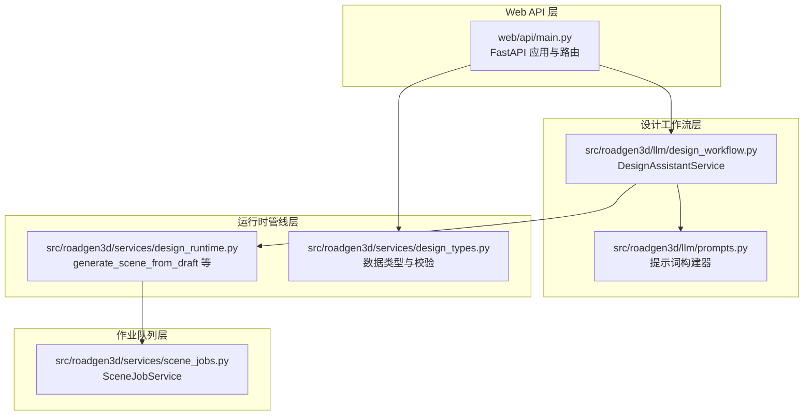
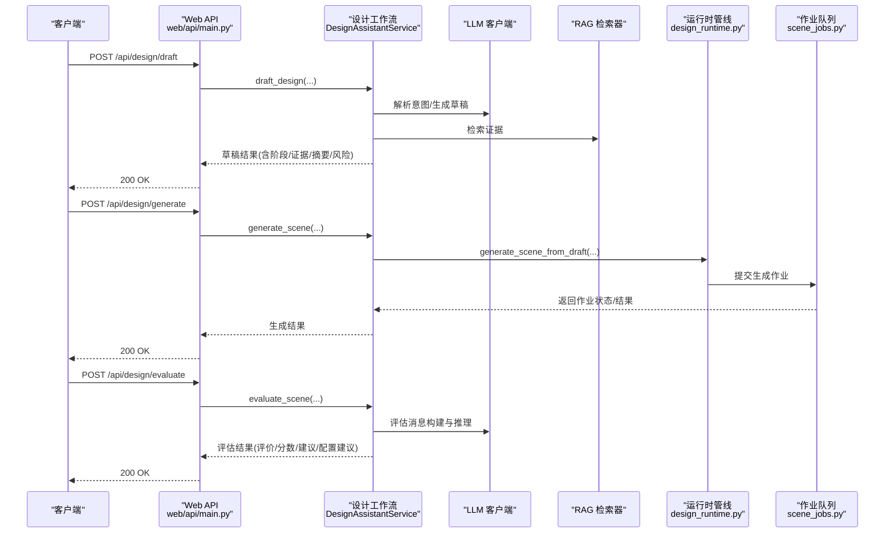
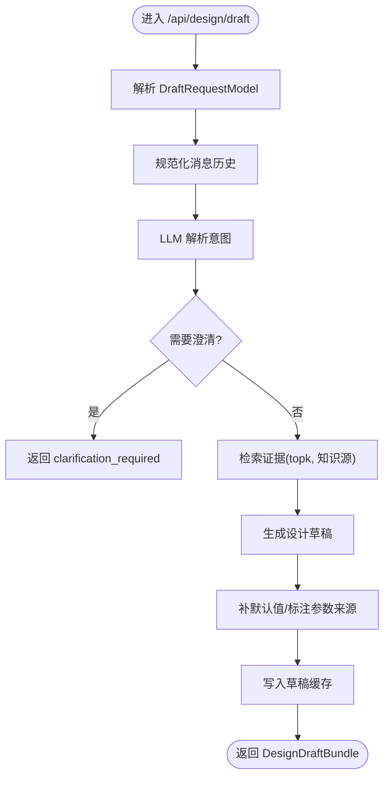
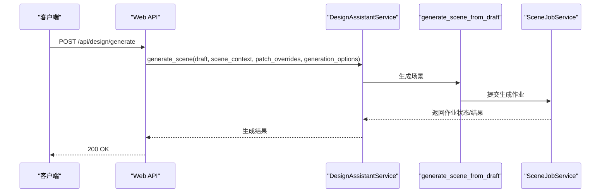
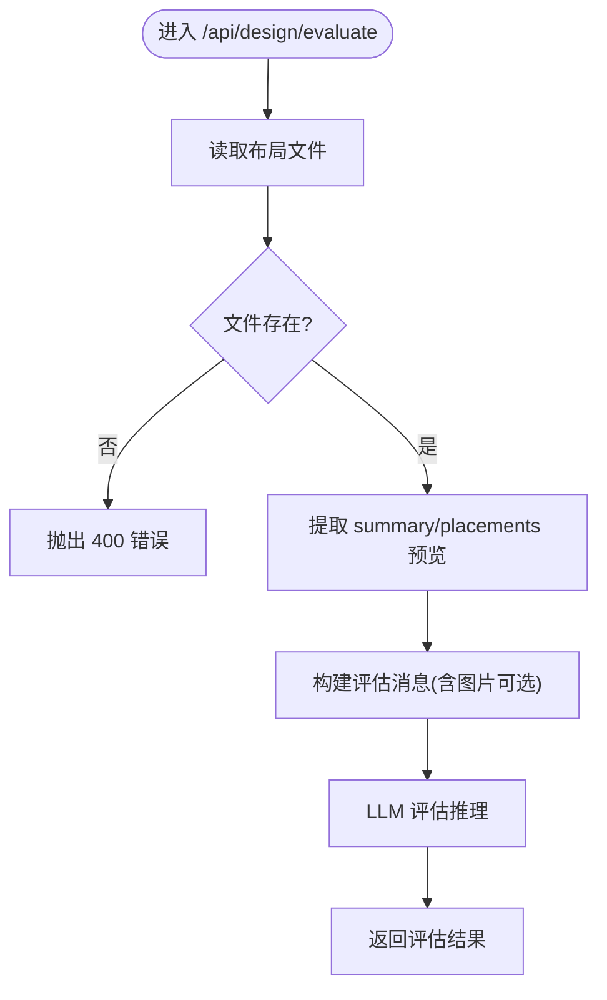
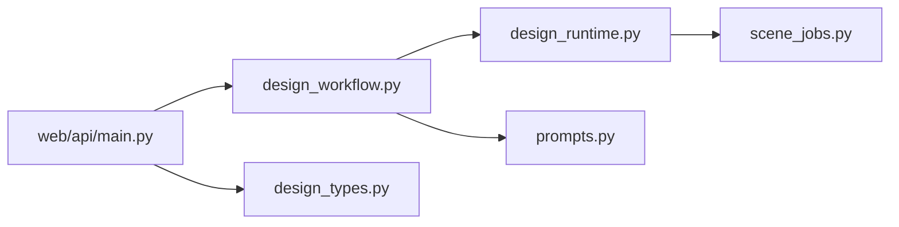

# 设计助手服务

<cite>
**本文档引用的文件**
- [web/api/main.py](file://web/api/main.py)
- [src/roadgen3d/llm/design_workflow.py](file://src/roadgen3d/llm/design_workflow.py)
- [src/roadgen3d/services/design_types.py](file://src/roadgen3d/services/design_types.py)
- [src/roadgen3d/services/design_runtime.py](file://src/roadgen3d/services/design_runtime.py)
- [src/roadgen3d/services/scene_jobs.py](file://src/roadgen3d/services/scene_jobs.py)
- [src/roadgen3d/llm/prompts.py](file://src/roadgen3d/llm/prompts.py)
- [tests/test_design_api.py](file://tests/test_design_api.py)
</cite>

## 目录
1. [简介](#简介)
2. [项目结构](#项目结构)
3. [核心组件](#核心组件)
4. [架构总览](#架构总览)
5. [详细组件分析](#详细组件分析)
6. [依赖关系分析](#依赖关系分析)
7. [性能考量](#性能考量)
8. [故障排查指南](#故障排查指南)
9. [结论](#结论)
10. [附录](#附录)

## 简介
本文件为 RoadGen3D 设计助手服务的完整接口文档，聚焦于三条核心 API：
- POST /api/design/draft：生成设计草稿（LLM + RAG）
- POST /api/design/generate：执行场景生成（直接走管线）
- POST /api/design/evaluate：场景评估（质量与建议）

文档涵盖请求模型 DraftRequestModel 和 GenerateRequestModel 的参数说明、响应数据结构、错误处理机制，解释设计草稿生成流程（消息历史处理、当前补丁更新、知识源选择），并提供场景生成的参数配置选项（场景上下文、补丁覆盖、生成选项）。同时包含场景评估的输入要求与输出指标，并提供实际 API 调用示例与最佳实践。

## 项目结构
该服务由 Web API 层、设计工作流层、运行时管线层与作业队列层组成，采用分层解耦设计，便于扩展与测试。

图表来源
- [web/api/main.py:156-265](file://web/api/main.py#L156-L265)
- [src/roadgen3d/llm/design_workflow.py:62-309](file://src/roadgen3d/llm/design_workflow.py#L62-L309)
- [src/roadgen3d/services/design_runtime.py:336-396](file://src/roadgen3d/services/design_runtime.py#L336-L396)
- [src/roadgen3d/services/scene_jobs.py:42-136](file://src/roadgen3d/services/scene_jobs.py#L42-L136)

章节来源
- [web/api/main.py:81-267](file://web/api/main.py#L81-L267)
- [src/roadgen3d/llm/design_workflow.py:62-309](file://src/roadgen3d/llm/design_workflow.py#L62-L309)
- [src/roadgen3d/services/design_runtime.py:336-396](file://src/roadgen3d/services/design_runtime.py#L336-L396)
- [src/roadgen3d/services/scene_jobs.py:42-136](file://src/roadgen3d/services/scene_jobs.py#L42-L136)

## 核心组件
- Web API 入口与路由：定义了 /api/design/draft、/api/design/generate、/api/design/evaluate 等端点，负责请求解析、参数校验与错误转换。
- 设计工作流服务：封装 LLM 意图解析、RAG 检索、草稿生成、场景评估与作业调度。
- 运行时管线：将草稿转换为最终场景，支持模板/GraphRAG/MetaUrban 等布局模式。
- 数据类型与校验：统一的草稿、意图、证据、场景上下文等数据结构与清洗逻辑。

章节来源
- [web/api/main.py:38-79](file://web/api/main.py#L38-L79)
- [src/roadgen3d/llm/design_workflow.py:62-309](file://src/roadgen3d/llm/design_workflow.py#L62-L309)
- [src/roadgen3d/services/design_types.py:131-368](file://src/roadgen3d/services/design_types.py#L131-L368)
- [src/roadgen3d/services/design_runtime.py:60-396](file://src/roadgen3d/services/design_runtime.py#L60-L396)

## 架构总览
下图展示三条核心 API 的调用链路与关键处理步骤。

图表来源
- [web/api/main.py:156-265](file://web/api/main.py#L156-L265)
- [src/roadgen3d/llm/design_workflow.py:112-309](file://src/roadgen3d/llm/design_workflow.py#L112-L309)
- [src/roadgen3d/services/design_runtime.py:336-396](file://src/roadgen3d/services/design_runtime.py#L336-L396)
- [src/roadgen3d/services/scene_jobs.py:57-136](file://src/roadgen3d/services/scene_jobs.py#L57-L136)

## 详细组件分析

### 接口一：POST /api/design/draft（生成设计草稿）
- 功能概述：接收用户消息历史与当前补丁，结合知识源（PDF RAG/GraphRAG/Hybrid）进行意图解析与证据检索，生成标准化的设计草稿。
- 请求体模型：DraftRequestModel
  - messages: List[ChatMessageModel]，必填。对话历史，每项包含 role 与 content。
  - user_input: str，必填。最新用户输入。
  - current_patch: Dict[str, Any]，可选。当前参数补丁，用于合并到最终草稿。
  - topk: int，默认 6。检索证据数量上限。
  - knowledge_source: str，默认 "graph_rag"。可选值："hybrid"、"pdf_rag"、"graph_rag"。
- 响应体：DesignDraftBundle
  - stage: str。取值："draft_ready" 或 "clarification_required"。
  - intent: DesignIntent。解析出的用户目标、偏好、安全优先级、后续问题、RAG 查询。
  - evidence: RagEvidence[]。检索到的知识证据列表。
  - draft: DesignDraft|null。标准化后的设计草稿；当 stage 为 "clarification_required" 时为 null。
  - warnings: str[]。警告信息列表。
  - cache_hit: bool。是否命中草稿缓存。
- 错误处理：
  - 当 LLM 配置或响应异常：HTTP 503。
  - 当业务逻辑错误（如知识源不可用）：HTTP 400。
- 关键流程要点：
  - 消息历史处理：对历史消息进行清洗与序列化。
  - 当前补丁更新：将 current_patch 合并到草稿补丁中。
  - 知识源选择：支持 hybrid/pdf_rag/graph_rag，自动选择可用检索器。
  - 缓存策略：基于 prompt 与知识源生成缓存键，命中则直接返回缓存结果并附加警告。

图表来源
- [web/api/main.py:156-171](file://web/api/main.py#L156-L171)
- [src/roadgen3d/llm/design_workflow.py:112-239](file://src/roadgen3d/llm/design_workflow.py#L112-L239)

章节来源
- [web/api/main.py:38-44](file://web/api/main.py#L38-L44)
- [src/roadgen3d/llm/design_workflow.py:112-239](file://src/roadgen3d/llm/design_workflow.py#L112-L239)
- [tests/test_design_api.py:183-200](file://tests/test_design_api.py#L183-L200)

### 接口二：POST /api/design/generate（执行场景生成）
- 功能概述：将已确认的设计草稿提交到生成管线，支持同步返回或异步作业两种方式。
- 请求体模型：GenerateRequestModel
  - draft: Dict[str, Any]。设计草稿对象（草稿字段见下节）。
  - scene_context: Dict[str, Any]。场景上下文，决定布局模式与地理约束。
  - patch_overrides: Dict[str, Any]。对草稿补丁的覆盖参数。
  - generation_options: Dict[str, Any]。生成选项（清单路径、导出格式、设备等）。
- 响应体：生成结果字典（同步模式）或作业创建响应（异步模式）。
- 异步作业流程：
  - 提交作业：POST /api/scene/jobs -> SceneJobCreateResponse
  - 查询作业：GET /api/scene/jobs/{job_id} -> SceneJobStatusResponse
  - 获取结果：GET /api/scenes/recent -> 最近场景列表
- 场景上下文与补丁覆盖：
  - 场景上下文（SceneContext）：layout_mode、aoi_bbox、city_name_en、reference_plan_id、graph_template_id。
  - 补丁覆盖（patch_overrides）：仅允许草稿补丁中的允许字段生效。
- 生成选项（GenerationOptions）：清单路径、导出目录、对象清单 v2、地面材质清单、天空清单、模型名/目录、设备、导出格式、放置策略、策略/程序检查点、温度等。

图表来源
- [web/api/main.py:173-186](file://web/api/main.py#L173-L186)
- [src/roadgen3d/services/design_runtime.py:336-396](file://src/roadgen3d/services/design_runtime.py#L336-L396)
- [src/roadgen3d/services/scene_jobs.py:57-136](file://src/roadgen3d/services/scene_jobs.py#L57-L136)

章节来源
- [web/api/main.py:46-51](file://web/api/main.py#L46-L51)
- [src/roadgen3d/services/design_runtime.py:60-396](file://src/roadgen3d/services/design_runtime.py#L60-L396)
- [src/roadgen3d/services/scene_jobs.py:42-136](file://src/roadgen3d/services/scene_jobs.py#L42-L136)

### 接口三：POST /api/design/evaluate（场景评估）
- 功能概述：对已生成的场景布局文件进行质量评估，返回综合评价、评分、改进建议与可选的配置建议。
- 请求体模型：EvaluateRequestModel
  - layout_path: str。场景布局文件绝对或相对路径。
  - image_path: str|null。可选的场景截图路径，将被编码为 data URL 传给 LLM。
- 响应体：评估结果对象
  - evaluation: str。中文自然语言评价。
  - score: number。0-10 综合评分。
  - suggestions: string[]。具体改进建议列表。
  - config_patch: object|null。可选的配置修改建议（仅允许草稿补丁字段）。
- 输入要求：
  - 布局文件存在且可读。
  - 支持从布局文件提取 summary 与 placements 预览。
- 输出指标：
  - 维度：视觉美观度与协调性、空间布局合理性、多样性与丰富度、规范合规性、行人友好性。
  - 结果：自然语言评价、数值评分、建议列表、可选配置建议。

图表来源
- [web/api/main.py:255-265](file://web/api/main.py#L255-L265)
- [src/roadgen3d/llm/design_workflow.py:310-349](file://src/roadgen3d/llm/design_workflow.py#L310-L349)
- [src/roadgen3d/llm/prompts.py:167-200](file://src/roadgen3d/llm/prompts.py#L167-L200)

章节来源
- [web/api/main.py:76-79](file://web/api/main.py#L76-L79)
- [src/roadgen3d/llm/design_workflow.py:310-349](file://src/roadgen3d/llm/design_workflow.py#L310-L349)
- [src/roadgen3d/llm/prompts.py:167-200](file://src/roadgen3d/llm/prompts.py#L167-L200)

### 数据模型与参数说明

#### DraftRequestModel
- messages: List[ChatMessageModel]
  - role: "user"|"assistant"|"system"
  - content: 文本内容
- user_input: str
- current_patch: Dict[str, Any]
- topk: int，默认 6
- knowledge_source: str，默认 "graph_rag"，可选："hybrid"|"pdf_rag"|"graph_rag"

章节来源
- [web/api/main.py:38-44](file://web/api/main.py#L38-L44)

#### GenerateRequestModel
- draft: Dict[str, Any]
  - normalized_scene_query: str
  - compose_config_patch: Dict[str, Any]
  - citations_by_field: Dict[str, str[]]
  - design_summary: str
  - risk_notes: str[]
  - parameter_sources_by_field: Dict[str, str]
- scene_context: Dict[str, Any]
  - layout_mode: "template"|"osm"|"metaurban"|"graph_template"
  - aoi_bbox: [min_lon,min_lat,max_lon,max_lat]|null
  - city_name_en: str|null
  - reference_plan_id: str|null
  - graph_template_id: str|null
- patch_overrides: Dict[str, Any]
- generation_options: Dict[str, Any]
  - manifest_path, artifacts_dir, out_dir
  - object_manifest_v2_path, ground_material_manifest_path, sky_manifest_path
  - model_name, model_dir, local_files_only, device
  - export_format, placement_policy, policy_ckpt, program_ckpt, policy_temperature

章节来源
- [web/api/main.py:46-51](file://web/api/main.py#L46-L51)
- [src/roadgen3d/services/design_types.py:131-368](file://src/roadgen3d/services/design_types.py#L131-L368)
- [src/roadgen3d/services/design_runtime.py:97-148](file://src/roadgen3d/services/design_runtime.py#L97-L148)

#### EvaluateRequestModel
- layout_path: str
- image_path: str|null

章节来源
- [web/api/main.py:76-79](file://web/api/main.py#L76-L79)

#### 响应数据结构
- DesignDraftBundle
  - stage: "draft_ready"|"clarification_required"
  - intent: DesignIntent
  - evidence: RagEvidence[]
  - draft: DesignDraft|null
  - warnings: str[]
  - cache_hit: bool
- DesignIntent
  - user_goals, style_preferences, safety_priorities, follow_up_questions, rag_queries
- RagEvidence
  - chunk_id, doc_id, section_title, page_start, page_end, text, source_path, score, relevance_reason, knowledge_source, parameter_hints
- DesignDraft
  - normalized_scene_query, compose_config_patch, citations_by_field, design_summary, risk_notes, parameter_sources_by_field
- SceneGenerationResult
  - compose_config, summary, scene_layout_path, scene_glb_path, scene_ply_path, viewer_url

章节来源
- [src/roadgen3d/services/design_types.py:142-368](file://src/roadgen3d/services/design_types.py#L142-L368)

## 依赖关系分析
- Web API 依赖设计工作流服务与数据类型模块。
- 设计工作流服务依赖 LLM 客户端、RAG 检索器与运行时管线。
- 运行时管线依赖场景桥接与组合器，以及作业队列服务。
- 作业队列服务依赖运行时管线生成函数。

图表来源
- [web/api/main.py:81-267](file://web/api/main.py#L81-L267)
- [src/roadgen3d/llm/design_workflow.py:62-309](file://src/roadgen3d/llm/design_workflow.py#L62-L309)
- [src/roadgen3d/services/design_runtime.py:336-396](file://src/roadgen3d/services/design_runtime.py#L336-L396)
- [src/roadgen3d/services/scene_jobs.py:42-136](file://src/roadgen3d/services/scene_jobs.py#L42-L136)

章节来源
- [web/api/main.py:81-267](file://web/api/main.py#L81-L267)
- [src/roadgen3d/llm/design_workflow.py:62-309](file://src/roadgen3d/llm/design_workflow.py#L62-L309)
- [src/roadgen3d/services/design_runtime.py:336-396](file://src/roadgen3d/services/design_runtime.py#L336-L396)
- [src/roadgen3d/services/scene_jobs.py:42-136](file://src/roadgen3d/services/scene_jobs.py#L42-L136)

## 性能考量
- 草稿缓存：基于 prompt 与知识源的哈希缓存，命中时可显著减少 LLM 与 RAG 开销。
- 异步生成：场景生成通过作业队列异步执行，避免阻塞 API。
- 检索优化：topk 参数控制检索规模，建议根据资源与延迟需求调整。
- 设备与导出：合理设置 device 与导出格式，平衡质量与速度。

## 故障排查指南
- HTTP 400：常见于场景上下文不完整（如 OSM 模式缺少 AOI）、知识源不可用、布局文件不存在等。
- HTTP 503：LLM 配置或响应异常。
- 缓存命中：若出现缓存命中警告，可确认是否期望复用已有分析结果。
- 评估失败：确保 layout_path 指向有效布局文件，必要时提供 image_path。

章节来源
- [web/api/main.py:167-171](file://web/api/main.py#L167-L171)
- [src/roadgen3d/llm/design_workflow.py:318-319](file://src/roadgen3d/llm/design_workflow.py#L318-L319)
- [tests/test_design_api.py:107-108](file://tests/test_design_api.py#L107-L108)

## 结论
本接口文档系统性地梳理了设计草稿生成、场景生成与场景评估的全流程，明确了请求/响应模型、参数配置与错误处理机制。通过草稿缓存、异步作业与多知识源检索，服务在保证质量的同时兼顾性能与可扩展性。

## 附录

### 实际调用示例（路径引用）
- 生成设计草稿
  - 请求：POST /api/design/draft
  - 示例负载参考：[tests/test_design_api.py:187-195](file://tests/test_design_api.py#L187-L195)
- 执行场景生成（同步）
  - 请求：POST /api/design/generate
  - 示例负载参考：[tests/test_design_api.py:228-244](file://tests/test_design_api.py#L228-L244)
- 创建生成作业（异步）
  - 请求：POST /api/scene/jobs
  - 示例负载参考：[tests/test_design_api.py:228-244](file://tests/test_design_api.py#L228-L244)
- 查询作业状态
  - 请求：GET /api/scene/jobs/{job_id}
  - 示例参考：[tests/test_design_api.py:252-255](file://tests/test_design_api.py#L252-L255)
- 场景评估
  - 请求：POST /api/design/evaluate
  - 示例负载参考：[web/api/main.py:255-265](file://web/api/main.py#L255-L265)

### 最佳实践
- 使用草稿缓存：相同 prompt 与知识源可复用缓存，减少重复计算。
- 明确场景上下文：OSM 模式务必提供 AOI bbox；MetaUrban/GraphTemplate 模式提供对应 ID。
- 控制检索规模：topk 与 generation_options 的导出格式、设备选择需结合硬件能力权衡。
- 评估先行：在生成后使用评估接口获得改进建议，指导参数微调。