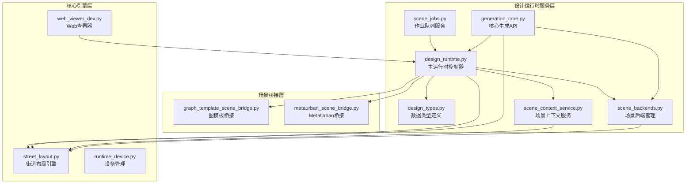
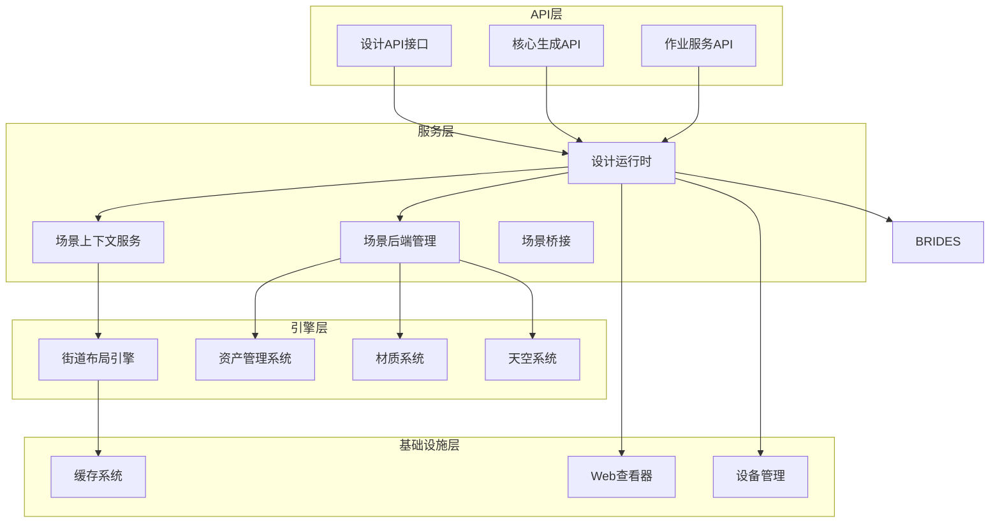
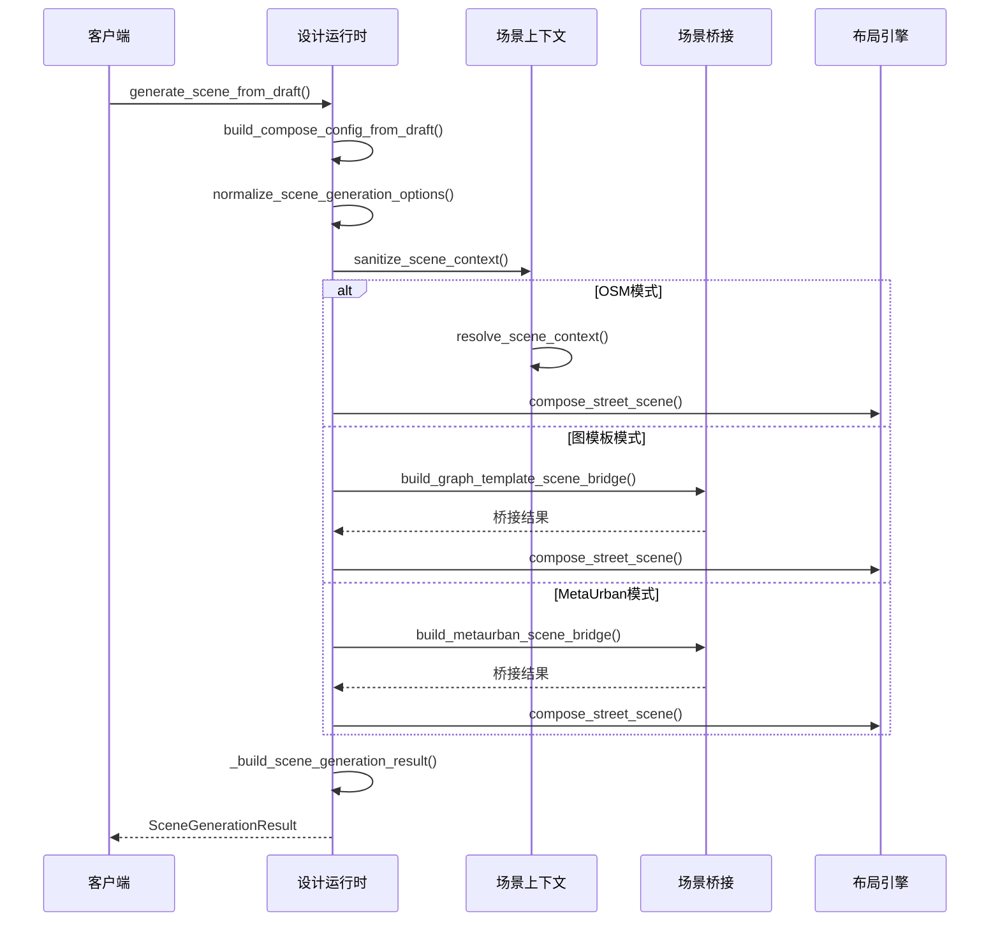
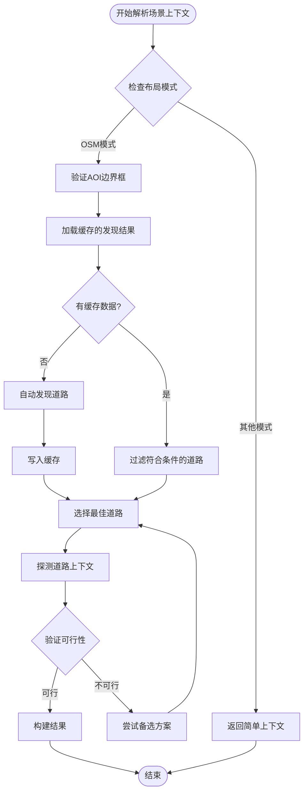
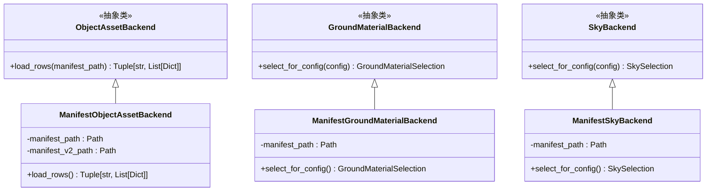
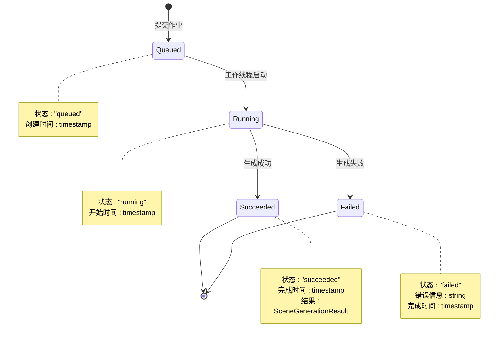
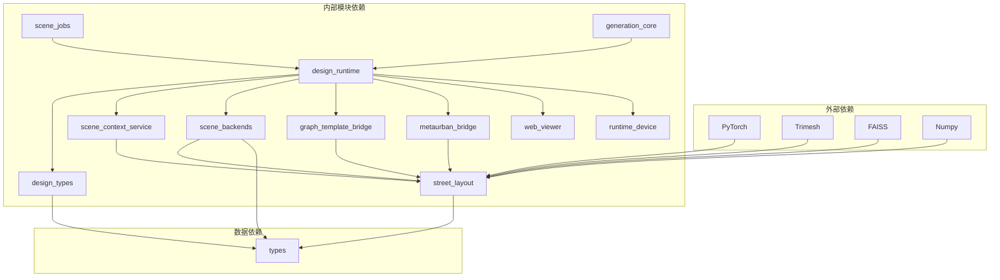

# 设计运行时

<cite>
**本文档引用的文件**
- [design_runtime.py](file://src/roadgen3d/services/design_runtime.py)
- [design_types.py](file://src/roadgen3d/services/design_types.py)
- [generation_core.py](file://src/roadgen3d/services/generation_core.py)
- [scene_jobs.py](file://src/roadgen3d/services/scene_jobs.py)
- [scene_context_service.py](file://src/roadgen3d/services/scene_context_service.py)
- [scene_backends.py](file://src/roadgen3d/services/scene_backends.py)
- [street_layout.py](file://src/roadgen3d/street_layout.py)
- [graph_template_scene_bridge.py](file://src/roadgen3d/graph_template_scene_bridge.py)
- [metaurban_scene_bridge.py](file://src/roadgen3d/metaurban_scene_bridge.py)
- [types.py](file://src/roadgen3d/types.py)
- [runtime_device.py](file://src/roadgen3d/runtime_device.py)
- [web_viewer_dev.py](file://src/roadgen3d/web_viewer_dev.py)
- [test_design_runtime.py](file://tests/test_design_runtime.py)
- [test_scene_jobs.py](file://tests/test_scene_jobs.py)
</cite>

## 目录
1. [简介](#简介)
2. [项目结构](#项目结构)
3. [核心组件](#核心组件)
4. [架构概览](#架构概览)
5. [详细组件分析](#详细组件分析)
6. [依赖关系分析](#依赖关系分析)
7. [性能考虑](#性能考虑)
8. [故障排除指南](#故障排除指南)
9. [结论](#结论)

## 简介

设计运行时是RoadGen3D项目中的核心模块，负责将确认的设计草稿转换为生成的街道场景。该系统提供了完整的场景生成工作流程，支持多种布局模式（模板、OSM、MetaUrban、图模板），并集成了资产管理系统、场景上下文解析和Web查看器集成。

设计运行时系统采用模块化架构，通过清晰的数据类型定义和标准化的接口，实现了从设计意图到最终渲染场景的完整转换过程。系统支持批量作业处理、结果缓存和Web集成，为用户提供了灵活且高效的场景生成解决方案。

## 项目结构

设计运行时系统主要位于`src/roadgen3d/services/`目录下，包含以下关键模块：

**图表来源**
- [design_runtime.py:1-460](file://src/roadgen3d/services/design_runtime.py#L1-L460)
- [design_types.py:1-368](file://src/roadgen3d/services/design_types.py#L1-L368)
- [scene_context_service.py:1-332](file://src/roadgen3d/services/scene_context_service.py#L1-L332)

**章节来源**
- [design_runtime.py:1-460](file://src/roadgen3d/services/design_runtime.py#L1-L460)
- [design_types.py:1-368](file://src/roadgen3d/services/design_types.py#L1-L368)

## 核心组件

设计运行时系统由多个相互协作的核心组件构成，每个组件都有明确的职责和接口：

### 数据类型系统
系统使用强类型的数据结构来确保数据完整性：
- **StreetComposeConfig**: 街道组合配置，包含所有生成参数
- **DesignDraft**: 设计草稿，包含用户意图和参数补丁
- **SceneContext**: 场景上下文，定义运行时环境设置
- **SceneGenerationResult**: 生成结果，标准化输出格式

### 运行时控制器
主运行时控制器提供统一的接口来协调整个生成流程：
- 配置构建和验证
- 场景上下文解析
- 资产后端管理
- 结果处理和缓存

### 场景上下文服务
专门处理OSM道路选择和场景解析逻辑：
- 自动发现POI丰富的道路
- 缓存和重用发现结果
- 提供场景上下文解析

**章节来源**
- [design_types.py:13-368](file://src/roadgen3d/services/design_types.py#L13-L368)
- [design_runtime.py:60-396](file://src/roadgen3d/services/design_runtime.py#L60-L396)

## 架构概览

设计运行时系统采用分层架构，从上到下分别为API层、服务层、引擎层和基础设施层：

**图表来源**
- [design_runtime.py:336-396](file://src/roadgen3d/services/design_runtime.py#L336-L396)
- [scene_context_service.py:279-332](file://src/roadgen3d/services/scene_context_service.py#L279-L332)
- [scene_backends.py:205-317](file://src/roadgen3d/services/scene_backends.py#L205-L317)

## 详细组件分析

### 设计运行时控制器

设计运行时控制器是整个系统的核心协调者，负责管理完整的场景生成流程：

**图表来源**
- [design_runtime.py:336-396](file://src/roadgen3d/services/design_runtime.py#L336-L396)
- [scene_context_service.py:279-332](file://src/roadgen3d/services/scene_context_service.py#L279-L332)

#### 关键功能特性

1. **多模式支持**: 支持模板、OSM、MetaUrban和图模板四种布局模式
2. **配置管理**: 统一的配置构建和验证机制
3. **结果处理**: 标准化的结果封装和Web查看器集成
4. **错误处理**: 完善的异常处理和回退机制

**章节来源**
- [design_runtime.py:336-460](file://src/roadgen3d/services/design_runtime.py#L336-L460)

### 场景上下文服务

场景上下文服务专门处理OSM模式下的自动道路选择和场景解析：

**图表来源**
- [scene_context_service.py:279-332](file://src/roadgen3d/services/scene_context_service.py#L279-L332)

#### 核心算法实现

1. **道路发现算法**: 基于POI评分和道路长度的智能选择
2. **缓存机制**: 避免重复计算，提高响应速度
3. **上下文探测**: 评估道路的可放置性和美观性

**章节来源**
- [scene_context_service.py:189-277](file://src/roadgen3d/services/scene_context_service.py#L189-L277)

### 场景后端管理系统

场景后端管理系统负责管理各种资源的加载和选择：

**图表来源**
- [scene_backends.py:96-317](file://src/roadgen3d/services/scene_backends.py#L96-L317)

#### 资源选择策略

1. **基于查询的匹配**: 根据场景配置动态选择最合适的资源
2. **标签匹配算法**: 使用语义相似度进行资源评分
3. **回退机制**: 当特定表面类型缺失时的自动回退

**章节来源**
- [scene_backends.py:205-317](file://src/roadgen3d/services/scene_backends.py#L205-L317)

### 作业队列服务

作业队列服务提供异步场景生成能力：

**图表来源**
- [scene_jobs.py:27-205](file://src/roadgen3d/services/scene_jobs.py#L27-L205)

#### 异步处理机制

1. **线程池管理**: 单线程后台工作者处理多个作业
2. **状态跟踪**: 完整的作业生命周期管理
3. **同步等待**: 支持阻塞式结果获取

**章节来源**
- [scene_jobs.py:42-178](file://src/roadgen3d/services/scene_jobs.py#L42-L178)

## 依赖关系分析

设计运行时系统具有清晰的依赖层次结构，各模块间通过明确定义的接口进行交互：

**图表来源**
- [design_runtime.py:1-50](file://src/roadgen3d/services/design_runtime.py#L1-L50)
- [street_layout.py:1-100](file://src/roadgen3d/street_layout.py#L1-L100)

### 关键依赖关系

1. **核心引擎依赖**: 所有生成操作最终都依赖于street_layout引擎
2. **设备管理依赖**: PyTorch等深度学习框架的设备选择
3. **资源管理依赖**: 各种后端系统对底层资源的访问

**章节来源**
- [design_runtime.py:1-50](file://src/roadgen3d/services/design_runtime.py#L1-L50)
- [street_layout.py:1-100](file://src/roadgen3d/street_layout.py#L1-L100)

## 性能考虑

设计运行时系统在多个层面进行了性能优化：

### 内存管理
- **对象复用**: 大量使用不可变数据类减少内存分配
- **延迟加载**: 资源按需加载，避免不必要的内存占用
- **缓存策略**: 智能缓存机制减少重复计算

### 并发处理
- **异步作业**: 作业队列支持并发处理多个场景生成任务
- **线程安全**: 使用锁和条件变量确保线程安全
- **资源池**: 有限的工作线程池避免过度并发

### I/O优化
- **路径解析**: 缓存解析后的路径避免重复计算
- **文件操作**: 批量文件操作减少系统调用开销
- **网络请求**: OSM数据的智能缓存和重用

## 故障排除指南

### 常见问题及解决方案

#### 设备选择问题
当目标设备不可用时，系统会自动回退到CPU：
- 检查PyTorch安装状态
- 验证GPU驱动程序
- 使用`resolve_device_backend()`函数手动指定设备

#### 资源加载失败
当资产或材质清单缺失时：
- 验证清单文件路径
- 检查文件权限
- 确认清单格式正确性

#### OSM模式错误
OSM模式需要有效的AOI边界框：
- 确保提供完整的经纬度坐标
- 验证坐标范围的有效性
- 检查网络连接状态

**章节来源**
- [runtime_device.py:37-72](file://src/roadgen3d/runtime_device.py#L37-L72)
- [scene_context_service.py:204-216](file://src/roadgen3d/services/scene_context_service.py#L204-L216)

## 结论

设计运行时系统为RoadGen3D项目提供了强大而灵活的场景生成能力。通过模块化的架构设计、完善的错误处理机制和性能优化策略，系统能够高效地处理各种复杂的场景生成需求。

系统的主要优势包括：
- **多模式支持**: 灵活的布局模式选择
- **标准化接口**: 统一的数据类型和API设计
- **可扩展性**: 清晰的模块边界便于功能扩展
- **可靠性**: 完善的错误处理和回退机制

未来可以考虑的改进方向：
- 增加更多的布局模式支持
- 优化大规模场景的性能表现
- 扩展Web查看器的功能
- 增强实时协作能力