# RoadGen3D 设计测试工作流

<cite>
**本文档引用的文件**
- [docs/design-test-workflow.md](file://docs/design-test-workflow.md)
- [scripts/test_workflow.py](file://scripts/test_workflow.py)
- [tests/test_design_api.py](file://tests/test_design_api.py)
- [tests/test_scene_jobs.py](file://tests/test_scene_jobs.py)
- [tests/test_design_runtime.py](file://tests/test_design_runtime.py)
- [tests/test_design_assistant_service.py](file://tests/test_design_assistant_service.py)
- [src/roadgen3d/services/generation_api.py](file://src/roadgen3d/services/generation_api.py)
- [src/roadgen3d/services/scene_jobs.py](file://src/roadgen3d/services/scene_jobs.py)
- [src/roadgen3d/services/design_runtime.py](file://src/roadgen3d/services/design_runtime.py)
- [src/roadgen3d/llm/design_workflow.py](file://src/roadgen3d/llm/design_workflow.py)
- [web/api/main.py](file://web/api/main.py)
- [src/roadgen3d/eval_metrics.py](file://src/roadgen3d/eval_metrics.py)
- [src/roadgen3d/street_layout.py](file://src/roadgen3d/street_layout.py)
- [src/roadgen3d/placement_zones.py](file://src/roadgen3d/placement_zones.py)
- [src/roadgen3d/graph_templates.py](file://src/roadgen3d/graph_templates.py)
- [web/viewer/src/scene-graph.ts](file://web/viewer/src/scene-graph.ts)
</cite>

## 更新摘要
**变更内容**
- 新增确定性评分算法：综合评分采用整数四舍五入的确定性计算方法
- 增强road_arm_geometries支持：新增道路分支几何体生成和渲染功能
- 标准化导出格式：统一GraphRAG知识库输出格式和模板标注格式
- 改进评估验证：增强重复运行验证和指标对比机制

## 目录
1. [简介](#简介)
2. [项目结构概览](#项目结构概览)
3. [核心组件](#核心组件)
4. [架构总览](#架构总览)
5. [详细组件分析](#详细组件分析)
6. [测试工作流程](#测试工作流程)
7. [依赖关系分析](#依赖关系分析)
8. [性能考虑](#性能考虑)
9. [故障排除指南](#故障排除指南)
10. [结论](#结论)

## 简介

RoadGen3D 是一个基于人工智能的街道设计生成系统，支持多种设计模式和评估机制。本文档详细介绍了该系统的测试工作流程设计，包括自动化测试脚本、API 测试、场景作业管理和评估测试等核心组件。

该测试工作流程旨在验证整个设计管道的端到端功能，从模板选择、场景生成到最终评估的完整流程。系统支持多种预设模板，包括步行友好、商业活力、公交优先、公园景观、安静居住和平衡街道等设计风格。

**更新** 新版本引入了多项重要改进：确定性评分算法确保综合评分的可预测性、增强的road_arm_geometries支持提供更精确的道路几何建模、标准化导出格式提升系统互操作性，以及改进的评估验证机制确保测试结果的可靠性。

## 项目结构概览

RoadGen3D 项目采用模块化的架构设计，主要包含以下核心目录结构：

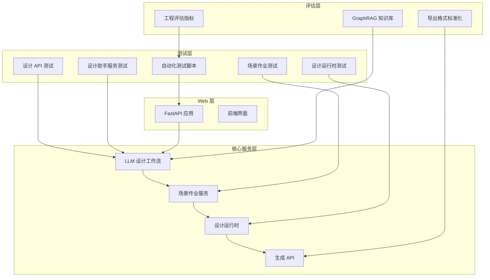

**图表来源**
- [web/api/main.py:81-280](file://web/api/main.py#L81-L280)
- [src/roadgen3d/llm/design_workflow.py:63-969](file://src/roadgen3d/llm/design_workflow.py#L63-L969)
- [src/roadgen3d/eval_metrics.py:1-306](file://src/roadgen3d/eval_metrics.py#L1-L306)

**章节来源**
- [web/api/main.py:1-299](file://web/api/main.py#L1-L299)
- [src/roadgen3d/llm/design_workflow.py:1-969](file://src/roadgen3d/llm/design_workflow.py#L1-L969)

## 核心组件

### 预设模板系统

系统提供了六种预设设计模板，每种模板都包含特定的设计规则配置和需求等级：

| 模板 ID | 中文名称 | 英文名称 | 设计规则配置 | 需求等级 |
|---------|----------|----------|--------------|----------|
| pedestrian_friendly | 步行友好 | Pedestrian Friendly | pedestrian_priority_v1 | 高需求：步行、中需求：自行车、中需求：公交、低需求：机动车 |
| commercial_vitality | 商业活力 | Commercial Vitality | balanced_complete_street_v1 | 高需求：步行、中需求：自行车、高需求：公交、中需求：机动车 |
| transit_priority | 公交优先 | Transit Priority | transit_priority_v1 | 高需求：步行、中需求：自行车、高需求：公交、高需求：机动车 |
| park_landscape | 公园景观 | Park Landscape | pedestrian_priority_v1 | 中需求：步行、中需求：自行车、低需求：公交、低需求：机动车 |
| quiet_residential | 安静居住 | Quiet Residential | pedestrian_priority_v1 | 低需求：步行、中需求：自行车、低需求：公交、低需求：机动车 |
| balanced_complete | 平衡街道 | Balanced Complete | balanced_complete_street_v1 | 中需求：步行、中需求：自行车、中需求：公交、中需求：机动车 |

**章节来源**
- [scripts/test_workflow.py:50-141](file://scripts/test_workflow.py#L50-L141)

### 测试结果数据结构

测试结果使用统一的数据类结构来存储所有相关信息：

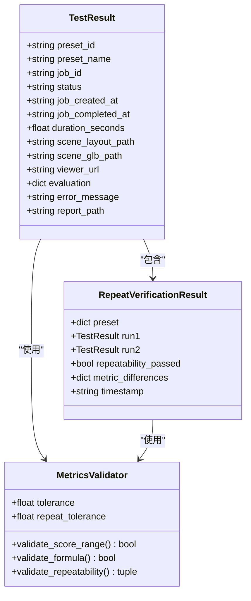

**图表来源**
- [scripts/test_workflow.py:370-404](file://scripts/test_workflow.py#L370-L404)
- [scripts/test_workflow.py:264-366](file://scripts/test_workflow.py#L264-L366)

**章节来源**
- [scripts/test_workflow.py:369-404](file://scripts/test_workflow.py#L369-L404)

## 架构总览

RoadGen3D 的测试工作流程采用分层架构设计，确保各个组件之间的松耦合和高内聚：

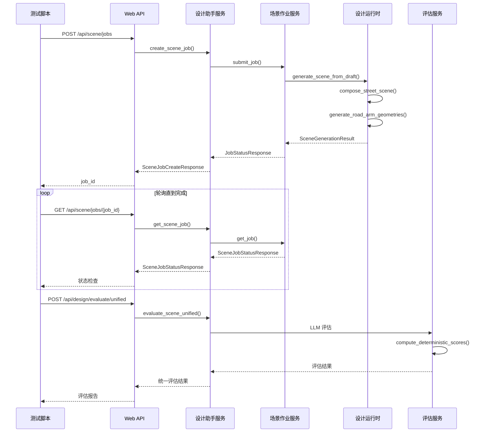

**图表来源**
- [web/api/main.py:188-215](file://web/api/main.py#L188-L215)
- [src/roadgen3d/llm/design_workflow.py:284-306](file://src/roadgen3d/llm/design_workflow.py#L284-L306)
- [src/roadgen3d/services/scene_jobs.py:81-86](file://src/roadgen3d/services/scene_jobs.py#L81-L86)
- [src/roadgen3d/eval_metrics.py:300-325](file://src/roadgen3d/eval_metrics.py#L300-L325)

**章节来源**
- [web/api/main.py:188-278](file://web/api/main.py#L188-L278)
- [src/roadgen3d/services/scene_jobs.py:42-136](file://src/roadgen3d/services/scene_jobs.py#L42-L136)

## 详细组件分析

### 设计助手服务 (DesignAssistantService)

设计助手服务是整个测试工作流程的核心协调者，负责管理 LLM 对话、知识检索和场景生成的完整流程：

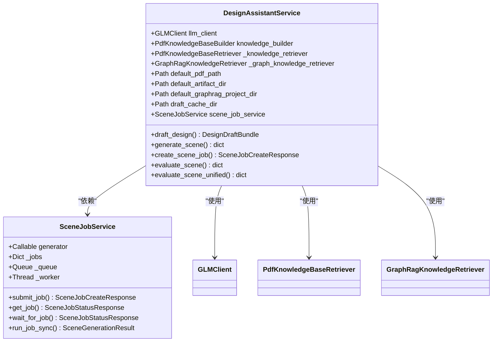

**图表来源**
- [src/roadgen3d/llm/design_workflow.py:63-90](file://src/roadgen3d/llm/design_workflow.py#L63-L90)
- [src/roadgen3d/services/scene_jobs.py:42-56](file://src/roadgen3d/services/scene_jobs.py#L42-L56)

**章节来源**
- [src/roadgen3d/llm/design_workflow.py:63-310](file://src/roadgen3d/llm/design_workflow.py#L63-L310)

### 场景作业服务 (SceneJobService)

场景作业服务提供异步场景生成能力，支持多线程并发处理和状态跟踪：

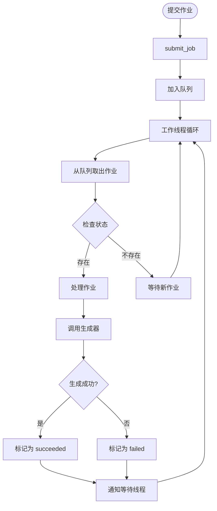

**图表来源**
- [src/roadgen3d/services/scene_jobs.py:144-178](file://src/roadgen3d/services/scene_jobs.py#L144-L178)

**章节来源**
- [src/roadgen3d/services/scene_jobs.py:138-178](file://src/roadgen3d/services/scene_jobs.py#L138-L178)

### 设计运行时 (DesignRuntime)

设计运行时负责将设计草稿转换为实际的街道场景，支持多种布局模式：

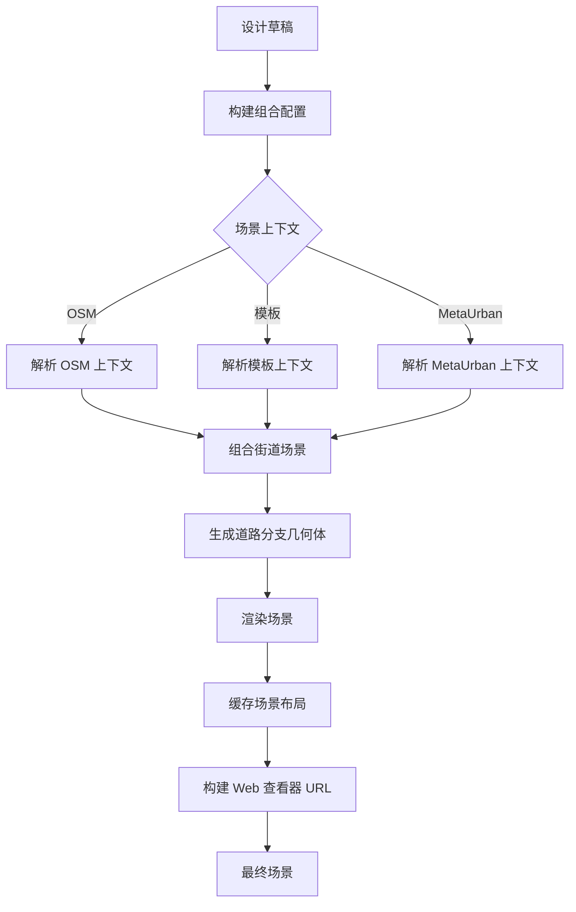

**图表来源**
- [src/roadgen3d/services/design_runtime.py:336-396](file://src/roadgen3d/services/design_runtime.py#L336-L396)
- [src/roadgen3d/street_layout.py:3534-3560](file://src/roadgen3d/street_layout.py#L3534-L3560)

**章节来源**
- [src/roadgen3d/services/design_runtime.py:336-396](file://src/roadgen3d/services/design_runtime.py#L336-L396)

### 确定性评分算法

新版本引入了确定性评分算法，确保综合评分的可预测性和一致性：

```mermaid
flowchart TD
Input[原始评分] --> Formula[应用加权公式]
Formula --> Multiply[乘以权重系数]
Multiply --> Round[四舍五入到整数]
Round --> Clamp[约束到 [0,100] 范围]
Clamp --> Deterministic[确定性评分]
Deterministic --> Output[最终综合评分]
```

**图表来源**
- [scripts/test_workflow.py:300-325](file://scripts/test_workflow.py#L300-L325)
- [src/roadgen3d/eval_metrics.py:300-325](file://src/roadgen3d/eval_metrics.py#L300-L325)

**章节来源**
- [scripts/test_workflow.py:300-325](file://scripts/test_workflow.py#L300-L325)
- [src/roadgen3d/eval_metrics.py:300-325](file://src/roadgen3d/eval_metrics.py#L300-L325)

## 测试工作流程

### 自动化测试脚本设计

自动化测试脚本 `scripts/test_workflow.py` 提供了完整的端到端测试解决方案：

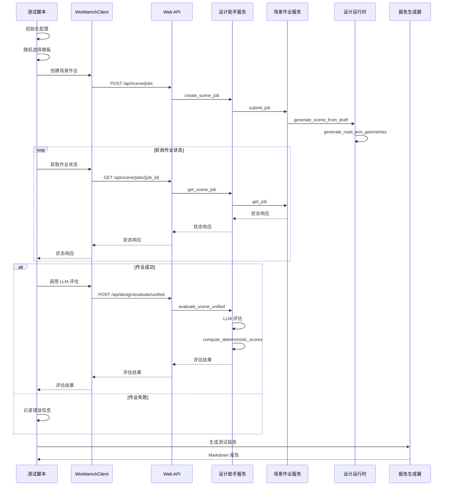

**图表来源**
- [scripts/test_workflow.py:473-581](file://scripts/test_workflow.py#L473-L581)
- [scripts/test_workflow.py:648-800](file://scripts/test_workflow.py#L648-L800)

### 增强的可视化功能

新版本引入了丰富的可视化元素来提升用户体验：

#### 实时进度反馈
- **旋转指示器**: 使用 Unicode 字符显示加载状态
- **进度条**: 文本进度条显示生成进度
- **ETA 计算**: 动态计算剩余时间估计
- **状态追踪**: 详细的状态变化记录和统计

#### 改进的错误处理
- **超时管理**: 系统级超时控制和优雅降级
- **连接检测**: API 健康检查和状态信息获取
- **详细错误信息**: 包含具体错误原因和解决建议
- **资源清理**: 超时后的自动资源释放

#### 可重复性验证
测试系统现在支持重复运行验证，确保结果的稳定性：

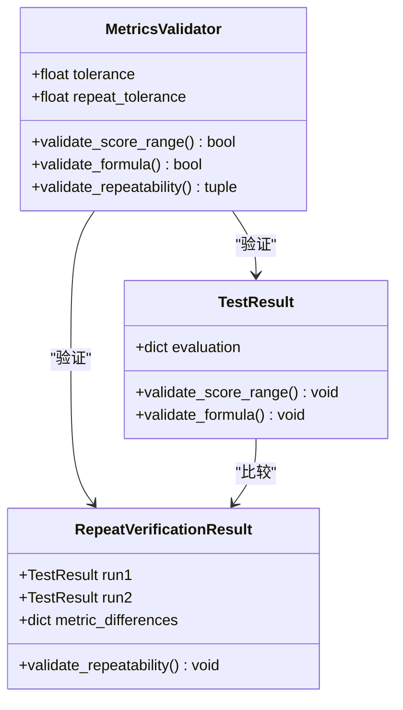

**图表来源**
- [scripts/test_workflow.py:264-366](file://scripts/test_workflow.py#L264-L366)
- [scripts/test_workflow.py:584-645](file://scripts/test_workflow.py#L584-L645)

**章节来源**
- [scripts/test_workflow.py:264-366](file://scripts/test_workflow.py#L264-L366)

### 命令行接口更新

新的命令行接口提供了更多的配置选项和调试功能：

| 配置项 | 默认值 | 描述 |
|--------|--------|------|
| JOB_POLL_INTERVAL | 2 秒 | 作业轮询间隔 |
| JOB_TIMEOUT | 600 秒 (10 分钟) | 作业最大等待时间 |
| EVAL_TIMEOUT | 120 秒 | 评估超时时间 |
| DEFAULT_RANDOM_SEED | 42 | 全局随机种子 |
| SCENE_PRESETS | 6 种模板 | 预设设计模板集合 |
| VERIFY_REPEAT | False | 启用可重复性验证模式 |

**章节来源**
- [scripts/test_workflow.py:149-176](file://scripts/test_workflow.py#L149-L176)
- [scripts/test_workflow.py:409-469](file://scripts/test_workflow.py#L409-L469)

### 指标验证系统

测试系统内置了完整的指标验证机制，确保结果的准确性和一致性：


**图表来源**
- [scripts/test_workflow.py:264-366](file://scripts/test_workflow.py#L264-L366)
- [scripts/test_workflow.py:584-645](file://scripts/test_workflow.py#L584-L645)

**章节来源**
- [scripts/test_workflow.py:264-366](file://scripts/test_workflow.py#L264-L366)

### 确定性评分算法实现

新版本的确定性评分算法确保了综合评分的可预测性：

```mermaid
flowchart TD
Start[输入原始评分] --> Compute[计算加权和]
Compute --> Weight[应用权重系数]
Weight --> Round[整数四舍五入]
Round --> Clamp[范围约束 [0,100]]
Clamp --> End[输出确定性评分]
```

**图表来源**
- [scripts/test_workflow.py:300-325](file://scripts/test_workflow.py#L300-L325)
- [src/roadgen3d/eval_metrics.py:300-325](file://src/roadgen3d/eval_metrics.py#L300-L325)

**章节来源**
- [scripts/test_workflow.py:300-325](file://scripts/test_workflow.py#L300-L325)
- [src/roadgen3d/eval_metrics.py:300-325](file://src/roadgen3d/eval_metrics.py#L300-L325)

### 增强的road_arm_geometries支持

新版本增强了道路分支几何体的支持，提供更精确的几何建模：

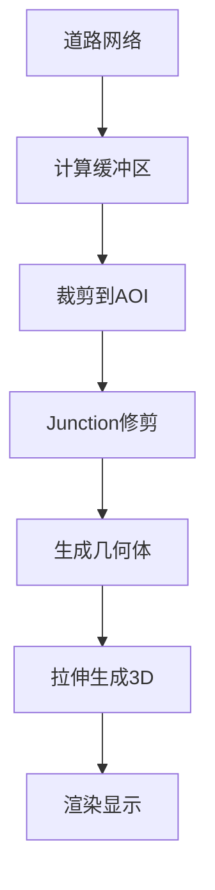

**图表来源**
- [src/roadgen3d/placement_zones.py:2503-2522](file://src/roadgen3d/placement_zones.py#L2503-L2522)
- [src/roadgen3d/street_layout.py:3534-3560](file://src/roadgen3d/street_layout.py#L3534-L3560)

**章节来源**
- [src/roadgen3d/placement_zones.py:2503-2522](file://src/roadgen3d/placement_zones.py#L2503-L2522)
- [src/roadgen3d/street_layout.py:3534-3560](file://src/roadgen3d/street_layout.py#L3534-L3560)

### 标准化导出格式

新版本实现了标准化的导出格式，提升系统互操作性：

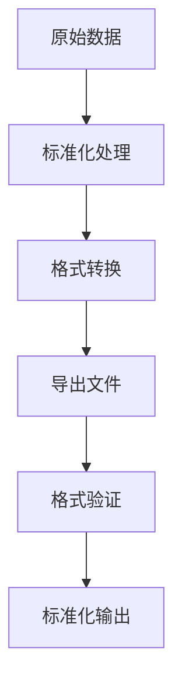

**图表来源**
- [src/roadgen3d/graph_templates.py:54-75](file://src/roadgen3d/graph_templates.py#L54-L75)
- [web/viewer/src/scene-graph.ts:663-670](file://web/viewer/src/scene-graph.ts#L663-L670)

**章节来源**
- [src/roadgen3d/graph_templates.py:54-75](file://src/roadgen3d/graph_templates.py#L54-L75)
- [web/viewer/src/scene-graph.ts:663-670](file://web/viewer/src/scene-graph.ts#L663-L670)

## 依赖关系分析

### 测试组件依赖图

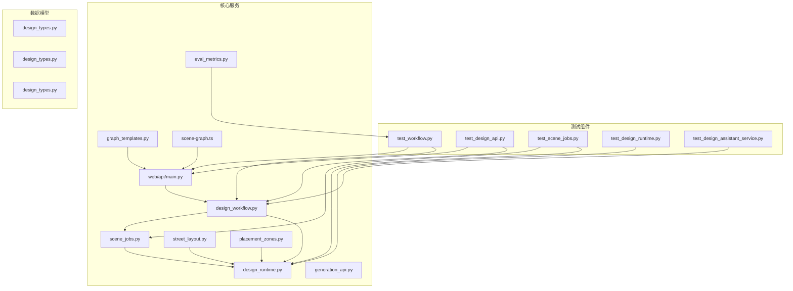

**图表来源**
- [tests/test_design_api.py:16-26](file://tests/test_design_api.py#L16-L26)
- [tests/test_scene_jobs.py:13-14](file://tests/test_scene_jobs.py#L13-L14)
- [tests/test_design_runtime.py:15-18](file://tests/test_design_runtime.py#L15-L18)

### 关键依赖关系

测试系统的关键依赖关系包括：

1. **Web API 依赖链**: `test_workflow.py` → `web/api/main.py` → `src/roadgen3d/llm/design_workflow.py`
2. **服务层依赖**: `design_workflow.py` → `scene_jobs.py` → `design_runtime.py`
3. **评估层依赖**: `eval_metrics.py` → `test_workflow.py` → `design_workflow.py`
4. **几何建模依赖**: `placement_zones.py` → `street_layout.py` → `design_runtime.py`
5. **导出格式依赖**: `graph_templates.py` → `web/api/main.py` → `web/viewer/src/scene-graph.ts`

**章节来源**
- [tests/test_design_api.py:183-295](file://tests/test_design_api.py#L183-L295)
- [tests/test_scene_jobs.py:26-58](file://tests/test_scene_jobs.py#L26-L58)

## 性能考虑

### 超时和并发管理

测试系统采用了多层次的超时和并发管理策略：

- **系统级超时**: 使用 `signal` 模块实现进程级超时控制
- **线程安全**: 使用 `threading` 和 `condition` 实现线程间同步
- **资源清理**: 确保超时后正确释放系统资源

### 内存和存储优化

- **作业状态存储**: 使用内存字典存储作业状态，避免持久化开销
- **缓存机制**: 设计草稿缓存减少重复计算
- **临时文件管理**: 合理的临时文件清理机制

### 确定性评分性能优化

- **整数运算**: 使用整数四舍五入避免浮点精度问题
- **快速验证**: 简化的验证逻辑减少计算开销
- **缓存机制**: 重复运行结果缓存提升验证效率

## 故障排除指南

### 常见错误类型和处理

| 错误类型 | 处理方式 | 报告状态 |
|----------|----------|----------|
| API 连接失败 | 打印错误，退出码 1 | failed |
| 任务创建失败 | 打印错误，退出码 1 | failed |
| 任务超时 | 打印警告，继续 | timeout |
| 任务失败 | 记录错误信息 | failed |
| 评估失败 | 记录错误信息 | passed (with warning) |
| 几何体生成失败 | 检查输入数据格式 | failed |
| 导出格式错误 | 验证标准化格式 | failed |

### 调试建议

1. **检查网络连接**: 确保 API 服务器正常运行
2. **验证模板配置**: 检查预设模板的配置参数
3. **监控资源使用**: 关注内存和 CPU 使用情况
4. **查看日志输出**: 分析详细的错误日志信息
5. **验证几何数据**: 检查road_arm_geometries生成的几何体有效性
6. **测试评分算法**: 验证确定性评分计算的正确性

**章节来源**
- [scripts/test_workflow.py:569-581](file://scripts/test_workflow.py#L569-L581)

## 结论

RoadGen3D 的测试工作流程设计体现了现代软件测试的最佳实践，具有以下特点：

1. **完整性**: 覆盖了从模板选择到最终评估的完整端到端流程
2. **可重复性**: 通过全局随机种子和缓存机制确保测试结果的可重复性
3. **可扩展性**: 模块化的架构设计便于添加新的测试场景
4. **可观测性**: 详细的日志记录和报告生成功能
5. **健壮性**: 完善的错误处理和超时管理机制
6. **可视化**: 增强的用户界面反馈和实时状态追踪
7. **验证能力**: 支持可重复性验证和指标对比分析
8. **确定性评分**: 采用整数四舍五入确保评分的可预测性
9. **几何建模**: 增强的road_arm_geometries支持提供精确的几何建模
10. **标准化**: 统一的导出格式提升系统互操作性

该测试工作流程为 RoadGen3D 系统的持续集成和质量保证提供了坚实的基础，能够有效确保系统在各种场景下的稳定性和可靠性。新版本的改进进一步提升了用户体验和测试效率，为开发者提供了更好的工具来验证和优化街道设计算法。确定性评分算法、增强的几何建模支持和标准化导出格式等新功能，显著提升了系统的实用性和可靠性。