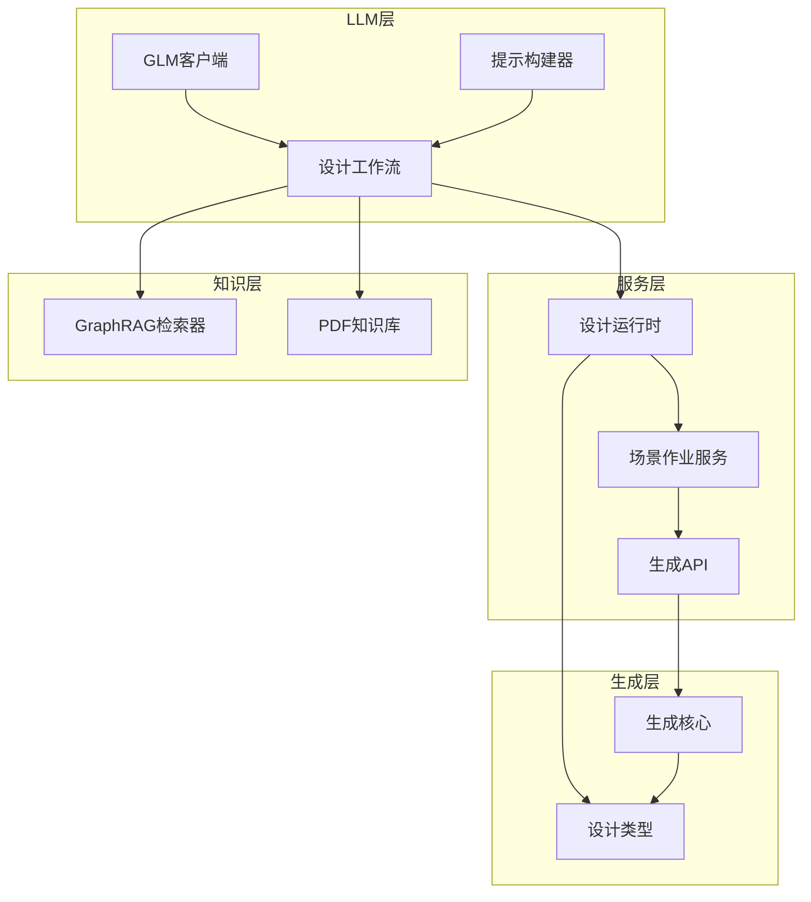
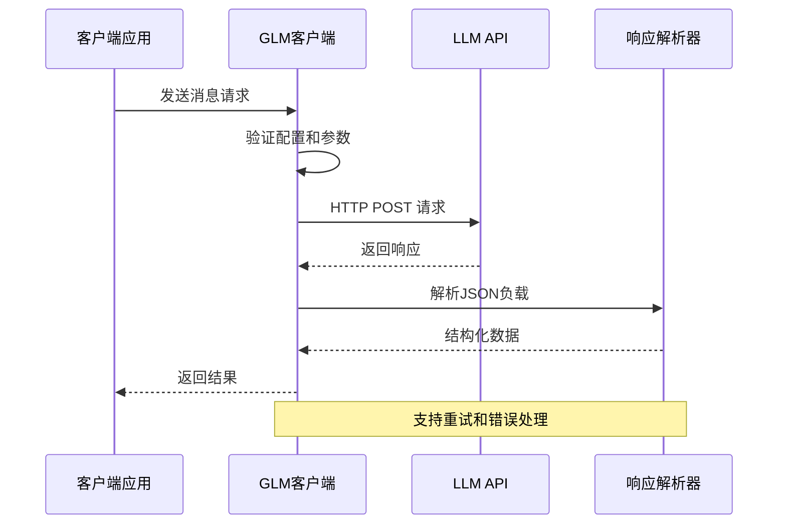
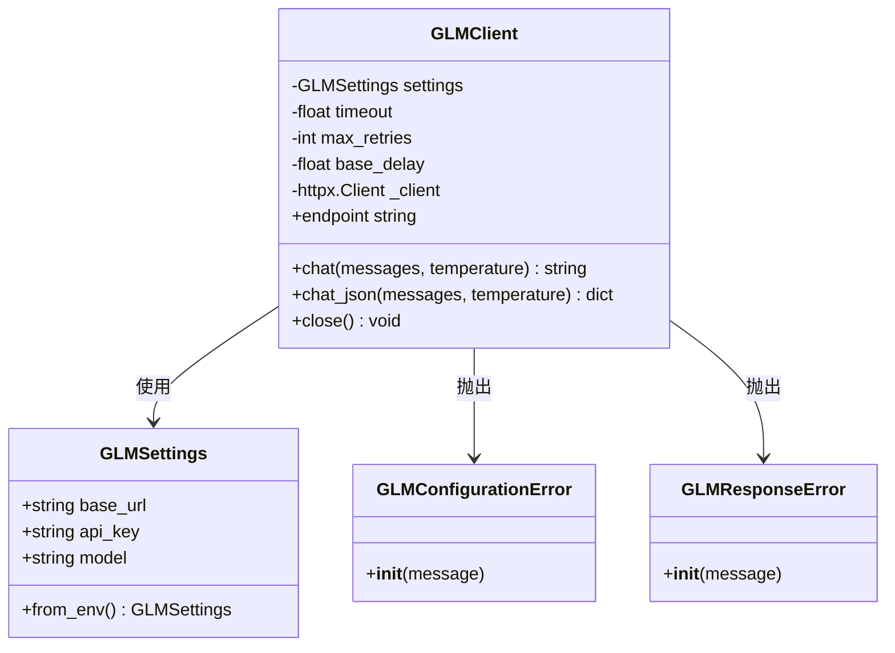
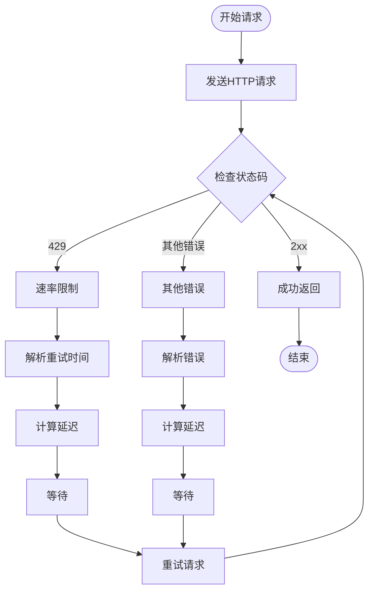
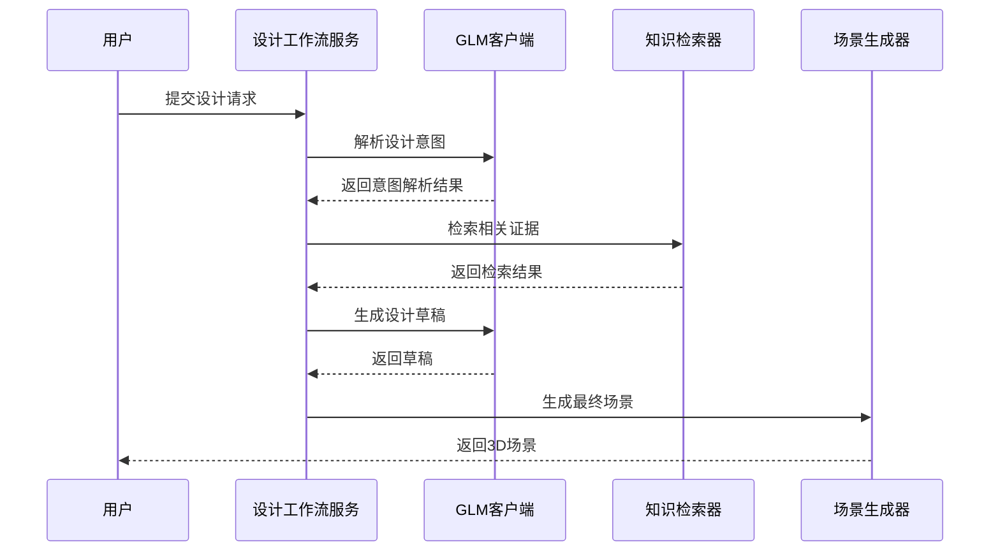
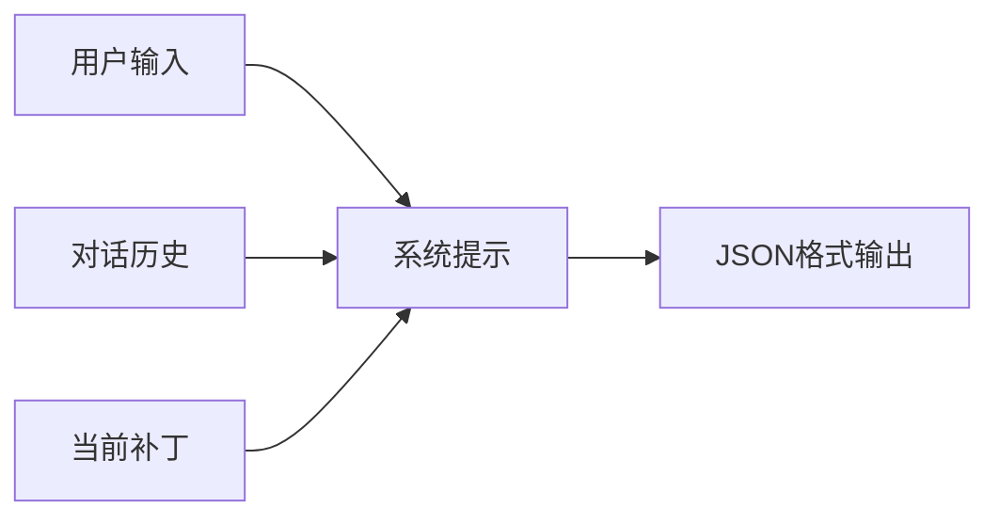
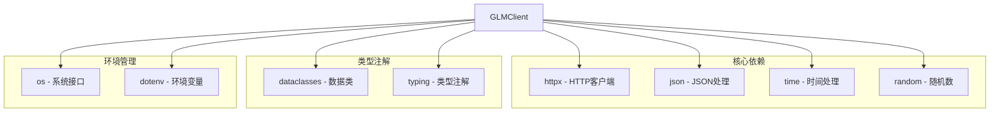

# 增强Glm客户端

<cite>
**本文档引用的文件**
- [src/roadgen3d/llm/glm_client.py](file://src/roadgen3d/llm/glm_client.py)
- [src/roadgen3d/llm/design_workflow.py](file://src/roadgen3d/llm/design_workflow.py)
- [src/roadgen3d/llm/prompts.py](file://src/roadgen3d/llm/prompts.py)
- [src/roadgen3d/services/design_runtime.py](file://src/roadgen3d/services/design_runtime.py)
- [src/roadgen3d/services/generation_core.py](file://src/roadgen3d/services/generation_core.py)
- [src/roadgen3d/services/generation_api.py](file://src/roadgen3d/services/generation_api.py)
- [src/roadgen3d/services/scene_jobs.py](file://src/roadgen3d/services/scene_jobs.py)
- [src/roadgen3d/knowledge/graphrag.py](file://src/roadgen3d/knowledge/graphrag.py)
- [src/roadgen3d/knowledge/pdf_rag.py](file://src/roadgen3d/knowledge/pdf_rag.py)
- [tests/test_glm_client.py](file://tests/test_glm_client.py)
- [readme.md](file://readme.md)
</cite>

## 目录
1. [简介](#简介)
2. [项目结构](#项目结构)
3. [核心组件](#核心组件)
4. [架构概览](#架构概览)
5. [详细组件分析](#详细组件分析)
6. [依赖关系分析](#依赖关系分析)
7. [性能考虑](#性能考虑)
8. [故障排除指南](#故障排除指南)
9. [结论](#结论)

## 简介

增强Glm客户端是RoadGen3D项目中的一个关键组件，它提供了一个OpenAI兼容的聊天完成客户端包装器，专门用于处理GLM（通义千问）和其他OpenAI兼容的API端点。该项目是一个神经符号系统，能够将文本描述转换为详细的3D城市街道场景。

该客户端支持多种功能：
- OpenAI兼容的聊天完成API
- 自动重试机制和指数退避
- JSON响应解析和验证
- 环境变量配置管理
- 错误处理和超时控制
- 支持多种认证方式（Bearer Token）

## 项目结构

RoadGen3D项目采用模块化架构，主要分为以下几个核心部分：

**图表来源**
- [src/roadgen3d/llm/glm_client.py:65-144](file://src/roadgen3d/llm/glm_client.py#L65-L144)
- [src/roadgen3d/llm/design_workflow.py:63-388](file://src/roadgen3d/llm/design_workflow.py#L63-L388)
- [src/roadgen3d/services/design_runtime.py:336-396](file://src/roadgen3d/services/design_runtime.py#L336-L396)

**章节来源**
- [readme.md:67-106](file://readme.md#L67-L106)

## 核心组件

### GLM客户端类

GLM客户端是整个系统的核心通信组件，提供了以下关键功能：

- **配置管理**：支持从环境变量读取配置，包括API密钥、基础URL和模型名称
- **HTTP通信**：使用httpx进行异步HTTP请求
- **重试机制**：实现指数退避和抖动的重试策略
- **JSON解析**：智能解析和提取JSON响应负载
- **错误处理**：提供详细的错误类型和异常处理

### 设计工作流服务

设计工作流服务协调LLM意图解析、RAG搜索和场景生成的完整流程：

- **意图解析**：将用户输入转换为结构化的设计意图
- **证据检索**：从多个知识源检索相关证据
- **草稿生成**：基于证据生成设计草稿
- **缓存机制**：实现智能缓存以提高性能

### 提示构建器

提供多种预定义的提示模板，用于不同的设计任务：

- **设计意图提示**：解析用户的设计目标和偏好
- **参数查询提示**：规划缺失参数的检索查询
- **设计草稿提示**：生成结构化的设计参数
- **场景评估提示**：评估生成的场景质量

**章节来源**
- [src/roadgen3d/llm/glm_client.py:65-144](file://src/roadgen3d/llm/glm_client.py#L65-L144)
- [src/roadgen3d/llm/design_workflow.py:63-388](file://src/roadgen3d/llm/design_workflow.py#L63-L388)
- [src/roadgen3d/llm/prompts.py:11-164](file://src/roadgen3d/llm/prompts.py#L11-L164)

## 架构概览

增强Glm客户端在整个系统架构中扮演着关键的通信中介角色：

**图表来源**
- [src/roadgen3d/llm/glm_client.py:93-143](file://src/roadgen3d/llm/glm_client.py#L93-L143)
- [src/roadgen3d/llm/glm_client.py:194-207](file://src/roadgen3d/llm/glm_client.py#L194-L207)

系统架构的关键特点：

1. **模块化设计**：每个组件都有明确的职责边界
2. **错误恢复**：内置重试机制和错误处理
3. **配置灵活性**：支持多种配置方式和环境变量
4. **扩展性**：易于集成新的LLM提供商

## 详细组件分析

### GLM客户端实现

GLM客户端采用了现代Python最佳实践：

**图表来源**
- [src/roadgen3d/llm/glm_client.py:34-63](file://src/roadgen3d/llm/glm_client.py#L34-L63)
- [src/roadgen3d/llm/glm_client.py:65-92](file://src/roadgen3d/llm/glm_client.py#L65-L92)

#### 配置管理机制

客户端支持两种配置方式：

1. **现代环境变量**：
   - `GRAPHRAG_API_KEY` - API密钥
   - `GRAPHRAG_API_BASE` - API基础URL
   - `LLM_MODEL` - 模型名称

2. **传统环境变量**：
   - `key` - API密钥
   - `llm_base_url` - API基础URL
   - `glm_model` - 模型名称

#### 重试机制

实现了智能的重试策略：

**图表来源**
- [src/roadgen3d/llm/glm_client.py:120-143](file://src/roadgen3d/llm/glm_client.py#L120-L143)

**章节来源**
- [src/roadgen3d/llm/glm_client.py:40-62](file://src/roadgen3d/llm/glm_client.py#L40-L62)
- [src/roadgen3d/llm/glm_client.py:158-175](file://src/roadgen3d/llm/glm_client.py#L158-L175)

### 设计工作流服务

设计工作流服务提供了完整的LLM+RAG设计管道：

**图表来源**
- [src/roadgen3d/llm/design_workflow.py:113-240](file://src/roadgen3d/llm/design_workflow.py#L113-L240)

#### 缓存机制

实现了智能缓存以提高性能：

- **缓存键生成**：基于用户输入和知识源的哈希值
- **版本控制**：支持缓存版本管理和失效
- **警告机制**：缓存命中时提供性能警告
- **持久化存储**：使用JSON文件存储缓存数据

**章节来源**
- [src/roadgen3d/llm/design_workflow.py:402-494](file://src/roadgen3d/llm/design_workflow.py#L402-L494)

### 提示构建器系统

提示构建器提供了多种预定义的提示模板：

#### 设计意图提示构建器

**图表来源**
- [src/roadgen3d/llm/prompts.py:11-52](file://src/roadgen3d/llm/prompts.py#L11-L52)

#### 参数查询提示构建器

用于规划缺失参数的检索查询，支持字段级别的查询生成。

#### 场景评估提示构建器

提供多维度的场景评估能力，包括视觉美观度、空间布局合理性、多样性与丰富度、规范合规性和行人友好性。

**章节来源**
- [src/roadgen3d/llm/prompts.py:113-164](file://src/roadgen3d/llm/prompts.py#L113-L164)
- [src/roadgen3d/llm/prompts.py:167-211](file://src/roadgen3d/llm/prompts.py#L167-L211)

## 依赖关系分析

增强Glm客户端的依赖关系相对简洁，主要依赖于标准库和第三方库：

**图表来源**
- [src/roadgen3d/llm/glm_client.py:10-21](file://src/roadgen3d/llm/glm_client.py#L10-L21)

### 第三方库依赖

- **httpx**：提供异步HTTP客户端功能
- **python-dotenv**：支持.env文件加载
- **typing_extensions**：提供额外的类型注解功能

### 内部依赖

- **logging**：标准日志记录
- **json**：JSON序列化和反序列化
- **random**：随机数生成和抖动
- **time**：时间延迟和退避

**章节来源**
- [src/roadgen3d/llm/glm_client.py:1-21](file://src/roadgen3d/llm/glm_client.py#L1-L21)

## 性能考虑

### 连接池管理

GLM客户端使用httpx的连接池来优化网络请求性能：

- **连接复用**：避免频繁建立TCP连接
- **超时控制**：默认60秒超时，可根据需要调整
- **传输适配器**：支持自定义传输层配置

### 缓存策略

设计工作流服务实现了多层次的缓存机制：

- **草稿缓存**：缓存设计草稿以避免重复计算
- **证据缓存**：缓存RAG检索结果
- **配置缓存**：缓存LLM设置和模型信息

### 错误处理优化

- **指数退避**：4秒基础延迟，每次重试翻倍
- **抖动**：0.5-1.5倍抖动防止同步重试风暴
- **最大重试次数**：默认10次重试
- **特定错误处理**：429状态码特殊处理

## 故障排除指南

### 常见配置问题

#### 环境变量配置错误

**问题**：客户端无法找到API密钥或基础URL

**解决方案**：
1. 检查环境变量是否正确设置
2. 验证GRAPHRAG_API_KEY和GRAPHRAG_API_BASE
3. 确认legacy变量（key和llm_base_url）作为后备选项

#### 网络连接问题

**问题**：HTTP请求超时或连接失败

**解决方案**：
1. 检查网络连接状态
2. 验证API基础URL格式
3. 调整timeout参数
4. 检查防火墙设置

### LLM响应问题

#### JSON解析错误

**问题**：客户端无法解析LLM响应

**解决方案**：
1. 检查extract_json_payload函数
2. 验证LLM返回格式
3. 确认响应包含有效的JSON负载

#### 速率限制问题

**问题**：频繁遇到429状态码

**解决方案**：
1. 检查Retry-After头部
2. 实现指数退避策略
3. 调整请求频率
4. 考虑使用付费API计划

**章节来源**
- [tests/test_glm_client.py:18-47](file://tests/test_glm_client.py#L18-L47)

## 结论

增强Glm客户端是RoadGen3D项目中的关键通信组件，它提供了稳定、高效的LLM集成能力。通过精心设计的架构和完善的错误处理机制，该客户端能够可靠地处理各种生产环境中的挑战。

主要优势包括：

1. **可靠性**：内置重试机制和错误恢复
2. **灵活性**：支持多种配置方式和环境变量
3. **性能**：优化的连接池和缓存策略
4. **可维护性**：清晰的代码结构和详细的文档
5. **扩展性**：易于集成新的LLM提供商和功能

该客户端为整个RoadGen3D系统的文本到3D场景生成功能奠定了坚实的基础，是实现高质量城市街道设计自动化的重要工具。