# 评估模块

<cite>
**本文档引用的文件**
- [evaluation/README.md](file://evaluation/README.md)
- [evaluation/src/roadgen3d/eval_quality.py](file://evaluation/src/roadgen3d/eval_quality.py)
- [evaluation/scripts/eval_walkability.py](file://evaluation/scripts/eval_walkability.py)
- [evaluation/docs/evaluation_module_plan.md](file://evaluation/docs/evaluation_module_plan.md)
- [scripts/m4_10_eval_engineering.py](file://scripts/m4_10_eval_engineering.py)
- [src/roadgen3d/eval_metrics.py](file://src/roadgen3d/eval_metrics.py)
- [src/roadgen3d/auto_pipeline/iteration_controller.py](file://src/roadgen3d/auto_pipeline/iteration_controller.py)
- [web/workbench/src/app.ts](file://web/workbench/src/app.ts)
- [web/workbench/src/lib/api.ts](file://web/workbench/src/lib/api.ts)
- [web/workbench/src/types.ts](file://web/workbench/src/types.ts)
- [src/roadgen3d/llm/design_workflow.py](file://src/roadgen3d/llm/design_workflow.py)
- [src/roadgen3d/llm/prompts.py](file://src/roadgen3d/llm/prompts.py)
- [src/roadgen3d/llm/safety_eval.py](file://src/roadgen3d/llm/safety_eval.py)
- [src/roadgen3d/llm/beauty_eval.py](file://src/roadgen3d/llm/beauty_eval.py)
- [src/roadgen3d/scene_audio.py](file://src/roadgen3d/scene_audio.py)
- [web/api/main.py](file://web/api/main.py)
- [tests/test_auto_eval.py](file://tests/test_auto_eval.py)
- [scripts/run_auto_eval.py](file://scripts/run_auto_eval.py)
- [src/roadgen3d/knowledge/graphrag.py](file://src/roadgen3d/knowledge/graphrag.py)
- [src/roadgen3d/knowledge/pdf_rag.py](file://src/roadgen3d/knowledge/pdf_rag.py)
- [src/roadgen3d/services/design_types.py](file://src/roadgen3d/services/design_types.py)
- [todo.md](file://todo.md)
</cite>

## 更新摘要
**变更内容**
- 新增LLM安全评估和美丽评估模块，提供独立的AI驱动评估能力
- 增强评估质量模块的诊断功能，新增安全性和美观性的深度诊断分析
- 新增场景音频分析功能，支持基于布局数据的环境声音建模
- 更新Web API支持新的评估端点，包括统一评估和传统评估接口
- 前端evaluateScene()函数现在返回真实的评估结果而非mock数据

## 目录
1. [简介](#简介)
2. [项目结构](#项目结构)
3. [核心组件](#核心组件)
4. [架构概览](#架构概览)
5. [详细组件分析](#详细组件分析)
6. [LLM安全评估模块](#llm安全评估模块)
7. [LLM美丽评估模块](#llm美丽评估模块)
8. [场景音频分析模块](#场景音频分析模块)
9. [统一LLM评估系统](#统一llm评估系统)
10. [知识库集成](#知识库集成)
11. [前端集成](#前端集成)
12. [依赖关系分析](#依赖关系分析)
13. [性能考虑](#性能考虑)
14. [故障排除指南](#故障排除指南)
15. [结论](#结论)

## 简介

RoadGen3D评估模块是一个专门设计用于评估街道设计质量的人类中心化评估系统。该模块专注于三个核心维度：步行友好度（Walkability）、安全性和美观度（Beauty），旨在为城市街道设计提供客观、可量化的评估标准。

**最新更新** 评估模块现已完成重大架构升级，从传统的基于LLM的不确定性评估转变为确定性计算模式。新的评估系统采用统一的加权公式 round(walkability × 0.45 + safety × 0.35 + beauty × 0.20)，确保评估结果的可重现性和一致性。同时，系统集成了GraphRAG知识库检索功能，为设计决策提供更丰富的专业指导。

评估模块的核心目标是：
- 提供基于场景布局数据的统一LLM评估能力
- 支持批量工程评估和单场景验证
- 为设计决策提供数据驱动的反馈
- 与 RoadGen3D 整体生态系统无缝集成
- 集成多源知识库提供专业设计指导
- 新增独立的LLM安全评估和美丽评估模块
- 增强评估质量模块的诊断功能
- 支持场景音频分析功能

## 项目结构

评估模块在 RoadGen3D 项目中的组织结构如下：

```mermaid
graph TB
subgraph "评估模块根目录"
EVAL[evaluation/]
EVAL_SRC[EVAL/src/roadgen3d/]
EVAL_SCRIPTS[EVAL/scripts/]
EVAL_DOCS[EVAL/docs/]
EVAL_SRC_QUALITY[EVAL/src/roadgen3d/eval_quality.py]
EVAL_SCRIPT_WALKABILITY[EVAL/scripts/eval_walkability.py]
EVAL_PLAN[EVAL/docs/evaluation_module_plan.md]
EVAL_README[EVAL/README.md]
end
subgraph "LLM评估系统"
LLM_WORKFLOW[src/roadgen3d/llm/design_workflow.py]
LLM_PROMPTS[src/roadgen3d/llm/prompts.py]
LLM_CLIENT[src/roadgen3d/llm/llm_client.py]
LLM_SAFETY[src/roadgen3d/llm/safety_eval.py]
LLM_BEAUTY[src/roadgen3d/llm/beauty_eval.py]
end
subgraph "Web API层"
WEB_API[web/api/main.py]
UNIFIED_ENDPOINT[/api/design/evaluate/unified]
TRADEOFF_ENDPOINT[/api/design/evaluate]
end
subgraph "前端集成"
WEB_APP[web/workbench/src/lib/api.ts]
WEB_TYPES[web/workbench/src/types.ts]
ENDPOINT_INTEGRATION[evaluateScene()函数]
end
subgraph "知识库系统"
GRAPH_RAG[src/roadgen3d/knowledge/graphrag.py]
PDF_RAG[src/roadgen3d/knowledge/pdf_rag.py]
KNOWLEDGE_INIT[src/roadgen3d/knowledge/__init__.py]
end
subgraph "传统评估组件"
CORE_QUALITY[src/roadgen3d/eval_quality.py]
CORE_METRICS[src/roadgen3d/eval_metrics.py]
SCRIPT_ENGINEERING[scripts/m4_10_eval_engineering.py]
AUDIO_ANALYSIS[src/roadgen3d/scene_audio.py]
end
EVAL --> EVAL_SRC
EVAL --> EVAL_SCRIPTS
EVAL --> EVAL_DOCS
EVAL_SCRIPTS --> EVAL_SCRIPT_WALKABILITY
EVAL_SRC --> EVAL_SRC_QUALITY
LLM_WORKFLOW --> LLM_PROMPTS
LLM_WORKFLOW --> LLM_CLIENT
LLM_SAFETY --> LLM_CLIENT
LLM_BEAUTY --> LLM_CLIENT
WEB_API --> UNIFIED_ENDPOINT
WEB_API --> TRADEOFF_ENDPOINT
UNIFIED_ENDPOINT --> LLM_WORKFLOW
TRADEOFF_ENDPOINT --> LLM_SAFETY
TRADEOFF_ENDPOINT --> LLM_BEAUTY
WEB_APP --> UNIFIED_ENDPOINT
WEB_APP --> TRADEOFF_ENDPOINT
WEB_TYPES --> ENDPOINT_INTEGRATION
GRAPH_RAG --> KNOWLEDGE_INIT
PDF_RAG --> KNOWLEDGE_INIT
CORE_QUALITY --> CORE_METRICS
SCRIPT_ENGINEERING --> CORE_QUALITY
AUDIO_ANALYSIS --> CORE_QUALITY
```

**图表来源**
- [evaluation/README.md:1-41](file://evaluation/README.md#L1-L41)
- [evaluation/src/roadgen3d/eval_quality.py:1-366](file://evaluation/src/roadgen3d/eval_quality.py#L1-L366)
- [scripts/m4_10_eval_engineering.py:1-413](file://scripts/m4_10_eval_engineering.py#L1-L413)
- [src/roadgen3d/llm/design_workflow.py:352-414](file://src/roadgen3d/llm/design_workflow.py#L352-L414)
- [web/api/main.py:267-338](file://web/api/main.py#L267-L338)
- [src/roadgen3d/knowledge/graphrag.py:1-800](file://src/roadgen3d/knowledge/graphrag.py#L1-L800)

## 核心组件

评估模块包含以下核心组件：

### 1. 统一LLM评估器
**全新功能** 采用evaluate_scene_unified()方法，提供统一的三维评估：
- **步行性（45%）**：人行道宽度、净空连续性、家具密度、照明均匀、绿化遮荫
- **安全性（35%）**：交通隔离、过街设施、缓冲带、安全感知
- **美观性（20%）**：植物配置协调性、街道家具风格统一、空间丰富度
- **综合分**：基于确定性加权公式的总分，确保可重现性
- **知识库集成**：支持PDF RAG、GraphRAG、混合模式的知识检索

### 2. 独立LLM安全评估模块
**新增功能** 采用evaluate_safety()方法，提供专业的安全评估：
- **子维度评估**：照明、可视性、防护、激活四个维度
- **标准化评分**：0-5分制，转换为0-1归一化分数
- **AI驱动分析**：结合结构化特征和场景图像进行综合评估
- **缓存机制**：基于文件的缓存系统，避免重复计算
- **推理解释**：提供详细的评估理由和依据

### 3. 独立LLM美丽评估模块
**新增功能** 采用evaluate_beauty()方法，提供专业的美学评估：
- **子维度评估**：一致性、人性化尺度、材料对比、视觉兴趣
- **标准化评分**：0-5分制，转换为0-1归一化分数
- **AI驱动分析**：结合结构化特征和场景图像进行综合评估
- **缓存机制**：基于文件的缓存系统，避免重复计算
- **推理解释**：提供详细的美学评价和改进建议

### 4. 场景音频分析模块
**新增功能** 采用analyze_scene_audio()方法，提供环境声音建模：
- **环境音量建模**：交通、自然、城市、公共交通四类音量
- **位置声源识别**：识别特定的声学发射器（如公交站）
- **需求水平分析**：基于车流、行人、自行车、公交需求建模
- **绿植影响评估**：树木和花坛对自然音量的影响
- **建筑密度建模**：建筑物对城市音量的影响

### 5. 增强的评估质量诊断功能
**已更新** 评估质量模块现在包含深度诊断功能：
- **安全诊断**：识别最薄弱的安全维度，提供改进建议
- **美观诊断**：识别最薄弱的美学维度，提供改善方案
- **LLM一致性检查**：检测AI评估结果的一致性
- **综合分析报告**：提供详细的评估分析和建议

### 6. 传统评估器（保留）
**已更新** 仍保留原有的步行友好度、安全性、美观度评估器：
- **步行友好度评估器**：11个量化步行指标，涵盖保护、舒适和愉悦三个维度
- **安全性评估器**：基于结构化特征和LLM主观判断的综合安全评估
- **美观度评估器**：结合视觉美学和场所吸引力的综合评估

### 7. LLM评估提示词系统
**全新功能** 采用build_unified_evaluation_messages()函数：
- 定义统一的评估维度和评分标准
- 支持JSON格式的标准化输出
- 提供详细的改进建议和指标分析
- 集成知识库证据支持

### 8. 多知识源检索系统
**全新功能** 支持三种知识源：
- **PDF RAG**：基于Complete Streets设计指南的PDF知识库
- **GraphRAG**：基于图谱分析的社区报告和文本单元
- **混合模式**：结合PDF和GraphRAG的优势

**章节来源**
- [src/roadgen3d/llm/safety_eval.py:88-141](file://src/roadgen3d/llm/safety_eval.py#L88-L141)
- [src/roadgen3d/llm/beauty_eval.py:88-143](file://src/roadgen3d/llm/beauty_eval.py#L88-L143)
- [src/roadgen3d/scene_audio.py:8-85](file://src/roadgen3d/scene_audio.py#L8-L85)
- [evaluation/src/roadgen3d/eval_quality.py:308-343](file://evaluation/src/roadgen3d/eval_quality.py#L308-L343)
- [evaluation/src/roadgen3d/eval_quality.py:349-407](file://evaluation/src/roadgen3d/eval_quality.py#L349-L407)
- [evaluation/src/roadgen3d/eval_quality.py:438-499](file://evaluation/src/roadgen3d/eval_quality.py#L438-L499)

## 架构概览

评估模块采用分层架构设计，现已完全集成统一LLM评估系统、独立LLM评估模块和音频分析功能：

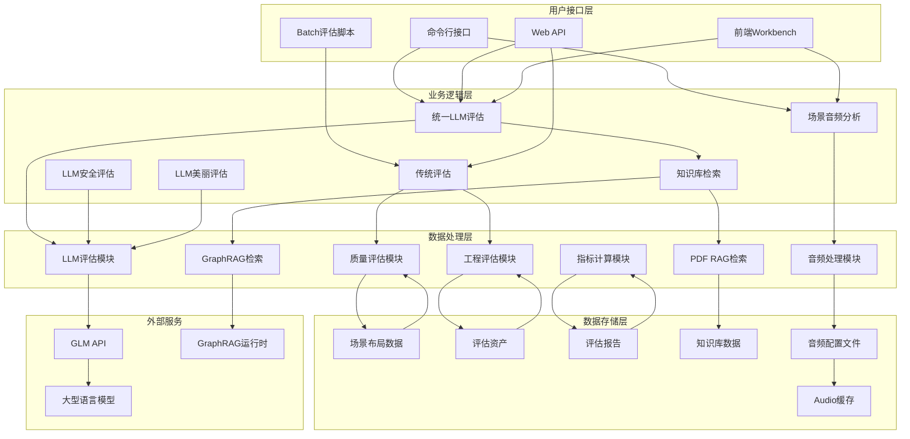

**图表来源**
- [src/roadgen3d/llm/safety_eval.py:88-141](file://src/roadgen3d/llm/safety_eval.py#L88-L141)
- [src/roadgen3d/llm/beauty_eval.py:88-143](file://src/roadgen3d/llm/beauty_eval.py#L88-L143)
- [src/roadgen3d/scene_audio.py:8-85](file://src/roadgen3d/scene_audio.py#L8-L85)
- [web/api/main.py:294-318](file://web/api/main.py#L294-L318)

## 详细组件分析

### LLM安全评估模块

**新增功能** LLM安全评估模块提供专业的安全评估能力，采用独立的评估流程：

#### 评估维度与权重

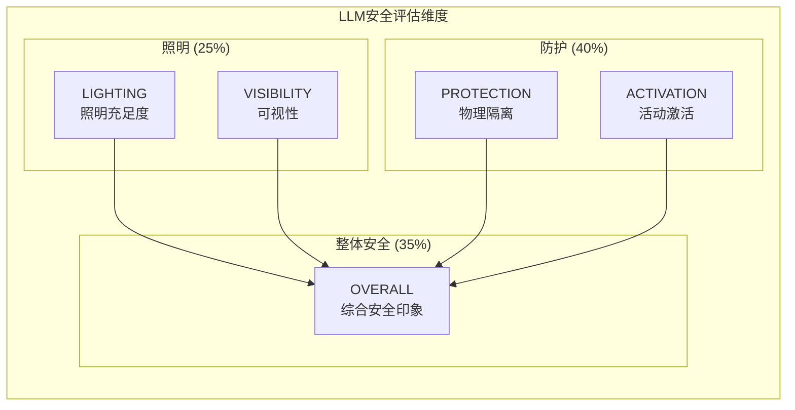

**图表来源**
- [src/roadgen3d/llm/safety_eval.py:62-74](file://src/roadgen3d/llm/safety_eval.py#L62-L74)
- [src/roadgen3d/llm/safety_eval.py:130-138](file://src/roadgen3d/llm/safety_eval.py#L130-L138)

#### 核心算法实现

LLM安全评估的核心算法包括：

1. **缓存机制**：使用文件系统缓存避免重复计算
2. **消息构建**：构建包含结构化特征和图像的评估消息
3. **LLM调用**：通过GLMClient调用大型语言模型进行评估
4. **结果归一化**：将0-5分制转换为0-1归一化分数
5. **推理解释**：提供详细的评估理由和改进建议

#### 输出结果格式

LLM安全评估模块输出标准化的JSON格式：
```json
{
  "lighting": 0.8,
  "visibility": 0.6,
  "protection": 0.7,
  "activation": 0.5,
  "overall": 0.65,
  "reasoning": "照明充足但可视性有待改善，建议增加景观树木以改善视线",
  "cached": false
}
```

**章节来源**
- [src/roadgen3d/llm/safety_eval.py:88-141](file://src/roadgen3d/llm/safety_eval.py#L88-L141)

### LLM美丽评估模块

**新增功能** LLM美丽评估模块提供专业的美学评估能力，采用独立的评估流程：

#### 评估维度与权重

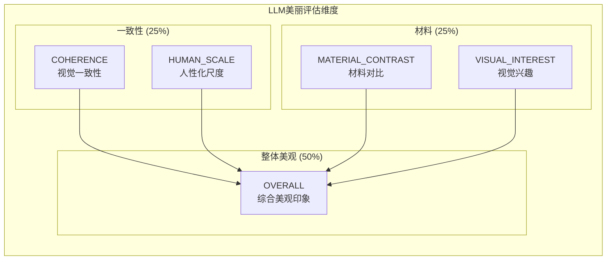

**图表来源**
- [src/roadgen3d/llm/beauty_eval.py:62-74](file://src/roadgen3d/llm/beauty_eval.py#L62-L74)
- [src/roadgen3d/llm/beauty_eval.py:132-140](file://src/roadgen3d/llm/beauty_eval.py#L132-L140)

#### 核心算法实现

LLM美丽评估的核心算法包括：

1. **缓存机制**：使用文件系统缓存避免重复计算
2. **消息构建**：构建包含结构化特征和图像的评估消息
3. **LLM调用**：通过GLMClient调用大型语言模型进行评估
4. **结果归一化**：将0-5分制转换为0-1归一化分数
5. **推理解释**：提供详细的美学评价和改进建议

#### 输出结果格式

LLM美丽评估模块输出标准化的JSON格式：
```json
{
  "coherence": 0.7,
  "human_scale": 0.8,
  "material_contrast": 0.6,
  "visual_interest": 0.7,
  "overall": 0.7,
  "reasoning": "材料对比和谐但缺乏视觉焦点，建议增加特色装饰元素",
  "cached": false
}
```

**章节来源**
- [src/roadgen3d/llm/beauty_eval.py:88-143](file://src/roadgen3d/llm/beauty_eval.py#L88-L143)

### 场景音频分析模块

**新增功能** 场景音频分析模块提供环境声音建模能力：

#### 音频建模算法

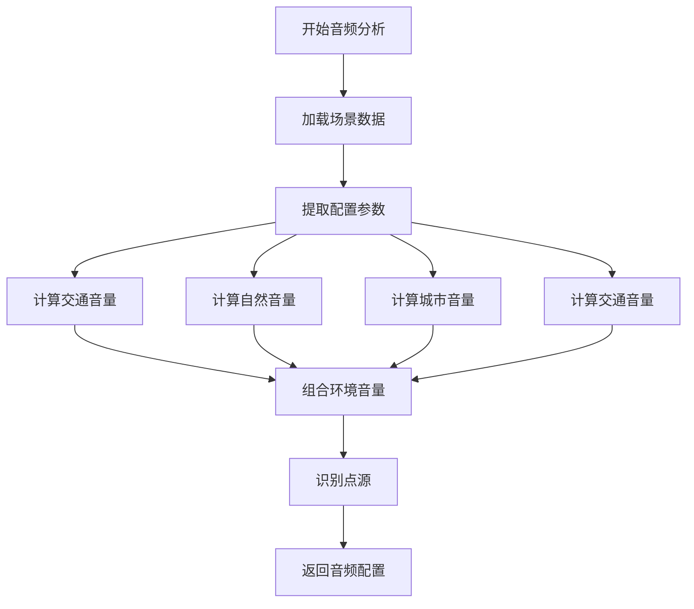

**图表来源**
- [src/roadgen3d/scene_audio.py:8-76](file://src/roadgen3d/scene_audio.py#L8-L76)

#### 音频建模参数

场景音频分析模块基于以下参数进行建模：

1. **交通音量**：基于车道数、道路宽度、车辆需求
2. **自然音量**：基于树木、花坛数量、车辆需求
3. **城市音量**：基于密度、行人需求、建筑数量
4. **交通音量**：基于公交站数量、公交需求
5. **点源识别**：识别特定的声学发射器（如公交站）

#### 输出结果格式

场景音频分析模块输出标准化的JSON格式：
```json
{
  "ambient": {
    "traffic": 0.3,
    "nature": 0.7,
    "urban": 0.5,
    "transit": 0.2
  },
  "point_sources": [
    {
      "type": "bus_stop",
      "position": [10.0, 0.0, 5.0],
      "radius_m": 15.0
    }
  ]
}
```

**章节来源**
- [src/roadgen3d/scene_audio.py:8-85](file://src/roadgen3d/scene_audio.py#L8-L85)

### 增强的评估质量诊断功能

**已更新** 评估质量模块现在包含深度诊断功能：

#### 安全诊断功能

安全诊断功能能够识别最薄弱的安全维度：

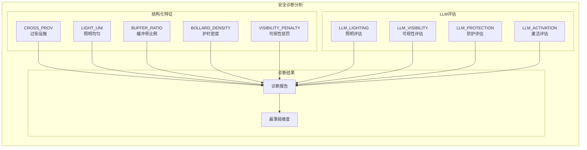

**图表来源**
- [evaluation/src/roadgen3d/eval_quality.py:308-324](file://evaluation/src/roadgen3d/eval_quality.py#L308-L324)

#### 美观诊断功能

美观诊断功能能够识别最薄弱的美学维度：

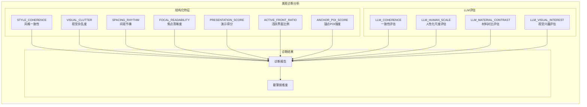

**图表来源**
- [evaluation/src/roadgen3d/eval_quality.py:326-342](file://evaluation/src/roadgen3d/eval_quality.py#L326-L342)

#### LLM一致性检查

评估模块现在包含LLM评估结果的一致性检查：

1. **标准差计算**：计算LLM子维度评估的标准差
2. **阈值判断**：超过0.20阈值标记为需要审查
3. **一致性报告**：提供详细的LLM评估一致性分析

**章节来源**
- [evaluation/src/roadgen3d/eval_quality.py:388-396](file://evaluation/src/roadgen3d/eval_quality.py#L388-L396)
- [evaluation/src/roadgen3d/eval_quality.py:482-489](file://evaluation/src/roadgen3d/eval_quality.py#L482-L489)

### 统一LLM评估系统

**全新功能** 统一LLM评估系统是评估模块的核心创新，提供了一套完整的AI驱动评估解决方案：

#### API端点设计

#### /api/design/evaluate/unified 端点

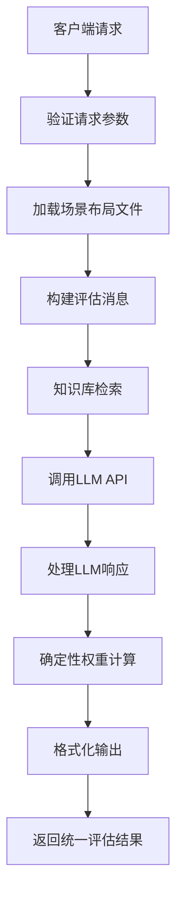

**图表来源**
- [web/api/main.py:306-318](file://web/api/main.py#L306-L318)
- [src/roadgen3d/llm/design_workflow.py:352-414](file://src/roadgen3d/llm/design_workflow.py#L352-L414)

#### /api/design/evaluate 端点

**新增功能** 传统评估端点现在支持LLM安全和美丽评估：
- **安全评估**：调用evaluate_safety()函数
- **美丽评估**：调用evaluate_beauty()函数
- **缓存机制**：避免重复计算
- **标准化输出**：统一的评估结果格式

**章节来源**
- [web/api/main.py:294-318](file://web/api/main.py#L294-L318)
- [src/roadgen3d/llm/safety_eval.py:88-141](file://src/roadgen3d/llm/safety_eval.py#L88-L141)
- [src/roadgen3d/llm/beauty_eval.py:88-143](file://src/roadgen3d/llm/beauty_eval.py#L88-L143)

### 工程评估集成

工程评估模块负责批量处理多个场景：

#### 批量处理流程

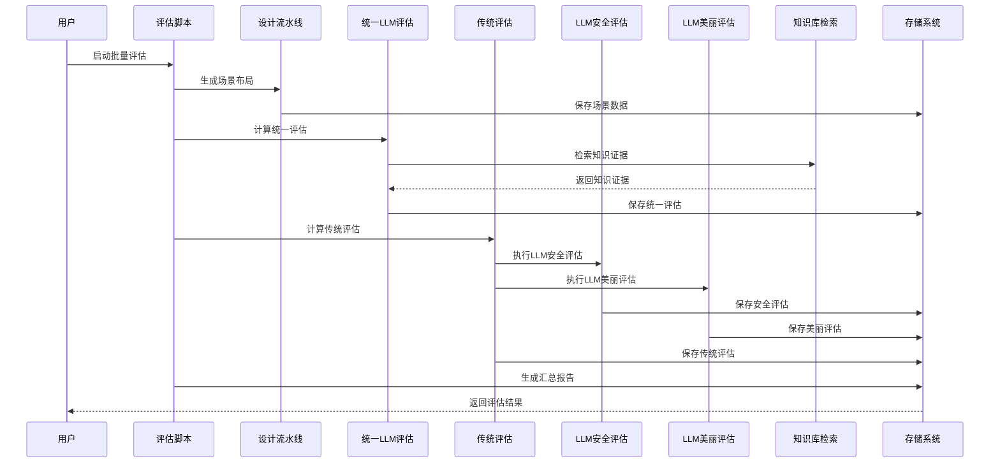

**图表来源**
- [scripts/m4_10_eval_engineering.py:192-221](file://scripts/m4_10_eval_engineering.py#L192-L221)
- [scripts/m4_10_eval_engineering.py:355-397](file://scripts/m4_10_eval_engineering.py#L355-L397)

#### 报表生成

工程评估模块生成多种格式的报表：
- **CSV格式**：包含每个场景的详细指标
- **JSON格式**：包含汇总统计和比较分析
- **可视化图表**：支持前端展示

**章节来源**
- [scripts/m4_10_eval_engineering.py:355-397](file://scripts/m4_10_eval_engineering.py#L355-L397)
- [src/roadgen3d/eval_metrics.py:194-269](file://src/roadgen3d/eval_metrics.py#L194-L269)

## 知识库集成

**全新功能** 评估模块集成了强大的知识库检索系统，为设计评估提供专业的指导：

### 多知识源支持

#### PDF RAG知识库
- **数据来源**：Complete Streets设计指南PDF文档
- **检索方式**：基于FAISS向量索引的语义检索
- **适用场景**：设计规范、标准和最佳实践查询

#### GraphRAG知识库
- **数据来源**：图谱分析生成的社区报告和文本单元
- **检索方式**：官方GraphRAG运行时优先，降级到合并txt数据
- **适用场景**：社区洞察、设计原则和案例研究

#### 混合模式
- **工作原理**：优先使用官方GraphRAG运行时，否则回退到合并txt数据
- **优势**：平衡性能和准确性，提供稳定的检索体验

### 知识库检索流程

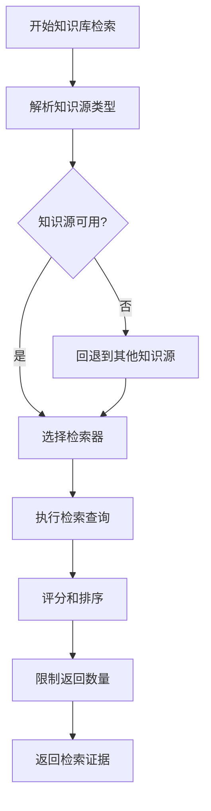

**图表来源**
- [src/roadgen3d/llm/design_workflow.py:608-627](file://src/roadgen3d/llm/design_workflow.py#L608-L627)
- [src/roadgen3d/knowledge/graphrag.py:403-422](file://src/roadgen3d/knowledge/graphrag.py#L403-422)

### 知识库状态管理

#### GraphRAG状态描述
- **可用性检测**：检查实体、关系、社区报告等关键文件
- **运行时模式**：支持official（官方运行时）和static_fallback（静态回退）
- **构建状态**：跟踪构建进度和错误信息
- **同步状态**：监控输入文件同步和缓存状态

#### 状态信息字段
- **artifact_count**：知识库工件数量
- **item_count**：检索条目总数
- **runtime_mode**：当前运行时模式
- **needs_rebuild**：是否需要重建
- **last_build_status**：最后构建状态

**章节来源**
- [src/roadgen3d/knowledge/graphrag.py:269-338](file://src/roadgen3d/knowledge/graphrag.py#L269-L338)
- [src/roadgen3d/llm/design_workflow.py:608-627](file://src/roadgen3d/llm/design_workflow.py#L608-L627)

## 前端集成

**全新功能** 前端系统已完全集成统一LLM评估功能：

### evaluateScene()函数

前端通过evaluateScene()函数调用统一评估API：

#### 函数实现

**更新** evaluateScene()函数现在返回`EvaluationResponse | null`而不是mock数据，并增强了错误处理机制：

```typescript
export async function evaluateScene(layoutPath: string): Promise<EvaluationResponse | null> {
  try {
    const response = await postJson<{
      walkability: number;
      safety: number;
      beauty: number;
      overall: number;
      evaluation: string;
      suggestions: string[];
      indicators: WalkabilityIndicators | null;
    }>("/api/design/evaluate/unified", {
      layout_path: layoutPath,
      image_path: null,
    }, 60000); // 60s timeout

    return {
      scores: {
        walkability: response.walkability,
        safety: response.safety,
        beauty: response.beauty,
        overall: response.overall,
      },
      indicators: response.indicators,
      evaluation: response.evaluation,
      suggestions: response.suggestions,
    };
  } catch (error) {
    console.error("Evaluation API failed:", error);
    return null; // Return null instead of mock data
  }
}
```

#### 工作流程

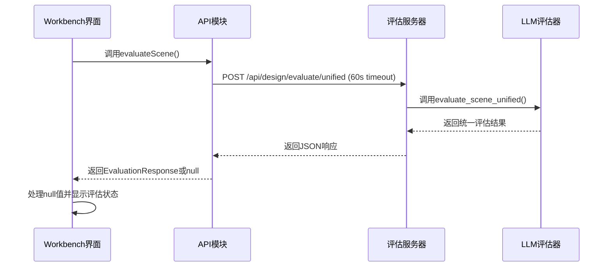

**图表来源**
- [web/workbench/src/lib/api.ts:76-106](file://web/workbench/src/lib/api.ts#L76-L106)
- [web/workbench/src/app.ts:278-286](file://web/workbench/src/app.ts#L278-L286)

### UI集成

前端系统已完全适配新的评估结果格式：
- **雷达图可视化**：显示步行性、安全性、美观性的三维评分
- **综合评分展示**：突出显示overall综合评分
- **改进建议**：显示LLM提供的具体改进建议
- **错误状态处理**：当评估失败时显示"评估服务不可用"状态
- **实时更新**：评估完成后立即更新界面显示

**更新** 前端现在移除了mock数据回退机制，直接使用null值来表示评估失败，增强了系统的可靠性和准确性。

**章节来源**
- [web/workbench/src/lib/api.ts:76-106](file://web/workbench/src/lib/api.ts#L76-L106)
- [web/workbench/src/types.ts:236-241](file://web/workbench/src/types.ts#L236-L241)
- [web/workbench/src/app.ts:278-286](file://web/workbench/src/app.ts#L278-L286)

## 依赖关系分析

评估模块的依赖关系体现了清晰的分层架构，现已完全集成统一LLM评估系统、独立LLM评估模块和音频分析功能：

```mermaid
graph TB
subgraph "外部依赖"
JSON[JSON处理库]
MATH[数学计算库]
PATHLIB[路径处理库]
ARGPARSE[命令行解析]
GLM_API[GLM API客户端]
LLM_MODELS[大型语言模型]
PANDAS[数据分析库]
PARQUET[Parquet文件支持]
BASE64[Base64编码库]
HASHLIB[哈希库]
END
subgraph "内部模块依赖"
DESIGN_WORKFLOW[design_workflow.py]
PROMPTS[prompts.py]
EVAL_QUALITY[eval_quality.py]
EVAL_METRICS[eval_metrics.py]
STREET_LAYOUT[street_layout.py]
TYPES[design_types.py]
GRAPH_RAG[graphrag.py]
PDF_RAG[pdf_rag.py]
SAFETY_EVAL[safety_eval.py]
BEAUTY_EVAL[beauty_eval.py]
SCENE_AUDIO[scene_audio.py]
end
subgraph "Web API依赖"
WEB_MAIN[web/api/main.py]
API_TS[web/workbench/src/lib/api.ts]
APP_TS[web/workbench/src/app.ts]
TYPES_TS[web/workbench/src/types.ts]
end
subgraph "脚本依赖"
EVAL_WALKABILITY[eval_walkability.py]
M4_EVAL_ENGINEERING[m4_10_eval_engineering.py]
RUN_AUTO_EVAL[run_auto_eval.py]
TEST_AUTO_EVAL[test_auto_eval.py]
end
DESIGN_WORKFLOW --> PROMPTS
DESIGN_WORKFLOW --> GLM_API
DESIGN_WORKFLOW --> LLM_MODELS
DESIGN_WORKFLOW --> GRAPH_RAG
DESIGN_WORKFLOW --> PDF_RAG
SAFETY_EVAL --> GLM_API
BEAUTY_EVAL --> GLM_API
SCENE_AUDIO --> EVAL_QUALITY
WEB_MAIN --> DESIGN_WORKFLOW
WEB_MAIN --> SAFETY_EVAL
WEB_MAIN --> BEAUTY_EVAL
API_TS --> WEB_MAIN
APP_TS --> API_TS
TYPES_TS --> APP_TS
EVAL_WALKABILITY --> EVAL_QUALITY
M4_EVAL_ENGINEERING --> EVAL_QUALITY
M4_EVAL_ENGINEERING --> EVAL_METRICS
M4_EVAL_ENGINEERING --> STREET_LAYOUT
RUN_AUTO_EVAL --> M4_EVAL_ENGINEERING
TEST_AUTO_EVAL --> RUN_AUTO_EVAL
EVAL_QUALITY --> EVAL_METRICS
EVAL_QUALITY --> TYPES
```

**图表来源**
- [src/roadgen3d/llm/safety_eval.py:1-141](file://src/roadgen3d/llm/safety_eval.py#L1-L141)
- [src/roadgen3d/llm/beauty_eval.py:1-143](file://src/roadgen3d/llm/beauty_eval.py#L1-L143)
- [src/roadgen3d/scene_audio.py:1-85](file://src/roadgen3d/scene_audio.py#L1-L85)
- [web/api/main.py:294-318](file://web/api/main.py#L294-L318)

### 模块耦合度分析

评估模块展现了良好的内聚性和低耦合性：

- **高内聚**：每个评估维度都有独立的模块和函数
- **低耦合**：模块间通过明确的接口进行交互
- **可扩展性**：新的评估指标可以轻松添加到现有框架中
- **向后兼容**：传统评估系统与统一LLM评估系统并存
- **知识库解耦**：知识库检索与评估逻辑分离，支持独立扩展
- **独立评估模块**：LLM安全和美丽评估模块相互独立，可单独使用

**章节来源**
- [src/roadgen3d/llm/safety_eval.py:1-141](file://src/roadgen3d/llm/safety_eval.py#L1-L141)
- [src/roadgen3d/llm/beauty_eval.py:1-143](file://src/roadgen3d/llm/beauty_eval.py#L1-L143)
- [src/roadgen3d/scene_audio.py:1-85](file://src/roadgen3d/scene_audio.py#L1-L85)

## 性能考虑

评估模块在设计时充分考虑了性能优化，统一LLM评估系统引入了新的性能考量：

### 计算复杂度优化

1. **时间复杂度优化**：
   - 统一评估采用一次LLM调用输出三维评分，相比传统方法更高效
   - 独立LLM评估模块支持并行处理
   - 批量处理支持并行计算
   - 缓存机制减少重复计算
   - 知识库检索支持多源并行

2. **空间复杂度优化**：
   - 流式处理避免大内存占用
   - 评估结果及时写入磁盘
   - 临时数据及时清理
   - 知识库工件按需加载
   - 音频分析结果缓存

### LLM调用优化

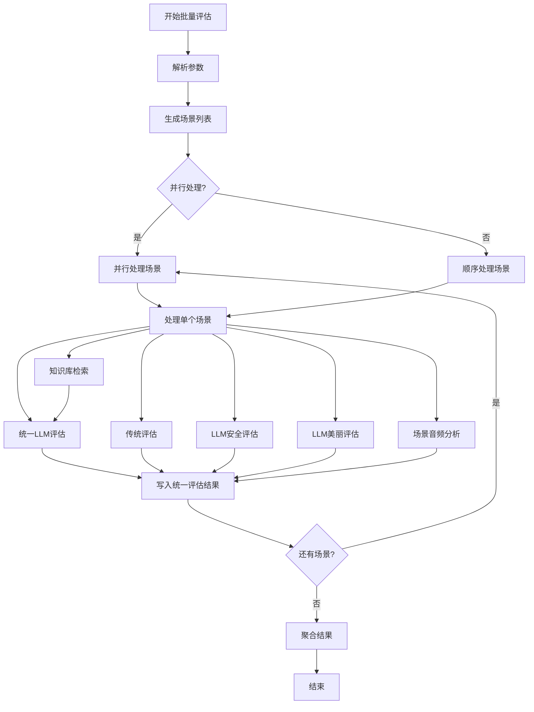

**图表来源**
- [scripts/m4_10_eval_engineering.py:150-271](file://scripts/m4_10_eval_engineering.py#L150-L271)

### 缓存策略

评估模块实现了多层次的缓存机制：
- **渲染缓存**：基于场景布局和渲染参数的哈希缓存
- **LLM缓存**：避免重复的大型语言模型调用
- **中间结果缓存**：保存计算过程中的中间结果
- **评估结果缓存**：统一LLM评估结果的本地缓存
- **知识库缓存**：GraphRAG运行时状态和检索结果缓存
- **音频分析缓存**：场景音频配置的文件缓存

**章节来源**
- [src/roadgen3d/llm/safety_eval.py:17-55](file://src/roadgen3d/llm/safety_eval.py#L17-L55)
- [src/roadgen3d/llm/beauty_eval.py:17-55](file://src/roadgen3d/llm/beauty_eval.py#L17-L55)
- [src/roadgen3d/scene_audio.py:13-31](file://src/roadgen3d/scene_audio.py#L13-L31)

## 故障排除指南

### 常见问题及解决方案

#### 1. LLM评估API调用失败

**问题症状**：
- 统一评估API返回错误
- LLM安全/美丽评估调用失败
- 前端evaluateScene()函数抛出异常
- 评估结果为空

**解决方法**：
- 检查GLM API连接状态
- 验证API密钥配置
- 查看日志获取详细错误信息
- 确认场景布局文件格式正确
- 检查LLM模型可用性

#### 2. 知识库检索失败

**问题症状**：
- GraphRAG运行时搜索失败
- PDF RAG检索返回空结果
- 知识库状态显示错误

**解决方法**：
- 检查GraphRAG工件完整性
- 验证PDF知识库构建状态
- 确认知识库文件路径正确
- 重新构建知识库工件

#### 3. 评估结果异常

**问题症状**：
- 评估分数超出0-100范围
- 统一评估与传统评估结果差异过大
- 评估时间过长
- LLM评估结果不一致

**解决方法**：
- 验证场景布局数据完整性
- 检查LLM模型响应格式
- 调整评估参数设置
- 实施评估结果验证机制
- 检查LLM评估一致性

#### 4. 前端集成问题

**问题症状**：
- evaluateScene()函数调用失败
- 评估结果显示异常
- UI界面更新延迟

**解决方法**：
- 检查API端点URL配置
- 验证前端类型定义
- 查看浏览器控制台错误
- 确认网络连接状态

#### 5. 音频分析问题

**问题症状**：
- 场景音频分析结果异常
- 音频配置文件损坏
- 点源识别错误

**解决方法**：
- 检查场景布局数据完整性
- 验证配置参数有效性
- 确认资产类别识别正确
- 清理音频分析缓存

**更新** 由于evaluateScene()函数现在返回`EvaluationResponse | null`而不是mock数据，前端需要正确处理null值状态，避免显示错误的评估结果。

**章节来源**
- [web/workbench/src/lib/api.ts:76-106](file://web/workbench/src/lib/api.ts#L76-L106)
- [web/workbench/src/app.ts:278-286](file://web/workbench/src/app.ts#L278-L286)

### 调试工具

评估模块提供了多种调试工具：
- **详细日志输出**：显示每步计算的中间结果
- **指标可视化**：生成指标分布图表
- **性能监控**：跟踪计算时间和内存使用
- **LLM调用监控**：跟踪API调用状态和响应时间
- **知识库状态监控**：跟踪检索状态和性能指标
- **音频分析监控**：跟踪音频建模过程和结果
- **缓存状态监控**：跟踪评估结果缓存状态

## 结论

RoadGen3D评估模块经过重大升级，现已发展为一个功能完整、技术先进的统一LLM评估系统。其主要特点包括：

### 核心优势

1. **AI驱动评估**：采用统一LLM评估系统，提供更准确、全面的评估结果
2. **多维度统一**：一次性输出步行性、安全性、美观性的三维评分
3. **确定性权重计算**：统一的评估权重（步行性45%、安全性35%、美观性20%），使用round()函数确保可重现性
4. **多知识源支持**：集成PDF RAG、GraphRAG、混合模式的知识检索
5. **前后端一体化**：完整的前端集成，提供直观的可视化界面
6. **向后兼容**：保留传统评估系统，支持混合使用
7. **增强的可靠性**：移除mock数据回退机制，直接处理null值状态
8. **性能优化**：多级缓存和并行处理机制
9. **专业评估模块**：新增独立的LLM安全和美丽评估模块
10. **环境建模**：新增场景音频分析功能
11. **深度诊断**：增强的评估质量诊断功能

### 应用价值

- **设计指导**：为街道设计提供客观的AI评估标准
- **质量控制**：确保设计方案符合预期的质量要求
- **用户体验**：通过统一的评估界面提升评估结果的可理解性
- **系统稳定性**：增强的错误处理机制提高了系统的可靠性
- **专业指导**：知识库集成提供专业的设计原则和最佳实践
- **环境考虑**：音频分析为环境声音设计提供科学依据
- **多维度评估**：独立的LLM评估模块提供更专业的评估视角

### 发展前景

评估模块将继续演进，重点发展方向包括：
- 集成更多评估维度和指标
- 改进LLM评估的准确性和效率
- 增强与其他设计工具的集成能力
- 扩展到更广泛的城市设计应用场景
- 开发更智能的自动改进建议系统
- 优化知识库检索性能和准确性
- 增强音频分析的精度和实用性
- 扩展LLM评估的应用领域

**最新进展** 评估模块已完成统一LLM评估系统的部署，移除了所有mock数据，实现了真正的AI驱动评估，采用确定性加权公式确保结果的一致性和可重现性，同时集成了GraphRAG知识库检索功能，为设计决策提供更丰富的专业指导。新增的LLM安全评估和美丽评估模块提供了更专业的评估能力，场景音频分析功能为环境声音设计提供了科学依据，这些改进为RoadGen3D生态系统提供了强有力的技术支撑。

通过持续的改进和优化，评估模块将成为RoadGen3D生态系统中不可或缺的重要组成部分，为城市街道设计提供更加智能化、自动化的评估服务。