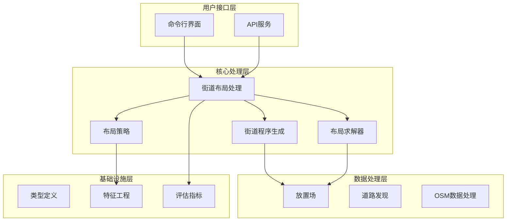
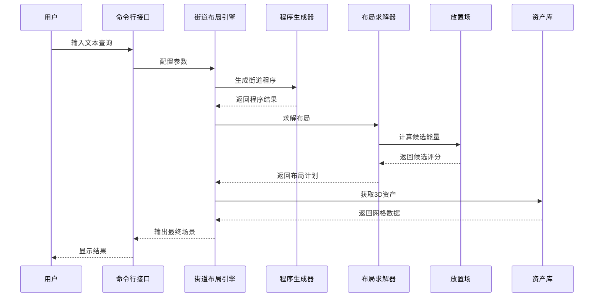
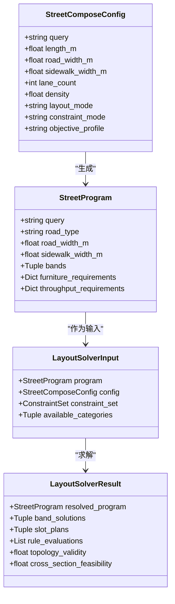
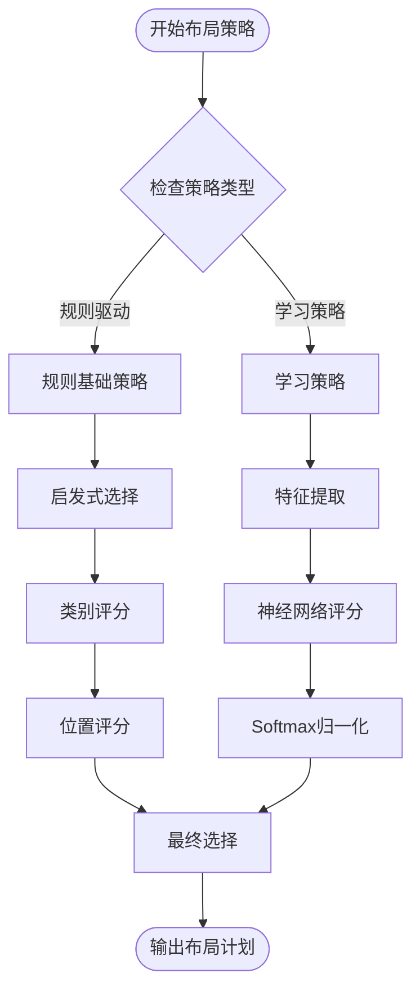
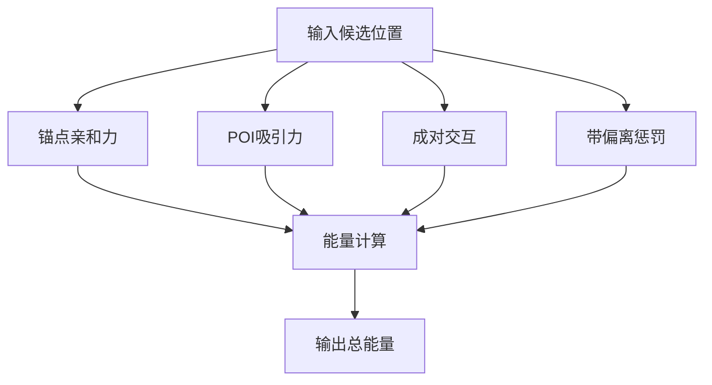
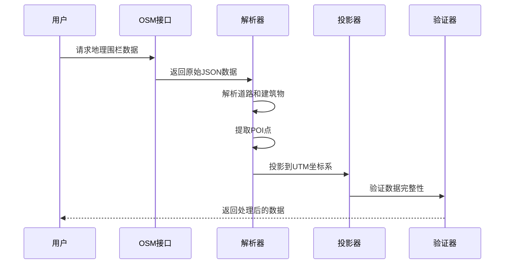
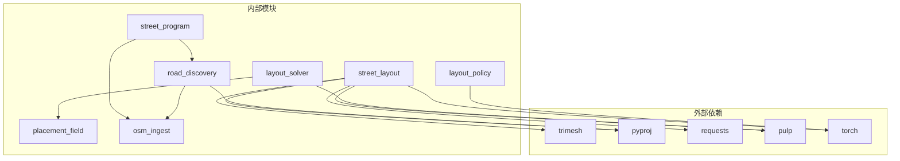

# 街道布局处理

<cite>
**本文档引用的文件**
- [street_layout.py](file://src/roadgen3d/street_layout.py)
- [layout_solver.py](file://src/roadgen3d/layout_solver.py)
- [layout_policy.py](file://src/roadgen3d/layout_policy.py)
- [street_program.py](file://src/roadgen3d/street_program.py)
- [street_band_semantics.py](file://src/roadgen3d/street_band_semantics.py)
- [layout_features.py](file://src/roadgen3d/layout_features.py)
- [placement_field.py](file://src/roadgen3d/placement_field.py)
- [milp_solver.py](file://src/roadgen3d/milp_solver.py)
- [road_discovery.py](file://src/roadgen3d/road_discovery.py)
- [osm_ingest.py](file://src/roadgen3d/osm_ingest.py)
- [types.py](file://src/roadgen3d/types.py)
- [m3_01_compose_street.py](file://scripts/m3_01_compose_street.py)
</cite>

## 目录
1. [简介](#简介)
2. [项目结构](#项目结构)
3. [核心组件](#核心组件)
4. [架构概览](#架构概览)
5. [详细组件分析](#详细组件分析)
6. [依赖关系分析](#依赖关系分析)
7. [性能考虑](#性能考虑)
8. [故障排除指南](#故障排除指南)
9. [结论](#结论)

## 简介

RoadGen3D 是一个先进的街道场景生成系统，专注于基于文本描述自动生成真实的街道布局。该系统集成了机器学习、几何建模和城市规划原则，能够从简单的文本查询生成复杂的三维街道场景。

系统的核心能力包括：
- 基于语义理解的街道程序生成
- 约束感知的布局求解器
- 多样化的资产选择策略
- 实时的美学评估和优化
- 支持多种布局模式（模板、OSM、图模板）

## 项目结构

RoadGen3D 采用模块化架构设计，主要分为以下几个层次：

**图表来源**
- [street_layout.py:1-800](file://src/roadgen3d/street_layout.py#L1-L800)
- [street_program.py:1-626](file://src/roadgen3d/street_program.py#L1-L626)
- [layout_solver.py:1-800](file://src/roadgen3d/layout_solver.py#L1-L800)

**章节来源**
- [street_layout.py:1-800](file://src/roadgen3d/street_layout.py#L1-L800)
- [types.py:1-800](file://src/roadgen3d/types.py#L1-L800)

## 核心组件

### 街道布局处理引擎

街道布局处理引擎是系统的核心，负责协调各个子模块完成完整的街道生成流程。它包含以下关键功能：

- **配置验证**：确保所有输入参数符合系统要求
- **网格缓存管理**：高效管理3D资产网格数据
- **资产过滤**：根据质量标准和场景适用性筛选资产
- **尺寸标准化**：统一不同来源资产的尺寸规格
- **碰撞检测**：防止资产之间的空间冲突

### 街道程序生成器

程序生成器基于文本查询和上下文信息创建结构化的街道程序：

- **交叉断面设计**：根据目标类型生成合适的街道横截面
- **需求估算**：计算不同类型街道家具的需求量
- **拓扑约束**：确保街道各部分的正确排列关系
- **流量要求**：满足行人、车辆和公共交通的通行需求

### 布局求解器

布局求解器使用混合整数线性规划解决复杂的约束优化问题：

- **候选生成**：为每个类别生成可放置位置的候选
- **约束处理**：处理各种设计规则和限制条件
- **优化求解**：找到最优的资产放置方案
- **冲突检测**：识别和解决潜在的布局冲突

**章节来源**
- [street_layout.py:493-612](file://src/roadgen3d/street_layout.py#L493-L612)
- [street_program.py:502-626](file://src/roadgen3d/street_program.py#L502-L626)
- [layout_solver.py:402-540](file://src/roadgen3d/layout_solver.py#L402-L540)

## 架构概览

系统采用分层架构，每层都有明确的职责分工：

**图表来源**
- [street_layout.py:1200-1800](file://src/roadgen3d/street_layout.py#L1200-L1800)
- [street_program.py:502-626](file://src/roadgen3d/street_program.py#L502-L626)
- [layout_solver.py:402-540](file://src/roadgen3d/layout_solver.py#L402-L540)

## 详细组件分析

### 街道布局处理类图

**图表来源**
- [types.py:47-120](file://src/roadgen3d/types.py#L47-L120)
- [types.py:140-185](file://src/roadgen3d/types.py#L140-L185)
- [types.py:367-386](file://src/roadgen3d/types.py#L367-L386)
- [types.py:389-434](file://src/roadgen3d/types.py#L389-L434)

### 布局策略决策流程

**图表来源**
- [layout_policy.py:63-125](file://src/roadgen3d/layout_policy.py#L63-L125)
- [layout_features.py:62-183](file://src/roadgen3d/layout_features.py#L62-L183)

### 放置场能量计算

**图表来源**
- [placement_field.py:234-272](file://src/roadgen3d/placement_field.py#L234-L272)

**章节来源**
- [layout_policy.py:1-309](file://src/roadgen3d/layout_policy.py#L1-L309)
- [layout_features.py:1-183](file://src/roadgen3d/layout_features.py#L1-L183)
- [placement_field.py:1-272](file://src/roadgen3d/placement_field.py#L1-L272)

### OSM数据处理流程

**图表来源**
- [osm_ingest.py:126-168](file://src/roadgen3d/osm_ingest.py#L126-L168)
- [osm_ingest.py:174-259](file://src/roadgen3d/osm_ingest.py#L174-L259)
- [osm_ingest.py:265-331](file://src/roadgen3d/osm_ingest.py#L265-L331)

**章节来源**
- [road_discovery.py:175-274](file://src/roadgen3d/road_discovery.py#L175-L274)
- [osm_ingest.py:1-331](file://src/roadgen3d/osm_ingest.py#L1-L331)

## 依赖关系分析

系统采用松耦合的设计，通过清晰的接口定义实现模块间的通信：

**图表来源**
- [street_layout.py:174-179](file://src/roadgen3d/street_layout.py#L174-L179)
- [layout_solver.py:36-40](file://src/roadgen3d/layout_solver.py#L36-L40)
- [layout_policy.py:16-22](file://src/roadgen3d/layout_policy.py#L16-L22)

**章节来源**
- [street_layout.py:1-800](file://src/roadgen3d/street_layout.py#L1-L800)
- [layout_solver.py:1-800](file://src/roadgen3d/layout_solver.py#L1-L800)

## 性能考虑

### 内存优化策略

系统实现了多项内存优化技术以处理大规模3D场景：

- **网格缓存机制**：避免重复加载相同的3D资产
- **异步资源管理**：按需加载和释放GPU/CPU资源
- **批处理优化**：批量处理相似的计算任务
- **内存池管理**：重用临时数据结构减少分配开销

### 并行处理

系统支持多线程和GPU加速：

- **特征并行**：同时计算多个候选的特征向量
- **布局并行**：并行处理不同的布局候选
- **渲染并行**：多视图同时渲染以提高效率

### 缓存策略

- **配置缓存**：缓存已解析的配置文件
- **结果缓存**：缓存中间计算结果避免重复计算
- **模型缓存**：保持预训练模型在内存中

## 故障排除指南

### 常见错误及解决方案

| 错误类型 | 可能原因 | 解决方案 |
|---------|---------|---------|
| 配置验证失败 | 参数值超出范围 | 检查输入参数是否符合约束条件 |
| 资产加载失败 | 文件路径不存在 | 验证资产清单文件的完整性和可访问性 |
| GPU内存不足 | 场景过于复杂 | 减少场景规模或降低资产质量设置 |
| OSM数据获取失败 | 网络连接问题 | 检查网络连接和代理设置 |
| 布局求解失败 | 约束条件过严 | 调整约束权重或放宽某些限制 |

### 调试工具

系统提供了丰富的调试功能：

- **详细日志记录**：记录每个处理步骤的详细信息
- **可视化工具**：显示中间结果和布局过程
- **性能监控**：跟踪内存使用和执行时间
- **错误报告**：提供详细的错误诊断信息

**章节来源**
- [street_layout.py:493-618](file://src/roadgen3d/street_layout.py#L493-L618)
- [m3_01_compose_street.py:135-140](file://scripts/m3_01_compose_street.py#L135-L140)

## 结论

RoadGen3D 展示了现代AI驱动的城市规划和3D内容生成技术的最新进展。通过精心设计的模块化架构和高效的算法实现，系统能够在合理的时间内生成高质量的街道场景。

系统的主要优势包括：

1. **灵活性**：支持多种布局模式和设计风格
2. **准确性**：严格遵循城市规划原则和设计规范
3. **效率**：优化的算法和并行处理能力
4. **可扩展性**：模块化设计便于功能扩展和维护

未来的发展方向可能包括增强实时交互能力、支持更复杂的场景类型，以及集成更多的城市规划数据源。