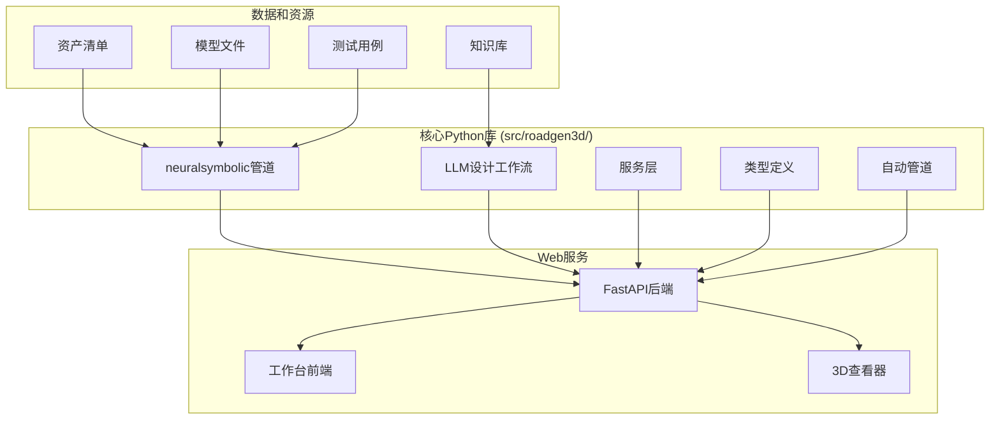
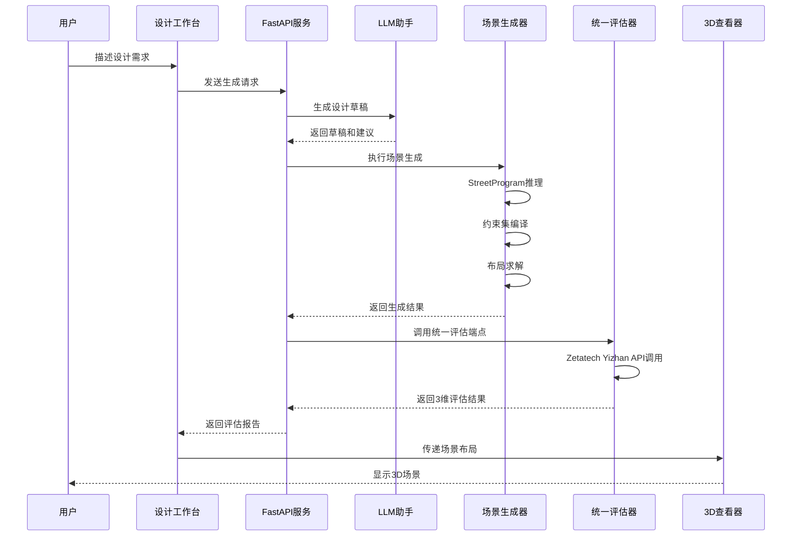
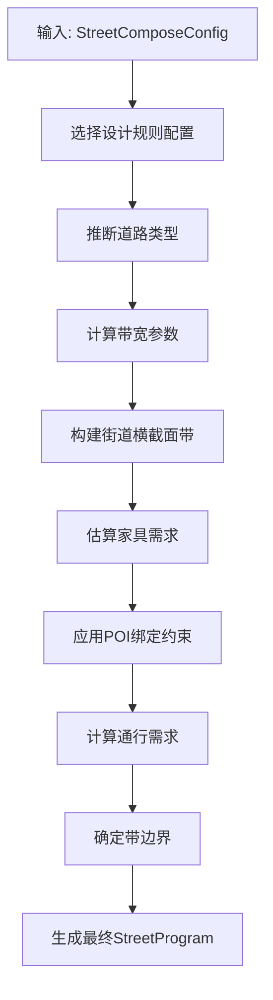
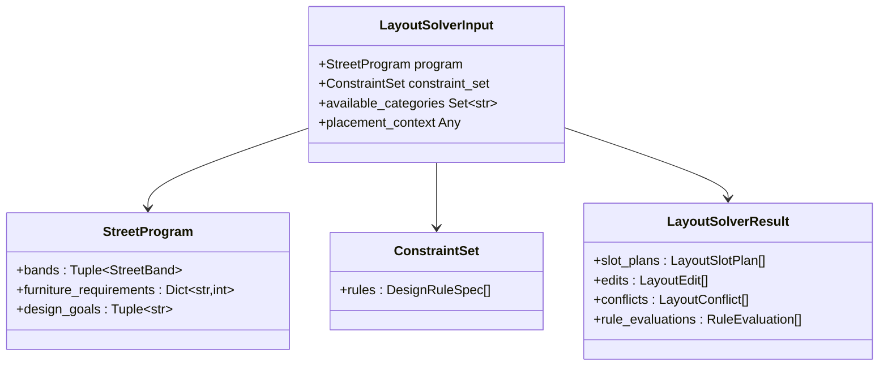
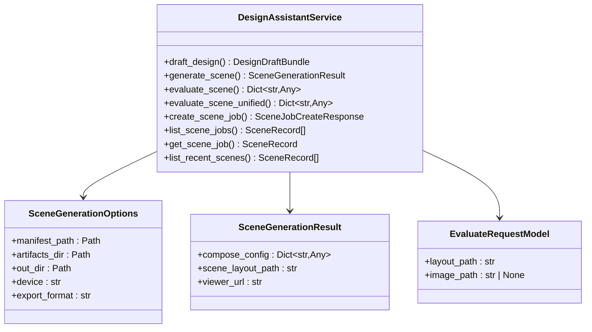
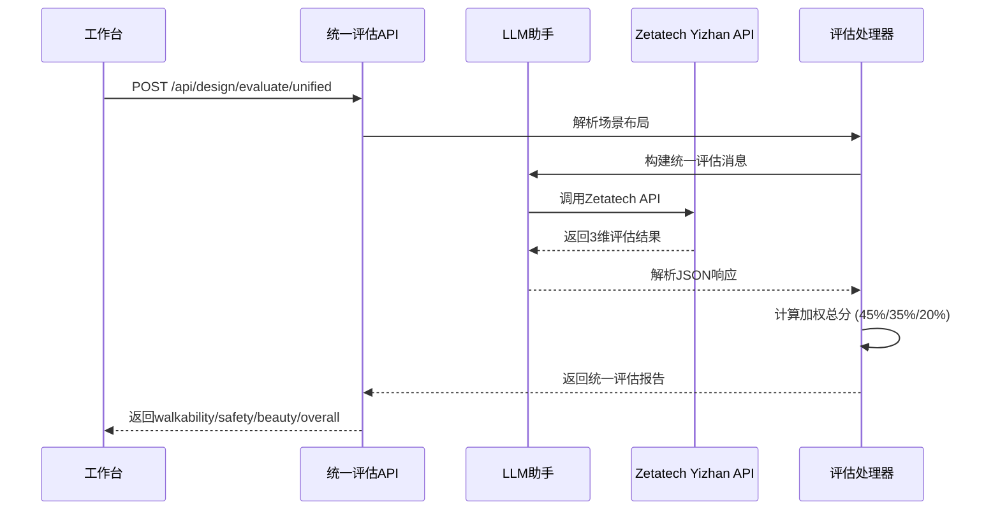
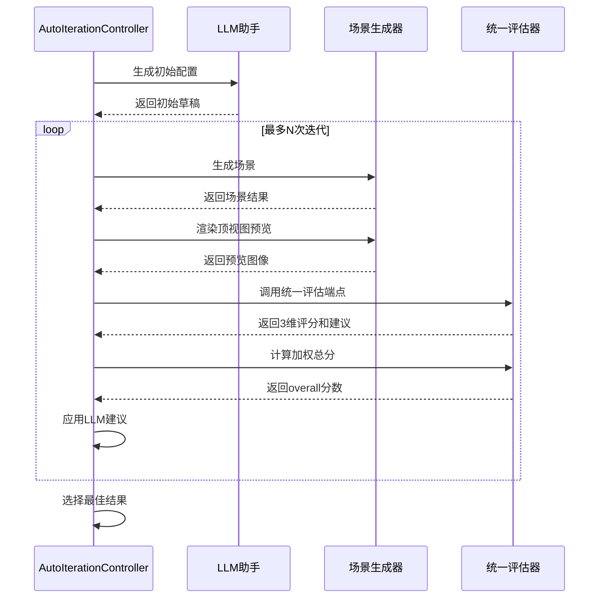
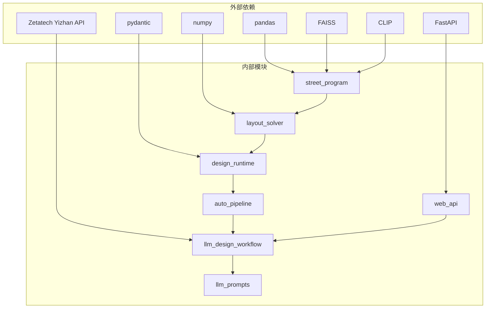

# RoadGen3D 项目文档

<cite>
**本文档引用的文件**
- [todo.md](file://todo.md)
- [readme.md](file://readme.md)
- [src/roadgen3d/__init__.py](file://src/roadgen3d/__init__.py)
- [ui/api/main.py](file://ui/api/main.py)
- [web/api/main.py](file://web/api/main.py)
- [src/roadgen3d/services/generation_api.py](file://src/roadgen3d/services/generation_api.py)
- [src/roadgen3d/services/design_runtime.py](file://src/roadgen3d/services/design_runtime.py)
- [src/roadgen3d/street_program.py](file://src/roadgen3d/street_program.py)
- [src/roadgen3d/layout_solver.py](file://src/roadgen3d/layout_solver.py)
- [src/roadgen3d/pipeline.py](file://src/roadgen3d/pipeline.py)
- [src/roadgen3d/types.py](file://src/roadgen3d/types.py)
- [src/roadgen3d/auto_pipeline/iteration_controller.py](file://src/roadgen3d/auto_pipeline/iteration_controller.py)
- [src/roadgen3d/services/design_types.py](file://src/roadgen3d/services/design_types.py)
- [web/viewer/index.html](file://web/viewer/index.html)
- [web/workbench/index.html](file://web/workbench/index.html)
- [src/roadgen3d/llm/design_workflow.py](file://src/roadgen3d/llm/design_workflow.py)
- [src/roadgen3d/llm/prompts.py](file://src/roadgen3d/llm/prompts.py)
- [tests/test_auto_eval.py](file://tests/test_auto_eval.py)
- [scripts/test_llm_api.sh](file://scripts/test_llm_api.sh)
</cite>

## 更新摘要
**已进行的更改**
- 更新了 LLM 评估系统部分，反映 Zetatech Yizhan API 集成的完成状态
- 添加了统一评估端点 `/api/design/evaluate/unified` 的详细实现说明
- 记录了 45%/35%/20% 权重分配的具体实现细节
- 移除了所有模拟评估相关的记录和说明
- 更新了评估系统架构图以反映新的统一评估流程

## 目录
1. [项目概述](#项目概述)
2. [项目结构](#项目结构)
3. [核心组件](#核心组件)
4. [架构概览](#架构概览)
5. [详细组件分析](#详细组件分析)
6. [依赖关系分析](#依赖关系分析)
7. [性能考虑](#性能考虑)
8. [故障排除指南](#故障排除指南)
9. [结论](#结论)

## 项目概述

RoadGen3D 是一个基于神经符号学的文本到3D城市街道场景生成系统。该系统能够将用户描述的设计目标（如"步行安全、全龄友好的完整街道"）转换为详细的3D城市街道场景。系统采用LLM驱动的设计助手，通过RAG知识检索生成参数化的街道布局，并导出可在内置Viewer中查看的3D场景。

### 主要特性

- **文本到3D生成**：支持从自然语言描述生成完整的3D街道场景
- **LLM设计助手**：集成GPT等大语言模型进行设计指导和优化
- **RAG知识检索**：基于完整街道设计指南的知识库检索
- **多模式生成**：支持模板模式、OSM模式和MetaUrban模式
- **统一评估系统**：基于 Zetatech Yizhan API 的3维评估（步行性45%、安全性35%、美观性20%）
- **可视化预览**：支持2D顶视图预览和3D场景查看

## 项目结构

**图表来源**
- [readme.md:86-125](file://readme.md#L86-L125)
- [src/roadgen3d/__init__.py:1-295](file://src/roadgen3d/__init__.py#L1-L295)

**章节来源**
- [readme.md:86-125](file://readme.md#L86-L125)
- [readme.md:127-171](file://readme.md#L127-L171)

## 核心组件

### 1. 神经符号学生成管道

系统的核心是基于中间表示的神经符号学方法，包括三个主要阶段：

1. **StreetProgram** - 结构化的街道意图表示
2. **ConstraintSet** - 硬性和软性设计规则集合  
3. **LayoutSolver** - 带碰撞检测的布局优化

### 2. LLM设计助手

集成的大语言模型服务提供：
- 设计草稿生成
- 知识检索和增强
- 统一场景评估（步行性、安全性、美观性）
- 参数化配置优化

### 3. 场景生成服务

提供多种生成模式：
- **模板模式**：基于预设模板的简单生成
- **OSM模式**：基于真实地理数据的生成
- **MetaUrban模式**：基于参考计划的生成

**章节来源**
- [readme.md:173-186](file://readme.md#L173-L186)
- [src/roadgen3d/street_program.py:502-626](file://src/roadgen3d/street_program.py#L502-L626)
- [src/roadgen3d/layout_solver.py:1-800](file://src/roadgen3d/layout_solver.py#L1-L800)

## 架构概览

**图表来源**
- [readme.md:127-171](file://readme.md#L127-L171)
- [src/roadgen3d/services/design_runtime.py:336-396](file://src/roadgen3d/services/design_runtime.py#L336-L396)

## 详细组件分析

### 神经符号学管道

#### StreetProgram推理模块

StreetProgram模块负责从文本描述和组合上下文中推断结构化的街道程序：

**图表来源**
- [src/roadgen3d/street_program.py:502-626](file://src/roadgen3d/street_program.py#L502-L626)

#### LayoutSolver布局求解器

布局求解器实现约束感知的布局优化：

**图表来源**
- [src/roadgen3d/layout_solver.py:1-800](file://src/roadgen3d/layout_solver.py#L1-L800)
- [src/roadgen3d/types.py:187-200](file://src/roadgen3d/types.py#L187-L200)

**章节来源**
- [src/roadgen3d/street_program.py:25-81](file://src/roadgen3d/street_program.py#L25-L81)
- [src/roadgen3d/layout_solver.py:402-540](file://src/roadgen3d/layout_solver.py#L402-L540)

### LLM设计助手服务

设计助手服务提供完整的LLM集成功能：

**图表来源**
- [src/roadgen3d/services/design_runtime.py:336-396](file://src/roadgen3d/services/design_runtime.py#L336-L396)
- [src/roadgen3d/services/design_types.py:280-318](file://src/roadgen3d/services/design_types.py#L280-L318)

**章节来源**
- [src/roadgen3d/services/design_runtime.py:190-220](file://src/roadgen3d/services/design_runtime.py#L190-L220)
- [src/roadgen3d/services/design_types.py:321-334](file://src/roadgen3d/services/design_types.py#L321-L334)

### 统一评估系统

**更新** 完成了 Zetatech Yizhan API 的集成，实现了统一的3维评估系统

统一评估系统通过 `/api/design/evaluate/unified` 端点提供统一的评估服务，支持步行性、安全性、美观性三个维度的评分：

**图表来源**
- [src/roadgen3d/llm/design_workflow.py:352-414](file://src/roadgen3d/llm/design_workflow.py#L352-L414)
- [web/api/main.py:267-278](file://web/api/main.py#L267-L278)

统一评估系统的关键特性：

1. **统一端点设计**：所有评估请求通过 `/api/design/evaluate/unified` 端点处理
2. **3维评分体系**：
   - 步行性 (walkability)：45% 权重，评估人行道宽度、净空连续性、家具密度、照明均匀度、绿化遮荫
   - 安全性 (safety)：35% 权重，评估交通隔离、过街设施、缓冲带、安全感知
   - 美观性 (beauty)：20% 权重，评估植物配置协调性、街道家具风格统一、空间丰富度
3. **加权总分计算**：overall = walkability × 0.45 + safety × 0.35 + beauty × 0.20
4. **Zetatech Yizhan API 集成**：通过 Zetatech 的 Yizhan API 提供专业的评估服务

**章节来源**
- [src/roadgen3d/llm/design_workflow.py:352-414](file://src/roadgen3d/llm/design_workflow.py#L352-L414)
- [src/roadgen3d/llm/prompts.py:214-267](file://src/roadgen3d/llm/prompts.py#L214-L267)
- [web/api/main.py:267-278](file://web/api/main.py#L267-L278)

### 自动迭代控制器

自动管道实现生成→渲染→评估→改进的闭环：

**图表来源**
- [src/roadgen3d/auto_pipeline/iteration_controller.py:102-273](file://src/roadgen3d/auto_pipeline/iteration_controller.py#L102-L273)

**章节来源**
- [src/roadgen3d/auto_pipeline/iteration_controller.py:61-320](file://src/roadgen3d/auto_pipeline/iteration_controller.py#L61-L320)

### Web API服务

系统提供RESTful API接口：

| 方法 | 端点 | 描述 |
|------|------|------|
| GET | `/api/health` | 健康检查 |
| GET | `/api/geo/china-cities` | 列出中国城市 |
| GET | `/api/reference-plans` | 列出参考计划 |
| GET | `/api/graph-templates` | 列出图模板 |
| POST | `/api/design/draft` | 生成设计草稿 |
| POST | `/api/design/generate` | 直接生成场景 |
| POST | `/api/scene/jobs` | 提交生成任务 |
| GET | `/api/scene/jobs` | 列出所有任务 |
| GET | `/api/scene/jobs/{job_id}` | 获取任务状态/结果 |
| POST | `/api/design/evaluate/unified` | 统一场景评估（新增） |

**章节来源**
- [web/api/main.py:92-267](file://web/api/main.py#L92-L267)
- [src/roadgen3d/services/generation_api.py:131-294](file://src/roadgen3d/services/generation_api.py#L131-L294)

## 依赖关系分析

**图表来源**
- [src/roadgen3d/__init__.py:1-295](file://src/roadgen3d/__init__.py#L1-L295)

**章节来源**
- [src/roadgen3d/__init__.py:1-295](file://src/roadgen3d/__init__.py#L1-L295)

## 性能考虑

### 1. 内存管理
- 使用生成器模式处理大型场景数据
- 实现增量式评估和缓存机制
- 优化资产清单加载和索引

### 2. 计算效率
- 布局求解器采用启发式算法
- 支持可选的MILP求解器
- 实现并行处理能力

### 3. 存储优化
- 分层存储策略（临时文件、持久化输出）
- 压缩和去重机制
- 智能清理过期数据

### 4. 评估性能
- **统一评估端点**：减少API调用次数，提高评估效率
- **批量评估**：支持多方案同时评估
- **缓存机制**：对相似场景的评估结果进行缓存

## 故障排除指南

### 常见问题

1. **LLM API连接失败**
   - 检查环境变量配置
   - 验证网络连接
   - 确认API密钥有效性

2. **Zetatech Yizhan API 集成问题**
   - **API密钥无效**：检查 `.env` 文件中的 `GRAPHRAG_API_KEY`
   - **API基础URL错误**：确认 `GRAPHRAG_API_BASE` 设置为 `https://api.zetatechs.com/v1/`
   - **网络连接问题**：使用 `./scripts/test_llm_api.sh` 测试API连通性
   - **模型不可用**：使用 `./scripts/test_llm_api.sh --list` 查看可用模型

3. **场景生成失败**
   - 检查资产清单完整性
   - 验证GPU/CPU可用性
   - 确认磁盘空间充足

4. **3D查看器无法加载**
   - 检查浏览器兼容性
   - 验证场景文件完整性
   - 确认端口未被占用

### 调试工具

- **日志系统**：详细的执行日志和错误追踪
- **健康检查**：API服务状态监控
- **性能分析**：关键路径性能指标
- **API测试脚本**：使用 `./scripts/test_llm_api.sh` 进行API连通性测试

**章节来源**
- [readme.md:431-450](file://readme.md#L431-L450)
- [scripts/test_llm_api.sh:1-67](file://scripts/test_llm_api.sh#L1-L67)

## 结论

RoadGen3D是一个功能完整的文本到3D城市街道场景生成系统，具有以下特点：

### 技术优势
- **神经符号学方法**：清晰的中间表示和约束系统
- **LLM深度集成**：智能设计指导和优化
- **统一评估体系**：基于 Zetatech Yizhan API 的专业3维评估（步行性45%、安全性35%、美观性20%）
- **多模式生成**：适应不同应用场景
- **专业API集成**：与 Zetatech Yizhan API 的无缝集成

### 应用价值
- **设计效率提升**：自动化生成多个设计方案
- **质量保证**：基于设计规则的约束验证
- **专业评估**：获得权威的3维评估报告
- **可视化体验**：实时3D预览和评估
- **知识传承**：基于完整街道设计指南

### 发展方向
- 强化OSM+POI集成作为默认生成路径
- 扩展POI分类体系和街道家具系统
- 深化学习模型的集成和优化
- 支持更复杂的道路网络设计
- **统一评估系统优化**：进一步提升评估准确性和响应速度

该系统为城市规划和街道设计提供了强大的技术支持，能够显著提高设计效率和质量。通过集成 Zetatech Yizhan API，系统现在能够提供专业级的3维评估服务，为用户提供更加准确和权威的设计反馈。