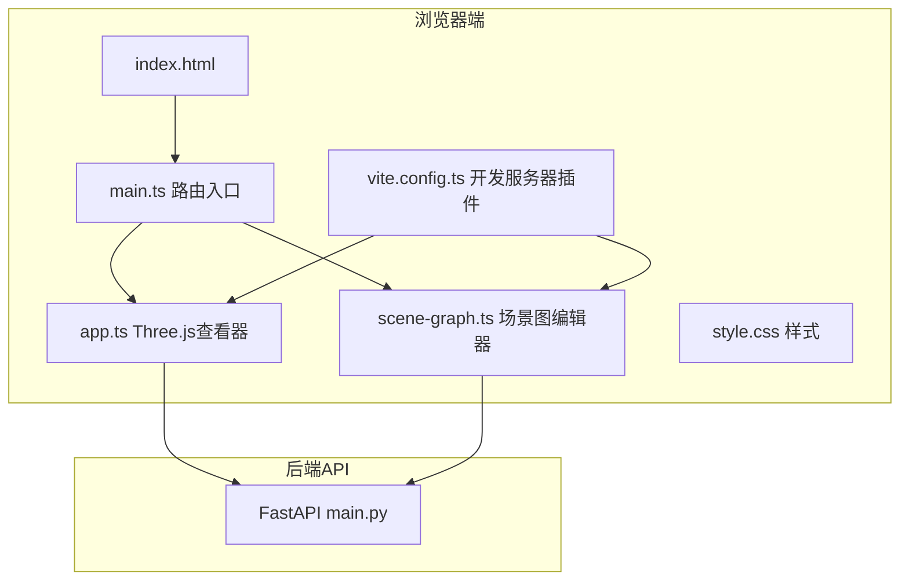
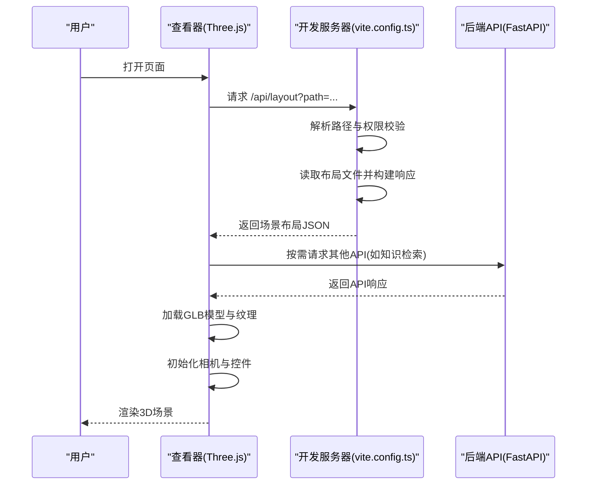
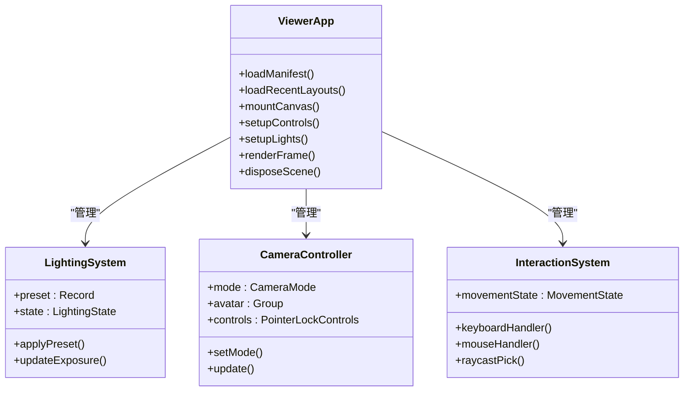
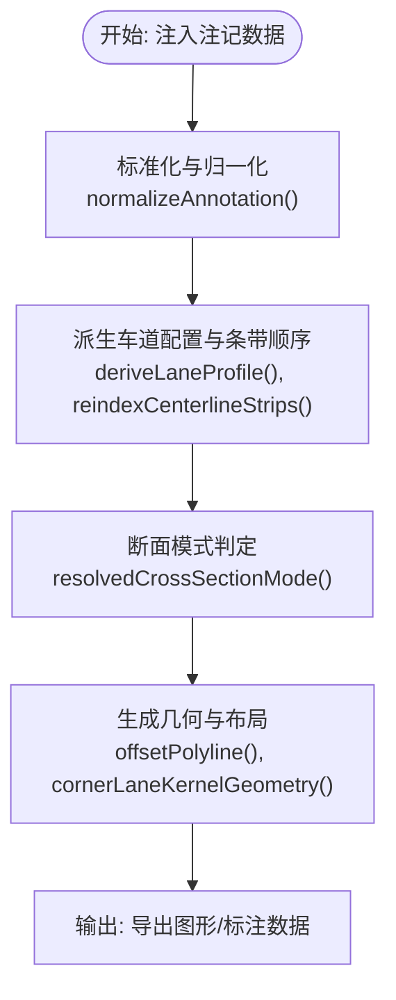
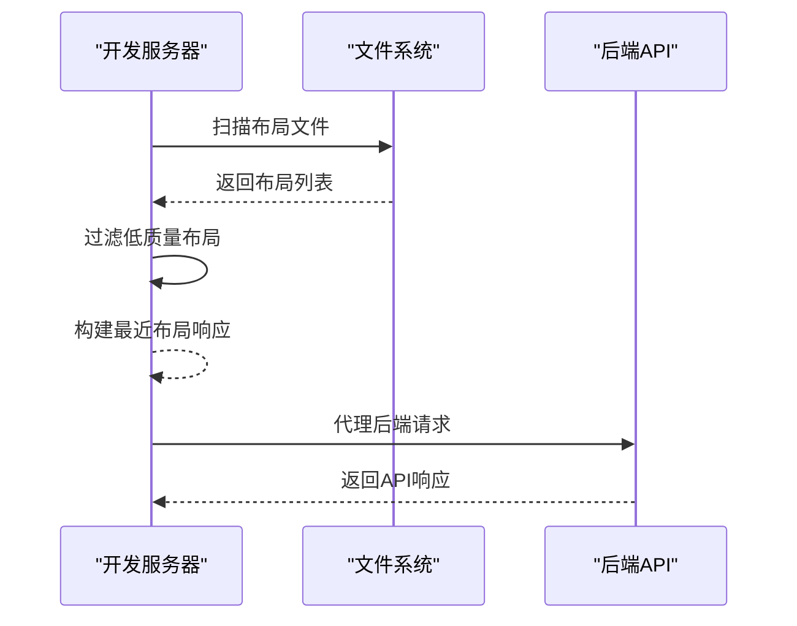
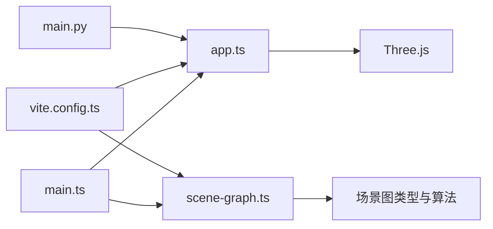

# 3D查看器

<cite>
**本文档引用的文件**
- [app.ts](file://web/viewer/src/app.ts)
- [main.ts](file://web/viewer/src/main.ts)
- [scene-graph.ts](file://web/viewer/src/scene-graph.ts)
- [sg-types.ts](file://web/viewer/src/sg-types.ts)
- [sg-constants.ts](file://web/viewer/src/sg-constants.ts)
- [sg-geometry.ts](file://web/viewer/src/sg-geometry.ts)
- [sg-utils.ts](file://web/viewer/src/sg-utils.ts)
- [style.css](file://web/viewer/src/style.css)
- [package.json](file://web/viewer/package.json)
- [index.html](file://web/viewer/index.html)
- [vite.config.ts](file://web/viewer/vite.config.ts)
- [main.py](file://web/api/main.py)
</cite>

## 目录
1. [简介](#简介)
2. [项目结构](#项目结构)
3. [核心组件](#核心组件)
4. [架构总览](#架构总览)
5. [详细组件分析](#详细组件分析)
6. [依赖关系分析](#依赖关系分析)
7. [性能考虑](#性能考虑)
8. [故障排除指南](#故障排除指南)
9. [结论](#结论)

## 简介
本文件面向RoadGen3D 3D查看器的技术文档，系统阐述其基于Three.js的架构设计、场景图管理与渲染管线、场景加载与显示机制（几何体渲染、材质应用、光照系统）、用户交互（鼠标、键盘、触摸）、视口控制与相机操作、以及性能优化策略与扩展方法。文档同时涵盖场景图结构、节点管理与层次关系，帮助开发者与使用者高效理解并使用该查看器。

## 项目结构
查看器前端采用Vite + TypeScript + Three.js技术栈，通过本地开发服务器聚合后端API与场景资源，支持多路由页面（主3D查看器、场景图编辑器、资产编辑器）。

**图表来源**
- [index.html:1-13](file://web/viewer/index.html#L1-L13)
- [main.ts:1-61](file://web/viewer/src/main.ts#L1-L61)
- [app.ts:1-800](file://web/viewer/src/app.ts#L1-L800)
- [scene-graph.ts:1-800](file://web/viewer/src/scene-graph.ts#L1-L800)
- [vite.config.ts:1-987](file://web/viewer/vite.config.ts#L1-L987)
- [main.py:1-286](file://web/api/main.py#L1-L286)

**章节来源**
- [index.html:1-13](file://web/viewer/index.html#L1-L13)
- [main.ts:1-61](file://web/viewer/src/main.ts#L1-L61)
- [package.json:1-20](file://web/viewer/package.json#L1-L20)

## 核心组件
- Three.js查看器核心：负责场景加载、几何体渲染、材质与光照、相机控制、用户交互与帧循环。
- 场景图编辑器：提供街道断面与设施布置的可视化编辑能力，支持标注、车道配置、设施放置等。
- 开发服务器插件：提供本地文件服务、场景布局发现、资产清单索引与过滤、跨域访问等。
- 后端API：提供健康检查、知识检索、场景作业管理、参考计划与模板等接口。

**章节来源**
- [app.ts:1-800](file://web/viewer/src/app.ts#L1-L800)
- [scene-graph.ts:1-800](file://web/viewer/src/scene-graph.ts#L1-L800)
- [vite.config.ts:1-987](file://web/viewer/vite.config.ts#L1-L987)
- [main.py:1-286](file://web/api/main.py#L1-L286)

## 架构总览
查看器采用前后端分离架构：前端通过HTTP请求从后端API获取场景布局与资源，本地开发服务器同时提供静态资源与文件代理服务；Three.js负责渲染管线与交互事件处理。

**图表来源**
- [app.ts:521-541](file://web/viewer/src/app.ts#L521-L541)
- [vite.config.ts:564-630](file://web/viewer/vite.config.ts#L564-L630)
- [main.py:217-221](file://web/api/main.py#L217-L221)

## 详细组件分析

### Three.js查看器核心（app.ts）
- 场景加载与布局解析：通过查询参数获取布局路径，调用后端API获取布局信息，解析场景边界、实例信息与资产描述。
- 几何体与材质：支持从GLB加载网格，遍历节点释放几何体与材质以避免内存泄漏；提供文本精灵与标签绘制工具。
- 光照系统：内置多种光照预设（中性工作室、明亮白天、阴天、黄金时刻、夜间演示），支持曝光、关键光强度、填充光强度、暖色与阴影强度调节。
- 相机与控件：支持第一人称、第三人称、固定视角与图层覆盖模式；使用PointerLockControls实现自由视角移动。
- 用户交互：键盘状态管理（前进/后退/左/右/冲刺），鼠标点击拾取实例或静态对象，显示信息卡片与指标面板。
- 视口控制：最小地图（小地图）与场景边界计算，支持缩放与平移；支持从布局元数据推断默认出生点与朝向。

**图表来源**
- [app.ts:1-800](file://web/viewer/src/app.ts#L1-L800)

**章节来源**
- [app.ts:1-800](file://web/viewer/src/app.ts#L1-L800)

### 场景图编辑器（scene-graph.ts + sg-types.ts + sg-geometry.ts + sg-utils.ts）
- 数据模型：定义注记点、断面模式、条带区（左/中心/右）、条带方向（前/后/双向/静态）、设施类型等核心类型。
- 几何与布局：提供断面条带偏移计算、侧向布局、交叉口过渡几何（圆弧/折线）、控制点与引导线生成等算法。
- 工具函数：标准化与归一化输入数据、派生车道配置、重新索引条带顺序、计算中心线宽度与横截面宽度等。
- 常量配置：默认像素每米、默认车道宽度、默认人行道宽度、条带宽度映射、MetaUrban资产徽章与指导语等。

**图表来源**
- [sg-types.ts:1-435](file://web/viewer/src/sg-types.ts#L1-L435)
- [sg-utils.ts:1-800](file://web/viewer/src/sg-utils.ts#L1-L800)
- [sg-geometry.ts:1-800](file://web/viewer/src/sg-geometry.ts#L1-L800)

**章节来源**
- [sg-types.ts:1-435](file://web/viewer/src/sg-types.ts#L1-L435)
- [sg-constants.ts:1-187](file://web/viewer/src/sg-constants.ts#L1-L187)
- [sg-utils.ts:1-800](file://web/viewer/src/sg-utils.ts#L1-L800)
- [sg-geometry.ts:1-800](file://web/viewer/src/sg-geometry.ts#L1-L800)

### 开发服务器与API集成（vite.config.ts + main.py）
- 场景布局发现：扫描允许根目录，递归查找scene_layout.json，过滤低质量布局，返回最近布局列表。
- 文件服务：安全解析文件路径，限制在允许根目录内，支持二进制GLB与JSON内容类型。
- 资产清单索引：加载real资产清单，过滤低质量条目，构建资产描述索引，用于实例信息展示。
- 后端API：提供健康检查、参考计划、图模板、知识检索、场景作业管理等REST接口，统一CORS策略。

**图表来源**
- [vite.config.ts:81-164](file://web/viewer/vite.config.ts#L81-L164)
- [vite.config.ts:564-630](file://web/viewer/vite.config.ts#L564-L630)
- [main.py:101-124](file://web/api/main.py#L101-L124)

**章节来源**
- [vite.config.ts:1-987](file://web/viewer/vite.config.ts#L1-L987)
- [main.py:1-286](file://web/api/main.py#L1-L286)

## 依赖关系分析
- 前端依赖：Three.js（渲染与3D数学）、PointerLockControls（相机控制）、GLTFLoader（模型加载）。
- 构建与运行：Vite（开发服务器与打包）、TypeScript（类型检查）、CSS模块化样式。
- 路由与页面：main.ts根据URL哈希切换查看器、场景图编辑器与资产编辑器页面。

**图表来源**
- [main.ts:1-61](file://web/viewer/src/main.ts#L1-L61)
- [app.ts:1-800](file://web/viewer/src/app.ts#L1-L800)
- [scene-graph.ts:1-800](file://web/viewer/src/scene-graph.ts#L1-L800)
- [package.json:1-20](file://web/viewer/package.json#L1-L20)
- [vite.config.ts:1-987](file://web/viewer/vite.config.ts#L1-L987)
- [main.py:1-286](file://web/api/main.py#L1-L286)

**章节来源**
- [package.json:1-20](file://web/viewer/package.json#L1-L20)
- [main.ts:1-61](file://web/viewer/src/main.ts#L1-L61)

## 性能考虑
- 内存管理
  - 在场景切换或卸载时，遍历Three.js场景树，显式释放几何体与材质纹理，防止内存泄漏。
  - 参考路径：[app.ts:467-487](file://web/viewer/src/app.ts#L467-L487)
- 渲染优化
  - 使用PointerLockControls减少不必要的DOM事件，降低输入处理开销。
  - 合理设置光照与阴影参数，避免过度消耗GPU资源。
  - 小地图与指标面板采用CSS动画与模糊效果，注意层级与合成器开销。
  - 参考路径：[style.css:1-800](file://web/viewer/src/style.css#L1-L800)
- 资源加载
  - 仅在需要时加载GLB与纹理，避免一次性加载过多资源。
  - 利用后端API缓存与跨域策略，减少重复请求。
  - 参考路径：[vite.config.ts:564-630](file://web/viewer/vite.config.ts#L564-L630)
- 数据处理
  - 对注记与断面数据进行批量归一化与派生计算，减少渲染时的重复计算。
  - 参考路径：[sg-utils.ts:1-800](file://web/viewer/src/sg-utils.ts#L1-L800)

## 故障排除指南
- 页面空白或无法加载
  - 检查开发服务器是否启动，确认端口与CORS配置。
  - 参考路径：[index.html:1-13](file://web/viewer/index.html#L1-L13)，[vite.config.ts:7-9](file://web/viewer/vite.config.ts#L7-L9)
- 布局文件路径错误
  - 确认布局文件路径在允许根目录内，且存在有效的scene_layout.json与最终GLB。
  - 参考路径：[vite.config.ts:564-630](file://web/viewer/vite.config.ts#L564-L630)
- 资产描述缺失
  - 检查real资产清单是否存在，确保非低质量条目被正确索引。
  - 参考路径：[vite.config.ts:211-257](file://web/viewer/vite.config.ts#L211-L257)
- 光照异常
  - 切换光照预设或手动调整曝光、强度与暖色参数。
  - 参考路径：[app.ts:159-213](file://web/viewer/src/app.ts#L159-L213)
- 相机控制问题
  - 确保PointerLockControls初始化成功，检查键盘与鼠标事件绑定。
  - 参考路径：[app.ts:1-800](file://web/viewer/src/app.ts#L1-L800)

**章节来源**
- [index.html:1-13](file://web/viewer/index.html#L1-L13)
- [vite.config.ts:1-987](file://web/viewer/vite.config.ts#L1-L987)
- [app.ts:1-800](file://web/viewer/src/app.ts#L1-L800)

## 结论
RoadGen3D 3D查看器通过Three.js实现了高效的场景渲染与交互体验，结合本地开发服务器与后端API，提供了从场景布局到资产描述的完整管线。场景图编辑器则为街道断面与设施布置提供了强大的可视化工具。遵循本文档的架构与优化建议，可进一步提升性能与扩展性，满足复杂城市设计与生成场景的可视化需求。