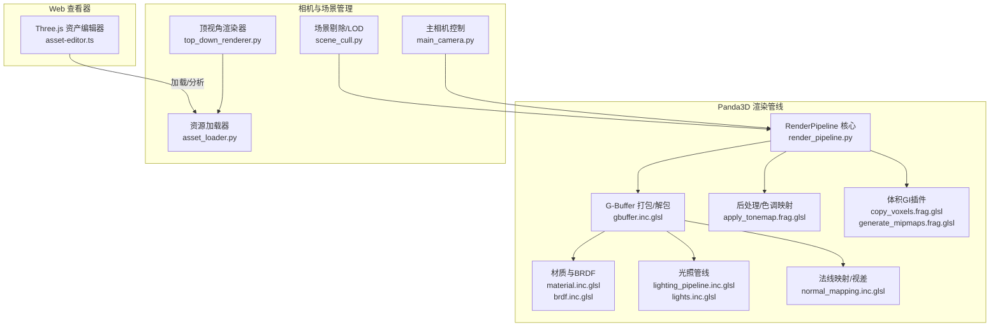
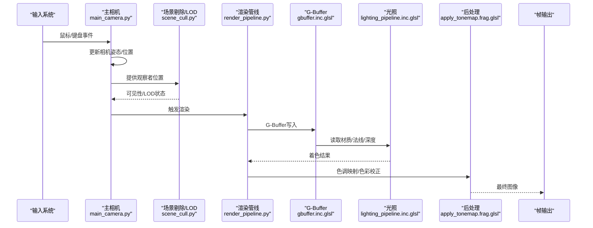
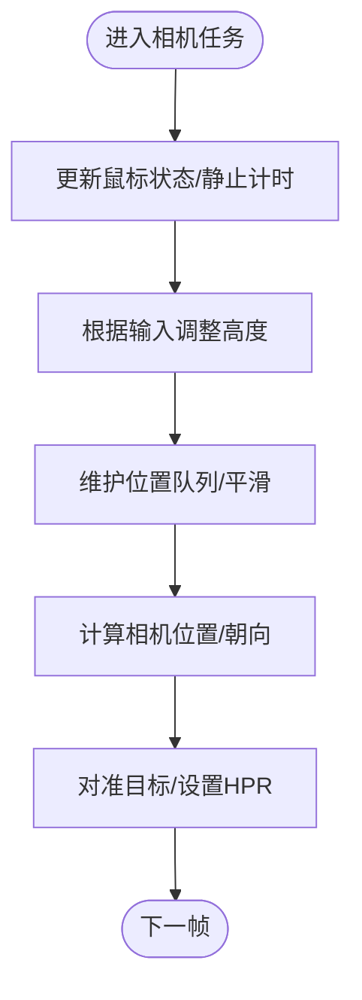
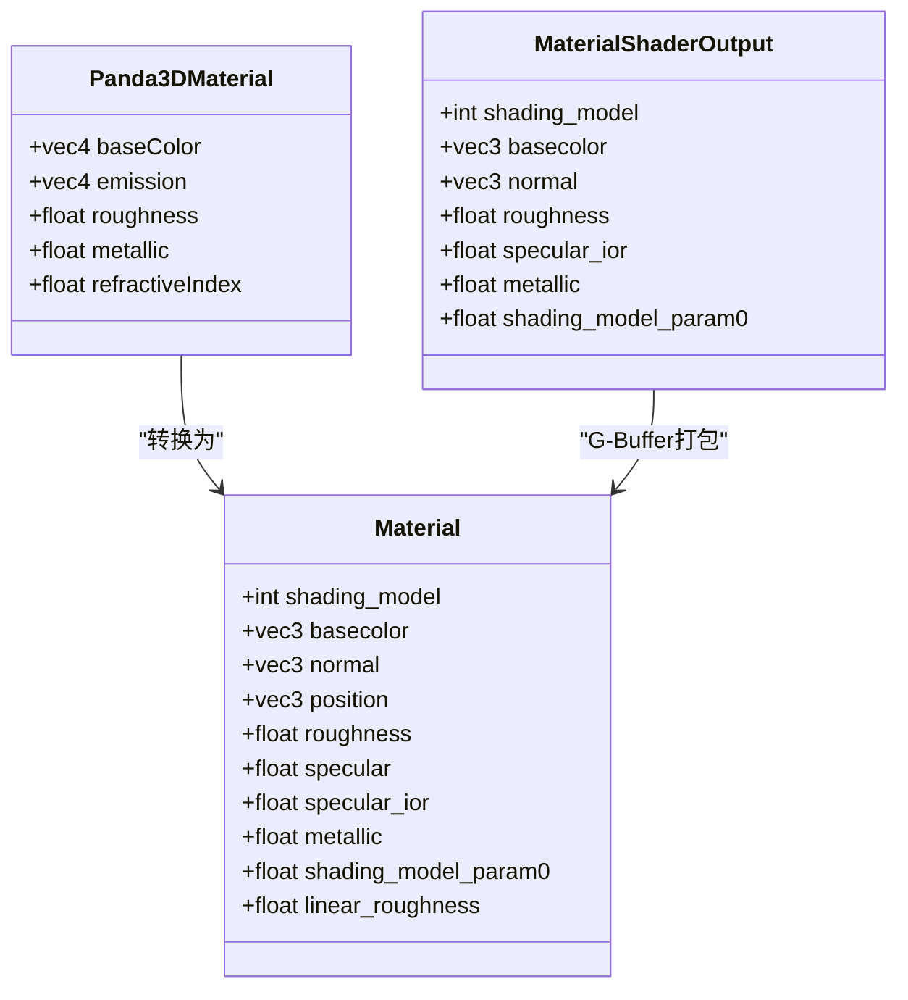
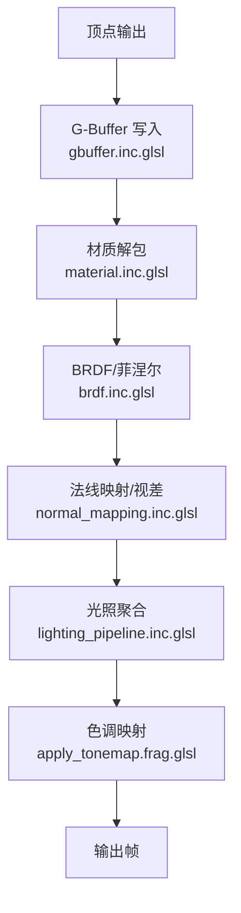
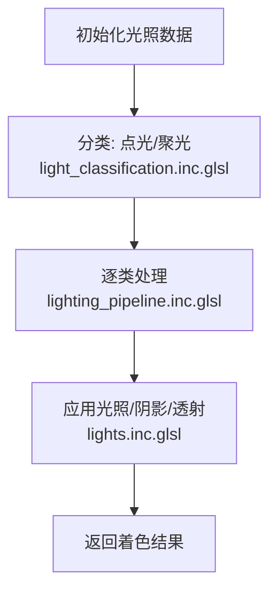
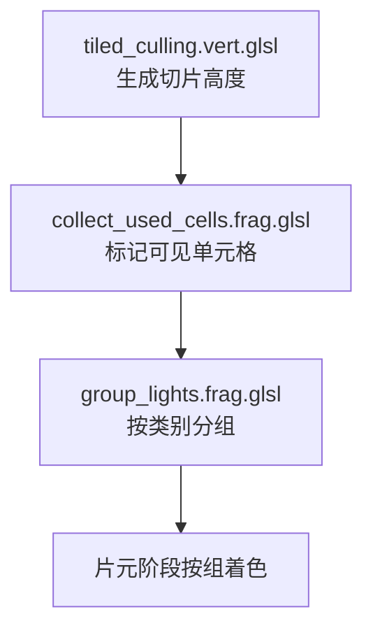
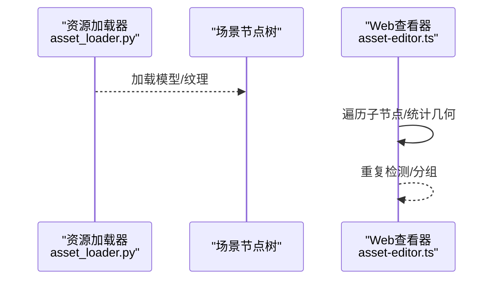
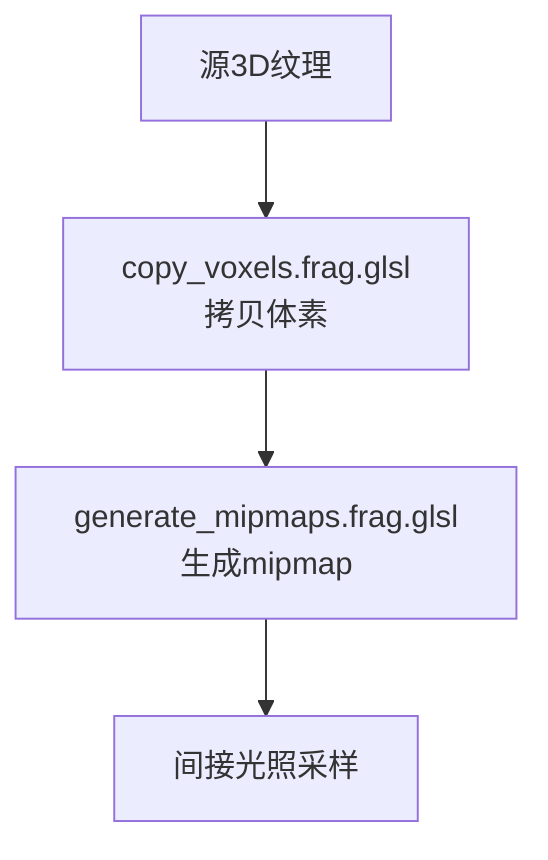
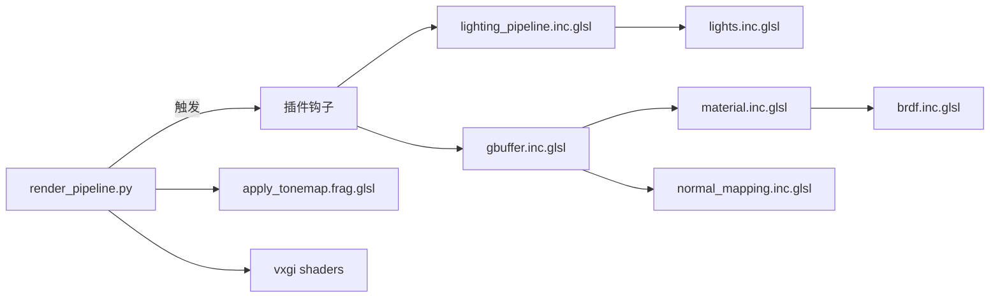

# 场景渲染

<cite>
**本文引用的文件**   
- [main_camera.py](file://metaurban/metaurban/engine/core/main_camera.py)
- [scene_cull.py](file://metaurban/metaurban/engine/scene_cull.py)
- [top_down_renderer.py](file://metaurban/metaurban/engine/top_down_renderer.py)
- [asset_loader.py](file://metaurban/metaurban/engine/asset_loader.py)
- [material.inc.glsl](file://metaurban/metaurban/render_pipeline/rpcore/shader/includes/material.inc.glsl)
- [brdf.inc.glsl](file://metaurban/metaurban/render_pipeline/rpcore/shader/includes/brdf.inc.glsl)
- [gbuffer.inc.glsl](file://metaurban/metaurban/render_pipeline/rpcore/shader/includes/gbuffer.inc.glsl)
- [normal_mapping.inc.glsl](file://metaurban/metaurban/render_pipeline/rpcore/shader/includes/normal_mapping.inc.glsl)
- [forward_shading.inc.glsl](file://metaurban/metaurban/render_pipeline/rpcore/shader/includes/forward_shading.inc.glsl)
- [lighting_pipeline.inc.glsl](file://metaurban/metaurban/render_pipeline/rpcore/shader/includes/lighting_pipeline.inc.glsl)
- [light_classification.inc.glsl](file://metaurban/metaurban/render_pipeline/rpcore/shader/includes/light_classification.inc.glsl)
- [lights.inc.glsl](file://metaurban/metaurban/render_pipeline/rpcore/shader/includes/lights.inc.glsl)
- [tiled_culling.vert.glsl](file://metaurban/metaurban/render_pipeline/rpcore/shader/tiled_culling.vert.glsl)
- [collect_used_cells.frag.glsl](file://metaurban/metaurban/render_pipeline/rpcore/shader/collect_used_cells.frag.glsl)
- [group_lights.frag.glsl](file://metaurban/metaurban/render_pipeline/rpcore/shader/group_lights.frag.glsl)
- [default_post_process_instanced.vert.glsl](file://metaurban/metaurban/render_pipeline/rpcore/shader/default_post_process_instanced.vert.glsl)
- [apply_tonemap.frag.glsl](file://metaurban/metaurban/render_pipeline/rpplugins/color_correction/shader/apply_tonemap.frag.glsl)
- [copy_voxels.frag.glsl](file://metaurban/metaurban/render_pipeline/rpplugins/vxgi/shader/copy_voxels.frag.glsl)
- [generate_mipmaps.frag.glsl](file://metaurban/metaurban/render_pipeline/rpplugins/vxgi/shader/generate_mipmaps.frag.glsl)
- [render_pipeline.py](file://metaurban/metaurban/render_pipeline/rpcore/render_pipeline.py)
- [rp_light.cpp](file://metaurban/metaurban/render_pipeline/rpcore/native/source/rp_light.cpp)
- [rp_point_light.cpp](file://metaurban/metaurban/render_pipeline/rpcore/native/source/rp_point_light.cpp)
- [asset-editor.ts](file://web/viewer/src/asset-editor.ts)
- [test_m3_street_compose.py](file://tests/test_m3_street_compose.py)
</cite>

## 目录
1. [简介](#简介)
2. [项目结构](#项目结构)
3. [核心组件](#核心组件)
4. [架构总览](#架构总览)
5. [详细组件分析](#详细组件分析)
6. [依赖分析](#依赖分析)
7. [性能考量](#性能考量)
8. [故障排查指南](#故障排查指南)
9. [结论](#结论)
10. [附录](#附录)

## 简介
本文件面向“场景渲染系统”的设计与实现，围绕 Three.js 场景构建（场景图、几何体、材质与纹理）、渲染管线配置、光照系统、着色器应用、相机控制（透视/正交/动画）、几何体加载与实例化（含 LOD 与批处理）、以及渲染优化（视锥剔除、遮挡剔除、动态批处理）进行系统化梳理，并给出可操作的自定义渲染效果与性能调优建议。内容兼顾工程实践与可读性，适合不同背景读者。

## 项目结构
该仓库包含两类主要渲染路径：
- 基于 Panda3D 的实时渲染管线：包含完整的 G-Buffer、前向/延迟着色、光照管线、体积 GI 插件、后处理等模块。
- 基于 Three.js 的 Web 查看器：用于资产浏览与场景可视化，侧重几何体分析与实例化。

图表来源
- [render_pipeline.py:175-207](file://metaurban/metaurban/render_pipeline/rpcore/render_pipeline.py#L175-L207)
- [gbuffer.inc.glsl:1-308](file://metaurban/metaurban/render_pipeline/rpcore/shader/includes/gbuffer.inc.glsl#L1-L308)
- [material.inc.glsl:1-147](file://metaurban/metaurban/render_pipeline/rpcore/shader/includes/material.inc.glsl#L1-L147)
- [brdf.inc.glsl:1-355](file://metaurban/metaurban/render_pipeline/rpcore/shader/includes/brdf.inc.glsl#L1-L355)
- [lighting_pipeline.inc.glsl:62-127](file://metaurban/metaurban/render_pipeline/rpcore/shader/includes/lighting_pipeline.inc.glsl#L62-L127)
- [lights.inc.glsl:139-151](file://metaurban/metaurban/render_pipeline/rpcore/shader/includes/lights.inc.glsl#L139-L151)
- [normal_mapping.inc.glsl:1-117](file://metaurban/metaurban/render_pipeline/rpcore/shader/includes/normal_mapping.inc.glsl#L1-L117)
- [apply_tonemap.frag.glsl:33-61](file://metaurban/metaurban/render_pipeline/rpplugins/color_correction/shader/apply_tonemap.frag.glsl#L33-L61)
- [copy_voxels.frag.glsl:1-39](file://metaurban/metaurban/render_pipeline/rpplugins/vxgi/shader/copy_voxels.frag.glsl#L1-L39)
- [generate_mipmaps.frag.glsl:1-40](file://metaurban/metaurban/render_pipeline/rpplugins/vxgi/shader/generate_mipmaps.frag.glsl#L1-L40)
- [main_camera.py:1-638](file://metaurban/metaurban/engine/core/main_camera.py#L1-L638)
- [scene_cull.py:1-163](file://metaurban/metaurban/engine/scene_cull.py#L1-L163)
- [top_down_renderer.py:1-610](file://metaurban/metaurban/engine/top_down_renderer.py#L1-L610)
- [asset_loader.py:1-150](file://metaurban/metaurban/engine/asset_loader.py#L1-L150)
- [asset-editor.ts:439-480](file://web/viewer/src/asset-editor.ts#L439-L480)

章节来源
- [render_pipeline.py:175-207](file://metaurban/metaurban/render_pipeline/rpcore/render_pipeline.py#L175-L207)
- [main_camera.py:1-638](file://metaurban/metaurban/engine/core/main_camera.py#L1-L638)
- [scene_cull.py:1-163](file://metaurban/metaurban/engine/scene_cull.py#L1-L163)
- [top_down_renderer.py:1-610](file://metaurban/metaurban/engine/top_down_renderer.py#L1-L610)
- [asset_loader.py:1-150](file://metaurban/metaurban/engine/asset_loader.py#L1-L150)
- [asset-editor.ts:439-480](file://web/viewer/src/asset-editor.ts#L439-L480)

## 核心组件
- 相机控制与输入：主相机支持第三人称跟随与鸟瞰模式，具备鼠标/键盘交互、高度调节、旋转与平移、CUDA 渲染输出回调等能力。
- 场景剔除与 LOD：基于距离与包围盒的剔除策略，分别控制可视与物理碰撞范围，降低远端对象的渲染与物理开销。
- 资源加载：统一的资源加载器，确保 Panda3D 在不同平台下的路径风格兼容。
- 渲染管线：G-Buffer、前向/延迟着色、光照分类与聚类、法线映射/视差、后处理与色调映射、体积 GI。
- Web 查看器：Three.js 场景加载与分析，统计几何体顶点/面数、重复检测与分组。

章节来源
- [main_camera.py:48-160](file://metaurban/metaurban/engine/core/main_camera.py#L48-L160)
- [scene_cull.py:24-92](file://metaurban/metaurban/engine/scene_cull.py#L24-L92)
- [asset_loader.py:78-104](file://metaurban/metaurban/engine/asset_loader.py#L78-L104)
- [render_pipeline.py:175-207](file://metaurban/metaurban/render_pipeline/rpcore/render_pipeline.py#L175-L207)
- [asset-editor.ts:439-480](file://web/viewer/src/asset-editor.ts#L439-L480)

## 架构总览
下图展示从相机到最终帧输出的关键流程：相机更新与输入处理 → 场景剔除与 LOD → 渲染管线（G-Buffer/光照/着色/后处理）→ 输出帧缓冲。

图表来源
- [main_camera.py:221-273](file://metaurban/metaurban/engine/core/main_camera.py#L221-L273)
- [scene_cull.py:24-92](file://metaurban/metaurban/engine/scene_cull.py#L24-L92)
- [render_pipeline.py:175-207](file://metaurban/metaurban/render_pipeline/rpcore/render_pipeline.py#L175-L207)
- [gbuffer.inc.glsl:70-93](file://metaurban/metaurban/render_pipeline/rpcore/shader/includes/gbuffer.inc.glsl#L70-L93)
- [lighting_pipeline.inc.glsl:202-236](file://metaurban/metaurban/render_pipeline/rpcore/shader/includes/lighting_pipeline.inc.glsl#L202-L236)
- [apply_tonemap.frag.glsl:47-61](file://metaurban/metaurban/render_pipeline/rpplugins/color_correction/shader/apply_tonemap.frag.glsl#L47-L61)

## 详细组件分析

### 相机控制与投影
- 第三人称相机：支持跟随车辆、平滑轨迹、鼠标旋转、高度调节；可切换鸟瞰模式并进行平移/缩放。
- 投影参数：FOV 设置、镜头类型（透视/正交）由引擎配置决定；可通过相机节点 Lens 进行调整。
- 动画与交互：任务驱动的相机更新循环，结合输入状态与物理世界查询实现自然跟随与交互。

图表来源
- [main_camera.py:192-273](file://metaurban/metaurban/engine/core/main_camera.py#L192-L273)

章节来源
- [main_camera.py:48-160](file://metaurban/metaurban/engine/core/main_camera.py#L48-L160)
- [main_camera.py:221-273](file://metaurban/metaurban/engine/core/main_camera.py#L221-L273)

### 场景图、几何体与材质
- 场景图：通过 Panda3D 的 NodePath 维护父子关系，剔除与可见性控制在引擎层完成。
- 几何体加载：统一使用资源加载器，自动处理平台路径差异；Web 查看器中 Three.js 加载多部件场景并统计几何信息。
- 材质与纹理：Panda3D 材质结构与 GLSL 材质结构相互转换；纹理采样与法线贴图/视差映射在着色器中完成。

图表来源
- [material.inc.glsl:37-95](file://metaurban/metaurban/render_pipeline/rpcore/shader/includes/material.inc.glsl#L37-L95)

章节来源
- [asset_loader.py:78-104](file://metaurban/metaurban/engine/asset_loader.py#L78-L104)
- [asset-editor.ts:439-480](file://web/viewer/src/asset-editor.ts#L439-L480)
- [material.inc.glsl:37-95](file://metaurban/metaurban/render_pipeline/rpcore/shader/includes/material.inc.glsl#L37-L95)

### 渲染管线与着色器
- G-Buffer：存储基础颜色、粗糙度、法线、金属度、速度、着色模型等，便于后续光照与后处理。
- 前向/延迟着色：前向路径直接在片元阶段计算光照；延迟路径通过 G-Buffer 读取材质属性。
- BRDF 与材质：提供多种分布函数、可视性函数与菲涅尔项，支持金属度/粗糙度工作流。
- 法线映射与视差：在切线空间重建法线，支持位移贴图的视差步进。
- 后处理：色调映射与 LUT 应用，提升视觉一致性。

图表来源
- [gbuffer.inc.glsl:70-93](file://metaurban/metaurban/render_pipeline/rpcore/shader/includes/gbuffer.inc.glsl#L70-L93)
- [material.inc.glsl:84-95](file://metaurban/metaurban/render_pipeline/rpcore/shader/includes/material.inc.glsl#L84-L95)
- [brdf.inc.glsl:291-355](file://metaurban/metaurban/render_pipeline/rpcore/shader/includes/brdf.inc.glsl#L291-L355)
- [normal_mapping.inc.glsl:31-116](file://metaurban/metaurban/render_pipeline/rpcore/shader/includes/normal_mapping.inc.glsl#L31-L116)
- [lighting_pipeline.inc.glsl:202-236](file://metaurban/metaurban/render_pipeline/rpcore/shader/includes/lighting_pipeline.inc.glsl#L202-L236)
- [apply_tonemap.frag.glsl:47-61](file://metaurban/metaurban/render_pipeline/rpplugins/color_correction/shader/apply_tonemap.frag.glsl#L47-L61)

章节来源
- [gbuffer.inc.glsl:1-308](file://metaurban/metaurban/render_pipeline/rpcore/shader/includes/gbuffer.inc.glsl#L1-L308)
- [material.inc.glsl:1-147](file://metaurban/metaurban/render_pipeline/rpcore/shader/includes/material.inc.glsl#L1-L147)
- [brdf.inc.glsl:1-355](file://metaurban/metaurban/render_pipeline/rpcore/shader/includes/brdf.inc.glsl#L1-L355)
- [normal_mapping.inc.glsl:1-117](file://metaurban/metaurban/render_pipeline/rpcore/shader/includes/normal_mapping.inc.glsl#L1-L117)
- [apply_tonemap.frag.glsl:33-61](file://metaurban/metaurban/render_pipeline/rpplugins/color_correction/shader/apply_tonemap.frag.glsl#L33-L61)

### 光照系统与着色
- 光照分类：点光/聚光（带阴影/无阴影），分类常量与运行时判定。
- 光照管线：按类别累加贡献，考虑衰减、IES、阴影与透射等。
- 前向着色：逐光源累加漫反射/镜面反射，使用能量守恒与漫反射项。

图表来源
- [light_classification.inc.glsl:37-52](file://metaurban/metaurban/render_pipeline/rpcore/shader/includes/light_classification.inc.glsl#L37-L52)
- [lighting_pipeline.inc.glsl:62-127](file://metaurban/metaurban/render_pipeline/rpcore/shader/includes/lighting_pipeline.inc.glsl#L62-L127)
- [lights.inc.glsl:139-151](file://metaurban/metaurban/render_pipeline/rpcore/shader/includes/lights.inc.glsl#L139-L151)
- [forward_shading.inc.glsl:279-323](file://metaurban/metaurban/render_pipeline/rpcore/shader/includes/forward_shading.inc.glsl#L279-L323)

章节来源
- [light_classification.inc.glsl:37-52](file://metaurban/metaurban/render_pipeline/rpcore/shader/includes/light_classification.inc.glsl#L37-L52)
- [lighting_pipeline.inc.glsl:62-127](file://metaurban/metaurban/render_pipeline/rpcore/shader/includes/lighting_pipeline.inc.glsl#L62-L127)
- [lights.inc.glsl:139-151](file://metaurban/metaurban/render_pipeline/rpcore/shader/includes/lights.inc.glsl#L139-L151)
- [forward_shading.inc.glsl:279-323](file://metaurban/metaurban/render_pipeline/rpcore/shader/includes/forward_shading.inc.glsl#L279-L323)

### 视锥剔除与光照聚类
- 视锥剔除：顶点着色器生成屏幕空间矩形，配合像素着色器收集被标记的单元格。
- 光照聚类：将光照按类别与可见性写入缓冲，减少片元阶段遍历开销。
- 线程/瓦片：通过切片与瓦片尺寸控制并行粒度。

图表来源
- [tiled_culling.vert.glsl:35-67](file://metaurban/metaurban/render_pipeline/rpcore/shader/tiled_culling.vert.glsl#L35-L67)
- [collect_used_cells.frag.glsl:32-59](file://metaurban/metaurban/render_pipeline/rpcore/shader/collect_used_cells.frag.glsl#L32-L59)
- [group_lights.frag.glsl:66-87](file://metaurban/metaurban/render_pipeline/rpcore/shader/group_lights.frag.glsl#L66-L87)

章节来源
- [tiled_culling.vert.glsl:35-67](file://metaurban/metaurban/render_pipeline/rpcore/shader/tiled_culling.vert.glsl#L35-L67)
- [collect_used_cells.frag.glsl:32-59](file://metaurban/metaurban/render_pipeline/rpcore/shader/collect_used_cells.frag.glsl#L32-L59)
- [group_lights.frag.glsl:66-87](file://metaurban/metaurban/render_pipeline/rpcore/shader/group_lights.frag.glsl#L66-L87)

### 几何体加载与实例化（含 LOD 与批处理）
- Panda3D：通过资源加载器统一加载模型，剔除策略按距离与包围盒控制节点挂接。
- Web 查看器：Three.js 分析场景子节点，统计顶点/面数与包围盒，识别重复几何并分组，便于批处理或 LOD 切换。
- 测试用例：验证多部件场景缓存与几何数量正确性。

图表来源
- [asset_loader.py:78-104](file://metaurban/metaurban/engine/asset_loader.py#L78-L104)
- [asset-editor.ts:439-480](file://web/viewer/src/asset-editor.ts#L439-L480)
- [test_m3_street_compose.py:636-660](file://tests/test_m3_street_compose.py#L636-L660)

章节来源
- [asset_loader.py:78-104](file://metaurban/metaurban/engine/asset_loader.py#L78-L104)
- [asset-editor.ts:439-480](file://web/viewer/src/asset-editor.ts#L439-L480)
- [test_m3_street_compose.py:636-660](file://tests/test_m3_street_compose.py#L636-L660)

### 体积 GI 与后处理
- 体积 GI：从源纹理拷贝体素，生成多级 mip，作为间接光照输入。
- 后处理：色调映射与 LUT 应用，增强对比度与色彩一致性。

图表来源
- [copy_voxels.frag.glsl:31-38](file://metaurban/metaurban/render_pipeline/rpplugins/vxgi/shader/copy_voxels.frag.glsl#L31-L38)
- [generate_mipmaps.frag.glsl:33-40](file://metaurban/metaurban/render_pipeline/rpplugins/vxgi/shader/generate_mipmaps.frag.glsl#L33-L40)

章节来源
- [copy_voxels.frag.glsl:1-39](file://metaurban/metaurban/render_pipeline/rpplugins/vxgi/shader/copy_voxels.frag.glsl#L1-L39)
- [generate_mipmaps.frag.glsl:1-40](file://metaurban/metaurban/render_pipeline/rpplugins/vxgi/shader/generate_mipmaps.frag.glsl#L1-L40)
- [apply_tonemap.frag.glsl:33-61](file://metaurban/metaurban/render_pipeline/rpplugins/color_correction/shader/apply_tonemap.frag.glsl#L33-L61)

## 依赖分析
- 渲染管线核心：RenderPipeline 初始化、插件钩子、默认天空盒与效果设置。
- 光源原语：C++ 光源封装（点光/聚光）与 Python 管理器交互。
- 着色器模块：材质、BRDF、光照、法线映射、后处理等模块化 include。

图表来源
- [render_pipeline.py:175-207](file://metaurban/metaurban/render_pipeline/rpcore/render_pipeline.py#L175-L207)
- [gbuffer.inc.glsl:1-308](file://metaurban/metaurban/render_pipeline/rpcore/shader/includes/gbuffer.inc.glsl#L1-L308)
- [lighting_pipeline.inc.glsl:62-127](file://metaurban/metaurban/render_pipeline/rpcore/shader/includes/lighting_pipeline.inc.glsl#L62-L127)
- [lights.inc.glsl:139-151](file://metaurban/metaurban/render_pipeline/rpcore/shader/includes/lights.inc.glsl#L139-L151)
- [material.inc.glsl:1-147](file://metaurban/metaurban/render_pipeline/rpcore/shader/includes/material.inc.glsl#L1-L147)
- [brdf.inc.glsl:1-355](file://metaurban/metaurban/render_pipeline/rpcore/shader/includes/brdf.inc.glsl#L1-L355)
- [normal_mapping.inc.glsl:1-117](file://metaurban/metaurban/render_pipeline/rpcore/shader/includes/normal_mapping.inc.glsl#L1-L117)
- [apply_tonemap.frag.glsl:33-61](file://metaurban/metaurban/render_pipeline/rpplugins/color_correction/shader/apply_tonemap.frag.glsl#L33-L61)
- [copy_voxels.frag.glsl:1-39](file://metaurban/metaurban/render_pipeline/rpplugins/vxgi/shader/copy_voxels.frag.glsl#L1-L39)
- [generate_mipmaps.frag.glsl:1-40](file://metaurban/metaurban/render_pipeline/rpplugins/vxgi/shader/generate_mipmaps.frag.glsl#L1-L40)

章节来源
- [render_pipeline.py:175-207](file://metaurban/metaurban/render_pipeline/rpcore/render_pipeline.py#L175-L207)
- [rp_light.cpp:1-28](file://metaurban/metaurban/render_pipeline/rpcore/native/source/rp_light.cpp#L1-L28)
- [rp_point_light.cpp:1-28](file://metaurban/metaurban/render_pipeline/rpcore/native/source/rp_point_light.cpp#L1-L28)

## 性能考量
- 视锥剔除与光照聚类：通过切片与瓦片划分，显著减少片元阶段光照遍历。
- G-Buffer 数据布局：合理组织通道与压缩格式，降低带宽占用。
- BRDF/菲涅尔近似：选择高效分布与可视性函数，平衡质量与性能。
- 法线映射与视差：在边缘区域适度开启，避免过度采样导致的性能下降。
- 后处理批量化：将多个后处理步骤合并，减少往返与带宽。
- CUDA/显存直通：相机输出可映射至 CUDA 数组，减少主机内存拷贝。
- LOD 与剔除：依据距离与包围盒动态挂接/分离节点，降低远端对象的渲染与物理开销。

## 故障排查指南
- 相机抖动/漂移：检查平滑队列长度与鼠标静止计时阈值，确认任务调度频率。
- 剔除异常：核对包围盒与距离阈值，确保所有对象均参与剔除逻辑。
- 着色异常：检查材质字段是否越界（如粗糙度/金属度范围），确认法线贴图与视差强度。
- 光照不生效：确认光照分类与阴影开关匹配，检查聚类缓冲写入/读取路径。
- 后处理失真：检查色调映射与 LUT 尺寸/范围，确保采样坐标归一化。

章节来源
- [main_camera.py:192-273](file://metaurban/metaurban/engine/core/main_camera.py#L192-L273)
- [scene_cull.py:65-92](file://metaurban/metaurban/engine/scene_cull.py#L65-L92)
- [gbuffer.inc.glsl:70-93](file://metaurban/metaurban/render_pipeline/rpcore/shader/includes/gbuffer.inc.glsl#L70-L93)
- [lighting_pipeline.inc.glsl:202-236](file://metaurban/metaurban/render_pipeline/rpcore/shader/includes/lighting_pipeline.inc.glsl#L202-L236)
- [apply_tonemap.frag.glsl:47-61](file://metaurban/metaurban/render_pipeline/rpplugins/color_correction/shader/apply_tonemap.frag.glsl#L47-L61)

## 结论
该渲染系统以模块化着色器与可扩展的渲染管线为核心，结合视锥剔除、光照聚类与体积 GI，实现了高质量与高效率的实时渲染。相机控制与场景管理完善，Web 查看器提供了几何体分析与实例化能力。通过合理的材质/光照/后处理策略与剔除/聚类优化，可在复杂场景中保持流畅表现。

## 附录
- 自定义渲染效果建议
  - 使用后处理通道叠加色调映射、LUT、景深/运动模糊等效果。
  - 引入屏幕空间环境光遮蔽（SSAO/SSVO）与屏幕空间反射（SSR）插件。
  - 采用动态批处理与 instancing，减少 draw call。
- 性能调优清单
  - 控制 G-Buffer 带宽，必要时降分辨率或减少通道。
  - 限制每像素光照数量，优先使用聚类与遮挡剔除。
  - 合理设置 LOD 切换距离与细节级别，避免频繁切换。
  - 对大场景启用空间分割与遮挡剔除，减少不可见对象的绘制。