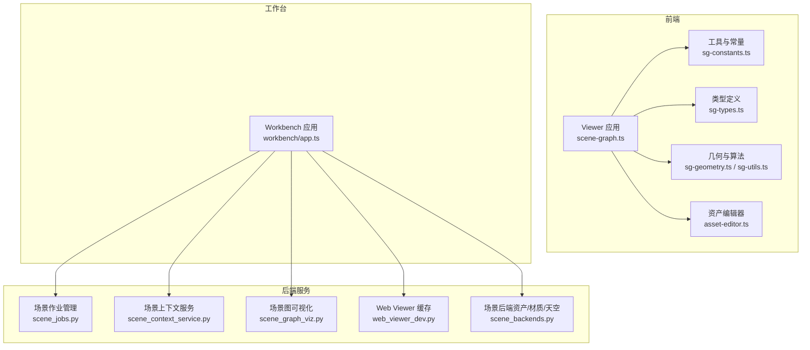
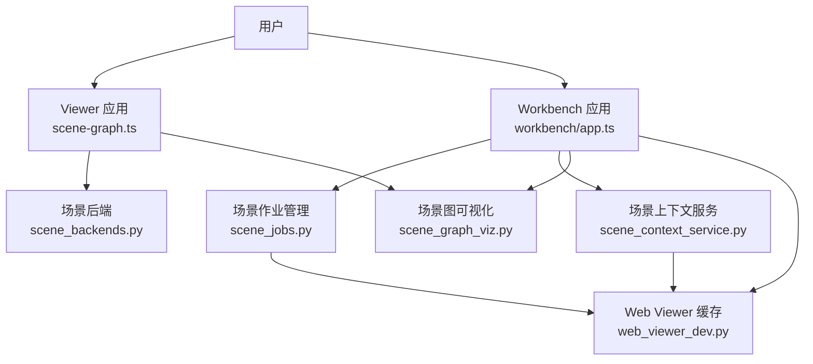
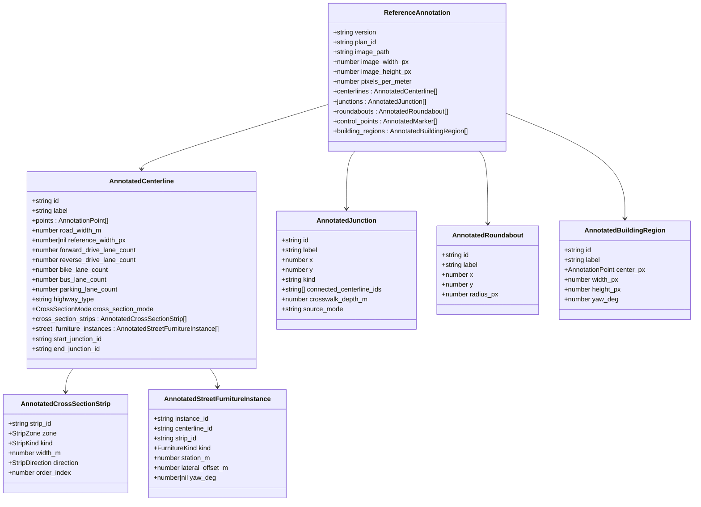
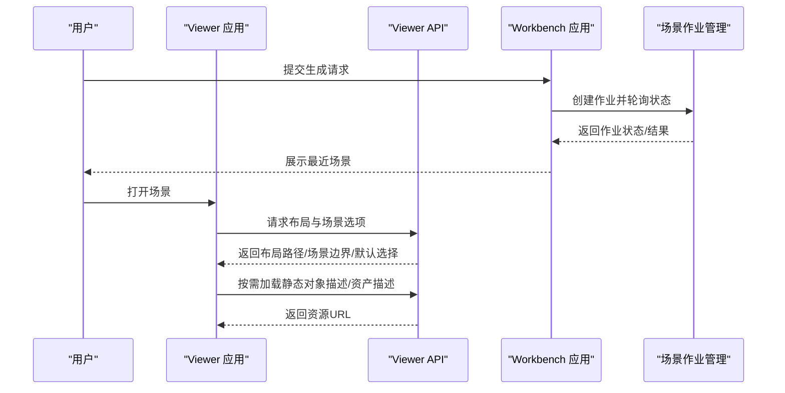
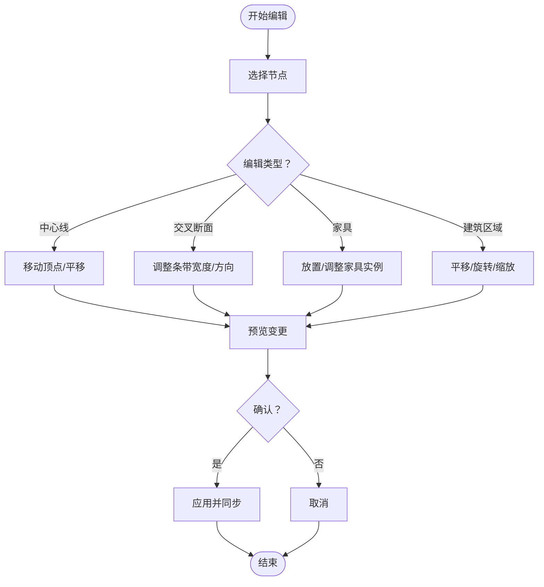
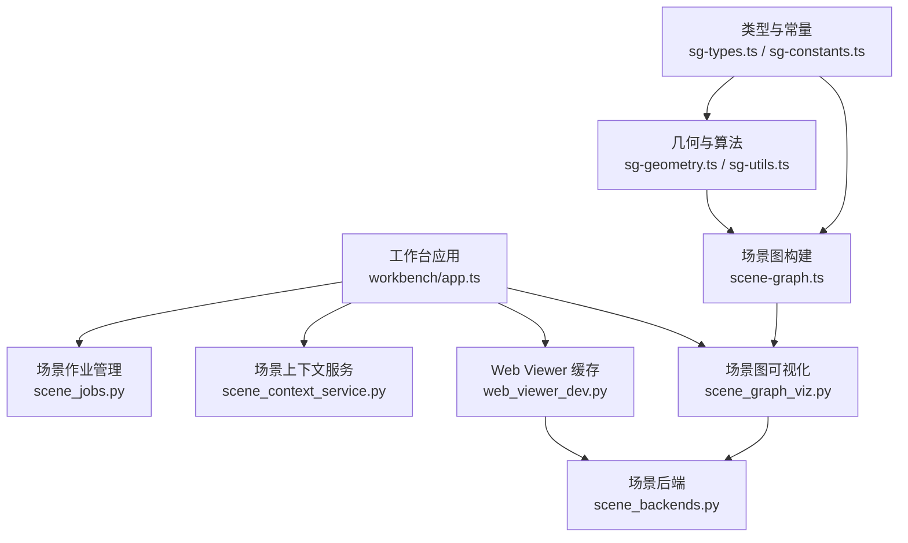

# 场景管理

<cite>
**本文档引用的文件**
- [sg-types.ts](file://web/viewer/src/sg-types.ts)
- [sg-constants.ts](file://web/viewer/src/sg-constants.ts)
- [sg-utils.ts](file://web/viewer/src/sg-utils.ts)
- [sg-geometry.ts](file://web/viewer/src/sg-geometry.ts)
- [scene-graph.ts](file://web/viewer/src/scene-graph.ts)
- [app.ts](file://web/viewer/src/app.ts)
- [asset-editor.ts](file://web/viewer/src/asset-editor.ts)
- [workbench/app.ts](file://web/workbench/src/app.ts)
- [scene_jobs.py](file://src/roadgen3d/services/scene_jobs.py)
- [scene_backends.py](file://src/roadgen3d/services/scene_backends.py)
- [scene_context_service.py](file://src/roadgen3d/services/scene_context_service.py)
- [scene_graph_viz.py](file://src/roadgen3d/scene_graph_viz.py)
- [web_viewer_dev.py](file://src/roadgen3d/web_viewer_dev.py)
</cite>

## 目录
1. [简介](#简介)
2. [项目结构](#项目结构)
3. [核心组件](#核心组件)
4. [架构总览](#架构总览)
5. [详细组件分析](#详细组件分析)
6. [依赖关系分析](#依赖关系分析)
7. [性能考虑](#性能考虑)
8. [故障排除指南](#故障排除指南)
9. [结论](#结论)
10. [附录](#附录)

## 简介
本文件系统性阐述 RoadGen3D 的场景管理系统，涵盖场景图结构设计（节点层次与父子关系、变换矩阵）、节点类型体系（几何节点、光源节点、控制器节点）、场景加载与保存机制（序列化格式与增量更新）、节点选择与编辑删除流程、场景状态管理与版本控制、以及自定义节点类型的开发指南与场景优化策略。文档面向不同技术背景的读者，既提供高层概览也包含代码级细节与可视化图表。

## 项目结构
场景管理相关代码主要分布在前端 Web Viewer、工作台（Workbench）与后端服务层：
- 前端 Viewer：负责场景图渲染、交互、节点选择与编辑、对象列表与动作按钮等。
- 工作台：负责场景作业调度、最近场景列表、任务轮询与状态展示。
- 后端服务：负责场景上下文解析、资产清单后端、场景作业管理与缓存布局。



**图表来源**
- [scene-graph.ts:1-800](file://web/viewer/src/scene-graph.ts#L1-L800)
- [sg-constants.ts:1-187](file://web/viewer/src/sg-constants.ts#L1-L187)
- [sg-types.ts:1-435](file://web/viewer/src/sg-types.ts#L1-L435)
- [sg-geometry.ts:1-800](file://web/viewer/src/sg-geometry.ts#L1-L800)
- [sg-utils.ts:1-800](file://web/viewer/src/sg-utils.ts#L1-L800)
- [asset-editor.ts:1284-1330](file://web/viewer/src/asset-editor.ts#L1284-L1330)
- [workbench/app.ts:678-735](file://web/workbench/src/app.ts#L678-L735)
- [scene_jobs.py:81-100](file://src/roadgen3d/services/scene_jobs.py#L81-L100)
- [scene_context_service.py:279-332](file://src/roadgen3d/services/scene_context_service.py#L279-L332)
- [scene_graph_viz.py:312-578](file://src/roadgen3d/scene_graph_viz.py#L312-L578)
- [web_viewer_dev.py:187-261](file://src/roadgen3d/web_viewer_dev.py#L187-L261)
- [scene_backends.py:1-527](file://src/roadgen3d/services/scene_backends.py#L1-L527)

**章节来源**
- [scene-graph.ts:1-800](file://web/viewer/src/scene-graph.ts#L1-L800)
- [sg-constants.ts:1-187](file://web/viewer/src/sg-constants.ts#L1-L187)
- [sg-types.ts:1-435](file://web/viewer/src/sg-types.ts#L1-L435)
- [sg-geometry.ts:1-800](file://web/viewer/src/sg-geometry.ts#L1-L800)
- [sg-utils.ts:1-800](file://web/viewer/src/sg-utils.ts#L1-L800)
- [asset-editor.ts:1284-1330](file://web/viewer/src/asset-editor.ts#L1284-L1330)
- [workbench/app.ts:678-735](file://web/workbench/src/app.ts#L678-L735)
- [scene_jobs.py:81-100](file://src/roadgen3d/services/scene_jobs.py#L81-L100)
- [scene_context_service.py:279-332](file://src/roadgen3d/services/scene_context_service.py#L279-L332)
- [scene_graph_viz.py:312-578](file://src/roadgen3d/scene_graph_viz.py#L312-L578)
- [web_viewer_dev.py:187-261](file://src/roadgen3d/web_viewer_dev.py#L187-L261)
- [scene_backends.py:1-527](file://src/roadgen3d/services/scene_backends.py#L1-L527)

## 核心组件
- 场景图构建与交互：基于参考标注模型（ReferenceAnnotation）构建中心线、交叉断面、路口覆盖几何、建筑区域等，支持拖拽、缩放、选择与编辑。
- 节点类型系统：以 strip（条带）为核心，细分为车行道、公交道、自行车道、停车道、中分带、近路缓冲/铺装、主人行道、远路缓冲、建筑红线保留区等；家具类型包括长椅、路灯、垃圾桶、邮箱、树、交通设施等。
- 变换与投影：像素坐标与米制坐标互转、多边形偏移、角点连接与裁剪、Junction 覆盖几何生成等。
- 作业与上下文：工作台轮询场景生成作业、解析场景上下文（含 OSM 道路自动选择）、缓存布局供 Viewer 使用。
- 可视化与热力图：场景图节点与边的构建、POI 吸引力/排斥场计算、热力图叠加显示。

**章节来源**
- [sg-types.ts:1-435](file://web/viewer/src/sg-types.ts#L1-L435)
- [sg-constants.ts:1-187](file://web/viewer/src/sg-constants.ts#L1-L187)
- [sg-utils.ts:1-800](file://web/viewer/src/sg-utils.ts#L1-L800)
- [sg-geometry.ts:1-800](file://web/viewer/src/sg-geometry.ts#L1-L800)
- [scene-graph.ts:1-800](file://web/viewer/src/scene-graph.ts#L1-L800)
- [scene_jobs.py:81-100](file://src/roadgen3d/services/scene_jobs.py#L81-L100)
- [scene_context_service.py:279-332](file://src/roadgen3d/services/scene_context_service.py#L279-L332)
- [scene_graph_viz.py:312-578](file://src/roadgen3d/scene_graph_viz.py#L312-L578)

## 架构总览
场景管理采用“前端渲染 + 后端服务”的分层架构：
- 前端 Viewer 负责用户交互与场景图渲染，通过 API 获取布局、场景选项与静态对象描述。
- 工作台负责场景作业的提交、轮询与最近场景列表展示。
- 后端服务提供场景上下文解析、资产清单后端、场景图可视化与 Viewer 缓存布局。



**图表来源**
- [scene-graph.ts:1-800](file://web/viewer/src/scene-graph.ts#L1-L800)
- [workbench/app.ts:678-735](file://web/workbench/src/app.ts#L678-L735)
- [scene_jobs.py:81-100](file://src/roadgen3d/services/scene_jobs.py#L81-L100)
- [scene_context_service.py:279-332](file://src/roadgen3d/services/scene_context_service.py#L279-L332)
- [scene_backends.py:1-527](file://src/roadgen3d/services/scene_backends.py#L1-L527)
- [scene_graph_viz.py:312-578](file://src/roadgen3d/scene_graph_viz.py#L312-L578)
- [web_viewer_dev.py:187-261](file://src/roadgen3d/web_viewer_dev.py#L187-L261)

## 详细组件分析

### 场景图结构设计与节点层次
- 场景图以 ReferenceAnnotation 为根，包含中心线（AnnotatedCenterline）、交叉断面（AnnotatedCrossSectionStrip）、路口覆盖（DerivedJunctionOverlay）、建筑区域（AnnotatedBuildingRegion）、控制点（AnnotatedMarker）、环岛（AnnotatedRoundabout）等节点。
- 节点间存在父子与关联关系：中心线包含多个 strip；strip 有方向与顺序索引；路口覆盖由多条边与连接线组成；建筑区域可旋转与缩放；家具实例绑定到特定 strip。
- 变换矩阵：Viewer 将像素坐标转换为米制坐标，用于在 3D 空间中定位与渲染；几何模块提供多边形偏移、角点连接与裁剪等算法支撑。



**图表来源**
- [sg-types.ts:1-435](file://web/viewer/src/sg-types.ts#L1-L435)

**章节来源**
- [sg-types.ts:1-435](file://web/viewer/src/sg-types.ts#L1-L435)
- [sg-constants.ts:1-187](file://web/viewer/src/sg-constants.ts#L1-L187)
- [sg-utils.ts:1-800](file://web/viewer/src/sg-utils.ts#L1-L800)
- [sg-geometry.ts:1-800](file://web/viewer/src/sg-geometry.ts#L1-L800)
- [scene-graph.ts:1-800](file://web/viewer/src/scene-graph.ts#L1-L800)

### 节点类型系统
- 条带类型（StripKind）：车行道、公交道、自行车道、停车道、中分带、近路缓冲、近路铺装、主人行道、远路缓冲、建筑红线保留区。
- 方向类型（StripDirection）：前向、后向、双向、静态。
- 区域类型（StripZone）：左、中、右。
- 家具类型（FurnitureKind）：长椅、路灯、垃圾桶、邮箱、树、交通设施等。
- 元数据与标签：提供显示标签、资产徽章、指导语等，便于工作流集成。

```mermaid
classDiagram
class StripKind {
<<enumeration>>
"drive_lane"
"bus_lane"
"bike_lane"
"parking_lane"
"median"
"nearroad_buffer"
"nearroad_furnishing"
"clear_sidewalk"
"farfromroad_buffer"
"frontage_reserve"
}
class StripDirection {
<<enumeration>>
"forward"
"reverse"
"bidirectional"
"none"
}
class StripZone {
<<enumeration>>
"left"
"center"
"right"
}
class FurnitureKind {
<<enumeration>>
"bench"
"lamp"
"trash"
"mailbox"
"bollard"
"sign"
"hydrant"
"bus_stop"
"tree"
}
```

**图表来源**
- [sg-constants.ts:32-187](file://web/viewer/src/sg-constants.ts#L32-L187)

**章节来源**
- [sg-constants.ts:32-187](file://web/viewer/src/sg-constants.ts#L32-L187)

### 场景加载与保存机制
- 加载：Viewer 通过 API 获取布局路径、最终场景、生产步骤、默认选择、生成点与朝向、场景边界等信息；Viewer 还会读取静态对象描述与资产描述。
- 保存/缓存：后端提供缓存场景布局的功能，确保 Viewer 可稳定访问已生成的布局与资源。
- 序列化：前端对 ReferenceAnnotation 进行规范化与同步，保证派生字段一致性（如交叉断面模式、车道数、宽度等）。



**图表来源**
- [workbench/app.ts:678-735](file://web/workbench/src/app.ts#L678-L735)
- [scene_jobs.py:81-100](file://src/roadgen3d/services/scene_jobs.py#L81-L100)
- [web_viewer_dev.py:187-261](file://src/roadgen3d/web_viewer_dev.py#L187-L261)
- [app.ts:1953-1969](file://web/viewer/src/app.ts#L1953-L1969)

**章节来源**
- [web_viewer_dev.py:187-261](file://src/roadgen3d/web_viewer_dev.py#L187-L261)
- [app.ts:1953-1969](file://web/viewer/src/app.ts#L1953-L1969)
- [scene_jobs.py:81-100](file://src/roadgen3d/services/scene_jobs.py#L81-L100)
- [workbench/app.ts:678-735](file://web/workbench/src/app.ts#L678-L735)

### 节点选择、编辑与删除
- 选择：Viewer 支持按中心线、路口、环岛、控制点、建筑区域或派生路口覆盖进行选择；选择状态影响属性面板与操作按钮。
- 编辑：支持中心线顶点拖拽、平移、分支绘制、横断面预览、家具实例放置与调整；建筑区域支持平移、旋转、缩放。
- 删除：对象列表中的复选框勾选后可批量删除重复项或拆分对象；删除操作通过状态集合与 UI 按钮联动实现。



**图表来源**
- [asset-editor.ts:1284-1330](file://web/viewer/src/asset-editor.ts#L1284-L1330)
- [scene-graph.ts:1-800](file://web/viewer/src/scene-graph.ts#L1-L800)

**章节来源**
- [asset-editor.ts:1284-1330](file://web/viewer/src/asset-editor.ts#L1284-L1330)
- [scene-graph.ts:1-800](file://web/viewer/src/scene-graph.ts#L1-L800)

### 场景状态管理、撤销重做与版本控制
- 状态管理：Viewer 维护选择状态、拖拽状态、派生几何状态与 UI 控件状态；通过状态集合与事件监听实现响应式更新。
- 撤销/重做：当前代码未直接暴露撤销/重做 API，但可通过保存/恢复 ReferenceAnnotation 的快照实现版本控制与回滚。
- 版本控制：通过作业 ID 与最近场景列表管理生成历史；结合缓存布局路径实现稳定回放。

**章节来源**
- [scene-graph.ts:1-800](file://web/viewer/src/scene-graph.ts#L1-L800)
- [scene_jobs.py:81-100](file://src/roadgen3d/services/scene_jobs.py#L81-L100)
- [workbench/app.ts:678-735](file://web/workbench/src/app.ts#L678-L735)

### 自定义节点类型的开发指南
- 新增节点类型：在类型定义中扩展枚举（如 StripKind、FurnitureKind），并在常量映射中添加显示标签与徽章。
- 几何与算法：在几何模块中新增计算函数（如新的覆盖几何、偏移规则），并在场景图构建中调用。
- 渲染与交互：在 Viewer 中注册新节点类型的渲染样式与交互行为，并在属性面板中提供配置入口。
- 后端集成：如涉及资产或材质，可在场景后端中扩展清单与评分逻辑。

**章节来源**
- [sg-constants.ts:32-187](file://web/viewer/src/sg-constants.ts#L32-L187)
- [sg-geometry.ts:1-800](file://web/viewer/src/sg-geometry.ts#L1-L800)
- [scene-graph.ts:1-800](file://web/viewer/src/scene-graph.ts#L1-L800)
- [scene_backends.py:1-527](file://src/roadgen3d/services/scene_backends.py#L1-L527)

### 场景优化策略
- 数据结构优化：使用有序集合与映射减少重复计算；在交叉断面与家具实例同步时避免冗余字段。
- 几何算法优化：多边形偏移与角点连接采用分段与限幅策略，降低尖角与过度延伸；裁剪与拼接在阈值范围内进行。
- 可视化优化：场景图热力图采用归一化与掩码过滤，仅在有效区域内计算；POI 吸引力与排斥场聚合时进行数值稳定性处理。
- 缓存与增量：Viewer 缓存布局与资源，避免重复加载；作业状态轮询采用终端状态判断，减少无效请求。

**章节来源**
- [sg-utils.ts:623-795](file://web/viewer/src/sg-utils.ts#L623-L795)
- [scene_graph_viz.py:686-734](file://src/roadgen3d/scene_graph_viz.py#L686-L734)
- [web_viewer_dev.py:187-261](file://src/roadgen3d/web_viewer_dev.py#L187-L261)

## 依赖关系分析
- 类型与常量：Viewer 的类型定义与常量集中于 sg-types.ts 与 sg-constants.ts，为几何与场景图模块提供统一约束。
- 几何与算法：sg-geometry.ts 与 sg-utils.ts 提供坐标变换、偏移、裁剪、角度计算与派生几何生成。
- 场景图构建：scene-graph.ts 负责将 ReferenceAnnotation 规范化为可渲染的节点与边，并维护选择与拖拽状态。
- 作业与上下文：workbench/app.ts 负责作业轮询与最近场景展示；scene_jobs.py 提供作业查询与最近场景列表；scene_context_service.py 解析场景上下文与 OSM 道路选择；scene_graph_viz.py 提供场景图可视化与热力图。
- 资产与材质：scene_backends.py 提供对象资产、地面材质与天空的清单后端与选择逻辑。



**图表来源**
- [sg-types.ts:1-435](file://web/viewer/src/sg-types.ts#L1-L435)
- [sg-constants.ts:1-187](file://web/viewer/src/sg-constants.ts#L1-L187)
- [sg-geometry.ts:1-800](file://web/viewer/src/sg-geometry.ts#L1-L800)
- [sg-utils.ts:1-800](file://web/viewer/src/sg-utils.ts#L1-L800)
- [scene-graph.ts:1-800](file://web/viewer/src/scene-graph.ts#L1-L800)
- [workbench/app.ts:678-735](file://web/workbench/src/app.ts#L678-L735)
- [scene_jobs.py:81-100](file://src/roadgen3d/services/scene_jobs.py#L81-L100)
- [scene_context_service.py:279-332](file://src/roadgen3d/services/scene_context_service.py#L279-L332)
- [scene_graph_viz.py:312-578](file://src/roadgen3d/scene_graph_viz.py#L312-L578)
- [scene_backends.py:1-527](file://src/roadgen3d/services/scene_backends.py#L1-L527)
- [web_viewer_dev.py:187-261](file://src/roadgen3d/web_viewer_dev.py#L187-L261)

**章节来源**
- [sg-types.ts:1-435](file://web/viewer/src/sg-types.ts#L1-L435)
- [sg-constants.ts:1-187](file://web/viewer/src/sg-constants.ts#L1-L187)
- [sg-geometry.ts:1-800](file://web/viewer/src/sg-geometry.ts#L1-L800)
- [sg-utils.ts:1-800](file://web/viewer/src/sg-utils.ts#L1-L800)
- [scene-graph.ts:1-800](file://web/viewer/src/scene-graph.ts#L1-L800)
- [workbench/app.ts:678-735](file://web/workbench/src/app.ts#L678-L735)
- [scene_jobs.py:81-100](file://src/roadgen3d/services/scene_jobs.py#L81-L100)
- [scene_context_service.py:279-332](file://src/roadgen3d/services/scene_context_service.py#L279-L332)
- [scene_graph_viz.py:312-578](file://src/roadgen3d/scene_graph_viz.py#L312-L578)
- [scene_backends.py:1-527](file://src/roadgen3d/services/scene_backends.py#L1-L527)
- [web_viewer_dev.py:187-261](file://src/roadgen3d/web_viewer_dev.py#L187-L261)

## 性能考虑
- 计算复杂度：几何偏移与角点连接的时间复杂度与折线段数量成正比；通过分段与阈值限制可降低尖角与过度延伸带来的额外计算。
- 内存占用：场景图节点与边在内存中以数组与字典形式存储；建议在大规模场景中按需加载与懒渲染。
- I/O 优化：Viewer 缓存布局与资源，减少重复网络请求；作业轮询采用终端状态判断，避免频繁轮询。
- 可视化：热力图计算采用归一化与掩码过滤，仅在有效区域内计算，提升渲染效率。

[本节为通用性能讨论，不直接分析具体文件]

## 故障排除指南
- 作业状态异常：检查作业 ID 是否正确，确认作业状态是否进入终止态；查看最近场景列表是否更新。
- 场景加载失败：确认布局路径与资源 URL 是否可用；检查 Viewer 缓存目录权限与稳定性。
- 选择与编辑失效：确认选择状态与拖拽状态是否正确更新；检查 UI 按钮状态联动逻辑。
- OSM 道路选择问题：确认 AOI 边界与种子参数；检查发现缓存元数据是否匹配当前参数。

**章节来源**
- [scene_jobs.py:81-100](file://src/roadgen3d/services/scene_jobs.py#L81-L100)
- [workbench/app.ts:678-735](file://web/workbench/src/app.ts#L678-L735)
- [web_viewer_dev.py:187-261](file://src/roadgen3d/web_viewer_dev.py#L187-L261)
- [scene_context_service.py:189-277](file://src/roadgen3d/services/scene_context_service.py#L189-L277)

## 结论
本场景管理系统以 ReferenceAnnotation 为核心，围绕中心线、交叉断面、路口覆盖与建筑区域构建完整的场景图；通过几何与算法模块实现精确的空间变换与拓扑关系；前端 Viewer 提供直观的交互与可视化，后端服务负责作业调度、上下文解析与资源缓存。系统具备良好的扩展性与可维护性，适合进一步完善撤销/重做与版本控制能力，并持续优化大规模场景的性能表现。

[本节为总结性内容，不直接分析具体文件]

## 附录
- 关键 API 与路径
  - Viewer 场景选项填充：[app.ts:1953-1969](file://web/viewer/src/app.ts#L1953-L1969)
  - 最近场景刷新：[workbench/app.ts:731-735](file://web/workbench/src/app.ts#L731-L735)
  - 作业状态轮询：[workbench/app.ts:709-729](file://web/workbench/src/app.ts#L709-L729)
  - 作业查询与最近场景：[scene_jobs.py:81-100](file://src/roadgen3d/services/scene_jobs.py#L81-L100)
  - 场景上下文解析与 OSM 道路选择：[scene_context_service.py:279-332](file://src/roadgen3d/services/scene_context_service.py#L279-L332)
  - Viewer 布局缓存：[web_viewer_dev.py:187-261](file://src/roadgen3d/web_viewer_dev.py#L187-L261)
  - 场景图构建与可视化：[scene_graph_viz.py:312-578](file://src/roadgen3d/scene_graph_viz.py#L312-L578)

[本节为补充信息，不直接分析具体文件]