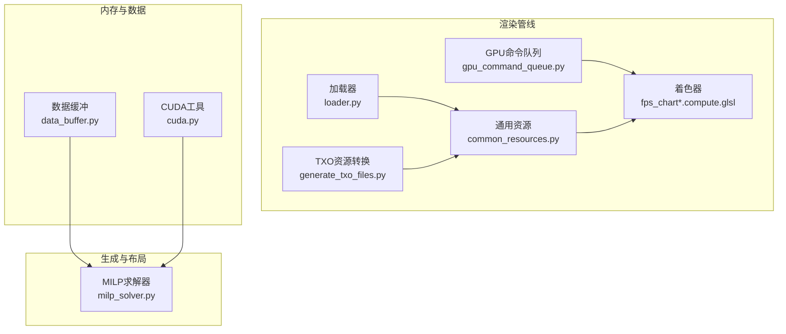
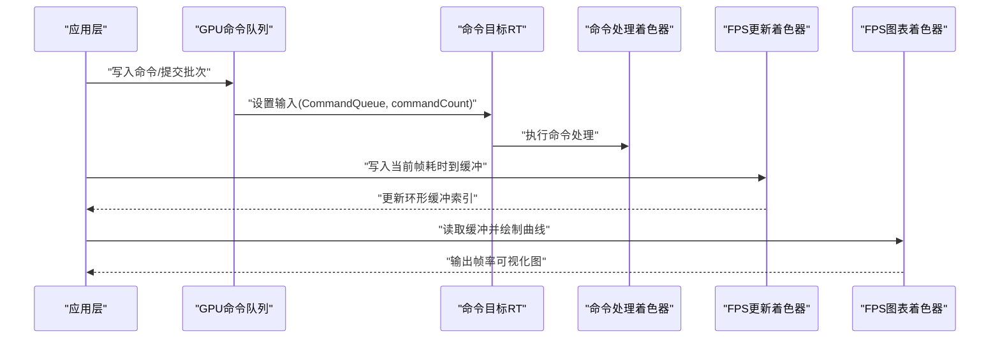
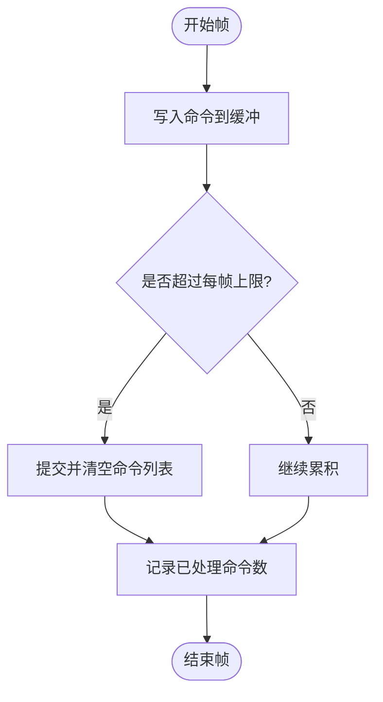
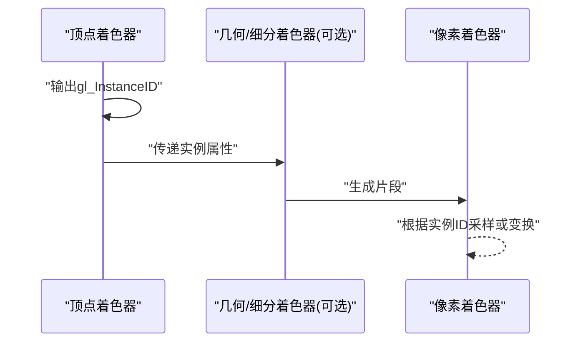
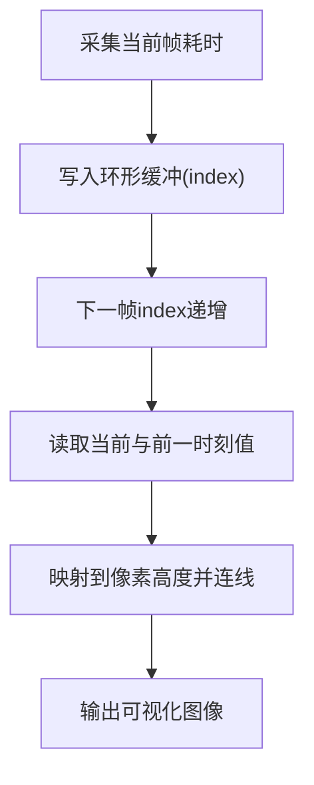
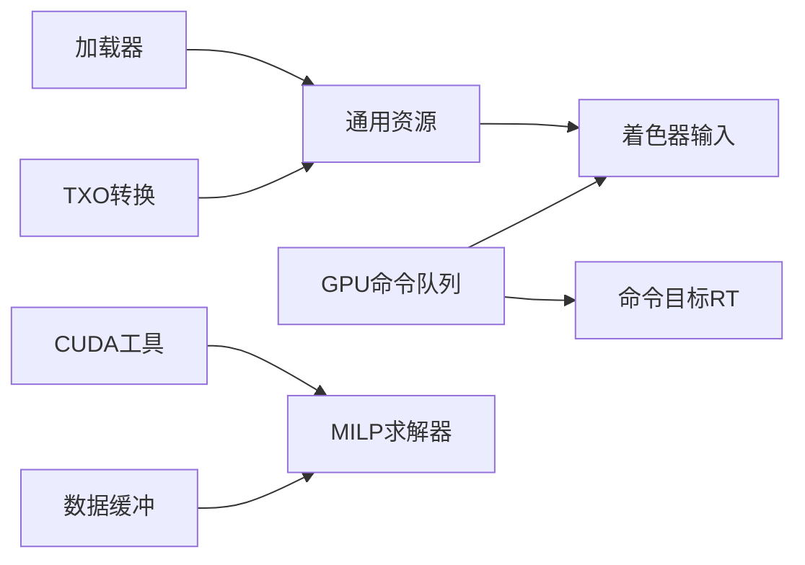

# 性能优化

<cite>
**本文引用的文件**
- [gpu_command_queue.py](file://metaurban/metaurban/render_pipeline/rpcore/gpu_command_queue.py)
- [fps_chart.compute.glsl](file://metaurban/metaurban/render_pipeline/rpcore/shader/fps_chart.compute.glsl)
- [fps_chart_update.compute.glsl](file://metaurban/metaurban/render_pipeline/rpcore/shader/fps_chart_update.compute.glsl)
- [generate_txo_files.py](file://metaurban/metaurban/render_pipeline/data/generate_txo_files.py)
- [common_resources.py](file://metaurban/metaurban/render_pipeline/rpcore/common_resources.py)
- [loader.py](file://metaurban/metaurban/render_pipeline/rpcore/loader.py)
- [default_post_process_instanced.vert.glsl](file://metaurban/metaurban/render_pipeline/rpcore/shader/default_post_process_instanced.vert.glsl)
- [cuda.py](file://metaurban/metaurban/utils/cuda.py)
- [data_buffer.py](file://metaurban/metaurban/utils/data_buffer.py)
- [milp_solver.py](file://src/roadgen3d/milp_solver.py)
</cite>

## 目录
1. [简介](#简介)
2. [项目结构](#项目结构)
3. [核心组件](#核心组件)
4. [架构总览](#架构总览)
5. [详细组件分析](#详细组件分析)
6. [依赖分析](#依赖分析)
7. [性能考量](#性能考量)
8. [故障排查指南](#故障排查指南)
9. [结论](#结论)
10. [附录](#附录)

## 简介
本文件面向 RoadGen3D 的渲染与生成管线，系统化梳理性能优化体系：渲染性能监控指标（帧率、内存使用、GPU 负载）、渲染优化技术（实例化渲染、几何 Instancing、批处理合并）、资源管理策略（纹理压缩、模型简化与 LOD）、内存管理最佳实践（对象池、垃圾回收与泄漏检测）、性能分析工具与瓶颈识别方法，并给出针对不同硬件配置的优化建议与降级策略。

## 项目结构
围绕性能优化的关键目录与文件：
- 渲染管线核心：GPU 命令队列、通用资源、加载器、着色器与可视化
- 资源预处理：TXO 文件转换脚本
- 内存与数据缓冲：数据缓冲与对象清理
- 计算加速：CUDA 工具封装
- 生成与布局：MILP 求解器（影响生成阶段的计算开销）

**图表来源**
- [gpu_command_queue.py:37-113](file://metaurban/metaurban/render_pipeline/rpcore/gpu_command_queue.py#L37-L113)
- [common_resources.py:40-253](file://metaurban/metaurban/render_pipeline/rpcore/common_resources.py#L40-L253)
- [loader.py:64-143](file://metaurban/metaurban/render_pipeline/rpcore/loader.py#L64-L143)
- [fps_chart.compute.glsl:1-74](file://metaurban/metaurban/render_pipeline/rpcore/shader/fps_chart.compute.glsl#L1-L74)
- [fps_chart_update.compute.glsl:1-44](file://metaurban/metaurban/render_pipeline/rpcore/shader/fps_chart_update.compute.glsl#L1-L44)
- [generate_txo_files.py:1-36](file://metaurban/metaurban/render_pipeline/data/generate_txo_files.py#L1-L36)
- [data_buffer.py:31-85](file://metaurban/metaurban/utils/data_buffer.py#L31-L85)
- [cuda.py:1-40](file://metaurban/metaurban/utils/cuda.py#L1-L40)
- [milp_solver.py:139-218](file://src/roadgen3d/milp_solver.py#L139-L218)

**章节来源**
- [gpu_command_queue.py:37-113](file://metaurban/metaurban/render_pipeline/rpcore/gpu_command_queue.py#L37-L113)
- [common_resources.py:40-253](file://metaurban/metaurban/render_pipeline/rpcore/common_resources.py#L40-L253)
- [loader.py:64-143](file://metaurban/metaurban/render_pipeline/rpcore/loader.py#L64-L143)
- [fps_chart.compute.glsl:1-74](file://metaurban/metaurban/render_pipeline/rpcore/shader/fps_chart.compute.glsl#L1-L74)
- [fps_chart_update.compute.glsl:1-44](file://metaurban/metaurban/render_pipeline/rpcore/shader/fps_chart_update.compute.glsl#L1-L44)
- [generate_txo_files.py:1-36](file://metaurban/metaurban/render_pipeline/data/generate_txo_files.py#L1-L36)
- [data_buffer.py:31-85](file://metaurban/metaurban/utils/data_buffer.py#L31-L85)
- [cuda.py:1-40](file://metaurban/metaurban/utils/cuda.py#L1-L40)
- [milp_solver.py:139-218](file://src/roadgen3d/milp_solver.py#L139-L218)

## 核心组件
- GPU 命令队列：通过缓冲区向 GPU 提交命令，支持批量执行与计数统计，便于控制 GPU 负载与吞吐。
- 通用资源：集中管理常用纹理、模型与着色器输入，统一坐标系与帧时间等参数，减少重复绑定与状态切换。
- 加载器：统一封装资源加载路径，内置耗时监控与警告阈值，辅助定位加载瓶颈。
- 帧率可视化：通过计算着色器维护帧耗时环形缓冲并绘制曲线，直观反映帧率波动与 GPU 负载变化。
- 资源预处理：将 PNG/JPG 转换为 TXO 并启用压缩，降低运行时解码成本与内存占用。
- 数据缓冲：基于双端队列的 LRU 缓冲，自动清理旧对象，避免内存膨胀。
- CUDA 工具：封装 cudart 错误检查与 CuPy 使用，保障 GPU 内存与调用安全。
- MILP 求解器：在布局生成阶段进行整数规划求解，可作为性能瓶颈之一，需结合启发式与缓存策略优化。

**章节来源**
- [gpu_command_queue.py:37-113](file://metaurban/metaurban/render_pipeline/rpcore/gpu_command_queue.py#L37-L113)
- [common_resources.py:40-253](file://metaurban/metaurban/render_pipeline/rpcore/common_resources.py#L40-L253)
- [loader.py:40-143](file://metaurban/metaurban/render_pipeline/rpcore/loader.py#L40-L143)
- [fps_chart.compute.glsl:1-74](file://metaurban/metaurban/render_pipeline/rpcore/shader/fps_chart.compute.glsl#L1-L74)
- [fps_chart_update.compute.glsl:1-44](file://metaurban/metaurban/render_pipeline/rpcore/shader/fps_chart_update.compute.glsl#L1-L44)
- [generate_txo_files.py:1-36](file://metaurban/metaurban/render_pipeline/data/generate_txo_files.py#L1-L36)
- [data_buffer.py:31-85](file://metaurban/metaurban/utils/data_buffer.py#L31-L85)
- [cuda.py:1-40](file://metaurban/metaurban/utils/cuda.py#L1-L40)
- [milp_solver.py:139-218](file://src/roadgen3d/milp_solver.py#L139-L218)

## 架构总览
渲染与性能监控的整体流程如下：

**图表来源**
- [gpu_command_queue.py:74-113](file://metaurban/metaurban/render_pipeline/rpcore/gpu_command_queue.py#L74-L113)
- [fps_chart_update.compute.glsl:35-43](file://metaurban/metaurban/render_pipeline/rpcore/shader/fps_chart_update.compute.glsl#L35-L43)
- [fps_chart.compute.glsl:35-73](file://metaurban/metaurban/render_pipeline/rpcore/shader/fps_chart.compute.glsl#L35-L73)

## 详细组件分析

### GPU 命令队列与批处理合并
- 功能要点
  - 将命令写入固定大小的缓冲区，按帧上限批量提交，减少驱动调用次数。
  - 通过 RenderTarget 与着色器执行命令列表，支持定义注入与整数打包以节省带宽。
  - 提供已处理命令数量查询，便于统计与限流。
- 性能意义
  - 批量提交降低 CPU-GPU 同步开销，提升吞吐；缓冲区大小与命令上限决定每帧最大并行度。
- 优化建议
  - 根据场景复杂度动态调整命令上限与缓冲尺寸。
  - 对高频小命令进行逻辑合并，减少状态切换与 DrawCall 数。

**图表来源**
- [gpu_command_queue.py:40-78](file://metaurban/metaurban/render_pipeline/rpcore/gpu_command_queue.py#L40-L78)

**章节来源**
- [gpu_command_queue.py:37-113](file://metaurban/metaurban/render_pipeline/rpcore/gpu_command_queue.py#L37-L113)

### 实例化渲染与几何 Instancing
- 功能要点
  - 顶点着色器输出实例 ID，配合后处理顶点着色器实现平面投影与实例化渲染。
  - 可用于大规模重复几何（如植被、路侧设施）的高效绘制。
- 性能意义
  - 减少 DrawCall 次数，显著降低 CPU 端状态切换与驱动开销。
- 优化建议
  - 将相似材质与拓扑的对象合并到同一实例组。
  - 控制实例属性分页，避免频繁更新导致的带宽浪费。

**图表来源**
- [default_post_process_instanced.vert.glsl:29-35](file://metaurban/metaurban/render_pipeline/rpcore/shader/default_post_process_instanced.vert.glsl#L29-L35)

**章节来源**
- [default_post_process_instanced.vert.glsl:1-36](file://metaurban/metaurban/render_pipeline/rpcore/shader/default_post_process_instanced.vert.glsl#L1-L36)

### 帧率监控与 GPU 负载可视化
- 功能要点
  - 使用计算着色器维护环形缓冲存储帧耗时，另一计算着色器绘制折线图，直观显示 GPU 负载波动。
  - 支持设置最大毫秒阈值与窗口尺寸，便于跨平台对比。
- 性能意义
  - 快速定位帧率抖动与 GPU 过载时段，指导渲染策略调整。
- 优化建议
  - 在高负载时段优先降采样或关闭非关键特效。
  - 结合帧时间平滑参数，避免瞬时尖峰误导。

**图表来源**
- [fps_chart_update.compute.glsl:35-43](file://metaurban/metaurban/render_pipeline/rpcore/shader/fps_chart_update.compute.glsl#L35-L43)
- [fps_chart.compute.glsl:35-73](file://metaurban/metaurban/render_pipeline/rpcore/shader/fps_chart.compute.glsl#L35-L73)

**章节来源**
- [fps_chart_update.compute.glsl:1-44](file://metaurban/metaurban/render_pipeline/rpcore/shader/fps_chart_update.compute.glsl#L1-L44)
- [fps_chart.compute.glsl:1-74](file://metaurban/metaurban/render_pipeline/rpcore/shader/fps_chart.compute.glsl#L1-L74)

### 通用资源与着色器输入
- 功能要点
  - 统一管理常用纹理（环境贴图、BRDF、天空盒）与着色器输入块（相机矩阵、投影矩阵、帧时间等）。
  - 更新阶段计算视图/投影、帧间隔、屏幕尺寸等，确保着色器输入一致性。
- 性能意义
  - 避免重复绑定与状态切换，减少不必要的 UBO 更新。
- 优化建议
  - 对不随帧变化的输入仅在变更时更新。
  - 合理选择过滤与包裹方式，平衡质量与带宽。

**章节来源**
- [common_resources.py:40-253](file://metaurban/metaurban/render_pipeline/rpcore/common_resources.py#L40-L253)

### 加载器与资源预处理
- 功能要点
  - 统一资源加载入口，内置耗时监控与警告阈值，便于发现慢加载项。
  - 提供 TXO 转换脚本，将 PNG/JPG 预转为压缩格式，降低运行时解码与内存占用。
- 性能意义
  - 减少首帧卡顿与运行时解码开销，提升启动与切换效率。
- 优化建议
  - 将热路径资源预转为 TXO/PZ，启用合适的 Mipmap 与压缩格式。
  - 分层加载与异步解码，避免阻塞主线程。

**章节来源**
- [loader.py:40-143](file://metaurban/metaurban/render_pipeline/rpcore/loader.py#L40-L143)
- [generate_txo_files.py:1-36](file://metaurban/metaurban/render_pipeline/data/generate_txo_files.py#L1-L36)

### 内存管理与对象池
- 数据缓冲（LRU）
  - 基于双端队列维护访问顺序，达到容量上限时淘汰最久未使用的对象，支持递归清理字典与数组。
  - 与引擎接口集成，尝试销毁对象与释放底层资源。
- CUDA 工具
  - 封装 cudart 错误检查，确保 CUDA 调用失败时及时抛出异常。
- 性能意义
  - 防止内存持续增长，降低 GC 压力与碎片化。
- 优化建议
  - 对大对象采用对象池复用，减少频繁分配/释放。
  - 定期触发垃圾回收与显存同步，避免峰值过高。

**章节来源**
- [data_buffer.py:31-85](file://metaurban/metaurban/utils/data_buffer.py#L31-L85)
- [cuda.py:1-40](file://metaurban/metaurban/utils/cuda.py#L1-L40)

### 生成与布局阶段的性能
- MILP 求解器
  - 在布局生成中进行整数规划求解，若依赖外部求解器则回退到启发式策略。
  - 可作为生成阶段的性能瓶颈，需结合缓存与并行策略优化。
- 性能意义
  - 合理的求解策略与缓存可显著缩短生成时间，提升交互体验。
- 优化建议
  - 对静态约束建立缓存，命中则跳过求解。
  - 将大规模问题分解为子区域独立求解，最后合并结果。

**章节来源**
- [milp_solver.py:139-218](file://src/roadgen3d/milp_solver.py#L139-L218)

## 依赖分析
- 组件耦合
  - GPU 命令队列依赖渲染目标与着色器，输出到命令处理阶段。
  - 通用资源为多阶段提供共享输入，降低重复绑定。
  - 加载器贯穿资源生命周期，负责预处理与运行时加载。
- 外部依赖
  - CUDA 与 CuPy 用于 GPU 计算错误检查与张量操作。
  - TXO/PZ 压缩纹理格式降低内存与带宽占用。
- 循环依赖
  - 当前模块间无明显循环导入，职责清晰。

**图表来源**
- [loader.py:64-143](file://metaurban/metaurban/render_pipeline/rpcore/loader.py#L64-L143)
- [common_resources.py:40-253](file://metaurban/metaurban/render_pipeline/rpcore/common_resources.py#L40-L253)
- [gpu_command_queue.py:74-113](file://metaurban/metaurban/render_pipeline/rpcore/gpu_command_queue.py#L74-L113)
- [generate_txo_files.py:1-36](file://metaurban/metaurban/render_pipeline/data/generate_txo_files.py#L1-L36)
- [cuda.py:1-40](file://metaurban/metaurban/utils/cuda.py#L1-L40)
- [data_buffer.py:31-85](file://metaurban/metaurban/utils/data_buffer.py#L31-L85)
- [milp_solver.py:139-218](file://src/roadgen3d/milp_solver.py#L139-L218)

**章节来源**
- [loader.py:64-143](file://metaurban/metaurban/render_pipeline/rpcore/loader.py#L64-L143)
- [common_resources.py:40-253](file://metaurban/metaurban/render_pipeline/rpcore/common_resources.py#L40-L253)
- [gpu_command_queue.py:74-113](file://metaurban/metaurban/render_pipeline/rpcore/gpu_command_queue.py#L74-L113)
- [generate_txo_files.py:1-36](file://metaurban/metaurban/render_pipeline/data/generate_txo_files.py#L1-L36)
- [cuda.py:1-40](file://metaurban/metaurban/utils/cuda.py#L1-L40)
- [data_buffer.py:31-85](file://metaurban/metaurban/utils/data_buffer.py#L31-L85)
- [milp_solver.py:139-218](file://src/roadgen3d/milp_solver.py#L139-L218)

## 性能考量
- 渲染性能监控
  - 指标：帧率（FPS/毫秒）、GPU 命令队列吞吐、帧耗时方差。
  - 方法：计算着色器环形缓冲 + 曲线图；结合帧时间平滑参数观察趋势。
- 渲染优化
  - 实例化渲染：对重复几何进行 Instancing，减少 DrawCall。
  - 几何 Instancing：利用实例 ID 与属性分页，避免频繁状态切换。
  - 批处理合并：将同材质/拓扑对象合并到同一批次，减少切换。
- 资源管理
  - 纹理压缩：预转 TXO/PZ，启用合适 Mipmap 与压缩格式。
  - 模型简化：LOD 分层，远距离使用低模；按屏幕面积裁剪细节。
  - 资源预加载：热路径资源提前加载，避免首帧卡顿。
- 内存管理
  - 对象池：大对象与临时对象复用，降低分配频率。
  - 垃圾回收：定期触发 GC 与显存同步，避免峰值过高。
  - 泄漏检测：通过构造/析构统计与引用计数验证，定位异常销毁。
- 性能分析与瓶颈识别
  - 工具：帧率可视化、加载耗时告警、命令队列计数统计。
  - 技巧：从 CPU 时间、GPU 时间、带宽占用三维度切入，优先解决热点路径。
- 硬件适配与降级策略
  - 低端设备：降低分辨率、关闭非必要特效、启用更激进的 LOD 与批处理。
  - 中端设备：适度开启抗锯齿与后处理，保持流畅度与画质平衡。
  - 高端设备：充分利用 Instancing 与多级 LOD，追求更高细节与真实感。

## 故障排查指南
- 加载缓慢
  - 检查加载器告警日志，定位超时资源；确认是否启用 TXO 预处理。
- 帧率抖动
  - 查看帧率可视化曲线，识别尖峰时段；核对命令队列提交规模与 GPU 负载。
- 内存泄漏
  - 使用对象生命周期统计工具，确认析构路径；检查数据缓冲是否正确清理。
- CUDA 错误
  - 通过 CUDA 工具的错误检查函数快速定位失败调用与错误码。

**章节来源**
- [loader.py:40-62](file://metaurban/metaurban/render_pipeline/rpcore/loader.py#L40-L62)
- [fps_chart.compute.glsl:35-73](file://metaurban/metaurban/render_pipeline/rpcore/shader/fps_chart.compute.glsl#L35-L73)
- [data_buffer.py:31-85](file://metaurban/metaurban/utils/data_buffer.py#L31-L85)
- [cuda.py:16-34](file://metaurban/metaurban/utils/cuda.py#L16-L34)

## 结论
通过 GPU 命令队列、实例化渲染、资源预处理与内存管理等手段，RoadGen3D 的渲染管线可在多类硬件上实现稳定流畅的表现。结合帧率可视化与加载耗时监控，能够快速定位瓶颈并实施针对性优化。对于生成阶段的 MILP 求解，建议引入缓存与并行策略以进一步提升效率。

## 附录
- 关键实现位置参考
  - GPU 命令队列与批处理：[gpu_command_queue.py:37-113](file://metaurban/metaurban/render_pipeline/rpcore/gpu_command_queue.py#L37-L113)
  - 实例化渲染顶点着色器：[default_post_process_instanced.vert.glsl:29-35](file://metaurban/metaurban/render_pipeline/rpcore/shader/default_post_process_instanced.vert.glsl#L29-L35)
  - 帧率可视化着色器：[fps_chart_update.compute.glsl:35-43](file://metaurban/metaurban/render_pipeline/rpcore/shader/fps_chart_update.compute.glsl#L35-L43)、[fps_chart.compute.glsl:35-73](file://metaurban/metaurban/render_pipeline/rpcore/shader/fps_chart.compute.glsl#L35-L73)
  - 通用资源与输入：[common_resources.py:40-253](file://metaurban/metaurban/render_pipeline/rpcore/common_resources.py#L40-L253)
  - 加载器与耗时监控：[loader.py:40-143](file://metaurban/metaurban/render_pipeline/rpcore/loader.py#L40-L143)
  - TXO 资源转换：[generate_txo_files.py:1-36](file://metaurban/metaurban/render_pipeline/data/generate_txo_files.py#L1-L36)
  - 数据缓冲与清理：[data_buffer.py:31-85](file://metaurban/metaurban/utils/data_buffer.py#L31-L85)
  - CUDA 错误检查：[cuda.py:16-34](file://metaurban/metaurban/utils/cuda.py#L16-L34)
  - MILP 求解器：[milp_solver.py:139-218](file://src/roadgen3d/milp_solver.py#L139-L218)