# 查看器核心

<cite>
**本文档引用的文件**
- [web/viewer/src/main.ts](file://web/viewer/src/main.ts)
- [web/viewer/src/app.ts](file://web/viewer/src/app.ts)
- [web/viewer/src/asset-editor.ts](file://web/viewer/src/asset-editor.ts)
- [web/viewer/src/scene-graph.ts](file://web/viewer/src/scene-graph.ts)
- [web/viewer/src/sg-types.ts](file://web/viewer/src/sg-types.ts)
- [web/viewer/src/sg-constants.ts](file://web/viewer/src/sg-constants.ts)
- [web/viewer/src/sg-utils.ts](file://web/viewer/src/sg-utils.ts)
- [web/viewer/src/style.css](file://web/viewer/src/style.css)
- [web/viewer/index.html](file://web/viewer/index.html)
- [web/viewer/package.json](file://web/viewer/package.json)
- [web/viewer/vite.config.ts](file://web/viewer/vite.config.ts)
</cite>

## 目录
1. [简介](#简介)
2. [项目结构](#项目结构)
3. [核心组件](#核心组件)
4. [架构总览](#架构总览)
5. [详细组件分析](#详细组件分析)
6. [依赖分析](#依赖分析)
7. [性能考虑](#性能考虑)
8. [故障排除指南](#故障排除指南)
9. [结论](#结论)
10. [附录](#附录)

## 简介

RoadGen3D 查看器核心系统是一个基于 Three.js 的现代 Web 3D 查看器，支持三种主要页面模式：3D 查看器（viewer）、场景图编辑器（scene-graph）和 3D 资产编辑器（asset-editor）。该系统采用模块化架构设计，通过前端路由实现页面切换，集成了 Three.js 渲染管线、场景管理和用户交互控制。

系统的核心特性包括：
- 基于 Three.js 的高性能 3D 渲染
- 模块化的页面架构（viewer、scene-graph、asset-editor）
- 实时场景浏览和交互控制
- 资产元数据管理和编辑
- 场景图注释和街道设计工具
- 完整的开发和构建工具链

## 项目结构

查看器核心系统位于 `web/viewer` 目录下，采用标准的 Vite + TypeScript + Three.js 技术栈：

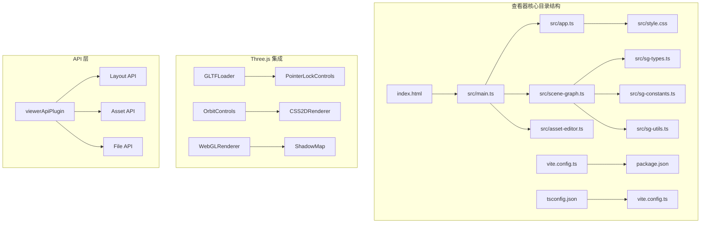

**图表来源**
- [web/viewer/src/main.ts:1-61](file://web/viewer/src/main.ts#L1-L61)
- [web/viewer/src/app.ts:1-800](file://web/viewer/src/app.ts#L1-L800)
- [web/viewer/vite.config.ts:1-100](file://web/viewer/vite.config.ts#L1-L100)

**章节来源**
- [web/viewer/src/main.ts:1-61](file://web/viewer/src/main.ts#L1-L61)
- [web/viewer/index.html:1-13](file://web/viewer/index.html#L1-L13)
- [web/viewer/package.json:1-20](file://web/viewer/package.json#L1-L20)

## 核心组件

### 路由系统

查看器采用基于 URL hash 的轻量级路由机制，支持三种页面模式：

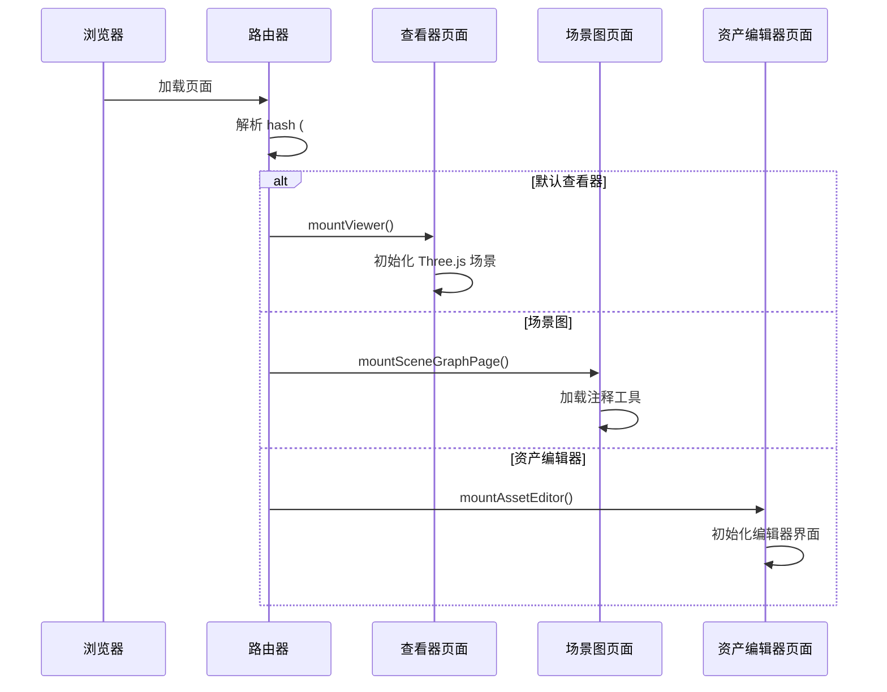

**图表来源**
- [web/viewer/src/main.ts:21-54](file://web/viewer/src/main.ts#L21-L54)

### Three.js 集成

系统深度集成了 Three.js 库，实现了完整的 3D 渲染管线：

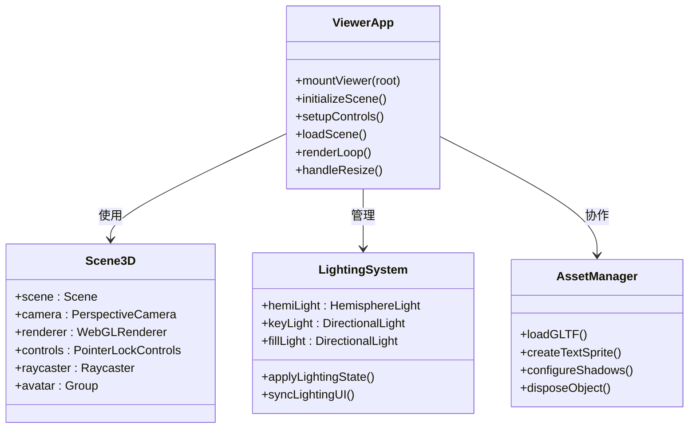

**图表来源**
- [web/viewer/src/app.ts:1079-1180](file://web/viewer/src/app.ts#L1079-L1180)
- [web/viewer/src/app.ts:1208-1247](file://web/viewer/src/app.ts#L1208-L1247)

### 模块化架构

系统采用清晰的模块分离策略，每个页面都有独立的功能域：

| 模块 | 主要职责 | 关键文件 |
|------|----------|----------|
| **viewer** | 3D 场景查看和导航 | app.ts, main.ts |
| **scene-graph** | 街道设计和注释工具 | scene-graph.ts, sg-types.ts |
| **asset-editor** | 3D 资产管理和编辑 | asset-editor.ts |

**章节来源**
- [web/viewer/src/app.ts:832-834](file://web/viewer/src/app.ts#L832-L834)
- [web/viewer/src/scene-graph.ts:1-100](file://web/viewer/src/scene-graph.ts#L1-L100)
- [web/viewer/src/asset-editor.ts:1-100](file://web/viewer/src/asset-editor.ts#L1-L100)

## 架构总览

查看器核心系统采用分层架构设计，从底层到上层依次为：

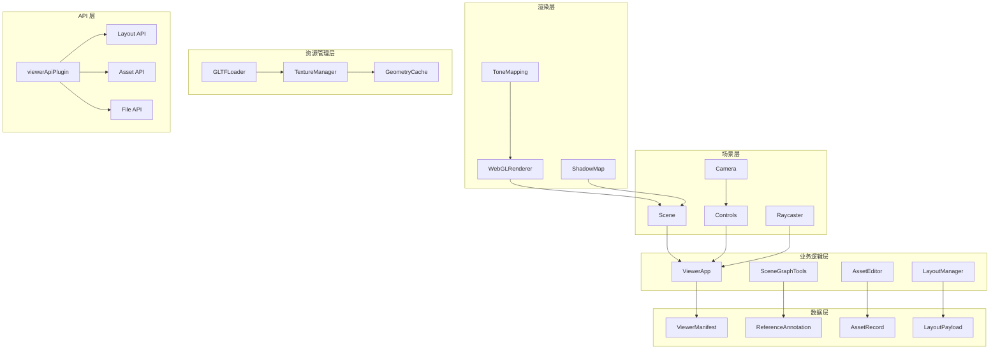

**图表来源**
- [web/viewer/vite.config.ts:527-660](file://web/viewer/vite.config.ts#L527-L660)
- [web/viewer/src/app.ts:1079-1130](file://web/viewer/src/app.ts#L1079-L1130)

## 详细组件分析

### 查看器应用 (Viewer)

查看器应用是系统的核心，负责 3D 场景的完整生命周期管理：

#### 场景初始化流程

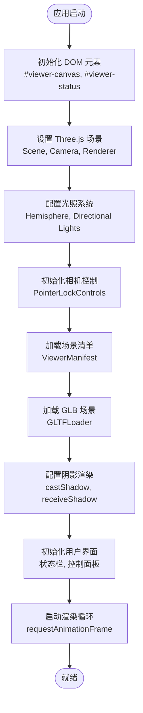

**图表来源**
- [web/viewer/src/app.ts:1079-1130](file://web/viewer/src/app.ts#L1079-L1130)
- [web/viewer/src/app.ts:1128-1131](file://web/viewer/src/app.ts#L1128-L1131)

#### 用户交互控制

查看器实现了完整的 3D 导航控制系统：

| 控制类型 | 键盘映射 | 功能描述 |
|----------|----------|----------|
| **移动控制** | W/A/S/D | 前进/左移/后退/右移 |
| **加速** | Shift | 冲刺模式（2倍速度） |
| **视角锁定** | 鼠标点击 | 进入第一人称视角 |
| **重置视图** | R | 将相机重置到初始位置 |
| **设置面板** | P | 切换显示设置面板 |
| **复制信息** | Ctrl/Cmd+C | 复制激光指针目标详情 |

#### 光照系统

系统提供了灵活的光照配置选项：

| 光照参数 | 取值范围 | 默认值 | 描述 |
|----------|----------|--------|------|
| **曝光** | 0.5-2.0 | 1.8 | 整体亮度调节 |
| **主光源强度** | 0.2-2.0 | 1.7 | 太阳光效果强度 |
| **填充光强度** | 0.1-1.6 | 1.2 | 环境光补充强度 |
| **暖色调** | -1.0-1.0 | 0.6 | 色温调节（暖/冷） |
| **阴影强度** | 0-1.0 | 0.05 | 阴影可见度 |

**章节来源**
- [web/viewer/src/app.ts:1184-1247](file://web/viewer/src/app.ts#L1184-L1247)
- [web/viewer/src/app.ts:1512-1557](file://web/viewer/src/app.ts#L1512-L1557)

### 场景图编辑器 (Scene Graph)

场景图编辑器专注于街道设计和注释工具：

#### 数据模型架构

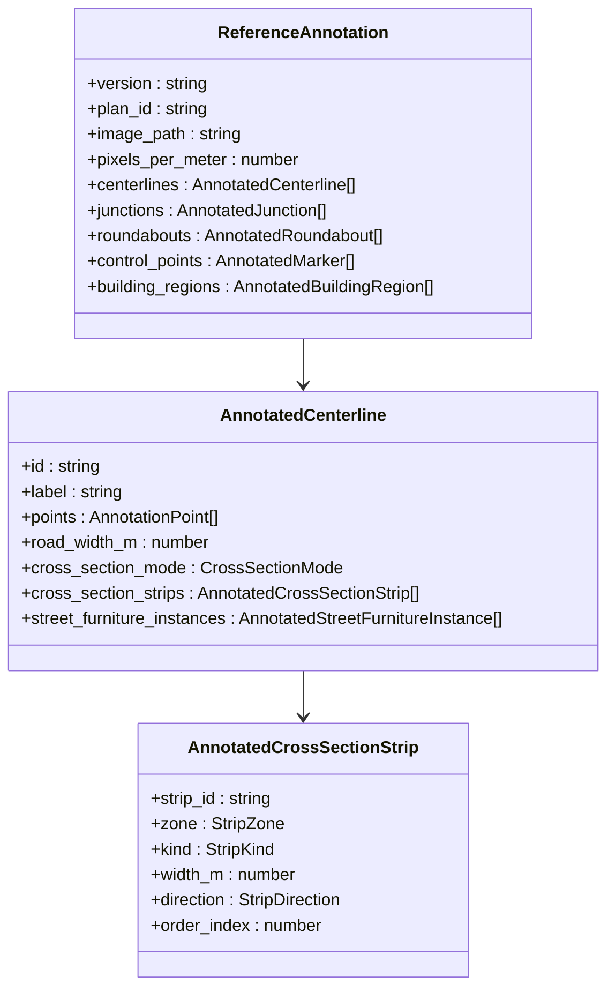

**图表来源**
- [web/viewer/src/sg-types.ts:117-129](file://web/viewer/src/sg-types.ts#L117-L129)
- [web/viewer/src/sg-types.ts:50-67](file://web/viewer/src/sg-types.ts#L50-L67)

#### 工具常量和配置

场景图编辑器定义了丰富的工具常量：

| 类别 | 常量名称 | 值 | 描述 |
|------|----------|-----|------|
| **尺寸参数** | DEFAULT_DRIVE_LANE_WIDTH_M | 3.3 | 标准车道宽度 |
| **默认道路宽度** | DEFAULT_ROAD_WIDTH_M | ~20.0 | 默认道路总宽度 |
| **像素比例** | DEFAULT_PIXELS_PER_METER | 1.5 | 像素到米的比例 |
| **最小长度** | BRANCH_MIN_LENGTH_M | 4.0 | 分支最小长度 |
| **截面最小半长** | CROSS_MIN_HALF_LENGTH_M | 4.0 | 截面最小半长 |

**章节来源**
- [web/viewer/src/sg-constants.ts:1-187](file://web/viewer/src/sg-constants.ts#L1-L187)
- [web/viewer/src/sg-types.ts:1-200](file://web/viewer/src/sg-types.ts#L1-L200)

### 资产编辑器 (Asset Editor)

资产编辑器提供了强大的 3D 资产管理和编辑功能：

#### 预览系统架构

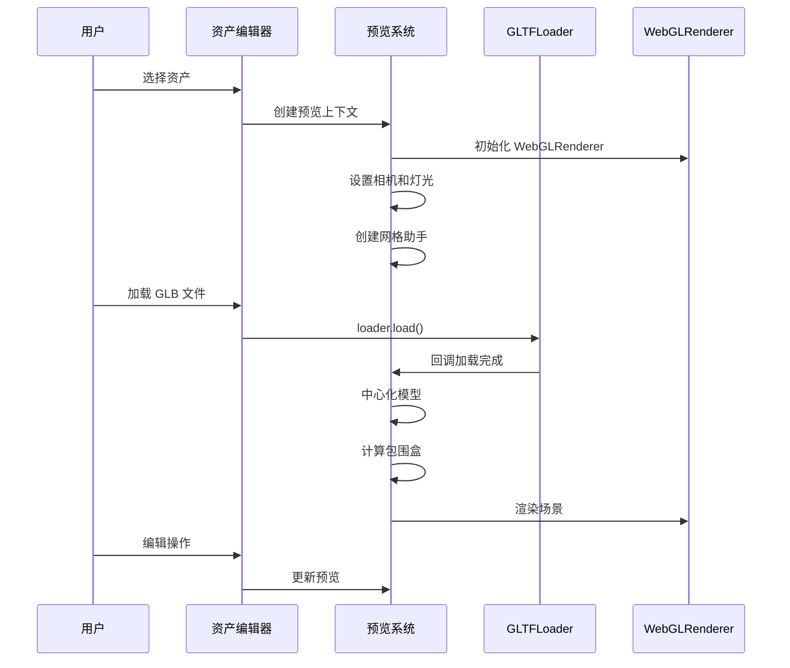

**图表来源**
- [web/viewer/src/asset-editor.ts:295-395](file://web/viewer/src/asset-editor.ts#L295-L395)
- [web/viewer/src/asset-editor.ts:397-447](file://web/viewer/src/asset-editor.ts#L397-L447)

#### 资产管理功能

资产编辑器支持以下核心功能：

| 功能类别 | 子功能 | 描述 |
|----------|--------|------|
| **浏览管理** | 分页加载 | 支持大数量资产的分页浏览 |
| **搜索过滤** | 文本搜索 | 基于资产 ID、类别、标签的搜索 |
| **质量筛选** | 等级过滤 | 按质量等级（T0-T5）筛选资产 |
| **预览编辑** | 实时预览 | 在编辑器中实时查看模型 |
| **几何编辑** | 选择删除 | 支持矩形框选和批量删除 |
| **属性编辑** | 元数据修改 | 修改资产的类别、标签、质量等级等 |

**章节来源**
- [web/viewer/src/asset-editor.ts:800-1599](file://web/viewer/src/asset-editor.ts#L800-L1599)

## 依赖分析

### 外部依赖

查看器系统的主要外部依赖包括：

```mermaid
graph LR
subgraph "核心依赖"
A[three ^0.180.0] --> B[Three.js 核心库]
C[@types/three ^0.183.1] --> D[TypeScript 类型定义]
end
subgraph "开发依赖"
E[typescript ^5.9.2] --> F[TypeScript 编译器]
G[vite ^7.1.5] --> H[Vite 开发服务器]
end
subgraph "运行时依赖"
I[three/examples/jsm/*] --> J[Three.js 示例扩展]
K[three/examples/jsm/loaders/GLTFLoader] --> L[GLTF 模型加载]
M[three/examples/jsm/controls/PointerLockControls] --> N[鼠标锁定控制]
O[three/examples/jsm/renderers/CSS2DRenderer] --> P[2D 文本渲染]
end
```

**图表来源**
- [web/viewer/package.json:11-18](file://web/viewer/package.json#L11-L18)

### 内部模块依赖

系统内部模块之间存在清晰的依赖关系：

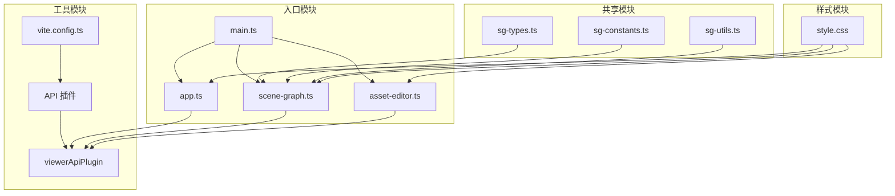

**图表来源**
- [web/viewer/src/main.ts:1-6](file://web/viewer/src/main.ts#L1-L6)
- [web/viewer/src/scene-graph.ts:1-50](file://web/viewer/src/scene-graph.ts#L1-L50)

**章节来源**
- [web/viewer/package.json:1-20](file://web/viewer/package.json#L1-L20)
- [web/viewer/vite.config.ts:1-100](file://web/viewer/vite.config.ts#L1-L100)

## 性能考虑

### 渲染性能优化

查看器系统采用了多项性能优化措施：

#### 渲染管线优化

| 优化项 | 实现方式 | 性能收益 |
|--------|----------|----------|
| **设备像素比限制** | `Math.min(window.devicePixelRatio, 2)` | 减少高 DPI 设备的渲染负担 |
| **抗锯齿设置** | `antialias: true` | 提升视觉质量同时控制性能 |
| **阴影映射优化** | PCFSoftShadowMap | 平衡质量与性能 |
| **色调映射** | ACESFilmicToneMapping | 更真实的光照表现 |

#### 内存管理

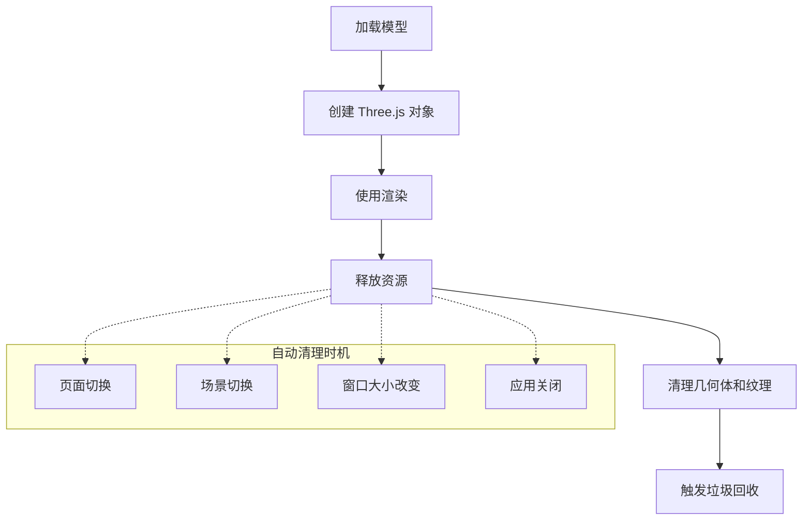

**图表来源**
- [web/viewer/src/app.ts:467-487](file://web/viewer/src/app.ts#L467-L487)
- [web/viewer/src/asset-editor.ts:715-733](file://web/viewer/src/asset-editor.ts#L715-L733)

### 加载性能优化

系统通过多种方式优化资源加载性能：

| 优化策略 | 实现细节 | 效果 |
|----------|----------|------|
| **延迟加载** | 按需加载场景和资产 | 减少初始加载时间 |
| **缓存机制** | 本地缓存已加载资源 | 提升重复访问速度 |
| **分页加载** | 资产列表分页显示 | 降低内存占用 |
| **压缩传输** | GLB 二进制格式 | 减少网络传输体积 |

**章节来源**
- [web/viewer/src/app.ts:521-541](file://web/viewer/src/app.ts#L521-L541)
- [web/viewer/src/asset-editor.ts:936-974](file://web/viewer/src/asset-editor.ts#L936-L974)

## 故障排除指南

### 常见问题诊断

#### 渲染相关问题

| 问题症状 | 可能原因 | 解决方案 |
|----------|----------|----------|
| **黑屏或白屏** | WebGL 不支持或禁用 | 检查浏览器兼容性和设置 |
| **模型不显示** | GLB 文件损坏或路径错误 | 验证文件路径和格式 |
| **渲染卡顿** | 高多边形模型或复杂材质 | 优化模型或降低细节级别 |
| **光照异常** | 光源配置错误 | 检查光照参数设置 |

#### 用户交互问题

| 问题症状 | 可能原因 | 解决方案 |
|----------|----------|----------|
| **无法移动** | 鼠标锁定失败 | 点击场景捕获鼠标焦点 |
| **视角固定** | 控制器未正确初始化 | 刷新页面重新加载 |
| **键盘响应异常** | 输入焦点在文本框中 | 确保焦点在画布上 |
| **激光指针无效** | 激光功能未启用 | 在设置中启用激光指针 |

#### API 和数据问题

| 问题症状 | 可能原因 | 解决方案 |
|----------|----------|----------|
| **场景加载失败** | 布局文件不存在 | 检查布局文件路径 |
| **资产列表为空** | 资产清单损坏 | 重新生成资产清单 |
| **文件访问受限** | 跨域或权限问题 | 检查文件服务配置 |
| **API 调用超时** | 网络连接问题 | 检查网络状态和代理设置 |

### 调试工具使用

系统提供了多种内置调试工具：

#### 开发者工具

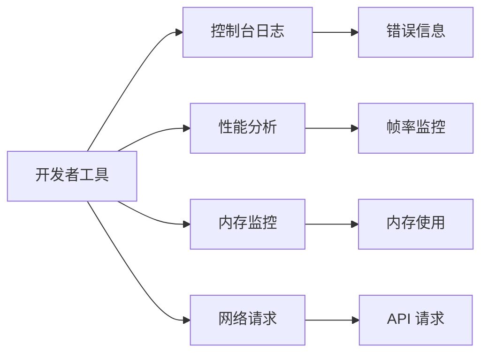

#### 日志和状态跟踪

系统在关键操作点输出详细的状态信息，便于问题诊断：

- **场景加载状态**：显示当前加载进度和错误信息
- **用户交互反馈**：提供即时的操作结果提示
- **性能指标**：记录渲染时间和内存使用情况
- **API 调用日志**：追踪所有后台请求的详细信息

**章节来源**
- [web/viewer/src/app.ts:1188-1206](file://web/viewer/src/app.ts#L1188-L1206)
- [web/viewer/src/asset-editor.ts:737-753](file://web/viewer/src/asset-editor.ts#L737-L753)

## 结论

RoadGen3D 查看器核心系统展现了现代 Web 3D 应用的最佳实践，通过模块化架构设计实现了高度的可维护性和扩展性。系统在技术选型上选择了成熟的 Three.js 生态，在性能优化和用户体验方面都达到了专业水准。

### 主要优势

1. **架构清晰**：模块化设计使得各功能组件职责明确，易于维护和扩展
2. **性能优秀**：通过多项优化措施确保了流畅的 3D 交互体验
3. **功能完整**：涵盖了从场景查看到资产编辑的完整工作流
4. **开发友好**：完善的开发工具链和调试支持

### 技术亮点

- **灵活的路由系统**：基于 hash 的轻量级路由机制
- **强大的 Three.js 集成**：完整的 3D 渲染和交互控制
- **丰富的工具集**：针对不同用户需求的专业工具
- **完善的错误处理**：全面的异常捕获和用户反馈机制

该系统为 RoadGen3D 项目提供了坚实的技术基础，为后续的功能扩展和性能优化奠定了良好的基础。

## 附录

### 扩展新功能模块指南

#### 开发步骤

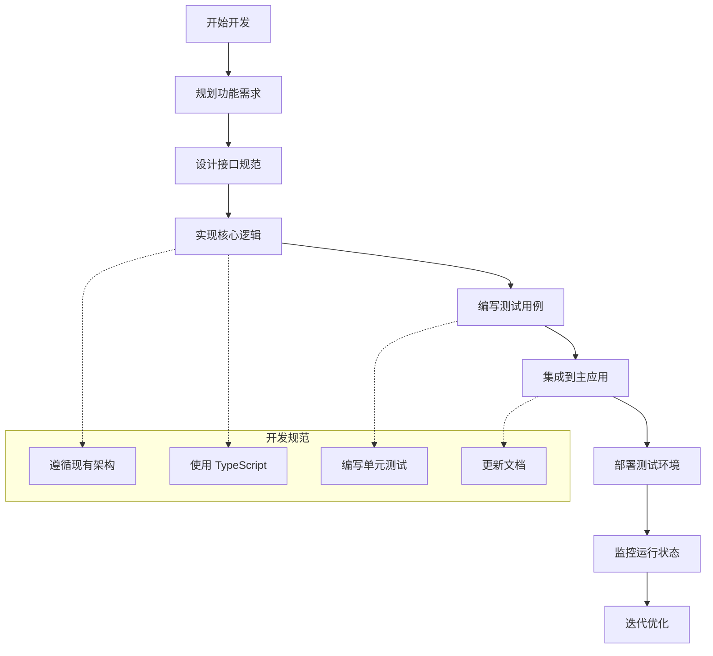

#### 最佳实践

1. **模块化设计**：遵循现有的模块分离原则
2. **类型安全**：充分利用 TypeScript 的类型系统
3. **性能优先**：在设计阶段考虑性能影响
4. **错误处理**：实现完善的异常处理机制
5. **测试覆盖**：编写充分的单元测试和集成测试
6. **文档同步**：及时更新相关技术文档

#### 配置管理

系统支持通过环境变量进行配置管理：

| 环境变量 | 默认值 | 用途 |
|----------|--------|------|
| `VITE_ROADGEN_API_BASE` | `http://127.0.0.1:8010` | API 服务器地址 |
| `ROADGEN_VIEWER_ALLOWED_ROOTS` | 仓库根目录 | 允许访问的文件路径 |

**章节来源**
- [web/viewer/src/sg-constants.ts](file://web/viewer/src/sg-constants.ts#L3)
- [web/viewer/vite.config.ts:50-60](file://web/viewer/vite.config.ts#L50-L60)