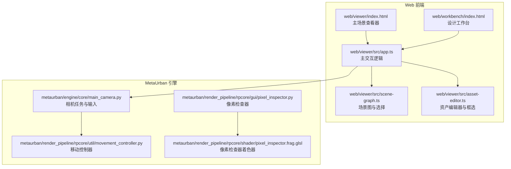
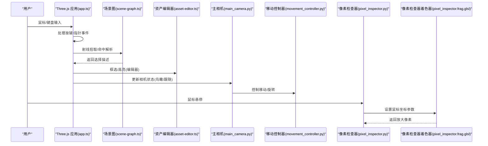
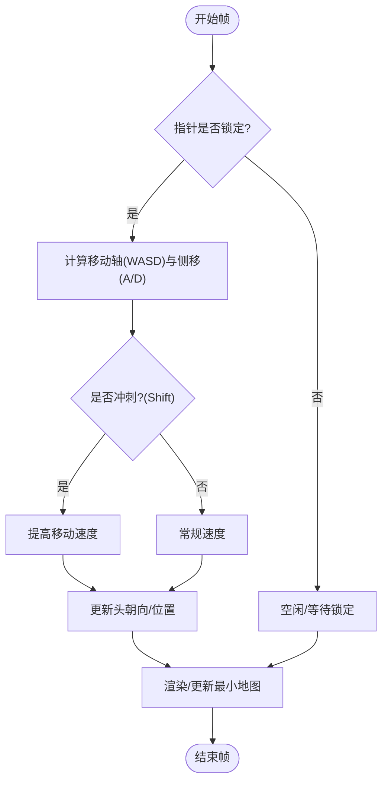
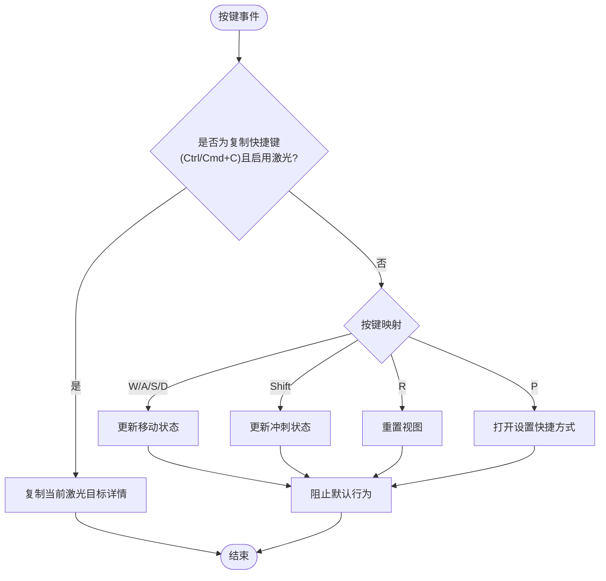
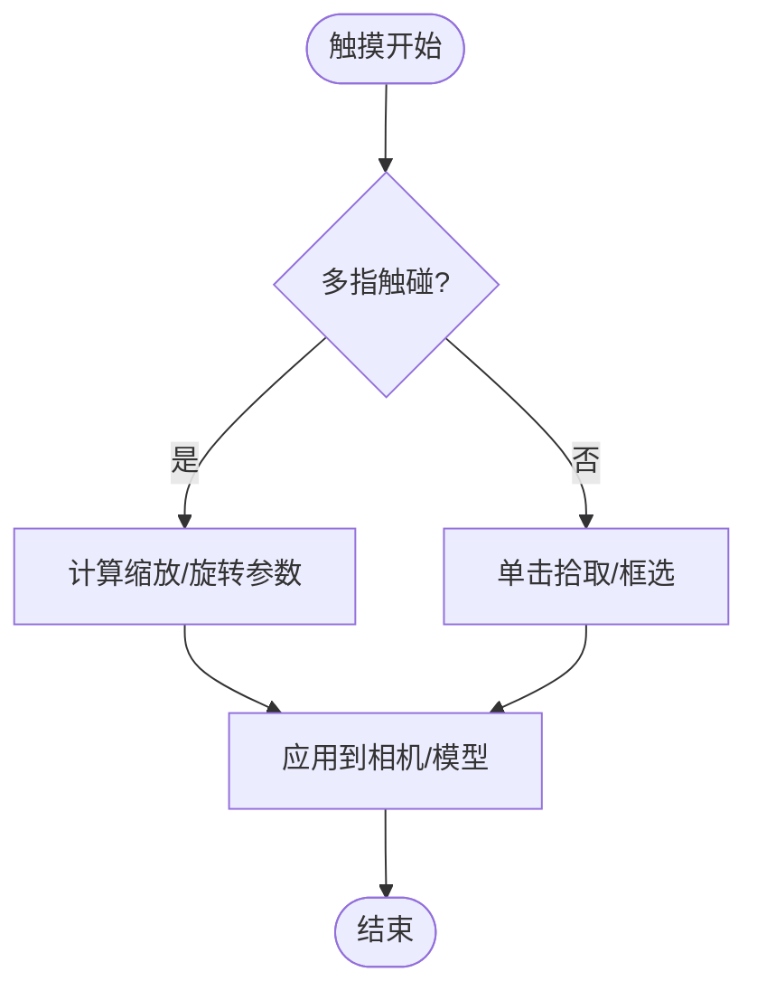
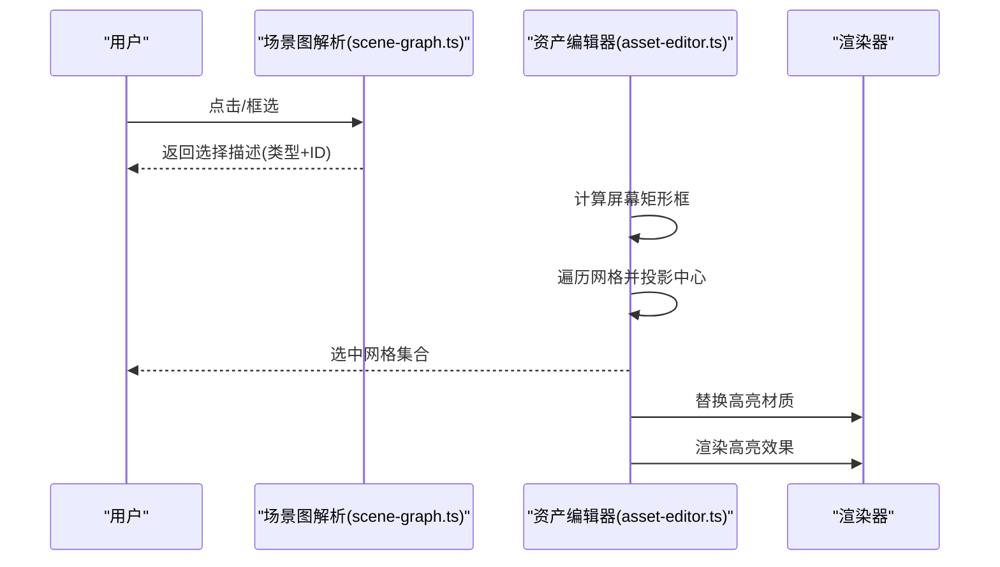
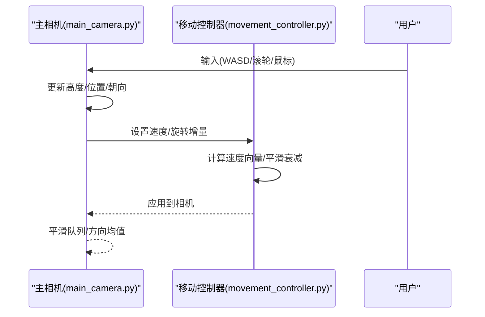
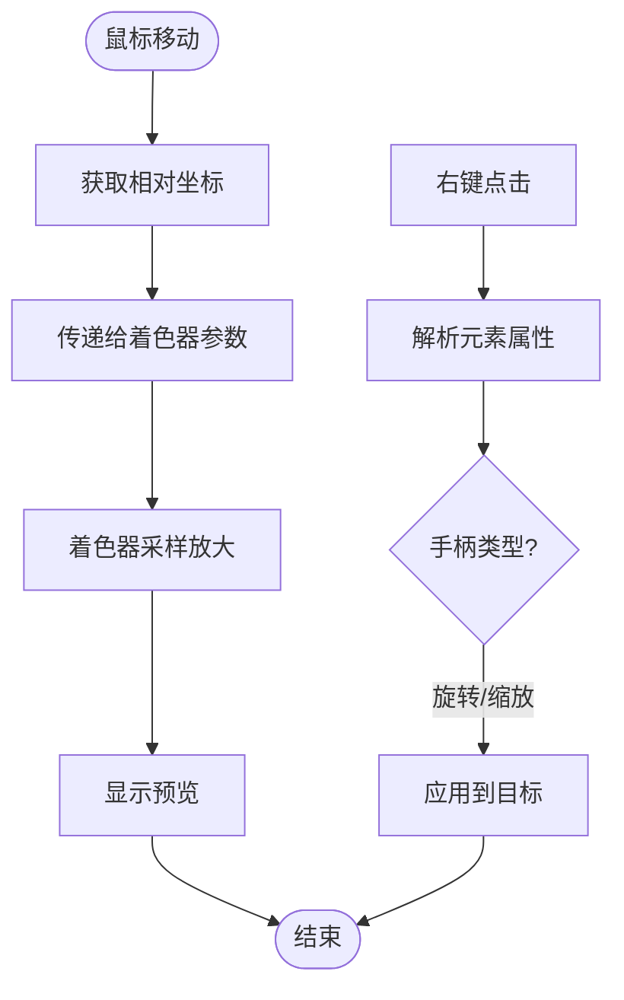
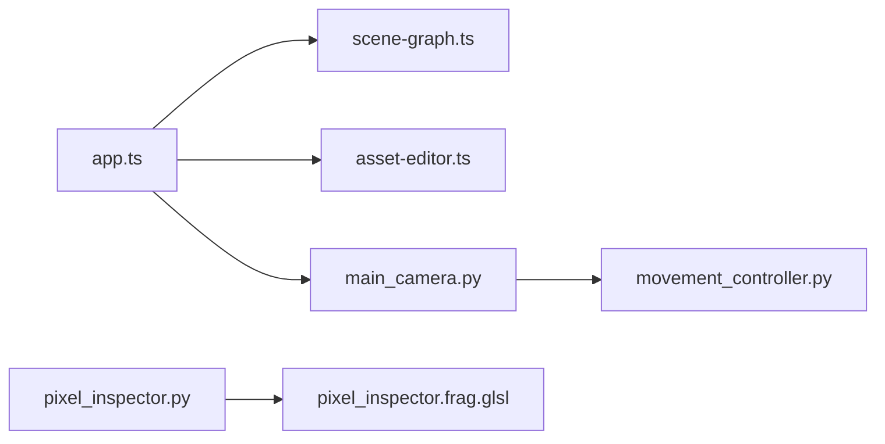

# 用户交互

<cite>
**本文引用的文件**
- [web/viewer/src/app.ts](file://web/viewer/src/app.ts)
- [web/viewer/src/scene-graph.ts](file://web/viewer/src/scene-graph.ts)
- [web/viewer/src/asset-editor.ts](file://web/viewer/src/asset-editor.ts)
- [metaurban/metaurban/render_pipeline/rpcore/util/movement_controller.py](file://metaurban/metaurban/render_pipeline/rpcore/util/movement_controller.py)
- [metaurban/metaurban/engine/core/main_camera.py](file://metaurban/metaurban/engine/core/main_camera.py)
- [metaurban/metaurban/render_pipeline/rpcore/gui/pixel_inspector.py](file://metaurban/metaurban/render_pipeline/rpcore/gui/pixel_inspector.py)
- [metaurban/metaurban/render_pipeline/rpcore/shader/pixel_inspector.frag.glsl](file://metaurban/metaurban/render_pipeline/rpcore/shader/pixel_inspector.frag.glsl)
- [web/viewer/index.html](file://web/viewer/index.html)
- [web/workbench/index.html](file://web/workbench/index.html)
</cite>

## 目录
1. [简介](#简介)
2. [项目结构](#项目结构)
3. [核心组件](#核心组件)
4. [架构总览](#架构总览)
5. [详细组件分析](#详细组件分析)
6. [依赖关系分析](#依赖关系分析)
7. [性能考虑](#性能考虑)
8. [故障排查指南](#故障排查指南)
9. [结论](#结论)
10. [附录](#附录)

## 简介
本文件系统化梳理 RoadGen3D 的用户交互体系，覆盖以下主题：
- 鼠标事件：点击拾取、拖拽、滚轮缩放、右键菜单
- 键盘快捷键：移动、视角切换、复制激光目标等
- 虚拟键盘与手势识别（基于现有实现的扩展建议）
- 触摸设备支持：多点触控、手势识别与响应式设计
- 选中系统：高亮显示与选择反馈
- 相机控制：轨道旋转、第一/第三人称漫游、路径导航
- 自定义扩展：如何在现有框架上扩展交互事件
- 用户体验优化：输入延迟、反馈与无障碍

## 项目结构
Web 交互主要集中在 web/viewer 与 web/workbench 两个前端应用，以及 metaurban 引擎侧的相机与输入控制模块。

**图表来源**
- [web/viewer/index.html:1-13](file://web/viewer/index.html#L1-L13)
- [web/workbench/index.html:1-13](file://web/workbench/index.html#L1-L13)
- [web/viewer/src/app.ts:1100-1135](file://web/viewer/src/app.ts#L1100-L1135)
- [web/viewer/src/scene-graph.ts:1-80](file://web/viewer/src/scene-graph.ts#L1-L80)
- [web/viewer/src/asset-editor.ts:1-80](file://web/viewer/src/asset-editor.ts#L1-L80)
- [metaurban/metaurban/engine/core/main_camera.py:1-60](file://metaurban/metaurban/engine/core/main_camera.py#L1-L60)
- [metaurban/metaurban/render_pipeline/rpcore/util/movement_controller.py:112-165](file://metaurban/metaurban/render_pipeline/rpcore/util/movement_controller.py#L112-L165)
- [metaurban/metaurban/render_pipeline/rpcore/gui/pixel_inspector.py:70-78](file://metaurban/metaurban/render_pipeline/rpcore/gui/pixel_inspector.py#L70-L78)
- [metaurban/metaurban/render_pipeline/rpcore/shader/pixel_inspector.frag.glsl:29-48](file://metaurban/metaurban/render_pipeline/rpcore/shader/pixel_inspector.frag.glsl#L29-L48)

**章节来源**
- [web/viewer/index.html:1-13](file://web/viewer/index.html#L1-L13)
- [web/workbench/index.html:1-13](file://web/workbench/index.html#L1-L13)

## 核心组件
- 主场景查看器（Three.js + PointerLockControls）：负责第一人称移动、视角锁定、相机同步与渲染循环。
- 场景图与选择（Scene Graph）：解析点击目标，识别中心线、交叉口、圆形岛、控制点、建筑区域等要素。
- 资产编辑器（OrbitControls + 框选）：支持模型预览、框选高亮、删除网格等编辑操作。
- MetaUrban 相机与移动控制：提供第三人称跟随、鸟瞰模式、滚轮缩放、鼠标旋转恢复等能力。
- 像素检查器：通过着色器与 GUI 组件实现鼠标悬停时的像素放大预览。

**章节来源**
- [web/viewer/src/app.ts:1100-1135](file://web/viewer/src/app.ts#L1100-L1135)
- [web/viewer/src/scene-graph.ts:4125-4175](file://web/viewer/src/scene-graph.ts#L4125-L4175)
- [web/viewer/src/asset-editor.ts:609-694](file://web/viewer/src/asset-editor.ts#L609-L694)
- [metaurban/metaurban/engine/core/main_camera.py:371-392](file://metaurban/metaurban/engine/core/main_camera.py#L371-L392)
- [metaurban/metaurban/render_pipeline/rpcore/gui/pixel_inspector.py:70-78](file://metaurban/metaurban/render_pipeline/rpcore/gui/pixel_inspector.py#L70-L78)

## 架构总览
下图展示了从前端交互到引擎相机与着色器的调用链路。

**图表来源**
- [web/viewer/src/app.ts:1121-1135](file://web/viewer/src/app.ts#L1121-L1135)
- [web/viewer/src/scene-graph.ts:4125-4175](file://web/viewer/src/scene-graph.ts#L4125-L4175)
- [web/viewer/src/asset-editor.ts:609-694](file://web/viewer/src/asset-editor.ts#L609-L694)
- [metaurban/metaurban/engine/core/main_camera.py:371-392](file://metaurban/metaurban/engine/core/main_camera.py#L371-L392)
- [metaurban/metaurban/render_pipeline/rpcore/util/movement_controller.py:177-240](file://metaurban/metaurban/render_pipeline/rpcore/util/movement_controller.py#L177-L240)
- [metaurban/metaurban/render_pipeline/rpcore/gui/pixel_inspector.py:70-78](file://metaurban/metaurban/render_pipeline/rpcore/gui/pixel_inspector.py#L70-L78)
- [metaurban/metaurban/render_pipeline/rpcore/shader/pixel_inspector.frag.glsl:29-48](file://metaurban/metaurban/render_pipeline/rpcore/shader/pixel_inspector.frag.glsl#L29-L48)

## 详细组件分析

### 鼠标事件与相机控制
- 第一人称移动：使用 PointerLockControls 锁定指针，结合键盘 WASD 与 Shift 实现前进/后退/平移/冲刺；移动速度随帧时间插值更新。
- 鼠标旋转与恢复：主相机在窗口外静止一段时间后自动回中，避免漂移；鸟瞰模式下支持滚轮缩放高度。
- 跟随相机：第三人称相机跟随车辆，支持平滑队列与方向均值滤波，鼠标旋转影响朝向。
- 右键菜单：在场景图中通过元素 data-* 属性识别可交互区域，结合上下文菜单实现操作（如建筑区域调整手柄）。

**图表来源**
- [web/viewer/src/app.ts:2576-2601](file://web/viewer/src/app.ts#L2576-L2601)
- [web/viewer/src/app.ts:1512-1557](file://web/viewer/src/app.ts#L1512-L1557)
- [metaurban/metaurban/engine/core/main_camera.py:199-219](file://metaurban/metaurban/engine/core/main_camera.py#L199-L219)

**章节来源**
- [web/viewer/src/app.ts:1121-1135](file://web/viewer/src/app.ts#L1121-L1135)
- [web/viewer/src/app.ts:2576-2601](file://web/viewer/src/app.ts#L2576-L2601)
- [metaurban/metaurban/engine/core/main_camera.py:371-392](file://metaurban/metaurban/engine/core/main_camera.py#L371-L392)

### 键盘快捷键系统
- 移动：W/A/S/D 前进/左移/后退/右移；Shift 冲刺。
- 视角：R 重置视图；P 打开设置快捷方式。
- 复制激光目标详情：Ctrl/Cmd+C 在启用激光时复制当前目标信息。

**图表来源**
- [web/viewer/src/app.ts:1512-1557](file://web/viewer/src/app.ts#L1512-L1557)

**章节来源**
- [web/viewer/src/app.ts:1512-1557](file://web/viewer/src/app.ts#L1512-L1557)

### 虚拟键盘与手势识别
- 当前实现未发现专用“虚拟键盘”组件；可通过 Web API 的 Input 事件与自定义 UI 结合实现。
- 手势识别：未见现成实现。建议基于 PointerEvent 的 pressure、twist、tangentialPressure 或 TouchEvent 的多指距离变化与角度差来扩展。

**章节来源**
- [web/viewer/src/app.ts:1100-1135](file://web/viewer/src/app.ts#L1100-L1135)

### 触摸设备支持与多点触控
- 框选与高亮：资产编辑器已实现基于矩形框选的屏幕空间选择与高亮。
- 响应式设计：Three.js 渲染器与最小地图在窗口尺寸变化时动态调整分辨率与 DPR。

**图表来源**
- [web/viewer/src/asset-editor.ts:609-694](file://web/viewer/src/asset-editor.ts#L609-L694)
- [web/viewer/src/app.ts:1407-1422](file://web/viewer/src/app.ts#L1407-L1422)

**章节来源**
- [web/viewer/src/asset-editor.ts:609-694](file://web/viewer/src/asset-editor.ts#L609-L694)
- [web/viewer/src/app.ts:1407-1422](file://web/viewer/src/app.ts#L1407-L1422)

### 选中系统、高亮显示与选择反馈
- 场景图命中解析：根据元素 data-feature-kind 与 data-feature-id 提取选择类型（中心线、交叉口、圆形岛、控制点、建筑区域），并支持顶点索引。
- 资产编辑器框选：遍历模型子节点，将包围盒中心投影到屏幕空间，判断是否落入矩形框内，从而确定选中网格。
- 高亮：对选中网格临时替换材质以实现半透明高亮，离开时恢复原材质。

**图表来源**
- [web/viewer/src/scene-graph.ts:4125-4175](file://web/viewer/src/scene-graph.ts#L4125-L4175)
- [web/viewer/src/asset-editor.ts:661-694](file://web/viewer/src/asset-editor.ts#L661-L694)
- [web/viewer/src/asset-editor.ts:696-713](file://web/viewer/src/asset-editor.ts#L696-L713)

**章节来源**
- [web/viewer/src/scene-graph.ts:4125-4175](file://web/viewer/src/scene-graph.ts#L4125-L4175)
- [web/viewer/src/asset-editor.ts:609-694](file://web/viewer/src/asset-editor.ts#L609-L694)
- [web/viewer/src/asset-editor.ts:696-713](file://web/viewer/src/asset-editor.ts#L696-L713)

### 相机控制：轨道旋转、第一/第三人称漫游与路径导航
- 鸟瞰模式：固定高度，WASD 平移，滚轮缩放高度；支持鼠标进入窗口后自动回中，避免漂移。
- 跟随相机：基于车辆队列与方向均值，计算相机位置与朝向；鼠标旋转影响航向。
- 路径导航：移动控制器支持播放运动曲线，实现相机路径播放与性能统计输出。

**图表来源**
- [metaurban/metaurban/engine/core/main_camera.py:371-392](file://metaurban/metaurban/engine/core/main_camera.py#L371-L392)
- [metaurban/metaurban/render_pipeline/rpcore/util/movement_controller.py:177-240](file://metaurban/metaurban/render_pipeline/rpcore/util/movement_controller.py#L177-L240)

**章节来源**
- [metaurban/metaurban/engine/core/main_camera.py:371-392](file://metaurban/metaurban/engine/core/main_camera.py#L371-L392)
- [metaurban/metaurban/render_pipeline/rpcore/util/movement_controller.py:177-240](file://metaurban/metaurban/render_pipeline/rpcore/util/movement_controller.py#L177-L240)

### 像素检查器与右键菜单
- 像素检查器：GUI 组件获取鼠标相对坐标，传递给着色器；着色器以鼠标为中心进行局部放大采样，形成放大镜效果。
- 右键菜单：通过场景图元素的 data-* 属性识别可交互手柄（如建筑区域的旋转/缩放手柄），触发相应操作。

**图表来源**
- [metaurban/metaurban/render_pipeline/rpcore/gui/pixel_inspector.py:70-78](file://metaurban/metaurban/render_pipeline/rpcore/gui/pixel_inspector.py#L70-L78)
- [metaurban/metaurban/render_pipeline/rpcore/shader/pixel_inspector.frag.glsl:29-48](file://metaurban/metaurban/render_pipeline/rpcore/shader/pixel_inspector.frag.glsl#L29-L48)
- [web/viewer/src/scene-graph.ts:4155-4175](file://web/viewer/src/scene-graph.ts#L4155-L4175)

**章节来源**
- [metaurban/metaurban/render_pipeline/rpcore/gui/pixel_inspector.py:70-78](file://metaurban/metaurban/render_pipeline/rpcore/gui/pixel_inspector.py#L70-L78)
- [metaurban/metaurban/render_pipeline/rpcore/shader/pixel_inspector.frag.glsl:29-48](file://metaurban/metaurban/render_pipeline/rpcore/shader/pixel_inspector.frag.glsl#L29-L48)
- [web/viewer/src/scene-graph.ts:4155-4175](file://web/viewer/src/scene-graph.ts#L4155-L4175)

## 依赖关系分析
- 前端 Three.js 应用依赖 PointerLockControls 进行第一人称控制，依赖 OrbitControls（在资产编辑器）进行模型浏览。
- 场景图模块依赖 DOM 元素属性进行选择解析，不直接耦合渲染层。
- 引擎相机模块与移动控制器解耦，通过任务管理器驱动更新。
- 像素检查器通过 GUI 组件与着色器配合，形成轻量级调试工具。

**图表来源**
- [web/viewer/src/app.ts:1100-1135](file://web/viewer/src/app.ts#L1100-L1135)
- [web/viewer/src/scene-graph.ts:4125-4175](file://web/viewer/src/scene-graph.ts#L4125-L4175)
- [web/viewer/src/asset-editor.ts:1-80](file://web/viewer/src/asset-editor.ts#L1-L80)
- [metaurban/metaurban/engine/core/main_camera.py:1-60](file://metaurban/metaurban/engine/core/main_camera.py#L1-L60)
- [metaurban/metaurban/render_pipeline/rpcore/util/movement_controller.py:112-165](file://metaurban/metaurban/render_pipeline/rpcore/util/movement_controller.py#L112-L165)
- [metaurban/metaurban/render_pipeline/rpcore/gui/pixel_inspector.py:70-78](file://metaurban/metaurban/render_pipeline/rpcore/gui/pixel_inspector.py#L70-L78)
- [metaurban/metaurban/render_pipeline/rpcore/shader/pixel_inspector.frag.glsl:29-48](file://metaurban/metaurban/render_pipeline/rpcore/shader/pixel_inspector.frag.glsl#L29-L48)

**章节来源**
- [web/viewer/src/app.ts:1100-1135](file://web/viewer/src/app.ts#L1100-L1135)
- [web/viewer/src/scene-graph.ts:4125-4175](file://web/viewer/src/scene-graph.ts#L4125-L4175)
- [web/viewer/src/asset-editor.ts:1-80](file://web/viewer/src/asset-editor.ts#L1-L80)
- [metaurban/metaurban/engine/core/main_camera.py:1-60](file://metaurban/metaurban/engine/core/main_camera.py#L1-L60)
- [metaurban/metaurban/render_pipeline/rpcore/util/movement_controller.py:112-165](file://metaurban/metaurban/render_pipeline/rpcore/util/movement_controller.py#L112-L165)
- [metaurban/metaurban/render_pipeline/rpcore/gui/pixel_inspector.py:70-78](file://metaurban/metaurban/render_pipeline/rpcore/gui/pixel_inspector.py#L70-L78)
- [metaurban/metaurban/render_pipeline/rpcore/shader/pixel_inspector.frag.glsl:29-48](file://metaurban/metaurban/render_pipeline/rpcore/shader/pixel_inspector.frag.glsl#L29-L48)

## 性能考虑
- 帧时间与速度：移动控制器与相机更新均使用 dt 插值，避免不同帧率下的速度差异。
- 平滑与衰减：速度与旋转采用指数衰减，减少突变带来的抖动感。
- 渲染分辨率：最小地图与主渲染器在窗口变化时按 DPR 调整，兼顾清晰度与性能。
- 材质替换：高亮仅在选中网格上临时替换材质，避免全局重绘成本。

**章节来源**
- [metaurban/metaurban/render_pipeline/rpcore/util/movement_controller.py:227-228](file://metaurban/metaurban/render_pipeline/rpcore/util/movement_controller.py#L227-L228)
- [web/viewer/src/app.ts:1407-1422](file://web/viewer/src/app.ts#L1407-L1422)
- [web/viewer/src/asset-editor.ts:696-713](file://web/viewer/src/asset-editor.ts#L696-L713)

## 故障排查指南
- 指针未锁定导致无法移动：确认 PointerLockControls 已正确绑定到渲染容器并触发锁定。
- 键盘快捷键无效：检查事件目标是否处于可编辑输入框；非编辑目标才应被处理。
- 框选无效：确保渲染容器具备正确的相对定位，框选矩形计算基于 DOMRect。
- 鼠标漂移：主相机在窗口外静止一段时间会自动回中，若仍异常，检查鼠标状态与任务计时器。
- 像素检查器无效果：确认 GUI 组件已获取鼠标坐标并传递至着色器参数。

**章节来源**
- [web/viewer/src/app.ts:1470-1472](file://web/viewer/src/app.ts#L1470-L1472)
- [web/viewer/src/app.ts:751-761](file://web/viewer/src/app.ts#L751-L761)
- [web/viewer/src/asset-editor.ts:634-654](file://web/viewer/src/asset-editor.ts#L634-L654)
- [metaurban/metaurban/engine/core/main_camera.py:199-219](file://metaurban/metaurban/engine/core/main_camera.py#L199-L219)
- [metaurban/metaurban/render_pipeline/rpcore/gui/pixel_inspector.py:70-78](file://metaurban/metaurban/render_pipeline/rpcore/gui/pixel_inspector.py#L70-L78)

## 结论
本交互体系以 Three.js 为核心，结合 MetaUrban 引擎的相机与输入控制，提供了从第一人称移动、第三人称跟随到鸟瞰浏览的完整相机方案；场景图与资产编辑器分别覆盖了语义选择与几何编辑两大类交互。通过像素检查器与右键菜单，系统实现了轻量调试与上下文操作。建议后续在虚拟键盘与手势识别方面引入 PointerEvent/TouchEvent 扩展，在移动端进一步完善响应式布局与交互反馈。

## 附录
- 自定义扩展建议
  - 虚拟键盘：监听 Input 事件，结合自定义 UI 显示候选词与快捷操作。
  - 手势识别：基于多指距离变化与角度差实现捏合缩放与旋转；压力感应可用于深度交互。
  - 右键菜单：统一通过 data-* 属性声明交互能力，集中解析与执行。
  - 无障碍：为键盘操作提供视觉反馈与语音提示，确保在禁用鼠标时仍可高效操作。