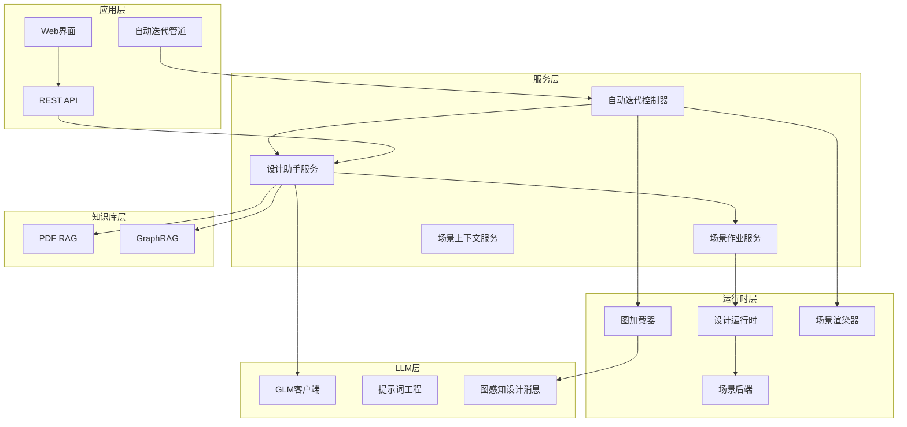
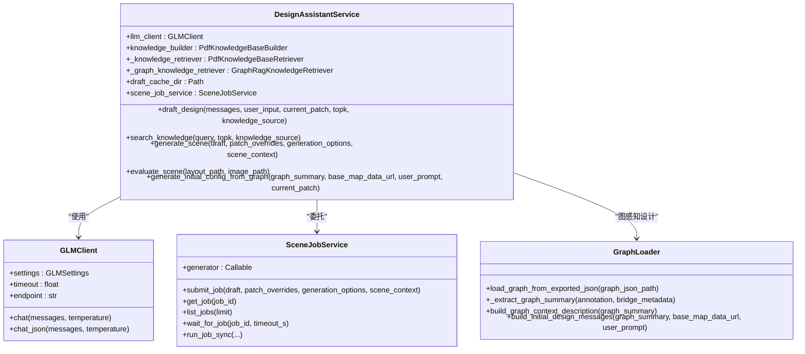
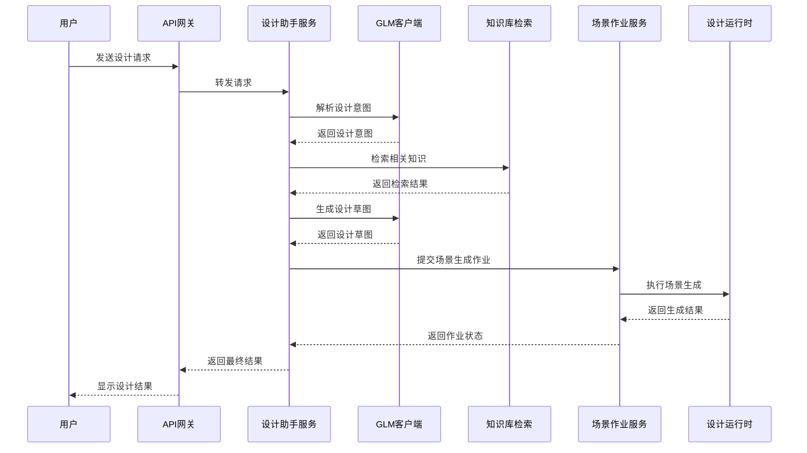
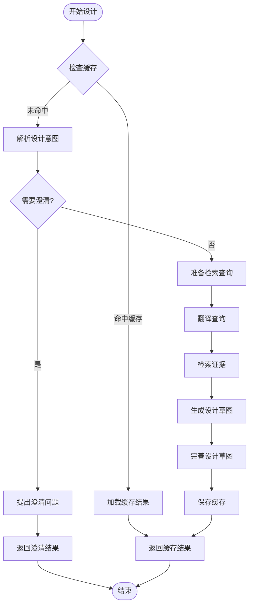
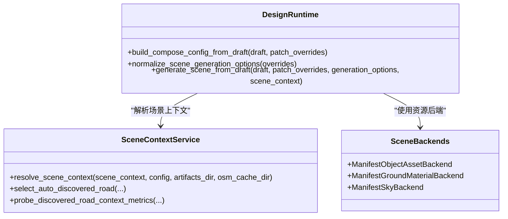
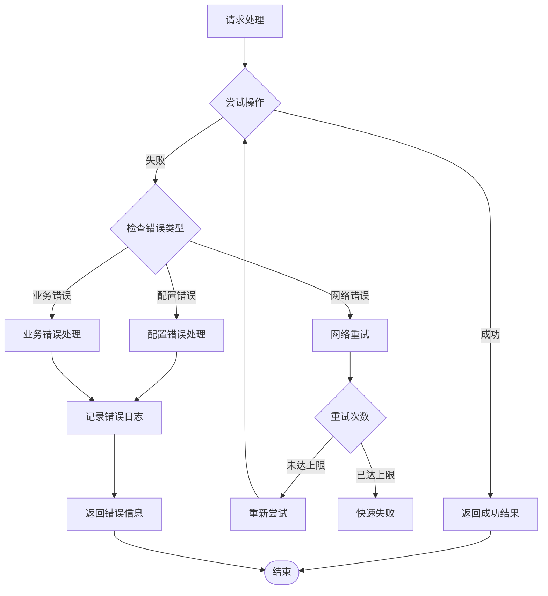
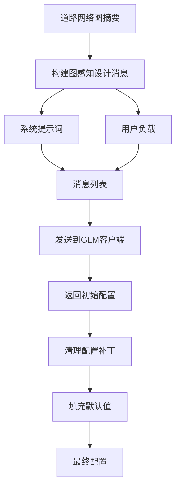
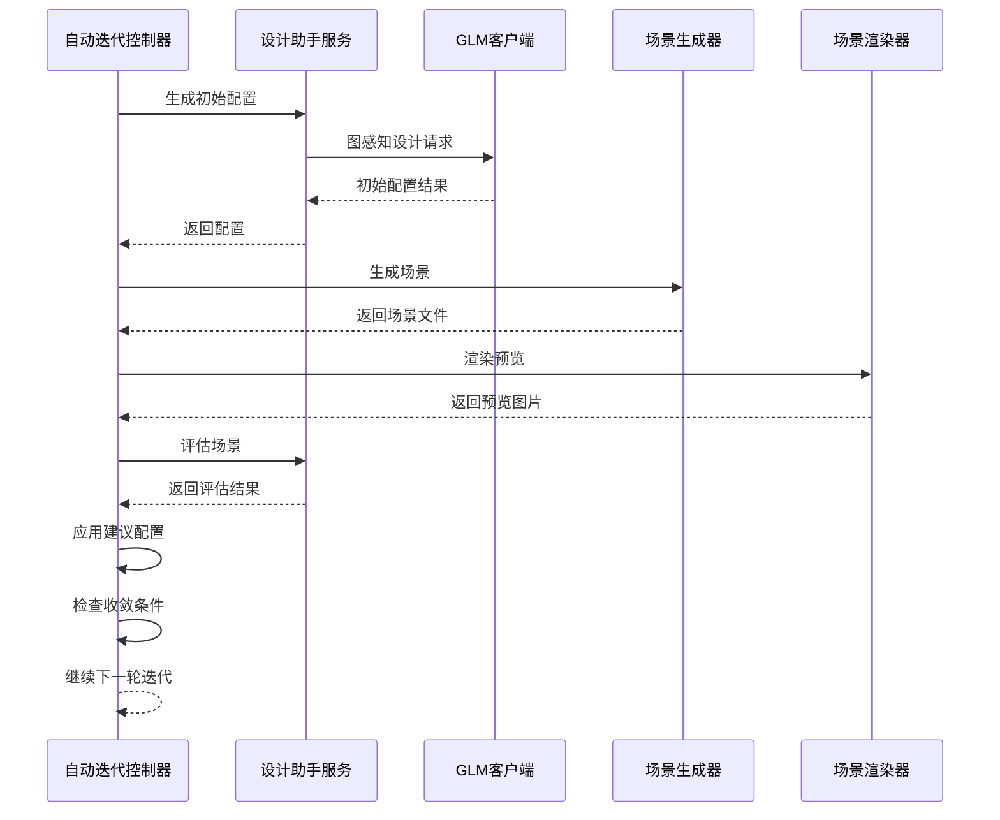
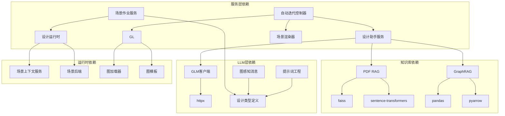

# LLM集成系统

<cite>
**本文档引用的文件**
- [design_workflow.py](file://src/roadgen3d/llm/design_workflow.py)
- [glm_client.py](file://src/roadgen3d/llm/glm_client.py)
- [prompts.py](file://src/roadgen3d/llm/prompts.py)
- [design_runtime.py](file://src/roadgen3d/services/design_runtime.py)
- [scene_context_service.py](file://src/roadgen3d/services/scene_context_service.py)
- [design_types.py](file://src/roadgen3d/services/design_types.py)
- [pdf_rag.py](file://src/roadgen3d/knowledge/pdf_rag.py)
- [graphrag.py](file://src/roadgen3d/knowledge/graphrag.py)
- [scene_jobs.py](file://src/roadgen3d/services/scene_jobs.py)
- [graph_loader.py](file://src/roadgen3d/auto_pipeline/graph_loader.py)
- [iteration_controller.py](file://src/roadgen3d/auto_pipeline/iteration_controller.py)
- [scene_renderer.py](file://src/roadgen3d/auto_pipeline/scene_renderer.py)
- [test_glm_client.py](file://tests/test_glm_client.py)
- [test_design_assistant_service.py](file://tests/test_design_assistant_service.py)
</cite>

## 更新摘要
**变更内容**
- 新增图感知设计功能，支持基于道路网络图结构的初始配置生成
- 增强设计工作流的初始配置生成功能
- 添加自动迭代控制器，实现生成→渲染→评估→改进的循环流程
- 扩展提示词工程系统，增加图感知设计消息构建器

## 目录
1. [简介](#简介)
2. [项目结构](#项目结构)
3. [核心组件](#核心组件)
4. [架构概览](#架构概览)
5. [详细组件分析](#详细组件分析)
6. [图感知设计功能](#图感知设计功能)
7. [自动迭代控制系统](#自动迭代控制系统)
8. [依赖关系分析](#依赖关系分析)
9. [性能考虑](#性能考虑)
10. [故障排除指南](#故障排除指南)
11. [结论](#结论)

## 简介

RoadGen3D的LLM集成系统是一个完整的街道设计助手平台，集成了大语言模型（LLM）和知识检索系统，为城市规划师和设计师提供智能化的街道设计方案生成能力。该系统通过GLM客户端与外部大语言模型进行交互，结合PDF RAG和GraphRAG知识库，实现了从用户需求到最终场景生成的完整工作流程。

**更新** 系统现已新增图感知设计功能，能够基于道路网络图结构和可选的参考底图自动生成初始设计参数，显著提升了设计工作的效率和质量。

系统的核心价值在于：
- **智能设计助手**：将自然语言设计需求转换为结构化的街道设计方案
- **多源知识融合**：整合官方设计指南和社区知识资源
- **自动化场景生成**：从设计草图自动生成3D街道场景
- **上下文感知**：支持多轮对话和历史上下文管理
- **图感知设计**：基于道路网络结构的智能初始配置生成
- **自动迭代优化**：实现设计参数的自动优化和改进

## 项目结构

RoadGen3D LLM集成系统采用模块化架构，主要分为以下几个核心层次：

**图表来源**
- [design_workflow.py:62-89](file://src/roadgen3d/llm/design_workflow.py#L62-L89)
- [glm_client.py:41-54](file://src/roadgen3d/llm/glm_client.py#L41-L54)
- [graph_loader.py:31-59](file://src/roadgen3d/auto_pipeline/graph_loader.py#L31-L59)
- [iteration_controller.py:48-84](file://src/roadgen3d/auto_pipeline/iteration_controller.py#L48-L84)

**章节来源**
- [design_workflow.py:1-800](file://src/roadgen3d/llm/design_workflow.py#L1-L800)
- [glm_client.py:1-149](file://src/roadgen3d/llm/glm_client.py#L1-L149)
- [graph_loader.py:1-167](file://src/roadgen3d/auto_pipeline/graph_loader.py#L1-L167)
- [iteration_controller.py:1-263](file://src/roadgen3d/auto_pipeline/iteration_controller.py#L1-L263)

## 核心组件

### 设计助手服务（DesignAssistantService）

设计助手服务是整个LLM集成系统的核心协调器，负责管理从用户输入到最终场景生成的完整流程。该服务提供了以下关键功能：

- **意图解析**：将用户的自然语言转换为结构化的设计意图
- **知识检索**：从多个知识源中检索相关的设计指导和规范
- **设计草图生成**：基于检索结果生成结构化的街道设计草图
- **图感知设计**：基于道路网络图结构生成初始设计参数
- **缓存管理**：实现智能缓存以提高响应速度
- **场景生成**：将设计草图转换为3D场景

**图表来源**
- [design_workflow.py:62-89](file://src/roadgen3d/llm/design_workflow.py#L62-L89)
- [glm_client.py:41-109](file://src/roadgen3d/llm/glm_client.py#L41-L109)
- [scene_jobs.py:42-80](file://src/roadgen3d/services/scene_jobs.py#L42-L80)
- [graph_loader.py:31-59](file://src/roadgen3d/auto_pipeline/graph_loader.py#L31-L59)

**章节来源**
- [design_workflow.py:14-149](file://src/roadgen3d/llm/design_workflow.py#L14-L149)
- [glm_client.py:14-149](file://src/roadgen3d/llm/glm_client.py#L14-L149)
- [graph_loader.py:1-167](file://src/roadgen3d/auto_pipeline/graph_loader.py#L1-L167)

### GLM客户端

GLM客户端是一个轻量级的OpenAI兼容客户端包装器，专门用于与GLM大语言模型进行交互。该客户端提供了以下核心功能：

- **环境配置**：自动从环境变量加载GLM配置
- **JSON模式**：支持结构化JSON输出的解析
- **错误处理**：提供详细的错误类型和异常处理
- **HTTP通信**：使用httpx进行高效的HTTP请求

**章节来源**
- [glm_client.py:14-149](file://src/roadgen3d/llm/glm_client.py#L14-L149)

### 提示词工程系统

提示词工程系统负责构建各种类型的提示词模板，确保LLM能够准确理解和执行设计任务。系统包含以下核心提示词模板：

- **设计意图提示词**：将自然语言转换为结构化设计意图
- **检索查询翻译提示词**：将中文查询翻译为英文检索查询
- **参数检索规划提示词**：为缺失参数生成检索查询
- **设计草图提示词**：生成结构化的街道设计草图
- **场景评价提示词**：对生成的场景进行质量评估
- **图感知设计提示词**：基于图结构生成初始设计参数

**章节来源**
- [prompts.py:11-265](file://src/roadgen3d/llm/prompts.py#L11-L265)

## 架构概览

RoadGen3D LLM集成系统采用分层架构设计，每层都有明确的职责和边界：

**图表来源**
- [design_workflow.py:112-239](file://src/roadgen3d/llm/design_workflow.py#L112-L239)
- [scene_jobs.py:115-136](file://src/roadgen3d/services/scene_jobs.py#L115-L136)

## 详细组件分析

### 设计工作流程

设计工作流程是系统的核心逻辑，负责协调各个组件完成完整的街道设计任务。该流程包含以下关键步骤：

#### 1. 缓存检查阶段
系统首先检查是否存在相同输入的缓存结果，避免重复计算：

**图表来源**
- [design_workflow.py:122-132](file://src/roadgen3d/llm/design_workflow.py#L122-L132)
- [design_workflow.py:135-154](file://src/roadgen3d/llm/design_workflow.py#L135-L154)

#### 2. 设计意图解析
系统使用专门的提示词模板将用户的自然语言转换为结构化的设计意图：

**章节来源**
- [design_workflow.py:112-239](file://src/roadgen3d/llm/design_workflow.py#L112-L239)

#### 3. 知识检索与融合
系统支持多种知识源的检索和融合：

**章节来源**
- [design_workflow.py:507-539](file://src/roadgen3d/llm/design_workflow.py#L507-L539)
- [design_workflow.py:486-505](file://src/roadgen3d/llm/design_workflow.py#L486-L505)

### 场景生成管道

场景生成管道负责将设计草图转换为最终的3D场景，包含以下关键组件：

**图表来源**
- [design_runtime.py:60-94](file://src/roadgen3d/services/design_runtime.py#L60-L94)
- [scene_context_service.py:279-331](file://src/roadgen3d/services/scene_context_service.py#L279-L331)

**章节来源**
- [design_runtime.py:336-397](file://src/roadgen3d/services/design_runtime.py#L336-L397)
- [scene_context_service.py:279-331](file://src/roadgen3d/services/scene_context_service.py#L279-L331)

### 错误处理与重试机制

系统实现了多层次的错误处理和重试机制：

**图表来源**
- [design_workflow.py:98-110](file://src/roadgen3d/llm/design_workflow.py#L98-L110)
- [glm_client.py:14-20](file://src/roadgen3d/llm/glm_client.py#L14-L20)

**章节来源**
- [design_workflow.py:98-110](file://src/roadgen3d/llm/design_workflow.py#L98-L110)
- [glm_client.py:14-20](file://src/roadgen3d/llm/glm_client.py#L14-L20)

## 图感知设计功能

**新增** 图感知设计功能是系统的重要增强，它允许LLM基于道路网络图结构和可选的参考底图来生成初始设计参数。

### 图感知设计消息构建

系统提供了专门的消息构建器来处理图感知设计请求：

**图表来源**
- [prompts.py:214-265](file://src/roadgen3d/llm/prompts.py#L214-L265)
- [graph_loader.py:118-167](file://src/roadgen3d/auto_pipeline/graph_loader.py#L118-L167)

### 图结构摘要提取

系统能够从导出的图JSON中提取关键的结构信息：

- **中心线数量**：道路中心线的数量
- **路宽统计**：所有道路的宽度分布
- **交叉口数量**：交叉口和节点的数量
- **建筑区域**：周边建筑区域的统计
- **横截面条带**：横截面定义的条带数量
- **图像参数**：图像宽度、高度和像素比例

**章节来源**
- [graph_loader.py:66-116](file://src/roadgen3d/auto_pipeline/graph_loader.py#L66-L116)
- [design_workflow.py:352-383](file://src/roadgen3d/llm/design_workflow.py#L352-L383)

## 自动迭代控制系统

**新增** 自动迭代控制系统实现了设计参数的自动优化流程，包含生成→渲染→评估→改进的循环。

### 迭代控制流程

**图表来源**
- [iteration_controller.py:89-225](file://src/roadgen3d/auto_pipeline/iteration_controller.py#L89-L225)

### 迭代优化策略

系统实现了智能的迭代优化策略：

- **评分跟踪**：持续跟踪最佳分数和迭代次数
- **早停机制**：连续两轮无改进时自动停止
- **配置补丁应用**：应用LLM建议的配置修改
- **多轮验证**：通过多次迭代逐步优化设计

**章节来源**
- [iteration_controller.py:89-225](file://src/roadgen3d/auto_pipeline/iteration_controller.py#L89-L225)

### 场景渲染功能

系统提供了专业的场景渲染功能，用于生成高质量的2D预览：

- **Matplotlib集成**：使用matplotlib进行专业渲染
- **颜色映射**：为不同类别分配特定颜色
- **比例尺标注**：自动添加比例尺和标签
- **图例生成**：动态生成图例显示场景元素

**章节来源**
- [scene_renderer.py:49-214](file://src/roadgen3d/auto_pipeline/scene_renderer.py#L49-L214)

## 依赖关系分析

系统采用松耦合的设计原则，各组件之间的依赖关系清晰明确：

**图表来源**
- [pdf_rag.py:21-26](file://src/roadgen3d/knowledge/pdf_rag.py#L21-L26)
- [graphrag.py:161-168](file://src/roadgen3d/knowledge/graphrag.py#L161-L168)
- [design_workflow.py:11-43](file://src/roadgen3d/llm/design_workflow.py#L11-L43)

**章节来源**
- [pdf_rag.py:21-26](file://src/roadgen3d/knowledge/pdf_rag.py#L21-L26)
- [graphrag.py:161-168](file://src/roadgen3d/knowledge/graphrag.py#L161-L168)

## 性能考虑

### 缓存策略

系统实现了多层次的缓存机制以提升性能：

1. **设计草图缓存**：缓存完整的草图生成结果
2. **检索结果缓存**：缓存知识库检索结果
3. **嵌入向量缓存**：缓存文本嵌入向量
4. **场景生成缓存**：缓存最终场景生成结果
5. **图感知配置缓存**：缓存图结构分析结果

### 并发控制

系统采用线程安全的设计确保并发访问的安全性：

- **场景作业队列**：使用线程安全的队列管理场景生成作业
- **条件变量**：使用条件变量协调生产者和消费者
- **锁机制**：使用互斥锁保护共享资源

### 优化技巧

1. **批量处理**：支持批量知识检索和场景生成
2. **异步处理**：场景生成采用异步处理模式
3. **内存管理**：合理管理内存使用，避免内存泄漏
4. **连接池**：复用HTTP连接减少开销
5. **迭代早停**：通过早停机制避免无效计算

**章节来源**
- [design_workflow.py:368-460](file://src/roadgen3d/llm/design_workflow.py#L368-L460)
- [scene_jobs.py:138-178](file://src/roadgen3d/services/scene_jobs.py#L138-L178)

## 故障排除指南

### 常见问题及解决方案

#### 1. GLM配置错误
**症状**：初始化GLM客户端时抛出配置错误异常
**原因**：缺少必要的环境变量或配置不正确
**解决方案**：
- 检查`glm_base_url`和`key`环境变量
- 验证GLM服务端点的有效性
- 确认API密钥的正确性和权限

#### 2. 知识库构建失败
**症状**：PDF知识库构建过程中出现错误
**原因**：PDF文件损坏或缺少必要的依赖库
**解决方案**：
- 安装`pypdf`或`PyPDF2`库
- 检查PDF文件的完整性和可读性
- 确认磁盘空间充足

#### 3. GraphRAG运行时错误
**症状**：GraphRAG搜索功能不可用
**原因**：缺少GraphRAG运行时依赖或配置文件
**解决方案**：
- 安装`pandas`和`pyarrow`库
- 检查GraphRAG项目目录结构
- 验证`settings.yaml`配置文件

#### 4. 场景生成超时
**症状**：场景生成作业长时间无响应
**原因**：资源不足或生成过程复杂度过高
**解决方案**：
- 增加系统内存和CPU资源
- 调整生成参数减少复杂度
- 检查磁盘空间是否充足

#### 5. 图感知设计失败
**症状**：图感知设计功能无法正常工作
**原因**：图JSON格式不正确或缺少必要字段
**解决方案**：
- 验证图JSON文件的完整性和格式
- 检查图结构摘要的提取是否成功
- 确认GLM客户端能够正确处理图消息

**章节来源**
- [test_glm_client.py:18-47](file://tests/test_glm_client.py#L18-L47)
- [test_design_assistant_service.py:263-353](file://tests/test_design_assistant_service.py#L263-L353)

## 结论

RoadGen3D LLM集成系统通过精心设计的架构和完善的组件实现了智能化的街道设计辅助功能。系统的主要优势包括：

1. **模块化设计**：清晰的组件分离和职责划分
2. **多源知识融合**：整合多种知识源提供全面的设计指导
3. **智能缓存机制**：显著提升系统响应速度
4. **健壮的错误处理**：提供完善的错误处理和恢复机制
5. **可扩展性**：支持与其他大语言模型的集成
6. **图感知设计**：基于道路网络结构的智能初始配置生成
7. **自动迭代优化**：实现设计参数的自动优化和改进

**更新** 新增的图感知设计功能和自动迭代控制系统显著提升了系统的设计能力和效率，使设计师能够更快地生成高质量的街道设计方案。通过AI驱动的设计辅助工具，系统为城市规划和设计领域提供了强大的技术支持。

随着技术的不断发展，系统还可以进一步扩展以支持更多的设计场景和更复杂的AI模型集成，为未来的智能城市设计提供更加完善的技术支撑。