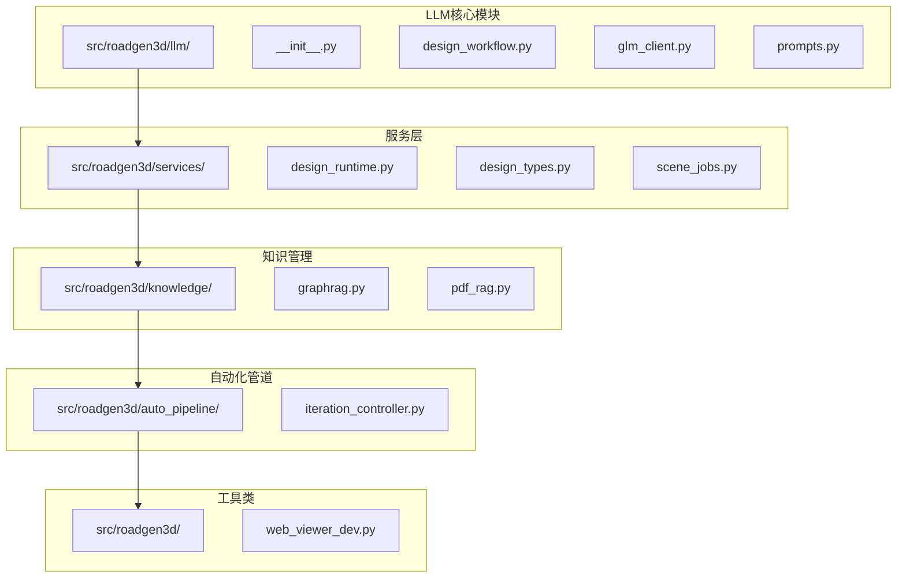
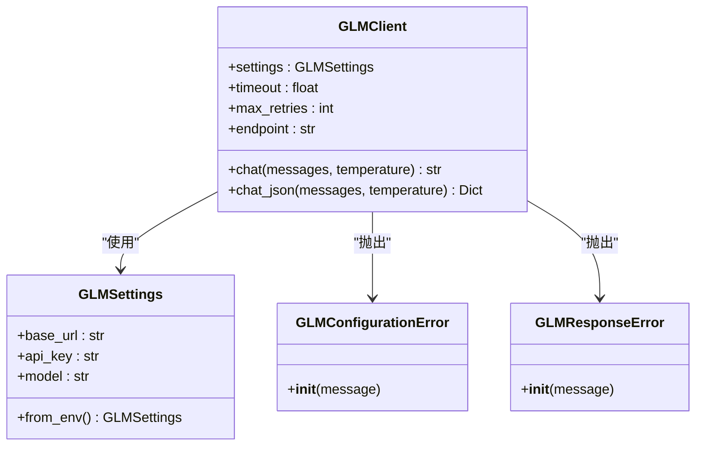
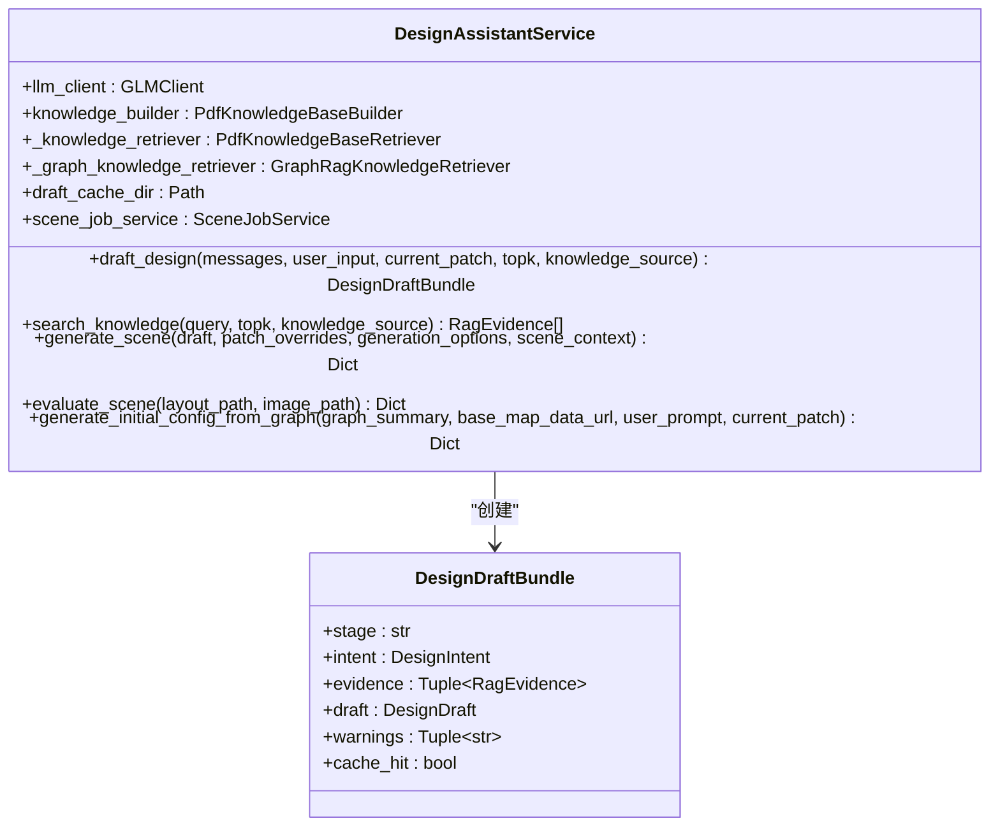
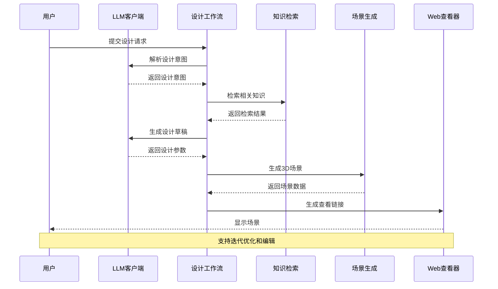
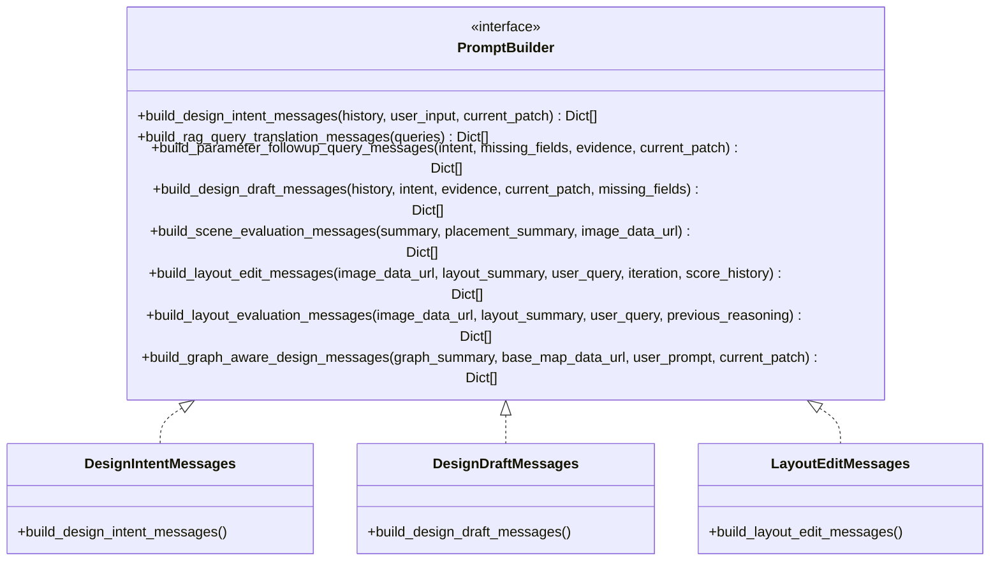
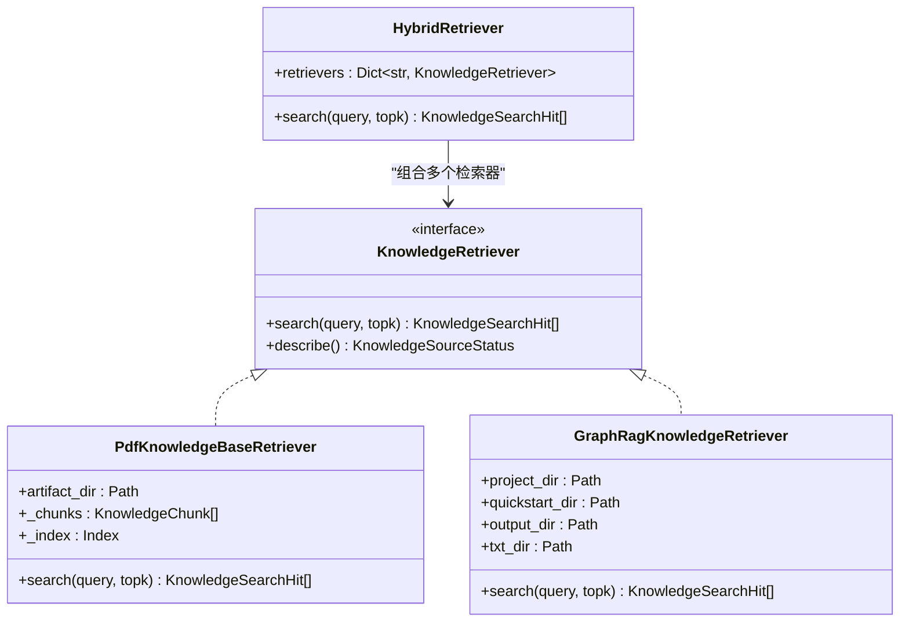
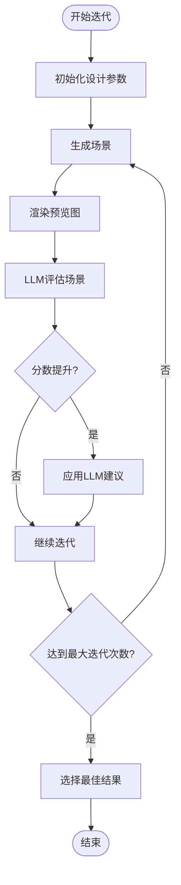
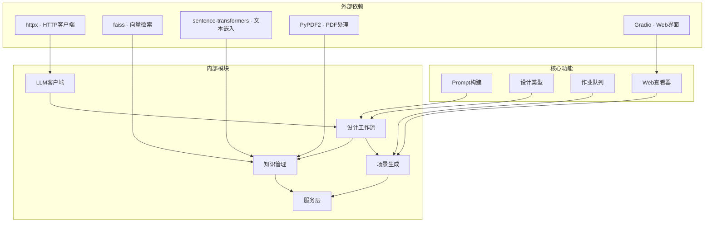

# LLM场景编辑集成

<cite>
**本文档引用的文件**
- [src/roadgen3d/llm/__init__.py](file://src/roadgen3d/llm/__init__.py)
- [src/roadgen3d/llm/design_workflow.py](file://src/roadgen3d/llm/design_workflow.py)
- [src/roadgen3d/llm/glm_client.py](file://src/roadgen3d/llm/glm_client.py)
- [src/roadgen3d/llm/prompts.py](file://src/roadgen3d/llm/prompts.py)
- [src/roadgen3d/services/design_runtime.py](file://src/roadgen3d/services/design_runtime.py)
- [src/roadgen3d/services/design_types.py](file://src/roadgen3d/services/design_types.py)
- [src/roadgen3d/services/scene_jobs.py](file://src/roadgen3d/services/scene_jobs.py)
- [src/roadgen3d/knowledge/graphrag.py](file://src/roadgen3d/knowledge/graphrag.py)
- [src/roadgen3d/knowledge/pdf_rag.py](file://src/roadgen3d/knowledge/pdf_rag.py)
- [src/roadgen3d/auto_pipeline/iteration_controller.py](file://src/roadgen3d/auto_pipeline/iteration_controller.py)
- [src/roadgen3d/web_viewer_dev.py](file://src/roadgen3d/web_viewer_dev.py)
- [tests/test_design_assistant_service.py](file://tests/test_design_assistant_service.py)
- [tests/test_glm_client.py](file://tests/test_glm_client.py)
</cite>

## 目录
1. [简介](#简介)
2. [项目结构](#项目结构)
3. [核心组件](#核心组件)
4. [架构概览](#架构概览)
5. [详细组件分析](#详细组件分析)
6. [依赖关系分析](#依赖关系分析)
7. [性能考虑](#性能考虑)
8. [故障排除指南](#故障排除指南)
9. [结论](#结论)

## 简介

RoadGen3D项目中的LLM场景编辑集成是一个强大的人工智能驱动的城市街道设计系统。该系统结合了大型语言模型（LLM）、知识检索和自动化场景生成技术，为城市规划师和设计师提供了一个智能化的街道设计工作台。

该集成的核心功能包括：
- **智能设计意图解析**：通过LLM理解用户的设计需求和偏好
- **多源知识检索**：整合PDF文档和GraphRAG知识库
- **自动化场景生成**：基于设计参数自动生成3D街道场景
- **迭代优化循环**：通过LLM评估和改进设计
- **可视化编辑**：提供Web查看器进行场景浏览和编辑

## 项目结构

LLM场景编辑集成主要分布在以下目录结构中：

**图表来源**
- [src/roadgen3d/llm/__init__.py:1-29](file://src/roadgen3d/llm/__init__.py#L1-L29)
- [src/roadgen3d/services/design_runtime.py:1-460](file://src/roadgen3d/services/design_runtime.py#L1-L460)
- [src/roadgen3d/knowledge/graphrag.py:1-800](file://src/roadgen3d/knowledge/graphrag.py#L1-L800)

**章节来源**
- [src/roadgen3d/llm/__init__.py:1-29](file://src/roadgen3d/llm/__init__.py#L1-L29)
- [src/roadgen3d/services/design_runtime.py:1-460](file://src/roadgen3d/services/design_runtime.py#L1-L460)

## 核心组件

### LLM客户端系统

LLM客户端系统提供了统一的接口来访问各种OpenAI兼容的LLM服务：

**图表来源**
- [src/roadgen3d/llm/glm_client.py:65-216](file://src/roadgen3d/llm/glm_client.py#L65-L216)

### 设计工作流服务

设计工作流服务是整个LLM集成的核心协调器：

**图表来源**
- [src/roadgen3d/llm/design_workflow.py:63-400](file://src/roadgen3d/llm/design_workflow.py#L63-L400)

**章节来源**
- [src/roadgen3d/llm/glm_client.py:1-216](file://src/roadgen3d/llm/glm_client.py#L1-L216)
- [src/roadgen3d/llm/design_workflow.py:1-905](file://src/roadgen3d/llm/design_workflow.py#L1-L905)

## 架构概览

LLM场景编辑集成采用分层架构设计，实现了从用户输入到最终场景生成的完整流程：

**图表来源**
- [src/roadgen3d/llm/design_workflow.py:113-240](file://src/roadgen3d/llm/design_workflow.py#L113-L240)
- [src/roadgen3d/services/design_runtime.py:336-396](file://src/roadgen3d/services/design_runtime.py#L336-L396)

## 详细组件分析

### Prompt构建系统

Prompt构建系统为不同的LLM任务提供了专门的提示模板：

**图表来源**
- [src/roadgen3d/llm/prompts.py:11-408](file://src/roadgen3d/llm/prompts.py#L11-L408)

### 知识检索系统

知识检索系统支持多种检索模式，包括PDF文档检索和GraphRAG知识图谱检索：

**图表来源**
- [src/roadgen3d/knowledge/pdf_rag.py:344-446](file://src/roadgen3d/knowledge/pdf_rag.py#L344-L446)
- [src/roadgen3d/knowledge/graphrag.py:230-423](file://src/roadgen3d/knowledge/graphrag.py#L230-L423)

### 自动化迭代控制器

自动化迭代控制器实现了完整的生成-评估-改进循环：

**图表来源**
- [src/roadgen3d/auto_pipeline/iteration_controller.py:89-225](file://src/roadgen3d/auto_pipeline/iteration_controller.py#L89-L225)

**章节来源**
- [src/roadgen3d/llm/prompts.py:1-408](file://src/roadgen3d/llm/prompts.py#L1-L408)
- [src/roadgen3d/knowledge/pdf_rag.py:1-446](file://src/roadgen3d/knowledge/pdf_rag.py#L1-L446)
- [src/roadgen3d/knowledge/graphrag.py:1-800](file://src/roadgen3d/knowledge/graphrag.py#L1-L800)
- [src/roadgen3d/auto_pipeline/iteration_controller.py:1-263](file://src/roadgen3d/auto_pipeline/iteration_controller.py#L1-L263)

## 依赖关系分析

LLM场景编辑集成的依赖关系展现了清晰的分层架构：

**图表来源**
- [src/roadgen3d/llm/glm_client.py:19-216](file://src/roadgen3d/llm/glm_client.py#L19-L216)
- [src/roadgen3d/knowledge/pdf_rag.py:21-446](file://src/roadgen3d/knowledge/pdf_rag.py#L21-L446)

**章节来源**
- [src/roadgen3d/services/design_types.py:1-382](file://src/roadgen3d/services/design_types.py#L1-L382)
- [src/roadgen3d/services/scene_jobs.py:1-205](file://src/roadgen3d/services/scene_jobs.py#L1-L205)

## 性能考虑

LLM场景编辑集成为确保良好的用户体验，在性能方面采用了多项优化策略：

### 缓存机制
- **设计草稿缓存**：避免重复的LLM调用和RAG检索
- **知识检索缓存**：减少重复的向量搜索操作
- **场景布局缓存**：加速Web查看器的场景加载

### 异步处理
- **后台作业队列**：支持并发的场景生成任务
- **非阻塞API调用**：避免UI冻结
- **批量处理**：优化大量场景的生成效率

### 内存管理
- **流式处理**：避免大文件的内存占用
- **增量更新**：只处理必要的数据变更
- **资源清理**：及时释放不再使用的对象

## 故障排除指南

### 常见问题及解决方案

#### LLM配置错误
**问题**：GLM客户端无法连接到LLM服务
**原因**：环境变量配置不正确或网络连接问题
**解决方案**：
1. 检查GRAPHRAG_API_BASE和GRAPHRAG_API_KEY环境变量
2. 验证API密钥的有效性
3. 确认网络连接正常

#### 知识检索失败
**问题**：PDF知识库或GraphRAG检索无法正常工作
**原因**：文件路径错误或依赖库未安装
**解决方案**：
1. 检查PDF文件路径是否正确
2. 确认faiss和sentence-transformers已正确安装
3. 验证GraphRAG项目目录结构完整

#### 场景生成异常
**问题**：场景生成过程中出现错误
**原因**：内存不足或GPU驱动问题
**解决方案**：
1. 检查系统内存使用情况
2. 确认GPU驱动版本兼容性
3. 调整场景复杂度参数

**章节来源**
- [tests/test_glm_client.py:1-48](file://tests/test_glm_client.py#L1-L48)
- [tests/test_design_assistant_service.py:1-353](file://tests/test_design_assistant_service.py#L1-L353)

## 结论

RoadGen3D项目的LLM场景编辑集成为城市街道设计提供了一个强大而灵活的智能化平台。通过将LLM技术、知识检索和自动化场景生成有机结合，该系统能够：

1. **提高设计效率**：通过AI辅助快速生成和优化设计方案
2. **保证设计质量**：基于权威设计指南和最佳实践
3. **增强用户体验**：提供直观的可视化编辑和实时反馈
4. **支持创新设计**：鼓励探索新的设计理念和方案

该系统的模块化设计和清晰的分层架构为未来的功能扩展和技术升级奠定了坚实基础。随着AI技术和城市规划理论的不断发展，这个集成系统将继续演进，为智慧城市建设贡献更大的价值。