# UI组件库

<cite>
**本文档引用的文件**
- [web/workbench/src/app.ts](file://web/workbench/src/app.ts)
- [web/workbench/src/main.ts](file://web/workbench/src/main.ts)
- [web/workbench/src/types.ts](file://web/workbench/src/types.ts)
- [web/workbench/src/utils.ts](file://web/workbench/src/utils.ts)
- [web/workbench/src/style.css](file://web/workbench/src/style.css)
- [web/viewer/src/app.ts](file://web/viewer/src/app.ts)
- [web/viewer/src/main.ts](file://web/viewer/src/main.ts)
- [web/viewer/src/style.css](file://web/viewer/src/style.css)
- [web/viewer/src/scene-graph.ts](file://web/viewer/src/scene-graph.ts)
- [web/viewer/src/asset-editor.ts](file://web/viewer/src/asset-editor.ts)
- [web/viewer/package.json](file://web/viewer/package.json)
</cite>

## 目录
1. [简介](#简介)
2. [项目结构](#项目结构)
3. [核心组件](#核心组件)
4. [架构总览](#架构总览)
5. [详细组件分析](#详细组件分析)
6. [依赖分析](#依赖分析)
7. [性能考虑](#性能考虑)
8. [故障排除指南](#故障排除指南)
9. [结论](#结论)
10. [附录](#附录)

## 简介
本文件为 RoadGen3D UI 组件库的详细技术文档，涵盖工作台（Workbench）与查看器（Viewer）两大前端应用的组件架构、类型定义、接口规范、组件分类、通信机制、状态共享、事件传递、复用策略、扩展模式、自定义开发指南、样式系统与主题定制、响应式设计、组件测试方法、文档生成与版本管理策略。文档面向开发者与高级用户，既提供高层概览也包含代码级细节与可视化图示。

## 项目结构
RoadGen3D 的 UI 层由两个独立的前端应用组成：
- 工作台（Workbench）：负责对话、RAG、参数确认与任务触发，采用模块化组件与状态管理，通过 API 与后端交互。
- 查看器（Viewer）：负责 3D 场景浏览、场景图编辑与资产编辑，基于 Three.js 实现渲染与交互。

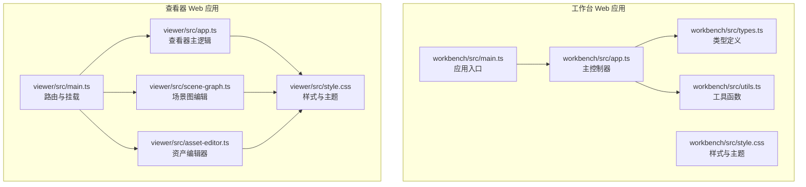

**图表来源**
- [web/workbench/src/main.ts:1-12](file://web/workbench/src/main.ts#L1-L12)
- [web/workbench/src/app.ts:1-12](file://web/workbench/src/app.ts#L1-L12)
- [web/workbench/src/types.ts:1-228](file://web/workbench/src/types.ts#L1-L228)
- [web/workbench/src/utils.ts:1-245](file://web/workbench/src/utils.ts#L1-L245)
- [web/workbench/src/style.css:1-490](file://web/workbench/src/style.css#L1-L490)
- [web/viewer/src/main.ts:1-61](file://web/viewer/src/main.ts#L1-L61)
- [web/viewer/src/app.ts:1-800](file://web/viewer/src/app.ts#L1-L800)
- [web/viewer/src/scene-graph.ts:1-800](file://web/viewer/src/scene-graph.ts#L1-L800)
- [web/viewer/src/asset-editor.ts:1-800](file://web/viewer/src/asset-editor.ts#L1-L800)
- [web/viewer/src/style.css:1-800](file://web/viewer/src/style.css#L1-L800)

**章节来源**
- [web/workbench/src/main.ts:1-12](file://web/workbench/src/main.ts#L1-L12)
- [web/workbench/src/app.ts:1-12](file://web/workbench/src/app.ts#L1-L12)
- [web/viewer/src/main.ts:1-61](file://web/viewer/src/main.ts#L1-L61)
- [web/viewer/src/app.ts:1-800](file://web/viewer/src/app.ts#L1-L800)

## 核心组件
本节概述两类应用的核心组件与职责：

- 工作台组件
  - 对话面板：展示消息历史、支持意图澄清与 RAG 证据呈现。
  - 场景设置面板：布局模式选择、城市与参考计划、AOI 区域等。
  - 知识搜索面板：查询 PDF/GraphRAG 等知识源，展示证据卡片。
  - 设计草案面板：参数表单、参数来源标注、摘要展示。
  - 任务面板：场景作业状态轮询、结果展示与链接。

- 查看器组件
  - 场景控制器：相机控制、光照预设、最小地图、信息卡片。
  - 属性面板：实例/静态对象属性、指标展示、复制文本。
  - 工具栏：场景切换、设置面板开关、帮助信息。
  - 场景图编辑器：参考注释解析、交叉断面建模、标注与布局。
  - 资产编辑器：网格浏览、缩放旋转、线框/实体渲染、批量操作。

**章节来源**
- [web/workbench/src/app.ts:58-288](file://web/workbench/src/app.ts#L58-L288)
- [web/viewer/src/app.ts:1-800](file://web/viewer/src/app.ts#L1-L800)
- [web/viewer/src/scene-graph.ts:1-800](file://web/viewer/src/scene-graph.ts#L1-L800)
- [web/viewer/src/asset-editor.ts:1-800](file://web/viewer/src/asset-editor.ts#L1-L800)

## 架构总览
工作台与查看器通过统一的 API 基础地址进行通信，工作台负责生成与调度，查看器负责浏览与编辑。两者均采用模块化结构，类型定义集中管理，样式通过 CSS 变量实现主题化与响应式适配。

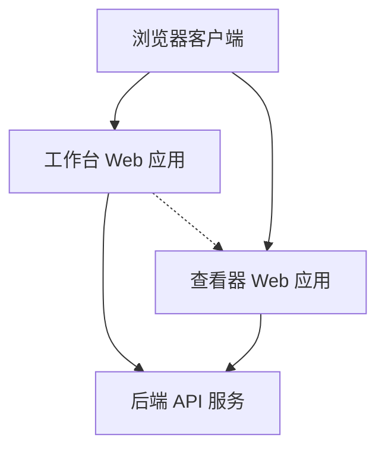

**图表来源**
- [web/workbench/src/types.ts:186-189](file://web/workbench/src/types.ts#L186-L189)
- [web/viewer/src/app.ts:521-532](file://web/viewer/src/app.ts#L521-L532)

**章节来源**
- [web/workbench/src/types.ts:186-189](file://web/workbench/src/types.ts#L186-L189)
- [web/viewer/src/app.ts:521-532](file://web/viewer/src/app.ts#L521-L532)

## 详细组件分析

### 工作台组件分析
工作台采用模块化架构，主控制器负责状态管理、面板渲染与 API 调用，类型定义集中于 types.ts，工具函数封装通用逻辑，样式通过 CSS 变量与响应式断点实现主题化。

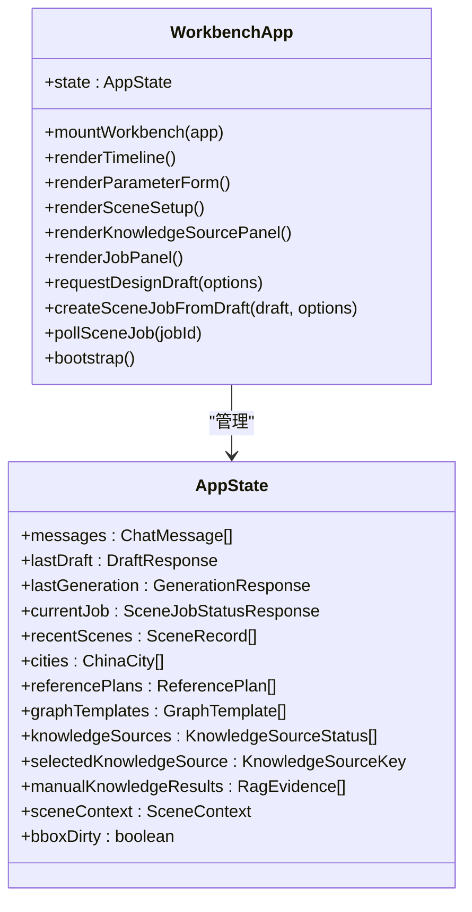

**图表来源**
- [web/workbench/src/app.ts:58-83](file://web/workbench/src/app.ts#L58-L83)
- [web/workbench/src/types.ts:3-175](file://web/workbench/src/types.ts#L3-L175)

**章节来源**
- [web/workbench/src/app.ts:58-83](file://web/workbench/src/app.ts#L58-L83)
- [web/workbench/src/types.ts:3-175](file://web/workbench/src/types.ts#L3-L175)

#### API 流程（设计草案生成）
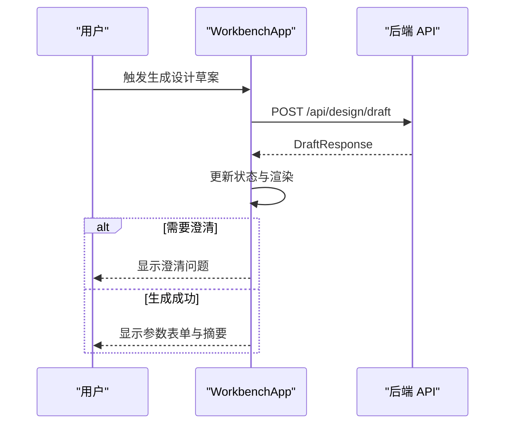

**图表来源**
- [web/workbench/src/app.ts:412-482](file://web/workbench/src/app.ts#L412-L482)
- [web/workbench/src/types.ts:95-102](file://web/workbench/src/types.ts#L95-L102)

**章节来源**
- [web/workbench/src/app.ts:412-482](file://web/workbench/src/app.ts#L412-L482)
- [web/workbench/src/types.ts:95-102](file://web/workbench/src/types.ts#L95-L102)

#### 参数表单构建流程
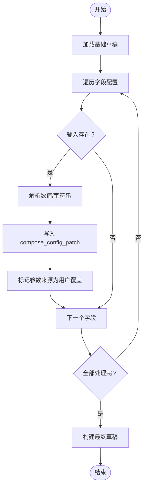

**图表来源**
- [web/workbench/src/utils.ts:154-182](file://web/workbench/src/utils.ts#L154-L182)
- [web/workbench/src/types.ts:207-227](file://web/workbench/src/types.ts#L207-L227)

**章节来源**
- [web/workbench/src/utils.ts:154-182](file://web/workbench/src/utils.ts#L154-L182)
- [web/workbench/src/types.ts:207-227](file://web/workbench/src/types.ts#L207-L227)

### 查看器组件分析
查看器采用多页面路由，支持查看器、场景图编辑器与资产编辑器三类视图，基于 Three.js 实现 3D 渲染与交互。

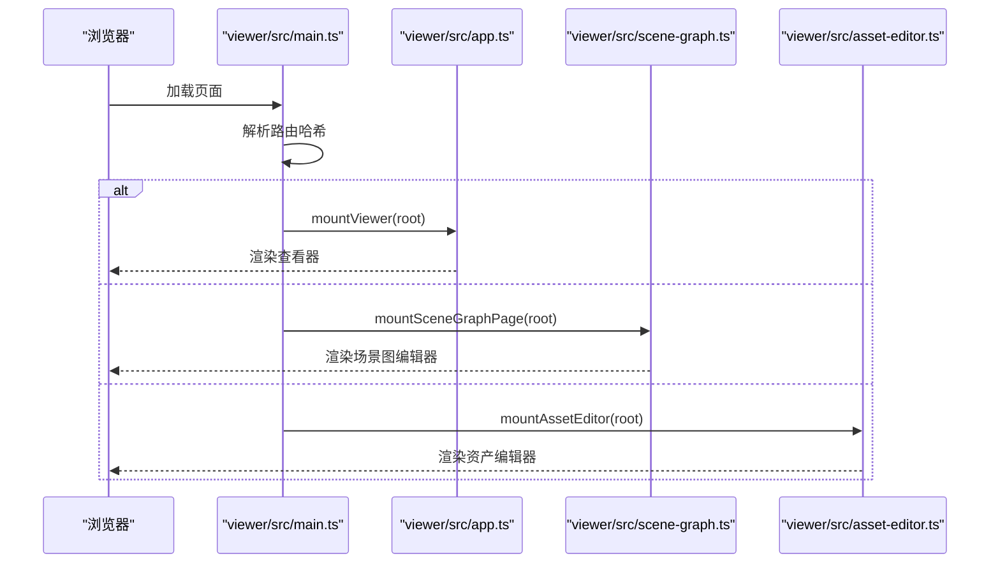

**图表来源**
- [web/viewer/src/main.ts:21-61](file://web/viewer/src/main.ts#L21-L61)
- [web/viewer/src/app.ts:1-800](file://web/viewer/src/app.ts#L1-L800)
- [web/viewer/src/scene-graph.ts:1-800](file://web/viewer/src/scene-graph.ts#L1-L800)
- [web/viewer/src/asset-editor.ts:1-800](file://web/viewer/src/asset-editor.ts#L1-L800)

**章节来源**
- [web/viewer/src/main.ts:21-61](file://web/viewer/src/main.ts#L21-L61)
- [web/viewer/src/app.ts:1-800](file://web/viewer/src/app.ts#L1-L800)

#### 场景控制器与属性面板
查看器提供相机控制、光照预设、最小地图与信息卡片，支持实例与静态对象的属性展示与复制文本功能。

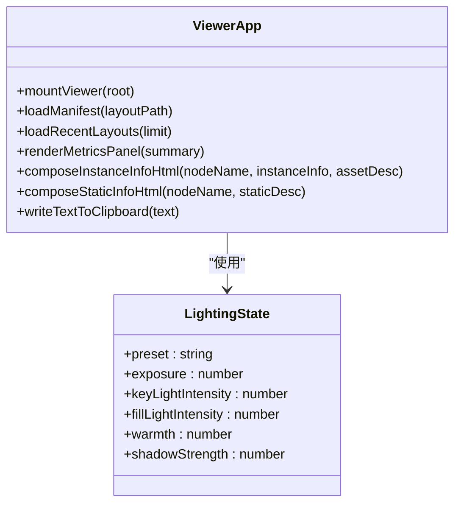

**图表来源**
- [web/viewer/src/app.ts:1-800](file://web/viewer/src/app.ts#L1-L800)

**章节来源**
- [web/viewer/src/app.ts:1-800](file://web/viewer/src/app.ts#L1-L800)

#### 场景图编辑器（Scene Graph Editor）
场景图编辑器负责参考注释解析、交叉断面建模、标注与布局，提供标准化的数据规范化与几何计算工具。

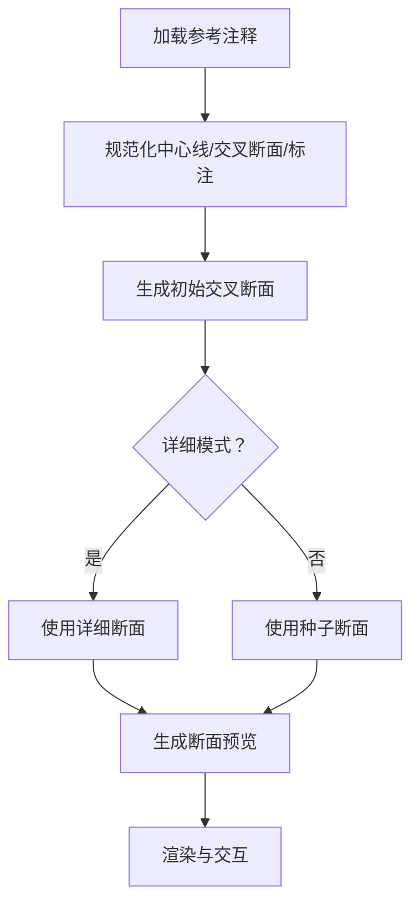

**图表来源**
- [web/viewer/src/scene-graph.ts:386-397](file://web/viewer/src/scene-graph.ts#L386-L397)
- [web/viewer/src/scene-graph.ts:538-589](file://web/viewer/src/scene-graph.ts#L538-L589)

**章节来源**
- [web/viewer/src/scene-graph.ts:386-397](file://web/viewer/src/scene-graph.ts#L386-L397)
- [web/viewer/src/scene-graph.ts:538-589](file://web/viewer/src/scene-graph.ts#L538-L589)

#### 资产编辑器（Asset Editor）
资产编辑器提供网格浏览、缩放旋转、线框/实体渲染、批量删除与导出功能，支持选择框与高亮提示。

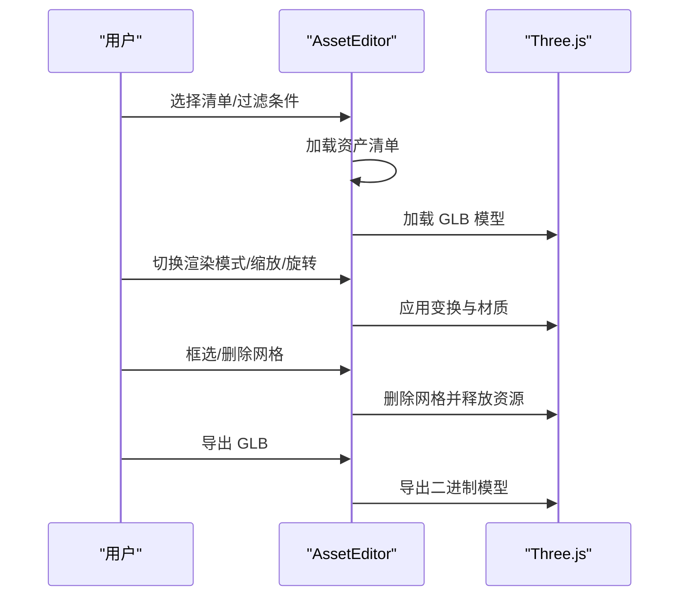

**图表来源**
- [web/viewer/src/asset-editor.ts:397-447](file://web/viewer/src/asset-editor.ts#L397-L447)
- [web/viewer/src/asset-editor.ts:661-694](file://web/viewer/src/asset-editor.ts#L661-L694)

**章节来源**
- [web/viewer/src/asset-editor.ts:397-447](file://web/viewer/src/asset-editor.ts#L397-L447)
- [web/viewer/src/asset-editor.ts:661-694](file://web/viewer/src/asset-editor.ts#L661-L694)

### 组件间通信机制、状态共享与事件传递
- 工作台内部通信：主控制器通过状态对象集中管理消息、草案、作业与知识源状态，事件绑定在 DOM 元素上，异步调用 API 并更新 UI。
- 查看器内部通信：路由驱动页面切换，各页面模块各自维护状态与生命周期，通过全局常量与工具函数共享配置。
- 跨应用通信：工作台通过 API 将生成任务与结果传递给查看器，查看器通过查询参数加载指定布局。

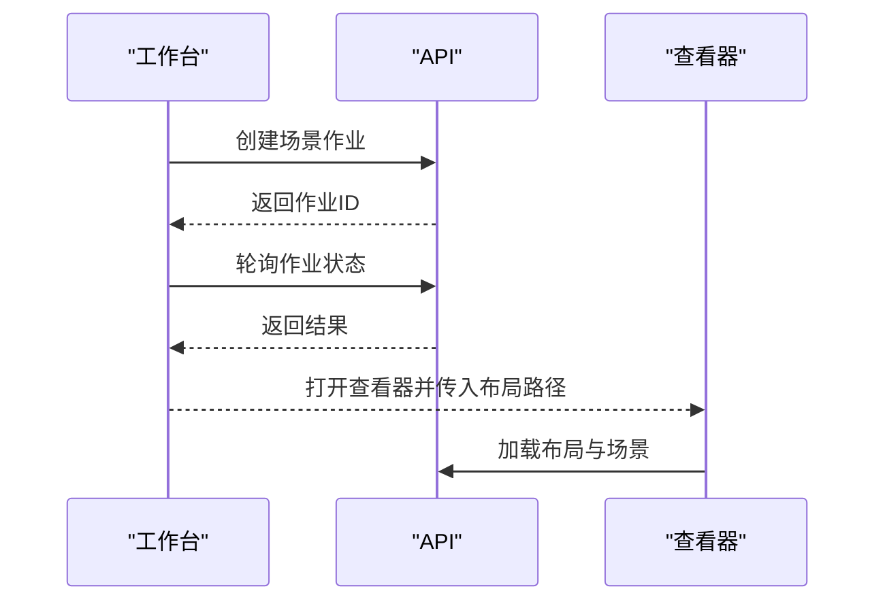

**图表来源**
- [web/workbench/src/app.ts:484-522](file://web/workbench/src/app.ts#L484-L522)
- [web/workbench/src/app.ts:709-729](file://web/workbench/src/app.ts#L709-L729)
- [web/viewer/src/app.ts:521-532](file://web/viewer/src/app.ts#L521-L532)

**章节来源**
- [web/workbench/src/app.ts:484-522](file://web/workbench/src/app.ts#L484-L522)
- [web/workbench/src/app.ts:709-729](file://web/workbench/src/app.ts#L709-L729)
- [web/viewer/src/app.ts:521-532](file://web/viewer/src/app.ts#L521-L532)

### 组件复用策略、扩展模式与自定义开发指南
- 复用策略
  - 类型定义集中管理：所有跨模块共享的类型与常量集中在 types.ts，确保一致性。
  - 工具函数模块化：utils.ts 提供通用格式化、校验与 API 辅助函数，便于复用。
  - 样式变量化：CSS 变量统一主题色与半径、阴影等，便于主题定制与响应式适配。
- 扩展模式
  - 新增面板：遵循现有面板结构（头部/主体），注册事件监听与渲染函数。
  - 新增路由：在 main.ts 中新增路由分支与挂载函数，保持模块解耦。
  - 新增工具：在对应模块的工具文件中添加函数，并在需要处导入使用。
- 自定义开发
  - 主题定制：修改 CSS 变量值即可调整整体风格；响应式断点可在样式文件中扩展。
  - 功能增强：在现有 API 调用基础上增加新字段与交互，注意与后端协议保持一致。

**章节来源**
- [web/workbench/src/types.ts:186-227](file://web/workbench/src/types.ts#L186-L227)
- [web/workbench/src/utils.ts:1-245](file://web/workbench/src/utils.ts#L1-L245)
- [web/workbench/src/style.css:1-490](file://web/workbench/src/style.css#L1-L490)
- [web/viewer/src/main.ts:21-61](file://web/viewer/src/main.ts#L21-L61)

### 样式系统、主题定制与响应式设计
- 样式系统
  - 工作台：采用 CSS 变量定义主题色与阴影，容器网格布局，标签与按钮样式统一。
  - 查看器：采用 CSS 变量与滤镜背景，信息卡片、最小地图与工具栏布局清晰。
- 主题定制
  - 修改 :root 或 CSS 变量即可实现主题切换；颜色方案与圆角、阴影等可集中调整。
- 响应式设计
  - 工作台：在不同宽度下调整网格与按钮排列，保证内容可读性。
  - 查看器：针对小屏设备调整工具栏与信息面板尺寸与位置。

**章节来源**
- [web/workbench/src/style.css:1-490](file://web/workbench/src/style.css#L1-L490)
- [web/viewer/src/style.css:1-800](file://web/viewer/src/style.css#L1-L800)

### 组件测试方法、文档生成与版本管理策略
- 测试方法
  - 单元测试：针对工具函数（如格式化、校验、API 辅助）编写单元测试，验证边界条件与错误处理。
  - 集成测试：模拟工作流（设计草案生成 → 作业轮询 → 结果展示），验证组件协作。
  - 端到端测试：使用 Playwright 进行页面交互测试，覆盖主要用户路径。
- 文档生成
  - 使用 TypeScript 类型与 JSDoc 注释生成 API 文档，结合 VitePress 或类似工具输出静态文档。
  - 为关键组件与流程绘制 Mermaid 图，辅助文档说明。
- 版本管理策略
  - 语义化版本：查看器前端包版本在 package.json 中定义，遵循主版本/次版本/修订号。
  - 依赖锁定：使用 package-lock.json 或 yarn.lock 确保依赖一致性。
  - 构建脚本：dev/build/typecheck 等脚本统一管理开发与生产构建流程。

**章节来源**
- [web/viewer/package.json:1-20](file://web/viewer/package.json#L1-L20)

## 依赖分析
工作台与查看器均为独立前端应用，共享类型定义与工具函数，通过 API 与后端交互。

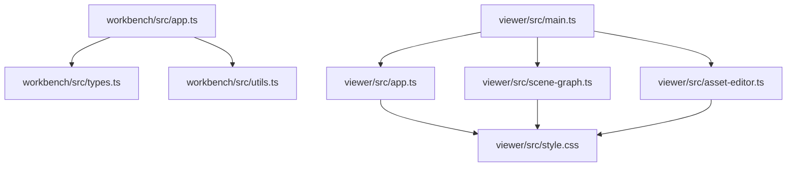

**图表来源**
- [web/workbench/src/app.ts:1-57](file://web/workbench/src/app.ts#L1-L57)
- [web/workbench/src/types.ts:1-36](file://web/workbench/src/types.ts#L1-L36)
- [web/workbench/src/utils.ts:1-56](file://web/workbench/src/utils.ts#L1-L56)
- [web/viewer/src/main.ts:1-6](file://web/viewer/src/main.ts#L1-L6)
- [web/viewer/src/app.ts:1-6](file://web/viewer/src/app.ts#L1-L6)
- [web/viewer/src/scene-graph.ts:1-49](file://web/viewer/src/scene-graph.ts#L1-L49)
- [web/viewer/src/asset-editor.ts:1-6](file://web/viewer/src/asset-editor.ts#L1-L6)

**章节来源**
- [web/workbench/src/app.ts:1-57](file://web/workbench/src/app.ts#L1-L57)
- [web/viewer/src/main.ts:1-6](file://web/viewer/src/main.ts#L1-L6)

## 性能考虑
- 渲染优化
  - 查看器使用 requestAnimationFrame 控制动画循环，避免过度重绘。
  - 模型加载后及时释放几何体与纹理资源，减少内存占用。
- 网络优化
  - 工作台采用轮询机制获取作业状态，合理设置轮询间隔以平衡实时性与性能。
  - 查看器按需加载布局与场景，避免一次性加载大量数据。
- 交互优化
  - 场景图编辑器与资产编辑器提供选择框与高亮反馈，提升交互效率。
  - 查看器最小地图与信息卡片采用透明背景与模糊效果，在保证可读性的同时降低视觉干扰。

[本节为通用指导，无需特定文件引用]

## 故障排除指南
- 启动与连接
  - 若工作台无法连接 API，检查 API 基础地址与网络连通性；工具函数提供格式化错误信息以便定位问题。
- 作业状态异常
  - 若作业长时间处于排队或运行状态，检查后端服务日志与作业队列；工作台提供状态提示与重试机制。
- 查看器加载失败
  - 若布局加载失败，检查布局路径与后端接口返回；查看器提供错误提示与回退链接。
- 资产编辑器问题
  - 若模型加载失败，检查 GLB 文件完整性与路径；提供错误提示并允许重新加载。

**章节来源**
- [web/workbench/src/utils.ts:20-29](file://web/workbench/src/utils.ts#L20-L29)
- [web/workbench/src/app.ts:524-581](file://web/workbench/src/app.ts#L524-L581)
- [web/viewer/src/app.ts:521-532](file://web/viewer/src/app.ts#L521-L532)
- [web/viewer/src/asset-editor.ts:401-446](file://web/viewer/src/asset-editor.ts#L401-L446)

## 结论
RoadGen3D UI 组件库通过清晰的模块划分与统一的类型定义，实现了工作台与查看器的高效协作。组件具备良好的可复用性与扩展性，配合主题化与响应式设计，能够满足多样化场景需求。建议在后续迭代中持续完善测试体系与文档生成流程，确保代码质量与可维护性。

[本节为总结性内容，无需特定文件引用]

## 附录
- 关键文件清单
  - 工作台入口与主控制器：[web/workbench/src/main.ts:1-12](file://web/workbench/src/main.ts#L1-L12)，[web/workbench/src/app.ts:1-12](file://web/workbench/src/app.ts#L1-L12)
  - 类型定义与常量：[web/workbench/src/types.ts:1-228](file://web/workbench/src/types.ts#L1-L228)
  - 工具函数：[web/workbench/src/utils.ts:1-245](file://web/workbench/src/utils.ts#L1-L245)
  - 样式文件：[web/workbench/src/style.css:1-490](file://web/workbench/src/style.css#L1-L490)
  - 查看器入口与主逻辑：[web/viewer/src/main.ts:1-61](file://web/viewer/src/main.ts#L1-L61)，[web/viewer/src/app.ts:1-800](file://web/viewer/src/app.ts#L1-L800)
  - 场景图编辑器：[web/viewer/src/scene-graph.ts:1-800](file://web/viewer/src/scene-graph.ts#L1-L800)
  - 资产编辑器：[web/viewer/src/asset-editor.ts:1-800](file://web/viewer/src/asset-editor.ts#L1-L800)
  - 查看器样式：[web/viewer/src/style.css:1-800](file://web/viewer/src/style.css#L1-L800)
  - 查看器依赖：[web/viewer/package.json:1-20](file://web/viewer/package.json#L1-L20)

[本节为附录性内容，无需特定文件引用]