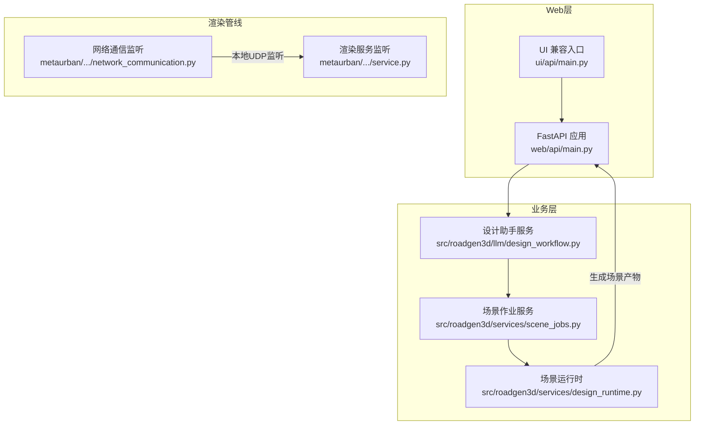
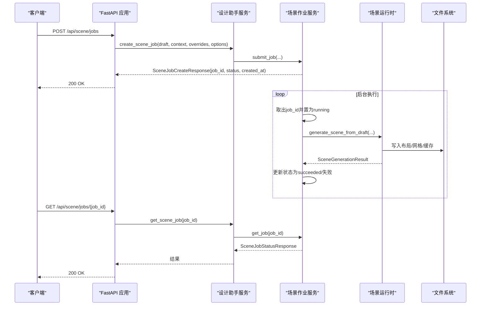
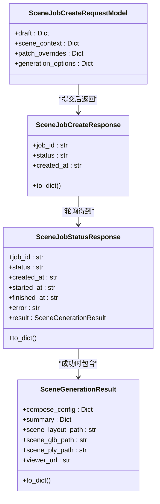
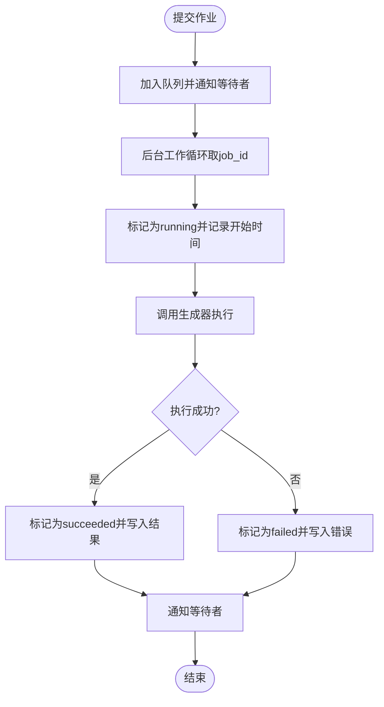
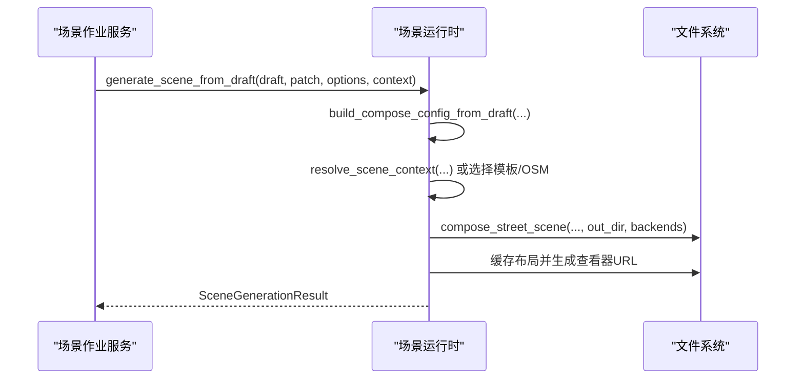
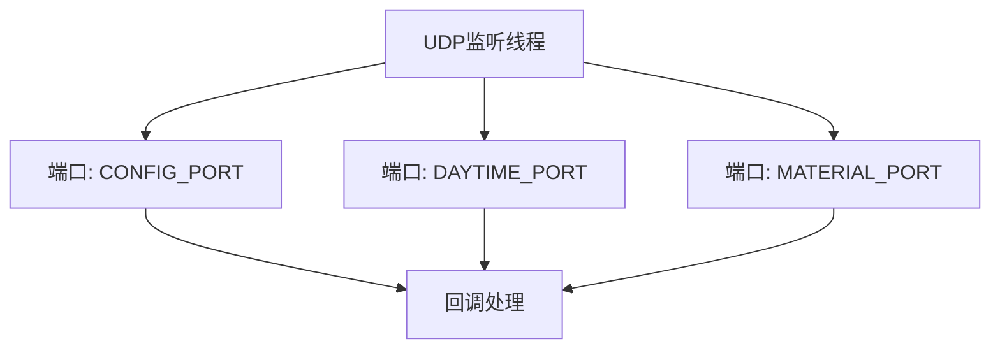
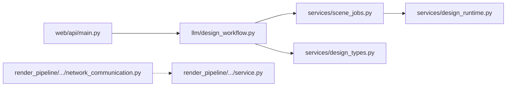

# WebSocket通信

<cite>
**本文档引用的文件**
- [web/api/main.py](file://web/api/main.py)
- [src/roadgen3d/services/scene_jobs.py](file://src/roadgen3d/services/scene_jobs.py)
- [src/roadgen3d/services/design_runtime.py](file://src/roadgen3d/services/design_runtime.py)
- [src/roadgen3d/services/design_types.py](file://src/roadgen3d/services/design_types.py)
- [src/roadgen3d/llm/design_workflow.py](file://src/roadgen3d/llm/design_workflow.py)
- [metaurban/metaurban/render_pipeline/rpcore/util/network_communication.py](file://metaurban/metaurban/render_pipeline/rpcore/util/network_communication.py)
- [metaurban/metaurban/render_pipeline/toolkit/render_service/service.py](file://metaurban/metaurban/render_pipeline/toolkit/render_service/service.py)
- [ui/api/main.py](file://ui/api/main.py)
</cite>

## 目录
1. [简介](#简介)
2. [项目结构](#项目结构)
3. [核心组件](#核心组件)
4. [架构总览](#架构总览)
5. [详细组件分析](#详细组件分析)
6. [依赖关系分析](#依赖关系分析)
7. [性能考虑](#性能考虑)
8. [故障排查指南](#故障排查指南)
9. [结论](#结论)
10. [附录](#附录)

## 简介
本文件面向RoadGen3D的实时通信与异步场景生成子系统，聚焦于基于HTTP/REST的作业提交与查询、后台任务队列、以及与渲染管线的本地通信通道。当前代码库未发现标准WebSocket实现；系统通过FastAPI提供REST接口进行作业提交与轮询，同时在渲染管线中使用UDP端口进行本地更新监听。本文档将围绕现有实现，给出可操作的架构说明、数据流图、消息格式规范、以及扩展建议。

## 项目结构
- Web API入口：提供REST接口，负责接收设计草稿、提交场景生成作业、查询作业状态、获取最近场景列表等。
- 场景作业服务：在单进程内维护一个后台工作线程，消费作业队列并执行生成逻辑。
- 设计运行时：封装从草稿到最终场景产物的完整流水线。
- 渲染管线本地通信：使用UDP端口监听配置、光照、材质等更新事件（用于渲染管线内部）。

**图表来源**
- [web/api/main.py:81-267](file://web/api/main.py#L81-L267)
- [src/roadgen3d/llm/design_workflow.py:62-310](file://src/roadgen3d/llm/design_workflow.py#L62-L310)
- [src/roadgen3d/services/scene_jobs.py:42-178](file://src/roadgen3d/services/scene_jobs.py#L42-L178)
- [src/roadgen3d/services/design_runtime.py:336-396](file://src/roadgen3d/services/design_runtime.py#L336-L396)
- [metaurban/metaurban/render_pipeline/rpcore/util/network_communication.py:33-91](file://metaurban/metaurban/render_pipeline/rpcore/util/network_communication.py#L33-L91)
- [metaurban/metaurban/render_pipeline/toolkit/render_service/service.py:106-126](file://metaurban/metaurban/render_pipeline/toolkit/render_service/service.py#L106-L126)

**章节来源**
- [web/api/main.py:81-267](file://web/api/main.py#L81-L267)
- [src/roadgen3d/llm/design_workflow.py:62-310](file://src/roadgen3d/llm/design_workflow.py#L62-L310)
- [src/roadgen3d/services/scene_jobs.py:42-178](file://src/roadgen3d/services/scene_jobs.py#L42-L178)
- [src/roadgen3d/services/design_runtime.py:336-396](file://src/roadgen3d/services/design_runtime.py#L336-L396)
- [metaurban/metaurban/render_pipeline/rpcore/util/network_communication.py:33-91](file://metaurban/metaurban/render_pipeline/rpcore/util/network_communication.py#L33-L91)
- [metaurban/metaurban/render_pipeline/toolkit/render_service/service.py:106-126](file://metaurban/metaurban/render_pipeline/toolkit/render_service/service.py#L106-L126)

## 核心组件
- FastAPI应用与路由
  - 提供健康检查、知识库检索、参考方案与图模板管理、场景作业提交与查询、最近场景列表等REST端点。
- 设计助手服务
  - 负责意图解析、证据检索、草稿生成、场景生成作业提交与查询、知识库重建与搜索。
- 场景作业服务
  - 单进程后台工作者，维护作业队列、状态机、条件变量与锁，支持同步等待与异步查询。
- 场景运行时
  - 将草稿转换为最终场景布局、网格与查看器URL，封装多种后端与导出格式。
- 渲染管线本地通信
  - 使用UDP端口监听配置、光照、材质等更新，便于渲染管线内部状态同步。

**章节来源**
- [web/api/main.py:81-267](file://web/api/main.py#L81-L267)
- [src/roadgen3d/llm/design_workflow.py:62-310](file://src/roadgen3d/llm/design_workflow.py#L62-L310)
- [src/roadgen3d/services/scene_jobs.py:42-178](file://src/roadgen3d/services/scene_jobs.py#L42-L178)
- [src/roadgen3d/services/design_runtime.py:336-396](file://src/roadgen3d/services/design_runtime.py#L336-L396)
- [metaurban/metaurban/render_pipeline/rpcore/util/network_communication.py:33-91](file://metaurban/metaurban/render_pipeline/rpcore/util/network_communication.py#L33-L91)

## 架构总览
下图展示从Web请求到作业执行与结果返回的端到端流程，以及渲染管线的本地更新通道。

**图表来源**
- [web/api/main.py:188-215](file://web/api/main.py#L188-L215)
- [src/roadgen3d/llm/design_workflow.py:283-302](file://src/roadgen3d/llm/design_workflow.py#L283-L302)
- [src/roadgen3d/services/scene_jobs.py:57-114](file://src/roadgen3d/services/scene_jobs.py#L57-L114)
- [src/roadgen3d/services/design_runtime.py:336-396](file://src/roadgen3d/services/design_runtime.py#L336-L396)

## 详细组件分析

### Web API与消息格式
- 健康检查
  - 方法：GET /api/health
  - 返回：包含默认知识库路径与制品目录的JSON对象
- 场景作业提交
  - 方法：POST /api/scene/jobs
  - 请求体：包含草稿、场景上下文、补丁覆盖、生成选项
  - 响应：SceneJobCreateResponse
- 场景作业查询
  - 方法：GET /api/scene/jobs/{job_id}
  - 响应：SceneJobStatusResponse
- 最近场景列表
  - 方法：GET /api/scenes/recent?limit=N
  - 响应：包含SceneRecord数组的JSON对象
- 错误处理
  - 对于无效参数或内部异常，返回HTTP 4xx/5xx并携带错误信息

**图表来源**
- [web/api/main.py:53-58](file://web/api/main.py#L53-L58)
- [web/api/main.py:188-201](file://web/api/main.py#L188-L201)
- [web/api/main.py:209-215](file://web/api/main.py#L209-L215)
- [src/roadgen3d/services/design_types.py:340-367](file://src/roadgen3d/services/design_types.py#L340-L367)

**章节来源**
- [web/api/main.py:81-267](file://web/api/main.py#L81-L267)
- [src/roadgen3d/services/design_types.py:340-367](file://src/roadgen3d/services/design_types.py#L340-L367)

### 场景作业服务与异步处理
- 队列与状态
  - 使用线程安全字典保存作业状态，队列按FIFO顺序调度
  - 状态包括：queued、running、succeeded、failed
- 同步等待
  - 支持wait_for_job(timeout_s)阻塞等待完成
- 后台工作循环
  - 取出作业、更新状态为running、调用生成器、捕获异常并回填错误、最终置为succeeded并写入结果
- 列表与最近场景
  - 支持按时间倒序列出作业与最近成功场景

**图表来源**
- [src/roadgen3d/services/scene_jobs.py:57-178](file://src/roadgen3d/services/scene_jobs.py#L57-L178)

**章节来源**
- [src/roadgen3d/services/scene_jobs.py:42-178](file://src/roadgen3d/services/scene_jobs.py#L42-L178)

### 设计运行时与场景生成
- 输入
  - 草稿、补丁覆盖、生成选项、场景上下文
- 流程
  - 构建合成配置 → 解析场景上下文 → 组合场景 → 导出布局/网格/缓存 → 生成查看器URL
- 输出
  - SceneGenerationResult，包含布局路径、网格路径、摘要与查看器URL

**图表来源**
- [src/roadgen3d/services/design_runtime.py:336-396](file://src/roadgen3d/services/design_runtime.py#L336-L396)
- [src/roadgen3d/services/design_runtime.py:190-219](file://src/roadgen3d/services/design_runtime.py#L190-L219)

**章节来源**
- [src/roadgen3d/services/design_runtime.py:336-396](file://src/roadgen3d/services/design_runtime.py#L336-L396)

### 渲染管线本地通信（UDP）
- 监听端口
  - CONFIG_PORT、DAYTIME_PORT、MATERIAL_PORT
- 功能
  - 异步发送/监听UDP消息，用于渲染管线内部的配置、光照、材质更新
- 注意
  - 仅限本机127.0.0.1，非WebSocket，不涉及浏览器端实时通信

**图表来源**
- [metaurban/metaurban/render_pipeline/rpcore/util/network_communication.py:37-91](file://metaurban/metaurban/render_pipeline/rpcore/util/network_communication.py#L37-L91)

**章节来源**
- [metaurban/metaurban/render_pipeline/rpcore/util/network_communication.py:33-91](file://metaurban/metaurban/render_pipeline/rpcore/util/network_communication.py#L33-L91)

### 渲染服务监听（UDP）
- 监听端口
  - ICOMING_PORT（具体数值在源码中定义）
- 功能
  - 接收外部推送的场景数据，触发截图保存与完成通知

**章节来源**
- [metaurban/metaurban/render_pipeline/toolkit/render_service/service.py:106-126](file://metaurban/metaurban/render_pipeline/toolkit/render_service/service.py#L106-L126)

## 依赖关系分析
- Web API依赖设计助手服务，后者依赖场景作业服务，最终调用场景运行时执行生成。
- 渲染管线本地通信与Web层解耦，仅用于渲染内部状态同步。

**图表来源**
- [web/api/main.py:81-267](file://web/api/main.py#L81-L267)
- [src/roadgen3d/llm/design_workflow.py:62-310](file://src/roadgen3d/llm/design_workflow.py#L62-L310)
- [src/roadgen3d/services/scene_jobs.py:42-178](file://src/roadgen3d/services/scene_jobs.py#L42-L178)
- [src/roadgen3d/services/design_runtime.py:336-396](file://src/roadgen3d/services/design_runtime.py#L336-L396)
- [src/roadgen3d/services/design_types.py:13-367](file://src/roadgen3d/services/design_types.py#L13-L367)
- [metaurban/metaurban/render_pipeline/rpcore/util/network_communication.py:33-91](file://metaurban/metaurban/render_pipeline/rpcore/util/network_communication.py#L33-L91)
- [metaurban/metaurban/render_pipeline/toolkit/render_service/service.py:106-126](file://metaurban/metaurban/render_pipeline/toolkit/render_service/service.py#L106-L126)

**章节来源**
- [web/api/main.py:81-267](file://web/api/main.py#L81-L267)
- [src/roadgen3d/llm/design_workflow.py:62-310](file://src/roadgen3d/llm/design_workflow.py#L62-L310)
- [src/roadgen3d/services/scene_jobs.py:42-178](file://src/roadgen3d/services/scene_jobs.py#L42-L178)
- [src/roadgen3d/services/design_runtime.py:336-396](file://src/roadgen3d/services/design_runtime.py#L336-L396)
- [src/roadgen3d/services/design_types.py:13-367](file://src/roadgen3d/services/design_types.py#L13-L367)
- [metaurban/metaurban/render_pipeline/rpcore/util/network_communication.py:33-91](file://metaurban/metaurban/render_pipeline/rpcore/util/network_communication.py#L33-L91)
- [metaurban/metaurban/render_pipeline/toolkit/render_service/service.py:106-126](file://metaurban/metaurban/render_pipeline/toolkit/render_service/service.py#L106-L126)

## 性能考虑
- 队列与并发
  - 单进程后台线程串行执行，避免资源竞争；如需提升吞吐，可引入多线程/多进程或外部消息队列（如Redis/RabbitMQ）
- I/O与磁盘
  - 场景生成涉及大量文件读写，建议使用SSD与合适的输出目录规划；对大文件导出可分块写入并清理中间产物
- 网络与CORS
  - API已启用CORS，跨域访问无需额外配置；注意生产环境限制允许的源
- 渲染管线UDP
  - 本地UDP监听开销低，但需确保端口未被占用且防火墙放行

[本节为通用指导，不直接分析具体文件]

## 故障排查指南
- 作业状态异常
  - 检查作业ID是否正确；确认后台工作线程存活；查看失败作业的错误字段
- 生成失败
  - 查看运行时异常堆栈；核对输入草稿与上下文字段；确认生成选项中的路径与设备可用性
- API错误
  - 对于400/404/503等错误，根据响应体中的错误信息定位问题（如知识库未构建、参数缺失等）

**章节来源**
- [src/roadgen3d/services/scene_jobs.py:102-114](file://src/roadgen3d/services/scene_jobs.py#L102-L114)
- [web/api/main.py:156-171](file://web/api/main.py#L156-L171)
- [web/api/main.py:223-232](file://web/api/main.py#L223-L232)

## 结论
当前RoadGen3D采用“REST + 后台作业”的异步模式实现场景生成，具备清晰的职责分离与可扩展性。渲染管线通过UDP端口进行本地状态同步，满足其特定需求。若未来需要浏览器端实时通信能力，可在现有REST基础上增加WebSocket适配层，或引入专用的实时通信中间件以复用现有作业模型与消息格式。

[本节为总结性内容，不直接分析具体文件]

## 附录

### 消息格式规范（REST）
- 场景作业提交请求
  - 路径：POST /api/scene/jobs
  - 字段：draft、scene_context、patch_overrides、generation_options
- 场景作业状态响应
  - 字段：job_id、status、created_at、started_at、finished_at、error、result
- 场景生成结果
  - 字段：compose_config、summary、scene_layout_path、scene_glb_path、scene_ply_path、viewer_url

**章节来源**
- [web/api/main.py:53-58](file://web/api/main.py#L53-L58)
- [web/api/main.py:188-201](file://web/api/main.py#L188-L201)
- [web/api/main.py:209-215](file://web/api/main.py#L209-L215)
- [src/roadgen3d/services/design_types.py:340-367](file://src/roadgen3d/services/design_types.py#L340-L367)

### 扩展建议（新增实时通信场景）
- WebSocket适配层
  - 在FastAPI中增加WebSocket路由，将作业状态变更推送到订阅者
- 心跳与重连
  - 客户端定期发送心跳；服务端维护会话超时；断线后支持按job_id恢复订阅
- 连接池与广播
  - 使用房间/主题模型实现广播；限制单用户并发连接数
- 实时状态同步
  - 将作业状态变化事件注入WebSocket通道，前端按需订阅

[本节为概念性扩展建议，不直接映射到具体源码文件]