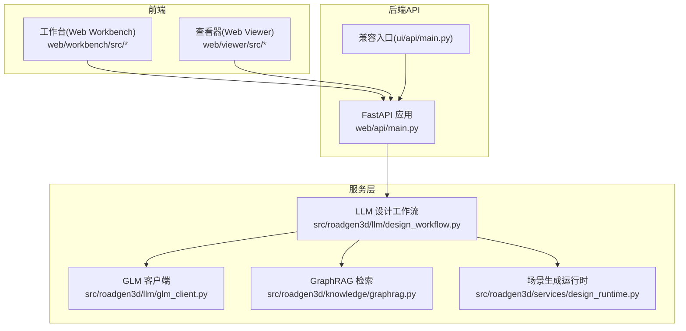
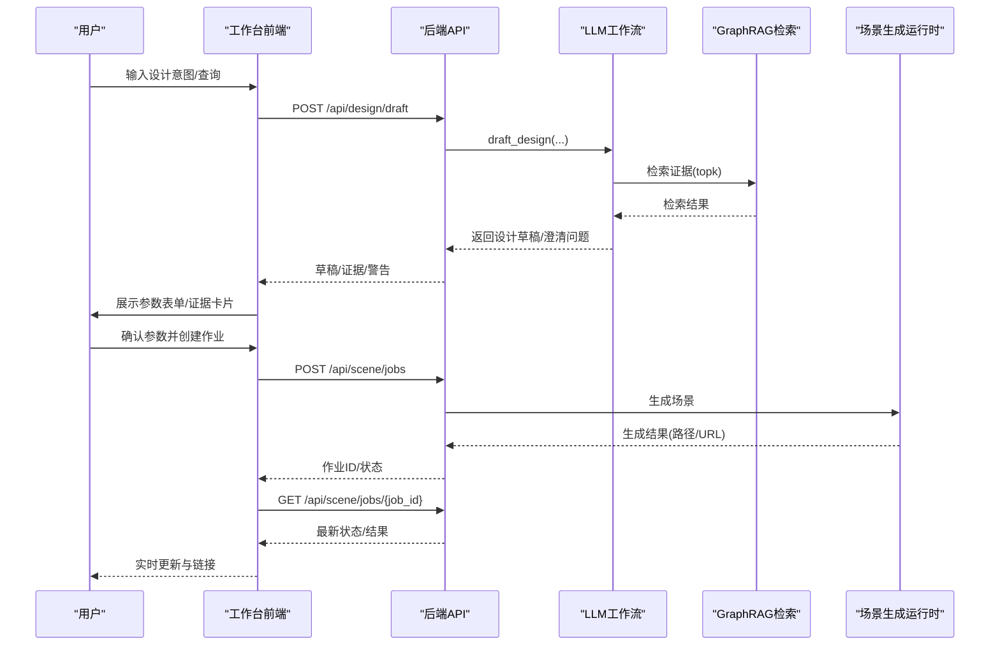
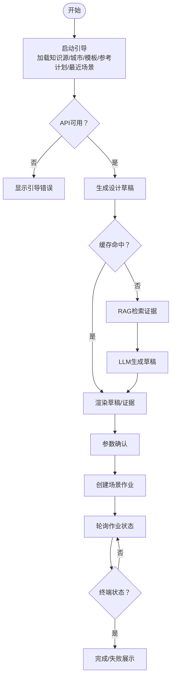
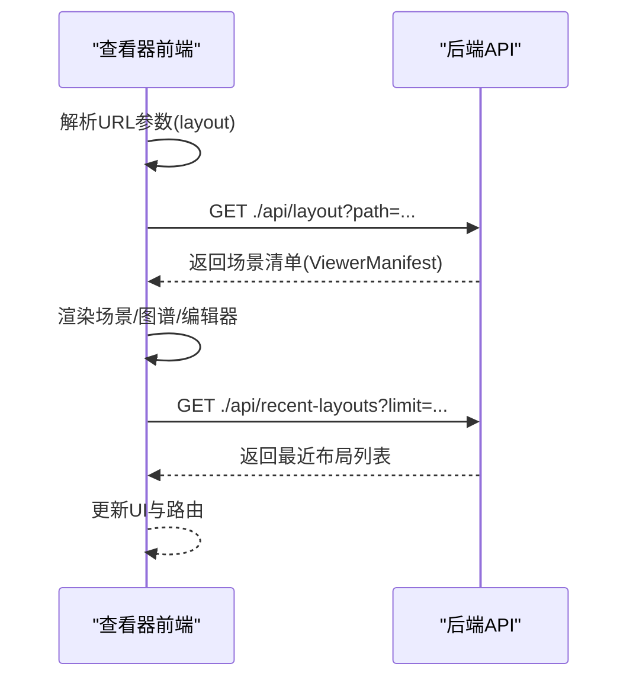
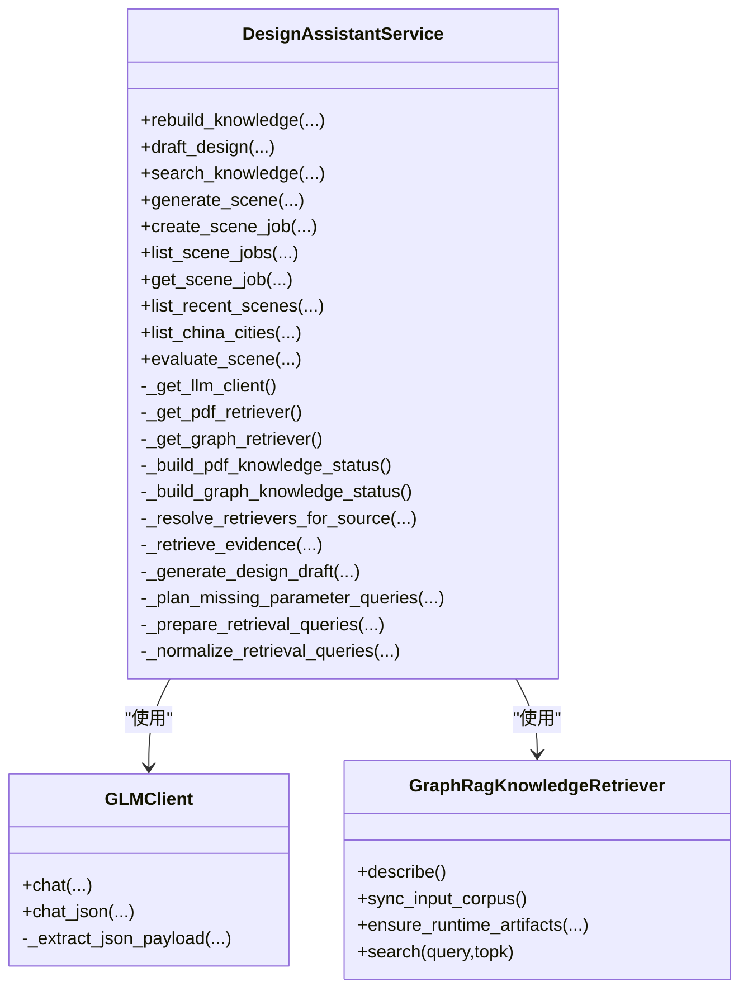
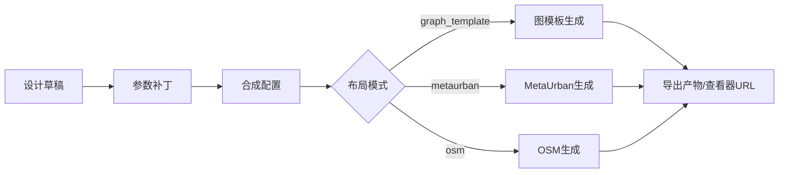
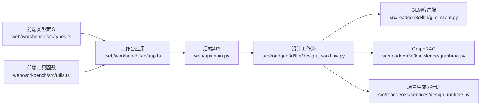

# Web界面系统

<cite>
**本文档引用的文件**
- [web/workbench/src/app.ts](file://web/workbench/src/app.ts)
- [web/workbench/src/main.ts](file://web/workbench/src/main.ts)
- [web/workbench/src/types.ts](file://web/workbench/src/types.ts)
- [web/workbench/src/utils.ts](file://web/workbench/src/utils.ts)
- [web/viewer/src/app.ts](file://web/viewer/src/app.ts)
- [web/viewer/src/main.ts](file://web/viewer/src/main.ts)
- [web/viewer/src/sg-types.ts](file://web/viewer/src/sg-types.ts)
- [web/api/main.py](file://web/api/main.py)
- [ui/api/main.py](file://ui/api/main.py)
- [src/roadgen3d/llm/design_workflow.py](file://src/roadgen3d/llm/design_workflow.py)
- [src/roadgen3d/llm/glm_client.py](file://src/roadgen3d/llm/glm_client.py)
- [src/roadgen3d/knowledge/graphrag.py](file://src/roadgen3d/knowledge/graphrag.py)
- [src/roadgen3d/services/design_runtime.py](file://src/roadgen3d/services/design_runtime.py)
</cite>

## 目录
1. [简介](#简介)
2. [项目结构](#项目结构)
3. [核心组件](#核心组件)
4. [架构总览](#架构总览)
5. [详细组件分析](#详细组件分析)
6. [依赖关系分析](#依赖关系分析)
7. [性能考量](#性能考量)
8. [故障排除指南](#故障排除指南)
9. [结论](#结论)
10. [附录](#附录)

## 简介
本文件系统性地文档化 RoadGen3D 的 Web 界面系统，涵盖工作台（Workbench）与查看器（Viewer）两大前端模块，以及后端 API 与服务层的协作关系。重点包括：

- 工作台与查看器的架构设计与功能特性
- LLM 对话流程、RAG 知识检索集成与参数配置界面
- WebSocket 通信机制、实时状态更新与错误处理策略
- 前端组件交互模式、响应式设计与可访问性支持
- API 集成点、认证方法与安全考虑
- 用户体验指南、性能优化技巧与调试工具使用方法
- 扩展 UI 组件与新增可视化功能的方法

## 项目结构
Web 界面系统采用前后端分离架构，前端由工作台与查看器两个独立应用组成，后端通过 FastAPI 提供统一 API 接口，服务层负责编排 LLM、RAG、场景生成与作业调度。

**图表来源**
- [web/workbench/src/app.ts:58-287](file://web/workbench/src/app.ts#L58-L287)
- [web/viewer/src/app.ts:1-120](file://web/viewer/src/app.ts#L1-L120)
- [web/api/main.py:81-267](file://web/api/main.py#L81-L267)
- [src/roadgen3d/llm/design_workflow.py:62-90](file://src/roadgen3d/llm/design_workflow.py#L62-L90)
- [src/roadgen3d/llm/glm_client.py:41-54](file://src/roadgen3d/llm/glm_client.py#L41-L54)
- [src/roadgen3d/knowledge/graphrag.py:230-268](file://src/roadgen3d/knowledge/graphrag.py#L230-L268)
- [src/roadgen3d/services/design_runtime.py:60-94](file://src/roadgen3d/services/design_runtime.py#L60-L94)

**章节来源**
- [web/workbench/src/main.ts:1-12](file://web/workbench/src/main.ts#L1-L12)
- [web/viewer/src/main.ts:1-61](file://web/viewer/src/main.ts#L1-L61)
- [web/api/main.py:81-267](file://web/api/main.py#L81-L267)

## 核心组件
- 工作台（Workbench）
  - 负责用户意图澄清、RAG 知识检索、参数确认与场景生成任务创建
  - 支持多种知识源（Hybrid/PDF/GraphRAG），并提供预设提示与知识库重建能力
  - 通过轮询机制跟踪场景作业状态，提供实时反馈与错误处理
- 查看器（Viewer）
  - 独立的 3D 场景浏览与交互平台，支持多视角、光照与实例信息展示
  - 内置场景图谱页面与资产编辑器页面，支持多路由切换
- 后端 API
  - 提供健康检查、地理信息、参考方案、图模板、知识源、RAG 查询、场景作业等接口
  - 支持 CORS，便于前端跨域访问
- 服务层
  - LLM 设计工作流：意图解析、RAG 检索、草稿生成、缓存管理、场景评估
  - GLM 客户端：OpenAI 兼容聊天接口封装，支持 JSON 解析与错误处理
  - GraphRAG 检索：官方 runtime 优先与 txt 回退策略，支持输入同步与构建状态描述
  - 场景生成运行时：根据草稿与场景上下文生成最终场景布局与导出产物

**章节来源**
- [web/workbench/src/app.ts:58-287](file://web/workbench/src/app.ts#L58-L287)
- [web/viewer/src/app.ts:1-120](file://web/viewer/src/app.ts#L1-L120)
- [web/api/main.py:81-267](file://web/api/main.py#L81-L267)
- [src/roadgen3d/llm/design_workflow.py:62-90](file://src/roadgen3d/llm/design_workflow.py#L62-L90)
- [src/roadgen3d/llm/glm_client.py:41-54](file://src/roadgen3d/llm/glm_client.py#L41-L54)
- [src/roadgen3d/knowledge/graphrag.py:230-268](file://src/roadgen3d/knowledge/graphrag.py#L230-L268)
- [src/roadgen3d/services/design_runtime.py:60-94](file://src/roadgen3d/services/design_runtime.py#L60-L94)

## 架构总览
工作台与查看器通过后端 API 进行解耦协作。工作台负责“设计意图 + 知识检索 + 参数确认”，查看器负责“场景浏览 + 可视化 + 交互”。服务层在后端内部协调 LLM、RAG 与场景生成流水线。

**图表来源**
- [web/workbench/src/app.ts:412-522](file://web/workbench/src/app.ts#L412-L522)
- [web/api/main.py:156-201](file://web/api/main.py#L156-L201)
- [src/roadgen3d/llm/design_workflow.py:112-239](file://src/roadgen3d/llm/design_workflow.py#L112-L239)
- [src/roadgen3d/services/design_runtime.py:336-396](file://src/roadgen3d/services/design_runtime.py#L336-L396)

## 详细组件分析

### 工作台（Workbench）前端
- 状态管理与渲染
  - 使用本地状态对象维护消息历史、最后草稿、当前作业、最近场景、城市/模板/参考计划、知识源选择与手动检索结果
  - 通过渲染函数驱动 UI 更新，包括时间线、参数表单、证据列表、作业面板等
- 对话与草稿流程
  - 支持普通草稿生成与预设提示（如“步行安全，全龄友好”）自动触发
  - 草稿生成包含缓存命中逻辑，避免重复 LLM/RAG 计算
- 知识检索与证据展示
  - 支持手动查询不同知识源，展示证据卡片与来源标注
  - 提供知识库重建按钮，触发后端重建流程并反馈输出目录
- 场景设置与上下文
  - 支持布局模式（graph_template/osm/metaurban/template）、城市选择、图模板、参考计划
  - OSM 模式下支持 AOI 边界框输入，自动格式化与校验
- 作业创建与轮询
  - 将参数表单转换为草稿补丁，提交场景作业
  - 通过轮询获取作业状态，支持终端状态（成功/失败）与错误信息展示
- 错误处理与启动引导
  - 启动阶段并行加载知识源、城市、模板、参考计划与最近场景
  - 对每个加载项捕获错误并汇总，确保工作台可用性

**图表来源**
- [web/workbench/src/app.ts:524-581](file://web/workbench/src/app.ts#L524-L581)
- [web/workbench/src/app.ts:412-482](file://web/workbench/src/app.ts#L412-L482)
- [web/workbench/src/app.ts:484-522](file://web/workbench/src/app.ts#L484-L522)

**章节来源**
- [web/workbench/src/app.ts:58-287](file://web/workbench/src/app.ts#L58-L287)
- [web/workbench/src/app.ts:524-581](file://web/workbench/src/app.ts#L524-L581)
- [web/workbench/src/app.ts:737-792](file://web/workbench/src/app.ts#L737-L792)
- [web/workbench/src/app.ts:794-820](file://web/workbench/src/app.ts#L794-L820)

### 查看器（Viewer）前端
- 多页面路由
  - 支持 viewer、scene-graph、asset-editor 三类页面，通过 URL hash 切换
  - 每个页面挂载独立的挂载函数，实现按需渲染与清理
- 场景加载与清单
  - 通过 API 加载场景布局清单，支持最近布局发现
  - 支持从 URL 参数直接加载布局路径，更新浏览器历史
- 交互与信息展示
  - 支持实例点击展示详细信息（类别、来源、指标、放置原因等）
  - 支持文本复制到剪贴板，提升可访问性
- 性能与资源管理
  - 提供对象与材质资源释放函数，避免内存泄漏
  - 提供指标条形图与颜色编码，直观展示场景质量指标

**图表来源**
- [web/viewer/src/main.ts:21-54](file://web/viewer/src/main.ts#L21-L54)
- [web/viewer/src/app.ts:521-541](file://web/viewer/src/app.ts#L521-L541)

**章节来源**
- [web/viewer/src/main.ts:1-61](file://web/viewer/src/main.ts#L1-L61)
- [web/viewer/src/app.ts:1-120](file://web/viewer/src/app.ts#L1-L120)
- [web/viewer/src/app.ts:521-541](file://web/viewer/src/app.ts#L521-L541)
- [web/viewer/src/sg-types.ts:1-130](file://web/viewer/src/sg-types.ts#L1-L130)

### LLM 对话流程与 RAG 集成
- 设计工作流
  - 意图解析：LLM 输出用户目标、风格偏好、安全优先级、澄清问题与检索查询
  - 检索策略：支持 Hybrid/PDF/GraphRAG，按知识源组合检索结果并去重排序
  - 草稿生成：基于证据与当前补丁生成设计草稿，填充缺失字段并标注来源
  - 缓存机制：以用户输入与知识源为键进行缓存，命中则跳过 LLM/RAG 计算
- GLM 客户端
  - 封装 OpenAI 兼容聊天接口，支持 JSON 模式解析与错误处理
  - 自动提取 JSON 负载，增强鲁棒性
- GraphRAG 检索
  - 优先使用官方 GraphRAG runtime，若不可用则回退至合并 txt 文档
  - 描述运行时状态、构建状态与错误信息，便于运维诊断

**图表来源**
- [src/roadgen3d/llm/design_workflow.py:62-90](file://src/roadgen3d/llm/design_workflow.py#L62-L90)
- [src/roadgen3d/llm/glm_client.py:41-54](file://src/roadgen3d/llm/glm_client.py#L41-L54)
- [src/roadgen3d/knowledge/graphrag.py:230-268](file://src/roadgen3d/knowledge/graphrag.py#L230-L268)

**章节来源**
- [src/roadgen3d/llm/design_workflow.py:112-239](file://src/roadgen3d/llm/design_workflow.py#L112-L239)
- [src/roadgen3d/llm/glm_client.py:65-108](file://src/roadgen3d/llm/glm_client.py#L65-L108)
- [src/roadgen3d/knowledge/graphrag.py:403-422](file://src/roadgen3d/knowledge/graphrag.py#L403-L422)

### 场景生成与参数配置
- 参数配置界面
  - 基于字段配置渲染参数表单，支持文本/数字/下拉选择
  - 用户覆盖参数将清除对应字段的引用证据来源
- 场景生成运行时
  - 根据草稿补丁与场景上下文构建合成配置
  - 支持 graph_template、metaurban、osm 等多种布局模式
  - 生成场景布局与导出产物，构建查看器 URL 并附加摘要信息

**图表来源**
- [web/workbench/src/utils.ts:154-182](file://web/workbench/src/utils.ts#L154-L182)
- [src/roadgen3d/services/design_runtime.py:60-94](file://src/roadgen3d/services/design_runtime.py#L60-L94)
- [src/roadgen3d/services/design_runtime.py:336-396](file://src/roadgen3d/services/design_runtime.py#L336-L396)

**章节来源**
- [web/workbench/src/utils.ts:154-182](file://web/workbench/src/utils.ts#L154-L182)
- [src/roadgen3d/services/design_runtime.py:60-94](file://src/roadgen3d/services/design_runtime.py#L60-L94)
- [src/roadgen3d/services/design_runtime.py:336-396](file://src/roadgen3d/services/design_runtime.py#L336-L396)

### WebSocket 通信机制与实时状态更新
- 当前实现
  - 工作台通过轮询方式获取场景作业状态，避免长连接复杂度
  - 轮询间隔与终端状态集合在类型定义中集中管理
- 扩展建议
  - 若需降低延迟与服务器压力，可在后端引入 WebSocket 主题推送
  - 前端订阅作业状态变更事件，结合指数退避与断线重连策略

**章节来源**
- [web/workbench/src/types.ts:186-189](file://web/workbench/src/types.ts#L186-L189)
- [web/workbench/src/app.ts:709-729](file://web/workbench/src/app.ts#L709-L729)

### 错误处理策略
- 前端
  - 统一错误消息格式化与引导错误提示，区分网络错误与业务错误
  - 引导阶段逐项加载并聚合错误，保证工作台可用性
- 后端
  - FastAPI 使用 CORS 中间件，允许跨域访问
  - 对 LLM 配置与响应错误进行分类抛出，便于前端识别
  - 对知识库重建与检索异常进行捕获与返回

**章节来源**
- [web/workbench/src/utils.ts:13-29](file://web/workbench/src/utils.ts#L13-L29)
- [web/api/main.py:83-89](file://web/api/main.py#L83-L89)
- [web/api/main.py:167-171](file://web/api/main.py#L167-L171)

## 依赖关系分析
- 前端到后端
  - 工作台与查看器均通过环境变量配置的 API 基础地址进行请求
  - 查看器支持回退 URL 构建，确保在 API 不可用时仍可打开场景
- 后端到服务层
  - 设计工作流作为服务容器，协调 LLM、RAG 与场景生成
  - 场景生成运行时负责具体合成流程与导出

**图表来源**
- [web/workbench/src/types.ts:186-227](file://web/workbench/src/types.ts#L186-L227)
- [web/workbench/src/app.ts:58-83](file://web/workbench/src/app.ts#L58-L83)
- [web/workbench/src/utils.ts:1-245](file://web/workbench/src/utils.ts#L1-L245)
- [web/api/main.py:81-267](file://web/api/main.py#L81-L267)
- [src/roadgen3d/llm/design_workflow.py:62-90](file://src/roadgen3d/llm/design_workflow.py#L62-L90)
- [src/roadgen3d/llm/glm_client.py:41-54](file://src/roadgen3d/llm/glm_client.py#L41-L54)
- [src/roadgen3d/knowledge/graphrag.py:230-268](file://src/roadgen3d/knowledge/graphrag.py#L230-L268)
- [src/roadgen3d/services/design_runtime.py:60-94](file://src/roadgen3d/services/design_runtime.py#L60-L94)

**章节来源**
- [web/workbench/src/types.ts:186-227](file://web/workbench/src/types.ts#L186-L227)
- [web/workbench/src/app.ts:58-83](file://web/workbench/src/app.ts#L58-L83)
- [web/api/main.py:81-267](file://web/api/main.py#L81-L267)

## 性能考量
- 前端
  - 合理使用轮询间隔，避免频繁请求造成资源浪费
  - 在渲染大列表时采用虚拟滚动与懒加载策略
  - 对图片与图标资源进行压缩与缓存
- 后端
  - LLM 与 RAG 检索应启用缓存，减少重复计算
  - GraphRAG 运行时构建与输入同步仅在必要时触发
  - 场景生成过程可考虑异步化与并发控制

## 故障排除指南
- API 不可用
  - 检查 API 基础地址配置与网络连通性
  - 查看引导阶段错误聚合信息，定位具体加载项失败原因
- LLM 配置错误
  - 确认 GLM 基础地址与密钥环境变量正确
  - 关注配置错误与响应错误的区分提示
- RAG 检索失败
  - 检查知识库重建状态与运行时构建状态
  - 切换知识源或调整检索查询语言

**章节来源**
- [web/workbench/src/utils.ts:20-29](file://web/workbench/src/utils.ts#L20-L29)
- [src/roadgen3d/llm/glm_client.py:14-38](file://src/roadgen3d/llm/glm_client.py#L14-L38)
- [src/roadgen3d/knowledge/graphrag.py:269-338](file://src/roadgen3d/knowledge/graphrag.py#L269-L338)

## 结论
RoadGen3D 的 Web 界面系统通过清晰的前后端分层与服务层编排，实现了从设计意图到场景生成的完整闭环。工作台专注于交互与知识集成，查看器专注于可视化与交互体验。未来可在后端引入 WebSocket 实时推送与前端进行更精细的性能优化，进一步提升用户体验与系统稳定性。

## 附录
- API 集成点
  - 健康检查：GET /api/health
  - 地理信息：GET /api/geo/china-cities
  - 参考方案：GET /api/reference-plans, GET /api/reference-plans/{plan_id}/image
  - 图模板：GET /api/graph-templates, GET /api/graph-templates/{template_id}/image
  - 设计草稿：POST /api/design/draft
  - 场景生成：POST /api/design/generate
  - 场景作业：POST /api/scene/jobs, GET /api/scene/jobs, GET /api/scene/jobs/{job_id}, GET /api/scenes/recent
  - 知识库：POST /api/knowledge/rebuild, GET /api/knowledge/sources, POST /api/knowledge/search
- 认证与安全
  - 后端启用 CORS，允许跨域访问
  - 建议在生产环境中增加鉴权与速率限制
- 扩展与定制
  - 新增 UI 组件：遵循现有模块化结构，复用类型与工具函数
  - 新增可视化功能：在查看器中扩展渲染管线与交互逻辑

**章节来源**
- [web/api/main.py:92-265](file://web/api/main.py#L92-L265)
- [ui/api/main.py:1-6](file://ui/api/main.py#L1-L6)