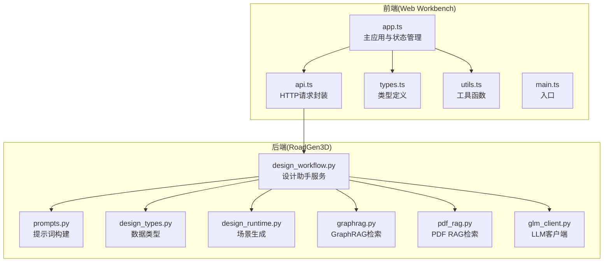
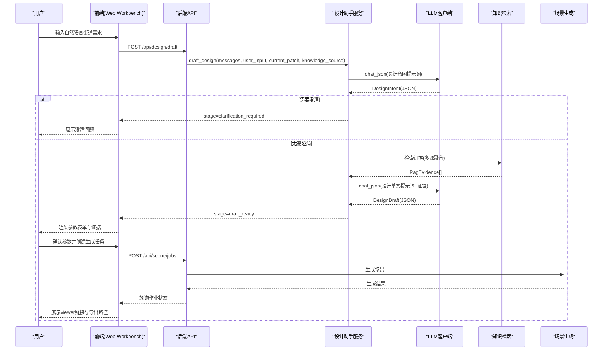
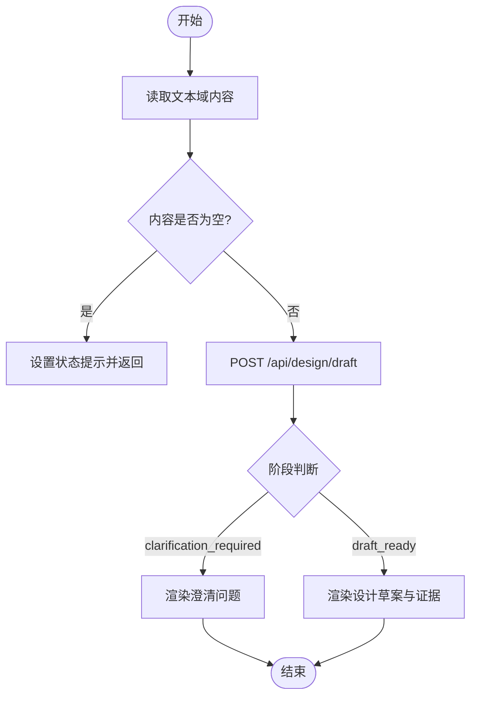
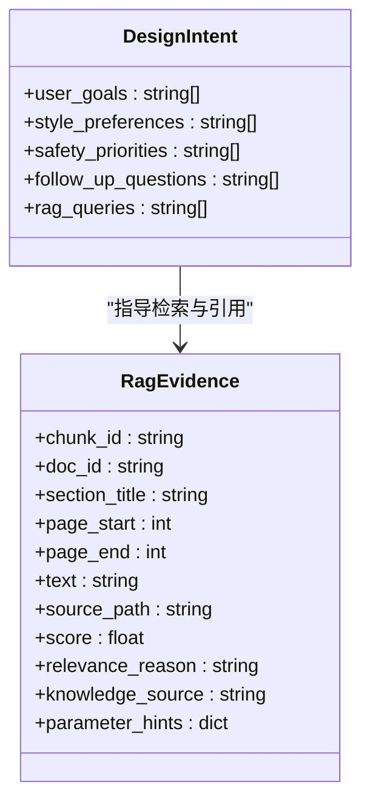
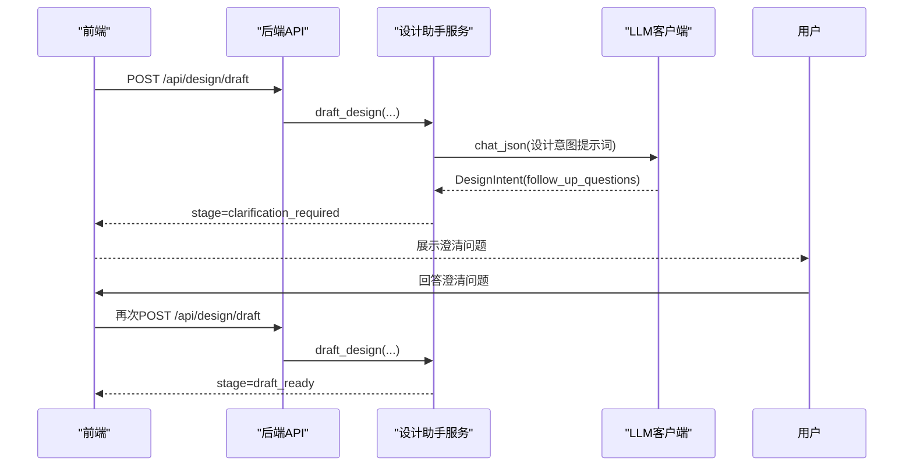
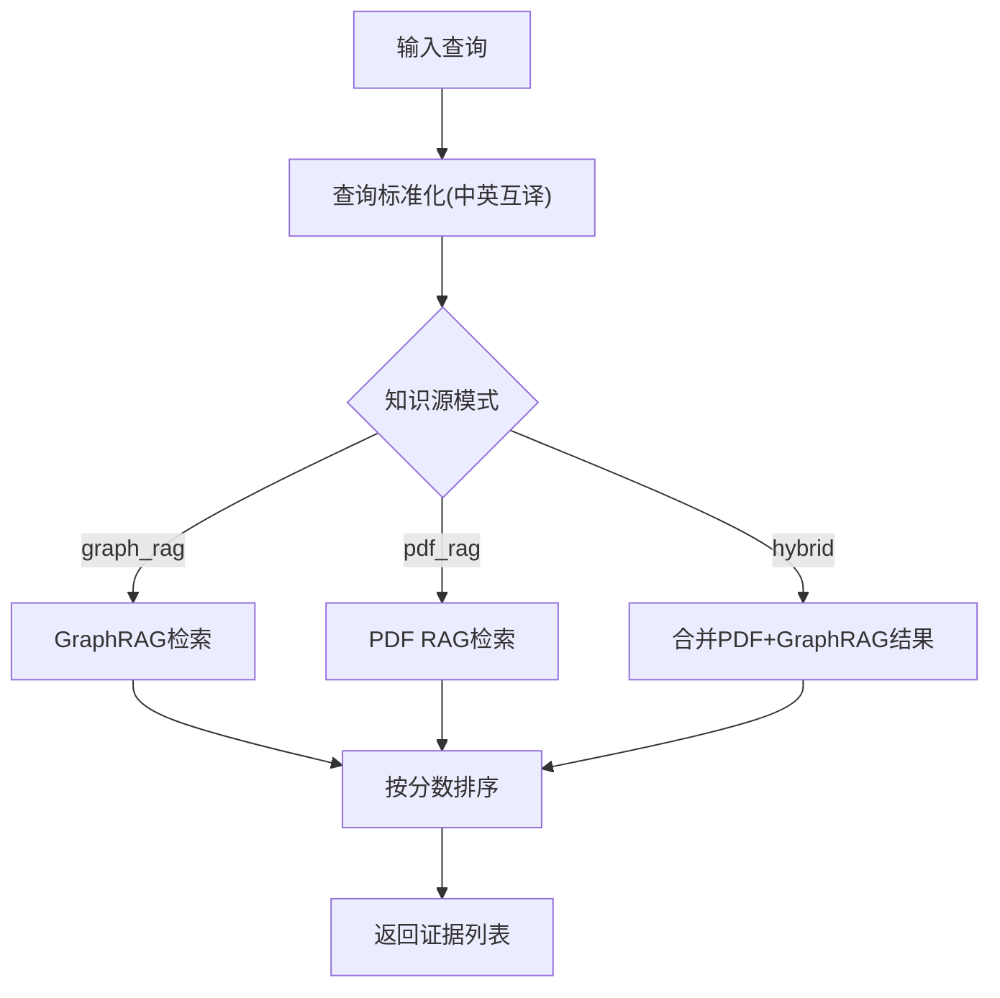
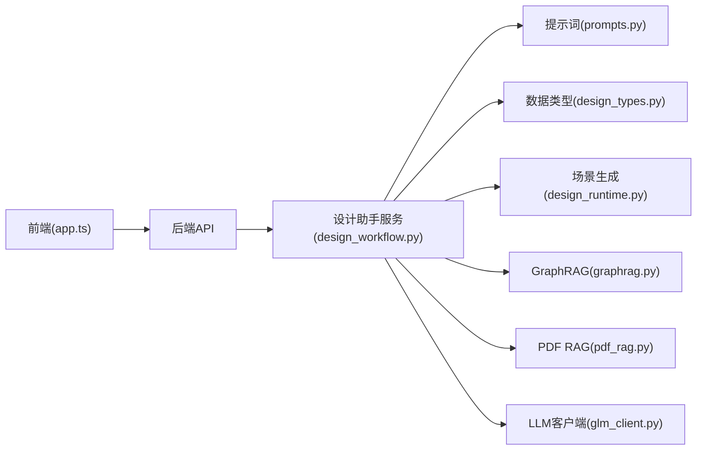

# LLM对话面板

<cite>
**本文档引用的文件**
- [design_workflow.py](file://src/roadgen3d/llm/design_workflow.py)
- [glm_client.py](file://src/roadgen3d/llm/glm_client.py)
- [prompts.py](file://src/roadgen3d/llm/prompts.py)
- [design_types.py](file://src/roadgen3d/services/design_types.py)
- [design_runtime.py](file://src/roadgen3d/services/design_runtime.py)
- [graphrag.py](file://src/roadgen3d/knowledge/graphrag.py)
- [pdf_rag.py](file://src/roadgen3d/knowledge/pdf_rag.py)
- [app.ts](file://web/workbench/src/app.ts)
- [api.ts](file://web/workbench/src/api.ts)
- [types.ts](file://web/workbench/src/types.ts)
- [utils.ts](file://web/workbench/src/utils.ts)
- [main.ts](file://web/workbench/src/main.ts)
</cite>

## 目录
1. [简介](#简介)
2. [项目结构](#项目结构)
3. [核心组件](#核心组件)
4. [架构总览](#架构总览)
5. [详细组件分析](#详细组件分析)
6. [依赖关系分析](#依赖关系分析)
7. [性能考虑](#性能考虑)
8. [故障排除指南](#故障排除指南)
9. [结论](#结论)
10. [附录](#附录)

## 简介
本文件系统性阐述 RoadGen3D 项目中 LLM 对话面板的设计与实现，涵盖消息时间线渲染、用户输入处理、AI 响应展示、设计意图澄清流程（含 follow-up 问题生成）、用户反馈收集与迭代对话机制、知识源切换（graph_rag、hybrid、pdf_rag）的工作原理与使用场景、预设提示词（步行安全全龄友好场景）的快速生成、对话状态管理、错误处理与用户体验优化策略，以及对话界面的自定义配置与扩展方法。

## 项目结构
对话面板由前端 Web Workbench 与后端服务共同组成：
- 前端（web/workbench）：负责用户交互、消息时间线渲染、参数表单渲染、知识源选择、作业状态轮询与结果展示。
- 后端（src/roadgen3d）：负责设计意图解析、RAG 检索、设计草案生成、场景生成与作业调度。

**图表来源**
- [app.ts:58-120](file://web/workbench/src/app.ts#L58-L120)
- [design_workflow.py:62-120](file://src/roadgen3d/llm/design_workflow.py#L62-L120)
- [prompts.py:11-52](file://src/roadgen3d/llm/prompts.py#L11-L52)
- [design_types.py:13-53](file://src/roadgen3d/services/design_types.py#L13-L53)
- [design_runtime.py:336-396](file://src/roadgen3d/services/design_runtime.py#L336-L396)
- [graphrag.py:230-268](file://src/roadgen3d/knowledge/graphrag.py#L230-L268)
- [pdf_rag.py:344-423](file://src/roadgen3d/knowledge/pdf_rag.py#L344-L423)
- [glm_client.py:41-108](file://src/roadgen3d/llm/glm_client.py#L41-L108)

**章节来源**
- [app.ts:58-120](file://web/workbench/src/app.ts#L58-L120)
- [design_workflow.py:62-120](file://src/roadgen3d/llm/design_workflow.py#L62-L120)

## 核心组件
- 设计助手服务（DesignAssistantService）
  - 负责意图解析、RAG 检索、设计草案生成、场景生成与作业管理。
  - 支持知识源切换（graph_rag、hybrid、pdf_rag），并具备缓存机制以提升性能与一致性。
- LLM 客户端（GLMClient）
  - 封装 OpenAI 兼容接口，支持 JSON 解析与响应校验。
- 提示词构建（prompts.py）
  - 构建设计意图、RAG 查询翻译、参数跟进查询、设计草案与场景评价的提示词。
- 数据类型（design_types.py）
  - 定义消息、意图、证据、设计草案、场景上下文等核心数据结构与默认值。
- 场景生成（design_runtime.py）
  - 将设计草案转换为可导出的 3D 场景，支持多种布局模式（template/osm/metaurban/graph_template）。
- 知识检索（graphrag.py、pdf_rag.py）
  - GraphRAG：官方 runtime 优先，回退至合并 txt 社区产物。
  - PDF RAG：基于 FAISS 的分块嵌入检索。

**章节来源**
- [design_workflow.py:62-120](file://src/roadgen3d/llm/design_workflow.py#L62-L120)
- [glm_client.py:41-108](file://src/roadgen3d/llm/glm_client.py#L41-L108)
- [prompts.py:11-164](file://src/roadgen3d/llm/prompts.py#L11-L164)
- [design_types.py:13-368](file://src/roadgen3d/services/design_types.py#L13-L368)
- [design_runtime.py:336-396](file://src/roadgen3d/services/design_runtime.py#L336-L396)
- [graphrag.py:230-268](file://src/roadgen3d/knowledge/graphrag.py#L230-L268)
- [pdf_rag.py:344-423](file://src/roadgen3d/knowledge/pdf_rag.py#L344-L423)

## 架构总览
对话面板采用前后端分离架构：前端通过 HTTP 接口与后端交互，后端内部通过设计助手服务串联 LLM、RAG、场景生成模块。设计意图澄清与参数确认在前端表单中完成，最终提交到后端生成作业并轮询状态。

**图表来源**
- [app.ts:321-482](file://web/workbench/src/app.ts#L321-L482)
- [design_workflow.py:112-239](file://src/roadgen3d/llm/design_workflow.py#L112-L239)
- [prompts.py:11-164](file://src/roadgen3d/llm/prompts.py#L11-L164)
- [design_runtime.py:336-396](file://src/roadgen3d/services/design_runtime.py#L336-L396)

## 详细组件分析

### 消息时间线渲染与用户输入处理
- 时间线渲染
  - 前端维护消息数组，渲染为用户/助手消息气泡，支持动态更新。
- 用户输入处理
  - 文本域提交后，调用设计草案接口，携带历史消息与当前草稿补丁。
  - 若命中缓存，直接返回缓存结果并提示用户。

**图表来源**
- [app.ts:321-482](file://web/workbench/src/app.ts#L321-L482)
- [design_workflow.py:112-239](file://src/roadgen3d/llm/design_workflow.py#L112-L239)

**章节来源**
- [app.ts:1103-1121](file://web/workbench/src/app.ts#L1103-L1121)
- [app.ts:321-482](file://web/workbench/src/app.ts#L321-L482)

### AI 响应展示与证据呈现
- 设计意图与证据卡片
  - 前端将 DesignIntent 与 RagEvidence 渲染为标签与卡片，标注来源与引用字段。
- 参数来源标注
  - 使用 tag 标注参数来源（RAG、LLM 推断、用户覆盖、系统默认）。

**图表来源**
- [design_types.py:142-175](file://src/roadgen3d/services/design_types.py#L142-L175)
- [app.ts:809-847](file://web/workbench/src/app.ts#L809-L847)

**章节来源**
- [design_types.py:142-175](file://src/roadgen3d/services/design_types.py#L142-L175)
- [app.ts:809-847](file://web/workbench/src/app.ts#L809-L847)

### 设计意图澄清流程（Follow-up 问题生成与迭代对话）
- 意图解析
  - LLM 将自然语言转为 JSON，包含用户目标、风格偏好、安全优先级、澄清问题与检索查询。
- 澄清阶段
  - 当存在 follow_up_questions 时，前端仅展示澄清问题，不进行 RAG 检索。
- 迭代对话
  - 用户回答澄清问题后，再次提交 draft 请求，直至无需澄清。

**图表来源**
- [design_workflow.py:135-154](file://src/roadgen3d/llm/design_workflow.py#L135-L154)
- [prompts.py:11-52](file://src/roadgen3d/llm/prompts.py#L11-L52)
- [app.ts:443-456](file://web/workbench/src/app.ts#L443-L456)

**章节来源**
- [design_workflow.py:135-154](file://src/roadgen3d/llm/design_workflow.py#L135-L154)
- [prompts.py:11-52](file://src/roadgen3d/llm/prompts.py#L11-L52)
- [app.ts:443-456](file://web/workbench/src/app.ts#L443-L456)

### 知识源切换与检索策略
- 支持三种模式
  - graph_rag：优先使用官方 GraphRAG runtime，若不可用则回退至合并 txt 社区产物。
  - hybrid：同时启用 PDF RAG 与 GraphRAG，去重合并结果。
  - pdf_rag：基于 FAISS 的 PDF 分块检索。
- 检索流程
  - 将检索查询标准化（中英互译、CJK 文本处理），按 topk 返回证据并排序。

**图表来源**
- [design_workflow.py:507-539](file://src/roadgen3d/llm/design_workflow.py#L507-L539)
- [graphrag.py:403-422](file://src/roadgen3d/knowledge/graphrag.py#L403-L422)
- [pdf_rag.py:409-422](file://src/roadgen3d/knowledge/pdf_rag.py#L409-L422)

**章节来源**
- [design_workflow.py:486-505](file://src/roadgen3d/llm/design_workflow.py#L486-L505)
- [graphrag.py:269-338](file://src/roadgen3d/knowledge/graphrag.py#L269-L338)
- [pdf_rag.py:344-423](file://src/roadgen3d/knowledge/pdf_rag.py#L344-L423)

### 预设提示词与快速生成
- 步行安全全龄友好预设
  - 前端一键填充预设提示词并自动发起设计草案请求。
- 自动生成
  - 若命中缓存，直接创建场景生成作业并轮询状态。

**章节来源**
- [app.ts:339-354](file://web/workbench/src/app.ts#L339-L354)
- [types.ts:193-193](file://web/workbench/src/types.ts#L193-L193)

### 对话状态管理与缓存
- 前端状态
  - 维护消息数组、最后草案、生成结果、当前作业、最近场景、知识源与场景上下文。
- 缓存机制
  - 后端对设计草案进行缓存，命中时直接返回并提示用户。

**章节来源**
- [app.ts:59-83](file://web/workbench/src/app.ts#L59-L83)
- [design_workflow.py:368-460](file://src/roadgen3d/llm/design_workflow.py#L368-L460)

### 错误处理与用户体验优化
- 错误处理
  - 前端统一捕获异常并格式化为用户可读消息。
  - 对网络错误进行特殊提示，引导检查 API 地址。
- 用户体验
  - 加载状态提示、按钮禁用、轮询作业状态、Viewer 链接与导出路径展示。

**章节来源**
- [app.ts:524-581](file://web/workbench/src/app.ts#L524-L581)
- [utils.ts:13-29](file://web/workbench/src/utils.ts#L13-L29)
- [api.ts:32-38](file://web/workbench/src/api.ts#L32-L38)

### 场景生成与作业管理
- 生成配置
  - 将设计草案合并默认值与用户覆盖，构建场景生成配置。
- 布局模式
  - 支持 template、osm、metaurban、graph_template 四种模式。
- 作业轮询
  - 创建作业后持续轮询状态，完成后展示 viewer 链接与导出路径。

**章节来源**
- [design_runtime.py:60-94](file://src/roadgen3d/services/design_runtime.py#L60-L94)
- [app.ts:484-522](file://web/workbench/src/app.ts#L484-L522)
- [app.ts:709-729](file://web/workbench/src/app.ts#L709-L729)

## 依赖关系分析
- 前端依赖后端 API，后端内部依赖 LLM、RAG、场景生成模块。
- 设计助手服务聚合多个子系统，提供统一的 draft 与生成接口。

**图表来源**
- [app.ts:58-120](file://web/workbench/src/app.ts#L58-L120)
- [design_workflow.py:62-120](file://src/roadgen3d/llm/design_workflow.py#L62-L120)
- [prompts.py:11-52](file://src/roadgen3d/llm/prompts.py#L11-L52)
- [design_types.py:13-53](file://src/roadgen3d/services/design_types.py#L13-L53)
- [design_runtime.py:336-396](file://src/roadgen3d/services/design_runtime.py#L336-L396)
- [graphrag.py:230-268](file://src/roadgen3d/knowledge/graphrag.py#L230-L268)
- [pdf_rag.py:344-423](file://src/roadgen3d/knowledge/pdf_rag.py#L344-L423)
- [glm_client.py:41-108](file://src/roadgen3d/llm/glm_client.py#L41-L108)

**章节来源**
- [app.ts:58-120](file://web/workbench/src/app.ts#L58-L120)
- [design_workflow.py:62-120](file://src/roadgen3d/llm/design_workflow.py#L62-L120)

## 性能考虑
- 缓存策略
  - 设计草案缓存避免重复 LLM 与 RAG 计算，命中时直接返回并提示用户。
- 检索优化
  - GraphRAG 优先使用官方 runtime，不可用时回退 txt 合并产物，减少检索成本。
- 并发与轮询
  - 作业轮询间隔可控，避免频繁请求造成压力。

[本节为通用指导，无需特定文件引用]

## 故障排除指南
- API 不可用
  - 检查 API 基础地址与网络连通性，前端会提示无法连接。
- 知识源不可用
  - 查看知识源状态面板，确认可用性与构建状态。
- 生成作业失败
  - 查看作业错误信息，必要时重新创建作业。

**章节来源**
- [utils.ts:20-29](file://web/workbench/src/utils.ts#L20-L29)
- [app.ts:583-612](file://web/workbench/src/app.ts#L583-L612)
- [app.ts:709-729](file://web/workbench/src/app.ts#L709-L729)

## 结论
该对话面板通过清晰的前后端分工、稳健的意图澄清与参数确认流程、灵活的知识源切换与缓存策略，实现了从自然语言到可编辑参数再到 3D 场景的高效闭环。前端注重用户体验，后端强调可扩展性与稳定性，适合在复杂城市设计场景中快速迭代与验证。

## 附录

### 对话界面自定义配置与扩展方法
- 知识源选择
  - 在前端选择 graph_rag、hybrid 或 pdf_rag，后端会相应调整检索策略。
- 场景上下文
  - 支持布局模式、城市、AOI、参考平面与图模板等上下文配置。
- 参数表单
  - 前端根据 FIELD_CONFIGS 渲染参数表单，用户可覆盖默认值并查看引用来源。
- 扩展点
  - 新增提示词：在 prompts.py 中扩展提示词构建逻辑。
  - 新增布局模式：在 design_runtime.py 中扩展生成逻辑。
  - 新增知识源：在 design_workflow.py 中扩展检索与状态描述。

**章节来源**
- [types.ts:184-227](file://web/workbench/src/types.ts#L184-L227)
- [app.ts:887-944](file://web/workbench/src/app.ts#L887-L944)
- [prompts.py:113-164](file://src/roadgen3d/llm/prompts.py#L113-L164)
- [design_runtime.py:336-396](file://src/roadgen3d/services/design_runtime.py#L336-L396)
- [design_workflow.py:241-253](file://src/roadgen3d/llm/design_workflow.py#L241-L253)