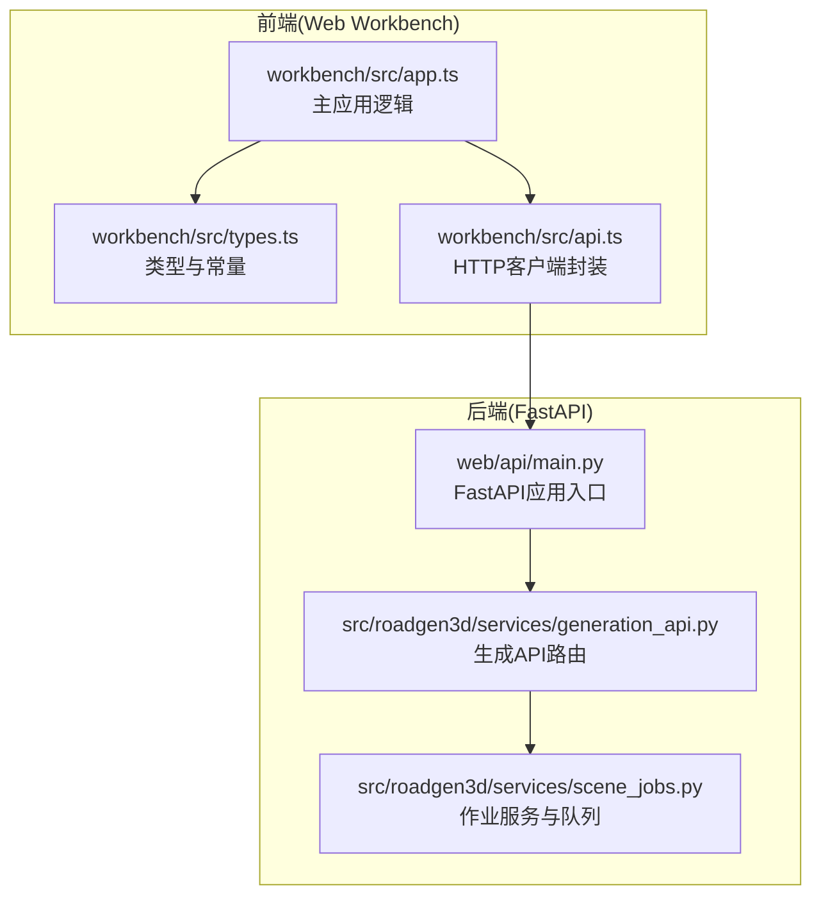
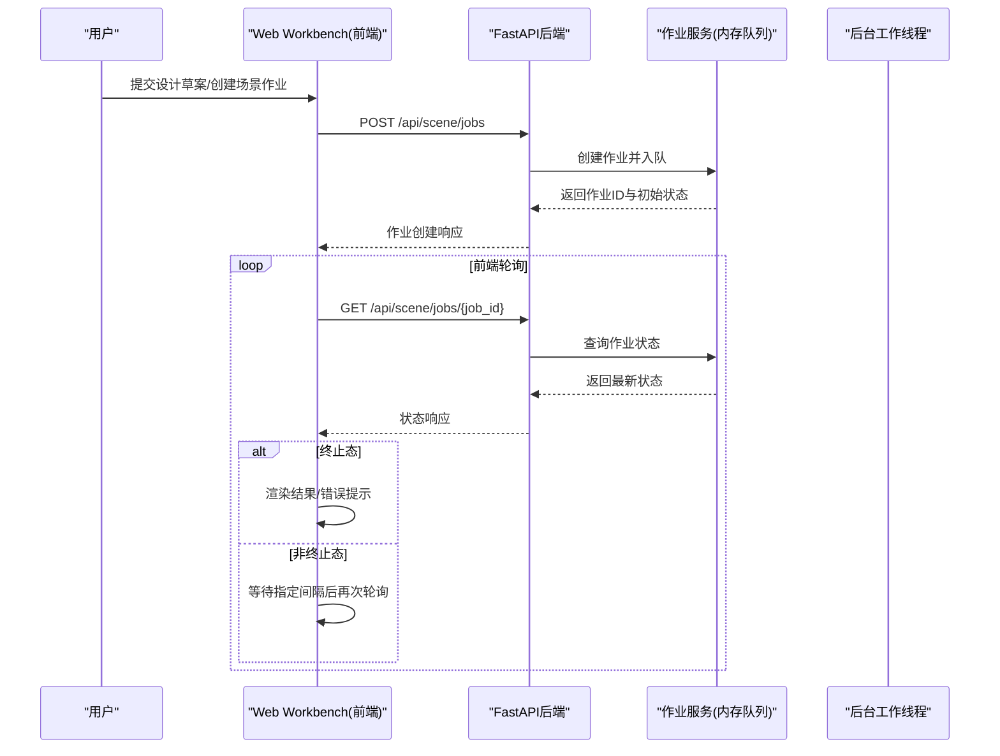
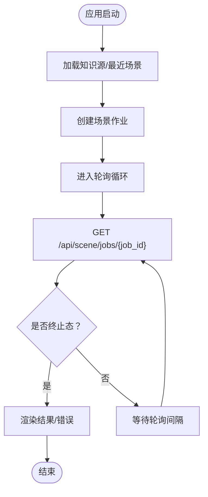
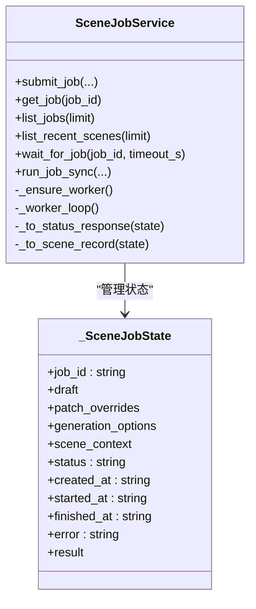
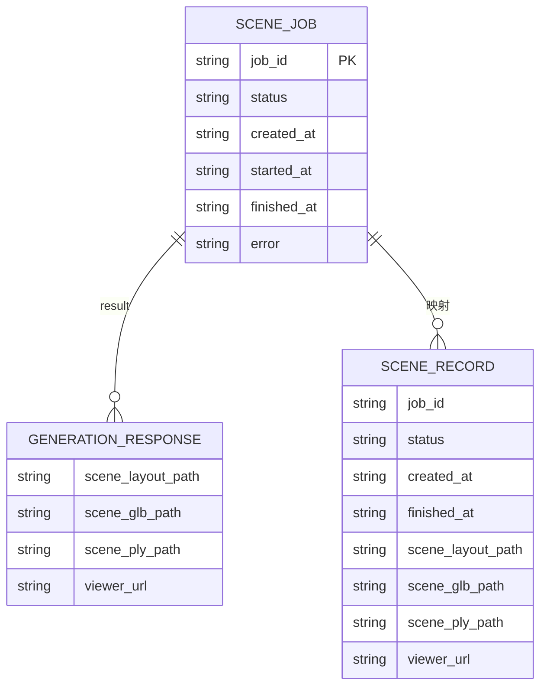
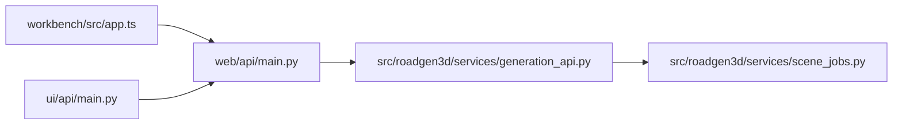

# WebSocket通信

<cite>
**本文档引用的文件**
- [web/api/main.py](file://web/api/main.py)
- [web/workbench/src/app.ts](file://web/workbench/src/app.ts)
- [web/workbench/src/types.ts](file://web/workbench/src/types.ts)
- [web/workbench/src/api.ts](file://web/workbench/src/api.ts)
- [src/roadgen3d/services/scene_jobs.py](file://src/roadgen3d/services/scene_jobs.py)
- [src/roadgen3d/services/generation_api.py](file://src/roadgen3d/services/generation_api.py)
- [ui/api/main.py](file://ui/api/main.py)
- [web/viewer/src/app.ts](file://web/viewer/src/app.ts)
</cite>

## 目录
1. [简介](#简介)
2. [项目结构](#项目结构)
3. [核心组件](#核心组件)
4. [架构总览](#架构总览)
5. [详细组件分析](#详细组件分析)
6. [依赖关系分析](#依赖关系分析)
7. [性能考虑](#性能考虑)
8. [故障排查指南](#故障排查指南)
9. [结论](#结论)
10. [附录](#附录)

## 简介
本文件聚焦于RoadGen3D项目中的实时通信与状态同步机制，系统性阐述基于HTTP轮询的作业状态同步流程（非WebSocket），以及与之配套的状态更新、错误通知、轮询策略优化、并发控制与性能监控实践。文档同时给出消息格式规范、错误码定义、客户端配置选项与调试工具，帮助开发者快速理解并扩展实时交互能力。

## 项目结构
本项目的前端采用Vite构建的TypeScript应用，后端基于FastAPI提供REST API。实时状态同步通过前端定时轮询后端接口实现，后端在内存中维护作业队列与状态机，支持多线程后台工作器处理生成任务。

**图表来源**
- [web/workbench/src/app.ts:709-729](file://web/workbench/src/app.ts#L709-L729)
- [web/workbench/src/types.ts:186-189](file://web/workbench/src/types.ts#L186-L189)
- [web/workbench/src/api.ts:11-38](file://web/workbench/src/api.ts#L11-L38)
- [web/api/main.py:81-267](file://web/api/main.py#L81-L267)
- [src/roadgen3d/services/generation_api.py:257-293](file://src/roadgen3d/services/generation_api.py#L257-L293)
- [src/roadgen3d/services/scene_jobs.py:42-177](file://src/roadgen3d/services/scene_jobs.py#L42-L177)

**章节来源**
- [web/workbench/src/app.ts:58-84](file://web/workbench/src/app.ts#L58-L84)
- [web/workbench/src/types.ts:186-189](file://web/workbench/src/types.ts#L186-L189)
- [web/api/main.py:81-267](file://web/api/main.py#L81-L267)
- [src/roadgen3d/services/scene_jobs.py:42-177](file://src/roadgen3d/services/scene_jobs.py#L42-L177)

## 核心组件
- 前端轮询控制器：在应用启动时拉取后端知识源与场景任务列表，随后以固定间隔轮询当前任务状态，直至达到终止态。
- 后端作业服务：在内存中维护作业队列、状态机与后台工作线程，支持提交、查询、列出最近场景等操作。
- API层：提供设计草案、场景作业创建、状态查询、最近场景列表等REST接口。
- 客户端工具：统一的HTTP客户端封装，负责JSON序列化、错误处理与响应解析。

**章节来源**
- [web/workbench/src/app.ts:524-581](file://web/workbench/src/app.ts#L524-L581)
- [web/workbench/src/app.ts:709-729](file://web/workbench/src/app.ts#L709-L729)
- [src/roadgen3d/services/scene_jobs.py:42-177](file://src/roadgen3d/services/scene_jobs.py#L42-L177)
- [web/api/main.py:188-221](file://web/api/main.py#L188-L221)
- [web/workbench/src/api.ts:11-38](file://web/workbench/src/api.ts#L11-L38)

## 架构总览
下图展示了从用户在工作台发起生成任务，到后端作业队列处理，再到前端轮询获取状态的完整流程。

**图表来源**
- [web/workbench/src/app.ts:484-522](file://web/workbench/src/app.ts#L484-L522)
- [web/workbench/src/app.ts:709-729](file://web/workbench/src/app.ts#L709-L729)
- [web/api/main.py:188-215](file://web/api/main.py#L188-L215)
- [src/roadgen3d/services/scene_jobs.py:57-86](file://src/roadgen3d/services/scene_jobs.py#L57-L86)
- [src/roadgen3d/services/scene_jobs.py:144-177](file://src/roadgen3d/services/scene_jobs.py#L144-L177)

## 详细组件分析

### 前端轮询与状态同步
- 轮询策略：前端在应用启动时加载知识源与最近场景列表，随后对当前作业进行轮询，轮询间隔由常量定义，达到终止态后停止轮询。
- 实时进度显示：前端根据后端返回的作业状态渲染UI，包括作业ID、创建时间、开始/结束时间、错误信息与最终结果。
- 错误通知：当后端返回非2xx状态码或作业失败时，前端展示错误信息并允许用户重试或查看详情。

**图表来源**
- [web/workbench/src/app.ts:524-581](file://web/workbench/src/app.ts#L524-L581)
- [web/workbench/src/app.ts:709-729](file://web/workbench/src/app.ts#L709-L729)
- [web/workbench/src/types.ts](file://web/workbench/src/types.ts#L188)

**章节来源**
- [web/workbench/src/app.ts:709-729](file://web/workbench/src/app.ts#L709-L729)
- [web/workbench/src/types.ts](file://web/workbench/src/types.ts#L188)

### 后端作业服务与状态机
- 作业状态：包含创建、排队、运行、成功、失败五种状态，支持查询单个作业与列出最近场景。
- 并发控制：使用线程锁与条件变量保证状态变更的原子性，后台工作线程从队列取出作业并执行生成。
- 结果存储：成功完成后将生成结果写回作业状态，失败时记录错误信息。

**图表来源**
- [src/roadgen3d/services/scene_jobs.py:27-40](file://src/roadgen3d/services/scene_jobs.py#L27-L40)
- [src/roadgen3d/services/scene_jobs.py:42-177](file://src/roadgen3d/services/scene_jobs.py#L42-L177)

**章节来源**
- [src/roadgen3d/services/scene_jobs.py:42-177](file://src/roadgen3d/services/scene_jobs.py#L42-L177)

### API端点与消息格式
- 设计草案：POST /api/design/draft，请求体包含消息历史、用户输入、当前补丁、检索数量与知识源；响应为设计草案与证据。
- 场景作业：POST /api/scene/jobs 创建作业；GET /api/scene/jobs 列表；GET /api/scene/jobs/{job_id} 查询单个作业。
- 最近场景：GET /api/scenes/recent 获取最近生成场景列表。
- 健康检查：GET /api/health。

**图表来源**
- [web/api/main.py:188-221](file://web/api/main.py#L188-L221)
- [src/roadgen3d/services/generation_api.py:257-293](file://src/roadgen3d/services/generation_api.py#L257-L293)
- [web/workbench/src/types.ts:141-175](file://web/workbench/src/types.ts#L141-L175)

**章节来源**
- [web/api/main.py:156-221](file://web/api/main.py#L156-L221)
- [web/workbench/src/types.ts:141-175](file://web/workbench/src/types.ts#L141-L175)

### 错误码与错误处理
- 400：请求参数无效或作业未完成。
- 404：作业不存在。
- 503：LLM配置或响应异常导致服务不可用。
- 前端统一错误处理：非2xx响应抛出错误，由客户端封装函数捕获并展示。

**章节来源**
- [web/api/main.py:167-171](file://web/api/main.py#L167-L171)
- [web/api/main.py:213-215](file://web/api/main.py#L213-L215)
- [web/workbench/src/api.ts:32-38](file://web/workbench/src/api.ts#L32-L38)

### 客户端配置与调试工具
- API基础地址：可通过环境变量配置，前端通过常量导入。
- 轮询间隔：固定常量，便于统一调整。
- 调试建议：开启浏览器网络面板观察轮询频率与响应；在后端日志中定位作业状态变更；在前端控制台查看错误堆栈。

**章节来源**
- [web/workbench/src/types.ts:186-189](file://web/workbench/src/types.ts#L186-L189)
- [web/workbench/src/api.ts:25-30](file://web/workbench/src/api.ts#L25-L30)

## 依赖关系分析
- 前端依赖后端REST API，通过统一HTTP客户端封装进行请求与响应处理。
- 后端依赖作业服务模块，后者在内存中维护状态与队列，必要时可替换为持久化存储。
- 兼容层：ui/api/main.py作为旧版入口的兼容适配。

**图表来源**
- [web/workbench/src/app.ts:524-581](file://web/workbench/src/app.ts#L524-L581)
- [web/api/main.py:81-267](file://web/api/main.py#L81-L267)
- [src/roadgen3d/services/generation_api.py:257-293](file://src/roadgen3d/services/generation_api.py#L257-L293)
- [src/roadgen3d/services/scene_jobs.py:42-177](file://src/roadgen3d/services/scene_jobs.py#L42-L177)
- [ui/api/main.py:1-6](file://ui/api/main.py#L1-L6)

**章节来源**
- [ui/api/main.py:1-6](file://ui/api/main.py#L1-L6)

## 性能考虑
- 轮询间隔：当前固定为毫秒级常量，可根据任务耗时与UI刷新需求动态调整。
- 批量状态查询：前端可合并多个作业状态查询，减少网络往返。
- 缓存机制：后端可引入轻量缓存（如Redis）存储热点作业状态，降低频繁计算与I/O。
- 连接池管理：HTTP客户端复用连接，避免频繁握手开销。
- 并发控制：后台工作线程池大小与队列长度应与CPU与磁盘IO能力匹配，防止资源争用。
- 性能监控：在关键路径埋点（创建作业、状态查询、生成完成），结合日志与指标系统观测延迟与吞吐。

## 故障排查指南
- 无法连接后端：检查API基础地址与CORS配置，确保跨域放行。
- 轮询无响应：确认轮询间隔设置合理，检查网络面板是否存在大量失败请求。
- 作业长时间处于排队/运行态：检查后台工作线程是否存活，查看作业状态变更日志。
- 失败作业：前端展示错误信息，后端记录异常堆栈，定位具体生成步骤。
- Viewer集成：Viewer前端通过独立基座访问，注意与Workbench的Viewer基座配置一致。

**章节来源**
- [web/workbench/src/api.ts:32-38](file://web/workbench/src/api.ts#L32-L38)
- [web/workbench/src/app.ts:709-729](file://web/workbench/src/app.ts#L709-L729)
- [src/roadgen3d/services/scene_jobs.py:144-177](file://src/roadgen3d/services/scene_jobs.py#L144-L177)

## 结论
本项目采用HTTP轮询实现作业状态的实时同步，具备实现简单、部署成本低的优势。通过合理的轮询策略、并发控制与错误处理，能够满足大多数场景下的状态更新与错误通知需求。若未来需要更低延迟与更高并发的实时通信，可在现有基础上引入WebSocket或Server-Sent Events等技术栈，同时保留现有的消息格式与状态模型。

## 附录
- 消息格式规范
  - 请求体字段：见各API端点的Pydantic模型定义。
  - 响应结构：统一包装为JSON对象，包含业务数据与状态信息。
- 错误码定义
  - 400：请求参数无效或作业未完成。
  - 404：作业不存在。
  - 503：服务不可用（LLM相关）。
- 客户端配置选项
  - API基础地址：通过环境变量注入。
  - 轮询间隔：固定常量，便于集中管理。
- 调试工具
  - 浏览器网络面板：观察请求与响应。
  - 后端日志：定位状态变更与异常。
  - 前端控制台：查看错误堆栈与状态渲染。