# 场景任务面板

<cite>
**本文档引用的文件**
- [scene_jobs.py](file://src/roadgen3d/services/scene_jobs.py)
- [design_types.py](file://src/roadgen3d/services/design_types.py)
- [main.py](file://web/api/main.py)
- [app.ts](file://web/workbench/src/app.ts)
- [types.ts](file://web/workbench/src/types.ts)
- [utils.ts](file://web/workbench/src/utils.ts)
- [style.css](file://web/workbench/src/style.css)
</cite>

## 更新摘要
**变更内容**
- 新增英雄芯片步骤指示器系统，提供可视化的工作流程导航
- 更新标签页系统架构，Scene Jobs现为第5个标签页（索引4）
- 改进作业状态轮询机制，使用常量定义的轮询间隔和终止状态
- 增强标签页与工作流程的自动同步功能
- 优化前端状态管理和UI响应机制

## 目录
1. [简介](#简介)
2. [项目结构](#项目结构)
3. [核心组件](#核心组件)
4. [架构概览](#架构概览)
5. [详细组件分析](#详细组件分析)
6. [英雄芯片步骤指示器](#英雄芯片步骤指示器)
7. [标签页系统](#标签页系统)
8. [作业状态轮询机制](#作业状态轮询机制)
9. [依赖关系分析](#依赖关系分析)
10. [性能考虑](#性能考虑)
11. [故障排除指南](#故障排除指南)
12. [结论](#结论)

## 简介

场景任务面板是 RoadGen3D 项目中的核心组件，负责管理场景作业的完整生命周期。该面板提供了从任务创建、状态轮询到结果获取的完整工作流程，支持多种作业状态跟踪（排队中、执行中、成功、失败），并集成了最近场景列表管理、结果展示和查看器集成功能。

该系统采用前后端分离架构，前端使用 TypeScript 和现代浏览器技术，后端基于 Python FastAPI 提供 RESTful API。整个系统支持异步作业处理、实时状态更新和丰富的可视化反馈。

**更新** 新增的英雄芯片步骤指示器系统提供了直观的工作流程导航，将传统的标签页导航升级为可视化的五阶段工作流程：意图澄清 → 图形RAG证据 → 参数确认 → 场景作业 → 结果查看。Scene Jobs 标签现在位于工作台的第5个位置，与前四个工作区域形成完整的场景生成工作流。

## 项目结构

场景任务面板涉及多个层次的组件协作：

```mermaid
graph TB
subgraph "前端层"
WB[Web Workbench]
API[API 客户端]
UI[用户界面]
HERO[英雄芯片指示器]
TAB[标签页系统]
END
subgraph "后端服务层"
APIG[FastAPI 应用]
SJS[场景作业服务]
DWS[设计工作流]
END
subgraph "数据层"
DS[设计类型定义]
SR[场景记录]
JR[作业响应]
END
subgraph "外部集成"
VR[Web 查看器]
FS[文件系统]
END
WB --> API
API --> APIG
APIG --> SJS
SJS --> DWS
DWS --> DS
SJS --> SR
SJS --> JR
APIG --> VR
SJS --> FS
HERO --> TAB
TAB --> WB
TAB --> UI
```

**图表来源**
- [main.py:81-267](file://web/api/main.py#L81-L267)
- [scene_jobs.py:42-204](file://src/roadgen3d/services/scene_jobs.py#L42-L204)
- [app.ts:162-168](file://web/workbench/src/app.ts#L162-L168)

**章节来源**
- [main.py:1-286](file://web/api/main.py#L1-L286)
- [scene_jobs.py:1-205](file://src/roadgen3d/services/scene_jobs.py#L1-L205)
- [app.ts:162-168](file://web/workbench/src/app.ts#L162-L168)

## 核心组件

场景任务面板由以下核心组件构成：

### 1. 场景作业服务 (SceneJobService)
负责管理场景生成作业的完整生命周期，包括作业提交、状态跟踪、结果处理等。

### 2. 设计类型系统
提供统一的数据结构定义，确保前后端数据传输的一致性和完整性。

### 3. Web API 接口
提供 RESTful API 端点，支持作业创建、状态查询、结果获取等功能。

### 4. 前端工作台
提供用户交互界面，支持作业状态轮询、结果展示和操作控制。

### 5. 英雄芯片步骤指示器
**新增** 提供可视化的工作流程导航，显示当前进度和可点击的步骤跳转功能。

### 6. 标签页系统
**更新** 提供五标签页导航界面，支持五个主要工作区域的切换和管理，与英雄芯片指示器深度集成。

### 7. Web 查看器集成
支持场景结果的在线查看和交互式浏览。

**章节来源**
- [scene_jobs.py:42-204](file://src/roadgen3d/services/scene_jobs.py#L42-L204)
- [design_types.py:307-368](file://src/roadgen3d/services/design_types.py#L307-L368)
- [main.py:188-221](file://web/api/main.py#L188-L221)
- [app.ts:162-168](file://web/workbench/src/app.ts#L162-L168)

## 架构概览

场景任务面板采用分层架构设计，各层职责明确且松耦合：

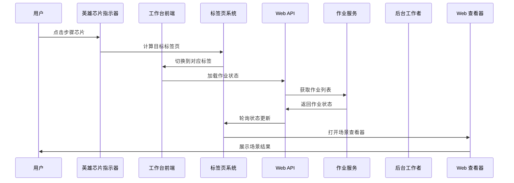

**图表来源**
- [app.ts:484-522](file://web/workbench/src/app.ts#L484-L522)
- [main.py:188-201](file://web/api/main.py#L188-L201)
- [scene_jobs.py:144-178](file://src/roadgen3d/services/scene_jobs.py#L144-L178)
- [app.ts:162-168](file://web/workbench/src/app.ts#L162-L168)

## 详细组件分析

### 场景作业服务 (SceneJobService)

SceneJobService 是整个场景任务面板的核心组件，负责管理场景生成作业的完整生命周期。

#### 数据结构设计

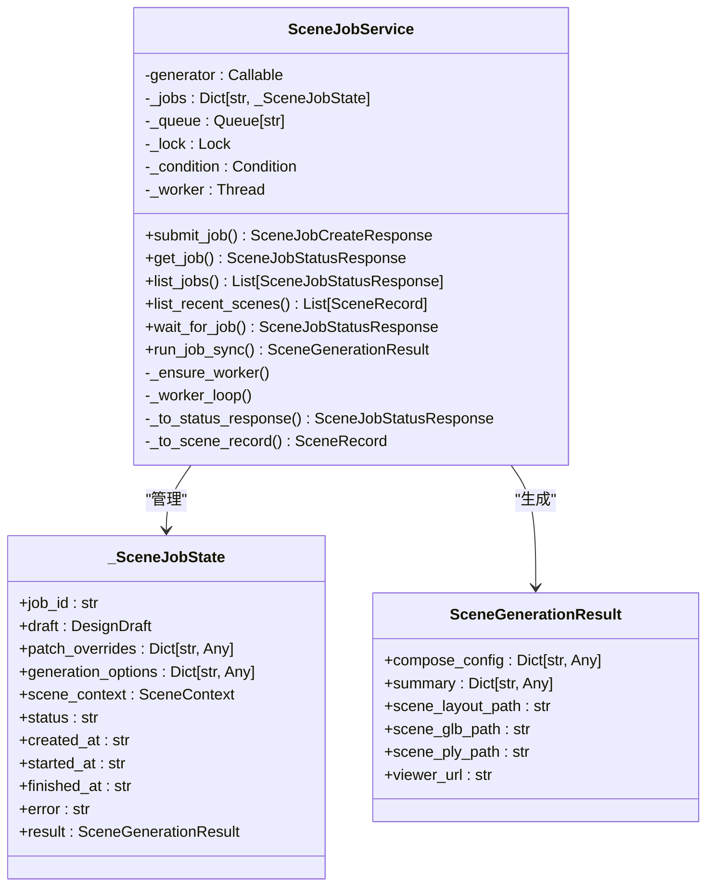

**图表来源**
- [scene_jobs.py:27-204](file://src/roadgen3d/services/scene_jobs.py#L27-L204)
- [design_types.py:307-317](file://src/roadgen3d/services/design_types.py#L307-L317)

#### 作业状态管理

作业状态在内部以字符串形式维护，支持以下状态转换：

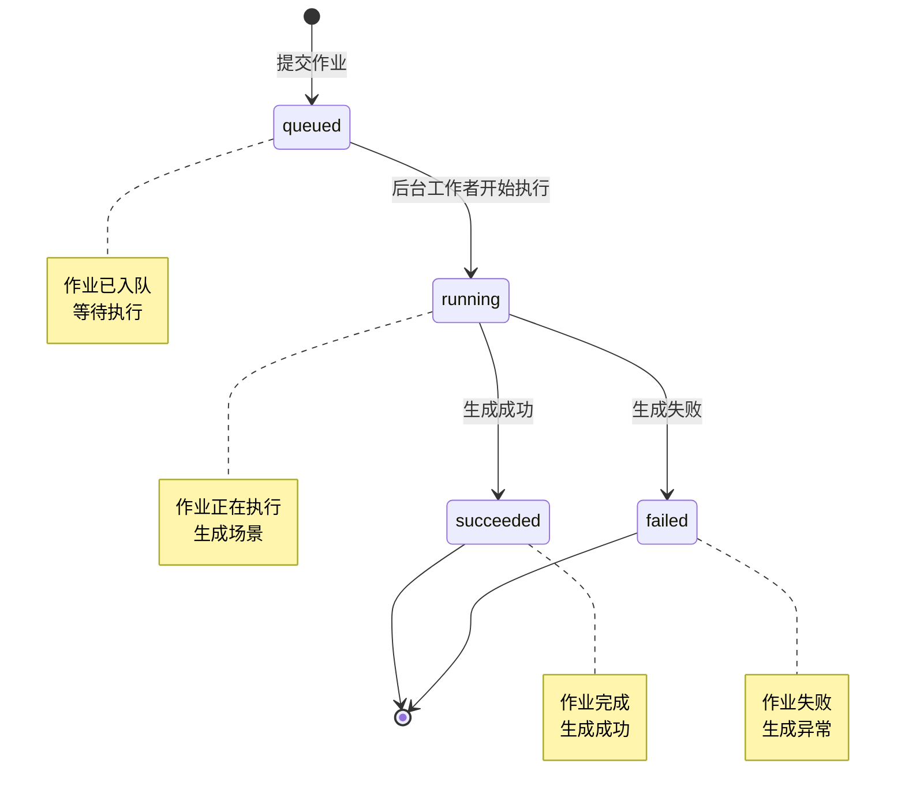

**图表来源**
- [scene_jobs.py:34-39](file://src/roadgen3d/services/scene_jobs.py#L34-L39)
- [scene_jobs.py:144-178](file://src/roadgen3d/services/scene_jobs.py#L144-L178)

#### 异步作业执行

作业服务使用后台线程池实现异步执行，支持并发作业处理：

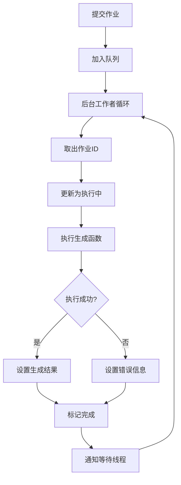

**图表来源**
- [scene_jobs.py:144-178](file://src/roadgen3d/services/scene_jobs.py#L144-L178)
- [scene_jobs.py:102-136](file://src/roadgen3d/services/scene_jobs.py#L102-L136)

**章节来源**
- [scene_jobs.py:42-204](file://src/roadgen3d/services/scene_jobs.py#L42-L204)

### Web API 接口设计

Web API 提供了完整的 RESTful 接口，支持场景作业的创建、查询和管理。

#### API 端点定义

| 端点 | 方法 | 功能描述 |
|------|------|----------|
| `/api/scene/jobs` | POST | 创建新的场景作业 |
| `/api/scene/jobs` | GET | 获取作业列表 |
| `/api/scene/jobs/{job_id}` | GET | 获取特定作业状态 |
| `/api/scenes/recent` | GET | 获取最近生成的场景 |

#### 请求响应模型

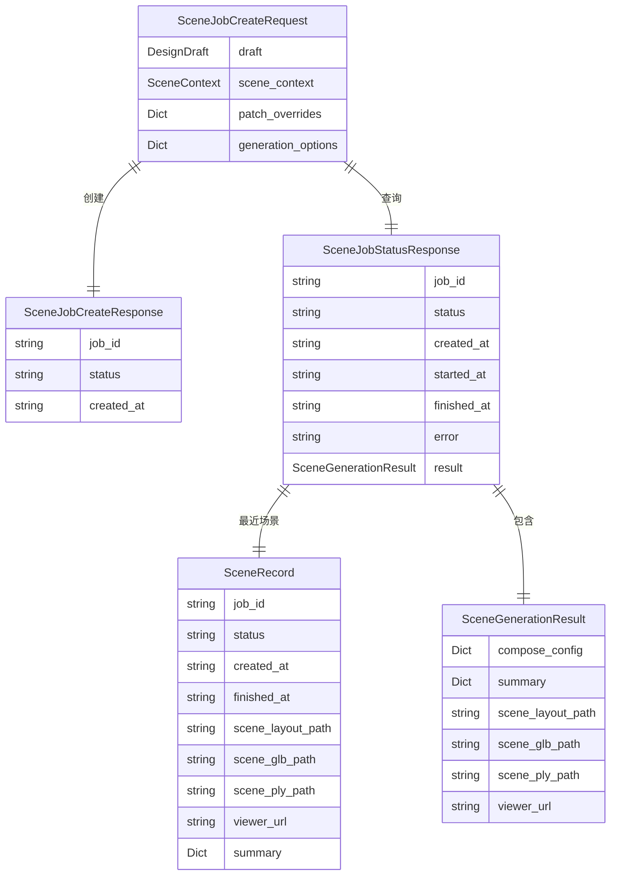

**图表来源**
- [main.py:53-57](file://web/api/main.py#L53-L57)
- [main.py:188-221](file://web/api/main.py#L188-L221)
- [design_types.py:340-368](file://src/roadgen3d/services/design_types.py#L340-L368)

**章节来源**
- [main.py:188-221](file://web/api/main.py#L188-L221)
- [design_types.py:340-368](file://src/roadgen3d/services/design_types.py#L340-L368)

### 前端工作台实现

前端工作台提供了直观的用户界面，支持作业状态轮询、结果展示和操作控制。

#### 状态轮询机制

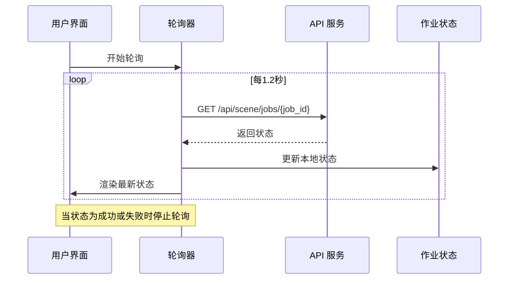

**图表来源**
- [app.ts:709-729](file://web/workbench/src/app.ts#L709-L729)
- [types.ts:188-189](file://web/workbench/src/types.ts#L188-L189)

#### 作业面板渲染

前端工作台实现了动态的作业面板渲染，支持多种视图模式：

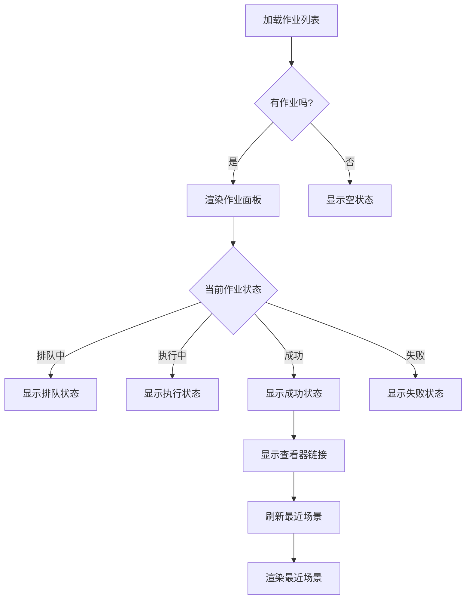

**图表来源**
- [app.ts:1024-1050](file://web/workbench/src/app.ts#L1024-L1050)
- [app.ts:731-735](file://web/workbench/src/app.ts#L731-L735)

**章节来源**
- [app.ts:709-729](file://web/workbench/src/app.ts#L709-L729)
- [app.ts:1024-1050](file://web/workbench/src/app.ts#L1024-L1050)

## 英雄芯片步骤指示器

**新增** 英雄芯片步骤指示器是场景任务面板的重要创新，提供了直观的工作流程可视化导航。

### 步骤指示器设计

英雄芯片指示器位于工作台顶部，采用水平排列的圆形芯片设计，每个芯片代表一个工作阶段：

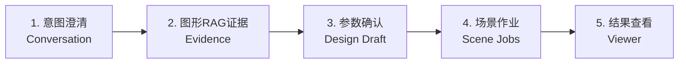

每个芯片都包含以下状态：
- **未完成状态**：灰色背景，带编号
- **进行中状态**：强调色背景，加粗字体
- **已完成状态**：绿色背景，显示勾选符号

### 工作流程计算逻辑

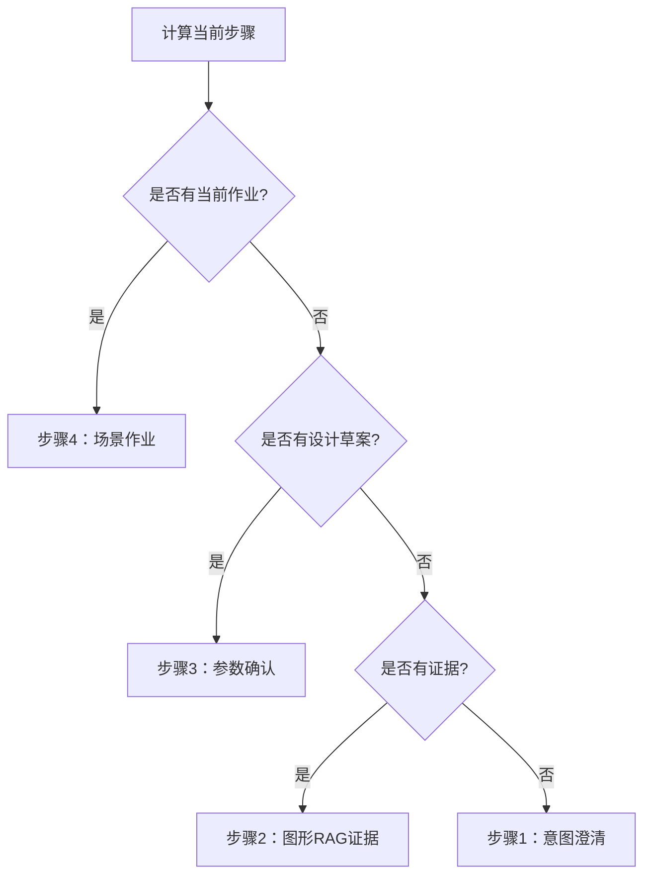

**图表来源**
- [app.ts:87-92](file://web/workbench/src/app.ts#L87-L92)
- [app.ts:109-117](file://web/workbench/src/app.ts#L109-L117)

### 自动标签页切换

英雄芯片指示器与标签页系统深度集成，能够根据当前工作流程自动切换到相应的标签页：

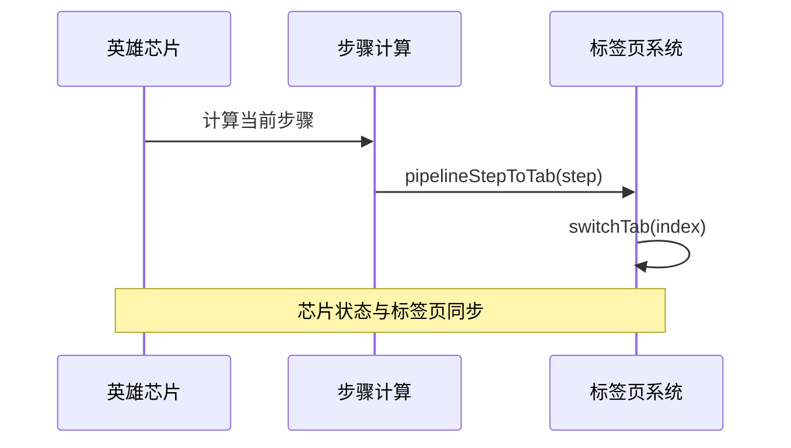

**图表来源**
- [app.ts:94-97](file://web/workbench/src/app.ts#L94-L97)
- [app.ts:99-107](file://web/workbench/src/app.ts#L99-L107)

### 交互功能

英雄芯片指示器支持用户交互：
- **点击芯片**：直接跳转到对应的工作标签页
- **状态切换**：根据工作流程自动更新芯片状态
- **响应式设计**：在小屏幕设备上自动调整布局

**章节来源**
- [app.ts:87-117](file://web/workbench/src/app.ts#L87-L117)
- [style.css:115-141](file://web/workbench/src/style.css#L115-L141)

## 标签页系统

**更新** 场景任务面板现在位于 RoadGen3D 工作台的标签页系统中，采用五标签页布局设计，与英雄芯片指示器形成完整的可视化导航系统。

### 标签页布局结构

标签页系统采用线性布局，包含五个主要标签：


每个标签页都有对应的 DOM 结构和数据属性：

| 标签页 | 数据属性 | 标签名 | 默认激活状态 | 对应英雄芯片 |
|--------|----------|--------|-------------|-------------|
| Conversation | data-tab="0" | Conversation | ✅ 激活 | 芯片1 |
| Scene Setup | data-tab="1" | Scene Setup | ❌ 未激活 | 芯片1 |
| Evidence | data-tab="2" | Evidence | ❌ 未激活 | 芯片2 |
| Design Draft | data-tab="3" | Design Draft | ❌ 未激活 | 芯片3 |
| Scene Jobs | data-tab="4" | Scene Jobs | ❌ 未激活 | 芯片4 |

### 标签页激活逻辑

标签页系统的核心激活逻辑在 `app.ts` 中实现：

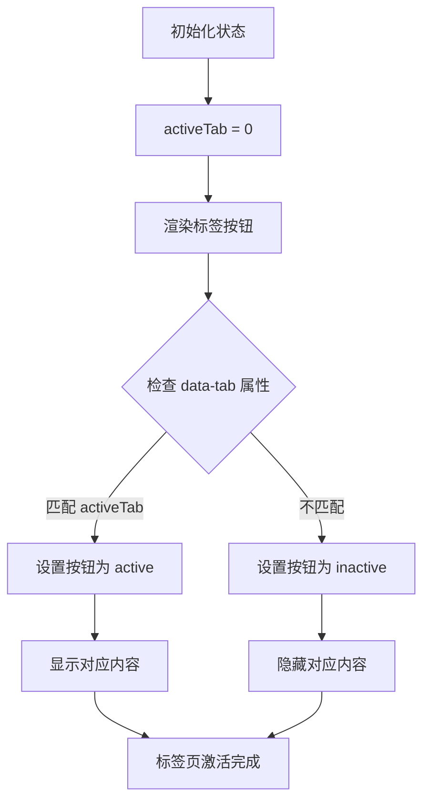

**图表来源**
- [app.ts:84](file://web/workbench/src/app.ts#L84)
- [app.ts:99-107](file://web/workbench/src/app.ts#L99-L107)

### 标签页切换机制

标签页切换通过事件处理器实现，支持用户交互和程序化切换：

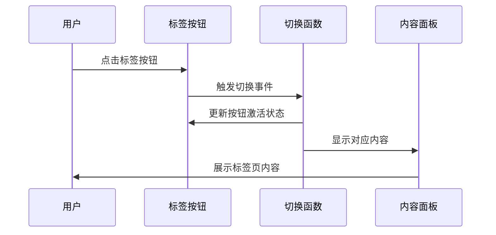

**图表来源**
- [app.ts:396-410](file://web/workbench/src/app.ts#L396-L410)
- [app.ts:99-107](file://web/workbench/src/app.ts#L99-L107)

### 标签页样式设计

标签页系统采用现代化的样式设计，支持响应式布局：

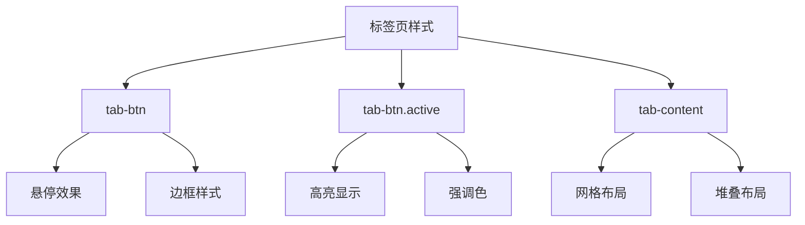

**图表来源**
- [style.css:707-735](file://web/workbench/src/style.css#L707-L735)
- [style.css:738-746](file://web/workbench/src/style.css#L738-L746)

**章节来源**
- [app.ts:162-168](file://web/workbench/src/app.ts#L162-L168)
- [app.ts:84](file://web/workbench/src/app.ts#L84)
- [app.ts:99-107](file://web/workbench/src/app.ts#L99-L107)
- [style.css:707-735](file://web/workbench/src/style.css#L707-L735)

## 作业状态轮询机制

**更新** 作业状态轮询机制得到了显著改进，采用了常量定义的轮询间隔和终止状态集合，提高了系统的稳定性和效率。

### 轮询配置

轮询机制使用集中定义的常量：

```mermaid
graph TD
Config[轮询配置] --> Interval[POLL_INTERVAL_MS = 1200ms]
Config --> Terminal[TERMINAL_JOB_STATES = {"succeeded","failed"}]
Interval --> PollLoop[轮询循环]
Terminal --> StopCondition[停止条件]
PollLoop --> CheckStatus{检查作业状态}
CheckStatus --> |非终止状态| Wait[等待轮询间隔]
CheckStatus --> |终止状态| Stop[停止轮询]
Wait --> PollLoop
Stop --> Complete[轮询完成]
```

**图表来源**
- [types.ts:188-189](file://web/workbench/src/types.ts#L188-L189)
- [app.ts:805-826](file://web/workbench/src/app.ts#L805-L826)

### 轮询实现逻辑

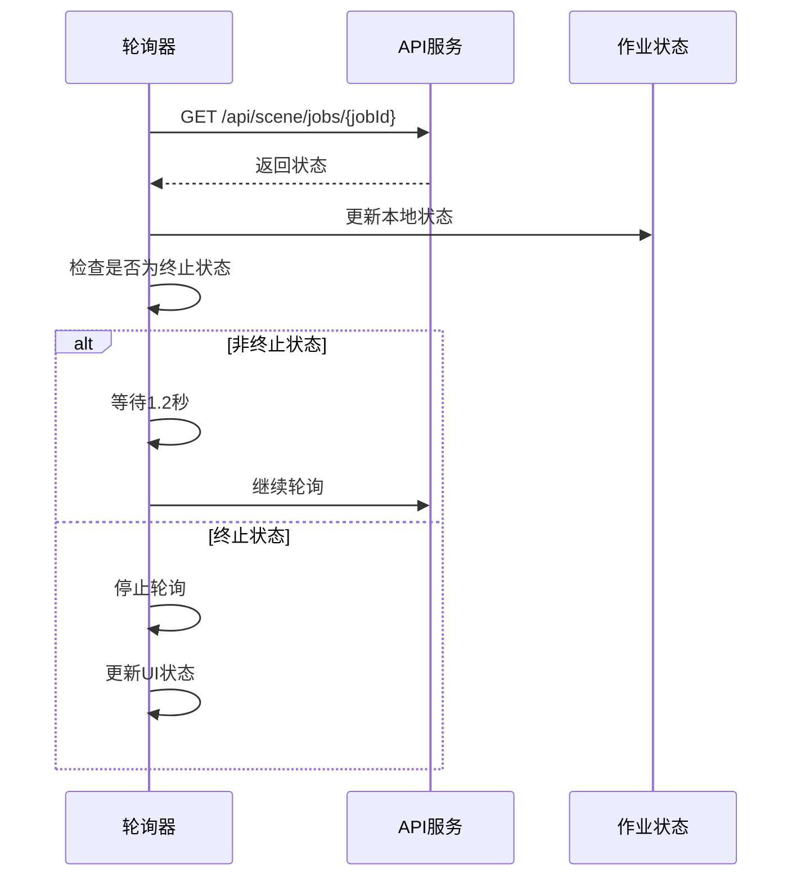

**图表来源**
- [app.ts:805-826](file://web/workbench/src/app.ts#L805-L826)

### 自动状态同步

轮询机制与英雄芯片指示器和标签页系统深度集成，实现了自动状态同步：

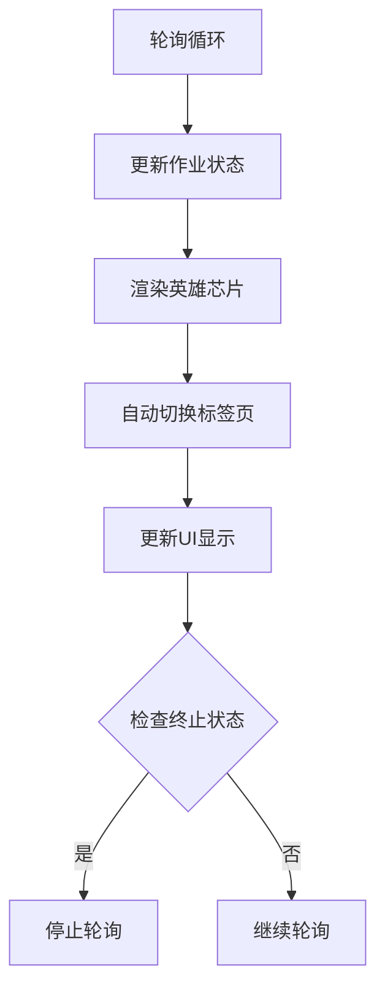

**图表来源**
- [app.ts:813-814](file://web/workbench/src/app.ts#L813-L814)
- [app.ts:113-116](file://web/workbench/src/app.ts#L113-L116)

**章节来源**
- [types.ts:188-189](file://web/workbench/src/types.ts#L188-L189)
- [app.ts:805-826](file://web/workbench/src/app.ts#L805-L826)

## 依赖关系分析

场景任务面板的依赖关系相对简单，主要依赖于设计类型定义和生成核心模块。

```mermaid
graph TB
subgraph "核心依赖"
DT[design_types.py]
DR[design_runtime.py]
GC[generation_core.py]
END
subgraph "服务层"
SJ[scene_jobs.py]
API[main.py]
END
subgraph "前端层"
APP[app.ts]
TYPES[types.ts]
UTILS[utils.ts]
STYLE[style.css]
END
subgraph "测试层"
TS1[test_scene_jobs.py]
TS2[test_web_viewer_dev.py]
END
DT --> SJ
DT --> API
DR --> SJ
GC --> DR
SJ --> APP
API --> APP
TYPES --> APP
UTILS --> APP
STYLE --> APP
TS1 --> SJ
TS2 --> DR
```

**图表来源**
- [scene_jobs.py:12-20](file://src/roadgen3d/services/scene_jobs.py#L12-L20)
- [design_runtime.py:1-20](file://src/roadgen3d/services/design_runtime.py#L1-L20)
- [generation_core.py:1-20](file://src/roadgen3d/services/generation_core.py#L1-L20)

**章节来源**
- [scene_jobs.py:1-20](file://src/roadgen3d/services/scene_jobs.py#L1-L20)
- [design_runtime.py:1-20](file://src/roadgen3d/services/design_runtime.py#L1-L20)

## 性能考虑

场景任务面板在设计时充分考虑了性能优化，采用了多种策略来提升用户体验：

### 1. 异步作业处理
- 使用后台线程池处理场景生成作业
- 支持并发作业执行，提高系统吞吐量
- 作业状态变更通过条件变量通知，避免轮询竞争

### 2. 内存优化
- 作业状态存储在内存字典中，访问速度快
- 作业结果包含必要的元数据，避免重复计算
- 最近场景列表支持限制大小，防止内存泄漏

### 3. 网络优化
- 前端轮询间隔为1.2秒，平衡实时性和网络负载
- API 响应使用 JSON 序列化，减少传输数据量
- 错误处理包含网络超时和重连机制

### 4. 缓存策略
- 设计草案支持缓存命中，避免重复计算
- 知识源状态缓存，减少 API 调用次数
- 最近场景列表缓存，提升页面加载速度

### 5. 标签页性能优化
**更新** 标签页系统采用懒加载机制，只有激活的标签页才会渲染其内容：
- 非激活标签页内容默认隐藏（display: none）
- 标签页切换时才进行 DOM 操作
- 支持响应式布局，在小屏幕设备上提供滚动支持

### 6. 英雄芯片优化
**新增** 英雄芯片指示器采用高效的 DOM 操作策略：
- 使用类名切换而非内联样式修改
- 批量更新所有芯片状态，避免多次重排
- 事件委托处理芯片点击事件，减少内存占用

**章节来源**
- [app.ts:104-106](file://web/workbench/src/app.ts#L104-L106)
- [style.css:749-760](file://web/workbench/src/style.css#L749-L760)

## 故障排除指南

### 常见问题及解决方案

#### 1. 作业长时间处于排队状态
**症状**: 作业状态一直显示为 "queued"
**可能原因**:
- 后台工作者未启动
- 系统资源不足
- 作业队列阻塞

**解决方法**:
- 检查后台工作者线程状态
- 监控系统 CPU 和内存使用情况
- 清理长时间未完成的作业

#### 2. 作业执行失败
**症状**: 作业状态显示为 "failed" 并带有错误信息
**可能原因**:
- 场景生成过程中发生异常
- 文件路径不存在
- 内存不足

**解决方法**:
- 查看详细的错误日志
- 验证场景配置参数
- 检查磁盘空间和权限

#### 3. 查看器无法打开
**症状**: 点击查看器链接无响应
**可能原因**:
- 查看器服务未启动
- 场景文件路径不正确
- 网络连接问题

**解决方法**:
- 确认查看器服务正常运行
- 验证场景文件是否存在
- 检查防火墙和代理设置

#### 4. 前端状态不同步
**症状**: 前端显示的作业状态与实际不符
**可能原因**:
- 轮询机制异常
- 网络请求失败
- 浏览器缓存问题

**解决方法**:
- 刷新页面重新加载
- 检查网络连接稳定性
- 清除浏览器缓存

#### 5. 标签页显示异常
**症状**: 场景任务面板无法正确显示或切换
**可能原因**:
- 标签页数据属性错误
- CSS 样式冲突
- JavaScript 事件绑定失败

**解决方法**:
- 检查 data-tab 属性是否正确设置
- 验证标签页样式文件加载
- 确认事件监听器正常工作

#### 6. 英雄芯片指示器不工作
**症状**: 英雄芯片状态不更新或点击无效
**可能原因**:
- computePipelineStep 函数异常
- renderHeroSteps 函数调用失败
- 事件监听器绑定问题

**解决方法**:
- 检查 computePipelineStep 的逻辑
- 验证 renderHeroSteps 的 DOM 操作
- 确认芯片点击事件正确绑定

**章节来源**
- [scene_jobs.py:162-170](file://src/roadgen3d/services/scene_jobs.py#L162-L170)
- [app.ts:709-729](file://web/workbench/src/app.ts#L709-L729)
- [app.ts:396-410](file://web/workbench/src/app.ts#L396-L410)

## 结论

场景任务面板是一个设计精良、功能完整的场景生成管理系统。它通过清晰的分层架构、完善的作业生命周期管理、丰富的结果展示功能和良好的错误处理机制，为用户提供了流畅的场景生成体验。

**更新** 最新的英雄芯片步骤指示器系统和标签页重构进一步提升了用户体验，将传统的静态标签导航升级为动态的可视化工作流程指导。Scene Jobs 标签现在位于工作台的第5个位置，与其他四个主要工作区域形成完整的五阶段工作流程：意图澄清 → 场景设置 → 证据检索 → 设计草案 → 场景作业。

系统的主要优势包括：
- **完整的作业生命周期管理**: 从创建到完成的全流程支持
- **实时状态跟踪**: 基于轮询机制的状态更新
- **丰富的结果展示**: 多种格式的场景数据输出
- **灵活的查看器集成**: 支持在线场景浏览
- **健壮的错误处理**: 完善的异常捕获和恢复机制
- **现代化的标签页系统**: 直观的工作流导航和管理
- **智能的英雄芯片指示器**: 可视化的工作流程指导和自动导航

未来可以考虑的改进方向：
- 添加作业取消和重试机制
- 实现更精细的作业优先级管理
- 增强作业监控和性能统计功能
- 支持分布式作业执行
- 提供更丰富的日志查看和分析工具
- 扩展英雄芯片指示器以支持更多工作区域
- 实现更智能的工作流程预测和建议功能