# 场景任务面板

<cite>
**本文档引用的文件**
- [scene_jobs.py](file://src/roadgen3d/services/scene_jobs.py)
- [design_types.py](file://src/roadgen3d/services/design_types.py)
- [main.py](file://web/api/main.py)
- [app.ts](file://web/workbench/src/app.ts)
- [types.ts](file://web/workbench/src/types.ts)
- [utils.ts](file://web/workbench/src/utils.ts)
- [web_viewer_dev.py](file://src/roadgen3d/web_viewer_dev.py)
- [design_runtime.py](file://src/roadgen3d/services/design_runtime.py)
- [generation_core.py](file://src/roadgen3d/services/generation_core.py)
- [test_scene_jobs.py](file://tests/test_scene_jobs.py)
- [test_web_viewer_dev.py](file://tests/test_web_viewer_dev.py)
</cite>

## 目录
1. [简介](#简介)
2. [项目结构](#项目结构)
3. [核心组件](#核心组件)
4. [架构概览](#架构概览)
5. [详细组件分析](#详细组件分析)
6. [依赖关系分析](#依赖关系分析)
7. [性能考虑](#性能考虑)
8. [故障排除指南](#故障排除指南)
9. [结论](#结论)

## 简介

场景任务面板是 RoadGen3D 项目中的核心组件，负责管理场景作业的完整生命周期。该面板提供了从任务创建、状态轮询到结果获取的完整工作流程，支持多种作业状态跟踪（排队中、执行中、成功、失败），并集成了最近场景列表管理、结果展示和查看器集成功能。

该系统采用前后端分离架构，前端使用 TypeScript 和现代浏览器技术，后端基于 Python FastAPI 提供 RESTful API。整个系统支持异步作业处理、实时状态更新和丰富的可视化反馈。

## 项目结构

场景任务面板涉及多个层次的组件协作：

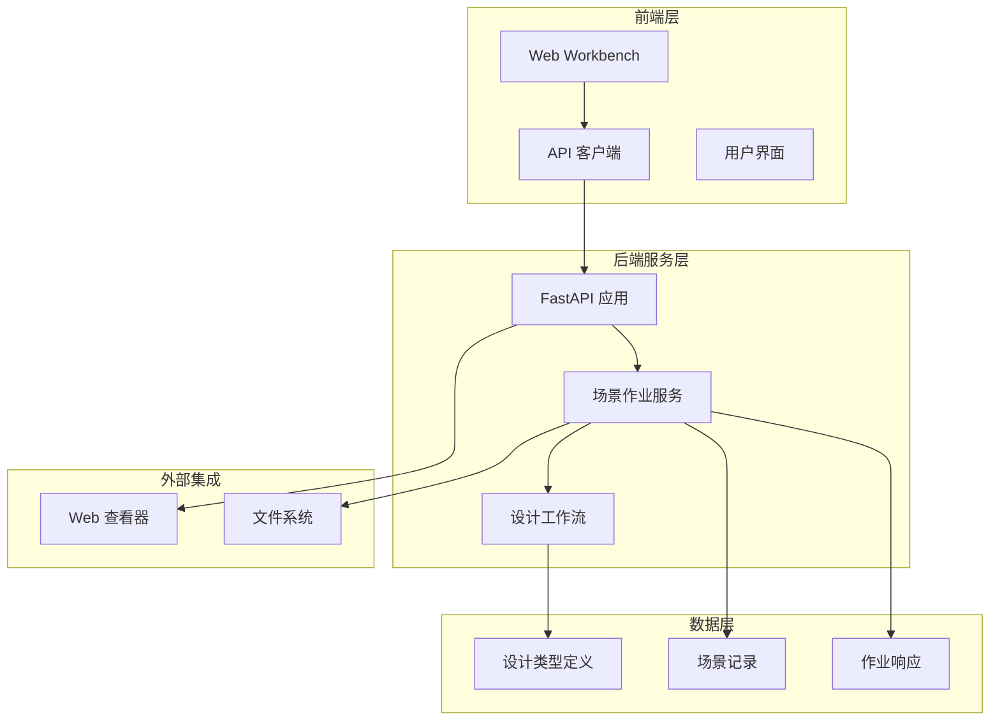

**图表来源**
- [main.py:81-267](file://web/api/main.py#L81-L267)
- [scene_jobs.py:42-204](file://src/roadgen3d/services/scene_jobs.py#L42-L204)

**章节来源**
- [main.py:1-286](file://web/api/main.py#L1-L286)
- [scene_jobs.py:1-205](file://src/roadgen3d/services/scene_jobs.py#L1-L205)

## 核心组件

场景任务面板由以下核心组件构成：

### 1. 场景作业服务 (SceneJobService)
负责管理场景生成作业的完整生命周期，包括作业提交、状态跟踪、结果处理等。

### 2. 设计类型系统
提供统一的数据结构定义，确保前后端数据传输的一致性和完整性。

### 3. Web API 接口
提供 RESTful API 端点，支持作业创建、状态查询、结果获取等功能。

### 4. 前端工作台
提供用户交互界面，支持作业状态轮询、结果展示和操作控制。

### 5. Web 查看器集成
支持场景结果的在线查看和交互式浏览。

**章节来源**
- [scene_jobs.py:42-204](file://src/roadgen3d/services/scene_jobs.py#L42-L204)
- [design_types.py:307-368](file://src/roadgen3d/services/design_types.py#L307-L368)
- [main.py:188-221](file://web/api/main.py#L188-L221)

## 架构概览

场景任务面板采用分层架构设计，各层职责明确且松耦合：

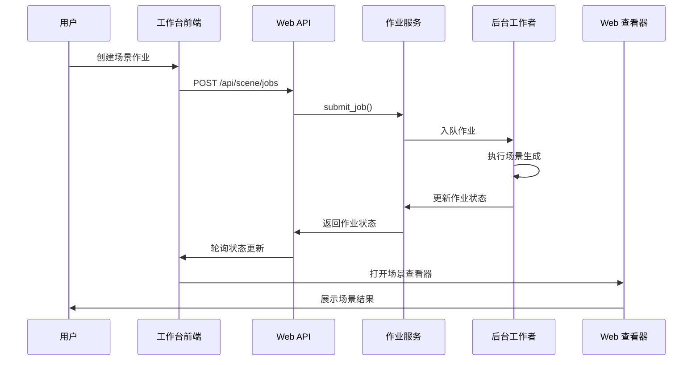

**图表来源**
- [app.ts:484-522](file://web/workbench/src/app.ts#L484-L522)
- [main.py:188-201](file://web/api/main.py#L188-L201)
- [scene_jobs.py:144-178](file://src/roadgen3d/services/scene_jobs.py#L144-L178)

## 详细组件分析

### 场景作业服务 (SceneJobService)

SceneJobService 是整个场景任务面板的核心组件，负责管理场景生成作业的完整生命周期。

#### 数据结构设计

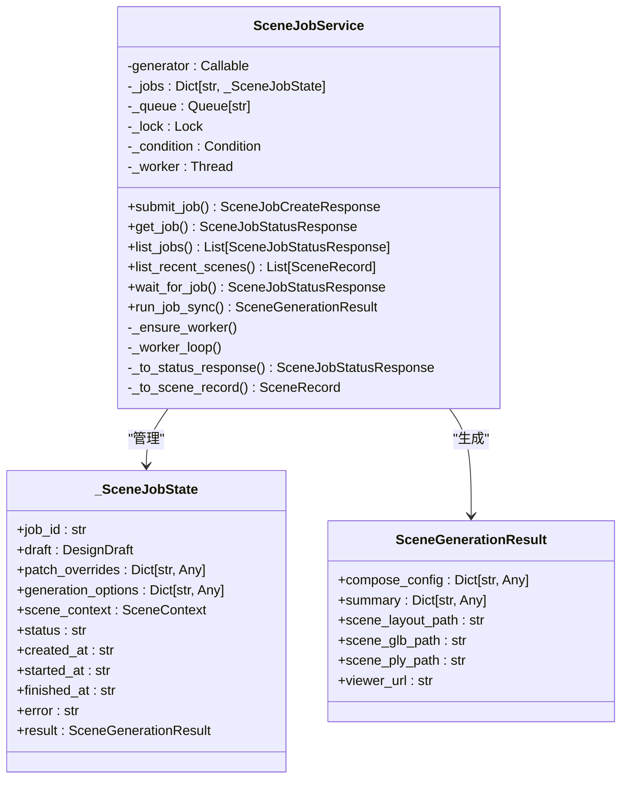

**图表来源**
- [scene_jobs.py:27-204](file://src/roadgen3d/services/scene_jobs.py#L27-L204)
- [design_types.py:307-317](file://src/roadgen3d/services/design_types.py#L307-L317)

#### 作业状态管理

作业状态在内部以字符串形式维护，支持以下状态转换：

```mermaid
stateDiagram-v2
[*] --> queued : 提交作业
queued --> running : 后台工作者开始执行
running --> succeeded : 生成成功
running --> failed : 生成失败
succeeded --> [*]
failed --> [*]
note right of queued : 作业已入队<br/>等待执行
note right of running : 作业正在执行<br/>生成场景
note right of succeeded : 作业完成<br/>生成成功
note right of failed : 作业失败<br/>生成异常
```

**图表来源**
- [scene_jobs.py:34-39](file://src/roadgen3d/services/scene_jobs.py#L34-L39)
- [scene_jobs.py:144-178](file://src/roadgen3d/services/scene_jobs.py#L144-L178)

#### 异步作业执行

作业服务使用后台线程池实现异步执行，支持并发作业处理：

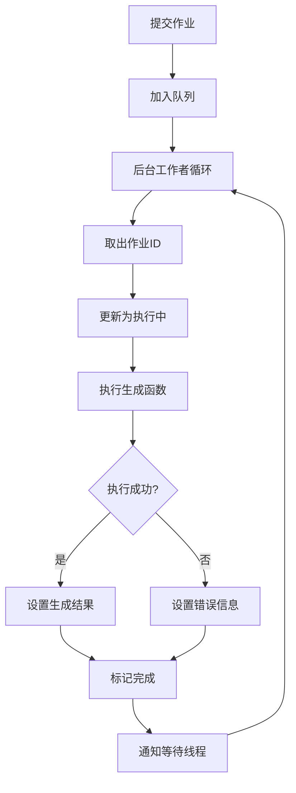

**图表来源**
- [scene_jobs.py:144-178](file://src/roadgen3d/services/scene_jobs.py#L144-L178)
- [scene_jobs.py:102-136](file://src/roadgen3d/services/scene_jobs.py#L102-L136)

**章节来源**
- [scene_jobs.py:42-204](file://src/roadgen3d/services/scene_jobs.py#L42-L204)

### Web API 接口设计

Web API 提供了完整的 RESTful 接口，支持场景作业的创建、查询和管理。

#### API 端点定义

| 端点 | 方法 | 功能描述 |
|------|------|----------|
| `/api/scene/jobs` | POST | 创建新的场景作业 |
| `/api/scene/jobs` | GET | 获取作业列表 |
| `/api/scene/jobs/{job_id}` | GET | 获取特定作业状态 |
| `/api/scenes/recent` | GET | 获取最近生成的场景 |

#### 请求响应模型

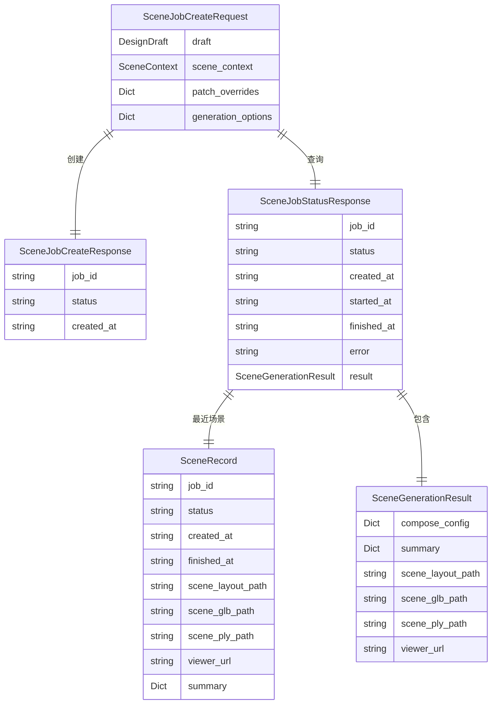

**图表来源**
- [main.py:53-57](file://web/api/main.py#L53-L57)
- [main.py:188-221](file://web/api/main.py#L188-L221)
- [design_types.py:340-368](file://src/roadgen3d/services/design_types.py#L340-L368)

**章节来源**
- [main.py:188-221](file://web/api/main.py#L188-L221)
- [design_types.py:340-368](file://src/roadgen3d/services/design_types.py#L340-L368)

### 前端工作台实现

前端工作台提供了直观的用户界面，支持作业状态轮询、结果展示和操作控制。

#### 状态轮询机制

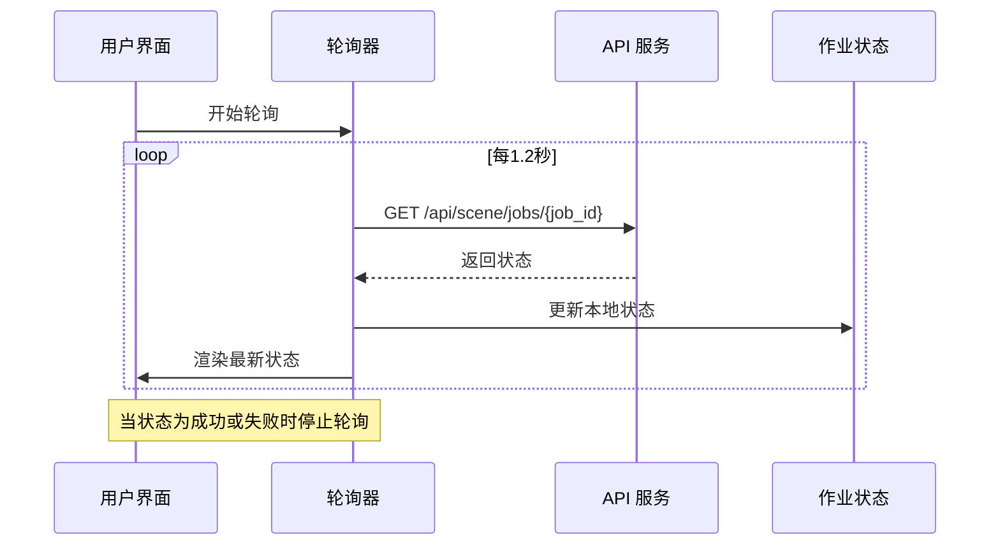

**图表来源**
- [app.ts:709-729](file://web/workbench/src/app.ts#L709-L729)
- [types.ts:188-189](file://web/workbench/src/types.ts#L188-L189)

#### 作业面板渲染

前端工作台实现了动态的作业面板渲染，支持多种视图模式：

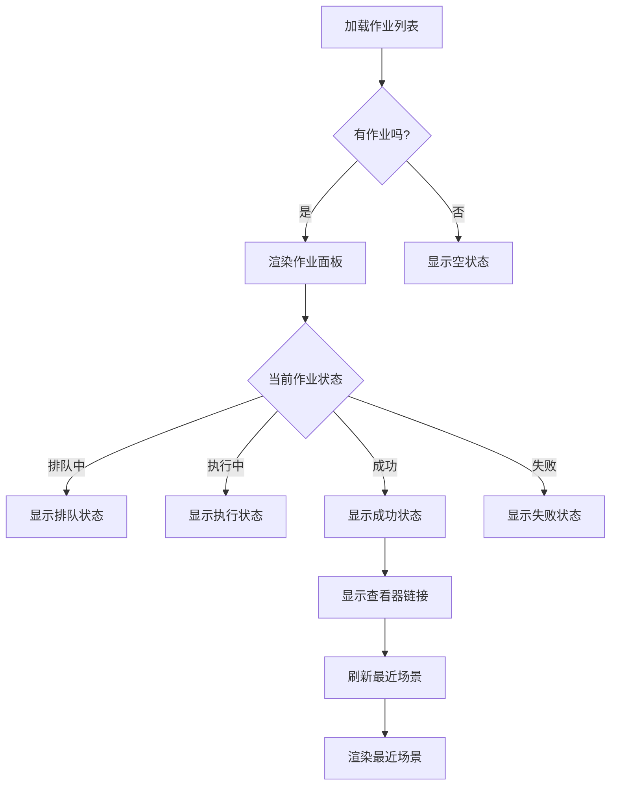

**图表来源**
- [app.ts:1024-1050](file://web/workbench/src/app.ts#L1024-L1050)
- [app.ts:731-735](file://web/workbench/src/app.ts#L731-L735)

**章节来源**
- [app.ts:709-729](file://web/workbench/src/app.ts#L709-L729)
- [app.ts:1024-1050](file://web/workbench/src/app.ts#L1024-L1050)

### 结果展示与查看器集成

系统提供了丰富的结果展示功能，支持多种格式的场景数据输出和查看器集成。

#### 场景结果数据结构

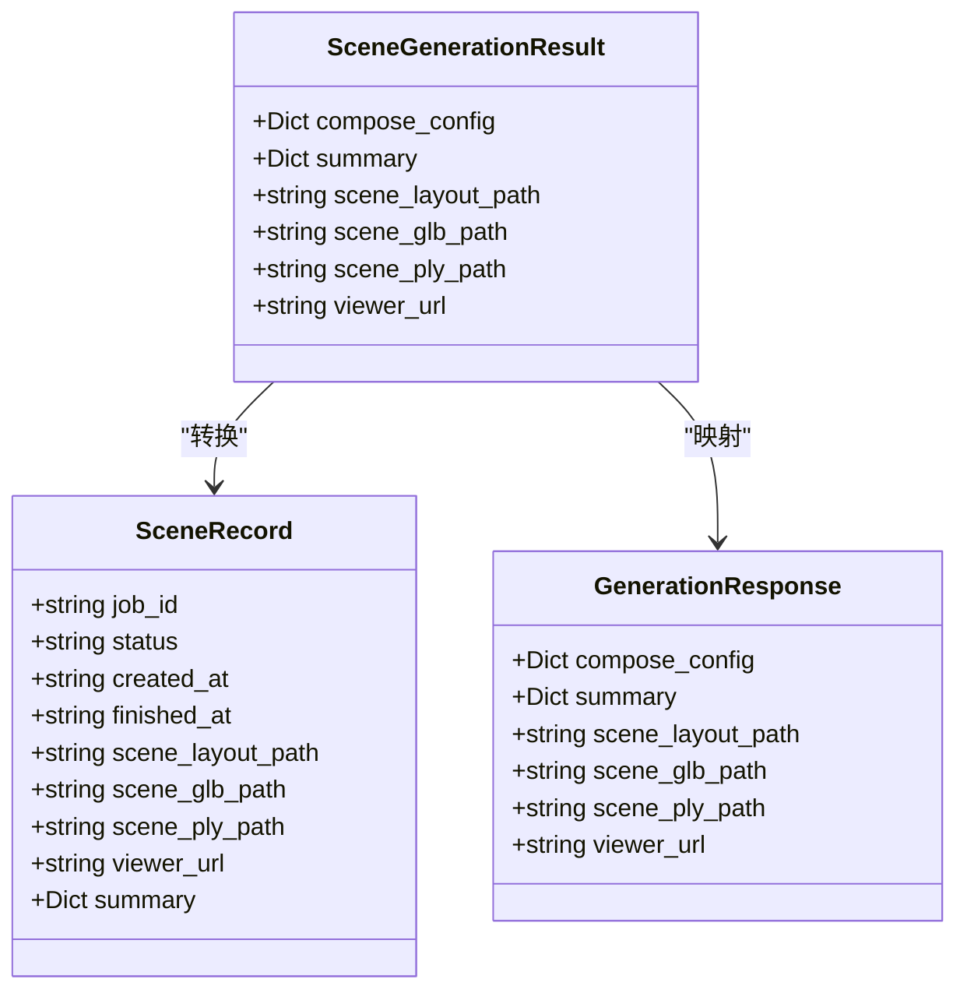

**图表来源**
- [design_types.py:307-317](file://src/roadgen3d/services/design_types.py#L307-L317)
- [design_types.py:322-334](file://src/roadgen3d/services/design_types.py#L322-L334)
- [design_types.py:132-139](file://src/roadgen3d/services/design_types.py#L132-L139)

#### 查看器 URL 生成

系统支持自动化的查看器 URL 生成，确保用户可以无缝访问生成的场景：

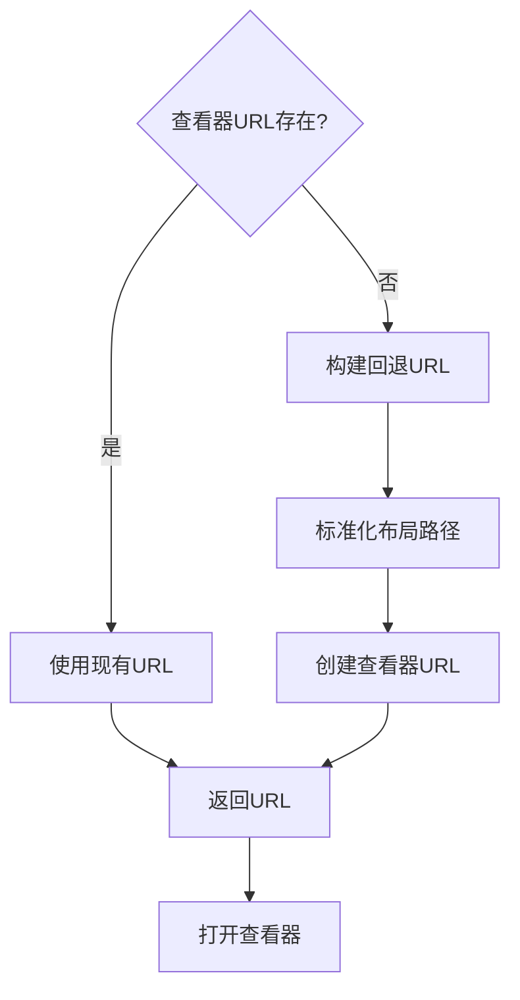

**图表来源**
- [utils.ts:125-135](file://web/workbench/src/utils.ts#L125-L135)
- [web_viewer_dev.py:222-251](file://src/roadgen3d/web_viewer_dev.py#L222-L251)

**章节来源**
- [design_runtime.py:190-219](file://src/roadgen3d/services/design_runtime.py#L190-L219)
- [generation_core.py:228-251](file://src/roadgen3d/services/generation_core.py#L228-L251)
- [web_viewer_dev.py:222-251](file://src/roadgen3d/web_viewer_dev.py#L222-L251)

### 最近场景列表管理

系统维护了一个最近生成场景的列表，支持快速访问和历史记录管理。

#### 最近场景数据结构

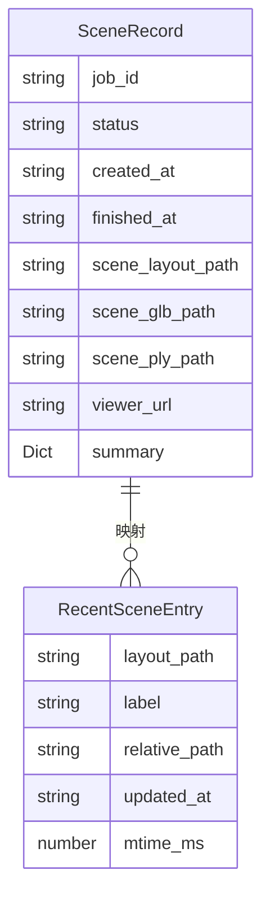

**图表来源**
- [design_types.py:322-334](file://src/roadgen3d/services/design_types.py#L322-L334)
- [web_viewer_dev.py:143-154](file://src/roadgen3d/web_viewer_dev.py#L143-L154)

#### 场景发现算法

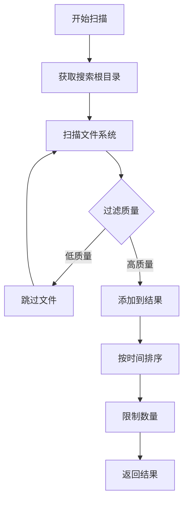

**图表来源**
- [web_viewer_dev.py:157-174](file://src/roadgen3d/web_viewer_dev.py#L157-L174)
- [web_viewer_dev.py:177-184](file://src/roadgen3d/web_viewer_dev.py#L177-L184)

**章节来源**
- [web_viewer_dev.py:143-184](file://src/roadgen3d/web_viewer_dev.py#L143-L184)
- [test_web_viewer_dev.py:102-132](file://tests/test_web_viewer_dev.py#L102-L132)

## 依赖关系分析

场景任务面板的依赖关系相对简单，主要依赖于设计类型定义和生成核心模块。

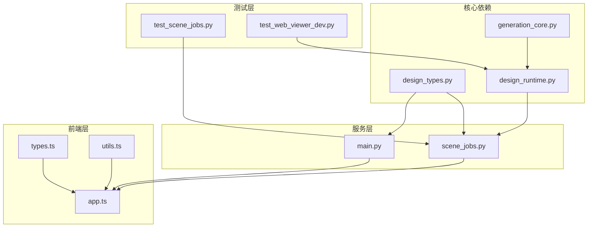

**图表来源**
- [scene_jobs.py:12-20](file://src/roadgen3d/services/scene_jobs.py#L12-L20)
- [design_runtime.py:1-20](file://src/roadgen3d/services/design_runtime.py#L1-L20)
- [generation_core.py:1-20](file://src/roadgen3d/services/generation_core.py#L1-L20)

**章节来源**
- [scene_jobs.py:1-20](file://src/roadgen3d/services/scene_jobs.py#L1-L20)
- [design_runtime.py:1-20](file://src/roadgen3d/services/design_runtime.py#L1-L20)

## 性能考虑

场景任务面板在设计时充分考虑了性能优化，采用了多种策略来提升用户体验：

### 1. 异步作业处理
- 使用后台线程池处理场景生成作业
- 支持并发作业执行，提高系统吞吐量
- 作业状态变更通过条件变量通知，避免轮询竞争

### 2. 内存优化
- 作业状态存储在内存字典中，访问速度快
- 作业结果包含必要的元数据，避免重复计算
- 最近场景列表支持限制大小，防止内存泄漏

### 3. 网络优化
- 前端轮询间隔为1.2秒，平衡实时性和网络负载
- API 响应使用 JSON 序列化，减少传输数据量
- 错误处理包含网络超时和重连机制

### 4. 缓存策略
- 设计草案支持缓存命中，避免重复计算
- 知识源状态缓存，减少 API 调用次数
- 最近场景列表缓存，提升页面加载速度

## 故障排除指南

### 常见问题及解决方案

#### 1. 作业长时间处于排队状态
**症状**: 作业状态一直显示为 "queued"
**可能原因**:
- 后台工作者未启动
- 系统资源不足
- 作业队列阻塞

**解决方法**:
- 检查后台工作者线程状态
- 监控系统 CPU 和内存使用情况
- 清理长时间未完成的作业

#### 2. 作业执行失败
**症状**: 作业状态显示为 "failed" 并带有错误信息
**可能原因**:
- 场景生成过程中发生异常
- 文件路径不存在
- 内存不足

**解决方法**:
- 查看详细的错误日志
- 验证场景配置参数
- 检查磁盘空间和权限

#### 3. 查看器无法打开
**症状**: 点击查看器链接无响应
**可能原因**:
- 查看器服务未启动
- 场景文件路径不正确
- 网络连接问题

**解决方法**:
- 确认查看器服务正常运行
- 验证场景文件是否存在
- 检查防火墙和代理设置

#### 4. 前端状态不同步
**症状**: 前端显示的作业状态与实际不符
**可能原因**:
- 轮询机制异常
- 网络请求失败
- 浏览器缓存问题

**解决方法**:
- 刷新页面重新加载
- 检查网络连接稳定性
- 清除浏览器缓存

**章节来源**
- [scene_jobs.py:162-170](file://src/roadgen3d/services/scene_jobs.py#L162-L170)
- [app.ts:709-729](file://web/workbench/src/app.ts#L709-L729)

## 结论

场景任务面板是一个设计精良、功能完整的场景生成管理系统。它通过清晰的分层架构、完善的作业生命周期管理、丰富的结果展示功能和良好的错误处理机制，为用户提供了流畅的场景生成体验。

系统的主要优势包括：
- **完整的作业生命周期管理**: 从创建到完成的全流程支持
- **实时状态跟踪**: 基于轮询机制的状态更新
- **丰富的结果展示**: 多种格式的场景数据输出
- **灵活的查看器集成**: 支持在线场景浏览
- **健壮的错误处理**: 完善的异常捕获和恢复机制

未来可以考虑的改进方向：
- 添加作业取消和重试机制
- 实现更精细的作业优先级管理
- 增强作业监控和性能统计功能
- 支持分布式作业执行
- 提供更丰富的日志查看和分析工具