# 场景设置面板

<cite>
**本文档引用的文件**
- [web/workbench/src/app.ts](file://web/workbench/src/app.ts)
- [web/workbench/src/types.ts](file://web/workbench/src/types.ts)
- [web/workbench/src/style.css](file://web/workbench/src/style.css)
- [src/roadgen3d/services/scene_context_service.py](file://src/roadgen3d/services/scene_context_service.py)
- [src/roadgen3d/china_cities.py](file://src/roadgen3d/china_cities.py)
- [src/roadgen3d/graph_templates.py](file://src/roadgen3d/graph_templates.py)
- [src/roadgen3d/reference_annotation.py](file://src/roadgen3d/reference_annotation.py)
- [src/roadgen3d/osm_ingest.py](file://src/roadgen3d/osm_ingest.py)
- [src/roadgen3d/services/design_types.py](file://src/roadgen3d/services/design_types.py)
- [src/roadgen3d/services/generation_api.py](file://src/roadgen3d/services/generation_api.py)
- [web/api/main.py](file://web/api/main.py)
- [web/viewer/src/scene-graph.ts](file://web/viewer/src/scene-graph.ts)
</cite>

## 更新摘要
**变更内容**
- 更新标签页系统结构：场景设置面板现位于第二个标签（Scene Setup）
- 新增标签页导航机制和样式系统
- 更新标签页激活逻辑和状态管理
- 新增标签页响应式设计支持

## 目录
1. [简介](#简介)
2. [标签页系统架构](#标签页系统架构)
3. [项目结构](#项目结构)
4. [核心组件](#核心组件)
5. [架构概览](#架构概览)
6. [详细组件分析](#详细组件分析)
7. [依赖关系分析](#依赖关系分析)
8. [性能考虑](#性能考虑)
9. [故障排除指南](#故障排除指南)
10. [结论](#结论)

## 简介

场景设置面板是 RoadGen3D 3D 道路生成系统中的关键界面组件，负责为用户提供多种场景布局模式的选择和配置。该面板支持四种主要的布局模式：graph_template（图模板）、osm（开放街道地图）、metaurban（元城市）和 template（模板），每种模式都有其特定的应用场景和技术实现。

面板现在位于标签页系统中的第二个标签（Scene Setup），采用现代化的标签页布局结构，提供直观的用户界面，允许用户选择城市、配置 AOI 区域、预览图模板和参考计划，以及进行参数验证和错误处理。通过集成多种数据源和算法，场景设置面板能够为不同需求的用户提供灵活的场景生成解决方案。

## 标签页系统架构

场景设置面板现在集成在完整的标签页系统中，提供五个主要功能区域：

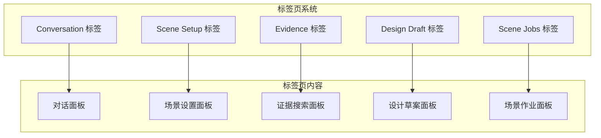

**图表来源**
- [web/workbench/src/app.ts:162-168](file://web/workbench/src/app.ts#L162-L168)
- [web/workbench/src/app.ts:204-263](file://web/workbench/src/app.ts#L204-L263)

标签页系统采用状态驱动的架构设计：

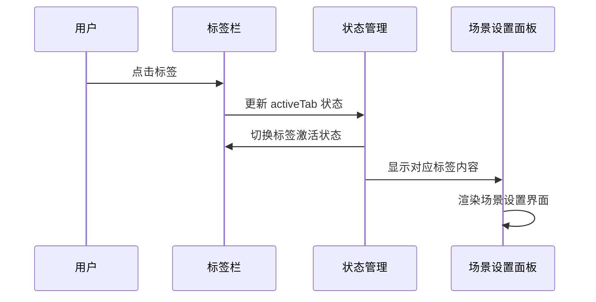

**图表来源**
- [web/workbench/src/app.ts:99-107](file://web/workbench/src/app.ts#L99-L107)
- [web/workbench/src/app.ts:396-410](file://web/workbench/src/app.ts#L396-L410)

## 项目结构

场景设置面板位于 Web 工作台前端应用中，采用模块化的 TypeScript 架构设计，现在集成在标签页系统中：

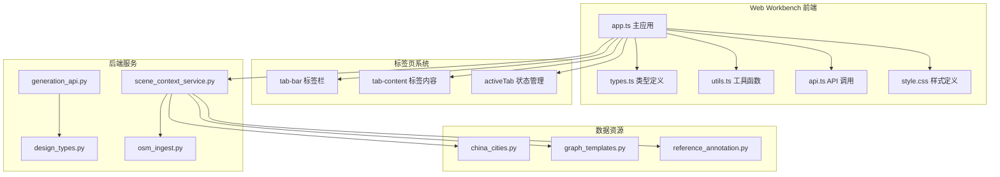

**图表来源**
- [web/workbench/src/app.ts:58-85](file://web/workbench/src/app.ts#L58-L85)
- [web/workbench/src/style.css:696-761](file://web/workbench/src/style.css#L696-L761)

**章节来源**
- [web/workbench/src/app.ts:58-248](file://web/workbench/src/app.ts#L58-L248)
- [web/workbench/src/types.ts:41-93](file://web/workbench/src/types.ts#L41-L93)

## 核心组件

场景设置面板由多个相互协作的组件构成，每个组件负责特定的功能领域：

### 标签页导航系统
提供五个功能标签的切换和管理：
- **Conversation (0)**: 对话和设计意图澄清
- **Scene Setup (1)**: 场景设置和参数配置（当前面板）
- **Evidence (2)**: 知识证据搜索和管理
- **Design Draft (3)**: 设计草案参数确认
- **Scene Jobs (4)**: 场景生成作业管理

### 布局模式选择器
提供四种场景布局模式的切换功能：
- **graph_template**: 基于内置图模板的街道生成
- **osm**: 基于开放街道地图数据的区域生成
- **metaurban**: 基于参考计划的元城市风格生成
- **template**: 简化的模板场景生成

### 城市选择器
集成中国主要城市的地理信息系统，提供精确的边界框坐标：
- 支持 80+ 个主要城市
- 自动边界框填充功能
- 默认城市设置机制

### 图模板预览器
展示图模板的可视化预览：
- 实时模板渲染
- 统计信息显示
- 错误状态处理

### AOI 区域设置器
提供精确的地理坐标输入和验证：
- 经纬度输入验证
- 边界框计算
- 数据完整性检查

**章节来源**
- [web/workbench/src/app.ts:162-168](file://web/workbench/src/app.ts#L162-L168)
- [web/workbench/src/app.ts:204-263](file://web/workbench/src/app.ts#L204-L263)
- [web/workbench/src/types.ts:41-47](file://web/workbench/src/types.ts#L41-L47)

## 架构概览

场景设置面板采用分层架构设计，实现了清晰的关注点分离，现在集成在标签页系统中：

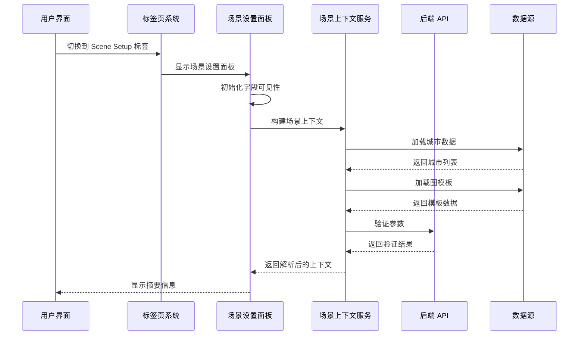

**图表来源**
- [web/workbench/src/app.ts:887-910](file://web/workbench/src/app.ts#L887-L910)
- [web/workbench/src/app.ts:1115-1172](file://web/workbench/src/app.ts#L1115-L1172)
- [src/roadgen3d/services/scene_context_service.py:279-331](file://src/roadgen3d/services/scene_context_service.py#L279-L331)

该架构确保了以下特性：
- **模块化设计**: 每个组件职责明确，便于维护和扩展
- **标签页状态管理**: 清晰的标签页切换和状态同步机制
- **数据流控制**: 清晰的输入输出管道，便于调试和测试
- **错误处理**: 全面的异常捕获和用户反馈机制
- **性能优化**: 懒加载和缓存策略减少不必要的网络请求

## 详细组件分析

### 标签页系统管理

场景设置面板现在集成在完整的标签页系统中，具有以下特点：

#### 标签页状态管理
系统使用状态驱动的方式管理标签页切换：

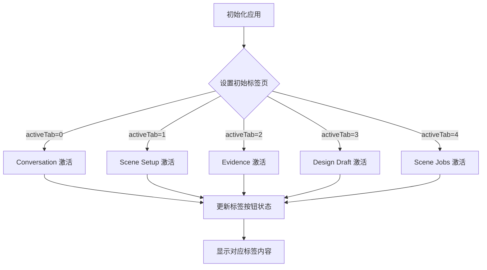

**图表来源**
- [web/workbench/src/app.ts:84-107](file://web/workbench/src/app.ts#L84-L107)
- [web/workbench/src/app.ts:396-410](file://web/workbench/src/app.ts#L396-L410)

#### 标签页样式系统
标签页具有完整的样式定义和交互效果：

**章节来源**
- [web/workbench/src/style.css:696-761](file://web/workbench/src/style.css#L696-L761)
- [web/workbench/src/app.ts:162-168](file://web/workbench/src/app.ts#L162-L168)

### 布局模式选择机制

场景设置面板支持四种不同的布局模式，每种模式都有其独特的特点和适用场景：

#### Graph Template 模式
基于内置图模板的街道生成模式，适用于需要精确控制街道几何形状的场景：

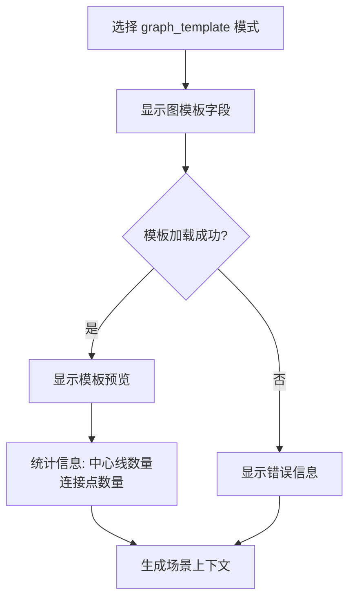

**图表来源**
- [web/workbench/src/app.ts:887-910](file://web/workbench/src/app.ts#L887-L910)
- [src/roadgen3d/graph_templates.py:96-105](file://src/roadgen3d/graph_templates.py#L96-L105)

#### OSM 模式
基于开放街道地图数据的区域生成模式，适用于真实城市环境的场景：

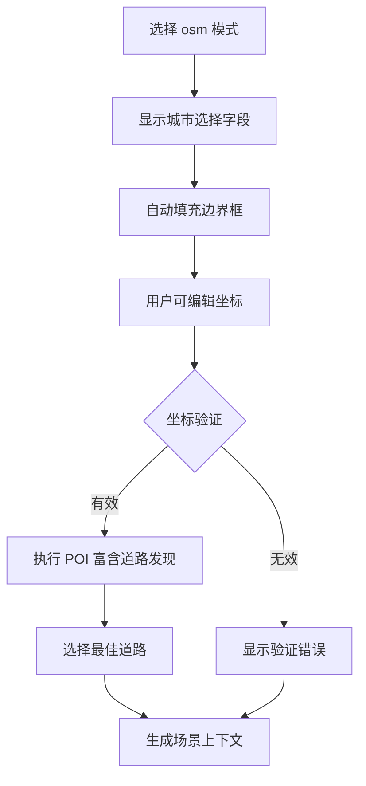

**图表来源**
- [web/workbench/src/app.ts:1168-1179](file://web/workbench/src/app.ts#L1168-L1179)
- [src/roadgen3d/services/scene_context_service.py:189-276](file://src/roadgen3d/services/scene_context_service.py#L189-L276)

#### MetaUrban 模式
基于参考计划的元城市风格生成模式，适用于需要复杂城市环境的场景：

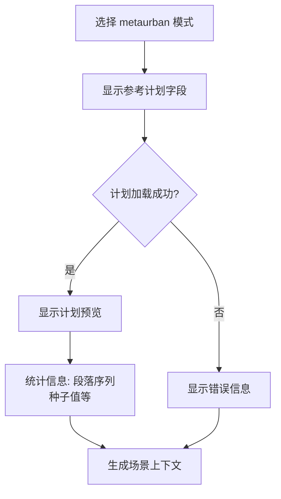

**图表来源**
- [web/workbench/src/app.ts:887-897](file://web/workbench/src/app.ts#L887-L897)
- [web/viewer/src/scene-graph.ts:3496-3512](file://web/viewer/src/scene-graph.ts#L3496-L3512)

#### Template 模式
简化的模板场景生成模式，适用于快速原型设计：

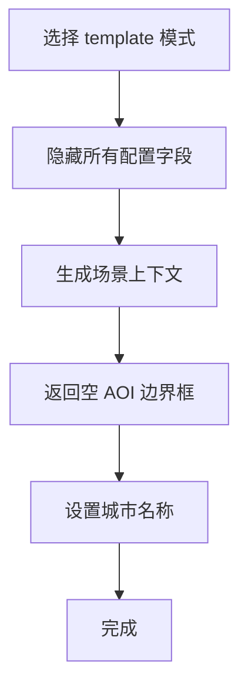

**图表来源**
- [web/workbench/src/app.ts:1159-1166](file://web/workbench/src/app.ts#L1159-L1166)

**章节来源**
- [web/workbench/src/app.ts:142-150](file://web/workbench/src/app.ts#L142-L150)
- [src/roadgen3d/services/scene_context_service.py:222-241](file://src/roadgen3d/services/scene_context_service.py#L222-L241)

### 城市选择功能

城市选择功能提供了完整的中国主要城市列表管理：

#### 城市注册表
系统内置了 80+ 个主要中国城市的地理信息：

| 城市 | 英文名称 | 省份 | 示例边界框 |
|------|----------|------|------------|
| 北京 | beijing | 北京市 | (116.397, 39.908, 116.402, 39.912) |
| 上海 | shanghai | 上海市 | (121.282, 31.166, 121.287, 31.170) |
| 广州 | guangzhou | 广东省 | (113.266, 23.128, 113.271, 23.132) |

#### 默认城市设置
系统采用智能的默认城市选择策略：

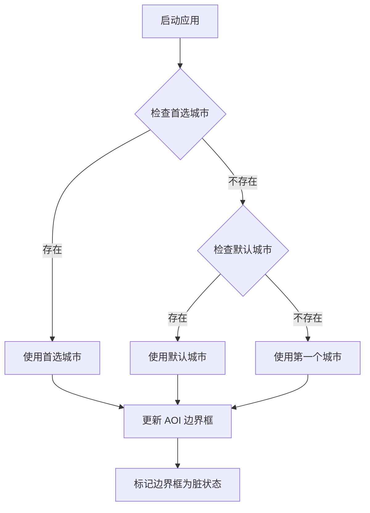

**图表来源**
- [web/workbench/src/app.ts:614-645](file://web/workbench/src/app.ts#L614-L645)
- [src/roadgen3d/china_cities.py:121-143](file://src/roadgen3d/china_cities.py#L121-L143)

#### 边界框自动填充
当用户选择城市时，系统会自动填充 AOI 边界框：

**章节来源**
- [web/workbench/src/app.ts:306-312](file://web/workbench/src/app.ts#L306-L312)
- [src/roadgen3d/china_cities.py:1-143](file://src/roadgen3d/china_cities.py#L1-L143)

### 图模板和参考计划选择流程

图模板和参考计划提供了两种不同的场景生成方式：

#### 图模板选择流程
图模板系统支持内置的街道图模板：

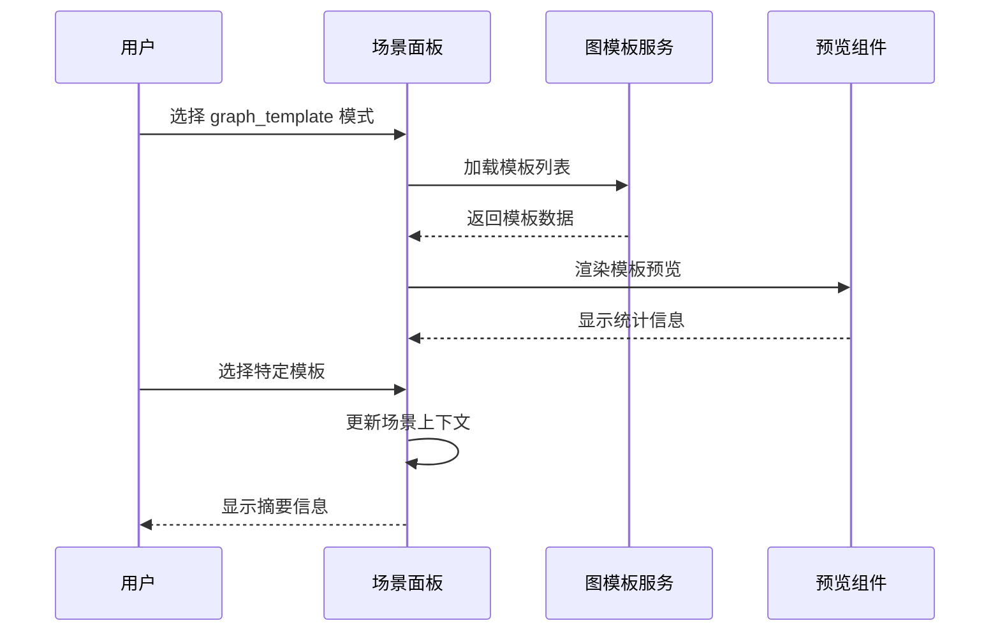

**图表来源**
- [web/workbench/src/app.ts:647-676](file://web/workbench/src/app.ts#L647-L676)
- [web/workbench/src/app.ts:976-1003](file://web/workbench/src/app.ts#L976-L1003)

#### 参考计划选择流程
参考计划系统提供了元城市风格的设计方案：

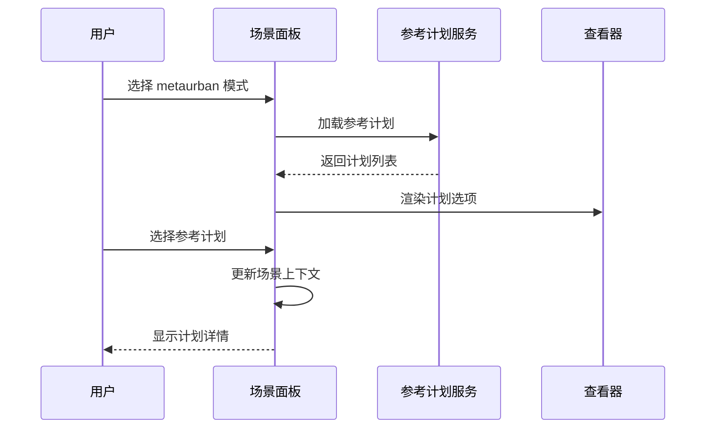

**图表来源**
- [web/workbench/src/app.ts:678-707](file://web/workbench/src/app.ts#L678-L707)
- [web/viewer/src/scene-graph.ts:3496-3512](file://web/viewer/src/scene-graph.ts#L3496-L3512)

**章节来源**
- [src/roadgen3d/graph_templates.py:15-119](file://src/roadgen3d/graph_templates.py#L15-L119)
- [src/roadgen3d/reference_annotation.py:749-775](file://src/roadgen3d/reference_annotation.py#L749-L775)

### OSM 模式下的 AOI 区域设置

OSM 模式提供了精确的地理区域控制功能：

#### 经纬度输入验证
系统实现了严格的坐标验证机制：

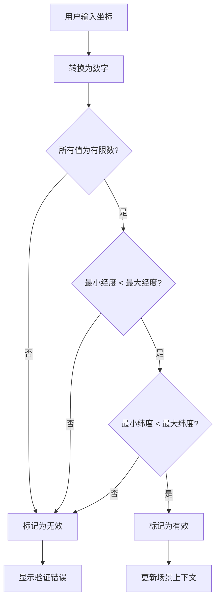

**图表来源**
- [web/workbench/src/app.ts:1168-1179](file://web/workbench/src/app.ts#L1168-L1179)

#### 边界框计算
系统支持多种边界框计算方式：

**章节来源**
- [src/roadgen3d/osm_ingest.py:103-123](file://src/roadgen3d/osm_ingest.py#L103-L123)
- [src/roadgen3d/services/scene_context_service.py:30-45](file://src/roadgen3d/services/scene_context_service.py#L30-L45)

### 场景上下文构建、参数验证和错误提示机制

场景上下文构建是整个系统的核心功能，负责将用户输入转换为可执行的场景配置：

#### 参数验证流程
系统实现了多层次的参数验证：

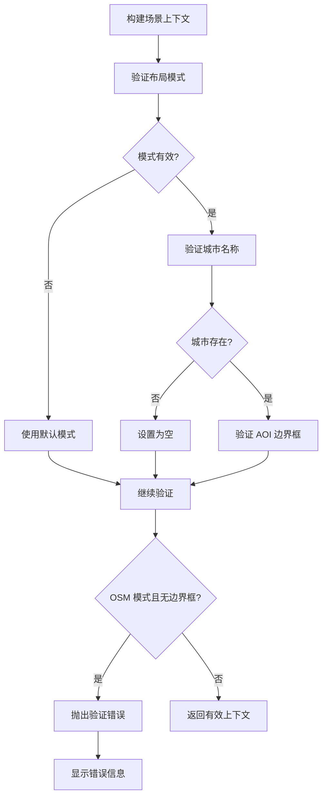

**图表来源**
- [web/workbench/src/app.ts:1123-1180](file://web/workbench/src/app.ts#L1123-L1180)
- [src/roadgen3d/services/design_types.py:222-241](file://src/roadgen3d/services/design_types.py#L222-L241)

#### 错误提示机制
系统提供了全面的错误处理和用户反馈：

**章节来源**
- [web/workbench/src/app.ts:496-498](file://web/workbench/src/app.ts#L496-L498)
- [src/roadgen3d/services/scene_context_service.py:214-216](file://src/roadgen3d/services/scene_context_service.py#L214-L216)

## 依赖关系分析

场景设置面板的依赖关系体现了清晰的分层架构，现在集成在标签页系统中：

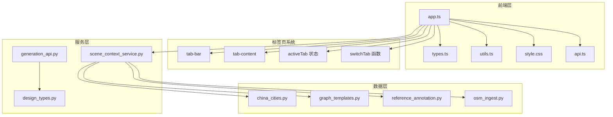

**图表来源**
- [web/workbench/src/app.ts:1-56](file://web/workbench/src/app.ts#L1-L56)
- [web/workbench/src/style.css:696-761](file://web/workbench/src/style.css#L696-L761)
- [src/roadgen3d/services/scene_context_service.py:1-25](file://src/roadgen3d/services/scene_context_service.py#L1-L25)

**章节来源**
- [web/workbench/src/types.ts:1-228](file://web/workbench/src/types.ts#L1-L228)
- [src/roadgen3d/services/design_types.py:1-368](file://src/roadgen3d/services/design_types.py#L1-L368)

## 性能考虑

场景设置面板在设计时充分考虑了性能优化，特别是在标签页系统集成方面：

### 标签页性能优化
- **延迟加载**: 标签页内容按需加载，避免一次性渲染所有面板
- **状态缓存**: 使用状态管理缓存标签页切换状态
- **DOM 复用**: 标签页内容在切换时保持 DOM 结构，提高切换性能

### 缓存策略
- **懒加载**: 城市列表、图模板和参考计划按需加载
- **本地存储**: 用户偏好设置和上次选择记录
- **增量更新**: 只在必要时重新计算和渲染

### 网络优化
- **批量请求**: 启动时并行加载多个数据源
- **错误重试**: 对网络请求实施指数退避重试
- **超时控制**: 合理的请求超时和取消机制

### 内存管理
- **对象池**: 复用 DOM 元素和数据对象
- **垃圾回收**: 及时清理不再使用的事件监听器
- **虚拟滚动**: 大列表的高效渲染

## 故障排除指南

### 标签页相关问题

#### 标签页切换失效
**症状**: 点击标签页无法切换内容
**原因**: JavaScript 事件绑定失败或状态管理错误
**解决**: 检查标签页事件处理器，确认 activeTab 状态正确更新

#### 标签页样式异常
**症状**: 标签页按钮显示不正确或响应式布局失效
**原因**: CSS 样式冲突或媒体查询问题
**解决**: 检查标签页样式定义，确认媒体查询条件

### 常见问题及解决方案

#### 城市列表加载失败
**症状**: 城市下拉菜单显示 "Cities unavailable"
**原因**: API 服务器不可用或网络连接问题
**解决**: 检查 API 服务状态，确认网络连接正常

#### 图模板加载失败
**症状**: 图模板预览显示 "未加载到 graph template"
**原因**: 模板文件缺失或格式错误
**解决**: 验证模板文件完整性，检查文件路径

#### AOI 边界框验证失败
**症状**: 显示 "经纬度输入无效"
**原因**: 坐标超出有效范围或格式错误
**解决**: 确保坐标在 WGS-84 格式范围内

#### 场景生成任务失败
**症状**: 生成任务状态显示 "failed"
**原因**: 场景上下文参数不兼容
**解决**: 检查场景上下文配置，确保参数有效性

**章节来源**
- [web/workbench/src/app.ts:638-644](file://web/workbench/src/app.ts#L638-L644)
- [web/workbench/src/app.ts:668-675](file://web/workbench/src/app.ts#L668-L675)
- [web/workbench/src/app.ts:496-498](file://web/workbench/src/app.ts#L496-L498)

## 结论

场景设置面板作为 RoadGen3D 系统的核心界面组件，成功实现了多种场景布局模式的统一管理和配置。通过精心设计的架构和完善的错误处理机制，该面板为用户提供了直观、可靠的场景生成体验。

系统的主要优势包括：
- **标签页集成**: 现代化的标签页系统提供更好的用户体验
- **灵活性**: 支持四种不同的布局模式，适应各种应用场景
- **易用性**: 直观的用户界面和智能的默认设置
- **可靠性**: 完善的参数验证和错误处理机制
- **可扩展性**: 模块化的架构设计便于功能扩展

未来可以进一步改进的方向包括增强实时预览功能、优化移动端适配、增加更多自定义选项等。这些改进将进一步提升用户体验和系统的实用性。

**更新** 本版本文档已更新以反映标签页系统变更，场景设置面板现在位于第二个标签（Scene Setup），具有完整的标签页导航和状态管理系统。