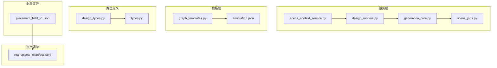
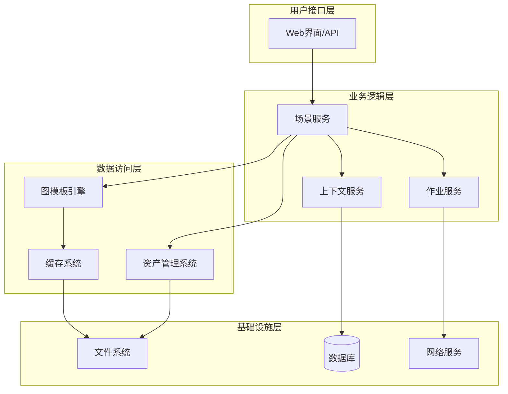
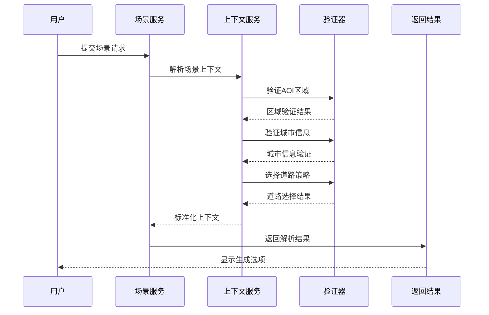
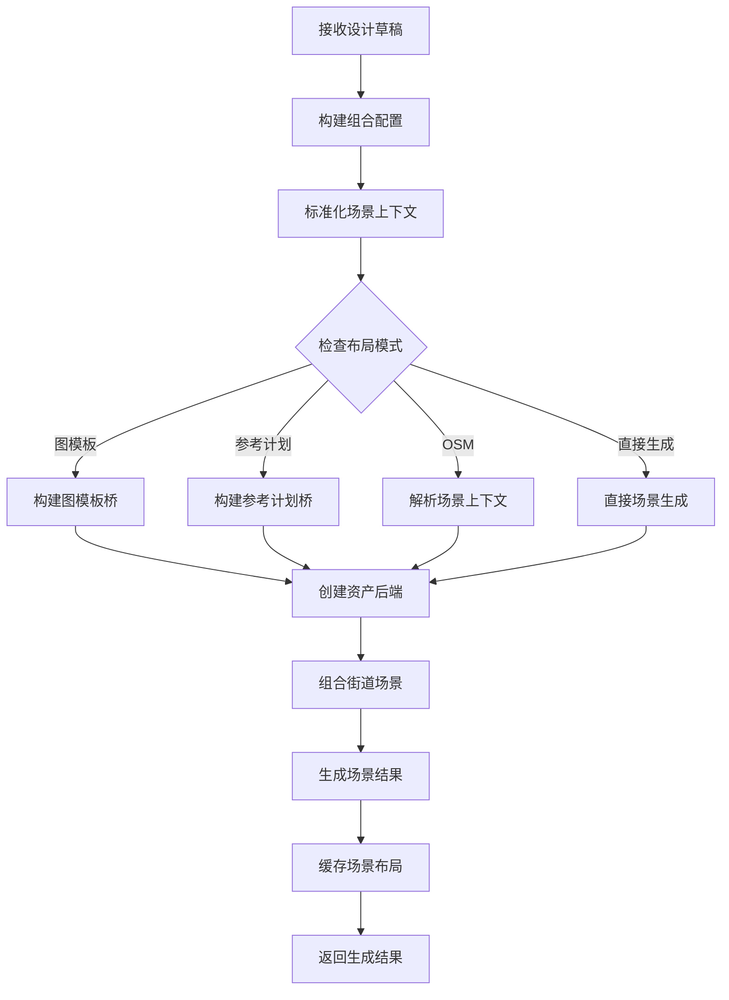
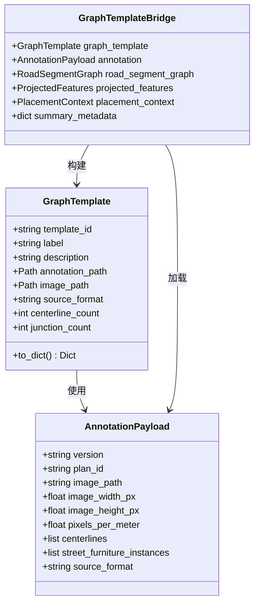
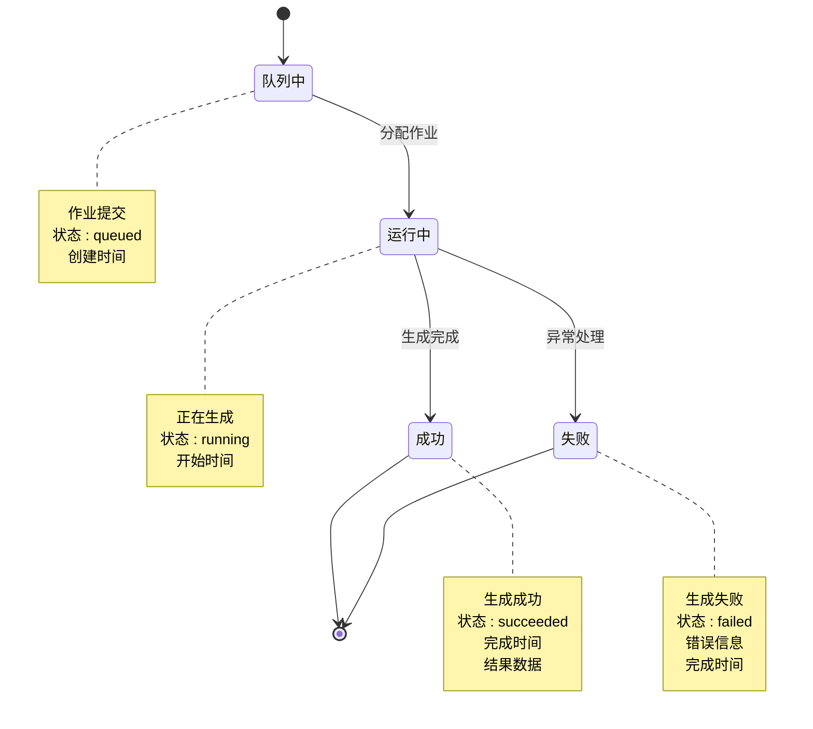
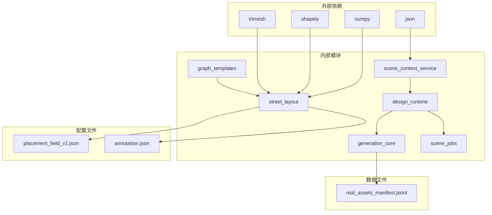

# 场景预设系统

<cite>
**本文档引用的文件**
- [scene_context_service.py](file://src/roadgen3d/services/scene_context_service.py)
- [design_runtime.py](file://src/roadgen3d/services/design_runtime.py)
- [generation_core.py](file://src/roadgen3d/services/generation_core.py)
- [scene_jobs.py](file://src/roadgen3d/services/scene_jobs.py)
- [graph_templates.py](file://src/roadgen3d/graph_templates.py)
- [design_types.py](file://src/roadgen3d/services/design_types.py)
- [types.py](file://src/roadgen3d/types.py)
- [street_layout.py](file://src/roadgen3d/street_layout.py)
- [placement_field_v1.json](file://src/roadgen3d/config/placement_field_v1.json)
- [annotation.json](file://assets/graph_templates/hkust_gz_gate/annotation.json)
- [real_assets_manifest.jsonl](file://data/real/real_assets_manifest.jsonl)
</cite>

## 目录
1. [简介](#简介)
2. [项目结构](#项目结构)
3. [核心组件](#核心组件)
4. [架构概览](#架构概览)
5. [详细组件分析](#详细组件分析)
6. [依赖关系分析](#依赖关系分析)
7. [性能考虑](#性能考虑)
8. [故障排除指南](#故障排除指南)
9. [结论](#结论)

## 简介

场景预设系统是 RoadGen3D 项目中的核心模块，负责管理和生成各种类型的街道场景预设。该系统支持多种场景生成模式，包括基于图模板的场景、基于 OpenStreetMap 的场景以及基于参考计划的场景生成。系统通过统一的设计运行时接口，为用户提供灵活的场景生成能力。

该系统主要包含以下核心功能：
- 场景上下文解析和验证
- 多种场景生成模式的支持
- 图模板管理和应用
- 场景作业队列管理
- 实时场景生成和缓存

## 项目结构

场景预设系统在 RoadGen3D 项目中的组织结构如下：

**图表来源**
- [scene_context_service.py:1-332](file://src/roadgen3d/services/scene_context_service.py#L1-L332)
- [design_runtime.py:1-460](file://src/roadgen3d/services/design_runtime.py#L1-L460)
- [graph_templates.py:1-120](file://src/roadgen3d/graph_templates.py#L1-L120)

**章节来源**
- [scene_context_service.py:1-332](file://src/roadgen3d/services/scene_context_service.py#L1-L332)
- [design_runtime.py:1-460](file://src/roadgen3d/services/design_runtime.py#L1-L460)
- [graph_templates.py:1-120](file://src/roadgen3d/graph_templates.py#L1-L120)

## 核心组件

### 场景上下文服务

场景上下文服务负责处理和解析场景生成所需的上下文信息，包括 AOI 区域、城市信息、道路选择策略等。

**主要功能：**
- AOI 区域边界验证和标准化
- 城市信息解析和验证
- 道路自动选择和评估
- 场景上下文标准化

### 设计运行时

设计运行时提供统一的场景生成接口，支持多种场景生成模式：

**支持的生成模式：**
- 图模板场景生成
- 参考计划场景生成  
- OpenStreetMap 场景生成
- 直接参数化场景生成

### 场景作业服务

场景作业服务实现了一个内存中的作业队列系统，支持异步场景生成任务管理。

**核心特性：**
- 线程安全的作业队列
- 异步作业执行
- 作业状态跟踪
- 结果缓存和检索

### 图模板系统

图模板系统提供了基于预定义图结构的场景生成能力，当前支持 HKUST-GZ 门禁场景模板。

**模板特性：**
- 完整的图结构定义
- 跨截面带区配置
- 街头家具实例化
- 模板元数据管理

**章节来源**
- [scene_context_service.py:279-332](file://src/roadgen3d/services/scene_context_service.py#L279-L332)
- [design_runtime.py:336-396](file://src/roadgen3d/services/design_runtime.py#L336-L396)
- [scene_jobs.py:42-205](file://src/roadgen3d/services/scene_jobs.py#L42-L205)
- [graph_templates.py:15-120](file://src/roadgen3d/graph_templates.py#L15-L120)

## 架构概览

场景预设系统采用分层架构设计，确保了模块间的清晰分离和高内聚低耦合。

**图表来源**
- [design_runtime.py:336-396](file://src/roadgen3d/services/design_runtime.py#L336-L396)
- [scene_jobs.py:42-205](file://src/roadgen3d/services/scene_jobs.py#L42-L205)
- [graph_templates.py:15-120](file://src/roadgen3d/graph_templates.py#L15-L120)

## 详细组件分析

### 场景上下文解析流程

场景上下文解析是整个系统的核心，负责将用户输入的场景描述转换为可执行的生成配置。

**图表来源**
- [scene_context_service.py:279-332](file://src/roadgen3d/services/scene_context_service.py#L279-L332)
- [design_types.py:236-254](file://src/roadgen3d/services/design_types.py#L236-L254)

### 场景生成工作流

场景生成过程涉及多个步骤，从配置构建到最终输出生成。

**图表来源**
- [design_runtime.py:336-396](file://src/roadgen3d/services/design_runtime.py#L336-L396)
- [generation_core.py:267-342](file://src/roadgen3d/services/generation_core.py#L267-L342)

### 图模板处理机制

图模板系统提供了强大的场景预设能力，通过预定义的图结构快速生成复杂的街道场景。

**图表来源**
- [graph_templates.py:15-94](file://src/roadgen3d/graph_templates.py#L15-L94)
- [annotation.json:1-800](file://assets/graph_templates/hkust_gz_gate/annotation.json#L1-L800)

**章节来源**
- [graph_templates.py:15-120](file://src/roadgen3d/graph_templates.py#L15-L120)
- [annotation.json:1-800](file://assets/graph_templates/hkust_gz_gate/annotation.json#L1-L800)

### 作业队列管理系统

作业队列系统实现了高效的异步场景生成管理，支持并发作业处理和状态跟踪。

**图表来源**
- [scene_jobs.py:27-205](file://src/roadgen3d/services/scene_jobs.py#L27-L205)

**章节来源**
- [scene_jobs.py:42-205](file://src/roadgen3d/services/scene_jobs.py#L42-L205)

## 依赖关系分析

场景预设系统的依赖关系体现了清晰的分层架构和模块化设计。

**图表来源**
- [street_layout.py:1-100](file://src/roadgen3d/street_layout.py#L1-L100)
- [placement_field_v1.json:1-117](file://src/roadgen3d/config/placement_field_v1.json#L1-L117)
- [real_assets_manifest.jsonl:1-144](file://data/real/real_assets_manifest.jsonl#L1-L144)

**章节来源**
- [street_layout.py:1-100](file://src/roadgen3d/street_layout.py#L1-L100)
- [placement_field_v1.json:1-117](file://src/roadgen3d/config/placement_field_v1.json#L1-L117)
- [real_assets_manifest.jsonl:1-144](file://data/real/real_assets_manifest.jsonl#L1-L144)

## 性能考虑

场景预设系统在设计时充分考虑了性能优化，采用了多种策略来提升生成效率：

### 缓存策略
- 场景布局缓存以避免重复计算
- 图模板加载缓存减少磁盘I/O
- 作业结果缓存支持快速检索

### 并发处理
- 多线程作业队列支持并发生成
- 异步任务处理避免阻塞
- 内存中的作业状态管理

### 资源管理
- 资产清单预加载优化资源访问
- 网格缓存减少内存占用
- 合理的垃圾回收策略

## 故障排除指南

### 常见问题及解决方案

**场景生成失败**
- 检查 AOI 区域是否有效
- 验证城市名称格式正确性
- 确认网络连接正常（如需在线资源）

**图模板加载错误**
- 验证模板ID是否存在
- 检查模板文件完整性
- 确认文件路径正确

**作业队列异常**
- 检查系统内存使用情况
- 验证磁盘空间充足
- 查看错误日志获取详细信息

**章节来源**
- [scene_jobs.py:138-178](file://src/roadgen3d/services/scene_jobs.py#L138-L178)
- [graph_templates.py:78-94](file://src/roadgen3d/graph_templates.py#L78-L94)

## 结论

场景预设系统通过其模块化设计和分层架构，为 RoadGen3D 项目提供了强大而灵活的场景生成能力。系统支持多种场景生成模式，从简单的参数化生成到复杂的图模板场景，满足了不同层次的使用需求。

该系统的主要优势包括：
- **灵活性**：支持多种场景生成模式和自定义参数
- **可扩展性**：模块化设计便于功能扩展和维护
- **性能**：通过缓存和并发处理提升生成效率
- **易用性**：统一的接口和丰富的配置选项

未来的发展方向可能包括：
- 更多图模板的扩展
- 改进的自动场景选择算法
- 增强的实时预览功能
- 更好的性能优化和资源管理