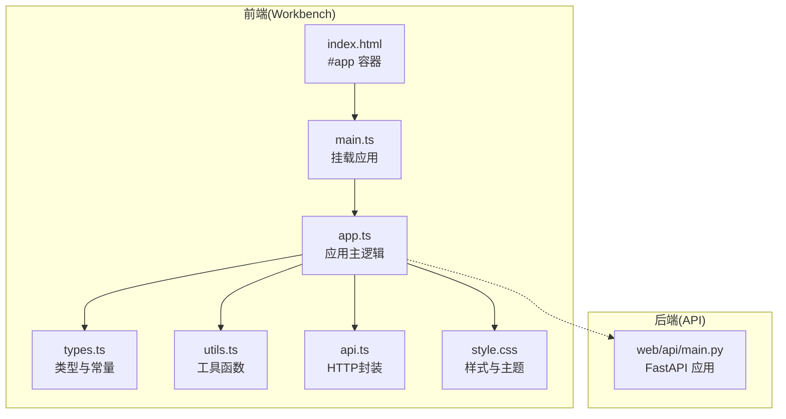
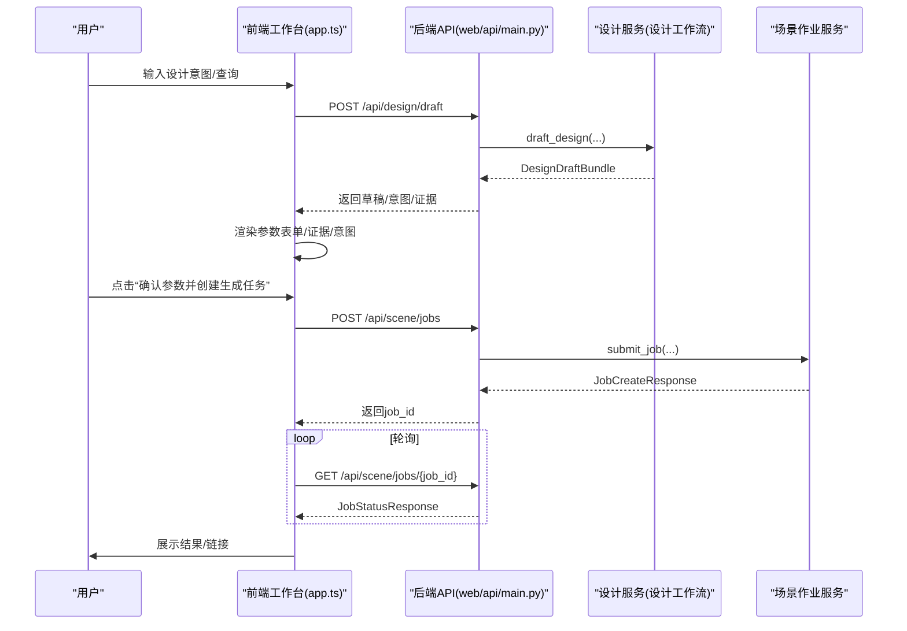
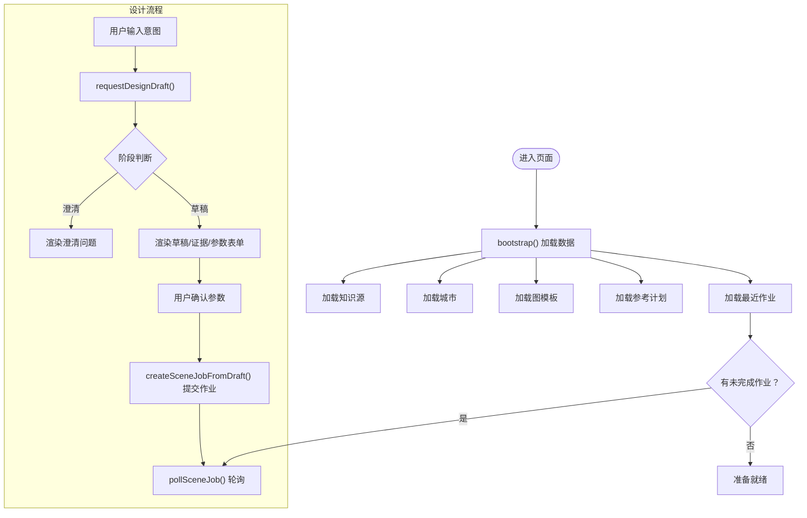
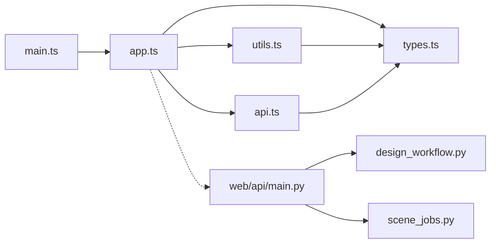

# 工作台界面

<cite>
**本文引用的文件**
- [web/workbench/src/app.ts](file://web/workbench/src/app.ts)
- [web/workbench/src/main.ts](file://web/workbench/src/main.ts)
- [web/workbench/src/types.ts](file://web/workbench/src/types.ts)
- [web/workbench/src/utils.ts](file://web/workbench/src/utils.ts)
- [web/workbench/src/api.ts](file://web/workbench/src/api.ts)
- [web/workbench/src/style.css](file://web/workbench/src/style.css)
- [web/workbench/index.html](file://web/workbench/index.html)
- [web/workbench/package.json](file://web/workbench/package.json)
- [web/workbench/vite.config.ts](file://web/workbench/vite.config.ts)
- [web/api/main.py](file://web/api/main.py)
- [src/roadgen3d/llm/design_workflow.py](file://src/roadgen3d/llm/design_workflow.py)
- [src/roadgen3d/services/design_runtime.py](file://src/roadgen3d/services/design_runtime.py)
- [src/roadgen3d/services/scene_jobs.py](file://src/roadgen3d/services/scene_jobs.py)
</cite>

## 目录
1. [简介](#简介)
2. [项目结构](#项目结构)
3. [核心组件](#核心组件)
4. [架构总览](#架构总览)
5. [详细组件分析](#详细组件分析)
6. [依赖关系分析](#依赖关系分析)
7. [性能考量](#性能考量)
8. [故障排查指南](#故障排查指南)
9. [结论](#结论)
10. [附录](#附录)

## 简介
本文件面向RoadGen3D工作台界面（Web Workbench），系统化阐述其整体架构、前端组件结构、状态管理、路由与数据流、LLM对话与RAG检索、参数配置界面、WebSocket连接与轮询机制、实时状态同步、错误处理、UI交互与可访问性、样式与主题定制、以及扩展与新增配置项的方法。工作台采用TypeScript + Vite构建，通过REST API与后端FastAPI服务交互，支持设计意图澄清、GraphRAG/PDF检索、参数确认与场景生成任务提交与轮询。

## 项目结构
工作台位于web/workbench目录，采用前后端分离：
- 前端：TypeScript + Vite，入口为main.ts，挂载应用至#app元素，核心逻辑集中在app.ts中。
- 样式：style.css定义主题变量与响应式布局。
- 构建：package.json定义开发与构建脚本，vite.config.ts配置本地开发服务器。
- 后端：web/api/main.py提供REST API，对接LLM、RAG、场景作业队列等服务。

图表来源
- [web/workbench/index.html:1-13](file://web/workbench/index.html#L1-L13)
- [web/workbench/src/main.ts:1-12](file://web/workbench/src/main.ts#L1-L12)
- [web/workbench/src/app.ts:1-1188](file://web/workbench/src/app.ts#L1-L1188)
- [web/workbench/src/types.ts:1-228](file://web/workbench/src/types.ts#L1-L228)
- [web/workbench/src/utils.ts:1-245](file://web/workbench/src/utils.ts#L1-L245)
- [web/workbench/src/api.ts:1-39](file://web/workbench/src/api.ts#L1-L39)
- [web/workbench/src/style.css:1-490](file://web/workbench/src/style.css#L1-L490)
- [web/api/main.py:1-286](file://web/api/main.py#L1-L286)

章节来源
- [web/workbench/index.html:1-13](file://web/workbench/index.html#L1-L13)
- [web/workbench/src/main.ts:1-12](file://web/workbench/src/main.ts#L1-L12)
- [web/workbench/src/app.ts:1-1188](file://web/workbench/src/app.ts#L1-L1188)
- [web/workbench/src/types.ts:1-228](file://web/workbench/src/types.ts#L1-L228)
- [web/workbench/src/utils.ts:1-245](file://web/workbench/src/utils.ts#L1-L245)
- [web/workbench/src/api.ts:1-39](file://web/workbench/src/api.ts#L1-L39)
- [web/workbench/src/style.css:1-490](file://web/workbench/src/style.css#L1-L490)
- [web/api/main.py:1-286](file://web/api/main.py#L1-L286)

## 核心组件
- 应用挂载与入口
  - main.ts负责引入样式并调用mountWorkbench挂载应用。
  - app.ts是应用主逻辑，包含状态、DOM渲染、事件绑定、API调用与轮询。
- 类型与常量
  - types.ts定义聊天消息、意图、证据、草稿、场景上下文、作业状态等类型，以及FIELD_CONFIGS、POLL_INTERVAL_MS等常量。
- 工具与HTTP
  - utils.ts提供HTML转义、错误格式化、知识源标签、时间戳、度量格式化、表单构建等工具。
  - api.ts封装fetch请求，统一处理响应与错误。
- 样式与主题
  - style.css定义主题变量、网格布局、面板、按钮、标签、证据卡片、表单等样式，并提供移动端断点。

章节来源
- [web/workbench/src/main.ts:1-12](file://web/workbench/src/main.ts#L1-L12)
- [web/workbench/src/app.ts:1-1188](file://web/workbench/src/app.ts#L1-L1188)
- [web/workbench/src/types.ts:1-228](file://web/workbench/src/types.ts#L1-L228)
- [web/workbench/src/utils.ts:1-245](file://web/workbench/src/utils.ts#L1-L245)
- [web/workbench/src/api.ts:1-39](file://web/workbench/src/api.ts#L1-L39)
- [web/workbench/src/style.css:1-490](file://web/workbench/src/style.css#L1-L490)

## 架构总览
工作台采用“前端应用 + 后端API”架构：
- 前端通过REST API与后端交互，包括设计草稿、知识检索、场景作业、城市与模板列表等。
- 设计流程：用户输入 → LLM意图解析 → RAG检索 → 生成草稿 → 参数确认 → 提交场景作业 → 轮询状态 → 展示结果。
- 作业队列：后端维护内存作业队列，前端通过轮询获取最新状态。

图表来源
- [web/workbench/src/app.ts:412-522](file://web/workbench/src/app.ts#L412-L522)
- [web/api/main.py:156-201](file://web/api/main.py#L156-L201)
- [src/roadgen3d/llm/design_workflow.py:112-200](file://src/roadgen3d/llm/design_workflow.py#L112-L200)
- [src/roadgen3d/services/scene_jobs.py:57-79](file://src/roadgen3d/services/scene_jobs.py#L57-L79)

## 详细组件分析

### 组件A：应用主逻辑与状态管理（app.ts）
- 状态模型
  - messages：聊天历史
  - lastDraft/lastGeneration/currentJob：草稿、生成结果、当前作业
  - recentScenes：最近场景
  - cities/referencePlans/graphTemplates/knowledgeSources：下拉选择数据
  - sceneContext：布局模式、AOI、城市、参考计划、图模板
  - bboxDirty：AOI输入标记
- DOM与事件
  - 初始化渲染多个面板（对话、场景设置、知识检索、证据、草稿、作业）
  - 事件绑定：知识源切换、布局模式切换、城市/模板/参考计划变化、AOI输入、生成按钮点击等
- 关键流程
  - requestDesignDraft：调用后端草稿接口，更新消息与草稿状态，渲染证据与参数表单
  - createSceneJobFromDraft：构建场景上下文，提交作业，轮询状态并刷新UI
  - bootstrap：启动时加载知识源、城市、模板、参考计划、最近场景，处理未完成作业
  - pollSceneJob：按间隔轮询作业状态，直到终端态
- 错误处理
  - setStatus统一展示状态与错误
  - formatBootstrapError统一格式化启动阶段错误
  - 请求异常捕获并提示

图表来源
- [web/workbench/src/app.ts:524-581](file://web/workbench/src/app.ts#L524-L581)
- [web/workbench/src/app.ts:412-522](file://web/workbench/src/app.ts#L412-L522)

章节来源
- [web/workbench/src/app.ts:58-83](file://web/workbench/src/app.ts#L58-L83)
- [web/workbench/src/app.ts:281-482](file://web/workbench/src/app.ts#L281-L482)
- [web/workbench/src/app.ts:484-581](file://web/workbench/src/app.ts#L484-L581)

### 组件B：类型与常量（types.ts）
- 数据模型
  - ChatMessage、DesignIntent、RagEvidence、DesignDraft、SceneContext、ChinaCity、ReferencePlan、GraphTemplate
  - DraftResponse、KnowledgeSourceStatus、GenerationResponse、SceneJob*Response、SceneRecord
- 配置
  - FIELD_CONFIGS：参数字段定义（文本/数字/选择框）
  - 常量：API_BASE、VIEWER_BASE、POLL_INTERVAL_MS、默认城市/模板/参考计划、摘要忽略键集合

章节来源
- [web/workbench/src/types.ts:1-228](file://web/workbench/src/types.ts#L1-L228)

### 组件C：工具与HTTP（utils.ts、api.ts）
- 工具函数
  - HTML转义、错误格式化、知识源标签、参数来源标签、时间戳、度量格式化、摘要过滤、表单构建、视图URL解析等
- HTTP封装
  - requireElement：DOM查询与校验
  - postJson/getJson：统一fetch封装与错误处理
  - resolveApiUrl：API地址拼接

章节来源
- [web/workbench/src/utils.ts:1-245](file://web/workbench/src/utils.ts#L1-L245)
- [web/workbench/src/api.ts:1-39](file://web/workbench/src/api.ts#L1-L39)

### 组件D：样式与主题（style.css）
- 主题变量：颜色、半径、字体族
- 布局：网格、堆叠、面板、时间线、表单栅格
- 组件：消息气泡、标签行、证据卡片、状态胶囊、场景卡片
- 响应式：最大宽度、断点适配

章节来源
- [web/workbench/src/style.css:1-490](file://web/workbench/src/style.css#L1-L490)

### 组件E：后端API集成（web/api/main.py）
- 端点概览
  - /api/health、/api/geo/china-cities、/api/reference-plans、/api/graph-templates
  - /api/design/draft、/api/design/generate、/api/scene/jobs、/api/scene/jobs/{job_id}
  - /api/scenes/recent、/api/knowledge/rebuild、/api/knowledge/sources、/api/knowledge/search
- 业务服务
  - DesignAssistantService：LLM意图解析、RAG检索、草稿生成、知识库重建、检索
  - SceneJobService：内存作业队列、提交/轮询/状态转换

章节来源
- [web/api/main.py:81-267](file://web/api/main.py#L81-L267)
- [src/roadgen3d/llm/design_workflow.py:62-89](file://src/roadgen3d/llm/design_workflow.py#L62-L89)
- [src/roadgen3d/services/scene_jobs.py:42-56](file://src/roadgen3d/services/scene_jobs.py#L42-L56)

## 依赖关系分析
- 前端依赖
  - main.ts依赖style.css与app.ts
  - app.ts依赖types.ts、utils.ts、api.ts
  - utils.ts依赖types.ts中的常量与配置
  - api.ts依赖types.ts中的API_BASE
- 后端依赖
  - web/api/main.py依赖设计工作流与作业服务
  - 设计工作流依赖LLM客户端、RAG检索器、场景生成器
  - 作业服务依赖场景生成运行时

图表来源
- [web/workbench/src/main.ts:1-12](file://web/workbench/src/main.ts#L1-L12)
- [web/workbench/src/app.ts:1-56](file://web/workbench/src/app.ts#L1-L56)
- [web/workbench/src/types.ts:1-35](file://web/workbench/src/types.ts#L1-L35)
- [web/workbench/src/utils.ts:1-2](file://web/workbench/src/utils.ts#L1-L2)
- [web/workbench/src/api.ts:1-2](file://web/workbench/src/api.ts#L1-L2)
- [web/api/main.py:1-31](file://web/api/main.py#L1-L31)
- [src/roadgen3d/llm/design_workflow.py:1-44](file://src/roadgen3d/llm/design_workflow.py#L1-L44)
- [src/roadgen3d/services/scene_jobs.py:1-12](file://src/roadgen3d/services/scene_jobs.py#L1-L12)

章节来源
- [web/workbench/src/main.ts:1-12](file://web/workbench/src/main.ts#L1-L12)
- [web/workbench/src/app.ts:1-56](file://web/workbench/src/app.ts#L1-L56)
- [web/api/main.py:81-267](file://web/api/main.py#L81-L267)

## 性能考量
- 轮询策略
  - 默认轮询间隔为1200ms，可在types.ts中调整POLL_INTERVAL_MS
  - 仅在未达终端态时持续轮询，完成后释放资源
- 渲染优化
  - 使用最小必要DOM更新（如仅更新timeline/evidence/parameter form）
  - 表单构建仅在字段值变化时覆盖citations与来源
- 网络与缓存
  - 草稿接口支持缓存命中，避免重复LLM/RAG计算
  - 知识源状态检查与可用性优先级选择，减少无效请求

[本节为通用指导，无需特定文件引用]

## 故障排查指南
- 启动阶段错误
  - bootstrap阶段收集知识源、城市、模板、参考计划、最近场景加载错误，统一格式化并提示
- 请求失败
  - handleJsonResponse统一处理非2xx响应，抛出错误信息
  - formatBootstrapError识别网络类错误并给出明确提示
- 作业状态异常
  - pollSceneJob循环轮询，遇到失败状态输出错误详情
  - 未完成作业在重启时继续同步状态

章节来源
- [web/workbench/src/app.ts:524-581](file://web/workbench/src/app.ts#L524-L581)
- [web/workbench/src/api.ts:32-38](file://web/workbench/src/api.ts#L32-L38)
- [web/workbench/src/utils.ts:20-29](file://web/workbench/src/utils.ts#L20-L29)

## 结论
工作台以清晰的模块划分与REST API集成实现了从意图澄清、证据检索、参数确认到场景生成的完整闭环。前端通过状态驱动与轮询机制保障实时性，后端通过设计工作流与作业队列提供稳定的服务能力。样式与响应式设计确保跨设备可用性。后续可通过扩展FIELD_CONFIGS与后端服务接口来增加新配置项与功能。

[本节为总结，无需特定文件引用]

## 附录

### UI组件交互模式与可访问性
- 交互模式
  - 文本域输入、下拉选择、按钮操作、证据卡片展示、参数表单栅格布局
- 可访问性
  - 使用语义化标签（h2、label、select、textarea、button）
  - 保持焦点顺序与键盘导航
  - 提供状态提示与错误信息（status-box）

章节来源
- [web/workbench/src/app.ts:85-248](file://web/workbench/src/app.ts#L85-L248)
- [web/workbench/src/style.css:134-154](file://web/workbench/src/style.css#L134-L154)

### 响应式设计
- 大屏：双栏布局（左侧对话/场景设置，右侧知识/草稿/作业）
- 小屏：单栏布局，网格自适应，面板间距与内边距调整

章节来源
- [web/workbench/src/style.css:477-489](file://web/workbench/src/style.css#L477-L489)

### WebSocket连接管理与实时状态同步
- 当前实现基于轮询（pollSceneJob）而非WebSocket
- 若需升级为WebSocket，建议在后端提供长连接端点并在前端建立连接，按作业ID订阅状态变更

章节来源
- [web/workbench/src/app.ts:709-729](file://web/workbench/src/app.ts#L709-L729)
- [web/workbench/src/types.ts:188-189](file://web/workbench/src/types.ts#L188-L189)

### 样式定制与主题配置
- 主题变量集中于:root（颜色、半径、字体）
- 面板、按钮、标签、证据卡片、表单等组件样式可按需修改
- 建议通过CSS变量与媒体查询实现主题切换与断点适配

章节来源
- [web/workbench/src/style.css:1-18](file://web/workbench/src/style.css#L1-L18)

### 扩展工作台功能与新增配置项
- 新增参数字段
  - 在types.ts的FIELD_CONFIGS中添加新字段（key、label、type、options）
  - 在app.ts的renderParameterForm中渲染对应控件
  - 在utils.ts的buildDraftFromForm中读取并写入compose_config_patch
- 新增后端端点
  - 在web/api/main.py中添加路由与请求模型
  - 在设计工作流或服务层实现业务逻辑
- 新增知识源
  - 在前端types.ts中扩展KnowledgeSourceKey
  - 在前端utils.ts中扩展标签与格式化函数
  - 在后端实现检索器与状态管理

章节来源
- [web/workbench/src/types.ts:207-227](file://web/workbench/src/types.ts#L207-L227)
- [web/workbench/src/utils.ts:154-182](file://web/workbench/src/utils.ts#L154-L182)
- [web/api/main.py:234-253](file://web/api/main.py#L234-L253)