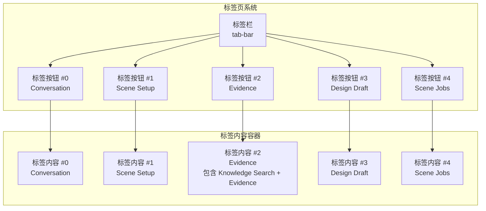
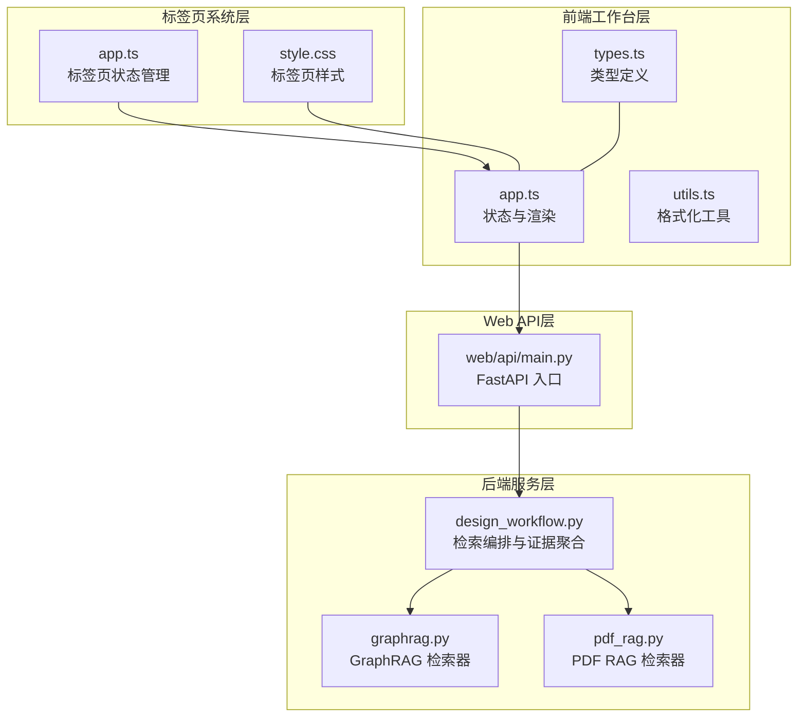
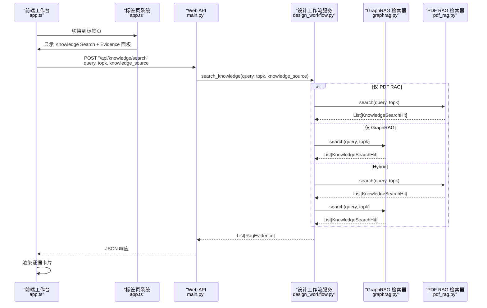
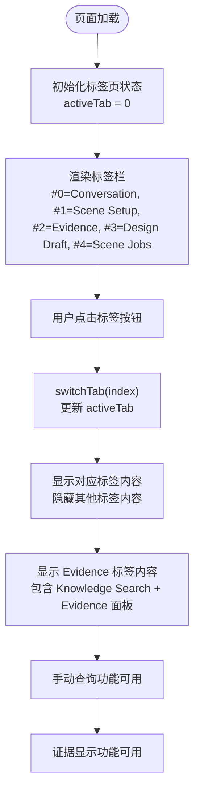
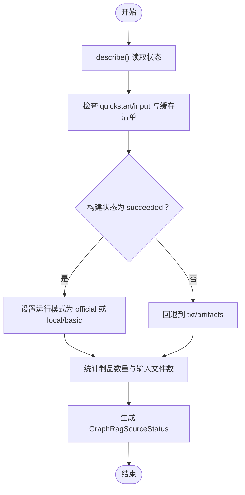
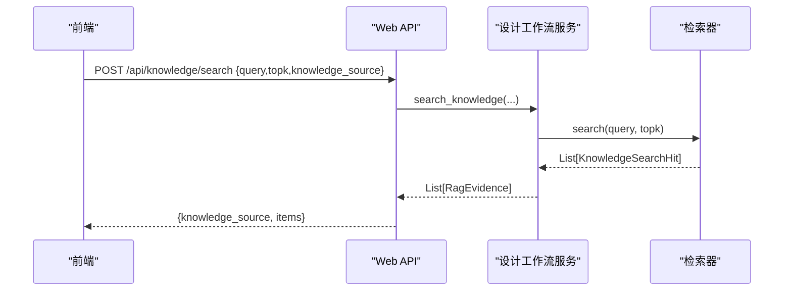
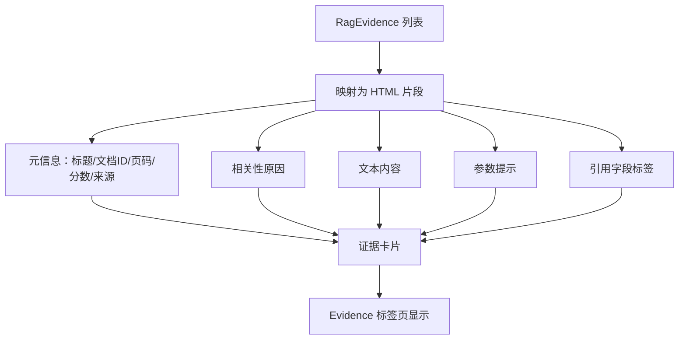
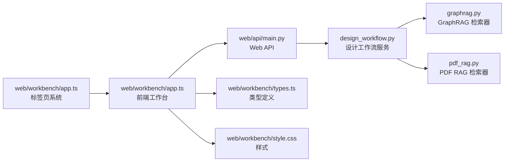

# 知识检索面板

<cite>
**本文档引用的文件**
- [app.ts](file://web/workbench/src/app.ts)
- [types.ts](file://web/workbench/src/types.ts)
- [style.css](file://web/workbench/src/style.css)
- [main.py（Web API）](file://web/api/main.py)
- [main.py（UI API）](file://ui/api/main.py)
- [graphrag.py](file://src/roadgen3d/knowledge/graphrag.py)
- [pdf_rag.py](file://src/roadgen3d/knowledge/pdf_rag.py)
- [design_workflow.py](file://src/roadgen3d/llm/design_workflow.py)
</cite>

## 更新摘要
**所做更改**
- 更新了标签页布局结构，知识检索面板现位于第三个标签（Evidence）
- 新增了标签页系统架构说明和样式实现
- 更新了前端工作台的标签页导航和状态管理
- 完善了证据卡片渲染和手动查询功能的标签页集成

## 目录
1. [简介](#简介)
2. [标签页系统架构](#标签页系统架构)
3. [项目结构](#项目结构)
4. [核心组件](#核心组件)
5. [架构总览](#架构总览)
6. [详细组件分析](#详细组件分析)
7. [依赖分析](#依赖分析)
8. [性能考虑](#性能考虑)
9. [故障排查指南](#故障排查指南)
10. [结论](#结论)
11. [附录](#附录)

## 简介
本文件面向"知识检索面板"的使用者与维护者，系统化说明以下内容：
- **标签页系统架构**：知识检索面板现位于标签页系统中的第三个标签（Evidence），采用新的标签页布局结构
- 知识源状态检查机制：GraphRAG、Hybrid（合并）与 PDF RAG 的可用性判断与运行时状态监控
- 手动知识查询流程：查询语句输入、检索参数配置与结果展示
- 证据卡片渲染：PDF 片段显示、GraphRAG 节点可视化与引用信息标注
- 知识源摘要信息：项目数量统计、构建状态与运行时错误展示
- 检索性能优化、结果排序与相关性评分机制
- 配置参数与扩展接口

## 标签页系统架构
知识检索面板现在位于标签页系统中的第三个标签（Evidence），采用网格布局的标签页系统：

**图表来源**
- [app.ts:162-168](file://web/workbench/src/app.ts#L162-L168)
- [app.ts:265-291](file://web/workbench/src/app.ts#L265-L291)
- [style.css:696-760](file://web/workbench/src/style.css#L696-L760)

**章节来源**
- [app.ts:84-85](file://web/workbench/src/app.ts#L84-L85)
- [app.ts:162-168](file://web/workbench/src/app.ts#L162-L168)
- [app.ts:265-291](file://web/workbench/src/app.ts#L265-L291)
- [style.css:696-760](file://web/workbench/src/style.css#L696-L760)

## 项目结构
知识检索能力由四层组成：
- **标签页系统层**：负责标签页导航、状态管理和布局切换
- 后端服务层：负责知识源状态描述、检索与证据聚合
- Web API 层：提供 /api/knowledge/* 接口，供前端调用
- 前端工作台层：负责状态展示、手动查询与证据卡片渲染

**图表来源**
- [app.ts:84-85](file://web/workbench/src/app.ts#L84-L85)
- [app.ts:583-765](file://web/workbench/src/app.ts#L583-L765)
- [main.py（Web API）:234-253](file://web/api/main.py#L234-L253)
- [design_workflow.py:241-253](file://src/roadgen3d/llm/design_workflow.py#L241-L253)
- [graphrag.py:230-338](file://src/roadgen3d/knowledge/graphrag.py#L230-L338)
- [pdf_rag.py:344-423](file://src/roadgen3d/knowledge/pdf_rag.py#L344-L423)

**章节来源**
- [app.ts:84-85](file://web/workbench/src/app.ts#L84-L85)
- [app.ts:583-765](file://web/workbench/src/app.ts#L583-L765)
- [main.py（Web API）:234-253](file://web/api/main.py#L234-L253)
- [design_workflow.py:241-253](file://src/roadgen3d/llm/design_workflow.py#L241-L253)

## 核心组件
- **标签页系统**：管理五个标签页的导航、状态切换和布局
- **知识检索面板**：包含 Knowledge Search 和 Evidence 两个子面板
- **GraphRAG 知识检索器**：支持官方 GraphRAG 运行时优先模式与 txt 回退模式
- **PDF RAG 知识检索器**：基于 FAISS 的向量检索；支持 PDF 解析、分段、嵌入与检索
- **设计工作流服务**：统一管理知识源选择、检索与证据聚合，输出标准化的证据卡片
- **Web API**：暴露知识源列表、手动检索等接口
- **前端工作台**：渲染知识源摘要、手动查询输入与证据卡片

**章节来源**
- [app.ts:84-85](file://web/workbench/src/app.ts#L84-L85)
- [app.ts:265-291](file://web/workbench/src/app.ts#L265-L291)
- [graphrag.py:230-338](file://src/roadgen3d/knowledge/graphrag.py#L230-L338)
- [pdf_rag.py:344-423](file://src/roadgen3d/knowledge/pdf_rag.py#L344-L423)
- [design_workflow.py:241-253](file://src/roadgen3d/llm/design_workflow.py#L241-L253)
- [main.py（Web API）:234-253](file://web/api/main.py#L234-L253)
- [app.ts:737-765](file://web/workbench/src/app.ts#L737-L765)

## 架构总览
手动检索从前端发起，经 Web API 到后端服务，再根据所选知识源调用对应检索器，最后返回证据卡片。标签页系统提供导航和状态管理。

**图表来源**
- [app.ts:84-85](file://web/workbench/src/app.ts#L84-L85)
- [app.ts:265-291](file://web/workbench/src/app.ts#L265-L291)
- [main.py（Web API）:239-253](file://web/api/main.py#L239-L253)
- [design_workflow.py:255-266](file://src/roadgen3d/llm/design_workflow.py#L255-L266)
- [graphrag.py:403-423](file://src/roadgen3d/knowledge/graphrag.py#L403-L423)
- [pdf_rag.py:409-422](file://src/roadgen3d/knowledge/pdf_rag.py#L409-L422)
- [app.ts:765-847](file://web/workbench/src/app.ts#L765-L847)

## 详细组件分析

### 标签页系统实现
- **标签页配置**：五个标签页，Evidence 为第三个标签（data-tab="2"）
- **状态管理**：维护 activeTab 状态，支持标签页切换和自动导航
- **布局结构**：Evidence 标签包含两个并列的面板：Knowledge Search 和 Evidence
- **响应式设计**：支持小屏幕设备的标签页滚动

**图表来源**
- [app.ts:84-85](file://web/workbench/src/app.ts#L84-L85)
- [app.ts:99-107](file://web/workbench/src/app.ts#L99-L107)
- [app.ts:265-291](file://web/workbench/src/app.ts#L265-L291)
- [style.css:696-760](file://web/workbench/src/style.css#L696-L760)

**章节来源**
- [app.ts:84-85](file://web/workbench/src/app.ts#L84-L85)
- [app.ts:99-107](file://web/workbench/src/app.ts#L99-L107)
- [app.ts:265-291](file://web/workbench/src/app.ts#L265-L291)
- [style.css:696-760](file://web/workbench/src/style.css#L696-L760)

### 知识源状态检查机制
- **GraphRAG 状态描述**
  - 关键字段：可用性、项目数、制品数、输入目录、缓存目录、输出目录、txt 目录、运行模式、是否需要重建、上次构建状态、运行时错误、错误详情
  - 判断逻辑：若官方运行时支持且输入同步完成且构建成功，则采用官方运行时；否则回退到合并 txt/artifacts
  - 输入同步：将 txt 条目复制到 quickstart/input，并记录清单
  - 运行时重建：当输入指纹变化或缺失关键制品时触发重建
- **PDF RAG 状态描述**
  - 关键字段：可用性、项目数、制品目录、源路径、错误详情
  - 判断逻辑：若已构建 FAISS 索引与元数据存在则可用
- **Hybrid 状态描述**
  - 合并 PDF 与 GraphRAG 的可用性与统计项

**图表来源**
- [graphrag.py:269-338](file://src/roadgen3d/knowledge/graphrag.py#L269-L338)
- [graphrag.py:340-397](file://src/roadgen3d/knowledge/graphrag.py#L340-L397)

**章节来源**
- [graphrag.py:194-216](file://src/roadgen3d/knowledge/graphrag.py#L194-L216)
- [graphrag.py:269-338](file://src/roadgen3d/knowledge/graphrag.py#L269-L338)
- [design_workflow.py:241-253](file://src/roadgen3d/llm/design_workflow.py#L241-L253)

### 手动知识查询功能
- **查询入口**
  - 前端通过 /api/knowledge/search 发起请求，携带 query、topk、knowledge_source
  - 后端将请求转发给设计工作流服务
- **检索参数**
  - knowledge_source：可选值为 hybrid、pdf_rag、graph_rag
  - topk：返回前 k 条证据
- **结果处理**
  - 设计工作流服务根据所选源调用对应检索器，合并结果并标准化为 RagEvidence
  - 前端接收后渲染证据卡片

**图表来源**
- [main.py（Web API）:239-253](file://web/api/main.py#L239-L253)
- [design_workflow.py:255-266](file://src/roadgen3d/llm/design_workflow.py#L255-L266)
- [types.ts:127-130](file://web/workbench/src/types.ts#L127-L130)

**章节来源**
- [main.py（Web API）:65-69](file://web/api/main.py#L65-L69)
- [main.py（Web API）:239-253](file://web/api/main.py#L239-L253)
- [design_workflow.py:255-266](file://src/roadgen3d/llm/design_workflow.py#L255-L266)
- [types.ts:104-130](file://web/workbench/src/types.ts#L104-L130)

### 证据卡片渲染
- **卡片字段**
  - 标题、文档 ID、页码范围、分数、知识源标签、相关性原因、文本内容、参数提示、引用字段标注
- **渲染逻辑**
  - 将 RagEvidence 转换为 HTML 片段，支持分页标签、来源标签、提示行与引用字段标签行
  - 支持按知识源进行标签区分与错误状态提示
- **标签页集成**
  - Evidence 标签页包含两个面板：Knowledge Search 结果和 Design Draft 证据

**图表来源**
- [app.ts:813-847](file://web/workbench/src/app.ts#L813-L847)
- [types.ts:18-30](file://web/workbench/src/types.ts#L18-L30)

**章节来源**
- [app.ts:813-847](file://web/workbench/src/app.ts#L813-L847)
- [types.ts:18-30](file://web/workbench/src/types.ts#L18-L30)

### 知识源摘要信息
- **摘要字段**
  - key、label、available、description、artifact_count、item_count、project_dir、output_dir、txt_dir、input_dir、cache_dir、last_build_status、runtime_error、artifact_dir、source_path、error
- **展示逻辑**
  - 前端加载 /api/knowledge/sources，渲染每个知识源的可用性与统计信息
  - 当 selected 源不可用时，显示 last_build_status 与 runtime_error
- **标签页集成**
  - Knowledge Search 面板显示知识源摘要信息

**章节来源**
- [graphrag.py:194-216](file://src/roadgen3d/knowledge/graphrag.py#L194-L216)
- [app.ts:583-611](file://web/workbench/src/app.ts#L583-L611)
- [app.ts:737-761](file://web/workbench/src/app.ts#L737-L761)

### 检索性能优化、结果排序与相关性评分
- **GraphRAG**
  - 官方运行时优先：优先尝试 local_search/basic_search；若构建状态非 succeeded 则回退
  - 回退模式：对合并 txt 与社区报告、文本单元、文档等 parquet 进行词法评分与截取
  - 分数归一化：将原始分数映射到 [0.3, 0.9] 区间，上下文片段按序递减
- **PDF RAG**
  - 向量检索：对查询与所有块计算余弦相似度，返回 topk
  - 嵌入模型：默认 sentence-transformers，可回退至 CLIP 文本编码器
- **排序策略**
  - GraphRAG：以词法匹配得分降序；上下文片段按出现顺序递减
  - PDF RAG：以相似度分数降序

**章节来源**
- [graphrag.py:403-423](file://src/roadgen3d/knowledge/graphrag.py#L403-L423)
- [graphrag.py:424-457](file://src/roadgen3d/knowledge/graphrag.py#L424-L457)
- [graphrag.py:539-589](file://src/roadgen3d/knowledge/graphrag.py#L539-L589)
- [pdf_rag.py:409-422](file://src/roadgen3d/knowledge/pdf_rag.py#L409-L422)
- [pdf_rag.py:344-423](file://src/roadgen3d/knowledge/pdf_rag.py#L344-L423)

### 配置参数与扩展接口
- **知识源选择**
  - knowledge_source：hybrid、pdf_rag、graph_rag
- **检索参数**
  - query：查询语句
  - topk：返回条数
- **Web API**
  - GET /api/knowledge/sources：列出知识源状态
  - POST /api/knowledge/search：手动检索
  - POST /api/knowledge/rebuild：重建 PDF 知识库
- **类型定义**
  - KnowledgeSourceStatus、KnowledgeSearchResponse、RagEvidence 等

**章节来源**
- [design_workflow.py:866-870](file://src/roadgen3d/llm/design_workflow.py#L866-L870)
- [main.py（Web API）:234-253](file://web/api/main.py#L234-L253)
- [types.ts:104-130](file://web/workbench/src/types.ts#L104-L130)

## 依赖分析
- **组件耦合**
  - 标签页系统依赖前端工作台的状态管理
  - 设计工作流服务依赖 GraphRAG 与 PDF RAG 检索器
  - Web API 依赖设计工作流服务
  - 前端依赖 Web API 与类型定义
- **外部依赖**
  - GraphRAG 运行时（官方 Python 包）、pandas、parquet、FAISS、sentence-transformers、CLIP 文本编码器、PyPDF2/pypdf

**图表来源**
- [app.ts:84-85](file://web/workbench/src/app.ts#L84-L85)
- [main.py（Web API）:234-253](file://web/api/main.py#L234-L253)
- [design_workflow.py:241-253](file://src/roadgen3d/llm/design_workflow.py#L241-L253)
- [graphrag.py:230-338](file://src/roadgen3d/knowledge/graphrag.py#L230-L338)
- [pdf_rag.py:344-423](file://src/roadgen3d/knowledge/pdf_rag.py#L344-L423)
- [app.ts:583-765](file://web/workbench/src/app.ts#L583-L765)
- [types.ts:104-130](file://web/workbench/src/types.ts#L104-L130)

**章节来源**
- [app.ts:84-85](file://web/workbench/src/app.ts#L84-L85)
- [main.py（Web API）:234-253](file://web/api/main.py#L234-L253)
- [design_workflow.py:241-253](file://src/roadgen3d/llm/design_workflow.py#L241-L253)
- [graphrag.py:230-338](file://src/roadgen3d/knowledge/graphrag.py#L230-L338)
- [pdf_rag.py:344-423](file://src/roadgen3d/knowledge/pdf_rag.py#L344-L423)
- [app.ts:583-765](file://web/workbench/src/app.ts#L583-L765)
- [types.ts:104-130](file://web/workbench/src/types.ts#L104-L130)

## 性能考虑
- **标签页系统**
  - 使用 CSS Grid 布局提高渲染性能
  - 响应式设计支持移动端访问
  - 标签页切换采用 display:none 方式，避免不必要的 DOM 操作
- **GraphRAG**
  - 官方运行时优先可显著提升检索质量与速度；若构建状态非 succeeded，回退到本地词法评分，避免网络与环境依赖
  - 输入同步与清单校验减少重复拷贝与重建
- **PDF RAG**
  - FAISS 内积索引查询高效；建议合理设置 topk 与嵌入维度
  - 嵌入模型可回退至 CLIP，降低外部依赖复杂度
- **前端渲染**
  - 使用分段渲染与标签化展示，避免长文本阻塞 UI

## 故障排查指南
- **标签页系统**
  - 症状：标签页无法切换或显示异常
  - 处理：检查 data-tab 属性与 switchTab 函数实现；验证 CSS 样式
- **GraphRAG**
  - 症状：状态 unavailable，last_build_status 非 succeeded，runtime_error 存在
  - 处理：检查 quickstart 输入与缓存目录、settings.yaml 是否存在；必要时触发重建
- **PDF RAG**
  - 症状：状态 unavailable，error 显示缺少 FAISS 或嵌入模型
  - 处理：安装 faiss 与 sentence-transformers；或使用 CLIP 回退方案
- **Web API**
  - 症状：/api/knowledge/search 返回 400
  - 处理：检查 knowledge_source 与参数合法性；查看后端日志

**章节来源**
- [app.ts:84-85](file://web/workbench/src/app.ts#L84-L85)
- [graphrag.py:269-338](file://src/roadgen3d/knowledge/graphrag.py#L269-L338)
- [pdf_rag.py:21-26](file://src/roadgen3d/knowledge/pdf_rag.py#L21-L26)
- [pdf_rag.py:48-57](file://src/roadgen3d/knowledge/pdf_rag.py#L48-L57)
- [pdf_rag.py:88-98](file://src/roadgen3d/knowledge/pdf_rag.py#L88-L98)
- [main.py（Web API）:239-253](file://web/api/main.py#L239-L253)

## 结论
知识检索面板通过"标签页系统 + Hybrid 合并 + 官方运行时优先 + 回退词法评分"的策略，在保证检索质量的同时兼顾稳定性与性能。新的标签页布局结构提供了更好的用户体验，Evidence 标签专门用于知识检索和证据展示。前端以证据卡片形式直观呈现检索结果，并提供清晰的知识源状态与错误提示，便于用户与维护者快速定位问题并进行优化。

## 附录
- **标签页系统字段说明**
  - activeTab：当前激活的标签页索引
  - tab-bar：标签栏容器
  - tab-btn：标签按钮，data-tab 属性标识标签页索引
  - tab-content：标签内容容器
- **知识源状态字段说明**
  - key、label、available、description、artifact_count、item_count、project_dir、output_dir、txt_dir、input_dir、cache_dir、last_build_status、runtime_error、artifact_dir、source_path、error
- **前端类型与工具**
  - 类型定义：KnowledgeSourceStatus、KnowledgeSearchResponse、RagEvidence
  - 工具函数：格式化知识源标签、参数来源标签、错误消息格式化

**章节来源**
- [app.ts:84-85](file://web/workbench/src/app.ts#L84-L85)
- [types.ts:104-130](file://web/workbench/src/types.ts#L104-L130)
- [utils.ts:31-64](file://web/workbench/src/utils.ts#L31-L64)