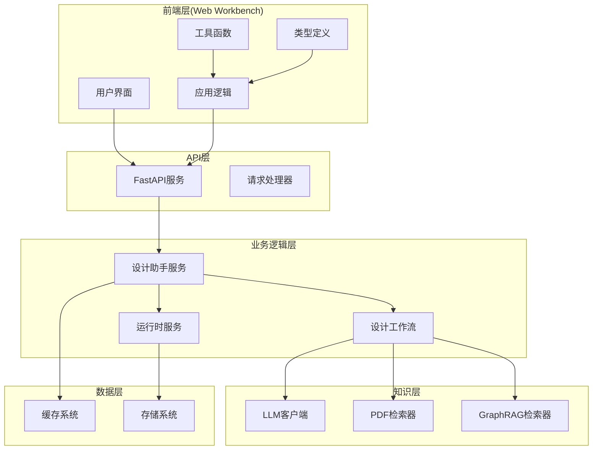
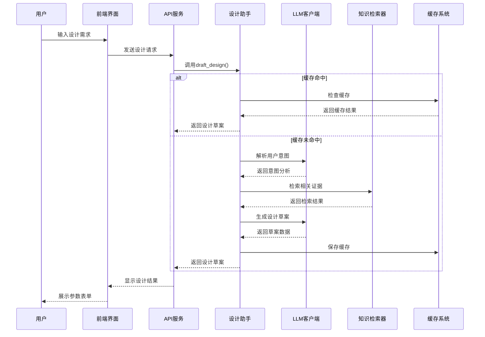
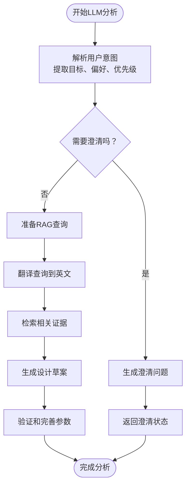
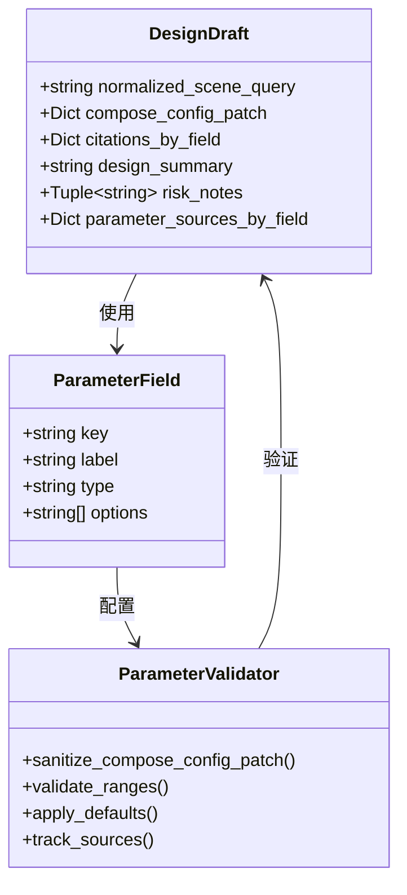
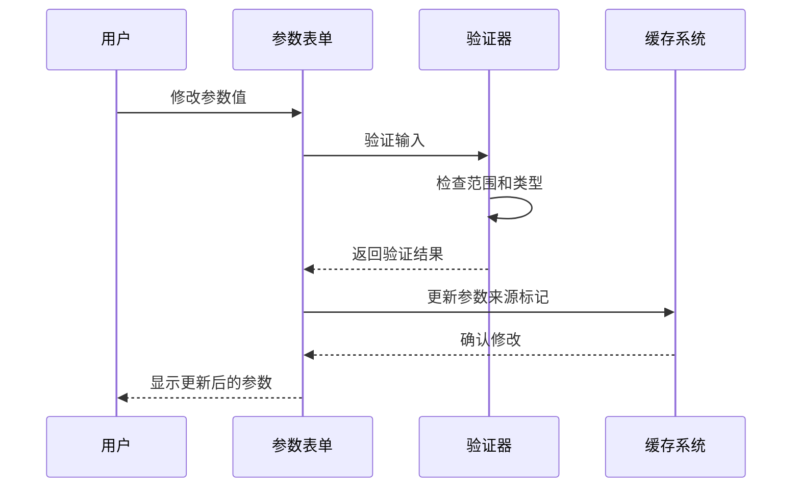
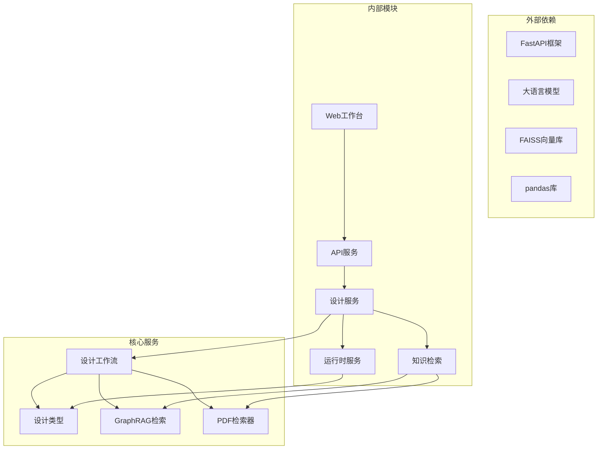

# 设计草案面板

<cite>
**本文档引用的文件**
- [design_workflow.py](file://src/roadgen3d/llm/design_workflow.py)
- [design_types.py](file://src/roadgen3d/services/design_types.py)
- [design_runtime.py](file://src/roadgen3d/services/design_runtime.py)
- [graphrag.py](file://src/roadgen3d/knowledge/graphrag.py)
- [prompts.py](file://src/roadgen3d/llm/prompts.py)
- [main.py](file://web/api/main.py)
- [app.ts](file://web/workbench/src/app.ts)
- [utils.ts](file://web/workbench/src/utils.ts)
- [types.ts](file://web/workbench/src/types.ts)
- [test_design_api.py](file://tests/test_design_api.py)
- [test_design_assistant_service.py](file://tests/test_design_assistant_service.py)
</cite>

## 目录
1. [简介](#简介)
2. [项目结构](#项目结构)
3. [核心组件](#核心组件)
4. [架构概览](#架构概览)
5. [详细组件分析](#详细组件分析)
6. [依赖关系分析](#依赖关系分析)
7. [性能考虑](#性能考虑)
8. [故障排除指南](#故障排除指南)
9. [结论](#结论)

## 简介

设计草案面板是 RoadGen3D 项目中的核心工作台组件，负责将用户的自然语言设计需求转换为可执行的街道设计方案。该面板集成了大型语言模型(LLM)分析、GraphRAG证据整合和参数配置生成功能，为用户提供从概念设计到最终渲染的完整工作流程。

该系统采用模块化架构设计，通过清晰的组件分离实现了高内聚、低耦合的设计原则。用户可以通过直观的界面进行交互，系统自动处理复杂的参数推理和证据检索过程。

## 项目结构

设计草案面板涉及多个层次的组件协作：

**图表来源**
- [app.ts:58-84](file://web/workbench/src/app.ts#L58-L84)
- [main.py:81-90](file://web/api/main.py#L81-L90)
- [design_workflow.py:62-89](file://src/roadgen3d/llm/design_workflow.py#L62-L89)

**章节来源**
- [app.ts:58-84](file://web/workbench/src/app.ts#L58-L84)
- [main.py:81-90](file://web/api/main.py#L81-L90)
- [design_workflow.py:62-89](file://src/roadgen3d/llm/design_workflow.py#L62-L89)

## 核心组件

### 设计助手服务(DesignAssistantService)

设计助手服务是整个系统的核心协调器，负责管理LLM意图解析、RAG搜索和场景生成的完整流程。

**主要职责：**
- LLM意图解析和澄清
- 多源知识检索(RAG)
- 设计草案生成
- 缓存管理和优化
- 错误处理和状态管理

**关键特性：**
- 支持多种知识源(混合、PDF RAG、GraphRAG)
- 智能缓存机制
- 参数验证和默认值填充
- 清晰的错误传播机制

**章节来源**
- [design_workflow.py:112-239](file://src/roadgen3d/llm/design_workflow.py#L112-L239)
- [design_workflow.py:368-459](file://src/roadgen3d/llm/design_workflow.py#L368-L459)

### 设计类型系统(Design Types)

统一的数据类型定义确保了系统各组件间的数据一致性。

**核心数据结构：**
- DesignIntent: 用户意图解析结果
- RagEvidence: 检索到的知识证据
- DesignDraft: 设计草案
- SceneContext: 场景上下文

**章节来源**
- [design_types.py:131-262](file://src/roadgen3d/services/design_types.py#L131-L262)

### 运行时服务(Design Runtime)

负责将确认的设计草案转换为实际的场景生成。

**主要功能：**
- 参数配置构建
- 场景生成选项标准化
- 多种生成后端支持
- 结果缓存和视图器集成

**章节来源**
- [design_runtime.py:60-94](file://src/roadgen3d/services/design_runtime.py#L60-L94)
- [design_runtime.py:336-396](file://src/roadgen3d/services/design_runtime.py#L336-L396)

## 架构概览

设计草案面板采用分层架构，每层都有明确的职责边界：

**图表来源**
- [app.ts:412-444](file://web/workbench/src/app.ts#L412-L444)
- [design_workflow.py:112-239](file://src/roadgen3d/llm/design_workflow.py#L112-L239)
- [main.py:156-171](file://web/api/main.py#L156-L171)

## 详细组件分析

### LLM分析流程

LLM分析是设计草案生成的第一步，负责理解用户需求并提取关键设计要素。

**图表来源**
- [design_workflow.py:134-206](file://src/roadgen3d/llm/design_workflow.py#L134-L206)
- [prompts.py:11-52](file://src/roadgen3d/llm/prompts.py#L11-L52)

**章节来源**
- [design_workflow.py:134-206](file://src/roadgen3d/llm/design_workflow.py#L134-L206)
- [prompts.py:11-52](file://src/roadgen3d/llm/prompts.py#L11-L52)

### GraphRAG证据整合

GraphRAG系统提供了强大的知识检索能力，支持多种检索模式。

**检索策略：**
- 官方GraphRAG运行时优先
- 合并txt语料作为回退
- 混合检索模式
- 参数提示自动提取

**章节来源**
- [graphrag.py:403-422](file://src/roadgen3d/knowledge/graphrag.py#L403-L422)
- [design_workflow.py:507-539](file://src/roadgen3d/llm/design_workflow.py#L507-L539)

### 参数配置生成

参数配置生成是将设计需求转换为具体数值参数的过程。

**图表来源**
- [design_types.py:177-200](file://src/roadgen3d/services/design_types.py#L177-L200)
- [design_types.py:61-84](file://src/roadgen3d/services/design_types.py#L61-L84)

**章节来源**
- [design_types.py:177-200](file://src/roadgen3d/services/design_types.py#L177-L200)
- [design_types.py:61-84](file://src/roadgen3d/services/design_types.py#L61-L84)

### 参数表单渲染

参数表单渲染系统提供了用户友好的参数编辑界面。

**字段分类：**
- 文本字段: query, target_street_type, city_context
- 数字字段: length_m, road_width_m, sidewalk_width_m, lane_count, density
- 选择字段: design_rule_profile, objective_profile, ped_demand_level等

**章节来源**
- [app.ts:849-876](file://web/workbench/src/app.ts#L849-L876)
- [utils.ts:154-182](file://web/workbench/src/utils.ts#L154-L182)
- [types.ts:207-227](file://web/workbench/src/types.ts#L207-L227)

### 证据列表展示

证据列表展示了支持设计决策的相关依据。

**显示内容：**
- 截取文本片段
- 来源路径和页码
- 相关性评分
- 参数提示信息
- 引用来源标注

**章节来源**
- [design_workflow.py:704-744](file://src/roadgen3d/llm/design_workflow.py#L704-L744)
- [graphrag.py:444-456](file://src/roadgen3d/knowledge/graphrag.py#L444-L456)

### 草案摘要生成

草案摘要提供了设计要点的高层次总结。

**摘要内容：**
- 设计要点总结
- 风险评估和注意事项
- 建议说明和改进方向
- 参数来源追踪

**章节来源**
- [design_workflow.py:667-701](file://src/roadgen3d/llm/design_workflow.py#L667-L701)
- [utils.ts:137-142](file://web/workbench/src/utils.ts#L137-L142)

### 参数确认流程

参数确认流程确保用户能够审查和修改设计参数。

**图表来源**
- [utils.ts:154-182](file://web/workbench/src/utils.ts#L154-L182)
- [design_types.py:61-84](file://src/roadgen3d/services/design_types.py#L61-L84)

**章节来源**
- [utils.ts:154-182](file://web/workbench/src/utils.ts#L154-L182)
- [design_types.py:61-84](file://src/roadgen3d/services/design_types.py#L61-L84)

### 错误检查和警告提示

系统实现了多层次的错误检查和用户反馈机制。

**错误类型：**
- 缓存命中检测
- 参数范围验证
- 知识源可用性检查
- LLM响应错误处理

**章节来源**
- [design_workflow.py:428-437](file://src/roadgen3d/llm/design_workflow.py#L428-L437)
- [design_workflow.py:504-505](file://src/roadgen3d/llm/design_workflow.py#L504-L505)

### 草案编辑、重新生成和缓存管理

系统支持动态的草案编辑和智能缓存管理。

**缓存策略：**
- 基于提示词和知识源的缓存键
- 版本化的缓存格式
- 自动缓存失效和重建
- 内存和磁盘双重缓存

**章节来源**
- [design_workflow.py:368-459](file://src/roadgen3d/llm/design_workflow.py#L368-L459)
- [test_design_assistant_service.py:318-352](file://tests/test_design_assistant_service.py#L318-L352)

## 依赖关系分析

设计草案面板的依赖关系体现了清晰的分层架构：

**图表来源**
- [main.py:21-30](file://web/api/main.py#L21-L30)
- [design_workflow.py:11-26](file://src/roadgen3d/llm/design_workflow.py#L11-L26)

**章节来源**
- [main.py:21-30](file://web/api/main.py#L21-L30)
- [design_workflow.py:11-26](file://src/roadgen3d/llm/design_workflow.py#L11-L26)

## 性能考虑

设计草案面板在性能方面采用了多项优化策略：

**缓存优化：**
- 基于SHA256的稳定缓存键
- 版本化缓存格式防止不兼容
- 自动清理过期缓存文件
- 内存缓存加速频繁访问

**检索优化：**
- GraphRAG运行时优先策略
- 混合检索减少单点故障
- 智能查询翻译减少无效检索
- 结果去重和排序优化

**渲染优化：**
- 懒加载和虚拟滚动
- 增量更新机制
- 最小化DOM操作
- 批量状态更新

## 故障排除指南

### 常见问题和解决方案

**知识源不可用：**
- 检查GraphRAG运行时环境
- 验证PDF知识库构建状态
- 确认网络连接和文件权限

**LLM响应错误：**
- 检查模型配置和认证
- 验证API密钥有效性
- 查看网络超时设置

**参数验证失败：**
- 检查参数范围限制
- 验证数据类型匹配
- 确认必填字段完整性

**缓存问题：**
- 清理损坏的缓存文件
- 检查磁盘空间充足性
- 验证缓存目录权限

**章节来源**
- [design_workflow.py:492-505](file://src/roadgen3d/llm/design_workflow.py#L492-L505)
- [main.py:167-171](file://web/api/main.py#L167-L171)

## 结论

设计草案面板是一个高度集成的设计工作台，成功地将复杂的AI技术封装为用户友好的界面。其核心优势包括：

**架构优势：**
- 清晰的分层设计便于维护和扩展
- 智能缓存系统提升用户体验
- 多源知识检索增强设计质量

**功能优势：**
- 完整的设计工作流程覆盖
- 实时参数验证和反馈
- 丰富的证据支持和溯源

**技术优势：**
- 基于最新AI技术的智能分析
- 高效的缓存和检索机制
- 稳定可靠的错误处理

该系统为城市规划师、景观设计师和研究人员提供了一个强大而易用的设计工具，显著提升了街道设计的效率和质量。