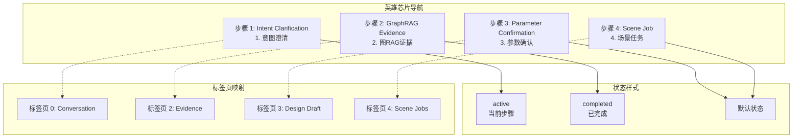
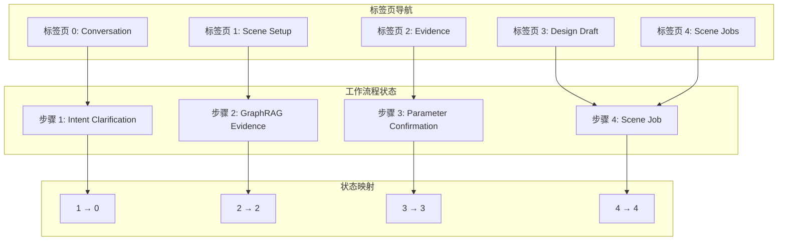
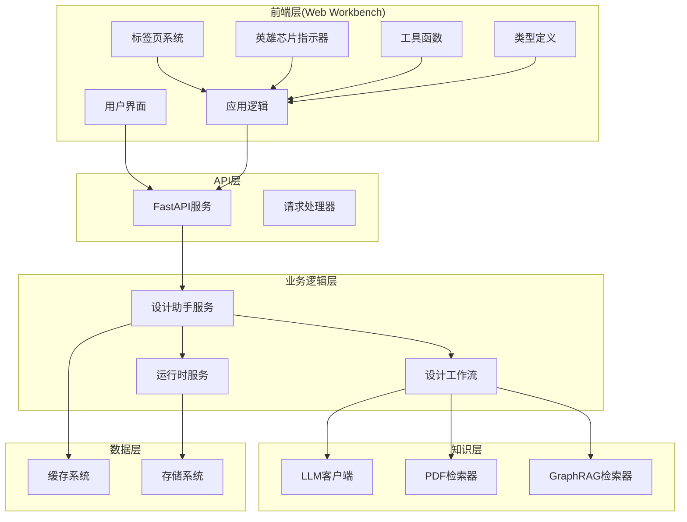
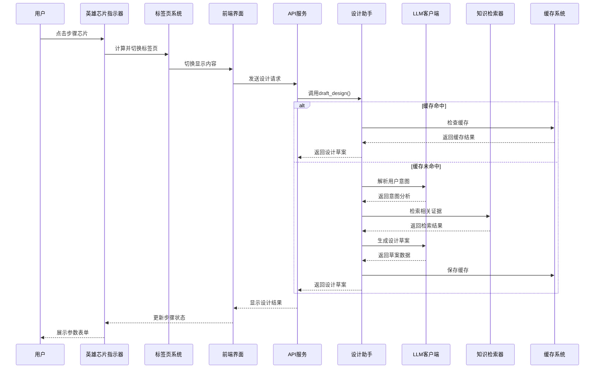
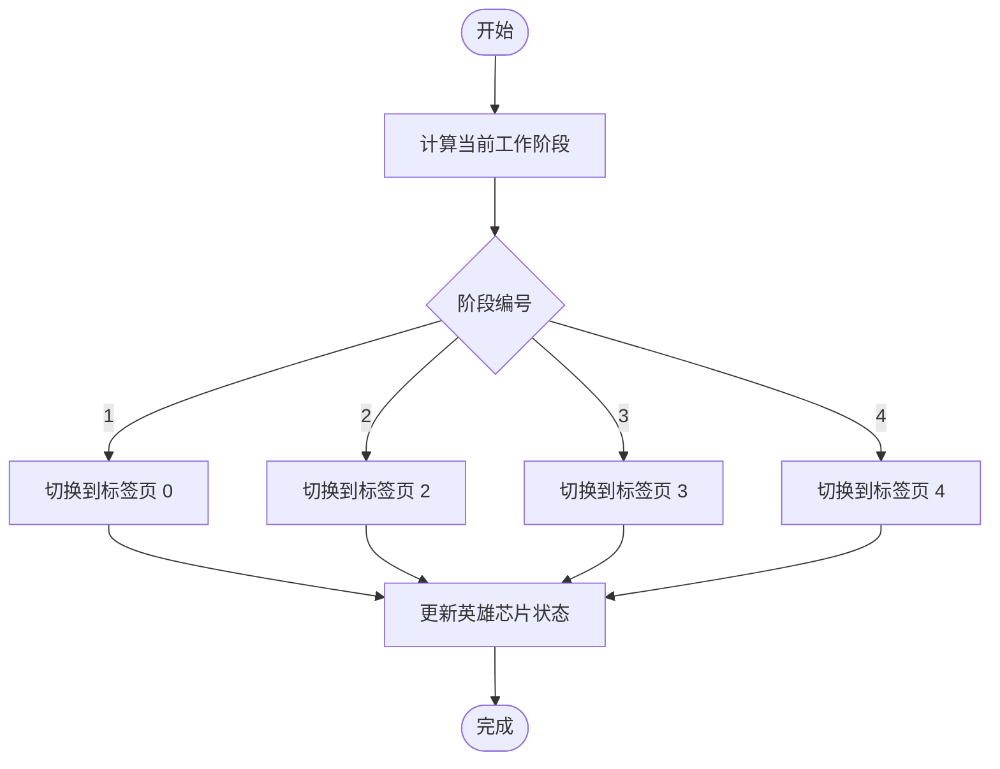
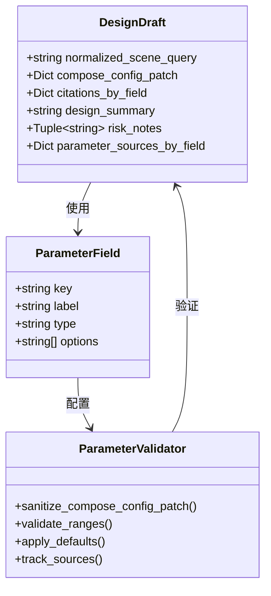
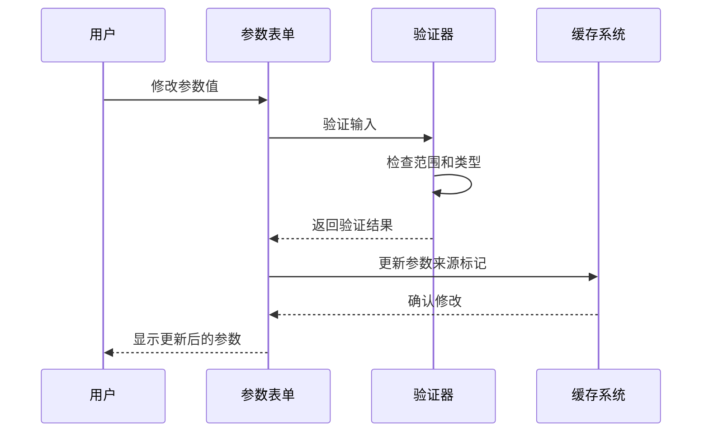
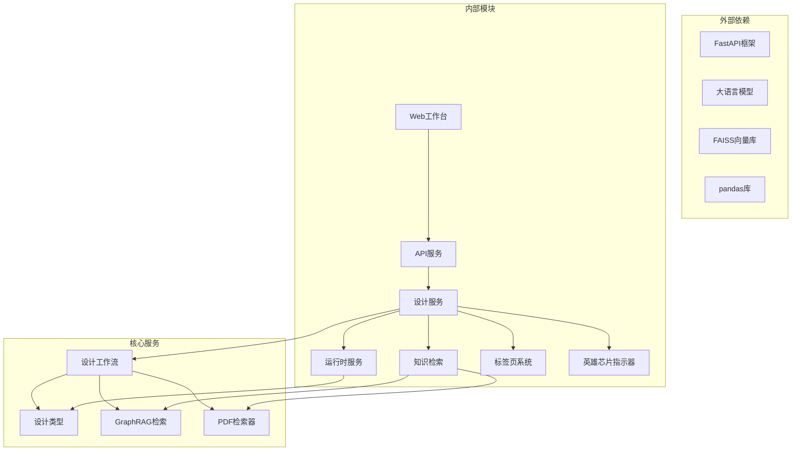

# 设计草案面板

<cite>
**本文档引用的文件**
- [app.ts](file://web/workbench/src/app.ts)
- [style.css](file://web/workbench/src/style.css)
- [main.py](file://web/api/main.py)
- [design_workflow.py](file://src/roadgen3d/llm/design_workflow.py)
- [design_types.py](file://src/roadgen3d/services/design_types.py)
- [design_runtime.py](file://src/roadgen3d/services/design_runtime.py)
- [graphrag.py](file://src/roadgen3d/knowledge/graphrag.py)
- [prompts.py](file://src/roadgen3d/llm/prompts.py)
- [utils.ts](file://web/workbench/src/utils.ts)
- [types.ts](file://web/workbench/src/types.ts)
- [test_design_api.py](file://tests/test_design_api.py)
- [test_design_assistant_service.py](file://tests/test_design_assistant_service.py)
</cite>

## 更新摘要
**变更内容**
- 新增英雄芯片步骤指示器系统，提供可视化的工作流程导航
- 设计草案面板集成到五标签页系统中的第四个位置
- 增强参数表单渲染功能，支持字段分类、默认值设置和用户修改验证
- 完善证据列表展示，包括设计依据、引用来源和相关性标注
- 优化草稿摘要生成，包含设计要点总结、风险评估和建议说明
- 实现智能缓存管理和错误检查机制

## 目录
1. [简介](#简介)
2. [英雄芯片步骤指示器](#英雄芯片步骤指示器)
3. [标签页系统架构](#标签页系统架构)
4. [项目结构](#项目结构)
5. [核心组件](#核心组件)
6. [架构概览](#架构概览)
7. [详细组件分析](#详细组件分析)
8. [依赖关系分析](#依赖关系分析)
9. [性能考虑](#性能考虑)
10. [故障排除指南](#故障排除指南)
11. [结论](#结论)

## 简介

设计草案面板是 RoadGen3D 项目中的核心工作台组件，负责将用户的自然语言设计需求转换为可执行的街道设计方案。该面板集成了大型语言模型(LLM)分析、GraphRAG证据整合和参数配置生成功能，为用户提供从概念设计到最终渲染的完整工作流程。

该系统采用模块化架构设计，通过清晰的组件分离实现了高内聚、低耦合的设计原则。用户可以通过直观的界面进行交互，系统自动处理复杂的参数推理和证据检索过程。

**更新** 设计草案面板现已集成到全新的五标签页系统中，作为第四个工作阶段（Design Draft）呈现，提供更直观的工作流程导航。系统还包含了英雄芯片步骤指示器，为用户提供可视化的工作流程状态跟踪。

## 英雄芯片步骤指示器

英雄芯片步骤指示器是设计草案面板的重要视觉导航组件，提供了直观的工作流程状态跟踪：

**图表来源**
- [app.ts:109-117](file://web/workbench/src/app.ts#L109-L117)
- [app.ts:131-136](file://web/workbench/src/app.ts#L131-L136)
- [app.ts:94-97](file://web/workbench/src/app.ts#L94-L97)

**章节来源**
- [app.ts:109-117](file://web/workbench/src/app.ts#L109-L117)
- [app.ts:131-136](file://web/workbench/src/app.ts#L131-L136)
- [app.ts:94-97](file://web/workbench/src/app.ts#L94-L97)

## 标签页系统架构

设计草案面板现在位于 RoadGen3D 工作台的标签页系统中，采用五阶段工作流程设计：

**图表来源**
- [app.ts:84-97](file://web/workbench/src/app.ts#L84-L97)
- [app.ts:94-97](file://web/workbench/src/app.ts#L94-L97)

**章节来源**
- [app.ts:84-97](file://web/workbench/src/app.ts#L84-L97)
- [app.ts:162-168](file://web/workbench/src/app.ts#L162-L168)
- [app.ts:94-97](file://web/workbench/src/app.ts#L94-L97)

## 项目结构

设计草案面板涉及多个层次的组件协作，现已集成到标签页系统中：

**图表来源**
- [app.ts:58-84](file://web/workbench/src/app.ts#L58-L84)
- [main.py:81-90](file://web/api/main.py#L81-L90)
- [design_workflow.py:62-89](file://src/roadgen3d/llm/design_workflow.py#L62-89)

**章节来源**
- [app.ts:58-84](file://web/workbench/src/app.ts#L58-L84)
- [main.py:81-90](file://web/api/main.py#L81-L90)
- [design_workflow.py:62-89](file://src/roadgen3d/llm/design_workflow.py#L62-89)

## 核心组件

### 英雄芯片步骤指示器

英雄芯片步骤指示器是设计草案面板的可视化导航组件，提供实时的工作流程状态反馈：

**主要职责：**
- 实时计算当前工作阶段
- 动态更新芯片状态样式
- 自动切换对应标签页
- 提供点击导航功能

**关键特性：**
- 四个步骤的完整工作流程跟踪
- 活跃状态（active）和已完成状态（completed）区分
- 自动标签页同步切换
- 响应式设计适配

**章节来源**
- [app.ts:87-117](file://web/workbench/src/app.ts#L87-L117)
- [style.css:115-141](file://web/workbench/src/style.css#L115-L141)

### 标签页管理系统

标签页系统是设计草案面板集成的核心基础设施，负责管理五个工作阶段的导航和状态同步。

**主要职责：**
- 标签页按钮事件处理
- 工作流程状态映射
- 动态内容切换
- 响应式布局适配

**关键特性：**
- 五阶段工作流程：Conversation → Scene Setup → Evidence → Design Draft → Scene Jobs
- 智能状态同步：根据当前工作阶段自动切换标签页
- 响应式设计：支持移动端和桌面端的标签页布局
- 英雄芯片集成：与步骤指示器无缝配合

**章节来源**
- [app.ts:99-117](file://web/workbench/src/app.ts#L99-L117)
- [app.ts:396-410](file://web/workbench/src/app.ts#L396-L410)
- [style.css:696-761](file://web/workbench/src/style.css#L696-L761)

### 设计助手服务(DesignAssistantService)

设计助手服务是整个系统的核心协调器，负责管理LLM意图解析、RAG搜索和场景生成的完整流程。

**主要职责：**
- LLM意图解析和澄清
- 多源知识检索(RAG)
- 设计草案生成
- 缓存管理和优化
- 错误处理和状态管理

**关键特性：**
- 支持多种知识源(混合、PDF RAG、GraphRAG)
- 智能缓存机制
- 参数验证和默认值填充
- 清晰的错误传播机制

**章节来源**
- [design_workflow.py:112-239](file://src/roadgen3d/llm/design_workflow.py#L112-L239)
- [design_workflow.py:368-459](file://src/roadgen3d/llm/design_workflow.py#L368-L459)

### 设计类型系统(Design Types)

统一的数据类型定义确保了系统各组件间的数据一致性。

**核心数据结构：**
- DesignIntent: 用户意图解析结果
- RagEvidence: 检索到的知识证据
- DesignDraft: 设计草案
- SceneContext: 场景上下文

**章节来源**
- [design_types.py:131-262](file://src/roadgen3d/services/design_types.py#L131-L262)

### 运行时服务(Design Runtime)

负责将确认的设计草案转换为实际的场景生成。

**主要功能：**
- 参数配置构建
- 场景生成选项标准化
- 多种生成后端支持
- 结果缓存和视图器集成

**章节来源**
- [design_runtime.py:60-94](file://src/roadgen3d/services/design_runtime.py#L60-L94)
- [design_runtime.py:336-396](file://src/roadgen3d/services/design_runtime.py#L336-L396)

## 架构概览

设计草案面板采用分层架构，每层都有明确的职责边界，并通过标签页系统实现工作流程的可视化管理：

**图表来源**
- [app.ts:412-444](file://web/workbench/src/app.ts#L412-L444)
- [design_workflow.py:112-239](file://src/roadgen3d/llm/design_workflow.py#L112-L239)
- [main.py:156-171](file://web/api/main.py#L156-L171)

## 详细组件分析

### 英雄芯片导航机制

英雄芯片指示器提供了直观的工作流程导航，每个芯片代表一个特定的工作阶段：

**芯片结构：**
- 步骤编号：1-4
- 阶段名称：Intent Clarification, GraphRAG Evidence, Parameter Confirmation, Scene Job
- 状态样式：active（当前）、completed（已完成）、默认

**章节来源**
- [app.ts:131-136](file://web/workbench/src/app.ts#L131-L136)
- [app.ts:109-117](file://web/workbench/src/app.ts#L109-L117)

### 标签页导航机制

标签页系统提供了直观的工作流程导航，设计草案面板作为第四个工作阶段：

**标签页结构：**
- 标签页 0: Conversation - 意图澄清和对话
- 标签页 1: Scene Setup - 场景设置和参数配置
- 标签页 2: Evidence - 图RAG证据展示
- 标签页 3: Design Draft - 设计草案和参数确认
- 标签页 4: Scene Jobs - 场景生成任务管理

**章节来源**
- [app.ts:162-168](file://web/workbench/src/app.ts#L162-L168)
- [app.ts:94-97](file://web/workbench/src/app.ts#L94-L97)

### 工作流程状态管理

系统实现了智能的工作流程状态管理，确保标签页与工作阶段的同步：

**图表来源**
- [app.ts:87-97](file://web/workbench/src/app.ts#L87-L97)
- [app.ts:94-97](file://web/workbench/src/app.ts#L94-L97)

**章节来源**
- [app.ts:87-97](file://web/workbench/src/app.ts#L87-L97)
- [app.ts:94-97](file://web/workbench/src/app.ts#L94-L97)

### LLM分析流程

LLM分析是设计草案生成的第一步，负责理解用户需求并提取关键设计要素。

**图表来源**
- [design_workflow.py:134-206](file://src/roadgen3d/llm/design_workflow.py#L134-L206)
- [prompts.py:11-52](file://src/roadgen3d/llm/prompts.py#L11-L52)

**章节来源**
- [design_workflow.py:134-206](file://src/roadgen3d/llm/design_workflow.py#L134-L206)
- [prompts.py:11-52](file://src/roadgen3d/llm/prompts.py#L11-L52)

### GraphRAG证据整合

GraphRAG系统提供了强大的知识检索能力，支持多种检索模式。

**检索策略：**
- 官方GraphRAG运行时优先
- 合并txt语料作为回退
- 混合检索模式
- 参数提示自动提取

**章节来源**
- [graphrag.py:403-422](file://src/roadgen3d/knowledge/graphrag.py#L403-L422)
- [design_workflow.py:507-539](file://src/roadgen3d/llm/design_workflow.py#L507-L539)

### 参数配置生成

参数配置生成是将设计需求转换为具体数值参数的过程。

**图表来源**
- [design_types.py:177-200](file://src/roadgen3d/services/design_types.py#L177-L200)
- [design_types.py:61-84](file://src/roadgen3d/services/design_types.py#L61-L84)

**章节来源**
- [design_types.py:177-200](file://src/roadgen3d/services/design_types.py#L177-L200)
- [design_types.py:61-84](file://src/roadgen3d/services/design_types.py#L61-L84)

### 参数表单渲染

参数表单渲染系统提供了用户友好的参数编辑界面。

**字段分类：**
- 文本字段: query, target_street_type, city_context
- 数字字段: length_m, road_width_m, sidewalk_width_m, lane_count, density
- 选择字段: design_rule_profile, objective_profile, ped_demand_level等

**章节来源**
- [app.ts:849-876](file://web/workbench/src/app.ts#L849-L876)
- [utils.ts:154-182](file://web/workbench/src/utils.ts#L154-L182)
- [types.ts:207-227](file://web/workbench/src/types.ts#L207-L227)

### 证据列表展示

证据列表展示了支持设计决策的相关依据。

**显示内容：**
- 截取文本片段
- 来源路径和页码
- 相关性评分
- 参数提示信息
- 引用来源标注

**章节来源**
- [design_workflow.py:704-744](file://src/roadgen3d/llm/design_workflow.py#L704-L744)
- [graphrag.py:444-456](file://src/roadgen3d/knowledge/graphrag.py#L444-L456)

### 草案摘要生成

草案摘要提供了设计要点的高层次总结。

**摘要内容：**
- 设计要点总结
- 风险评估和注意事项
- 建议说明和改进方向
- 参数来源追踪

**章节来源**
- [design_workflow.py:667-701](file://src/roadgen3d/llm/design_workflow.py#L667-L701)
- [utils.ts:137-142](file://web/workbench/src/utils.ts#L137-L142)

### 参数确认流程

参数确认流程确保用户能够审查和修改设计参数。

**图表来源**
- [utils.ts:154-182](file://web/workbench/src/utils.ts#L154-L182)
- [design_types.py:61-84](file://src/roadgen3d/services/design_types.py#L61-L84)

**章节来源**
- [utils.ts:154-182](file://web/workbench/src/utils.ts#L154-L182)
- [design_types.py:61-84](file://src/roadgen3d/services/design_types.py#L61-L84)

### 错误检查和警告提示

系统实现了多层次的错误检查和用户反馈机制。

**错误类型：**
- 缓存命中检测
- 参数范围验证
- 知识源可用性检查
- LLM响应错误处理

**章节来源**
- [design_workflow.py:428-437](file://src/roadgen3d/llm/design_workflow.py#L428-L437)
- [design_workflow.py:504-505](file://src/roadgen3d/llm/design_workflow.py#L504-L505)

### 草案编辑、重新生成和缓存管理

系统支持动态的草案编辑和智能缓存管理。

**缓存策略：**
- 基于SHA256的稳定缓存键
- 版本化的缓存格式
- 自动缓存失效和重建
- 内存和磁盘双重缓存

**章节来源**
- [design_workflow.py:368-459](file://src/roadgen3d/llm/design_workflow.py#L368-L459)
- [test_design_assistant_service.py:318-352](file://tests/test_design_assistant_service.py#L318-L352)

## 依赖关系分析

设计草案面板的依赖关系体现了清晰的分层架构，现已集成到标签页系统中：

**图表来源**
- [main.py:21-30](file://web/api/main.py#L21-L30)
- [design_workflow.py:11-26](file://src/roadgen3d/llm/design_workflow.py#L11-L26)

**章节来源**
- [main.py:21-30](file://web/api/main.py#L21-L30)
- [design_workflow.py:11-26](file://src/roadgen3d/llm/design_workflow.py#L11-L26)

## 性能考虑

设计草案面板在性能方面采用了多项优化策略，英雄芯片指示器和标签页系统的引入进一步提升了用户体验：

**英雄芯片性能优化：**
- 实时状态计算避免重复渲染
- CSS类切换比DOM操作更高效
- 事件委托减少内存占用
- 响应式设计适配不同屏幕尺寸

**标签页性能优化：**
- 懒加载机制：仅在激活时渲染标签页内容
- 内存缓存：保持已渲染标签页的状态
- 事件委托：减少DOM事件监听器数量
- CSS动画：流畅的标签页切换效果

**缓存优化：**
- 基于SHA256的稳定缓存键
- 版本化缓存格式防止不兼容
- 自动清理过期缓存文件
- 内存缓存加速频繁访问

**检索优化：**
- GraphRAG运行时优先策略
- 混合检索减少单点故障
- 智能查询翻译减少无效检索
- 结果去重和排序优化

**渲染优化：**
- 懒加载和虚拟滚动
- 增量更新机制
- 最小化DOM操作
- 批量状态更新

## 故障排除指南

### 常见问题和解决方案

**英雄芯片导航问题：**
- 检查computePipelineStep函数逻辑
- 验证pipelineStepToTab映射正确性
- 确认CSS样式类名与状态匹配

**标签页导航问题：**
- 检查标签页按钮事件绑定
- 验证状态映射函数正确性
- 确认CSS样式类名一致

**知识源不可用：**
- 检查GraphRAG运行时环境
- 验证PDF知识库构建状态
- 确认网络连接和文件权限

**LLM响应错误：**
- 检查模型配置和认证
- 验证API密钥有效性
- 查看网络超时设置

**参数验证失败：**
- 检查参数范围限制
- 验证数据类型匹配
- 确认必填字段完整性

**缓存问题：**
- 清理损坏的缓存文件
- 检查磁盘空间充足性
- 验证缓存目录权限

**章节来源**
- [design_workflow.py:492-505](file://src/roadgen3d/llm/design_workflow.py#L492-L505)
- [main.py:167-171](file://web/api/main.py#L167-L171)

## 结论

设计草案面板经过重构后，成功地集成到全新的五标签页系统中，成为 RoadGen3D 工作流程的重要组成部分。其核心优势包括：

**架构优势：**
- 清晰的分层设计便于维护和扩展
- 智能缓存系统提升用户体验
- 多源知识检索增强设计质量
- 英雄芯片指示器提供直观的工作流程导航
- 标签页系统提供直观的工作流程导航

**功能优势：**
- 完整的设计工作流程覆盖
- 实时参数验证和反馈
- 丰富的证据支持和溯源
- 响应式标签页布局适配多设备
- 可视化步骤指示器增强用户体验

**技术优势：**
- 基于最新AI技术的智能分析
- 高效的缓存和检索机制
- 稳定可靠的错误处理
- 流畅的标签页切换体验
- 实时状态同步机制

该系统为城市规划师、景观设计师和研究人员提供了一个强大而易用的设计工具，显著提升了街道设计的效率和质量。英雄芯片指示器和标签页系统的引入使得复杂的工作流程变得更加直观和易于管理，用户可以清晰地了解当前所处的工作阶段并进行相应的操作。设计草案面板现在作为第四个工作阶段，为用户提供了一个完整的从意图澄清到参数确认再到场景生成的全流程体验。