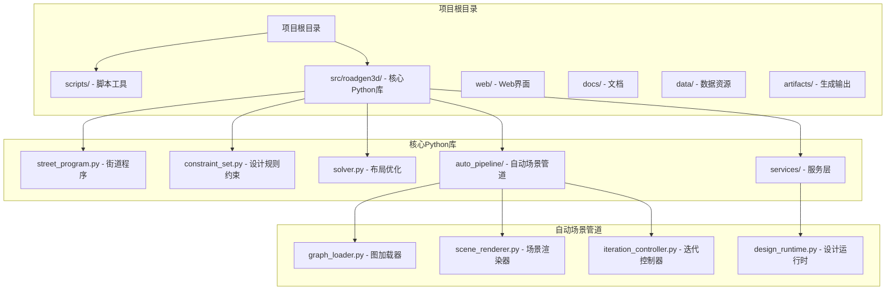
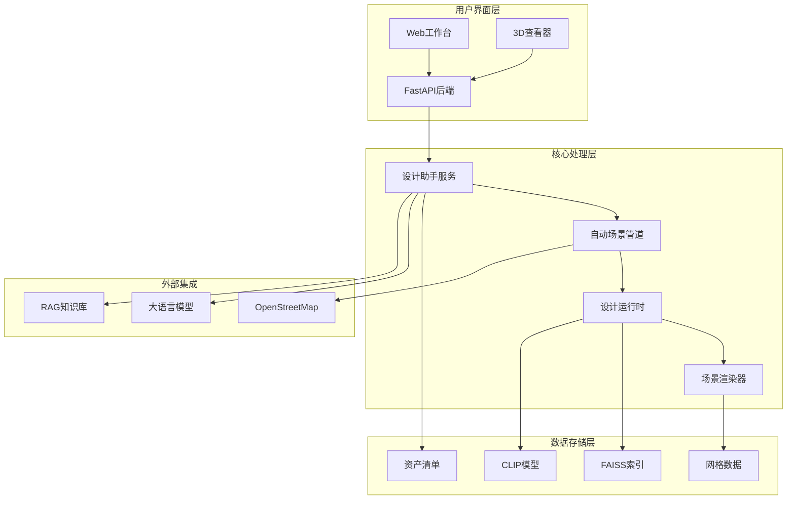
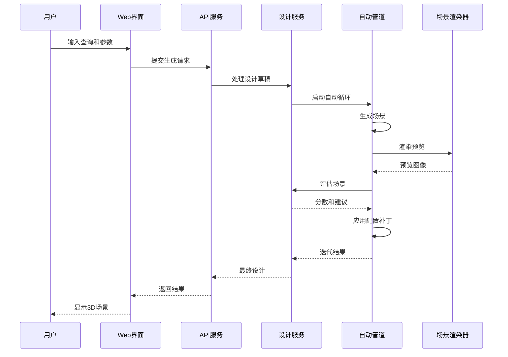
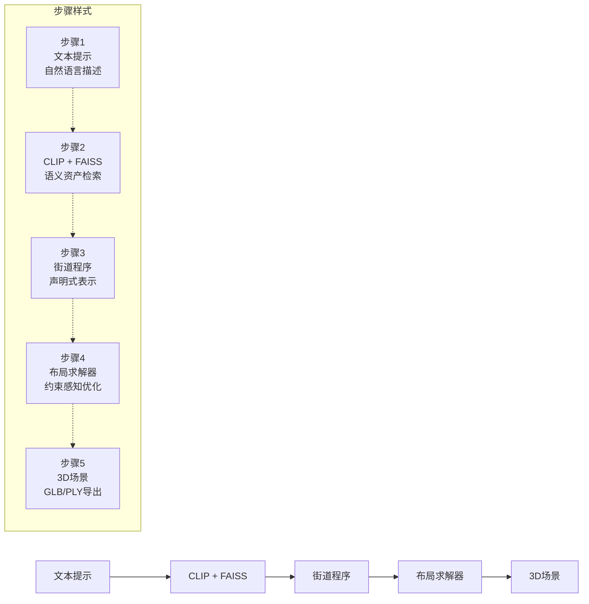
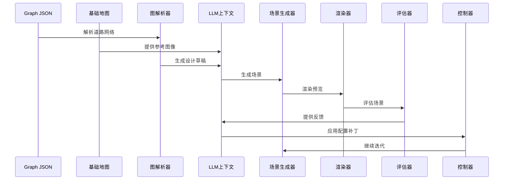
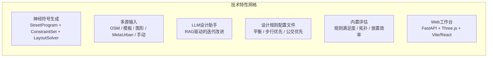
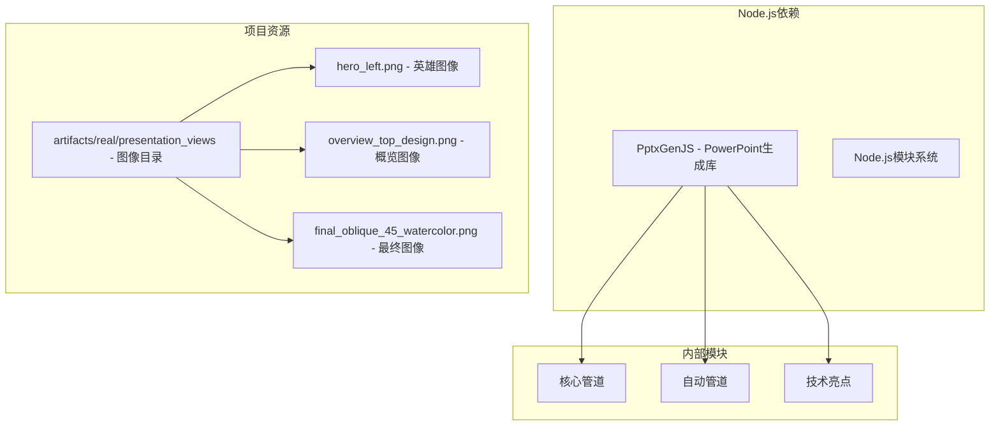

# PowerPoint演示文稿生成脚本

<cite>
**本文档引用的文件**
- [generate_ppt.mjs](file://generate_ppt.mjs)
- [README.md](file://README.md)
- [docs/roadmap.md](file://docs/roadmap.md)
- [docs/current_system_review.md](file://docs/current_system_review.md)
- [docs/m6_neurosymbolic_street_generation.md](file://docs/m6_neurosymbolic_street_generation.md)
- [scripts/auto_scene_pipeline.py](file://scripts/auto_scene_pipeline.py)
- [src/roadgen3d/auto_pipeline/iteration_controller.py](file://src/roadgen3d/auto_pipeline/iteration_controller.py)
- [src/roadgen3d/services/design_runtime.py](file://src/roadgen3d/services/design_runtime.py)
</cite>

## 目录
1. [简介](#简介)
2. [项目结构](#项目结构)
3. [核心组件](#核心组件)
4. [架构概览](#架构概览)
5. [详细组件分析](#详细组件分析)
6. [依赖关系分析](#依赖关系分析)
7. [性能考虑](#性能考虑)
8. [故障排除指南](#故障排除指南)
9. [结论](#结论)

## 简介

RoadGen3D是一个基于神经符号系统的文本到3D城市街道场景生成系统。该项目的核心目标是将自然语言描述转换为详细的3D城市街道场景，通过检索相关资产、规划街道布局并导出完整的3D场景（GLB/PLY格式）。

该PowerPoint演示文稿生成脚本专门用于创建项目概述演示文稿，展示了RoadGen3D系统的技术架构、核心功能和创新特性。脚本使用PptxGenJS库创建专业的演示文稿，包含四个精心设计的幻灯片，涵盖了从技术概览到具体实现的完整内容。

## 项目结构

RoadGen3D项目采用模块化架构，主要包含以下核心组件：

**图表来源**
- [README.md:191-220](file://README.md#L191-L220)
- [generate_ppt.mjs:1-370](file://generate_ppt.mjs#L1-L370)

**章节来源**
- [README.md:191-220](file://README.md#L191-L220)
- [generate_ppt.mjs:1-370](file://generate_ppt.mjs#L1-L370)

## 核心组件

### PptxGenJS演示文稿引擎

演示文稿生成脚本基于PptxGenJS库，这是一个强大的JavaScript库，用于创建和自定义PowerPoint演示文稿。该库提供了丰富的API来创建幻灯片、添加文本、图像和各种形状元素。

### 颜色主题系统

脚本实现了专为城市科技设计的"海洋渐变"配色方案，包含以下颜色变量：

- **深海蓝色系**: deepNavy (0D1B2A), darkBlue (1B2838), midBlue (1B4965)
- **海洋绿色系**: teal (065A82), seafoam (00A896), mint (02C39A)
- **中性色调**: lightGray (E8ECF1), offWhite (F4F6F9), white (FFFFFF)
- **强调色**: accent (62B6CB), textDark (1A1A2E), textMid (3D405B)

### 幻灯片布局系统

脚本创建了四个精心设计的幻灯片，每个都有特定的主题和视觉风格：

1. **标题幻灯片**: 展示项目名称和标语
2. **核心管道幻灯片**: 描述主要的生成流程
3. **自动场景管道幻灯片**: 详细说明LLM驱动的循环系统
4. **技术亮点幻灯片**: 总结关键技术特性和优势

**章节来源**
- [generate_ppt.mjs:10-25](file://generate_ppt.mjs#L10-L25)
- [generate_ppt.mjs:32-72](file://generate_ppt.mjs#L32-L72)
- [generate_ppt.mjs:192-362](file://generate_ppt.mjs#L192-L362)

## 架构概览

### 系统架构图

**图表来源**
- [README.md:222-271](file://README.md#L222-L271)
- [docs/current_system_review.md:117-134](file://docs/current_system_review.md#L117-L134)

### 数据流图

**图表来源**
- [scripts/auto_scene_pipeline.py:88-135](file://scripts/auto_scene_pipeline.py#L88-L135)
- [src/roadgen3d/auto_pipeline/iteration_controller.py:48-173](file://src/roadgen3d/auto_pipeline/iteration_controller.py#L48-L173)

**章节来源**
- [README.md:222-271](file://README.md#L222-L271)
- [docs/current_system_review.md:117-134](file://docs/current_system_review.md#L117-L134)

## 详细组件分析

### 核心管道幻灯片分析

#### 流程步骤设计

核心管道幻灯片展示了RoadGen3D的五个主要处理步骤，每个步骤都用圆角矩形框表示，并配有相应的图标和描述：

**图表来源**
- [generate_ppt.mjs:94-100](file://generate_ppt.mjs#L94-L100)
- [generate_ppt.mjs:108-157](file://generate_ppt.mjs#L108-L157)

#### 特性网格布局

幻灯片底部包含了四个关键特性的网格布局，每个特性都用椭圆形徽章标记，体现了系统的核心优势：

- **神经检索**: 使用CLIP文本嵌入进行神经网络检索
- **符号街道程序**: 可编辑的声明式结构
- **约束感知布局**: 具有碰撞检测的布局
- **多源输入**: OSM、模板、图形、手动等多种来源

**章节来源**
- [generate_ppt.mjs:159-187](file://generate_ppt.mjs#L159-L187)

### 自动场景管道幻灯片分析

#### LLM驱动的循环系统

自动场景管道幻灯片详细描述了LLM驱动的闭合循环系统，该系统包含六个主要步骤：

1. **输入**: graph.json + base_map.png
2. **解析与组合**: 图解析器 + LLM上下文
3. **场景生成**: compose_street_scene()
4. **渲染预览**: 顶视图 → preview.png
5. **LLM评估**: 评分 + 建议 + config_patch
6. **迭代**: 应用补丁 → 循环（最多3轮）

**图表来源**
- [generate_ppt.mjs:206-213](file://generate_ppt.mjs#L206-L213)
- [generate_ppt.mjs:221-256](file://generate_ppt.mjs#L221-L256)

#### 场景图像展示

幻灯片右侧展示了两个关键的场景图像，包括顶视图场景概览和水彩斜视45度视图，这些图像来自artifacts/real/presentation_views目录。

**章节来源**
- [generate_ppt.mjs:258-279](file://generate_ppt.mjs#L258-L279)

### 技术亮点幻灯片分析

#### 六个核心技术亮点

技术亮点幻灯片展示了RoadGen3D的六个主要技术特性，每个特性都用圆角矩形卡片表示：

1. **神经符号生成**: StreetProgram + ConstraintSet + LayoutSolver (M6)
2. **多源输入**: OSM / 模板 / 图形 / MetaUrban / 手动
3. **LLM设计助手**: 基于RAG的设计，支持迭代改进
4. **设计规则配置文件**: 平衡、步行优先、公交优先
5. **内置评估**: 规则满足度、拓扑、放置效率
6. **Web工作台**: FastAPI + Three.js查看器 + Vite/React UI

**图表来源**
- [generate_ppt.mjs:298-305](file://generate_ppt.mjs#L298-L305)
- [generate_ppt.mjs:315-345](file://generate_ppt.mjs#L315-L345)

**章节来源**
- [generate_ppt.mjs:282-362](file://generate_ppt.mjs#L282-L362)

### 标题幻灯片分析

#### 视觉设计元素

标题幻灯片采用了深海蓝色背景，营造了专业和科技感的视觉效果。主要内容包括：

- **主标题**: "RoadGen3D" - 使用Arial Black字体，54号字
- **副标题**: "Text-to-3D Urban Street Scene Generation" - 22号字，强调色
- **标语**: "A Neuro-Symbolic System for Intelligent Street Design" - 16号字，斜体
- **英雄图像**: 右侧展示hero_left.png图像，4.8x5.8英寸
- **信息栏**: 底部浅灰色条纹，显示GIStudio和项目信息

**章节来源**
- [generate_ppt.mjs:32-72](file://generate_ppt.mjs#L32-L72)

## 依赖关系分析

### 外部依赖

演示文稿生成脚本依赖于以下外部库和资源：

**图表来源**
- [generate_ppt.mjs:1-8](file://generate_ppt.mjs#L1-L8)
- [generate_ppt.mjs:27](file://generate_ppt.mjs#L27)

### 内部模块依赖

脚本与RoadGen3D项目的其他组件存在以下依赖关系：

1. **数据依赖**: 依赖artifacts目录中的预生成场景图像
2. **架构依赖**: 反映了项目的核心架构和设计理念
3. **功能依赖**: 展示了各个功能模块之间的协作关系

**章节来源**
- [generate_ppt.mjs:1-370](file://generate_ppt.mjs#L1-L370)

## 性能考虑

### 演示文稿生成性能

演示文稿生成脚本具有以下性能特点：

- **内存效率**: 使用PptxGenJS库，内存占用相对较小
- **生成速度**: 单次生成约需几秒钟，取决于图像处理时间
- **可扩展性**: 支持添加更多幻灯片和图像
- **缓存策略**: 图像文件需要预先生成和存储

### 优化建议

1. **图像预处理**: 提前优化和压缩图像文件
2. **批量处理**: 支持批量生成多个演示文稿版本
3. **模板复用**: 创建可复用的幻灯片模板
4. **异步处理**: 实现异步生成以提高响应性

## 故障排除指南

### 常见问题及解决方案

#### 图像文件问题

**问题**: 图像文件无法加载
**解决方案**: 
- 确认artifacts/real/presentation_views目录存在
- 检查图像文件权限
- 验证图像文件完整性

#### 颜色显示问题

**问题**: 颜色在不同系统上显示不一致
**解决方案**:
- 使用十六进制颜色码确保跨平台一致性
- 测试不同显示器的色彩配置

#### 输出路径问题

**问题**: 演示文稿无法保存到指定位置
**解决方案**:
- 确认输出目录具有写入权限
- 检查磁盘空间是否充足
- 验证文件路径的有效性

**章节来源**
- [generate_ppt.mjs:367-369](file://generate_ppt.mjs#L367-L369)

## 结论

RoadGen3D的PowerPoint演示文稿生成脚本成功地将复杂的系统架构和技术细节转化为直观、专业的演示材料。通过精心设计的视觉元素、清晰的布局结构和准确的技术描述，该脚本有效地传达了RoadGen3D项目的核心价值和技术创新。

脚本的主要优势包括：

1. **专业外观**: 使用统一的颜色主题和排版规范
2. **内容完整性**: 覆盖了从技术概览到具体实现的所有关键方面
3. **视觉吸引力**: 通过精心选择的图像和图表增强了演示效果
4. **易于维护**: 模块化的代码结构便于后续更新和扩展

该演示文稿不仅展示了RoadGen3D的技术实力，也为项目的推广和交流提供了有力的工具。通过持续的优化和更新，该脚本将继续为RoadGen3D项目的传播和发展做出重要贡献。