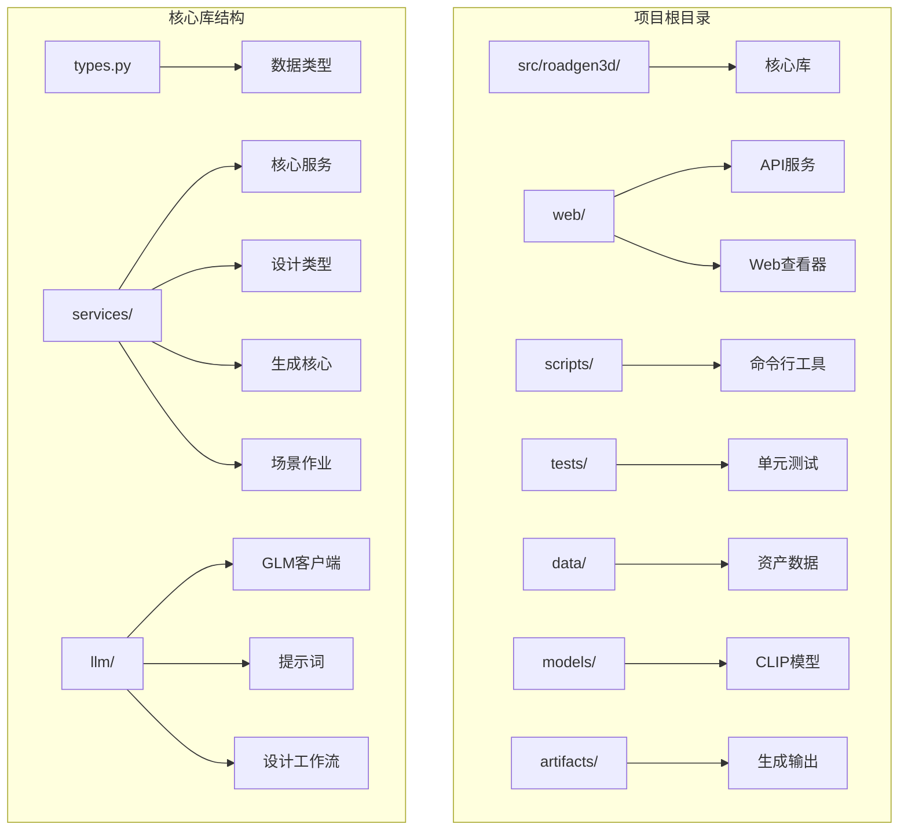
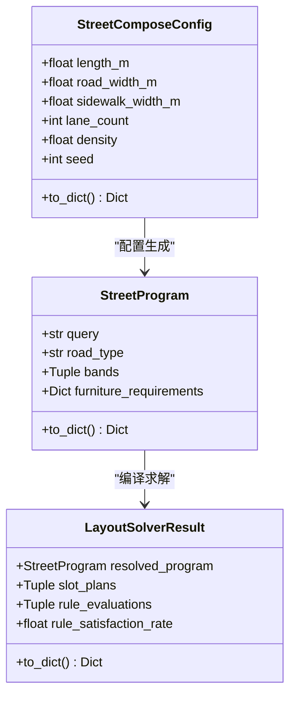
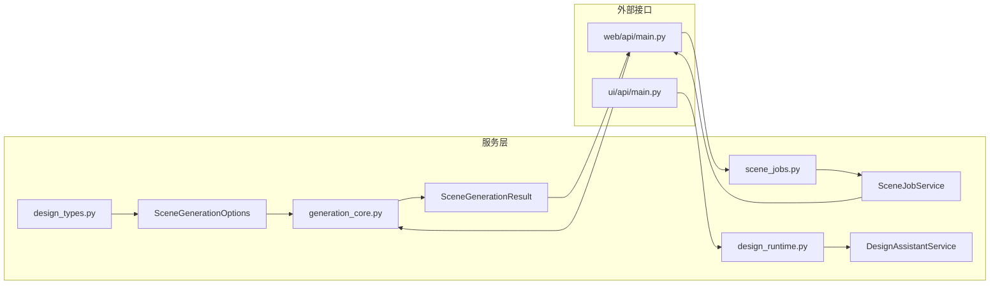
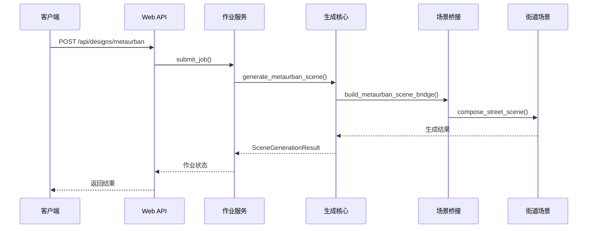
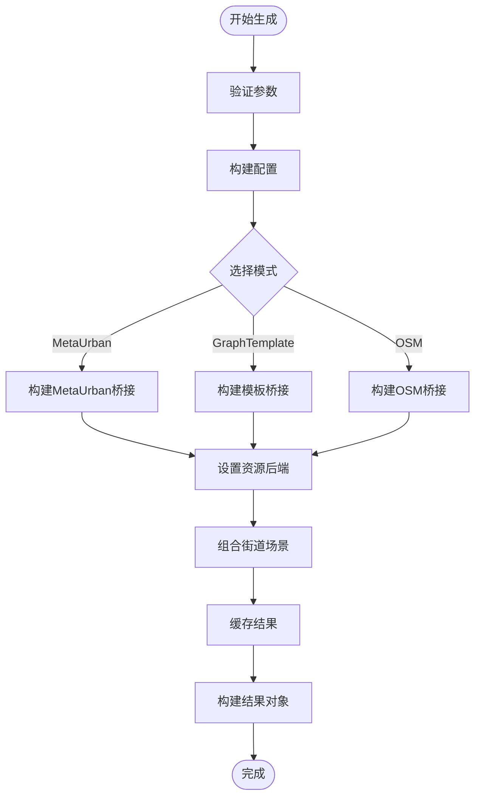
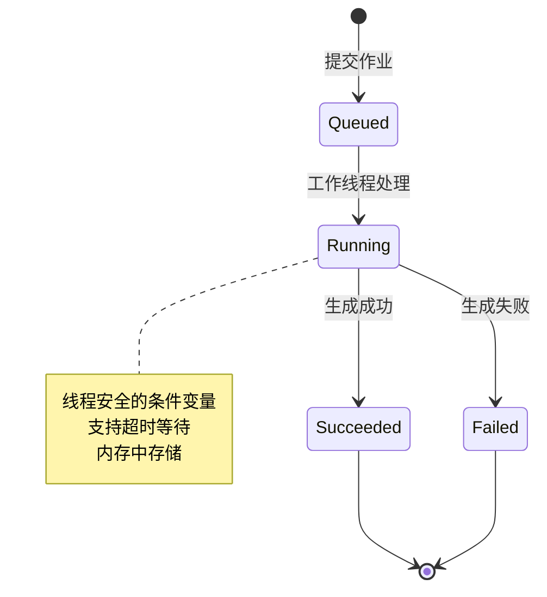
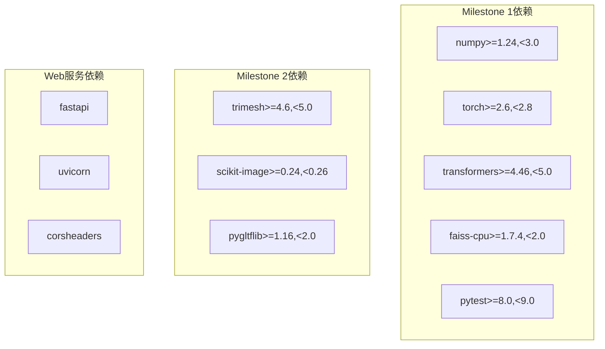
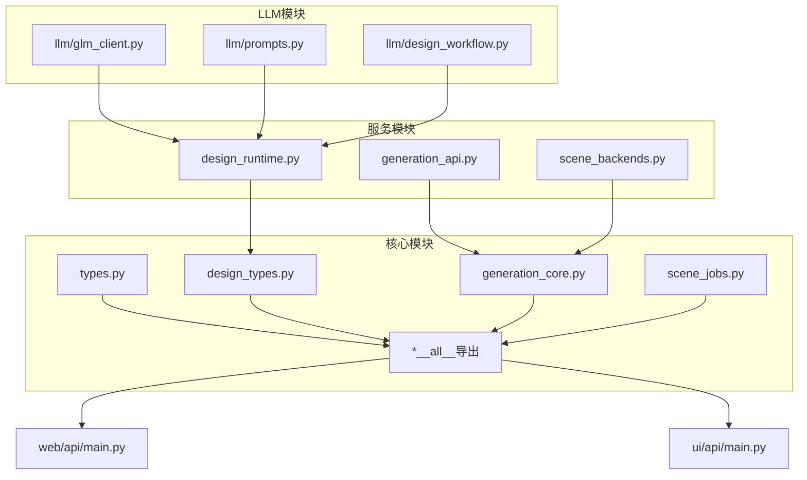

# 代码规范与最佳实践

<cite>
**本文档引用的文件**
- [README.md](file://README.md)
- [API_GUIDE.md](file://API_GUIDE.md)
- [Makefile](file://Makefile)
- [requirements-m1.txt](file://requirements-m1.txt)
- [requirements-m2.txt](file://requirements-m2.txt)
- [src/roadgen3d/__init__.py](file://src/roadgen3d/__init__.py)
- [src/roadgen3d/types.py](file://src/roadgen3d/types.py)
- [src/roadgen3d/services/design_types.py](file://src/roadgen3d/services/design_types.py)
- [src/roadgen3d/services/generation_core.py](file://src/roadgen3d/services/generation_core.py)
- [src/roadgen3d/services/scene_jobs.py](file://src/roadgen3d/services/scene_jobs.py)
- [web/api/main.py](file://web/api/main.py)
- [scripts/m1_06_run_pipeline.py](file://scripts/m1_06_run_pipeline.py)
</cite>

## 目录
1. [引言](#引言)
2. [项目结构](#项目结构)
3. [核心组件](#核心组件)
4. [架构概览](#架构概览)
5. [详细组件分析](#详细组件分析)
6. [依赖关系分析](#依赖关系分析)
7. [性能考虑](#性能考虑)
8. [故障排除指南](#故障排除指南)
9. [结论](#结论)
10. [附录](#附录)

## 引言

RoadGen3D是一个神经符号主义系统，能够将文本描述转换为详细的3D城市街道场景。该项目采用模块化架构设计，包含多个里程碑阶段的功能实现，从单一资产管道到多资产街道组合，再到学习型布局策略和工程评估循环。

本指南旨在为RoadGen3D项目制定统一的代码规范和最佳实践，涵盖Python代码风格、模块组织、注释文档、变量设计、错误处理、异常管理、日志记录以及代码审查检查清单等内容。

## 项目结构

RoadGen3D项目采用清晰的分层架构，主要包含以下核心目录：



**图表来源**
- [README.md:107-130](file://README.md#L107-L130)
- [src/roadgen3d/__init__.py:1-295](file://src/roadgen3d/__init__.py#L1-L295)

项目采用功能驱动的模块组织方式，每个功能领域都有独立的模块和包结构，便于维护和扩展。

**章节来源**
- [README.md:107-130](file://README.md#L107-L130)
- [Makefile:1-92](file://Makefile#L1-L92)

## 核心组件

### 数据类型系统

RoadGen3D采用统一的数据类型系统，通过dataclass实现类型安全的数据结构：



**图表来源**
- [src/roadgen3d/types.py:47-117](file://src/roadgen3d/types.py#L47-L117)
- [src/roadgen3d/types.py:140-184](file://src/roadgen3d/types.py#L140-L184)
- [src/roadgen3d/types.py:389-433](file://src/roadgen3d/types.py#L389-L433)

### 服务层架构

服务层提供核心业务逻辑，采用职责分离的设计模式：



**图表来源**
- [src/roadgen3d/services/generation_core.py:39-155](file://src/roadgen3d/services/generation_core.py#L39-L155)
- [src/roadgen3d/services/design_types.py:266-304](file://src/roadgen3d/services/design_types.py#L266-L304)
- [src/roadgen3d/services/scene_jobs.py:42-101](file://src/roadgen3d/services/scene_jobs.py#L42-L101)

**章节来源**
- [src/roadgen3d/types.py:1-800](file://src/roadgen3d/types.py#L1-L800)
- [src/roadgen3d/services/design_types.py:1-368](file://src/roadgen3d/services/design_types.py#L1-L368)
- [src/roadgen3d/services/generation_core.py:1-445](file://src/roadgen3d/services/generation_core.py#L1-L445)
- [src/roadgen3d/services/scene_jobs.py:1-205](file://src/roadgen3d/services/scene_jobs.py#L1-L205)

## 架构概览

RoadGen3D采用分层架构设计，从底层的数据类型到顶层的Web服务，每一层都有明确的职责分工：



**图表来源**
- [web/api/main.py:188-201](file://web/api/main.py#L188-L201)
- [src/roadgen3d/services/scene_jobs.py:57-79](file://src/roadgen3d/services/scene_jobs.py#L57-L79)
- [src/roadgen3d/services/generation_core.py:267-342](file://src/roadgen3d/services/generation_core.py#L267-L342)

系统支持多种生成模式：
- **MetaUrban风格**：基于参考方案的程序化生成
- **图模板**：基于预定义模板的场景生成  
- **OSM集成**：基于开放街道地图数据的生成（开发中）

**章节来源**
- [web/api/main.py:188-267](file://web/api/main.py#L188-L267)
- [src/roadgen3d/services/generation_core.py:267-432](file://src/roadgen3d/services/generation_core.py#L267-L432)

## 详细组件分析

### 类型系统设计

RoadGen3D的类型系统采用dataclass实现，提供类型安全和序列化能力：

#### 命名约定
- **数据类**：使用`CamelCase`命名，如`StreetComposeConfig`
- **枚举值**：使用`UPPER_CASE`命名，如`"template"`、`"metaurban"`
- **字段**：使用`snake_case`命名，如`road_width_m`
- **常量**：使用`UPPER_CASE_WITH_UNDERSCORES`，如`DEFAULT_BUILDING_FRONT_SETBACK_MIN_M`

#### 类型设计原则
1. **不可变性**：所有数据类都使用`frozen=True`确保数据不可变
2. **序列化**：每个类都提供`to_dict()`方法用于JSON序列化
3. **类型注解**：完整的类型注解确保IDE支持和静态分析
4. **默认值**：合理设置默认值，减少调用复杂度

**章节来源**
- [src/roadgen3d/types.py:12-44](file://src/roadgen3d/types.py#L12-L44)
- [src/roadgen3d/types.py:187-184](file://src/roadgen3d/types.py#L187-L184)

### 服务层组件

#### 生成核心服务

生成核心服务提供直接的场景生成功能，绕过LLM/RAG工作流：



**图表来源**
- [src/roadgen3d/services/generation_core.py:157-189](file://src/roadgen3d/services/generation_core.py#L157-L189)
- [src/roadgen3d/services/generation_core.py:267-342](file://src/roadgen3d/services/generation_core.py#L267-L342)

#### 作业管理系统

作业管理系统提供异步作业队列功能：



**图表来源**
- [src/roadgen3d/services/scene_jobs.py:27-40](file://src/roadgen3d/services/scene_jobs.py#L27-L40)
- [src/roadgen3d/services/scene_jobs.py:144-177](file://src/roadgen3d/services/scene_jobs.py#L144-L177)

**章节来源**
- [src/roadgen3d/services/generation_core.py:1-445](file://src/roadgen3d/services/generation_core.py#L1-L445)
- [src/roadgen3d/services/scene_jobs.py:1-205](file://src/roadgen3d/services/scene_jobs.py#L1-L205)

### API接口设计

Web API采用FastAPI框架，提供RESTful接口：

#### 错误处理模式
- **HTTP状态码**：使用标准HTTP状态码
- **异常包装**：将内部异常转换为HTTP异常
- **错误详情**：提供详细的错误信息
- **JSON响应**：统一的JSON响应格式

#### 数据验证
- **Pydantic模型**：使用Pydantic进行输入验证
- **类型安全**：完整的类型注解
- **默认值处理**：合理的默认值设置

**章节来源**
- [web/api/main.py:1-286](file://web/api/main.py#L1-L286)
- [API_GUIDE.md:75-161](file://API_GUIDE.md#L75-L161)

## 依赖关系分析

### 外部依赖管理

项目使用requirements文件管理依赖：



**图表来源**
- [requirements-m1.txt:1-7](file://requirements-m1.txt#L1-L7)
- [requirements-m2.txt:1-4](file://requirements-m2.txt#L1-L4)

### 内部模块依赖



**图表来源**
- [src/roadgen3d/__init__.py:1-295](file://src/roadgen3d/__init__.py#L1-L295)
- [src/roadgen3d/services/generation_core.py:16-31](file://src/roadgen3d/services/generation_core.py#L16-L31)

**章节来源**
- [requirements-m1.txt:1-7](file://requirements-m1.txt#L1-L7)
- [requirements-m2.txt:1-4](file://requirements-m2.txt#L1-L4)
- [src/roadgen3d/__init__.py:1-295](file://src/roadgen3d/__init__.py#L1-L295)

## 性能考虑

### 内存管理
- **数据类不可变性**：使用frozen dataclass避免意外修改
- **资源后端**：通过Manifest后端管理资源，避免重复加载
- **作业队列**：内存中存储作业状态，支持快速查询

### 并发处理
- **线程安全**：使用Lock和Condition保证线程安全
- **异步生成**：支持后台作业处理
- **超时机制**：提供超时等待机制

### 输出优化
- **增量更新**：只在必要时更新布局文件
- **缓存机制**：缓存视图器URL以避免重复计算
- **格式选择**：支持多种输出格式以满足不同需求

## 故障排除指南

### 常见问题诊断

#### 模型加载错误
```python
try:
    embedder = ClipTextEmbedder(...)
except ModelLoadError as exc:
    print(f"模型加载失败: {exc}")
    return 2
```

#### 作业状态异常
- **长期排队**：检查模型是否首次加载
- **资源不足**：监控系统资源使用情况
- **依赖缺失**：确认所有依赖正确安装

#### API错误处理
- **404错误**：检查资源是否存在
- **500错误**：查看服务器日志获取详细信息
- **400错误**：验证请求参数格式

**章节来源**
- [scripts/m1_06_run_pipeline.py:88-93](file://scripts/m1_06_run_pipeline.py#L88-L93)
- [API_GUIDE.md:303-337](file://API_GUIDE.md#L303-L337)

## 结论

RoadGen3D项目的代码规范和最佳实践体现了现代Python项目的成熟设计。通过清晰的模块组织、强类型的数据系统、完善的错误处理机制和RESTful API设计，项目实现了高可维护性和可扩展性。

建议在后续开发中继续遵循这些规范，同时关注性能优化和测试覆盖率的提升，确保系统的稳定性和可靠性。

## 附录

### 代码审查检查清单

#### 代码风格
- [ ] 符合PEP8标准
- [ ] 适当的缩进和空行
- [ ] 注释和文档字符串完整
- [ ] 变量命名一致

#### 功能实现
- [ ] 类型注解完整
- [ ] 错误处理完善
- [ ] 单元测试覆盖
- [ ] 性能考虑充分

#### 代码质量
- [ ] 代码复用性高
- [ ] 耦合度适中
- [ ] 接口设计合理
- [ ] 日志记录完整

### Git提交规范

#### 提交消息格式
```
<type>(<scope>): <subject>

<body>

<footer>
```

#### 类型说明
- **feat**: 新功能
- **fix**: 修复bug
- **docs**: 文档更新
- **style**: 代码格式调整
- **refactor**: 代码重构
- **test**: 测试相关
- **chore**: 构建过程或辅助工具变动

#### 分支命名约定
- `feature/功能名称`
- `fix/问题描述`
- `docs/文档更新`
- `hotfix/紧急修复`
- `release/版本发布`