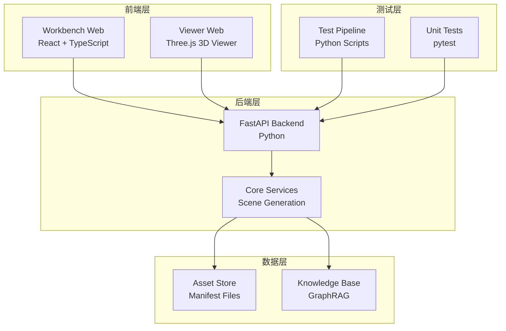
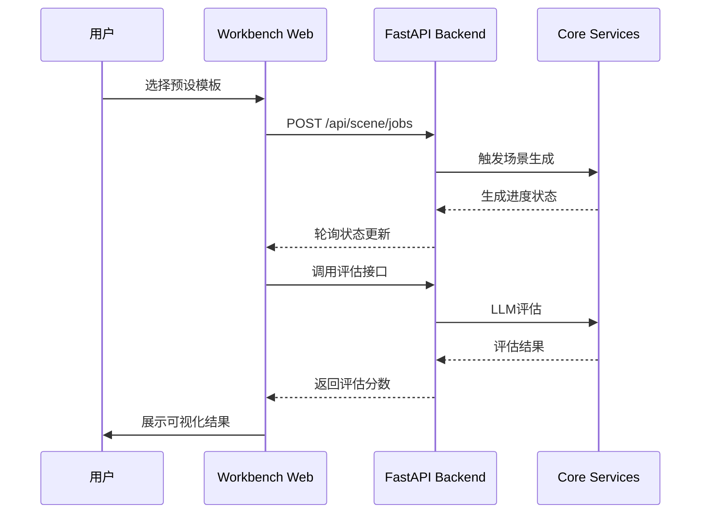
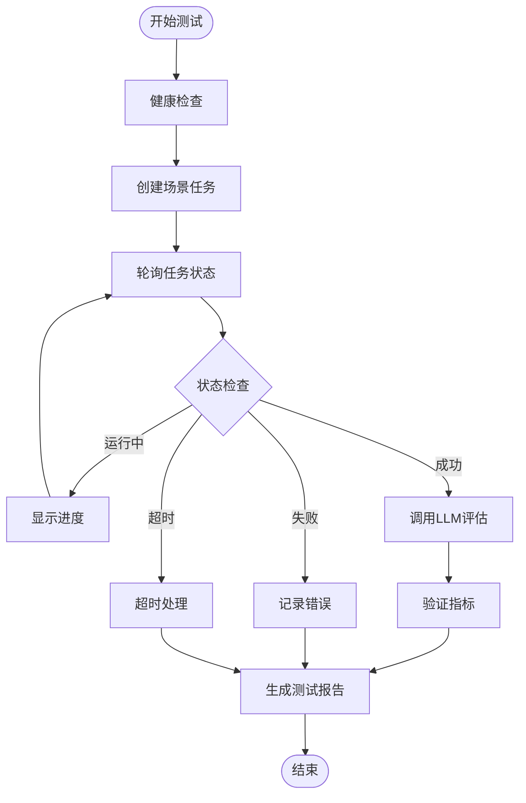

# 工作台Web界面与测试流水线对比文档

<cite>
**本文档引用的文件**
- [workbench_web_vs_test_pipeline.md](file://docs/workbench_web_vs_test_pipeline.md)
- [readme.md](file://readme.md)
- [test_workflow.py](file://scripts/test_workflow.py)
- [generation_api.py](file://src/roadgen3d/services/generation_api.py)
- [App.tsx](file://web/workbench/src/App.tsx)
- [useGeneration.ts](file://web/workbench/src/hooks/useGeneration.ts)
- [types.ts](file://web/workbench/src/lib/types.ts)
- [main.py](file://web/api/main.py)
- [Makefile](file://Makefile)
- [test_pipeline.py](file://scripts/test_pipeline.py)
- [README.md](file://web/viewer/README.md)
</cite>

## 目录
1. [简介](#简介)
2. [项目结构概览](#项目结构概览)
3. [核心组件对比](#核心组件对比)
4. [架构对比分析](#架构对比分析)
5. [详细组件分析](#详细组件分析)
6. [数据流对比](#数据流对比)
7. [性能特征分析](#性能特征分析)
8. [错误处理策略对比](#错误处理策略对比)
9. [可重复性与验证机制](#可重复性与验证机制)
10. [集成点与接口对比](#集成点与接口对比)
11. [故障排除指南](#故障排除指南)
12. [总结与建议](#总结与建议)

## 简介

RoadGen3D项目提供了两种截然不同的场景生成体验：**Workbench Web**（面向用户的React前端界面）和**Test-Pipeline**（面向自动化测试的脚本流程）。两者虽然都基于相同的底层API，但在用户体验、功能实现和质量保证方面存在显著差异。

Workbench Web专注于提供直观的可视化界面，让用户能够通过简单的点击操作生成和评估3D街道场景。而Test-Pipeline则专注于自动化测试和质量保证，提供详细的日志记录、可重复性验证和持久化的测试报告。

## 项目结构概览



**图表来源**
- [readme.md:148-187](file://readme.md#L148-L187)

**章节来源**
- [readme.md:148-187](file://readme.md#L148-L187)

## 核心组件对比

### Workbench Web 核心组件

| 组件 | 职责 | 技术栈 | 特点 |
|------|------|--------|------|
| App.tsx | 主应用容器 | React Hooks | 3步工作流程，状态管理 |
| useGeneration.ts | 生成逻辑 | TypeScript + React | 前端进度模拟，方案生成 |
| types.ts | 类型定义 | TypeScript | 预设配置，数据模型 |
| PresetGrid | 预设选择 | React Components | 用户界面交互 |
| EvaluationPanel | 评估展示 | React + Chart.js | 可视化结果展示 |

### Test-Pipeline 核心组件

| 组件 | 职责 | 技术栈 | 特点 |
|------|------|--------|------|
| test_workflow.py | 主测试逻辑 | Python | 完整工作流执行 |
| test_pipeline.py | 报告汇总 | Python | Markdown报告生成 |
| Makefile | 构建编排 | Shell | 服务启动与测试协调 |
| WorkbenchClient | API客户端 | Python + httpx | 真实进度轮询 |

**章节来源**
- [workbench_web_vs_test_pipeline.md:602-623](file://docs/workbench_web_vs_test_pipeline.md#L602-L623)

## 架构对比分析

### Workbench Web 架构



**图表来源**
- [workbench_web_vs_test_pipeline.md:15-31](file://docs/workbench_web_vs_test_pipeline.md#L15-L31)

### Test-Pipeline 架构



**图表来源**
- [workbench_web_vs_test_pipeline.md:34-51](file://docs/workbench_web_vs_test_pipeline.md#L34-L51)

**章节来源**
- [workbench_web_vs_test_pipeline.md:13-664](file://docs/workbench_web_vs_test_pipeline.md#L13-L664)

## 详细组件分析

### 预设配置对比

#### Workbench Web 预设结构

Workbench Web使用TypeScript定义预设配置，包含丰富的UI展示属性：

```typescript
export const SCENE_PRESETS: ScenePreset[] = [
  {
    id: "pedestrian_friendly",
    name: "步行友好",
    nameEn: "Pedestrian Friendly",
    description: "行人优先，安全舒适",
    icon: "🚶",
    color: "#4CAF50",
    prompt: "步行安全，全龄友好的完整街道，安静、安全、舒适",
    configPatch: {
      design_rule_profile: "pedestrian_priority_v1",
      objective_profile: "balanced",
      density: 0.5,
      ped_demand_level: "high",
      bike_demand_level: "medium",
      transit_demand_level: "medium",
      vehicle_demand_level: "low",
    },
  }
]
```

#### Test-Pipeline 预设结构

Test-Pipeline使用Python字典定义预设配置，专注于后端需要的业务参数：

```python
SCENE_PRESETS = [
    {
        "id": "pedestrian_friendly",
        "name": "步行友好",
        "name_en": "Pedestrian Friendly",
        "prompt": "步行安全，全龄友好的完整街道，安静、安全、舒适",
        "config_patch": {
            "design_rule_profile": "pedestrian_priority_v1",
            "objective_profile": "balanced",
            "density": 0.5,
            "ped_demand_level": "high",
            "bike_demand_level": "medium",
            "transit_demand_level": "medium",
            "vehicle_demand_level": "low",
        },
    }
]
```

**章节来源**
- [workbench_web_vs_test_pipeline.md:71-139](file://docs/workbench_web_vs_test_pipeline.md#L71-L139)

### 场景生成流程对比

#### Workbench Web 生成流程

Workbench Web采用串行生成模式，每个方案生成完成后才开始下一个：

```typescript
async function generateSchemes(selectedPreset: ScenePreset) {
  const schemeIds = ["A", "B", "C"];
  
  // 串行生成 3 个方案
  for (let i = 0; i < updatedSchemes.length; i++) {
    const scheme = updatedSchemes[i];
    
    // 假的进度动画 (0% -> 20% -> 40% -> ... -> 100%)
    for (let p = 0; p <= 100; p += 20) {
      scheme.progress = p;
      setGenerationState({ type: "generating", schemes: [...updatedSchemes] });
      await sleep(200);
    }
    
    // 创建场景任务
    const result = await createSceneJob(selectedPreset, scheme.id);
    
    // 评估
    const evalResult = await evaluateScene(scheme.layoutPath);
    scheme.evaluation = evalResult.scores;
    
    scheme.status = "ready";
  }
}
```

#### Test-Pipeline 生成流程

Test-Pipeline提供更详细的进度跟踪和错误处理：

```python
def run_test(client, preset, poll_interval=2.0, timeout=300.0):
    # Step 1: 创建任务
    job_response = client.create_scene_job(preset)
    job_id = job_response["job_id"]

    # Step 2: 轮询等待
    while elapsed < timeout:
        status = client.get_job_status(job_id)

        if status["status"] == "succeeded":
            result = status["result"]
            break
        elif status["status"] == "failed":
            raise Exception("Job failed")

        # 真实进度: 显示当前操作信息
        operations = status.get("operations", [])
        if operations:
            current_op = operations[-1]
            print(f"\r  {spinner} [{bar}] {progress*100:5.1f}% | {op_info}")

        time.sleep(poll_interval)
```

**章节来源**
- [workbench_web_vs_test_pipeline.md:145-213](file://docs/workbench_web_vs_test_pipeline.md#L145-L213)

### 评估流程对比

#### Workbench Web 评估流程

```typescript
// 评估在方案生成后自动触发
try {
  onStatusChange(`正在评估方案 ${scheme.id}...`);
  const evalResult = await evaluateScene(scheme.layoutPath);
  if (evalResult) {
    scheme.evaluation = evalResult.scores;
    scheme.indicators = evalResult.indicators || scheme.indicators;
    scheme.evaluationText = evalResult.evaluation;
    scheme.suggestions = evalResult.suggestions;
  }
} catch (evalError) {
  scheme.evaluation = { walkability: -1, safety: -1, beauty: -1, overall: -1 };
}
```

#### Test-Pipeline 评估流程

```python
# 评估结果验证
validator = MetricsValidator()
if all(k in eval_data for k in ["walkability", "safety", "beauty", "overall"]):
    formula_valid = validator.validate_formula(
        eval_data["walkability"],
        eval_data["safety"],
        eval_data["beauty"],
        eval_data["overall"]
    )
    print(f"  公式验证: {'✓ 通过' if formula_valid else '✗ 失败'}")
```

**章节来源**
- [workbench_web_vs_test_pipeline.md:216-285](file://docs/workbench_web_vs_test_pipeline.md#L216-L285)

## 数据流对比

### API 请求对比

#### Workbench Web 请求结构

```typescript
async function createSceneJob(preset: ScenePreset, seedSuffix: string) {
  const response = await postJson("/api/scene/jobs", {
    draft: {
      normalized_scene_query: preset.prompt,
      compose_config_patch: preset.configPatch,
      // ... 其他字段
    },
    scene_context: {
      layout_mode: "graph_template",
      graph_template_id: DEFAULT_GRAPH_TEMPLATE_ID,
    },
    generation_options: { preset_id: preset.id },
  }, 60000);
}
```

#### Test-Pipeline 请求结构

```python
def create_scene_job(self, preset: dict) -> dict:
    payload = {
        "draft": {
            "normalized_scene_query": preset["prompt"],
            "compose_config_patch": preset["config_patch"],
            "citations_by_field": {},
            "design_summary": preset["prompt"],
            "risk_notes": [],
            "parameter_sources_by_field": {},
        },
        "scene_context": {
            "layout_mode": "graph_template",
            "aoi_bbox": None,
            "city_name_en": None,
            "reference_plan_id": None,
            "graph_template_id": self.graph_template_id,
        },
        "patch_overrides": {},
        "generation_options": {"preset_id": preset["id"]},
    }
}
```

**章节来源**
- [workbench_web_vs_test_pipeline.md:288-354](file://docs/workbench_web_vs_test_pipeline.md#L288-L354)

### 轮询机制对比

#### Workbench Web 轮询机制

```typescript
async function pollJobCompletion(jobId: string) {
  for (let i = 0; i < MAX_GENERATION_ATTEMPTS; i++) {
    const status = await getJson(`/api/scene/jobs/${jobId}`, 10000);

    if (status.status === "succeeded" && status.result) {
      return status.result;
    }
    if (status.status === "failed") {
      throw new Error("Job failed");
    }
    await sleep(POLL_INTERVAL_MS);
  }
  throw new Error("Job timed out");
}
```

#### Test-Pipeline 轮询机制

```python
def run_test(client, preset, poll_interval=2.0, timeout=300.0):
    elapsed = 0.0
    timeout = 300.0
    
    while elapsed < timeout:
        status = client.get_job_status(result.job_id)
        
        if status == "succeeded":
            break
        elif status == "running" or status == "processing":
            # 显示详细进度
            progress = elapsed / timeout
            eta = (timeout - elapsed) if timeout > elapsed else 0
            print(f"\r  {spinner} [{bar}] {progress*100:5.1f}% | ETA: {eta_str}{op_info}")
        
        time.sleep(poll_interval)
        elapsed = time.time() - start_time
```

**章节来源**
- [workbench_web_vs_test_pipeline.md:357-414](file://docs/workbench_web_vs_test_pipeline.md#L357-L414)

## 性能特征分析

### 进度显示对比

| 维度 | Workbench Web | Test-Pipeline |
|------|---------------|---------------|
| **进度真实性** | 假进度动画 | 真实API状态轮询 |
| **进度粒度** | 0-100%固定步进 | 细分操作阶段进度 |
| **ETA计算** | 无 | 基于剩余时间和进度计算 |
| **状态跟踪** | 基础状态 | 详细操作历史 |

### 超时控制对比

#### Test-Pipeline 超时机制

```python
@contextlib.contextmanager
def timeout_context(seconds: float, task_name: str = "任务"):
    def timeout_handler(signum, frame):
        raise TimeoutError(f"{task_name} 超时 ({seconds}秒)")
    
    old_handler = signal.signal(signal.SIGALRM, timeout_handler)
    signal.alarm(int(seconds))
    try:
        yield
    finally:
        signal.alarm(0)
        signal.signal(signal.SIGALRM, old_handler)
```

#### Workbench Web 超时机制

- **软超时**：MAX_GENERATION_ATTEMPTS × POLL_INTERVAL_MS = 180秒
- **依赖浏览器超时**：默认较长的fetch超时
- **无系统级SIGALRM超时控制**

**章节来源**
- [workbench_web_vs_test_pipeline.md:574-599](file://docs/workbench_web_vs_test_pipeline.md#L574-L599)

## 错误处理策略对比

### 错误处理对比

#### Workbench Web 错误处理

```typescript
catch (error) {
  console.error(`方案 ${scheme.id} 生成失败:`, error);
  scheme.status = "failed";
  scheme.progress = 0;
}
```

- **错误记录**：仅记录到console
- **UI反馈**：显示"failed"状态
- **不影响其他方案**：单个方案失败不影响其他方案

#### Test-Pipeline 错误处理

```python
except httpx.ConnectError as e:
    result.error_message = f"Connection error: {e}"
    print(f"\n❌ 连接 API 失败: {e}")
```

- **详细错误分类**：连接错误、超时错误、意外错误
- **测试报告记录**：错误信息持久化
- **立即终止执行**：失败时立即返回

**章节来源**
- [workbench_web_vs_test_pipeline.md:417-470](file://docs/workbench_web_vs_test_pipeline.md#L417-L470)

## 可重复性与验证机制

### Test-Pipeline 独特功能

#### 可重复性验证

```python
def run_verify_repeatability(client, preset, timeout=300.0):
    # 运行两次
    run1 = run_test(client, preset, timeout=timeout)
    run2 = run_test(client, preset, timeout=timeout)

    # 对比结果
    validator = MetricsValidator()
    repeatability_passed, metric_differences = validator.validate_repeatability(
        run1.evaluation or {},
        run2.evaluation or {}
    )
```

#### 随机种子管理

```python
def set_global_seed(seed: int) -> None:
    random.seed(seed)
    try:
        import numpy as np
        np.random.seed(seed)
    except ImportError:
        pass
    try:
        import torch
        torch.manual_seed(seed)
        if torch.cuda.is_available():
            torch.cuda.manual_seed_all(seed)
    except ImportError:
        pass
```

**章节来源**
- [workbench_web_vs_test_pipeline.md:515-571](file://docs/workbench_web_vs_test_pipeline.md#L515-L571)

## 集成点与接口对比

### API 接口对比

#### Workbench Web API 调用

```typescript
// useGeneration.ts
async function createSceneJob(preset: ScenePreset, seedSuffix: string) {
  const response = await postJson("/api/scene/jobs", {
    // 请求体...
  }, 60000);
  
  return await pollJobCompletion(response.job_id);
}
```

#### Test-Pipeline API 调用

```python
# test_workflow.py
def create_scene_job(self, preset: dict) -> dict:
    response = self.client.post(f"{self.base_url}/api/scene/jobs", json=payload)
    response.raise_for_status()
    return response.json()
```

**章节来源**
- [workbench_web_vs_test_pipeline.md:288-354](file://docs/workbench_web_vs_test_pipeline.md#L288-L354)

### Viewer 集成对比

#### Workbench Web Viewer 集成

```typescript
// App.tsx
const handleExportScene = useCallback(() => {
  if (!selectedSchemeId) return;
  const scheme = displaySchemes.find((s) => s.id === selectedSchemeId);
  if (scheme?.viewerUrl) {
    window.open(scheme.viewerUrl, "_blank");
  }
}, [selectedSchemeId, displaySchemes]);
```

#### Test-Pipeline Viewer 集成

```python
# test_workflow.py
result.viewer_url = status_response.get("result", {}).get("viewer_url")
```

**章节来源**
- [workbench_web_vs_test_pipeline.md:473-512](file://docs/workbench_web_vs_test_pipeline.md#L473-L512)

## 故障排除指南

### 常见问题诊断

#### Workbench Web 问题

1. **假进度问题**
   - 现象：进度条固定为0-100%动画
   - 解决：需要实现真实的API轮询进度

2. **串行生成问题**
   - 现象：方案A完成后才开始方案B
   - 解决：考虑实现并行生成优化

#### Test-Pipeline 问题

1. **连接超时问题**
   - 现象：API连接失败或超时
   - 解决：检查网络连接和API服务状态

2. **评估失败问题**
   - 现象：LLM评估调用失败
   - 解决：验证LLM API配置和凭证

### 诊断工具

#### Workbench Web 诊断

- 浏览器开发者工具
- Network面板检查API调用
- Console查看错误日志

#### Test-Pipeline 诊断

- 详细的日志输出
- 测试报告分析
- 超时和错误码检查

**章节来源**
- [workbench_web_vs_test_pipeline.md:417-470](file://docs/workbench_web_vs_test_pipeline.md#L417-L470)

## 总结与建议

### Test-Pipeline 优势

1. **可重复性保证**：随机种子控制确保实验一致性
2. **超时保护**：系统级SIGALRM超时控制
3. **验证机制**：评分公式验证和重复运行验证
4. **详细日志**：每步状态输出和错误追踪
5. **报告生成**：Markdown持久化报告
6. **错误分类**：详细的异常类型和处理

### Workbench Web 优势

1. **用户体验**：直观的可视化界面
2. **交互性**：可选择不同方案对比
3. **实时反馈**：动态进度更新
4. **多维度展示**：雷达图、柱状图等可视化

### 整合建议

1. **统一预设配置**：抽取到共享的JSON/YAML文件
2. **增强Web进度**：使用真实的API轮询替代假进度
3. **添加报告导出**：Web端也应支持生成Markdown报告
4. **种子控制**：为Web添加可配置的随机种子
5. **统一API Payload**：消除两端请求结构的差异

### 技术债务与改进方向

1. **前端进度优化**：实现真实的进度跟踪
2. **并行生成支持**：提高生成效率
3. **错误处理统一**：标准化错误处理机制
4. **测试覆盖率**：增加单元测试和集成测试
5. **性能监控**：添加性能指标收集

**章节来源**
- [workbench_web_vs_test_pipeline.md:626-651](file://docs/workbench_web_vs_test_pipeline.md#L626-L651)