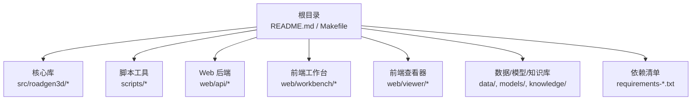
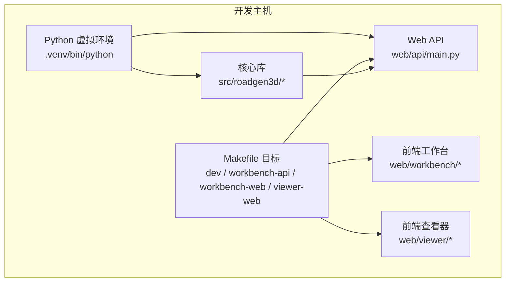
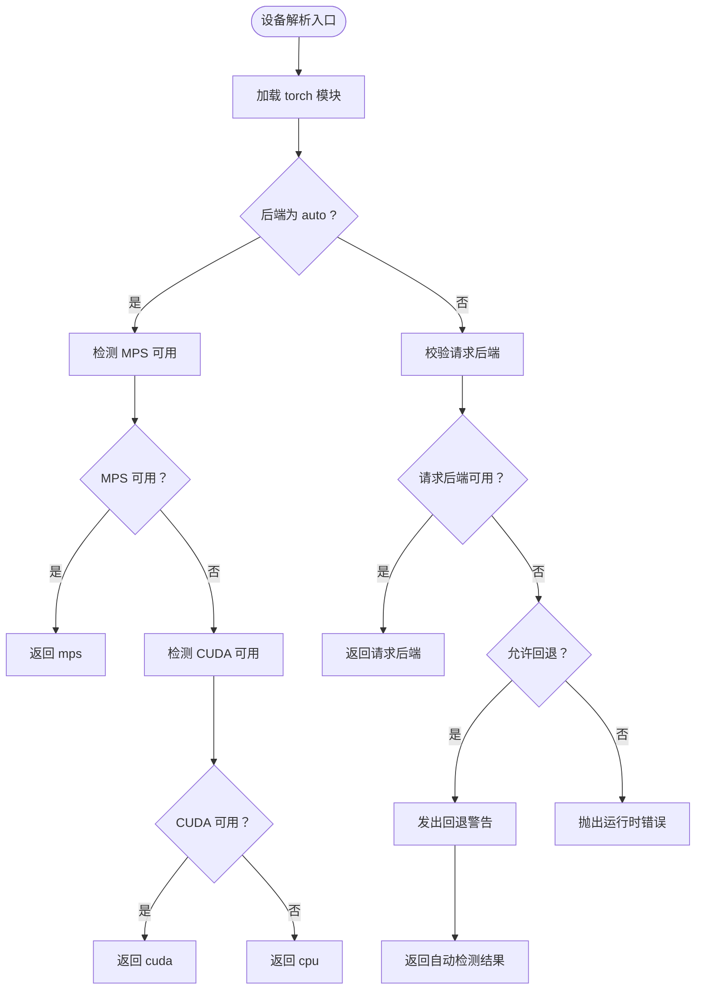
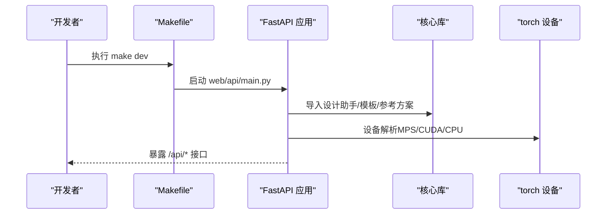
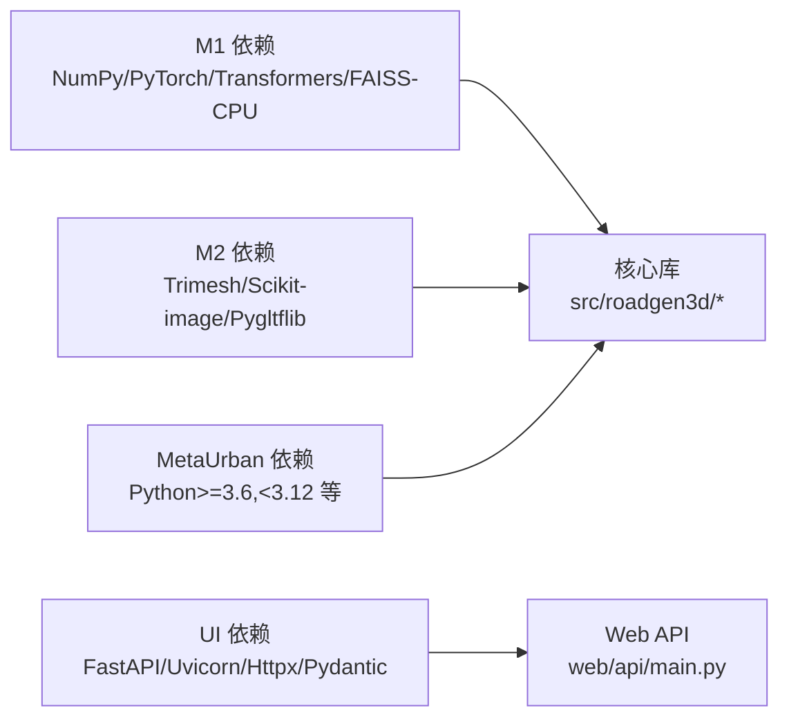

# 开发环境搭建

<cite>
**本文引用的文件**
- [README.md](file://README.md)
- [readme.md](file://readme.md)
- [requirements-m1.txt](file://requirements-m1.txt)
- [requirements-m2.txt](file://requirements-m2.txt)
- [requirements-m5.txt](file://requirements-m5.txt)
- [requirements-ui.txt](file://requirements-ui.txt)
- [Makefile](file://Makefile)
- [scripts/m1_00_check_env.py](file://scripts/m1_00_check_env.py)
- [src/roadgen3d/runtime_device.py](file://src/roadgen3d/runtime_device.py)
- [web/api/main.py](file://web/api/main.py)
- [metaurban/requirements.txt](file://metaurban/requirements.txt)
- [metaurban/environment.yml](file://metaurban/environment.yml)
- [metaurban/setup.py](file://metaurban/setup.py)
</cite>

## 目录
1. [简介](#简介)
2. [项目结构](#项目结构)
3. [核心组件](#核心组件)
4. [架构总览](#架构总览)
5. [详细组件分析](#详细组件分析)
6. [依赖关系分析](#依赖关系分析)
7. [性能考虑](#性能考虑)
8. [故障排查指南](#故障排查指南)
9. [结论](#结论)
10. [附录](#附录)

## 简介
本指南面向 RoadGen3D 的开发者与研究者，提供从零开始搭建开发环境的完整流程，涵盖 Python 版本与虚拟环境（venv 与 Conda）创建、依赖安装顺序与版本兼容性、IDE 配置建议、CUDA 与 GPU 加速设置、常见问题排查以及环境验证与基础功能测试方法。目标是帮助你在本地快速构建可运行的开发环境，并顺利启动 API、工作台与 3D 查看器服务。

## 项目结构
RoadGen3D 采用多模块分层组织：核心库位于 src/roadgen3d，命令行脚本在 scripts，Web 后端在 web/api，前端工作台与查看器分别在 web/workbench 与 web/viewer；另有知识库、模型与数据资源目录。顶层 README 提供了安装与运行的总体步骤，Makefile 定义了常用开发任务。

章节来源
- [README.md: 31-71:31-71](file://README.md#L31-L71)
- [Makefile: 13-34:13-34](file://Makefile#L13-L34)

## 核心组件
- Python 与虚拟环境：推荐使用 CPython 3.11 或 3.12（macOS arm64 已验证），可通过 venv 或 Conda 创建隔离环境。
- 依赖管理：按里程碑顺序安装不同阶段的依赖清单，确保版本范围与兼容性满足核心库与下游模块需求。
- 前端依赖：通过 Makefile 中的安装目标安装 Node.js 依赖，分别针对工作台与查看器。
- 运行时设备选择：核心库提供自动选择 CPU/MPS/CUDA 的设备解析逻辑，便于在不同硬件上运行。
- Web API：FastAPI 提供设计助手与场景作业接口，支持跨域访问与健康检查。

章节来源
- [requirements-m1.txt: 1-7:1-7](file://requirements-m1.txt#L1-L7)
- [requirements-m2.txt: 1-4:1-4](file://requirements-m2.txt#L1-L4)
- [requirements-m5.txt: 1-5:1-5](file://requirements-m5.txt#L1-L5)
- [requirements-ui.txt: 1-12:1-12](file://requirements-ui.txt#L1-L12)
- [Makefile: 57-70:57-70](file://Makefile#L57-L70)
- [src/roadgen3d/runtime_device.py: 37-72:37-72](file://src/roadgen3d/runtime_device.py#L37-L72)
- [web/api/main.py: 81-267:81-267](file://web/api/main.py#L81-L267)

## 架构总览
下图展示了开发环境中的主要组件及其交互关系：Python 虚拟环境承载核心库与依赖；Makefile 统一调度后端 API、前端工作台与查看器；核心库通过设备解析选择运行后端；Web API 暴露设计与场景作业接口。

图表来源
- [Makefile: 13-34:13-34](file://Makefile#L13-L34)
- [web/api/main.py: 81-267:81-267](file://web/api/main.py#L81-L267)

章节来源
- [Makefile: 13-34:13-34](file://Makefile#L13-L34)
- [web/api/main.py: 81-267:81-267](file://web/api/main.py#L81-L267)

## 详细组件分析

### Python 版本与虚拟环境（venv）
- 推荐版本：CPython 3.11 或 3.12（macOS arm64 已验证）。
- 创建步骤：
  - 使用 venv 在项目根目录创建虚拟环境；
  - 激活虚拟环境；
  - 依次安装里程碑依赖清单（M1 → M2 → UI）。
- 依赖顺序与兼容性：
  - M1：NumPy、PyTorch、Transformers、FAISS-CPU、pytest；
  - M2：Trimesh、Scikit-image、Pygltflib；
  - UI：FastAPI、Uvicorn、Httpx、Pydantic 等。
- 注意事项：
  - 严格遵循版本范围，避免破坏核心库或下游模块的兼容性；
  - 若需使用 CUDA，请参考“CUDA 环境配置”小节。

章节来源
- [requirements-m1.txt: 1-7:1-7](file://requirements-m1.txt#L1-L7)
- [requirements-m2.txt: 1-4:1-4](file://requirements-m2.txt#L1-L4)
- [requirements-ui.txt: 1-12:1-12](file://requirements-ui.txt#L1-L12)
- [README.md: 35-55:35-55](file://README.md#L35-L55)

### Python 版本与虚拟环境（Conda）
- 使用 Conda 创建独立环境并安装文档化依赖：
  - 环境名称：metaurban；
  - Python 版本：3.10；
  - 通道：conda-forge 与 defaults；
  - 依赖：pip、pybind11、sphinx、numpy 等；
  - 通过 pip 安装文档依赖与项目自身（可编辑安装）。
- 适用场景：需要统一管理 C 扩展与系统级依赖时优先考虑。

章节来源
- [metaurban/environment.yml: 1-16:1-16](file://metaurban/environment.yml#L1-L16)

### 依赖安装顺序与版本兼容性
- 安装顺序建议：
  - 先安装 M1 依赖（含 PyTorch 与 FAISS-CPU）；
  - 再安装 M2 依赖（网格/图像处理相关）；
  - 最后安装 UI 依赖（Web 服务与前端）。
- 版本约束要点：
  - NumPy、PyTorch、Transformers、FAISS-CPU、FastAPI、Uvicorn、Pydantic 等均有明确版本范围；
  - MetaUrban 子模块对 Python 版本有“>=3.6, <3.12”的断言与声明。
- 兼容性提示：
  - CUDA 与 MPS 的可用性由核心库自动探测，若无 GPU 可用则回退到 CPU；
  - 若需在 Windows/macOS 上启用 CUDA，请参考“CUDA 环境配置”。

章节来源
- [requirements-m1.txt: 1-7:1-7](file://requirements-m1.txt#L1-L7)
- [requirements-m2.txt: 1-4:1-4](file://requirements-m2.txt#L1-L4)
- [requirements-ui.txt: 1-12:1-12](file://requirements-ui.txt#L1-L12)
- [metaurban/setup.py: 29-30:29-30](file://metaurban/setup.py#L29-L30)
- [metaurban/setup.py: 85](file://metaurban/setup.py#L85)

### IDE 配置建议（VS Code / PyCharm）
- VS Code
  - 设置 Python 解释器为虚拟环境中的 Python（.venv/bin/python）；
  - 安装 Python 扩展，启用 Pylance 与 Flake8；
  - 在工作区设置中配置终端为激活虚拟环境后的 shell；
  - 使用 Tasks/launch.json 配置调试后端 API（FastAPI）与脚本运行。
- PyCharm
  - 在 Project Interpreter 中选择虚拟环境路径；
  - 将项目根目录标记为 Sources Root；
  - 配置运行/调试配置，指向 web/api/main.py 或具体脚本文件；
  - 如需前端联调，可在 PyCharm 中打开 web/workbench 与 web/viewer 的子项目视图。
- 通用建议
  - 保持导入路径正确（sys.path 插入根与 src 目录）；
  - 对于 Web API，启用 CORS 并在本地开发时允许任意来源。

章节来源
- [web/api/main.py: 14-19:14-19](file://web/api/main.py#L14-L19)

### CUDA 环境配置与 GPU 加速
- 设备自动选择
  - 核心库提供自动选择 CPU/MPS/CUDA 的逻辑，优先级为 MPS > CUDA > CPU；
  - 当请求的后端不可用时，会根据允许回退策略进行警告并回退。
- CUDA 可用性检测
  - 环境检查脚本会报告 torch 是否可用、CUDA 设备数量、MPS 是否可用；
  - Web API 在启动时不会强制要求 GPU，但推理与渲染可受益于 GPU。
- 配置建议
  - macOS：若具备 Apple Silicon，优先使用 MPS（已内置在 torch 与核心库中）；
  - Linux/Windows：安装对应版本的 PyTorch 与 CUDA 运行时，确保驱动与 CUDA 版本匹配；
  - 若无 GPU，无需额外配置，系统将自动回退到 CPU。

图表来源
- [src/roadgen3d/runtime_device.py: 37-72:37-72](file://src/roadgen3d/runtime_device.py#L37-L72)

章节来源
- [src/roadgen3d/runtime_device.py: 37-72:37-72](file://src/roadgen3d/runtime_device.py#L37-L72)
- [scripts/m1_00_check_env.py: 29-59:29-59](file://scripts/m1_00_check_env.py#L29-L59)

### 前端依赖与服务启动
- 前端依赖安装
  - 工作台：make workbench-install；
  - 查看器：make viewer-install。
- 服务启动
  - 全量开发环境：make dev（同时启动 API、工作台、查看器）；
  - 单独启动：make workbench-api、make workbench-web、make viewer-web；
  - 默认端口：API 8010、工作台 4174、查看器 4173。
- 说明
  - API 使用 Uvicorn 启动，工作台与查看器使用 npm run dev；
  - MPL 配置目录在开发 API 时用于规避 matplotlib 临时目录权限问题。

章节来源
- [Makefile: 13-34:13-34](file://Makefile#L13-L34)
- [Makefile: 39-70:39-70](file://Makefile#L39-L70)
- [README.md: 57-71:57-71](file://README.md#L57-L71)

### Web API 与核心库集成
- API 入口
  - FastAPI 应用在 web/api/main.py 中创建，注册健康检查、知识库、参考方案、场景作业等路由；
  - 支持跨域访问（CORS）。
- 核心库集成
  - 通过 sys.path 插入根与 src 目录，导入设计助手、图模板、参考方案、LLM 客户端等；
  - 设备解析与运行时选择在核心库中完成，API 层不直接管理设备。
- 知识库与 LLM
  - 提供知识库重建与检索接口；
  - LLM 客户端异常映射为 HTTP 503/400。

图表来源
- [Makefile: 29-34:29-34](file://Makefile#L29-L34)
- [web/api/main.py: 81-267:81-267](file://web/api/main.py#L81-L267)
- [src/roadgen3d/runtime_device.py: 37-72:37-72](file://src/roadgen3d/runtime_device.py#L37-L72)

章节来源
- [web/api/main.py: 81-267:81-267](file://web/api/main.py#L81-L267)
- [src/roadgen3d/runtime_device.py: 37-72:37-72](file://src/roadgen3d/runtime_device.py#L37-L72)

## 依赖关系分析
- 依赖层次
  - M1 依赖：NumPy、PyTorch、Transformers、FAISS-CPU、pytest；
  - M2 依赖：Trimesh、Scikit-image、Pygltflib；
  - UI 依赖：FastAPI、Uvicorn、Httpx、Pydantic；
  - MetaUrban 子模块：对 Python 版本、Panda3D、OpenCV、Shapely、PyProj 等有额外要求。
- 关键约束
  - Python 版本范围：MetaUrban 明确要求 >=3.6 且 <3.12；
  - 设备可用性：核心库自动探测 MPS/CUDA/CPu；
  - 前端 Node.js：工作台与查看器需要 Node.js 支持。

图表来源
- [requirements-m1.txt: 1-7:1-7](file://requirements-m1.txt#L1-L7)
- [requirements-m2.txt: 1-4:1-4](file://requirements-m2.txt#L1-L4)
- [requirements-ui.txt: 1-12:1-12](file://requirements-ui.txt#L1-L12)
- [metaurban/setup.py: 29-30:29-30](file://metaurban/setup.py#L29-L30)

章节来源
- [requirements-m1.txt: 1-7:1-7](file://requirements-m1.txt#L1-L7)
- [requirements-m2.txt: 1-4:1-4](file://requirements-m2.txt#L1-L4)
- [requirements-ui.txt: 1-12:1-12](file://requirements-ui.txt#L1-L12)
- [metaurban/setup.py: 29-30:29-30](file://metaurban/setup.py#L29-L30)

## 性能考虑
- 设备选择
  - MPS（Apple Silicon）通常比 CUDA 在 macOS 上更稳定；
  - CUDA 需要匹配驱动与 PyTorch CUDA 版本，避免运行时链接失败。
- 前端性能
  - 工作台与查看器使用 Vite/Three.js，建议在本地磁盘运行，避免网络挂载导致的 I/O 延迟；
  - 大场景导出前建议预热 GPU。
- 依赖优化
  - 仅安装所需依赖，避免不必要的包占用内存与磁盘空间；
  - 使用虚拟环境隔离不同版本的依赖。

## 故障排查指南
- 依赖冲突
  - 症状：pip 安装时报错或模块导入失败；
  - 处理：确认 Python 版本在要求范围内；按 M1→M2→UI 顺序安装；必要时清理缓存后重试。
- 编译错误（C 扩展）
  - 症状：安装 PyTorch/CUDA 相关包时报编译错误；
  - 处理：确保系统已安装构建工具链；在 Conda 环境中优先使用二进制包；核对 CUDA 驱动与 PyTorch CUDA 版本匹配。
- 设备不可用
  - 症状：torch.cuda.is_available() 返回 False；
  - 处理：检查 CUDA 驱动与 PyTorch CUDA 匹配；在 macOS 上优先使用 MPS；无 GPU 则接受 CPU 回退。
- 端口占用
  - 症状：make 启动服务时报端口已被占用；
  - 处理：修改 Makefile 中的端口变量或释放占用端口。
- 环境检查
  - 使用环境检查脚本生成报告，定位缺失模块与设备状态。

章节来源
- [scripts/m1_00_check_env.py: 29-59:29-59](file://scripts/m1_00_check_env.py#L29-L59)
- [Makefile: 39-70:39-70](file://Makefile#L39-L70)

## 结论
通过遵循本指南，你可以在本地成功搭建 RoadGen3D 的开发环境。建议优先使用 venv 创建隔离环境并按里程碑顺序安装依赖，配合 Conda 作为替代方案；在 macOS 上优先启用 MPS，在 Linux/Windows 上按需配置 CUDA；利用 Makefile 快速启动全栈服务，并通过环境检查脚本与基本 CLI 测试验证环境可用性。

## 附录

### 开发环境验证与基础功能测试
- 环境检查
  - 运行环境检查脚本，输出包含 Python 版本、平台、包状态与设备可用性报告。
- 启动服务
  - make dev 启动 API、工作台、查看器；
  - 访问健康检查接口确认服务正常。
- 基础功能测试
  - 使用 CLI 运行单资产管线或街道合成脚本，验证检索、布局与导出流程；
  - 在工作台中提交设计草稿并查看场景作业状态。

章节来源
- [scripts/m1_00_check_env.py: 68-79:68-79](file://scripts/m1_00_check_env.py#L68-L79)
- [Makefile: 29-34:29-34](file://Makefile#L29-L34)
- [web/api/main.py: 92-99:92-99](file://web/api/main.py#L92-L99)
- [README.md: 72-105:72-105](file://README.md#L72-L105)