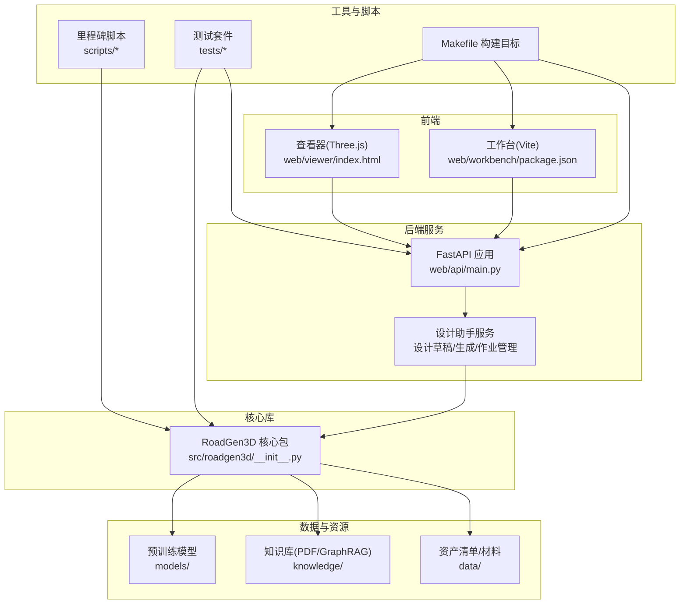
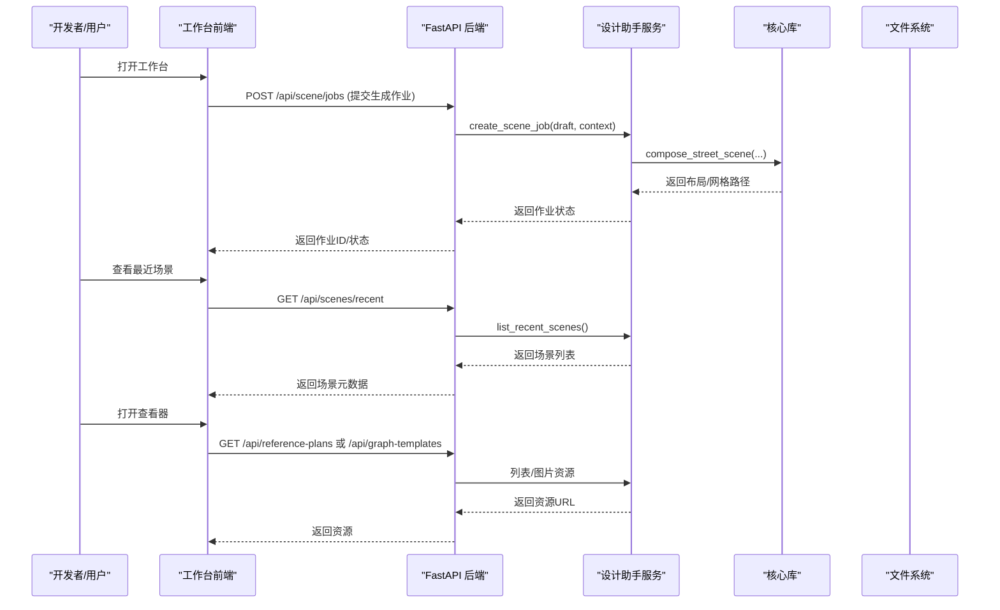
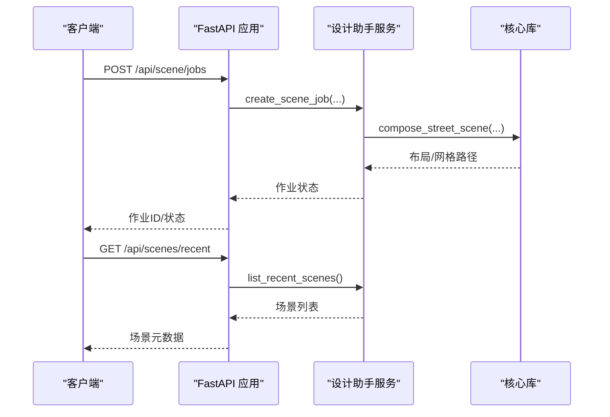
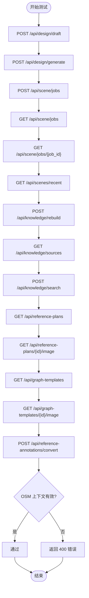
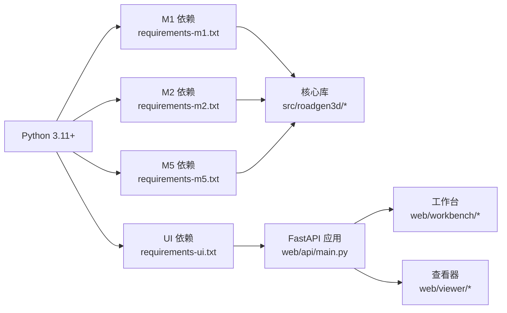

# 开发者指南

<cite>
**本文档引用的文件**
- [README.md](file://README.md)
- [Makefile](file://Makefile)
- [requirements-m1.txt](file://requirements-m1.txt)
- [requirements-m2.txt](file://requirements-m2.txt)
- [requirements-m5.txt](file://requirements-m5.txt)
- [requirements-ui.txt](file://requirements-ui.txt)
- [metaurban/setup.py](file://metaurban/setup.py)
- [metaurban/environment.yml](file://metaurban/environment.yml)
- [src/roadgen3d/__init__.py](file://src/roadgen3d/__init__.py)
- [web/api/main.py](file://web/api/main.py)
- [web/viewer/index.html](file://web/viewer/index.html)
- [web/workbench/package.json](file://web/workbench/package.json)
- [scripts/m1_00_check_env.py](file://scripts/m1_00_check_env.py)
- [tests/test_design_api.py](file://tests/test_design_api.py)
- [tests/test_m1_pipeline.py](file://tests/test_m1_pipeline.py)
- [tests/test_m2_pipeline.py](file://tests/test_m2_pipeline.py)
- [tests/test_m3_street_compose.py](file://tests/test_m3_street_compose.py)
- [src/roadgen3d/asset_scale.py](file://src/roadgen3d/asset_scale.py)
- [src/roadgen3d/program_generator.py](file://src/roadgen3d/program_generator.py)
- [src/roadgen3d/layout_features.py](file://src/roadgen3d/layout_features.py)
- [src/roadgen3d/decoder_shapee.py](file://src/roadgen3d/decoder_shapee.py)
- [src/roadgen3d/llm/design_workflow.py](file://src/roadgen3d/llm/design_workflow.py)
- [src/roadgen3d/services/design_runtime.py](file://src/roadgen3d/services/design_runtime.py)
</cite>

## 更新摘要
**所做更改**
- 更新了测试策略章节，增加了自动化测试指导和测试套件使用方法
- 新增了环境变量说明章节，涵盖环境配置和依赖管理
- 完善了测试覆盖范围，包括单元测试、集成测试和端到端测试的具体实现
- 增强了环境检查和依赖管理的最佳实践指导

## 目录
1. [简介](#简介)
2. [项目结构](#项目结构)
3. [核心组件](#核心组件)
4. [架构总览](#架构总览)
5. [详细组件分析](#详细组件分析)
6. [依赖分析](#依赖分析)
7. [性能考虑](#性能考虑)
8. [故障排查指南](#故障排查指南)
9. [结论](#结论)
10. [附录](#附录)

## 简介
本指南面向 RoadGen3D 的开发者，覆盖从环境搭建、代码规范与最佳实践、测试策略、贡献流程、调试与性能分析，到扩展开发（插件、自定义资产后端、新增管道阶段）以及 CI/CD 与部署自动化。内容基于仓库中的实际文件进行梳理，确保可操作性与一致性。

## 项目结构
RoadGen3D 采用多语言混合架构：核心 Python 库位于 src/roadgen3d，Web 后端服务通过 FastAPI 提供 API，前端工作台与查看器分别由 Vite/React 和 Three.js 驱动；数据与知识库资源位于 data/ 与 knowledge/；脚本目录 scripts/ 提供各里程碑的命令行工具；tests/ 提供端到端与集成测试。

**图表来源**
- [web/api/main.py:81-267](file://web/api/main.py#L81-L267)
- [src/roadgen3d/__init__.py:1-295](file://src/roadgen3d/__init__.py#L1-L295)
- [Makefile:1-92](file://Makefile#L1-L92)
- [web/workbench/package.json:1-16](file://web/workbench/package.json#L1-L16)
- [web/viewer/index.html:1-13](file://web/viewer/index.html#L1-L13)

**章节来源**
- [README.md:107-130](file://README.md#L107-L130)
- [Makefile:13-92](file://Makefile#L13-L92)

## 核心组件
- 设计助手服务与 API：提供草稿生成、场景生成、作业队列、最近场景列表、知识库重建与检索、参考图与图模板查询等接口。
- 核心库导出：集中暴露类型、解码器、嵌入器、布局求解器、程序生成器、OSM/POI 规则、评估指标、渲染与导出等能力。
- 前端工作台与查看器：分别提供交互式生成界面与 3D 场景浏览。

**章节来源**
- [web/api/main.py:81-267](file://web/api/main.py#L81-L267)
- [src/roadgen3d/__init__.py:1-295](file://src/roadgen3d/__init__.py#L1-L295)
- [web/workbench/package.json:1-16](file://web/workbench/package.json#L1-L16)
- [web/viewer/index.html:1-13](file://web/viewer/index.html#L1-L13)

## 架构总览
系统采用"文本提示 → 资产检索 → 街道程序/约束集 → 布局求解 → 网格导出"的神经符号管线，并通过 FastAPI 提供异步作业模式，前端工作台与查看器作为可视化与交互入口。

**图表来源**
- [web/api/main.py:188-221](file://web/api/main.py#L188-L221)
- [web/api/main.py:106-142](file://web/api/main.py#L106-L142)
- [web/api/main.py:217-221](file://web/api/main.py#L217-L221)

## 详细组件分析

### 组件A：Web API（FastAPI）
- 功能要点
  - 健康检查、城市列表、参考方案与图模板列表及图片获取。
  - 设计草稿、场景生成、作业队列、最近场景、知识库重建与检索、场景评估。
  - 使用 Pydantic 模型校验请求载荷，统一返回 make_json_safe 包装。
- 错误处理
  - 对 LLM 配置错误、响应错误、运行时错误进行分类处理并返回相应 HTTP 状态码。
- 接口形态
  - 异步作业模式为主，支持同步生成与历史场景查询。

**图表来源**
- [web/api/main.py:188-221](file://web/api/main.py#L188-L221)
- [web/api/main.py:217-221](file://web/api/main.py#L217-L221)

**章节来源**
- [web/api/main.py:81-267](file://web/api/main.py#L81-L267)

### 组件B：前端工作台与查看器
- 工作台
  - 使用 Vite + TypeScript 开发，提供本地开发服务器与构建脚本。
- 查看器
  - 基于 Three.js 的 3D 场景浏览页面，通过模块入口加载应用逻辑。

**章节来源**
- [web/workbench/package.json:1-16](file://web/workbench/package.json#L1-L16)
- [web/viewer/index.html:1-13](file://web/viewer/index.html#L1-L13)

### 组件C：核心库导出与类型体系
- 导出清单
  - 包含嵌入器、解码器、索引存储、布局策略与求解器、程序生成器、OSM/POI 规则、评估指标、渲染与导出等。
- 类型与结果
  - 提供丰富的 Pydantic/数据类类型用于参数、结果与中间表示，便于前后端契约一致。

**章节来源**
- [src/roadgen3d/__init__.py:1-295](file://src/roadgen3d/__init__.py#L1-L295)

### 组件D：环境检查与依赖
- 环境检查脚本
  - 输出 Python 版本、平台、已安装包版本、CUDA/MPS 可用性等报告，便于定位运行时问题。
- 依赖声明
  - M1/M2/M5/UI 分层依赖文件，明确各模块所需第三方库范围。
- MetaUrban 安装
  - setup.py 与 environment.yml 提供打包与 Conda 环境配置示例。

**章节来源**
- [scripts/m1_00_check_env.py:1-79](file://scripts/m1_00_check_env.py#L1-L79)
- [requirements-m1.txt:1-7](file://requirements-m1.txt#L1-L7)
- [requirements-m2.txt:1-4](file://requirements-m2.txt#L1-L4)
- [requirements-m5.txt:1-5](file://requirements-m5.txt#L1-L5)
- [requirements-ui.txt:1-12](file://requirements-ui.txt#L1-L12)
- [metaurban/setup.py:1-130](file://metaurban/setup.py#L1-L130)
- [metaurban/environment.yml:1-16](file://metaurban/environment.yml#L1-L16)

### 组件E：测试策略与测试套件
- 测试范围
  - 单元测试：针对具体函数或小模块的行为验证。
  - 集成测试：跨模块协作（如 API 与服务），验证端到端流程。
  - 端到端测试：覆盖完整工作流，包括草稿生成、场景生成、作业队列、最近场景、知识库检索与重建等。
- 测试实现
  - 使用 FastAPI TestClient 与自定义 FakeService，模拟真实服务行为，断言响应结构与业务规则。
- 关键测试点
  - 草稿阶段与澄清阶段的返回结构。
  - OSM 场景上下文缺失时的错误处理。
  - 知识源默认值与切换。
  - 参考方案与图模板的列表与图片访问。
  - 注解转换为图谱的正确性与派生拓扑信息。

**图表来源**
- [tests/test_design_api.py:183-523](file://tests/test_design_api.py#L183-L523)

**章节来源**
- [tests/test_design_api.py:1-523](file://tests/test_design_api.py#L1-L523)

### 组件F：资产缩放与标准化系统
- 资产缩放系统
  - 支持 canonical_v1 和 native_raw 两种模式，提供树、长椅、路灯、垃圾桶等8种标准资产的缩放优先级。
  - 自动计算主次维度匹配，限制缩放范围，支持回退机制。
- 资产规模统计
  - 汇总场景中各类资产的缩放分布，计算中位数、最小值、最大值和回退次数。

**章节来源**
- [src/roadgen3d/asset_scale.py:1-155](file://src/roadgen3d/asset_scale.py#L1-L155)

### 组件G：程序生成器与布局策略
- 程序生成器
  - 基于神经网络的街道程序生成，支持样本按场景分割，确保训练/验证集的场景独立性。
  - 输出带宽、类别计数、右侧预留、目标权重等预测结果。
- 布局特征工程
  - 上下文感知特征，包含槽位位置、道路宽度、人行道宽度、密度、排名等。
  - 考虑已放置资产数量、唯一性比率、剩余可用性等上下文信息。

**章节来源**
- [src/roadgen3d/program_generator.py:477-505](file://src/roadgen3d/program_generator.py#L477-L505)
- [src/roadgen3d/layout_features.py:89-127](file://src/roadgen3d/layout_features.py#L89-L127)

### 组件H：ShapeE 解码器增强
- 解码器优化
  - 支持跳过体素转换直接返回网格，避免精度损失和额外计算。
  - 失败时自动降级到基础解码器，保留错误信息。
- 错误处理
  - 严格模式下抛出异常，非严格模式下继续执行并标记回退。

**章节来源**
- [src/roadgen3d/decoder_shapee.py:213-244](file://src/roadgen3d/decoder_shapee.py#L213-L244)

### 组件I：设计工作流与缓存机制
- 设计工作流
  - LLM 意图解析、RAG 搜索、证据融合、草稿生成的完整流水线。
  - 支持中英文查询翻译、参数缺失补全、缓存优化。
- 缓存系统
  - 基于 SHA-256 的草稿缓存，避免重复计算，提升响应速度。

**章节来源**
- [src/roadgen3d/llm/design_workflow.py:63-494](file://src/roadgen3d/llm/design_workflow.py#L63-L494)

### 组件J：场景生成运行时
- 配置构建
  - 从设计草稿构建场景配置，合并默认值和用户覆盖。
  - 支持样式预设和美学模式的配置。
- 生成选项
  - 统一的场景生成选项处理，支持多种设备和导出格式。

**章节来源**
- [src/roadgen3d/services/design_runtime.py:60-148](file://src/roadgen3d/services/design_runtime.py#L60-L148)

## 依赖分析
- 运行时依赖
  - Python 3.11+（macOS arm64 已验证），NumPy、PyTorch、Transformers、FAISS、Trimesh、Scikit-image、PyGltflib、Shapely、PyProj、Requests、Pillow、FastAPI、Uvicorn、HTTPX、Pydantic 等。
- 构建与运行
  - Makefile 提供一键启动 API、工作台、查看器与知识库构建、收集数据、训练策略、工程评估等目标。
- 前端依赖
  - Vite、TypeScript、React 生态，通过 npm 安装与开发。

**图表来源**
- [requirements-m1.txt:1-7](file://requirements-m1.txt#L1-L7)
- [requirements-m2.txt:1-4](file://requirements-m2.txt#L1-L4)
- [requirements-m5.txt:1-5](file://requirements-m5.txt#L1-L5)
- [requirements-ui.txt:1-12](file://requirements-ui.txt#L1-L12)
- [Makefile:1-92](file://Makefile#L1-L92)

**章节来源**
- [README.md:33-56](file://README.md#L33-L56)
- [Makefile:13-92](file://Makefile#L13-L92)

## 性能考虑
- 计算设备选择
  - 通过运行时设备解析函数选择后端与设备，建议在具备 CUDA/MPS 的机器上优先使用 GPU 加速。
- 检索与解码
  - FAISS 内积搜索与 CLIP 文本编码为性能瓶颈之一，建议合理设置 TopK 与批量大小。
- 渲染与导出
  - 网格导出默认使用 Marching Cubes，调试可回退到 cubes；输出格式支持 GLB（显示）与 PLY（调试）。
- 评估指标
  - 工程评估包含多样性、丢槽率、重叠率、命中率与延迟等指标，可用于回归监控。

**章节来源**
- [README.md:145-193](file://README.md#L145-L193)
- [src/roadgen3d/__init__.py:246-250](file://src/roadgen3d/__init__.py#L246-L250)

## 故障排查指南
- 环境准备
  - 使用环境检查脚本生成报告，确认 Python 版本、平台、包版本与 CUDA/MPS 可用性。
- 依赖安装
  - 按顺序安装 M1/M2/UI 依赖；若需 MetaUrban 环境，可参考 setup.py 与 environment.yml。
- API 服务
  - 若端口占用，Makefile 中的目标会检测端口占用并提示；必要时先释放端口再启动。
- 知识库
  - 使用知识库构建目标从 PDF 构建 GraphRAG 索引；若检索异常，检查知识源可用性与重建日志。
- OSM 场景上下文
  - 当布局模式为 osm 时必须提供 AOI 边界框，否则会触发运行时错误。

**章节来源**
- [scripts/m1_00_check_env.py:1-79](file://scripts/m1_00_check_env.py#L1-L79)
- [Makefile:39-67](file://Makefile#L39-L67)
- [tests/test_design_api.py:457-471](file://tests/test_design_api.py#L457-L471)

## 结论
本指南提供了 RoadGen3D 的开发与运维全景：从环境搭建、依赖管理、测试策略到 API 使用、前端交互与核心库能力。建议在开发过程中遵循统一的类型与契约、保持测试覆盖率，并利用评估指标持续优化管线性能与质量。

## 附录

### A. 开发环境搭建步骤
- 克隆仓库并初始化子模块
- 创建并激活 Python 虚拟环境
- 安装依赖：按顺序安装 M1/M2/UI 依赖
- 安装前端依赖：工作台与查看器分别执行安装
- 启动开发环境：使用 Makefile 的 dev 目标一键启动 API、工作台与查看器

**章节来源**
- [README.md:39-71](file://README.md#L39-L71)
- [Makefile:29-34](file://Makefile#L29-L34)

### B. 代码规范与最佳实践
- 模块组织
  - 核心库集中导出公共 API，避免直接导入内部实现细节。
- 命名约定
  - 类型与结果对象使用清晰的名词短语；服务方法使用动宾结构。
- 注释与契约
  - 使用 Pydantic 模型定义输入/输出契约，配合文档字符串说明用途与边界条件。
- 错误处理
  - 将 LLM 配置错误、响应错误与运行时错误分类处理，返回明确的 HTTP 状态码与错误信息。

**章节来源**
- [src/roadgen3d/__init__.py:1-295](file://src/roadgen3d/__init__.py#L1-L295)
- [web/api/main.py:81-267](file://web/api/main.py#L81-L267)

### C. 测试策略与使用方法
- 单元测试
  - 针对独立函数与小模块进行验证，确保边界条件与异常路径覆盖。
- 集成测试
  - 通过 TestClient 与 FakeService 模拟服务层，验证 API 与服务交互。
- 端到端测试
  - 覆盖草稿生成、场景生成、作业队列、最近场景、知识库检索与重建、参考方案与图模板访问、注解转换等完整流程。

**章节来源**
- [tests/test_design_api.py:1-523](file://tests/test_design_api.py#L1-L523)

### D. 贡献流程
- 分支策略
  - 建议采用功能分支开发，完成后合并至主干。
- 提交规范
  - 提交信息应简洁明确，描述变更目的与影响范围。
- Pull Request
  - PR 需包含测试用例与变更说明，确保通过 CI 与代码审查。

### E. 调试技巧与性能分析
- 设备与后端
  - 使用设备解析函数确认后端与设备选择，优先启用 GPU。
- 指标与报告
  - 工程评估指标用于回归监控，结合日志与报告定位性能瓶颈。
- 环境诊断
  - 使用环境检查脚本输出系统与依赖状态，辅助问题定位。

**章节来源**
- [src/roadgen3d/__init__.py:277-282](file://src/roadgen3d/__init__.py#L277-L282)
- [README.md:184-193](file://README.md#L184-L193)
- [scripts/m1_00_check_env.py:1-79](file://scripts/m1_00_check_env.py#L1-L79)

### F. 扩展开发指南
- 插件系统
  - 可在核心库中新增模块并通过 __all__ 导出，保持向后兼容。
- 自定义资产后端
  - 通过资产记录与索引存储接口扩展新的资产来源与检索策略。
- 新增管道阶段
  - 在现有管线（检索/布局/导出）中插入新阶段，确保输入/输出与类型一致。

**章节来源**
- [src/roadgen3d/__init__.py:1-295](file://src/roadgen3d/__init__.py#L1-L295)

### G. 持续集成与部署自动化
- Makefile 目标
  - 提供一键启动、知识库构建、数据收集、策略训练与工程评估等自动化脚本。
- 前端构建
  - Vite 提供开发与生产构建脚本，便于本地与 CI 环境复现。

**章节来源**
- [Makefile:13-92](file://Makefile#L13-L92)
- [web/workbench/package.json:6-10](file://web/workbench/package.json#L6-L10)

### H. 资产缩放系统最佳实践
- 缩放模式选择
  - canonical_v1：基于标准尺寸的规范化缩放，适合大规模场景一致性。
  - native_raw：保持原生尺寸，适合特定艺术风格需求。
- 缩放优先级
  - 树类资产优先高度，次要考虑树冠宽度。
  - 长椅优先宽度，次要考虑高度。
  - 路灯优先高度，无次要维度。
- 回退机制
  - 当无法确定主维度时自动回退到原生尺寸。
  - 统计回退次数，监控缩放一致性。

**章节来源**
- [src/roadgen3d/asset_scale.py:9-58](file://src/roadgen3d/asset_scale.py#L9-L58)
- [tests/test_m3_street_compose.py:429-450](file://tests/test_m3_street_compose.py#L429-L450)

### I. 程序生成器训练策略
- 数据分割
  - 基于场景ID的哈希值进行随机分割，确保训练/验证集的场景独立性。
  - 支持可调的训练比例参数。
- 训练配置
  - 统一的训练配置管理，支持温度参数调节和检查点加载。
- 预测输出
  - 网络输出经过激活函数处理，确保物理意义的有效性。

**章节来源**
- [src/roadgen3d/program_generator.py:491-505](file://src/roadgen3d/program_generator.py#L491-L505)

### J. 设计工作流缓存优化
- 缓存键生成
  - 基于用户输入和知识源的标准化处理，确保相同输入得到相同缓存键。
- 缓存版本控制
  - 版本化的缓存文件，支持缓存失效和升级。
- 性能收益
  - 显著减少重复计算，提升草稿生成响应速度。

**章节来源**
- [src/roadgen3d/llm/design_workflow.py:402-494](file://src/roadgen3d/llm/design_workflow.py#L402-L494)

### K. 环境变量与配置管理
- 环境变量配置
  - 项目使用标准的环境变量配置方式，支持不同环境下的灵活部署。
- 依赖管理
  - 采用分层依赖管理策略，M1/M2/M5/UI 层分别对应不同的功能模块。
- 环境检查
  - 提供完整的环境检查工具，自动检测 Python 版本、平台兼容性和依赖完整性。
- Conda 环境配置
  - MetaUrban 提供专用的 Conda 环境配置，包含必要的编译工具和依赖项。

**章节来源**
- [metaurban/environment.yml:1-16](file://metaurban/environment.yml#L1-L16)
- [metaurban/setup.py:1-130](file://metaurban/setup.py#L1-L130)
- [scripts/m1_00_check_env.py:1-79](file://scripts/m1_00_check_env.py#L1-L79)

### L. 自动化测试指导
- 测试框架
  - 使用 pytest 作为主要测试框架，支持参数化测试和 fixtures。
- 测试分类
  - 单元测试：验证独立函数和类的行为，使用 monkeypatch 进行依赖注入。
  - 集成测试：验证模块间的协作，使用 TestClient 进行 API 测试。
  - 端到端测试：覆盖完整的业务流程，模拟真实用户场景。
- 测试数据管理
  - 使用临时目录进行测试数据隔离，确保测试的可重复性。
  - 通过 monkeypatch 替换外部依赖，提高测试稳定性。
- 测试覆盖率
  - 重点关注核心算法和关键业务流程的测试覆盖。
  - 对异常路径和边界条件进行充分测试。

**章节来源**
- [tests/test_m1_pipeline.py:1-219](file://tests/test_m1_pipeline.py#L1-L219)
- [tests/test_m2_pipeline.py:1-261](file://tests/test_m2_pipeline.py#L1-L261)
- [tests/test_m3_street_compose.py:1-800](file://tests/test_m3_street_compose.py#L1-L800)