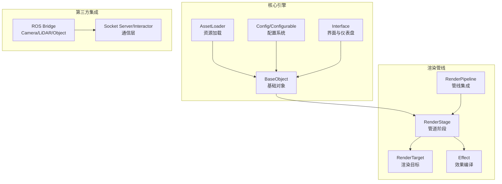
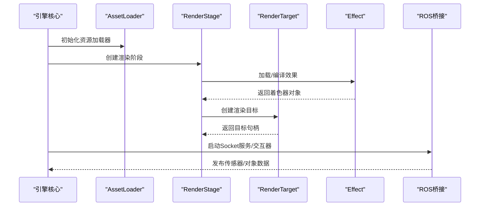
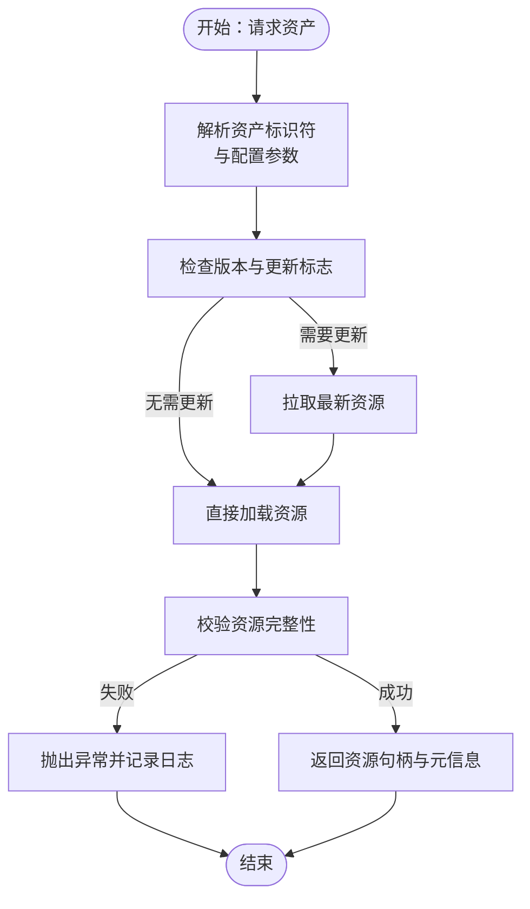
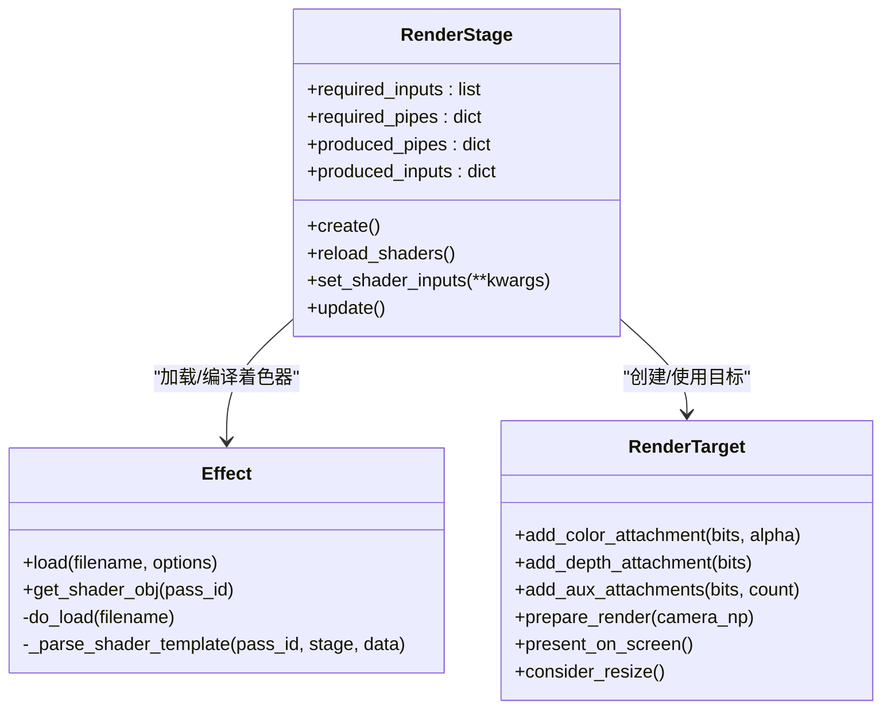
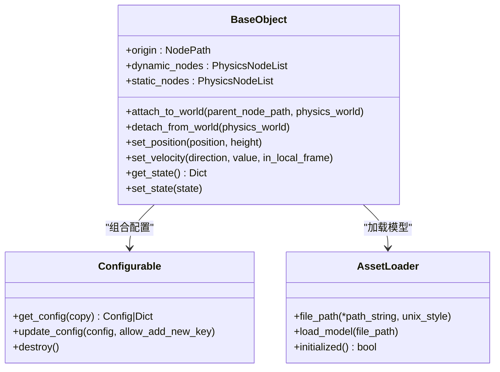
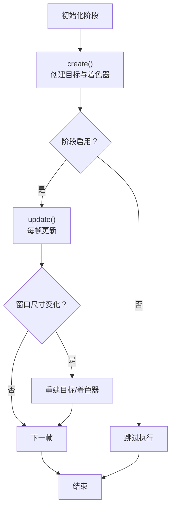
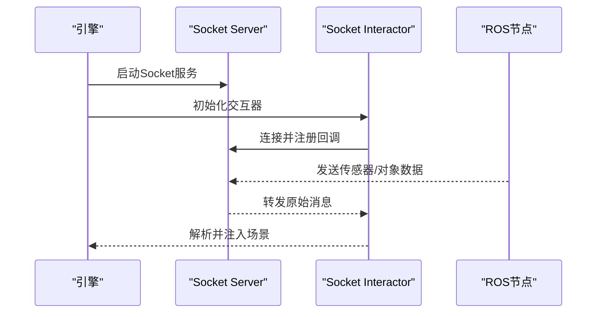
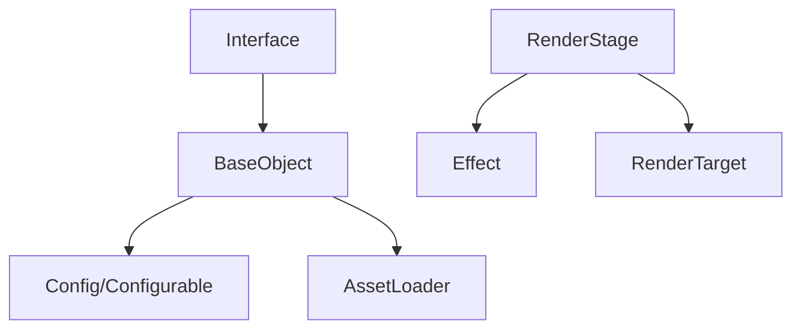

# 扩展开发指南

<cite>
**本文档引用的文件**
- [metaurban/engine/interface.py](file://metaurban/metaurban/engine/interface.py)
- [metaurban/engine/asset_loader.py](file://metaurban/metaurban/engine/asset_loader.py)
- [metaurban/base_class/base_object.py](file://metaurban/metaurban/base_class/base_object.py)
- [metaurban/base_class/configurable.py](file://metaurban/metaurban/base_class/configurable.py)
- [metaurban/utils/registry.py](file://metaurban/metaurban/utils/registry.py)
- [metaurban/utils/config.py](file://metaurban/metaurban/utils/config.py)
- [metaurban/render_pipeline/rpcore/render_stage.py](file://metaurban/metaurban/render_pipeline/rpcore/render_stage.py)
- [metaurban/render_pipeline/rpcore/render_target.py](file://metaurban/metaurban/render_pipeline/rpcore/render_target.py)
- [metaurban/render_pipeline/rpcore/effect.py](file://metaurban/metaurban/render_pipeline/rpcore/effect.py)
- [metaurban/render_pipeline/readme.md](file://metaurban/metaurban/render_pipeline/readme.md)
- [metaurban/bridges/ros_bridge/src/metaurban_example_bridge/metaurban_example_bridge/camera_bridge.py](file://metaurban/bridges/ros_bridge/src/metaurban_example_bridge/metaurban_example_bridge/camera_bridge.py)
- [metaurban/bridges/ros_bridge/src/metaurban_example_bridge/metaurban_example_bridge/lidar_bridge.py](file://metaurban/bridges/ros_bridge/src/metaurban_example_bridge/metaurban_example_bridge/lidar_bridge.py)
- [metaurban/bridges/ros_bridge/src/metaurban_example_bridge/metaurban_example_bridge/obj_bridge.py](file://metaurban/bridges/ros_bridge/src/metaurban_example_bridge/metaurban_example_bridge/obj_bridge.py)
- [metaurban/bridges/ros_bridge/ros_socket_server.py](file://metaurban/bridges/ros_bridge/ros_socket_server.py)
- [metaurban/bridges/ros_bridge/ros_socket_interactor.py](file://metaurban/bridges/ros_bridge/ros_socket_interactor.py)
- [metaurban/bridges/ros_bridge/package.xml](file://metaurban/bridges/ros_bridge/package.xml)
- [metaurban/bridges/ros_bridge/setup.py](file://metaurban/bridges/ros_bridge/setup.py)
- [metaurban/bridges/ros_bridge/install/setup.bash](file://metaurban/bridges/ros_bridge/install/setup.bash)
- [metaurban/bridges/ros_bridge/log/build_2025-01-21_16-05-33/metaurban_example_bridge/package.xml](file://metaurban/bridges/ros_bridge/log/build_2025-01-21_16-05-33/metaurban_example_bridge/package.xml)
- [metaurban/bridges/ros_bridge/log/build_2025-01-21_16-05-33/metaurban_example_bridge/setup.py](file://metaurban/bridges/ros_bridge/log/build_2025-01-21_16-05-33/metaurban_example_bridge/setup.py)
- [metaurban/bridges/ros_bridge/log/build_2025-01-21_16-05-33/metaurban_example_bridge/src/metaurban_example_bridge/metaurban_example_bridge/camera_bridge.py](file://metaurban/bridges/ros_bridge/log/build_2025-01-21_16-05-33/metaurban_example_bridge/src/metaurban_example_bridge/metaurban_example_bridge/camera_bridge.py)
- [metaurban/bridges/ros_bridge/log/build_2025-01-21_16-05-33/metaurban_example_bridge/src/metaurban_example_bridge/metaurban_example_bridge/lidar_bridge.py](file://metaurban/bridges/ros_bridge/log/build_2025-01-21_16-05-33/metaurban_example_bridge/src/metaurban_example_bridge/metaurban_example_bridge/lidar_bridge.py)
- [metaurban/bridges/ros_bridge/log/build_2025-01-21_16-05-33/metaurban_example_bridge/src/metaurban_example_bridge/metaurban_example_bridge/obj_bridge.py](file://metaurban/bridges/ros_bridge/log/build_2025-01-21_16-05-33/metaurban_example_bridge/src/metaurban_example_bridge/metaurban_example_bridge/obj_bridge.py)
</cite>

## 目录
1. [简介](#简介)
2. [项目结构](#项目结构)
3. [核心组件](#核心组件)
4. [架构总览](#架构总览)
5. [详细组件分析](#详细组件分析)
6. [依赖分析](#依赖分析)
7. [性能考虑](#性能考虑)
8. [故障排除指南](#故障排除指南)
9. [结论](#结论)
10. [附录](#附录)

## 简介
本指南面向RoadGen3D的扩展开发者，系统阐述插件系统的架构与扩展点，涵盖资产后端、渲染管线（Render Pipeline）与组件系统三大方向。文档提供自定义资产后端的实现流程（接口、注册与配置）、渲染管线扩展方法（新着色器与效果插件）、新组件创建流程（基类继承、属性与行为），以及自定义管道阶段的输入输出规范与错误处理建议。同时给出第三方系统集成（如ROS桥接、外部API）的实践路径，并总结扩展测试与验证的最佳实践。

## 项目结构
RoadGen3D在MetaUrban引擎之上构建了3D场景生成与渲染能力，扩展点主要集中在以下模块：
- 资产加载与后端：AssetLoader与资源路径管理
- 组件系统：BaseObject及其子类体系
- 配置系统：Config与Configurable
- 渲染管线：RenderPipeline适配与扩展（rpcore）
- 接口与可视化：Interface（仪表盘、导航箭头等）
- 第三方集成：ROS桥接（camera/lidar/obj桥）

**图表来源**
- [metaurban/engine/asset_loader.py:11-150](file://metaurban/metaurban/engine/asset_loader.py#L11-L150)
- [metaurban/base_class/base_object.py:105-562](file://metaurban/metaurban/base_class/base_object.py#L105-L562)
- [metaurban/base_class/configurable.py:6-43](file://metaurban/metaurban/base_class/configurable.py#L6-L43)
- [metaurban/engine/interface.py:19-220](file://metaurban/metaurban/engine/interface.py#L19-L220)
- [metaurban/render_pipeline/rpcore/render_stage.py:34-179](file://metaurban/metaurban/render_pipeline/rpcore/render_stage.py#L34-L179)
- [metaurban/render_pipeline/rpcore/render_target.py:55-398](file://metaurban/metaurban/render_pipeline/rpcore/render_target.py#L55-L398)
- [metaurban/render_pipeline/rpcore/effect.py:37-307](file://metaurban/metaurban/render_pipeline/rpcore/effect.py#L37-L307)

**章节来源**
- [metaurban/engine/asset_loader.py:11-150](file://metaurban/metaurban/engine/asset_loader.py#L11-L150)
- [metaurban/base_class/base_object.py:105-562](file://metaurban/metaurban/base_class/base_object.py#L105-L562)
- [metaurban/base_class/configurable.py:6-43](file://metaurban/metaurban/base_class/configurable.py#L6-L43)
- [metaurban/engine/interface.py:19-220](file://metaurban/metaurban/engine/interface.py#L19-L220)
- [metaurban/render_pipeline/rpcore/render_stage.py:34-179](file://metaurban/metaurban/render_pipeline/rpcore/render_stage.py#L34-L179)
- [metaurban/render_pipeline/rpcore/render_target.py:55-398](file://metaurban/metaurban/render_pipeline/rpcore/render_target.py#L55-L398)
- [metaurban/render_pipeline/rpcore/effect.py:37-307](file://metaurban/metaurban/render_pipeline/rpcore/effect.py#L37-L307)

## 核心组件
- 资产加载器（AssetLoader）：负责Panda3D资源加载器初始化、资源路径转换与模型加载；支持版本检查与更新判断。
- 基础对象（BaseObject）：所有可交互实体的基类，统一管理渲染节点、物理节点、坐标变换与状态读写。
- 配置系统（Config/Configurable）：提供受保护的配置合并、类型校验与不可变锁定机制。
- 渲染阶段（RenderStage）：渲染管线的抽象阶段，定义输入/输出管道、着色器加载与目标管理。
- 效果编译（Effect）：基于YAML描述的效果编译器，支持按选项生成不同变体的着色器。
- 渲染目标（RenderTarget）：离屏缓冲区与纹理附件管理，支持多通道颜色、深度与辅助纹理。
- 接口（Interface）：可视化界面、仪表盘与导航箭头，支持面板布局与显示/隐藏控制。
- ROS桥接：通过Socket与ROS节点通信，桥接相机、LiDAR与物体数据。

**章节来源**
- [metaurban/engine/asset_loader.py:11-150](file://metaurban/metaurban/engine/asset_loader.py#L11-L150)
- [metaurban/base_class/base_object.py:105-562](file://metaurban/metaurban/base_class/base_object.py#L105-L562)
- [metaurban/base_class/configurable.py:6-43](file://metaurban/metaurban/base_class/configurable.py#L6-L43)
- [metaurban/render_pipeline/rpcore/render_stage.py:34-179](file://metaurban/metaurban/render_pipeline/rpcore/render_stage.py#L34-L179)
- [metaurban/render_pipeline/rpcore/effect.py:37-307](file://metaurban/metaurban/render_pipeline/rpcore/effect.py#L37-L307)
- [metaurban/render_pipeline/rpcore/render_target.py:55-398](file://metaurban/metaurban/render_pipeline/rpcore/render_target.py#L55-L398)
- [metaurban/engine/interface.py:19-220](file://metaurban/metaurban/engine/interface.py#L19-L220)

## 架构总览
下图展示从引擎到渲染管线与第三方桥接的整体交互关系，强调扩展点与耦合边界。

**图表来源**
- [metaurban/engine/asset_loader.py:106-150](file://metaurban/metaurban/engine/asset_loader.py#L106-L150)
- [metaurban/render_pipeline/rpcore/render_stage.py:53-179](file://metaurban/metaurban/render_pipeline/rpcore/render_stage.py#L53-L179)
- [metaurban/render_pipeline/rpcore/effect.py:67-146](file://metaurban/metaurban/render_pipeline/rpcore/effect.py#L67-L146)
- [metaurban/render_pipeline/rpcore/render_target.py:64-398](file://metaurban/metaurban/render_pipeline/rpcore/render_target.py#L64-L398)

## 详细组件分析

### 资产后端扩展（自定义资产加载与注册）
- 设计目标：为新资产类型提供统一加载入口，支持路径解析、版本校验与资源更新策略。
- 关键扩展点：
  - 资源路径与加载器：通过AssetLoader.file_path与loadModel实现资源定位与加载。
  - 版本与更新：should_update_asset用于判定是否需要拉取最新资源。
  - 注册机制：可通过注册表或配置文件扩展新的资产类型映射。
- 开发流程要点：
  - 实现资产后端接口（约定方法集合，如load、exists、metadata等）。
  - 在初始化阶段调用AssetLoader.initialize_asset_loader完成加载器绑定。
  - 将新资产类型加入配置系统，确保运行时可被识别与实例化。
  - 提供资产清单与元数据校验，保证一致性与可回溯性。
- 输入输出规范：
  - 输入：资产标识符（名称/路径/哈希）、配置参数。
  - 输出：已加载的资源句柄（模型/纹理/材质）、元信息字典。
- 错误处理：
  - 路径不存在、格式不支持、版本不匹配等情况需抛出明确异常并记录日志。
  - 对于网络资源，增加重试与降级策略。
- 测试与验证：
  - 单元测试覆盖路径转换、加载失败与版本比较。
  - 集成测试验证资源清单与实际文件一致性。

**图表来源**
- [metaurban/engine/asset_loader.py:66-104](file://metaurban/metaurban/engine/asset_loader.py#L66-L104)

**章节来源**
- [metaurban/engine/asset_loader.py:11-150](file://metaurban/metaurban/engine/asset_loader.py#L11-L150)

### 渲染管线扩展（新着色器与效果插件）
- 设计目标：在RenderPipeline框架内新增渲染阶段、效果与着色器，保持与现有管线的兼容性。
- 关键扩展点：
  - 自定义渲染阶段：继承RenderStage，声明required_inputs/produced_pipes，实现create与reload_shaders。
  - 效果编译：使用Effect.load加载YAML描述，按选项生成不同变体的着色器。
  - 渲染目标：通过RenderTarget创建离屏缓冲与多附件纹理，设置尺寸、清屏与采样参数。
- 开发流程要点：
  - 定义阶段输入输出规范（如gbuffer、shadow、voxelize等）。
  - 编写GLSL模板与注入钩子，使用Effect解析YAML并生成临时着色器文件。
  - 在RenderStage中加载着色器并设置全局/局部输入。
  - 处理窗口尺寸变化与目标重建。
- 输入输出规范：
  - 输入：前一阶段产生的纹理/数据（由required_inputs/required_pipes声明）。
  - 输出：本阶段生成的纹理/数据（由produced_pipes/produced_inputs声明）。
- 错误处理：
  - 着色器编译失败、模板钩子未找到、目标尺寸无效等情况需捕获并回退到默认配置。
- 性能优化：
  - 合理选择颜色/深度位数与辅助纹理数量，避免过度带宽占用。
  - 使用合适的分辨率比例与裁剪策略减少计算量。

**图表来源**
- [metaurban/render_pipeline/rpcore/render_stage.py:34-179](file://metaurban/metaurban/render_pipeline/rpcore/render_stage.py#L34-L179)
- [metaurban/render_pipeline/rpcore/effect.py:37-307](file://metaurban/metaurban/render_pipeline/rpcore/effect.py#L37-L307)
- [metaurban/render_pipeline/rpcore/render_target.py:55-398](file://metaurban/metaurban/render_pipeline/rpcore/render_target.py#L55-L398)

**章节来源**
- [metaurban/render_pipeline/rpcore/render_stage.py:34-179](file://metaurban/metaurban/render_pipeline/rpcore/render_stage.py#L34-L179)
- [metaurban/render_pipeline/rpcore/effect.py:37-307](file://metaurban/metaurban/render_pipeline/rpcore/effect.py#L37-L307)
- [metaurban/render_pipeline/rpcore/render_target.py:55-398](file://metaurban/metaurban/render_pipeline/rpcore/render_target.py#L55-L398)
- [metaurban/render_pipeline/readme.md:1-72](file://metaurban/metaurban/render_pipeline/readme.md#L1-L72)

### 新组件创建（基类继承、属性定义与行为实现）
- 设计目标：通过继承BaseObject快速创建具备渲染与物理属性的新组件。
- 关键扩展点：
  - 继承BaseObject，实现必要的属性（如SEMANTIC_LABEL、MASS）与生命周期方法。
  - 使用Configurable管理静态配置，支持运行时更新与类型校验。
  - 通过AssetLoader加载模型，建立NodePath与Bullet物理节点的父子关系。
- 开发流程要点：
  - 明确定义组件的几何尺寸、质量与碰撞掩码。
  - 在attach_to_world/detach_from_world中正确挂载/卸载场景图与物理世界。
  - 实现get_state/set_state以支持状态同步与回放。
- 输入输出规范：
  - 输入：父节点、物理世界、初始位置/朝向/速度。
  - 输出：附加后的节点树与物理节点列表。
- 错误处理：
  - 重复设置物理体、节点为空、坐标系转换异常等情况需显式断言与日志提示。
- 可观测性：
  - 可选开启坐标轴可视化与调试信息，便于定位问题。

**图表来源**
- [metaurban/base_class/base_object.py:105-562](file://metaurban/metaurban/base_class/base_object.py#L105-L562)
- [metaurban/base_class/configurable.py:6-43](file://metaurban/metaurban/base_class/configurable.py#L6-L43)
- [metaurban/engine/asset_loader.py:66-87](file://metaurban/metaurban/engine/asset_loader.py#L66-L87)

**章节来源**
- [metaurban/base_class/base_object.py:105-562](file://metaurban/metaurban/base_class/base_object.py#L105-L562)
- [metaurban/base_class/configurable.py:6-43](file://metaurban/metaurban/base_class/configurable.py#L6-L43)
- [metaurban/engine/asset_loader.py:66-87](file://metaurban/metaurban/engine/asset_loader.py#L66-L87)

### 自定义管道阶段开发（输入输出规范与错误处理）
- 输入输出规范：
  - required_inputs/required_pipes：声明依赖的上游数据与纹理。
  - produced_pipes/produced_inputs：声明本阶段产出的数据与纹理。
- 生命周期：
  - create：初始化目标与着色器；reload_shaders：根据配置重新加载。
  - update：每帧更新逻辑（如动态参数）。
  - handle_window_resize：响应窗口尺寸变化，重建目标。
- 错误处理：
  - 目标尺寸非法、着色器加载失败、模板钩子缺失等需捕获并记录。
  - 提供降级方案（如禁用阶段或回退默认着色器）。

**图表来源**
- [metaurban/render_pipeline/rpcore/render_stage.py:61-179](file://metaurban/metaurban/render_pipeline/rpcore/render_stage.py#L61-L179)

**章节来源**
- [metaurban/render_pipeline/rpcore/render_stage.py:34-179](file://metaurban/metaurban/render_pipeline/rpcore/render_stage.py#L34-L179)

### 第三方系统集成（ROS桥接、外部API）
- ROS桥接：
  - Socket服务器与交互器：负责与ROS节点通信，转发传感器与对象数据。
  - 桥接模块：camera_bridge、lidar_bridge、obj_bridge分别处理相机、LiDAR与物体消息。
  - 构建与安装：package.xml与setup.py定义包结构，install脚本提供环境配置。
- 外部API集成：
  - 建议通过独立服务层封装HTTP/REST调用，统一错误码与超时重试。
  - 使用配置系统管理API密钥与端点，支持热更新。
- 集成流程要点：
  - 定义消息协议与数据结构，确保与上游系统一致。
  - 在引擎初始化阶段启动桥接服务，监听端口并注册回调。
  - 实现心跳检测与断线重连，保障实时性与稳定性。

**图表来源**
- [metaurban/bridges/ros_bridge/ros_socket_server.py](file://metaurban/bridges/ros_bridge/ros_socket_server.py)
- [metaurban/bridges/ros_bridge/ros_socket_interactor.py](file://metaurban/bridges/ros_bridge/ros_socket_interactor.py)
- [metaurban/bridges/ros_bridge/src/metaurban_example_bridge/metaurban_example_bridge/camera_bridge.py](file://metaurban/bridges/ros_bridge/src/metaurban_example_bridge/metaurban_example_bridge/camera_bridge.py)
- [metaurban/bridges/ros_bridge/src/metaurban_example_bridge/metaurban_example_bridge/lidar_bridge.py](file://metaurban/bridges/ros_bridge/src/metaurban_example_bridge/metaurban_example_bridge/lidar_bridge.py)
- [metaurban/bridges/ros_bridge/src/metaurban_example_bridge/metaurban_example_bridge/obj_bridge.py](file://metaurban/bridges/ros_bridge/src/metaurban_example_bridge/metaurban_example_bridge/obj_bridge.py)

**章节来源**
- [metaurban/bridges/ros_bridge/package.xml](file://metaurban/bridges/ros_bridge/package.xml)
- [metaurban/bridges/ros_bridge/setup.py](file://metaurban/bridges/ros_bridge/setup.py)
- [metaurban/bridges/ros_bridge/install/setup.bash](file://metaurban/bridges/ros_bridge/install/setup.bash)
- [metaurban/bridges/ros_bridge/log/build_2025-01-21_16-05-33/metaurban_example_bridge/package.xml](file://metaurban/bridges/ros_bridge/log/build_2025-01-21_16-05-33/metaurban_example_bridge/package.xml)
- [metaurban/bridges/ros_bridge/log/build_2025-01-21_16-05-33/metaurban_example_bridge/setup.py](file://metaurban/bridges/ros_bridge/log/build_2025-01-21_16-05-33/metaurban_example_bridge/setup.py)
- [metaurban/bridges/ros_bridge/log/build_2025-01-21_16-05-33/metaurban_example_bridge/src/metaurban_example_bridge/metaurban_example_bridge/camera_bridge.py](file://metaurban/bridges/ros_bridge/log/build_2025-01-21_16-05-33/metaurban_example_bridge/src/metaurban_example_bridge/metaurban_example_bridge/camera_bridge.py)
- [metaurban/bridges/ros_bridge/log/build_2025-01-21_16-05-33/metaurban_example_bridge/src/metaurban_example_bridge/metaurban_example_bridge/lidar_bridge.py](file://metaurban/bridges/ros_bridge/log/build_2025-01-21_16-05-33/metaurban_example_bridge/src/metaurban_example_bridge/metaurban_example_bridge/lidar_bridge.py)
- [metaurban/bridges/ros_bridge/log/build_2025-01-21_16-05-33/metaurban_example_bridge/src/metaurban_example_bridge/metaurban_example_bridge/obj_bridge.py](file://metaurban/bridges/ros_bridge/log/build_2025-01-21_16-05-33/metaurban_example_bridge/src/metaurban_example_bridge/metaurban_example_bridge/obj_bridge.py)

## 依赖分析
- 组件内聚与耦合：
  - BaseObject与AssetLoader耦合度高，但通过Configurable降低配置变更对对象的影响。
  - RenderStage与Effect/RenderTarget松耦合，通过管道与纹理接口交互。
- 外部依赖：
  - Panda3D（NodePath、GraphicsEngine、Texture等）。
  - YAML解析与临时文件生成（Effect）。
  - ROS生态（bridge与socket通信）。
- 循环依赖风险：
  - 基础类之间无循环依赖；渲染阶段与目标通过RPObject间接关联，避免直接循环。

**图表来源**
- [metaurban/base_class/base_object.py:105-562](file://metaurban/metaurban/base_class/base_object.py#L105-L562)
- [metaurban/base_class/configurable.py:6-43](file://metaurban/metaurban/base_class/configurable.py#L6-L43)
- [metaurban/engine/asset_loader.py:11-150](file://metaurban/metaurban/engine/asset_loader.py#L11-L150)
- [metaurban/render_pipeline/rpcore/render_stage.py:34-179](file://metaurban/metaurban/render_pipeline/rpcore/render_stage.py#L34-L179)
- [metaurban/render_pipeline/rpcore/effect.py:37-307](file://metaurban/metaurban/render_pipeline/rpcore/effect.py#L37-L307)
- [metaurban/render_pipeline/rpcore/render_target.py:55-398](file://metaurban/metaurban/render_pipeline/rpcore/render_target.py#L55-L398)
- [metaurban/engine/interface.py:19-220](file://metaurban/metaurban/engine/interface.py#L19-L220)

**章节来源**
- [metaurban/base_class/base_object.py:105-562](file://metaurban/metaurban/base_class/base_object.py#L105-L562)
- [metaurban/base_class/configurable.py:6-43](file://metaurban/metaurban/base_class/configurable.py#L6-L43)
- [metaurban/engine/asset_loader.py:11-150](file://metaurban/metaurban/engine/asset_loader.py#L11-L150)
- [metaurban/render_pipeline/rpcore/render_stage.py:34-179](file://metaurban/metaurban/render_pipeline/rpcore/render_stage.py#L34-L179)
- [metaurban/render_pipeline/rpcore/effect.py:37-307](file://metaurban/metaurban/render_pipeline/rpcore/effect.py#L37-L307)
- [metaurban/render_pipeline/rpcore/render_target.py:55-398](file://metaurban/metaurban/render_pipeline/rpcore/render_target.py#L55-L398)
- [metaurban/engine/interface.py:19-220](file://metaurban/metaurban/engine/interface.py#L19-L220)

## 性能考虑
- 渲染管线：
  - 合理设置RenderTarget的颜色/深度位数与辅助纹理数量，避免带宽瓶颈。
  - 使用分辨率比例与裁剪策略减少不必要的像素填充。
  - 控制阴影贴图与体积光照的采样密度与步长。
- 资产加载：
  - 路径缓存与版本校验减少重复IO；批量加载与异步更新提升吞吐。
- 组件管理：
  - 动态/静态物理节点分离，减少不必要的碰撞检测。
  - 状态序列化与增量更新，降低网络传输与解析开销。

## 故障排除指南
- 资产加载失败：
  - 检查AssetLoader.file_path路径转换与平台差异（Windows转Unix风格）。
  - 确认资源版本与引擎版本匹配，必要时触发should_update_asset更新流程。
- 渲染阶段异常：
  - 着色器编译错误：核对Effect模板钩子是否完整，临时文件是否存在。
  - 目标尺寸异常：确认RenderTarget.size约束与窗口分辨率关系。
- 组件状态不一致：
  - 核查BaseObject的attach/detach流程，确保物理世界与场景图同步。
  - 检查get_state/set_state实现，避免坐标系与单位换算误差。
- ROS桥接通信：
  - 校验Socket连接状态与消息协议一致性，实现断线重连与心跳检测。

**章节来源**
- [metaurban/engine/asset_loader.py:52-104](file://metaurban/metaurban/engine/asset_loader.py#L52-L104)
- [metaurban/render_pipeline/rpcore/effect.py:183-307](file://metaurban/metaurban/render_pipeline/rpcore/effect.py#L183-L307)
- [metaurban/render_pipeline/rpcore/render_target.py:258-398](file://metaurban/metaurban/render_pipeline/rpcore/render_target.py#L258-L398)
- [metaurban/base_class/base_object.py:222-289](file://metaurban/metaurban/base_class/base_object.py#L222-L289)
- [metaurban/bridges/ros_bridge/ros_socket_server.py](file://metaurban/bridges/ros_bridge/ros_socket_server.py)
- [metaurban/bridges/ros_bridge/ros_socket_interactor.py](file://metaurban/bridges/ros_bridge/ros_socket_interactor.py)

## 结论
RoadGen3D提供了清晰的扩展边界：资产后端通过AssetLoader与配置系统解耦；组件系统以BaseObject为核心，结合Configurable实现稳健的配置管理；渲染管线通过RenderStage/Effect/RenderTarget形成可插拔的阶段化架构；第三方系统通过ROS桥接与Socket实现低耦合集成。遵循本文档的扩展流程、输入输出规范与错误处理建议，可高效地在该框架上实现定制化的资产、渲染与系统集成需求。

## 附录
- 快速参考清单：
  - 资产后端：实现load/exist/metadata接口，接入AssetLoader与配置系统。
  - 渲染阶段：定义required/produced接口，编写GLSL模板并通过Effect编译。
  - 组件：继承BaseObject，实现attach/detach与状态读写。
  - ROS桥接：定义消息协议，使用Socket Server/Interactor进行数据转发。
- 最佳实践：
  - 以配置驱动行为，避免硬编码；提供默认值与类型校验。
  - 分离职责：渲染阶段只关注数据流，不直接操作场景图。
  - 异常即日志：对关键路径增加异常捕获与可观测性指标。