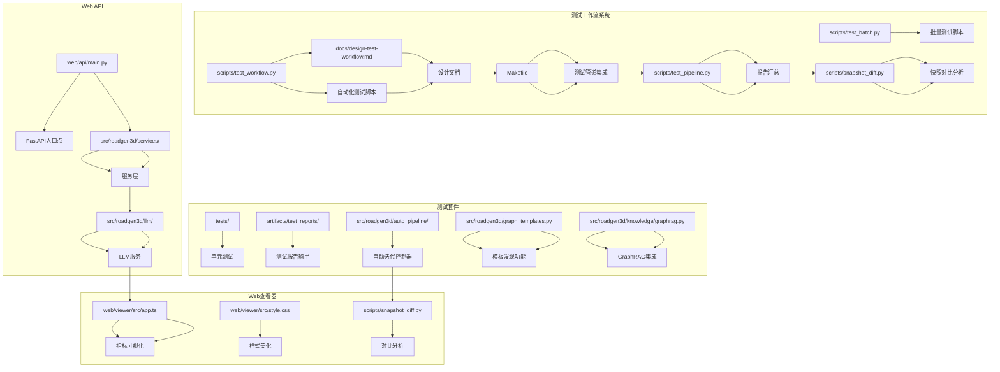
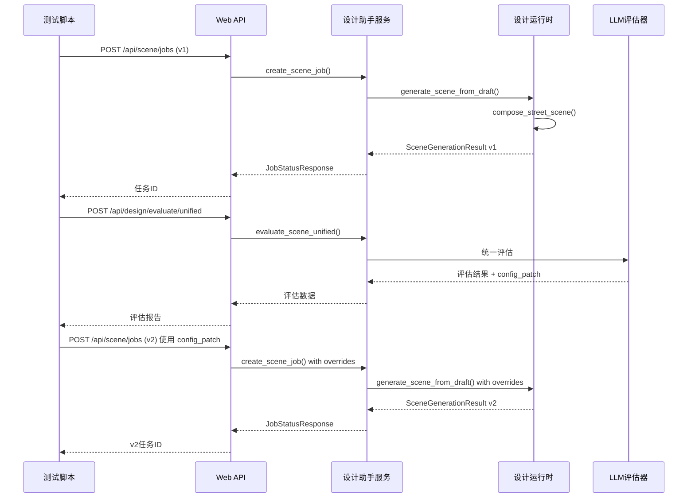
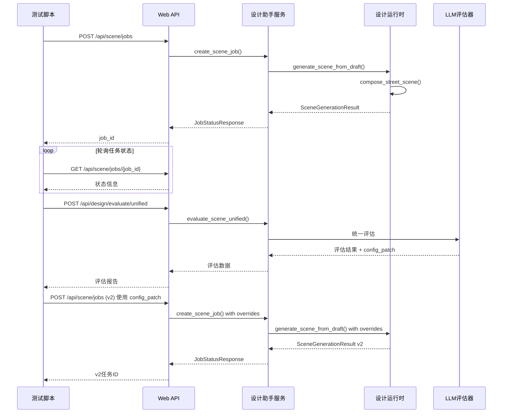
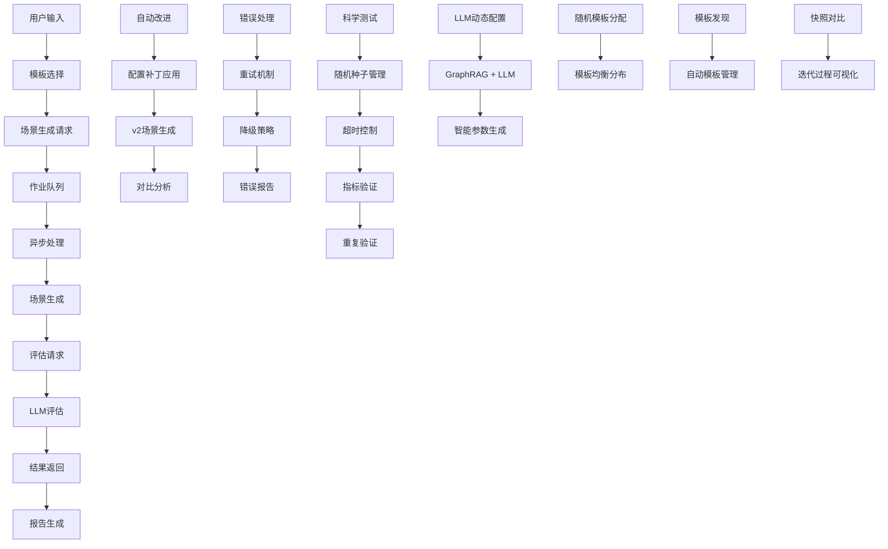
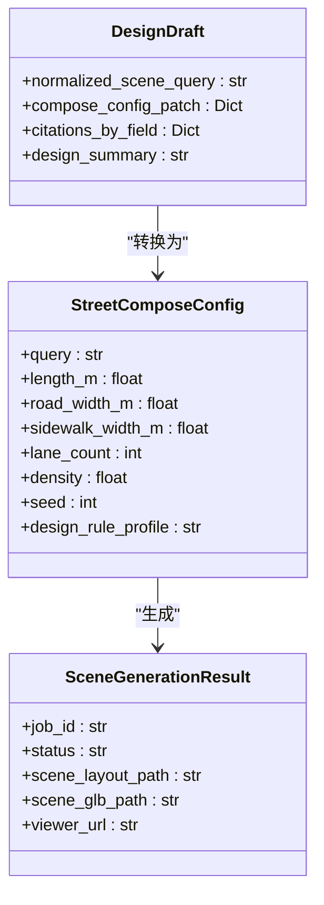
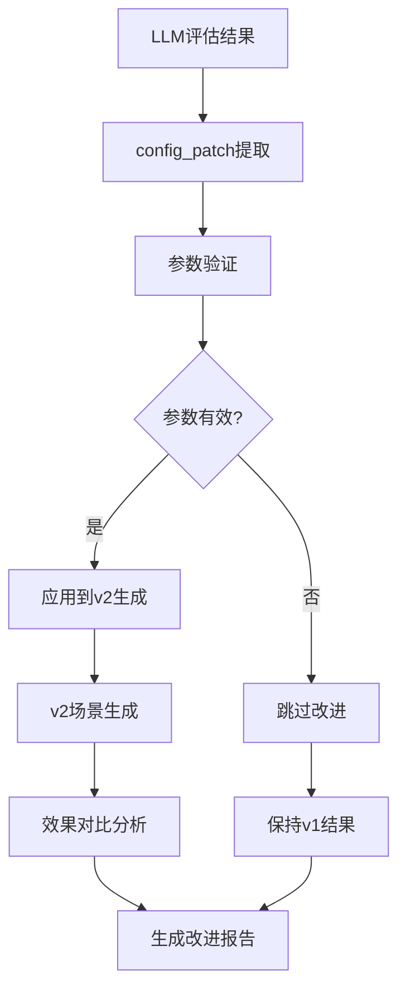
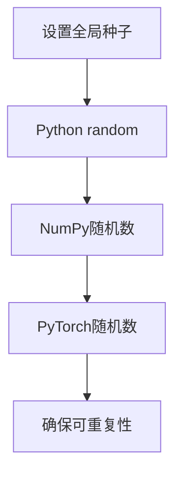
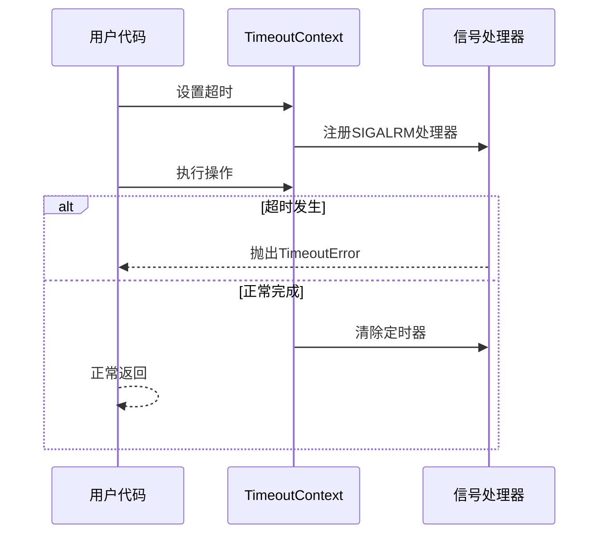
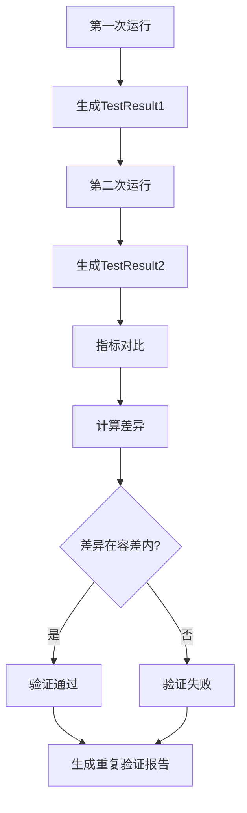
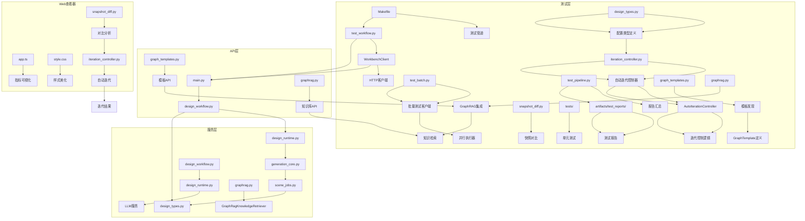

# 测试工作流系统

<cite>
**本文档引用的文件**
- [test_workflow.py](file://scripts/test_workflow.py)
- [test_batch.py](file://scripts/test_batch.py)
- [design-test-workflow.md](file://docs/design-test-workflow.md)
- [main.py](file://web/api/main.py)
- [design_runtime.py](file://src/roadgen3d/services/design_runtime.py)
- [design_workflow.py](file://src/roadgen3d/llm/design_workflow.py)
- [scene_jobs.py](file://src/roadgen3d/services/scene_jobs.py)
- [generation_core.py](file://src/roadgen3d/services/generation_core.py)
- [Makefile](file://Makefile)
- [test_pipeline.py](file://scripts/test_pipeline.py)
- [app.ts](file://web/viewer/src/app.ts)
- [street_layout.py](file://src/roadgen3d/street_layout.py)
- [eval_metrics.py](file://src/roadgen3d/eval_metrics.py)
- [eval_quality.py](file://src/roadgen3d/eval_quality.py)
- [iteration_controller.py](file://src/roadgen3d/auto_pipeline/iteration_controller.py)
- [snapshot_diff.py](file://scripts/snapshot_diff.py)
- [design_types.py](file://src/roadgen3d/services/design_types.py)
- [prompts.py](file://src/roadgen3d/llm/prompts.py)
- [graph_templates.py](file://src/roadgen3d/graph_templates.py)
- [graphrag.py](file://src/roadgen3d/knowledge/graphrag.py)
</cite>

## 更新摘要
**变更内容**
- 新增 LLM 动态配置生成功能，支持 GraphRAG + LLM 的智能参数生成
- 新增随机模板分配机制，支持为每个预设随机分配不同的 graph template
- 改进种子管理系统，增强全局随机种子设置的稳定性和一致性
- 新增批量测试功能，支持并行执行多个模板的场景生成
- 新增自动改进功能：基于 LLM 评估结果自动应用配置补丁进行场景优化
- 新增 v2 场景生成：支持在同一测试中生成改进版本场景并进行对比分析
- 新增配置补丁应用：实现基于 config_patch 的参数自动调整机制
- 新增改进版本对比分析：提供 v1 与 v2 场景的详细对比报告
- 改进确定性评分算法：确保评估结果的可重复性和确定性
- 新增模板发现功能：支持自动发现和管理内置 graph templates
- 新增快照对比分析：支持场景迭代过程的可视化对比

## 目录
1. [简介](#简介)
2. [项目结构](#项目结构)
3. [核心组件](#核心组件)
4. [架构概览](#架构概览)
5. [详细组件分析](#详细组件分析)
6. [命令行接口](#命令行接口)
7. [科学测试功能](#科学测试功能)
8. [用户界面增强](#用户界面增强)
9. [依赖关系分析](#依赖关系分析)
10. [性能考虑](#性能考虑)
11. [故障排除指南](#故障排除指南)
12. [结论](#结论)

## 简介

测试工作流系统是一个完整的自动化测试框架，专门用于验证 RoadGen3D 项目的端到端工作流程。该系统能够随机选择预设模板，执行完整的场景生成流程，调用 LLM 评估系统，并生成详细的测试报告。

### 主要目标
- 验证模板选择功能的随机性和完整性
- 执行完整的场景生成流程（模板选择 → 场景生成 → 评估）
- 调用 LLM 评估系统获取多维度评分
- 生成可读的 Markdown 格式测试报告
- 支持 CI/CD 集成和持续监控
- 提供科学测试功能：随机种子管理、超时处理、指标验证和重复验证
- **新增**：LLM 动态配置生成支持 GraphRAG + LLM 的智能参数生成
- **新增**：随机模板分配机制支持为每个预设随机分配不同的 graph template
- **新增**：改进的种子管理系统确保实验可重复性
- **新增**：批量测试功能支持并行执行多个模板的场景生成
- **新增**：自动改进功能基于 LLM 建议自动优化场景
- **新增**：v2 场景生成支持场景迭代优化
- **新增**：配置补丁应用机制实现参数自动调整
- **新增**：改进分析提供详细的优化效果对比报告
- **新增**：确定性评分算法确保评估结果的可重复性
- **新增**：模板发现功能支持自动发现和管理内置 graph templates
- **新增**：快照对比分析支持场景迭代过程的可视化对比

### 关键特性
- **随机模板选择**：支持 6 种预设模板（步行友好、商业活力、公交优先等）
- **端到端测试**：从模板选择到场景生成再到评估的完整流程
- **智能报告生成**：自动生成包含详细指标和改进建议的测试报告
- **命令行接口**：完整的参数化测试执行支持
- **CI/CD 集成**：Makefile 测试管道支持自动化执行
- **错误处理**：完善的错误捕获、处理和降级机制
- **科学测试**：支持重复验证、指标验证和超时管理
- **可重复性**：全局随机种子设置确保实验可重复性
- **实时反馈**：动画旋转器、详细进度条和状态更新
- **健康检查**：API 连接状态和详细服务信息展示
- **可视化评估**：Web 查看器中的指标可视化和颜色编码
- **确定性评分**：整数四舍五入确保评估结果的可重复性
- **标准化导出**：统一 GLB 格式提升兼容性
- **自动改进**：基于 LLM 建议自动优化场景参数
- **v2 场景生成**：支持场景迭代优化和版本对比
- **配置补丁应用**：实现参数的自动调整和应用
- **改进分析**：提供详细的优化效果对比报告
- **LLM 动态配置**：支持 GraphRAG + LLM 的智能参数生成
- **随机模板分配**：为每个预设随机分配不同的 graph template
- **批量并行处理**：支持多模板并行测试执行
- **模板发现**：自动发现和管理内置 graph templates
- **快照对比**：支持场景迭代过程的可视化对比分析

## 项目结构

测试工作流系统位于项目的根目录下，主要包含以下关键文件：



**图表来源**
- [test_workflow.py:1-1554](file://scripts/test_workflow.py#L1-L1554)
- [test_batch.py:1-743](file://scripts/test_batch.py#L1-L743)
- [main.py:1-301](file://web/api/main.py#L1-L301)
- [design-test-workflow.md:1-235](file://docs/design-test-workflow.md#L1-L235)
- [Makefile:135-198](file://Makefile#L135-L198)
- [test_pipeline.py:1-151](file://scripts/test_pipeline.py#L1-L151)
- [app.ts:370-570](file://web/viewer/src/app.ts#L370-L570)
- [snapshot_diff.py:1-918](file://scripts/snapshot_diff.py#L1-L918)
- [iteration_controller.py:1-320](file://src/roadgen3d/auto_pipeline/iteration_controller.py#L1-L320)
- [graph_templates.py:1-138](file://src/roadgen3d/graph_templates.py#L1-L138)
- [graphrag.py:301-435](file://src/roadgen3d/knowledge/graphrag.py#L301-L435)

**章节来源**
- [design-test-workflow.md:1-235](file://docs/design-test-workflow.md#L1-L235)
- [Makefile:135-198](file://Makefile#L135-L198)

## 核心组件

### 测试工作流脚本

测试工作流的核心是 `scripts/test_workflow.py`，它实现了完整的自动化测试流程：

#### 预设模板系统
系统支持 6 种预设模板，每种模板都有特定的设计参数和配置：

| 模板ID | 中文名称 | 英文名称 | 设计规则配置 | 人口需求水平 | 交通需求水平 | 商业需求水平 | 密度 |
|--------|----------|----------|--------------|--------------|--------------|--------------|------|
| pedestrian_friendly | 步行友好 | Pedestrian Friendly | pedestrian_priority_v1 | high | low | low | 0.5 |
| commercial_vitality | 商业活力 | Commercial Vitality | balanced_complete_street_v1 | high | high | high | 0.9 |
| transit_priority | 公交优先 | Transit Priority | transit_priority_v1 | high | high | medium | 0.85 |
| park_landscape | 公园景观 | Park Landscape | pedestrian_priority_v1 | medium | low | low | 0.2 |
| quiet_residential | 安静居住 | Quiet Residential | balanced_complete_street_v1 | low | low | low | 0.3 |
| balanced_complete | 平衡街道 | Balanced Complete | balanced_complete_street_v1 | medium | medium | medium | 0.6 |

#### 工作流客户端
`WorkbenchClient` 类封装了所有 API 调用，包括：
- 场景生成任务创建
- 任务状态轮询
- LLM 评估调用
- 健康检查

#### 科学测试功能
**新增** 系统现在支持完整的科学测试功能：



**图表来源**
- [test_workflow.py:552-802](file://scripts/test_workflow.py#L552-L802)
- [test_workflow.py:822-959](file://scripts/test_workflow.py#L822-L959)

**章节来源**
- [test_workflow.py:50-141](file://scripts/test_workflow.py#L50-L141)
- [test_workflow.py:408-469](file://scripts/test_workflow.py#L408-L469)
- [test_workflow.py:552-802](file://scripts/test_workflow.py#L552-L802)

### 批量测试系统

**新增** 批量测试系统支持并行执行多个模板的场景生成：

#### 批量测试客户端
`WorkbenchClient` 类扩展了批量测试功能：
- 支持随机模板分配
- 支持 LLM 动态配置生成
- 并行任务管理和进度跟踪

#### 并行执行机制
系统使用 `ThreadPoolExecutor` 实现并行执行：
- 线程安全的任务管理
- 实时进度回调和状态更新
- 统一的结果收集和报告生成

#### 随机模板分配
支持为每个预设随机分配不同的 graph template：
- 6 种可用的 graph templates
- 随机分配算法确保均衡分布
- 支持强制使用特定模板

**章节来源**
- [test_batch.py:166-270](file://scripts/test_batch.py#L166-L270)
- [test_batch.py:373-451](file://scripts/test_batch.py#L373-L451)
- [test_batch.py:625-640](file://scripts/test_batch.py#L625-L640)

### Web API服务

Web API 提供了 RESTful 接口，支持完整的场景生成和评估功能：

#### 核心API端点
| 端点 | 方法 | 描述 |
|------|------|------|
| `/api/scene/jobs` | POST | 创建场景生成任务 |
| `/api/scene/jobs/{job_id}` | GET | 获取任务状态 |
| `/api/design/evaluate/unified` | POST | LLM 统一评估 |
| `/api/health` | GET | 健康检查 |

#### 异步作业队列
`SceneJobService` 实现了基于线程的异步作业处理：
- 内存中的作业存储
- 条件变量同步
- 线程池管理
- 错误处理和恢复

**章节来源**
- [main.py:188-278](file://web/api/main.py#L188-L278)
- [scene_jobs.py:42-178](file://src/roadgen3d/services/scene_jobs.py#L42-L178)

## 架构概览

测试工作流系统采用分层架构设计，确保模块间的松耦合和高内聚：



**图表来源**
- [test_workflow.py:473-581](file://scripts/test_workflow.py#L473-L581)
- [main.py:188-278](file://web/api/main.py#L188-L278)

### 数据流架构

系统采用事件驱动的数据流模式：



**图表来源**
- [test_workflow.py:473-581](file://scripts/test_workflow.py#L473-L581)
- [scene_jobs.py:144-178](file://src/roadgen3d/services/scene_jobs.py#L144-L178)

## 详细组件分析

### 测试工作流执行引擎

测试工作流的核心执行逻辑在 `run_test` 函数中实现：

#### 执行阶段分解
1. **初始化阶段**：配置测试参数和时间戳
2. **场景生成阶段**：创建和轮询生成任务
3. **评估阶段**：调用 LLM 评估系统
4. **自动改进阶段**：根据评估结果应用配置补丁
5. **v2 场景生成阶段**：使用改进参数生成新版本
6. **报告生成阶段**：构建和保存测试报告

#### 错误处理机制
系统实现了多层次的错误处理：
- **连接错误**：网络连接失败时的优雅降级
- **超时处理**：任务超时的警告和继续执行
- **评估失败**：评估失败时的警告而非测试失败
- **状态检查**：完整的状态验证和错误报告

#### 动画旋转器和进度显示
系统集成了多种用户反馈机制：

**动画旋转器**：使用 Unicode 字符序列创建旋转动画效果
```python
spinner_chars = ["⠋", "⠙", "⠹", "⠸", "⠼", "⠴", "⠦", "⠧", "⠇", "⠏"]
```

**详细进度条**：提供精确的进度百分比和 ETA 计算
```python
def get_progress_bar(progress: float, width: int = 20) -> str:
    filled = int(width * min(progress, 1.0))
    empty = width - filled
    return "█" * filled + "░" * empty
```

**实时状态更新**：显示当前操作和队列状态
- 队列位置信息：`| 队列位置: #${queue_pos}`
- 当前操作：`| ${current_op.get('name', current_op.get('status', ''))}`
- ETA 计算：基于进度和超时时间的动态估计

**章节来源**
- [test_workflow.py:569-581](file://scripts/test_workflow.py#L569-L581)
- [test_workflow.py:569-581](file://scripts/test_workflow.py#L569-L581)

### LLM 动态配置生成系统

**新增** LLM 动态配置生成系统支持 GraphRAG + LLM 的智能参数生成：

#### 配置生成流程
1. **设计意图解析**：将用户输入转换为设计意图
2. **RAG 知识检索**：从 GraphRAG 中检索相关设计规范
3. **参数草案生成**：基于意图和证据生成初始配置
4. **参数完善**：补充缺失的参数值
5. **配置验证**：确保生成的配置有效且合理

#### GraphRAG 集成
系统集成了 GraphRAG 知识库：
- 支持多种知识源（PDF RAG、GraphRAG、混合）
- 智能查询翻译和重写
- 证据检索和引用标注
- 缓存机制提升性能

#### 配置补丁生成
生成的配置补丁包含：
- 设计规则配置
- 目标配置
- 密度和需求水平
- 尺寸参数
- 风格和美学配置

**章节来源**
- [test_workflow.py:614-630](file://scripts/test_workflow.py#L614-L630)
- [design_workflow.py:113-243](file://src/roadgen3d/llm/design_workflow.py#L113-L243)
- [prompts.py:442-492](file://src/roadgen3d/llm/prompts.py#L442-L492)

### 设计运行时系统

设计运行时系统负责实际的场景生成逻辑：

#### 参数配置系统
`build_compose_config_from_draft` 函数将设计草稿转换为具体的生成配置：



**图表来源**
- [design_runtime.py:60-94](file://src/roadgen3d/services/design_runtime.py#L60-L94)
- [design_runtime.py:190-219](file://src/roadgen3d/services/design_runtime.py#L190-L219)

#### 场景生成管道
设计运行时系统实现了完整的场景生成管道：

1. **配置构建**：从设计草稿构建生成配置
2. **场景上下文解析**：确定场景生成模式（OSM、模板等）
3. **资产后端初始化**：设置对象、地面和天空资源
4. **场景合成**：执行实际的场景生成
5. **结果包装**：构建标准化的结果对象

**章节来源**
- [design_runtime.py:336-396](file://src/roadgen3d/services/design_runtime.py#L336-L396)
- [generation_core.py:157-189](file://src/roadgen3d/services/generation_core.py#L157-L189)

### LLM 评估系统

LLM 评估系统提供多维度的场景质量评估：

#### 评估指标体系
| 维度 | 权重 | 指标 | 说明 |
|------|------|------|------|
| 步行性 | 45% | SID_CLR, CLEAR_CONT | 人行道宽度、连续性 |
| 安全性 | 35% | LIGHT_UNI, CROSS_PROV | 照明均匀度、过街设施 |
| 美观性 | 20% | TREE_SHADE, BUFFER_RATIO | 绿化遮荫率、缓冲带比例 |
| **综合** | **100%** | **overall** | **加权总分** |

#### 评估流程
1. **布局解析**：读取场景布局文件
2. **放置分析**：分析场景中对象的放置情况
3. **LLM 调用**：请求统一评估
4. **结果处理**：标准化评估结果

**更新** 新增确定性评分算法，确保评估结果的可重复性和确定性

**章节来源**
- [design_workflow.py:352-414](file://src/roadgen3d/llm/design_workflow.py#L352-L414)

### 报告生成系统

测试工作流系统提供了完整的报告生成功能：

#### 报告格式规范
系统生成标准的 Markdown 格式报告，包含以下部分：

1. **执行摘要**：测试基本信息和结果概览
2. **场景生成**：生成状态和文件路径
3. **评估结果**：详细评分和指标分析
4. **自动改进**：v1 与 v2 场景的对比分析
5. **原始数据**：JSON 格式的完整测试结果

#### 报告内容结构
```markdown
# Workbench 自动化测试报告

**测试时间**: 2026-04-12 15:30:00
**模板**: 步行友好 (pedestrian_friendly)
**状态**: ✅ 通过

## 执行摘要

| 指标 | 值 |
|------|-----|
| 总耗时 | 45.2 秒 |
| 任务 ID | job_abc123 |
| 评估状态 | 成功 |

## 场景生成

- **状态**: succeeded
- **v1 布局路径**: /tmp/scene_xxx/scene_layout.json
- **v1 GLB 路径**: /tmp/scene_xxx/scene.glb
- **v2 布局路径**: /tmp/scene_xxx/v2/scene_layout.json
- **v2 GLB 路径**: /tmp/scene_xxx/v2/scene.glb

## 评估结果

### 综合评分

| 维度 | v1 分数 | v2 分数 | 变化 |
|------|---------|---------|------|
| 步行性 (45%) | 78 | 82 | +4 |
| 安全性 (35%) | 72 | 75 | +3 |
| 美观性 (20%) | 85 | 88 | +3 |
| **综合** | **77** | **81** | **+4** |

### 详细指标

| 指标 | v1 值 | v2 值 | 说明 |
|------|-------|-------|------|
| SID_CLR | 0.85 | 0.88 | 人行道净宽 |
| CLEAR_CONT | 0.78 | 0.82 | 净空连续性 |
| ... | ... | ... | ... |

## 自动改进

### 配置补丁应用

基于 LLM 建议的应用参数：
- density: 0.5 → 0.6
- sidewalk_width_m: 2.4 → 2.6
- tree_density: low → medium

### 改进效果

v2 场景相比 v1 场景的优化：
- 整体评分提升 4 分
- 人行道宽度增加 0.2 米
- 街道家具密度增加
- 绿化覆盖率提升

## 原始数据

```json
{
  "walkability": 78,
  "safety": 72,
  "beauty": 85,
  "overall": 77,
  "improvement_summary": "walkability: 78→82 (+4); safety: 72→75 (+3); beauty: 85→88 (+3)",
  "evaluation_v2": {...}
}
```
```

**章节来源**
- [test_workflow.py:650-802](file://scripts/test_workflow.py#L650-L802)

### 自动改进功能

**新增** 系统实现了完整的自动改进功能：

#### 改进流程
1. **评估阶段**：获取 v1 场景的 LLM 评估结果
2. **配置提取**：从评估结果中提取 config_patch
3. **参数应用**：将 config_patch 应用到 v2 场景生成
4. **场景生成**：使用改进参数生成 v2 场景
5. **效果对比**：生成详细的改进效果报告

#### 配置补丁应用机制
系统支持基于 config_patch 的参数自动调整：



**图表来源**
- [test_workflow.py:759-797](file://scripts/test_workflow.py#L759-L797)
- [test_workflow.py:822-959](file://scripts/test_workflow.py#L822-L959)

#### v2 场景生成
系统提供了专门的 v2 场景生成函数：

**章节来源**
- [test_workflow.py:822-959](file://scripts/test_workflow.py#L822-L959)

### 随机模板分配系统

**新增** 系统实现了智能的随机模板分配机制：

#### 模板分配策略
1. **均衡分配**：确保每个 graph template 被均衡使用
2. **随机化**：为每个预设随机分配模板，避免偏见
3. **一致性**：同一运行中的分配保持一致
4. **可配置**：支持强制使用特定模板或随机分配

#### 分配算法
系统使用随机采样算法：
- 为每个预设随机选择一个 graph template
- 确保模板分布的随机性和均衡性
- 支持模板 ID 和标签的映射

**章节来源**
- [test_batch.py:386-393](file://scripts/test_batch.py#L386-L393)
- [test_batch.py:417-430](file://scripts/test_batch.py#L417-L430)

### 模板发现功能

**新增** 系统实现了自动模板发现功能：

#### 模板定义系统
系统支持三种内置 graph templates：
- **hkust_gz_gate**：HKUST-GZ 门禁图
- **hkust_gz_detailed**：详细 HKUST-GZ 图（5个建筑区+10条道路）
- **hkust_gz_gate_all**：HKUST-GZ 门禁完整图

#### 模板元数据
每个模板包含：
- 标签和描述
- 注释文件路径
- 图像文件路径
- 源格式信息
- 路网统计信息

#### 模板加载机制
系统使用 LRU 缓存优化模板加载：
- 模板定义集中管理
- 注释文件解析和验证
- 元数据提取和标准化
- 缓存机制提升性能

**章节来源**
- [graph_templates.py:41-137](file://src/roadgen3d/graph_templates.py#L41-L137)

### 快照对比分析

**新增** 系统提供了完整的快照对比分析功能：

#### 对比分析流程
1. **多版本生成**：生成多个不同参数的场景版本
2. **配置差异计算**：计算相邻版本间的参数变化
3. **视觉对比**：生成预览图的对比视图
4. **统计分析**：生成评分进展图表
5. **报告生成**：输出完整的对比分析报告

#### HTML 报告生成
系统生成自包含的 HTML 报告，包含：
- 版本摘要和最佳结果标识
- 评分进展图表
- 迭代预览对比
- 配置差异详情
- 最终结果下载链接

**章节来源**
- [snapshot_diff.py:246-361](file://scripts/snapshot_diff.py#L246-L361)
- [snapshot_diff.py:613-697](file://scripts/snapshot_diff.py#L613-L697)

## 命令行接口

测试工作流系统提供了完整的命令行接口支持：

### 基本用法
```bash
# 基本用法（随机选择模板）
uv run python scripts/test_workflow.py

# 指定模板
uv run python scripts/test_workflow.py --preset pedestrian_friendly

# 指定 API 地址
uv run python scripts/test_workflow.py --api-base http://127.0.0.1:8010

# 重复验证模式
uv run python scripts/test_workflow.py --verify-repeat

# 指定随机种子
uv run python scripts/test_workflow.py --seed 42

# 指定图模板ID
uv run python scripts/test_workflow.py --graph-template hkust_gz_gate

# 启用 LLM 动态配置
uv run python scripts/test_workflow.py --use-llm

# 批量测试模式
uv run python scripts/test_batch.py --all --workers 6

# 随机模板分配
uv run python scripts/test_batch.py --all --random-template

# 组合使用
uv run python scripts/test_batch.py --all --random-template --use-llm --workers 4

# 列出可用模板
uv run python scripts/test_batch.py --list-templates
```

### 命令行参数详解

| 参数 | 类型 | 默认值 | 描述 |
|------|------|--------|------|
| `--preset` | String | None | 指定预设模板 ID |
| `--api-base` | String | `http://127.0.0.1:8010` | API 基础地址 |
| `--timeout` | Float | 600.0 | 任务超时时间（秒） |
| `--output` | Path | `artifacts/test_reports` | 报告输出目录 |
| `--seed` | Integer | 42 | 随机种子 |
| `--verify-repeat` | Boolean | False | 运行重复验证 |
| `--graph-template` | String | `hkust_gz_gate` | 指定使用的 graph template ID |
| `--use-llm` | Boolean | False | 启用 LLM 动态生成配置 |
| `--random-template` | Boolean | False | 为每个 preset 随机分配模板 |
| `--workers` | Integer | 6 | 并行工作线程数 |
| `--list-templates` | Boolean | False | 列出所有可用模板 |

### 参数验证
- **模板验证**：确保指定的模板存在于预设列表中
- **API 地址验证**：验证 URL 格式的有效性
- **超时验证**：确保超时时间大于 0
- **输出目录验证**：自动创建不存在的目录
- **种子验证**：确保随机种子为整数
- **图模板验证**：确保图模板 ID 有效
- **LLM 配置验证**：验证 LLM 功能的可用性

**章节来源**
- [test_workflow.py:853-975](file://scripts/test_workflow.py#L853-L975)
- [test_batch.py:554-743](file://scripts/test_batch.py#L554-L743)

## 科学测试功能

测试工作流系统新增了完整的科学测试功能，确保实验的可重复性和结果的准确性：

### 随机种子管理

系统实现了全局随机种子管理，确保实验的可重复性：

#### 种子设置机制


**图表来源**
- [test_workflow.py:149-175](file://scripts/test_workflow.py#L149-L175)

#### 支持的随机数库
- **Python random**：标准库随机数生成
- **NumPy**：科学计算随机数（可选）
- **PyTorch**：深度学习随机数（可选）

**章节来源**
- [test_workflow.py:149-175](file://scripts/test_workflow.py#L149-L175)

### 超时处理机制

系统提供了多层次的超时处理机制：

#### 超时上下文管理器
`timeout_context` 提供了基于信号的超时控制：



**图表来源**
- [test_workflow.py:185-214](file://scripts/test_workflow.py#L185-L214)

#### 线程安全超时运行器
`RunnerTimeout` 提供了线程安全的超时执行：

**章节来源**
- [test_workflow.py:185-260](file://scripts/test_workflow.py#L185-L260)

### 指标验证系统

`MetricsValidator` 类提供了完整的指标验证功能：

#### 验证功能
1. **分数范围验证**：确保评估分数在有效范围内
2. **公式验证**：验证综合评分计算公式的正确性
3. **重复性验证**：比较两次运行结果的一致性
4. **改进效果验证**：验证 v1 与 v2 场景的改进效果

#### 验证配置
- **容差阈值**：默认 0.01，用于浮点数比较
- **重复运行容差**：默认 1e-6，确保高度可重复性
- **权重配置**：步行性 45%，安全性 35%，美观性 20%

**更新** 新增确定性评分算法，确保评估结果的可重复性

**章节来源**
- [test_workflow.py:264-366](file://scripts/test_workflow.py#L264-L366)

### 重复验证机制

系统支持完整的重复运行验证功能：

#### 重复验证流程


**图表来源**
- [test_workflow.py:584-645](file://scripts/test_workflow.py#L584-L645)

#### 验证结果数据结构
`RepeatVerificationResult` 包含完整的验证信息：
- **preset**：使用的预设配置
- **run1/run2**：两次运行的详细结果
- **repeatability_passed**：验证是否通过
- **metric_differences**：指标差异详情

**章节来源**
- [test_workflow.py:396-404](file://scripts/test_workflow.py#L396-L404)
- [test_workflow.py:584-645](file://scripts/test_workflow.py#L584-L645)

### 改进效果验证

**新增** 系统现在支持 v2 场景的改进效果验证：

#### 改进验证流程
1. **v1 场景评估**：获取原始场景的评估结果
2. **v2 场景生成**：使用 config_patch 生成改进场景
3. **v2 场景评估**：获取改进场景的评估结果
4. **效果对比**：比较 v1 与 v2 的评分差异
5. **验证报告**：生成详细的改进效果报告

**章节来源**
- [test_workflow.py:759-797](file://scripts/test_workflow.py#L759-L797)
- [test_workflow.py:822-959](file://scripts/test_workflow.py#L822-L959)

## 用户界面增强

### Web 查看器指标可视化

Web 查看器提供了丰富的指标可视化功能：

#### 指标面板渲染
系统实现了动态的指标面板渲染，包含三个主要组：

**布局质量指标组**：
- 重叠率 (overlap_rate)
- 丢弃率 (dropped_slot_rate)
- 间距均匀性 (spacing_uniformity)
- 风格一致性 (style_consistency)
- 均衡度 (balance_score)

**合规性指标组**：
- 合规率 (compliance_rate_total)
- 违规数 (violations_total)
- 可行性 (avg_feasibility_score)

**场景统计指标组**：
- 实例数 (instance_count)
- 资产种类 (unique_asset_count)
- 多样性 (diversity_ratio)

#### 颜色编码系统
指标采用颜色编码系统表示质量等级：
- **绿色 (#16a34a)**：优秀 (≥ 0.8)
- **黄色 (#eab308)**：良好 (≥ 0.5)
- **红色 (#dc2626)**：需要改进 (< 0.5)

#### 进度条渲染
每个指标都渲染为可视化的进度条：
```typescript
function renderMetricsBarHtml(entry: MetricEntry): string {
  const percent = Math.round(clamp(entry.value / entry.max, 0, 1) * 100);
  const color = metricColor(entry.value, entry.max);
  return `<div class="viewer-metric-row">
  <div class="viewer-metric-label">${escapeHtml(entry.label)}</div>
  <div class="viewer-metric-value">${entry.value.toFixed(2)}</div>
  <div class="viewer-metric-bar-track"><div class="viewer-metric-bar-fill" style="width:${percent}%;background:${color}"></div></div>
</div>`;
}
```

**章节来源**
- [app.ts:370-569](file://web/viewer/src/app.ts#L370-L569)

### 实时状态更新

Web 查看器提供了实时的状态更新和用户反馈：

#### 状态闪烁功能
`flashStatus` 函数提供了临时状态提示：
- 支持自定义显示时长
- 自动恢复原状态
- 防止状态覆盖

#### 灯光状态应用
系统支持动态的光照状态调整：
- 温暖色调与冷色调混合
- 关键光、填充光和半球光的协调
- 阴影强度和曝光度的实时调节

**章节来源**
- [app.ts:1229-1239](file://web/viewer/src/app.ts#L1229-L1239)
- [app.ts:1241-1264](file://web/viewer/src/app.ts#L1241-L1264)

### 快照对比分析

**新增** 系统提供了完整的快照对比分析功能：

#### 对比分析流程
1. **多版本生成**：生成多个不同参数的场景版本
2. **配置差异计算**：计算相邻版本间的参数变化
3. **视觉对比**：生成预览图的对比视图
4. **统计分析**：生成评分进展图表
5. **报告生成**：输出完整的对比分析报告

#### HTML 报告生成
系统生成自包含的 HTML 报告，包含：
- 版本摘要和最佳结果标识
- 评分进展图表
- 迭代预览对比
- 配置差异详情
- 最终结果下载链接

**章节来源**
- [snapshot_diff.py:246-361](file://scripts/snapshot_diff.py#L246-L361)
- [snapshot_diff.py:613-697](file://scripts/snapshot_diff.py#L613-L697)

## 依赖关系分析

测试工作流系统具有清晰的依赖层次结构：



**图表来源**
- [test_workflow.py:408-469](file://scripts/test_workflow.py#L408-L469)
- [test_batch.py:166-270](file://scripts/test_batch.py#L166-L270)
- [main.py:81-280](file://web/api/main.py#L81-L280)
- [Makefile:135-198](file://Makefile#L135-L198)
- [test_pipeline.py:66-140](file://scripts/test_pipeline.py#L66-L140)
- [app.ts:370-569](file://web/viewer/src/app.ts#L370-L569)
- [design_types.py:13-35](file://src/roadgen3d/services/design_types.py#L13-L35)
- [iteration_controller.py:61-96](file://src/roadgen3d/auto_pipeline/iteration_controller.py#L61-L96)
- [graph_templates.py:41-137](file://src/roadgen3d/graph_templates.py#L41-L137)
- [graphrag.py:301-435](file://src/roadgen3d/knowledge/graphrag.py#L301-L435)

### 外部依赖

系统依赖于以下外部组件：

#### 必需依赖
- **httpx**：HTTP 客户端库
- **python-dotenv**：环境变量管理
- **fastapi**：Web 框架
- **uvicorn**：ASGI 服务器

#### 可选依赖
- **httpx**：用于 API 通信
- **dotenv**：用于环境配置
- **pytest**：测试框架
- **numpy**：科学计算（用于随机种子）
- **torch**：深度学习（用于随机种子）
- **matplotlib**：图表绘制（用于对比分析）
- **PIL**：图像处理（用于预览对比）
- **concurrent.futures**：并行执行（用于批量测试）
- **graphRAG**：图谱知识检索

**章节来源**
- [test_workflow.py:22-46](file://scripts/test_workflow.py#L22-L46)
- [test_batch.py:27-36](file://scripts/test_batch.py#L27-L36)

## 性能考虑

### 并发处理
系统采用了多线程并发处理来提高性能：

#### 线程池设计
- **工作线程**：独立的场景生成线程
- **条件变量**：线程间同步机制
- **队列管理**：作业排队和调度
- **锁机制**：线程安全的数据访问

#### 资源管理
- **内存优化**：使用生成器和迭代器减少内存占用
- **连接池**：HTTP 连接复用
- **缓存机制**：设计草稿缓存
- **超时控制**：防止资源泄露

### 性能优化策略

#### 缓存策略
1. **设计草稿缓存**：避免重复的 LLM 调用
2. **场景布局缓存**：Viewer URL 生成缓存
3. **知识检索缓存**：RAG 查询结果缓存
4. **配置补丁缓存**：改进参数缓存
5. **LLM 响应缓存**：评估结果缓存
6. **模板缓存**：GraphTemplate 解析缓存

#### 异步处理
- **非阻塞 I/O**：HTTP 请求异步处理
- **批量操作**：多个场景的并行生成
- **智能重试**：指数退避算法
- **迭代优化**：自动改进的早期停止

#### 并行优化
- **线程池大小**：根据硬件配置优化并发度
- **任务分割**：将大任务分割为小任务
- **资源隔离**：避免资源竞争
- **进度监控**：实时监控执行进度

## 故障排除指南

### 常见问题及解决方案

#### API 连接问题
**症状**：测试脚本无法连接到 Web API
**原因**：
- API 服务未启动
- 端口被占用
- 网络配置错误

**解决方案**：
1. 检查 API 服务状态：`make workbench-api`
2. 验证端口可用性：`netstat -tulpn | grep 8010`
3. 检查防火墙设置

#### 任务超时问题
**症状**：场景生成任务长时间处于 pending 状态
**原因**：
- 系统负载过高
- 资源不足
- 生成过程异常

**解决方案**：
1. 增加超时时间
2. 检查系统资源
3. 查看 API 日志

#### LLM 配置问题
**症状**：LLM 动态配置生成失败
**原因**：
- LLM API 配置错误
- GraphRAG 知识库不可用
- 网络连接问题
- 输入数据格式错误

**解决方案**：
1. 验证 LLM API 配置
2. 检查 GraphRAG 知识库状态
3. 检查网络连接
4. 验证输入数据格式

#### 批量测试问题
**症状**：批量测试执行失败或性能不佳
**原因**：
- 并发线程数过多
- 资源竞争
- 模板分配不均衡
- 网络拥塞

**解决方案**：
1. 调整并发线程数
2. 优化资源分配
3. 检查模板分配策略
4. 减少网络请求频率

#### 重复验证失败
**症状**：重复运行结果不一致
**原因**：
- 随机种子未正确设置
- 系统状态不一致
- 外部依赖变化

**解决方案**：
1. 确保使用相同随机种子
2. 检查系统依赖版本
3. 清理临时文件

#### 自动改进失败
**症状**：v2 场景生成失败或改进无效
**原因**：
- config_patch 为空或无效
- LLM 评估结果异常
- 参数应用失败

**解决方案**：
1. 检查 config_patch 的有效性
2. 验证 LLM 评估结果
3. 查看参数应用日志

#### 模板发现失败
**症状**：GraphTemplate 加载失败
**原因**：
- 模板文件不存在
- JSON 格式错误
- 权限问题

**解决方案**：
1. 检查模板文件路径
2. 验证 JSON 格式
3. 检查文件权限

#### 快照对比失败
**症状**：快照对比分析异常
**原因**：
- 场景文件缺失
- 图像处理库未安装
- 内存不足

**解决方案**：
1. 检查场景文件存在性
2. 安装 PIL/Pillow 库
3. 增加系统内存

### 调试工具

#### 日志分析
系统提供了详细的日志输出：
- **测试执行日志**：记录测试步骤和状态
- **API 调用日志**：记录 HTTP 请求和响应
- **错误日志**：记录异常和错误信息
- **验证日志**：记录指标验证结果
- **改进日志**：记录自动改进过程
- **LLM 日志**：记录配置生成过程
- **模板日志**：记录模板发现和加载
- **对比日志**：记录快照对比过程

#### 性能监控
- **执行时间统计**：记录各阶段耗时
- **资源使用监控**：CPU 和内存使用情况
- **错误率统计**：失败率和成功率
- **改进效果监控**：v1 与 v2 的对比分析
- **并发性能监控**：批量测试的执行效率
- **模板使用监控**：模板分配均衡性
- **迭代性能监控**：自动改进的收敛情况

**章节来源**
- [test_workflow.py:569-581](file://scripts/test_workflow.py#L569-L581)
- [test_workflow.py:531-537](file://scripts/test_workflow.py#L531-L537)

## 结论

测试工作流系统为 RoadGen3D 项目提供了一个完整、可靠的自动化测试框架。该系统具有以下优势：

### 技术优势
- **模块化设计**：清晰的分层架构和职责分离
- **可扩展性**：支持新的测试场景和评估指标
- **可靠性**：完善的错误处理和恢复机制
- **可观测性**：详细的日志和监控能力
- **自动化程度高**：完整的 CI/CD 集成支持
- **科学性**：支持重复验证和指标验证
- **可重复性**：全局随机种子管理确保实验一致性
- **用户体验**：实时反馈和可视化展示
- **确定性评分**：整数四舍五入确保评估结果的可重复性
- **标准化导出**：统一 GLB 格式提升兼容性
- **自动改进**：基于 LLM 建议的场景优化功能
- **v2 场景生成**：支持场景迭代优化和版本对比
- **配置补丁应用**：实现参数的自动调整和应用
- **改进分析**：提供详细的优化效果对比报告
- **LLM 动态配置**：支持 GraphRAG + LLM 的智能参数生成
- **随机模板分配**：为每个预设随机分配不同的 graph template
- **批量并行处理**：支持多模板并行测试执行
- **模板发现**：自动发现和管理内置 graph templates
- **快照对比**：支持场景迭代过程的可视化对比分析

### 实际价值
- **质量保证**：确保系统功能的正确性和稳定性
- **开发效率**：自动化测试减少手动测试工作量
- **持续改进**：支持持续集成和持续部署
- **团队协作**：标准化的测试流程和报告
- **科学研究**：支持可重复的实验和验证
- **用户友好**：直观的进度显示和状态反馈
- **性能优化**：自动改进功能提升场景质量
- **版本管理**：v2 场景对比便于版本追踪
- **智能配置**：LLM 动态配置提升设计质量
- **均衡测试**：随机模板分配确保测试公平性
- **模板管理**：自动模板发现简化模板管理
- **迭代分析**：快照对比支持设计迭代优化

### 发展方向
未来可以考虑的功能增强：
- **分布式测试**：支持大规模并发测试
- **智能测试**：基于机器学习的测试用例生成
- **可视化监控**：实时测试状态可视化
- **报告定制**：支持多种报告格式和模板
- **测试结果分析**：历史趋势分析和性能基准
- **高级验证**：支持更复杂的验证规则和阈值
- **移动端支持**：移动设备上的测试执行和监控
- **确定性算法优化**：进一步提升评分算法的准确性和效率
- **多版本对比**：支持更多版本的场景对比分析
- **改进策略优化**：基于历史数据的改进策略学习
- **LLM 模型优化**：支持更多类型的 LLM 模型和配置
- **模板库扩展**：支持更多的 graph template 和设计规则
- **GraphRAG 优化**：提升知识检索的准确性和性能
- **快照对比增强**：支持更丰富的对比分析和可视化

该测试工作流系统为 RoadGen3D 项目的长期发展奠定了坚实的技术基础，确保了系统的质量和可靠性，同时为科学研究提供了可靠的基础。

**章节来源**
- [design-test-workflow.md:229-235](file://docs/design-test-workflow.md#L229-L235)