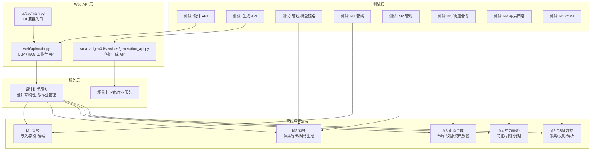
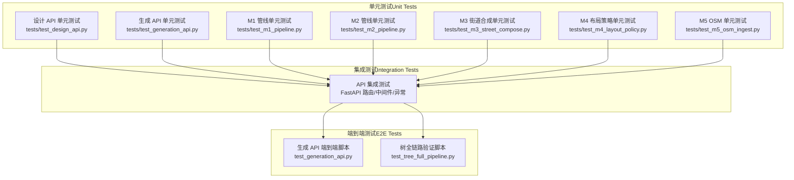
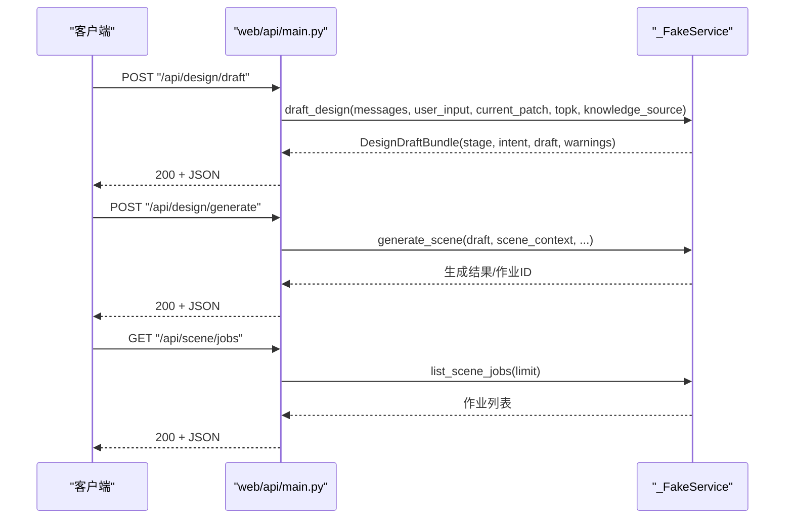
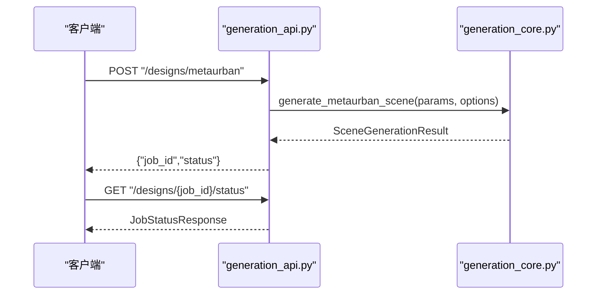
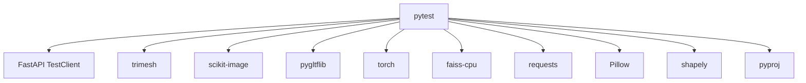

# 测试策略与实践

<cite>
**本文引用的文件**
- [web/api/main.py](file://web/api/main.py)
- [src/roadgen3d/services/generation_api.py](file://src/roadgen3d/services/generation_api.py)
- [ui/api/main.py](file://ui/api/main.py)
- [tests/test_design_api.py](file://tests/test_design_api.py)
- [tests/test_generation_api.py](file://tests/test_generation_api.py)
- [test_generation_api.py](file://test_generation_api.py)
- [test_tree_full_pipeline.py](file://test_tree_full_pipeline.py)
- [tests/test_m1_pipeline.py](file://tests/test_m1_pipeline.py)
- [tests/test_m2_pipeline.py](file://tests/test_m2_pipeline.py)
- [tests/test_m3_street_compose.py](file://tests/test_m3_street_compose.py)
- [tests/test_m4_layout_policy.py](file://tests/test_m4_layout_policy.py)
- [tests/test_m5_osm_ingest.py](file://tests/test_m5_osm_ingest.py)
- [requirements-m1.txt](file://requirements-m1.txt)
- [requirements-m2.txt](file://requirements-m2.txt)
- [requirements-m5.txt](file://requirements-m5.txt)
</cite>

## 目录
1. [引言](#引言)
2. [项目结构](#项目结构)
3. [核心组件](#核心组件)
4. [架构总览](#架构总览)
5. [详细组件分析](#详细组件分析)
6. [依赖分析](#依赖分析)
7. [性能考虑](#性能考虑)
8. [故障排查指南](#故障排查指南)
9. [结论](#结论)
10. [附录](#附录)

## 引言
本文件为 RoadGen3D 项目的测试策略与实践指南，围绕测试金字塔（单元测试、集成测试、端到端测试）进行系统化设计，结合项目现有测试代码与模块职责，给出可操作的测试框架选择、用例编写规范、覆盖范围与持续集成中的执行流程建议，并补充性能与压力测试的实施方案思路。

## 项目结构
RoadGen3D 的测试体系主要由以下部分构成：
- Web API 层：提供 LLM + RAG 工作台接口与直接场景生成接口
- 服务层：设计助手服务、场景作业管理、生成核心逻辑
- 管线与算法层：M1/M2/M3/M4/M5 等里程碑管线与算法模块
- 测试层：按模块划分的单元/集成/端到端测试，以及独立的脚本化验证

图表来源
- [web/api/main.py:1-286](file://web/api/main.py#L1-L286)
- [src/roadgen3d/services/generation_api.py:1-294](file://src/roadgen3d/services/generation_api.py#L1-L294)
- [ui/api/main.py:1-6](file://ui/api/main.py#L1-L6)

章节来源
- [web/api/main.py:1-286](file://web/api/main.py#L1-L286)
- [src/roadgen3d/services/generation_api.py:1-294](file://src/roadgen3d/services/generation_api.py#L1-L294)
- [ui/api/main.py:1-6](file://ui/api/main.py#L1-L6)

## 核心组件
- Web API（工作台）：提供设计草稿、知识检索、场景生成、作业查询、最近场景列表、参考图与图模板、注释转换等接口，采用 FastAPI + CORS 中间件，统一 JSON 安全处理。
- 生成 API（直接生成）：提供 MetaUrban/Template/OSM 三类设计请求，支持异步作业状态查询与结果获取，当前以内存存储模拟任务队列。
- 设计助手服务：封装草稿生成、知识源管理、场景生成、作业创建与查询、城市列表、知识重建与搜索等能力。
- 管线与算法：M1/M2/M3/M4/M5 各阶段的数据流、特征工程、策略训练与 OSM 解析等。

章节来源
- [web/api/main.py:81-267](file://web/api/main.py#L81-L267)
- [src/roadgen3d/services/generation_api.py:27-294](file://src/roadgen3d/services/generation_api.py#L27-L294)

## 架构总览
下图展示测试金字塔在 RoadGen3D 中的映射关系与交互路径：

图表来源
- [tests/test_design_api.py:1-523](file://tests/test_design_api.py#L1-L523)
- [tests/test_generation_api.py:1-146](file://tests/test_generation_api.py#L1-L146)
- [test_generation_api.py:1-146](file://test_generation_api.py#L1-L146)
- [test_tree_full_pipeline.py:1-130](file://test_tree_full_pipeline.py#L1-L130)

## 详细组件分析

### 测试金字塔与分层策略
- 单元测试（Unit Tests）
  - 针对函数级与小模块级行为，使用 pytest 参数化与 Mock，覆盖边界条件与错误路径。
  - 示例：M1/M2/M3/M4/M5 各模块的单元测试文件，覆盖嵌入/索引/解码、体素导出、街道合成、策略特征与训练、OSM 解析等。
- 集成测试（Integration Tests）
  - 验证模块间协作与 API 路由正确性，使用 TestClient 或路由级检查。
  - 示例：设计 API 与生成 API 的路由、CORS、健康检查、异常处理等。
- 端到端测试（E2E Tests）
  - 模拟真实用户流程，从请求到响应或文件输出，验证完整链路。
  - 示例：生成 API 的端到端脚本与树全链路验证脚本。

章节来源
- [tests/test_m1_pipeline.py:1-219](file://tests/test_m1_pipeline.py#L1-L219)
- [tests/test_m2_pipeline.py:1-261](file://tests/test_m2_pipeline.py#L1-L261)
- [tests/test_m3_street_compose.py:1-3852](file://tests/test_m3_street_compose.py#L1-L3852)
- [tests/test_m4_layout_policy.py:1-286](file://tests/test_m4_layout_policy.py#L1-L286)
- [tests/test_m5_osm_ingest.py:1-287](file://tests/test_m5_osm_ingest.py#L1-L287)
- [tests/test_design_api.py:183-523](file://tests/test_design_api.py#L183-L523)
- [tests/test_generation_api.py:1-146](file://tests/test_generation_api.py#L1-L146)
- [test_generation_api.py:1-146](file://test_generation_api.py#L1-L146)
- [test_tree_full_pipeline.py:1-130](file://test_tree_full_pipeline.py#L1-L130)

### 设计 API 测试（工作台）
- 测试要点
  - 接口返回形状与字段校验（草稿、生成、作业、最近场景、知识源、搜索、地理信息、参考计划/图模板、注释转换等）
  - 场景上下文校验（如 OSM 必须提供 AOI bbox）
  - 知识源默认值与参数传递
  - 错误路径（HTTP 4xx/5xx）与 JSON 安全处理
- Mock 对象
  - 使用 _FakeService 替代真实设计助手服务，控制返回值与副作用
- 断言策略
  - 结构断言（字段存在、类型、长度）
  - 数值断言（数值范围、近似相等）
  - 异常断言（HTTP 状态码、错误消息）

图表来源
- [tests/test_design_api.py:183-523](file://tests/test_design_api.py#L183-L523)
- [web/api/main.py:156-221](file://web/api/main.py#L156-L221)

章节来源
- [tests/test_design_api.py:183-523](file://tests/test_design_api.py#L183-L523)
- [web/api/main.py:156-221](file://web/api/main.py#L156-L221)

### 生成 API 测试（直接生成）
- 测试要点
  - 请求模型与参数校验（MetaUrban/Template/Osm）
  - 路由存在性与返回结构
  - UI 应用包含生成路由与 CORS 中间件
  - 健康检查与状态查询
- Mock 对象
  - 使用 Pydantic 模型构造请求体，不依赖真实生成实现
- 断言策略
  - 路由路径集合断言
  - 中间件名称断言
  - 健康检查键值断言

图表来源
- [src/roadgen3d/services/generation_api.py:131-294](file://src/roadgen3d/services/generation_api.py#L131-L294)

章节来源
- [tests/test_generation_api.py:1-146](file://tests/test_generation_api.py#L1-L146)
- [test_generation_api.py:1-146](file://test_generation_api.py#L1-L146)
- [src/roadgen3d/services/generation_api.py:131-294](file://src/roadgen3d/services/generation_api.py#L131-L294)

### 管线与算法测试
- M1 管线（嵌入/索引/解码）
  - 覆盖嵌入归一化、FAISS 索引构建与检索、占位解码器输出形状与二值化
  - 端到端运行与结果保存
- M2 管线（体素导出/网格生成）
  - 体素网格导出文件创建与大小校验
  - Pipeline 输出包含 mesh_glb/mesh_ply
  - Gradio 运行返回模型路径与文件列表
  - 解码器接口兼容性（占位/ShapeE）
- M3 街道合成
  - 街道布局合成、纹理应用、资产缩放与放置
  - POI 规则与场景纹理
- M4 布局策略
  - 特征向量形状与确定性、策略前向输出形状
  - 收集策略数据样本与训练流程
- M5 OSM
  - UTM 区域检测、道路/POI 解析、默认宽度与自定义宽度
  - 建筑物轮廓提取与空数据处理

章节来源
- [tests/test_m1_pipeline.py:1-219](file://tests/test_m1_pipeline.py#L1-L219)
- [tests/test_m2_pipeline.py:1-261](file://tests/test_m2_pipeline.py#L1-L261)
- [tests/test_m3_street_compose.py:1-3852](file://tests/test_m3_street_compose.py#L1-L3852)
- [tests/test_m4_layout_policy.py:1-286](file://tests/test_m4_layout_policy.py#L1-L286)
- [tests/test_m5_osm_ingest.py:1-287](file://tests/test_m5_osm_ingest.py#L1-L287)

### 树全链路验证脚本
- 目标：加载原始 GLB → 计算本地/世界坐标 → 归一化 → 放置（缩放/旋转/平移）→ 导出与重载验证
- 关注点：高度合理性、几何数量与面数、文件大小与导出一致性

章节来源
- [test_tree_full_pipeline.py:1-130](file://test_tree_full_pipeline.py#L1-L130)

## 依赖分析
- 测试框架与工具
  - pytest：版本约束见需求文件
  - FastAPI TestClient：用于 API 端到端测试
  - trimesh/skimage/pygltflib：M2/M3 管线测试依赖
  - torch/faiss-cpu：M1/M2 管线测试依赖
  - requests/Pillow/shapely/pyproj：M5 管线测试依赖
- 模块耦合
  - Web API 与服务层松耦合，通过设计助手服务抽象对外部依赖
  - 生成 API 与核心生成模块解耦，便于测试时仅验证路由与模型
  - 管线测试通过 monkeypatch/Fake 实现模块替换，降低外部依赖

图表来源
- [requirements-m1.txt:1-7](file://requirements-m1.txt#L1-L7)
- [requirements-m2.txt:1-4](file://requirements-m2.txt#L1-L4)
- [requirements-m5.txt:1-5](file://requirements-m5.txt#L1-L5)

章节来源
- [requirements-m1.txt:1-7](file://requirements-m1.txt#L1-L7)
- [requirements-m2.txt:1-4](file://requirements-m2.txt#L1-L4)
- [requirements-m5.txt:1-5](file://requirements-m5.txt#L1-L5)

## 性能考虑
- 单元测试性能
  - 使用小规模输入与固定随机种子保证可重复性
  - 通过 pytest.importorskip 控制重型依赖（torch/faiss）的启用
- 集成测试性能
  - 使用内存存储与简化模型（如占位解码器）替代真实计算
  - 尽量避免网络请求与磁盘 IO
- 端到端测试性能
  - 提供最小化样例与短路径验证
  - 将耗时步骤（如真实生成）放入独立脚本或 CI 分阶段执行
- 压力测试建议
  - 使用 pytest-benchmark 或 locust（按需）对热点 API 进行并发与吞吐评估
  - 对 M2/M3 管线的关键函数（如体素导出、街道合成）进行基准测试

## 故障排查指南
- 常见问题与定位
  - API 返回 4xx/5xx：检查请求模型字段、知识源默认值、场景上下文必填项（如 OSM 的 AOI bbox）
  - JSON 不安全：确认使用统一的 JSON 安全处理函数
  - 依赖缺失：根据 requirements 文件安装对应包；必要时使用 importorskip 跳过
  - 路由缺失：核对 FastAPI 路由注册与 UI 应用挂载
- 调试技巧
  - 使用 pytest -v -s 查看详细日志
  - 在测试中打印关键中间状态（如作业状态、文件路径）
  - 对复杂流程使用分段断言，缩小问题范围

章节来源
- [tests/test_design_api.py:457-471](file://tests/test_design_api.py#L457-L471)
- [web/api/main.py:92-99](file://web/api/main.py#L92-L99)
- [tests/test_generation_api.py:77-107](file://tests/test_generation_api.py#L77-L107)

## 结论
RoadGen3D 的测试体系已覆盖 API 层、服务层与多里程碑管线，形成以 pytest 为核心的金字塔式测试结构。建议在现有基础上进一步完善：
- 明确各模块的测试覆盖率目标（建议单元测试≥80%，集成测试≥90%）
- 在 CI 中区分轻量与重量级测试，优化执行时间
- 引入性能基准与压力测试，保障关键路径稳定性
- 统一测试数据管理与 Mock 策略，提升可维护性

## 附录

### 测试框架与配置
- 测试框架：pytest（版本约束见需求文件）
- API 测试：FastAPI TestClient
- 依赖安装：按里程碑需求文件安装对应包

章节来源
- [requirements-m1.txt:6](file://requirements-m1.txt#L6)
- [requirements-m2.txt:1](file://requirements-m2.txt#L1)
- [requirements-m5.txt:3](file://requirements-m5.txt#L3)

### 测试用例编写指南
- 测试数据准备
  - 使用临时目录与小规模样例，确保可重复性
  - 对需要文件的测试，提前生成或导出必要资源
- Mock 对象使用
  - 通过 monkeypatch 替换模块级依赖
  - 使用 Pydantic 模型构造请求体，避免真实调用
- 断言策略
  - 结构断言优先（字段、类型、长度）
  - 数值断言使用近似比较（pytest.approx）
  - 异常断言明确 HTTP 状态码与错误信息

### 不同模块的测试重点
- 管线测试：关注输入输出格式、中间产物一致性与错误传播
- API 测试：关注路由完整性、CORS 配置、健康检查与异常处理
- UI 测试：确保 UI 应用挂载了生成路由并具备 CORS

### 性能测试与压力测试实施方案
- 性能测试
  - 为高频函数（如体素导出、街道合成）添加基准测试
  - 固定随机种子与输入规模，对比不同实现的性能差异
- 压力测试
  - 使用并发客户端对热点端点进行压力测试
  - 监控响应时间与错误率，识别瓶颈

### 测试覆盖率与持续集成
- 覆盖率目标建议
  - 单元测试：≥80%
  - 集成测试：≥90%
- CI 执行流程建议
  - 分阶段执行：先运行轻量测试，再运行带依赖的测试
  - 失败即停，缩短反馈周期
  - 将性能基准纳入 CI 报告