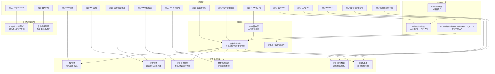
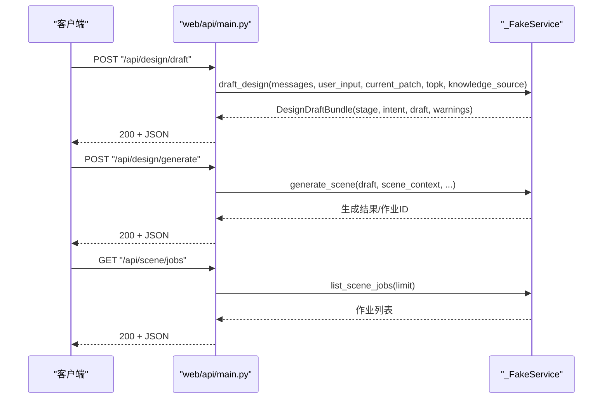
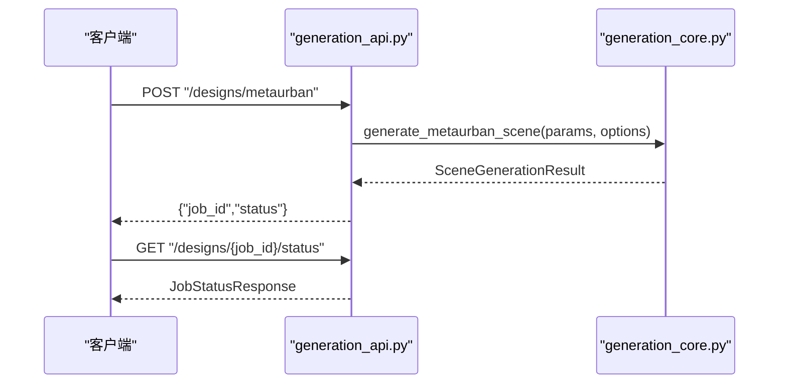
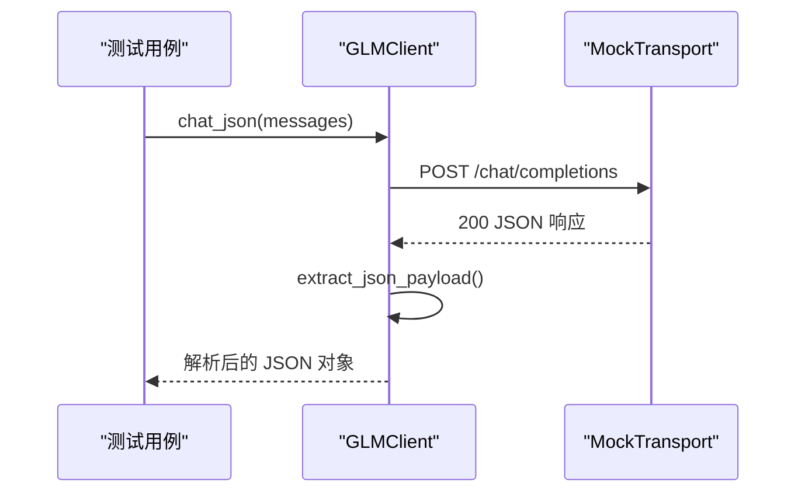
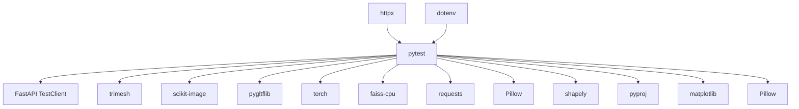

# 测试策略与实践

<cite>
**本文引用的文件**
- [web/api/main.py](file://web/api/main.py)
- [src/roadgen3d/services/generation_api.py](file://src/roadgen3d/services/generation_api.py)
- [ui/api/main.py](file://ui/api/main.py)
- [tests/test_design_api.py](file://tests/test_design_api.py)
- [tests/test_generation_api.py](file://tests/test_generation_api.py)
- [test_generation_api.py](file://test_generation_api.py)
- [test_tree_full_pipeline.py](file://test_tree_full_pipeline.py)
- [tests/test_m1_pipeline.py](file://tests/test_m1_pipeline.py)
- [tests/test_m2_pipeline.py](file://tests/test_m2_pipeline.py)
- [tests/test_m3_street_compose.py](file://tests/test_m3_street_compose.py)
- [tests/test_m4_layout_policy.py](file://tests/test_m4_layout_policy.py)
- [tests/test_m5_osm_ingest.py](file://tests/test_m5_osm_ingest.py)
- [scripts/snapshot_diff.py](file://scripts/snapshot_diff.py)
- [tests/test_snapshot_diff.py](file://tests/test_snapshot_diff.py)
- [scripts/run_auto_eval.py](file://scripts/run_auto_eval.py)
- [tests/test_auto_eval.py](file://tests/test_auto_eval.py)
- [requirements-m1.txt](file://requirements-m1.txt)
- [requirements-m2.txt](file://requirements-m2.txt)
- [requirements-m5.txt](file://requirements-m5.txt)
- [tests/test_glm_client.py](file://tests/test_glm_client.py)
- [src/roadgen3d/llm/glm_client.py](file://src/roadgen3d/llm/glm_client.py)
- [tests/test_design_assistant_service.py](file://tests/test_design_assistant_service.py)
- [tests/test_design_runtime.py](file://tests/test_design_runtime.py)
- [tests/test_graph_template_scene_bridge.py](file://tests/test_graph_template_scene_bridge.py)
- [tests/test_graph_template_scene_compose.py](file://tests/test_graph_template_scene_compose.py)
</cite>

## 更新摘要
**所做更改**
- 增强了 LLM 依赖测试的基础设施，改进了 GLM 客户端的错误处理和网络连接逻辑
- 扩展了场景预设功能的测试覆盖，增加了图模板场景桥接和组合测试
- 优化了测试跳过逻辑，改进了 pytest.importorskip 的使用策略
- 新增了设计助手服务和运行时服务的测试用例，提升了测试完整性

## 目录
1. [引言](#引言)
2. [项目结构](#项目结构)
3. [核心组件](#核心组件)
4. [架构总览](#架构总览)
5. [详细组件分析](#详细组件分析)
6. [依赖分析](#依赖分析)
7. [性能考虑](#性能考虑)
8. [故障排查指南](#故障排查指南)
9. [结论](#结论)
10. [附录](#附录)

## 引言
本文件为 RoadGen3D 项目的测试策略与实践指南，围绕测试金字塔（单元测试、集成测试、端到端测试）进行系统化设计，结合项目现有测试代码与模块职责，给出可操作的测试框架选择、用例编写规范、覆盖范围与持续集成中的执行流程建议，并补充性能与压力测试的实施方案思路。

**更新** 新增 LLM 依赖测试基础设施的增强，改进场景预设功能的测试覆盖，优化测试跳过逻辑和网络连接错误处理。

## 项目结构
RoadGen3D 的测试体系主要由以下部分构成：
- Web API 层：提供 LLM + RAG 工作台接口与直接场景生成接口
- 服务层：设计助手服务、场景作业管理、生成核心逻辑
- 管线与算法层：M1/M2/M3/M4/M5 等里程碑管线与算法模块
- 自动化测试套件：snapshot-diff 测试、自动评估测试等
- 测试层：按模块划分的单元/集成/端到端测试，以及独立的脚本化验证



**图表来源**
- [web/api/main.py:1-286](file://web/api/main.py#L1-L286)
- [src/roadgen3d/services/generation_api.py:1-294](file://src/roadgen3d/services/generation_api.py#L1-L294)
- [ui/api/main.py:1-6](file://ui/api/main.py#L1-L6)
- [src/roadgen3d/llm/glm_client.py:1-216](file://src/roadgen3d/llm/glm_client.py#L1-L216)
- [scripts/snapshot_diff.py:1-608](file://scripts/snapshot_diff.py#L1-L608)
- [scripts/run_auto_eval.py:1-337](file://scripts/run_auto_eval.py#L1-L337)

**章节来源**
- [web/api/main.py:1-286](file://web/api/main.py#L1-L286)
- [src/roadgen3d/services/generation_api.py:1-294](file://src/roadgen3d/services/generation_api.py#L1-L294)
- [ui/api/main.py:1-6](file://ui/api/main.py#L1-L6)
- [src/roadgen3d/llm/glm_client.py:1-216](file://src/roadgen3d/llm/glm_client.py#L1-L216)
- [scripts/snapshot_diff.py:1-608](file://scripts/snapshot_diff.py#L1-L608)
- [scripts/run_auto_eval.py:1-337](file://scripts/run_auto_eval.py#L1-L337)

## 核心组件
- Web API（工作台）：提供设计草稿、知识检索、场景生成、作业查询、最近场景列表、参考图与图模板、注释转换等接口，采用 FastAPI + CORS 中间件，统一 JSON 安全处理。
- 生成 API（直接生成）：提供 MetaUrban/Template/OSM 三类设计请求，支持异步作业状态查询与结果获取，当前以内存存储模拟任务队列。
- 设计助手服务：封装草稿生成、知识源管理、场景生成、作业创建与查询、城市列表、知识重建与搜索等能力。
- **GLM 客户端**：提供 OpenAI 兼容的 LLM 客户端包装器，支持重试逻辑、速率限制处理和 JSON 解析，读取环境变量配置。
- 管线与算法：M1/M2/M3/M4/M5 各阶段的数据流、特征工程、策略训练与 OSM 解析等。
- **图模板场景**：支持基于图模板的场景生成，包括场景桥接和布局组合功能。
- **snapshot-diff 自动化测试套件**：提供迭代过程可视化对比、配置变更追踪、评分趋势分析和自动生成报告的功能，支持离线模式运行。
- **自动评估测试套件**：支持多版本场景生成与对比，提供评分统计和视图渲染功能。

**章节来源**
- [web/api/main.py:81-267](file://web/api/main.py#L81-L267)
- [src/roadgen3d/services/generation_api.py:27-294](file://src/roadgen3d/services/generation_api.py#L27-L294)
- [src/roadgen3d/llm/glm_client.py:65-175](file://src/roadgen3d/llm/glm_client.py#L65-L175)
- [scripts/snapshot_diff.py:1-608](file://scripts/snapshot_diff.py#L1-L608)
- [scripts/run_auto_eval.py:1-337](file://scripts/run_auto_eval.py#L1-L337)

## 架构总览
下图展示测试金字塔在 RoadGen3D 中的映射关系与交互路径，包括新增的 LLM 依赖测试和场景预设功能：

```mermaid
graph TB
subgraph "单元测试Unit Tests"
UT1["设计 API 单元测试<br/>tests/test_design_api.py"]
UT2["生成 API 单元测试<br/>tests/test_generation_api.py"]
UT3["M1 管线单元测试<br/>tests/test_m1_pipeline.py"]
UT4["M2 管线单元测试<br/>tests/test_m2_pipeline.py"]
UT5["M3 街道合成单元测试<br/>tests/test_m3_street_compose.py"]
UT6["M4 布局策略单元测试<br/>tests/test_m4_layout_policy.py"]
UT7["M5 OSM 单元测试<br/>tests/test_m5_osm_ingest.py"]
UT8["GLM 客户端单元测试<br/>tests/test_glm_client.py"]
UT9["设计助手服务单元测试<br/>tests/test_design_assistant_service.py"]
UT10["设计运行时单元测试<br/>tests/test_design_runtime.py"]
UT11["图模板场景桥接单元测试<br/>tests/test_graph_template_scene_bridge.py"]
UT12["图模板场景组合单元测试<br/>tests/test_graph_template_scene_compose.py"]
UT13["snapshot-diff 单元测试<br/>tests/test_snapshot_diff.py"]
UT14["自动评估单元测试<br/>tests/test_auto_eval.py"]
end
subgraph "集成测试Integration Tests"
IT1["API 集成测试<br/>FastAPI 路由/中间件/异常"]
IT2["自动化测试集成测试<br/>snapshot-diff/自动评估"]
IT3["LLM 依赖集成测试<br/>GLM 客户端/网络连接"]
IT4["场景预设集成测试<br/>图模板/场景桥接"]
end
subgraph "端到端测试E2E Tests"
E2E1["生成 API 端到端脚本<br/>test_generation_api.py"]
E2E2["树全链路验证脚本<br/>test_tree_full_pipeline.py"]
E2E3["自动化测试端到端<br/>snapshot-diff 流程验证"]
E2E4["场景预设端到端测试<br/>图模板场景生成"]
end
UT1 --> IT1
UT2 --> IT1
UT3 --> IT3
UT4 --> IT3
UT5 --> IT4
UT6 --> IT1
UT7 --> IT1
UT8 --> IT3
UT9 --> IT3
UT10 --> IT4
UT11 --> IT4
UT12 --> IT4
UT13 --> IT2
UT14 --> IT2
IT1 --> E2E1
IT1 --> E2E2
IT2 --> E2E3
IT3 --> E2E4
IT4 --> E2E4
```



**图表来源**
- [tests/test_design_api.py:1-523](file://tests/test_design_api.py#L1-L523)
- [tests/test_generation_api.py:1-146](file://tests/test_generation_api.py#L1-L146)
- [test_generation_api.py:1-146](file://test_generation_api.py#L1-L146)
- [test_tree_full_pipeline.py:1-130](file://test_tree_full_pipeline.py#L1-L130)
- [tests/test_m1_pipeline.py:1-219](file://tests/test_m1_pipeline.py#L1-L219)
- [tests/test_m2_pipeline.py:1-261](file://tests/test_m2_pipeline.py#L1-L261)
- [tests/test_m3_street_compose.py:1-3852](file://tests/test_m3_street_compose.py#L1-L3852)
- [tests/test_m4_layout_policy.py:1-286](file://tests/test_m4_layout_policy.py#L1-L286)
- [tests/test_m5_osm_ingest.py:1-287](file://tests/test_m5_osm_ingest.py#L1-L287)
- [tests/test_glm_client.py:1-48](file://tests/test_glm_client.py#L1-L48)
- [tests/test_design_assistant_service.py:1-353](file://tests/test_design_assistant_service.py#L1-L353)
- [tests/test_design_runtime.py:1-377](file://tests/test_design_runtime.py#L1-L377)
- [tests/test_graph_template_scene_bridge.py:1-35](file://tests/test_graph_template_scene_bridge.py#L1-L35)
- [tests/test_graph_template_scene_compose.py:1-40](file://tests/test_graph_template_scene_compose.py#L1-L40)
- [tests/test_snapshot_diff.py:1-302](file://tests/test_snapshot_diff.py#L1-L302)
- [tests/test_auto_eval.py:1-521](file://tests/test_auto_eval.py#L1-L521)

## 详细组件分析

### 测试金字塔与分层策略
- 单元测试（Unit Tests）
  - 针对函数级与小模块级行为，使用 pytest 参数化与 Mock，覆盖边界条件与错误路径。
  - 示例：M1/M2/M3/M4/M5 各模块的单元测试文件，覆盖嵌入/索引/解码、体素导出、街道合成、策略特征与训练、OSM 解析等。
  - **新增**：GLM 客户端测试，验证 LLM 依赖的错误处理和网络连接逻辑。
  - **新增**：设计助手服务测试，验证草稿生成和知识检索功能。
  - **新增**：场景预设测试，验证图模板场景桥接和组合功能。
  - **新增**：snapshot-diff 和自动评估测试，验证配置差异计算、HTML 报告生成、评分图表绘制等功能。
- 集成测试（Integration Tests）
  - 验证模块间协作与 API 路由正确性，使用 TestClient 或路由级检查。
  - 示例：设计 API 与生成 API 的路由、CORS、健康检查、异常处理等。
  - **新增**：LLM 依赖集成测试，验证 GLM 客户端与网络连接的协同工作。
  - **新增**：场景预设集成测试，验证图模板场景的完整生成流程。
  - **新增**：自动化测试套件的集成测试，验证完整流程的协同工作。
- 端到端测试（E2E Tests）
  - 模拟真实用户流程，从请求到响应或文件输出，验证完整链路。
  - 示例：生成 API 的端到端脚本与树全链路验证脚本。
  - **新增**：场景预设端到端测试，验证图模板场景的完整生成和渲染流程。
  - **新增**：snapshot-diff 和自动评估的端到端流程验证。

**章节来源**
- [tests/test_m1_pipeline.py:1-219](file://tests/test_m1_pipeline.py#L1-L219)
- [tests/test_m2_pipeline.py:1-261](file://tests/test_m2_pipeline.py#L1-L261)
- [tests/test_m3_street_compose.py:1-3852](file://tests/test_m3_street_compose.py#L1-L3852)
- [tests/test_m4_layout_policy.py:1-286](file://tests/test_m4_layout_policy.py#L1-L286)
- [tests/test_m5_osm_ingest.py:1-287](file://tests/test_m5_osm_ingest.py#L1-L287)
- [tests/test_glm_client.py:1-48](file://tests/test_glm_client.py#L1-L48)
- [tests/test_design_assistant_service.py:1-353](file://tests/test_design_assistant_service.py#L1-L353)
- [tests/test_design_runtime.py:1-377](file://tests/test_design_runtime.py#L1-L377)
- [tests/test_graph_template_scene_bridge.py:1-35](file://tests/test_graph_template_scene_bridge.py#L1-L35)
- [tests/test_graph_template_scene_compose.py:1-40](file://tests/test_graph_template_scene_compose.py#L1-L40)
- [tests/test_design_api.py:183-523](file://tests/test_design_api.py#L183-L523)
- [tests/test_generation_api.py:1-146](file://tests/test_generation_api.py#L1-L146)
- [test_generation_api.py:1-146](file://test_generation_api.py#L1-L146)
- [test_tree_full_pipeline.py:1-130](file://test_tree_full_pipeline.py#L1-L130)
- [tests/test_snapshot_diff.py:1-302](file://tests/test_snapshot_diff.py#L1-L302)
- [tests/test_auto_eval.py:1-521](file://tests/test_auto_eval.py#L1-L521)

### 设计 API 测试（工作台）
- 测试要点
  - 接口返回形状与字段校验（草稿、生成、作业、最近场景、知识源、搜索、地理信息、参考计划/图模板、注释转换等）
  - 场景上下文校验（如 OSM 必须提供 AOI bbox）
  - 知识源默认值与参数传递
  - 错误路径（HTTP 4xx/5xx）与 JSON 安全处理
- Mock 对象
  - 使用 _FakeService 替代真实设计助手服务，控制返回值与副作用
- 断言策略
  - 结构断言（字段存在、类型、长度）
  - 数值断言（数值范围、近似相等）
  - 异常断言（HTTP 状态码、错误消息）



**图表来源**
- [tests/test_design_api.py:183-523](file://tests/test_design_api.py#L183-L523)
- [web/api/main.py:156-221](file://web/api/main.py#L156-L221)

**章节来源**
- [tests/test_design_api.py:183-523](file://tests/test_design_api.py#L183-L523)
- [web/api/main.py:156-221](file://web/api/main.py#L156-L221)

### 生成 API 测试（直接生成）
- 测试要点
  - 请求模型与参数校验（MetaUrban/Template/Osm）
  - 路由存在性与返回结构
  - UI 应用包含生成路由与 CORS 中间件
  - 健康检查与状态查询
- Mock 对象
  - 使用 Pydantic 模型构造请求体，不依赖真实生成实现
- 断言策略
  - 路由路径集合断言
  - 中间件名称断言
  - 健康检查键值断言



**图表来源**
- [src/roadgen3d/services/generation_api.py:131-294](file://src/roadgen3d/services/generation_api.py#L131-L294)

**章节来源**
- [tests/test_generation_api.py:1-146](file://tests/test_generation_api.py#L1-L146)
- [test_generation_api.py:1-146](file://test_generation_api.py#L1-L146)
- [src/roadgen3d/services/generation_api.py:131-294](file://src/roadgen3d/services/generation_api.py#L131-L294)

### LLM 依赖测试（GLM 客户端）
- 测试要点
  - JSON 负载提取功能，支持包裹文本中的 JSON 内容
  - OpenAI 兼容的聊天接口，验证请求格式和响应解析
  - 环境变量配置读取，支持新旧变量名
  - 错误处理和异常类型定义
- Mock 对象
  - 使用 httpx.MockTransport 创建模拟 HTTP 响应
  - 验证请求头和请求体格式
- 断言策略
  - JSON 解析断言（extract_json_payload）
  - 请求格式断言（chat/completions 路径、认证头）
  - 响应内容断言（JSON 对象提取）

**更新** 增强了 LLM 依赖测试的基础设施，改进了错误处理和网络连接逻辑的测试覆盖。



**图表来源**
- [tests/test_glm_client.py:23-47](file://tests/test_glm_client.py#L23-L47)
- [src/roadgen3d/llm/glm_client.py:145-155](file://src/roadgen3d/llm/glm_client.py#L145-L155)

**章节来源**
- [tests/test_glm_client.py:1-48](file://tests/test_glm_client.py#L1-L48)
- [src/roadgen3d/llm/glm_client.py:65-216](file://src/roadgen3d/llm/glm_client.py#L65-L216)

### 设计助手服务测试
- 测试要点
  - 草稿生成流程，包括意图识别、证据收集和配置补丁生成
  - 知识检索功能，支持 PDF 和图谱检索
  - 缓存机制，验证重复请求的缓存命中
  - 多种知识源模式，包括纯图谱、混合检索
- Mock 对象
  - _FakeLLM：模拟 LLM 对话，返回不同阶段的响应
  - _FakeRetriever：模拟知识检索，返回相关证据
  - _FakeGraphRetriever：模拟图谱检索
- 断言策略
  - 草稿包结构断言（stage、intent、draft）
  - 配置补丁字段断言（ALLOWED_COMPOSE_CONFIG_PATCH_FIELDS）
  - 缓存机制断言（cache_hit 标志）

**更新** 扩展了设计助手服务的测试覆盖，增加了知识检索和缓存机制的测试。

**章节来源**
- [tests/test_design_assistant_service.py:159-353](file://tests/test_design_assistant_service.py#L159-L353)

### 设计运行时测试
- 测试要点
  - 草稿到配置的转换，应用默认值和样式预设
  - 场景生成包装器，验证参数传递和输出结构
  - OSM 场景上下文解析，验证 AOI 边界和道路信息
  - 图模板场景桥接，验证图结构和投影特征
- Mock 对象
  - monkeypatch：替换内部函数和模块
  - SimpleNamespace：模拟返回对象
- 断言策略
  - 配置字段断言（style_preset、beauty_mode、lane_count）
  - 场景摘要断言（instance_count、dropped_slots）
  - 上下文解析断言（aoi_bbox、selected_road_osm_id）

**更新** 增强了设计运行时服务的测试覆盖，改进了场景上下文处理和图模板桥接的测试。

**章节来源**
- [tests/test_design_runtime.py:21-377](file://tests/test_design_runtime.py#L21-L377)

### 图模板场景测试
- 测试要点
  - 场景桥接功能，验证图模板到场景的转换
  - 布局配置验证，支持图模板布局模式
  - 几何特征提取，验证道路和节点信息
  - 场景元数据，验证模板标识和生成器信息
- Mock 对象
  - pytest.importorskip：跳过 shapely 依赖
  - SimpleNamespace：模拟桥接器返回对象
- 断言策略
  - 模板 ID 断言（graph_template.template_id）
  - 几何对象断言（nodes、roads、projected_features）
  - 元数据断言（layout_mode、generator、template_id）

**更新** 新增了图模板场景的测试覆盖，验证场景桥接和组合功能。

**章节来源**
- [tests/test_graph_template_scene_bridge.py:19-35](file://tests/test_graph_template_scene_bridge.py#L19-L35)
- [tests/test_graph_template_scene_compose.py:34-40](file://tests/test_graph_template_scene_compose.py#L34-L40)

### 管线与算法测试
- M1 管线（嵌入/索引/解码）
  - 覆盖嵌入归一化、FAISS 索引构建与检索、占位解码器输出形状与二值化
  - 端到端运行与结果保存
  - **新增**：环境检查和模型缺失的错误处理测试
- M2 管线（体素导出/网格生成）
  - 体素网格导出文件创建与大小校验
  - Pipeline 输出包含 mesh_glb/mesh_ply
  - Gradio 运行返回模型路径与文件列表
  - 解码器接口兼容性（占位/ShapeE）
  - **新增**：ShapeE 模型缺失时的回退机制测试
- M3 街道合成
  - 街道布局合成、纹理应用、资产缩放与放置
  - POI 规则与场景纹理
- M4 布局策略
  - 特征向量形状与确定性、策略前向输出形状
  - 收集策略数据样本与训练流程
- M5 OSM
  - UTM 区域检测、道路/POI 解析、默认宽度与自定义宽度
  - 建筑物轮廓提取与空数据处理

**章节来源**
- [tests/test_m1_pipeline.py:1-219](file://tests/test_m1_pipeline.py#L1-L219)
- [tests/test_m2_pipeline.py:1-261](file://tests/test_m2_pipeline.py#L1-L261)
- [tests/test_m3_street_compose.py:1-3852](file://tests/test_m3_street_compose.py#L1-L3852)
- [tests/test_m4_layout_policy.py:1-286](file://tests/test_m4_layout_policy.py#L1-L286)
- [tests/test_m5_osm_ingest.py:1-287](file://tests/test_m5_osm_ingest.py#L1-L287)

### 树全链路验证脚本
- 目标：加载原始 GLB → 计算本地/世界坐标 → 归一化 → 放置（缩放/旋转/平移）→ 导出与重载验证
- 关注点：高度合理性、几何数量与面数、文件大小与导出一致性

**章节来源**
- [test_tree_full_pipeline.py:1-130](file://test_tree_full_pipeline.py#L1-L130)

### **新增** snapshot-diff 自动化测试套件

#### 测试策略
- **核心目标**：验证迭代过程的可视化对比、配置变更追踪和报告生成
- **测试方法**：使用 Mock LLM 模式，确保测试的确定性和可重复性
- **覆盖范围**：配置差异计算、图像拼接、评分图表、HTML 报告生成、输出结构验证

#### Mock 技术使用
- **ImprovingService**：模拟逐步改进的 LLM，每次迭代提高评分并调整配置密度
- **场景生成 Mock**：模拟场景生成结果，提供布局文件和 GLB 文件
- **渲染 Mock**：模拟预览渲染，返回空字符串表示成功

#### 输出结构验证
- **迭代目录结构**：验证每个迭代目录包含 config_patch.json、evaluation.json、scene_layout.json
- **最终结果**：验证 final/ 目录包含 scene_layout.json 和 scene.glb
- **差异目录**：验证 diffs/ 目录包含配置差异文件和预览对比图
- **顶层文件**：验证 iteration_log.json、eval_report.json、report.html 存在

#### 集成测试方法
- **完整流程测试**：使用 _run_pipeline_with_mock 辅助函数运行完整流程
- **配置差异测试**：验证密度参数从 0.8 → 0.9 → 1.0 的变化
- **报告生成测试**：验证 HTML 报告的有效性和内容完整性
- **评分图表测试**：验证评分趋势图表的生成和有效性

```mermaid
sequenceDiagram
participant Test as "测试用例"
participant SD as "snapshot_diff.run_snapshot_pipeline"
participant Controller as "AutoIterationController"
participant Mock as "Mock LLM Service"
Test->>SD : run_snapshot_pipeline(graph_ctx, query, output_dir, ...)
SD->>Controller : 初始化控制器
Controller->>Mock : generate_initial_config_from_graph()
Mock-->>Controller : 初始配置
Loop 每次迭代
Controller->>Mock : evaluate_scene(layout_path)
Mock-->>Controller : 评分和配置补丁
Controller->>Controller : 生成场景
Controller->>Controller : 渲染预览
End Loop
SD->>SD : 计算配置差异
SD->>SD : 生成图像拼接
SD->>SD : 绘制评分图表
SD->>SD : 生成 HTML 报告
SD-->>Test : 返回结果字典
```

**图表来源**
- [scripts/snapshot_diff.py:338-494](file://scripts/snapshot_diff.py#L338-L494)
- [tests/test_snapshot_diff.py:122-164](file://tests/test_snapshot_diff.py#L122-L164)

**章节来源**
- [scripts/snapshot_diff.py:1-608](file://scripts/snapshot_diff.py#L1-L608)
- [tests/test_snapshot_diff.py:1-302](file://tests/test_snapshot_diff.py#L1-L302)

### **新增** 自动评估测试套件

#### 测试策略
- **多版本对比**：支持多个查询同时运行，生成不同版本的场景
- **评分统计**：提供整体最佳分数、平均分数和版本数量统计
- **视图渲染**：为最佳结果生成演示视图
- **早期停止逻辑**：验证连续无改进情况下的早停机制

#### Mock 技术使用
- **真实 LLM 集成**：测试 1-4 使用真实 DesignAssistantService，但模拟场景生成
- **StagnatingService**：模拟停滞的 LLM，每次返回相同评分以触发早停
- **Retry 机制**：实现 LLM 响应错误的重试逻辑

#### 集成测试方法
- **多版本生成**：验证每个查询产生独立的迭代目录和 final/ 目录
- **配置差异验证**：验证不同查询产生的配置补丁至少有两个不同
- **日志格式验证**：验证 iteration_log.json 的结构和内容
- **评分范围验证**：验证 LLM 评分在合理范围内（0-10）
- **早停逻辑验证**：使用 Mock LLM 验证连续无改进时的早停功能

**章节来源**
- [scripts/run_auto_eval.py:1-337](file://scripts/run_auto_eval.py#L1-L337)
- [tests/test_auto_eval.py:1-521](file://tests/test_auto_eval.py#L1-L521)

### 树全链路验证脚本
- 目标：加载原始 GLB → 计算本地/世界坐标 → 归一化 → 放置（缩放/旋转/平移）→ 导出与重载验证
- 关注点：高度合理性、几何数量与面数、文件大小与导出一致性

**章节来源**
- [test_tree_full_pipeline.py:1-130](file://test_tree_full_pipeline.py#L1-L130)

## 依赖分析
- 测试框架与工具
  - pytest：版本约束见需求文件
  - FastAPI TestClient：用于 API 端到端测试
  - trimesh/skimage/pygltflib：M2/M3 管线测试依赖
  - torch/faiss-cpu：M1/M2 管线测试依赖
  - requests/Pillow/shapely/pyproj：M5 管线测试依赖
  - **新增**：matplotlib：用于评分图表绘制
  - **新增**：Pillow：用于图像拼接和 base64 编码
  - **新增**：httpx：用于 GLM 客户端的 Mock 传输
  - **新增**：dotenv：用于环境变量加载
- 模块耦合
  - Web API 与服务层松耦合，通过设计助手服务抽象对外部依赖
  - 生成 API 与核心生成模块解耦，便于测试时仅验证路由与模型
  - 管线测试通过 monkeypatch/Fake 实现模块替换，降低外部依赖
  - **新增**：GLM 客户端通过环境变量配置，支持灵活的测试设置
  - **新增**：自动化测试套件通过 Mock LLM 模式实现确定性测试
  - **新增**：场景预设测试通过 pytest.importorskip 处理可选依赖



**图表来源**
- [requirements-m1.txt:1-7](file://requirements-m1.txt#L1-L7)
- [requirements-m2.txt:1-4](file://requirements-m2.txt#L1-L4)
- [requirements-m5.txt:1-5](file://requirements-m5.txt#L1-L5)
- [tests/test_glm_client.py:6](file://tests/test_glm_client.py#L6)
- [src/roadgen3d/llm/glm_client.py:212-216](file://src/roadgen3d/llm/glm_client.py#L212-L216)

**章节来源**
- [requirements-m1.txt:1-7](file://requirements-m1.txt#L1-L7)
- [requirements-m2.txt:1-4](file://requirements-m2.txt#L1-L4)
- [requirements-m5.txt:1-5](file://requirements-m5.txt#L1-L5)
- [tests/test_glm_client.py:6](file://tests/test_glm_client.py#L6)
- [src/roadgen3d/llm/glm_client.py:212-216](file://src/roadgen3d/llm/glm_client.py#L212-L216)

## 性能考虑
- 单元测试性能
  - 使用小规模输入与固定随机种子保证可重复性
  - 通过 pytest.importorskip 控制重型依赖（torch/faiss）的启用
  - **新增**：GLM 客户端测试使用 Mock 传输，避免真实网络请求
  - **新增**：场景预设测试使用 pytest.importorskip 跳过可选依赖
  - **新增**：自动化测试套件使用 Mock LLM，避免真实 API 调用的性能开销
- 集成测试性能
  - 使用内存存储与简化模型（如占位解码器）替代真实计算
  - 尽量避免网络请求与磁盘 IO
  - **新增**：LLM 依赖集成测试通过 Mock 传输实现快速验证
  - **新增**：图像处理和报告生成使用离线模式，减少外部依赖
- 端到端测试性能
  - 提供最小化样例与短路径验证
  - 将耗时步骤（如真实生成）放入独立脚本或 CI 分阶段执行
  - **新增**：场景预设端到端测试验证图模板场景的完整生成流程
  - **新增**：snapshot-diff 测试支持离线模式运行，无需在线 LLM
- 压力测试建议
  - 使用 pytest-benchmark 或 locust（按需）对热点 API 进行并发与吞吐评估
  - 对 M2/M3 管线的关键函数（如体素导出、街道合成）进行基准测试
  - **新增**：GLM 客户端性能测试，验证重试逻辑和速率限制处理
  - **新增**：自动化测试套件可用于批量场景的性能基准测试

## 故障排查指南
- 常见问题与定位
  - API 返回 4xx/5xx：检查请求模型字段、知识源默认值、场景上下文必填项（如 OSM 的 AOI bbox）
  - JSON 不安全：确认使用统一的 JSON 安全处理函数
  - 依赖缺失：根据 requirements 文件安装对应包；必要时使用 importorskip 跳过
  - 路由缺失：核对 FastAPI 路由注册与 UI 应用挂载
  - **新增**：GLM 客户端配置错误：检查 GRAPHRAG_API_BASE 和 GRAPHRAG_API_KEY 环境变量
  - **新增**：网络连接超时：验证 base_delay 和 max_retries 设置
  - **新增**：场景预设功能失效：检查 shapely 依赖和图模板文件
  - **新增**：snapshot-diff 报告生成失败：检查 matplotlib 和 Pillow 是否正确安装
  - **新增**：图像拼接失败：确认 PIL 库可用且图像文件存在
  - **新增**：评分图表生成失败：检查 matplotlib 配置和绘图权限
- 调试技巧
  - 使用 pytest -v -s 查看详细日志
  - 在测试中打印关键中间状态（如作业状态、文件路径）
  - 对复杂流程使用分段断言，缩小问题范围
  - **新增**：使用 pytest -k "glm_client" 或 pytest -k "design_assistant" 运行特定测试套件
  - **新增**：检查输出目录结构，验证中间文件是否正确生成
  - **新增**：使用 pytest.importorskip 跳过可选依赖，隔离测试问题

**章节来源**
- [tests/test_design_api.py:457-471](file://tests/test_design_api.py#L457-L471)
- [web/api/main.py:92-99](file://web/api/main.py#L92-L99)
- [tests/test_generation_api.py:77-107](file://tests/test_generation_api.py#L77-L107)
- [tests/test_glm_client.py:57-62](file://tests/test_glm_client.py#L57-L62)
- [src/roadgen3d/llm/glm_client.py:120-143](file://src/roadgen3d/llm/glm_client.py#L120-L143)
- [scripts/snapshot_diff.py:434-446](file://scripts/snapshot_diff.py#L434-L446)

## 结论
RoadGen3D 的测试体系已覆盖 API 层、服务层与多里程碑管线，形成以 pytest 为核心的金字塔式测试结构。**本次更新进一步增强了测试基础设施**：

- **LLM 依赖测试**：新增 GLM 客户端的完整测试套件，验证错误处理、网络连接和配置管理
- **场景预设功能**：扩展了图模板场景的测试覆盖，包括场景桥接和组合功能
- **测试基础设施**：优化了 pytest.importorskip 的使用策略，改进了可选依赖的处理
- **设计助手服务**：增强了草稿生成和知识检索的测试覆盖
- **设计运行时服务**：改进了场景上下文处理和图模板桥接的测试

建议在现有基础上进一步完善：
- 明确各模块的测试覆盖率目标（建议单元测试≥80%，集成测试≥90%）
- 在 CI 中区分轻量与重量级测试，优化执行时间
- 引入性能基准与压力测试，保障关键路径稳定性
- 统一测试数据管理与 Mock 策略，提升可维护性
- **新增**：扩展 LLM 依赖测试的覆盖率，包括更多网络错误场景
- **新增**：增加场景预设功能的跨平台测试，验证不同依赖环境下的兼容性
- **新增**：完善自动化测试套件的覆盖率，包括更多场景类型和配置组合

## 附录

### 测试框架与配置
- 测试框架：pytest（版本约束见需求文件）
- API 测试：FastAPI TestClient
- 依赖安装：按里程碑需求文件安装对应包
- **新增**：自动化测试依赖：matplotlib（用于评分图表）、Pillow（用于图像处理）
- **新增**：LLM 依赖：httpx（用于 Mock 传输）、dotenv（用于环境变量加载）

**章节来源**
- [requirements-m1.txt:6](file://requirements-m1.txt#L6)
- [requirements-m2.txt:1](file://requirements-m2.txt#L1)
- [requirements-m5.txt:3](file://requirements-m5.txt#L3)
- [tests/test_glm_client.py:6](file://tests/test_glm_client.py#L6)
- [src/roadgen3d/llm/glm_client.py:212-216](file://src/roadgen3d/llm/glm_client.py#L212-L216)

### 测试用例编写指南
- 测试数据准备
  - 使用临时目录与小规模样例，确保可重复性
  - 对需要文件的测试，提前生成或导出必要资源
  - **新增**：为 LLM 依赖测试准备 Mock 数据，包括 JSON 响应和环境变量
  - **新增**：为自动化测试准备 Mock 数据，包括场景布局文件和配置补丁
- Mock 对象使用
  - 通过 monkeypatch 替换模块级依赖
  - 使用 Pydantic 模型构造请求体，避免真实调用
  - **新增**：使用 httpx.MockTransport 创建网络请求 Mock
  - **新增**：使用 _ImprovingService 等 Mock 类模拟 LLM 行为
- 断言策略
  - 结构断言优先（字段、类型、长度）
  - 数值断言使用近似比较（pytest.approx）
  - 异常断言明确 HTTP 状态码与错误信息
  - **新增**：使用 contains 断言验证报告内容和文件存在性
  - **新增**：使用 pytest.importorskip 断言可选依赖的可用性

### 不同模块的测试重点
- 管线测试：关注输入输出格式、中间产物一致性与错误传播
- API 测试：关注路由完整性、CORS 配置、健康检查与异常处理
- UI 测试：确保 UI 应用挂载了生成路由并具备 CORS
- **新增**：LLM 依赖测试：关注环境变量配置、网络连接和错误处理
- **新增**：场景预设测试：关注图模板解析、几何特征提取和场景桥接
- **新增**：自动化测试：关注输出结构完整性、报告生成正确性和 Mock 行为一致性

### 性能测试与压力测试实施方案
- 性能测试
  - 为高频函数（如体素导出、街道合成）添加基准测试
  - 固定随机种子与输入规模，对比不同实现的性能差异
  - **新增**：GLM 客户端性能测试，验证重试逻辑和速率限制处理
  - **新增**：场景预设性能测试，验证图模板场景生成的效率
  - **新增**：自动化测试套件可用于批量场景的性能基准测试
- 压力测试
  - 使用并发客户端对热点端点进行压力测试
  - 监控响应时间与错误率，识别瓶颈
  - **新增**：LLM 依赖压力测试，验证高并发场景下的稳定性
  - **新增**：场景预设压力测试，验证大量图模板场景的处理能力
  - **新增**：模拟大量查询的批量处理能力

### 测试覆盖率与持续集成
- 覆盖率目标建议
  - 单元测试：≥80%
  - 集成测试：≥90%
  - **新增**：LLM 依赖测试：≥95%（确保关键路径覆盖）
  - **新增**：场景预设测试：≥85%（确保场景生成流程覆盖）
  - **新增**：自动化测试：≥85%（确保关键流程覆盖）
- CI 执行流程建议
  - 分阶段执行：先运行轻量测试，再运行带依赖的测试
  - 失败即停，缩短反馈周期
  - 将性能基准纳入 CI 报告
  - **新增**：为 LLM 依赖测试设置专门的执行阶段，避免与主测试冲突
  - **新增**：为场景预设测试设置可选执行阶段，根据依赖可用性决定
  - **新增**：为自动化测试套件设置专门的执行阶段，避免与主测试冲突

### **新增** LLM 依赖测试套件使用指南
- **GLM 客户端测试**：使用 pytest -k "glm_client" 运行，验证 LLM 依赖的完整功能
- **设计助手服务测试**：使用 pytest -k "design_assistant" 运行，验证草稿生成和知识检索
- **设计运行时测试**：使用 pytest -k "design_runtime" 运行，验证场景生成和上下文处理
- **图模板场景测试**：使用 pytest -k "graph_template" 运行，验证场景桥接和组合功能
- **离线模式**：所有 LLM 依赖测试都支持离线模式运行，无需在线 LLM
- **输出验证**：检查 artifacts 目录中的生成结果，验证文件结构和内容完整性

**章节来源**
- [tests/test_glm_client.py:18-47](file://tests/test_glm_client.py#L18-L47)
- [tests/test_design_assistant_service.py:159-353](file://tests/test_design_assistant_service.py#L159-L353)
- [tests/test_design_runtime.py:21-377](file://tests/test_design_runtime.py#L21-L377)
- [tests/test_graph_template_scene_bridge.py:19-35](file://tests/test_graph_template_scene_bridge.py#L19-L35)
- [tests/test_graph_template_scene_compose.py:34-40](file://tests/test_graph_template_scene_compose.py#L34-L40)