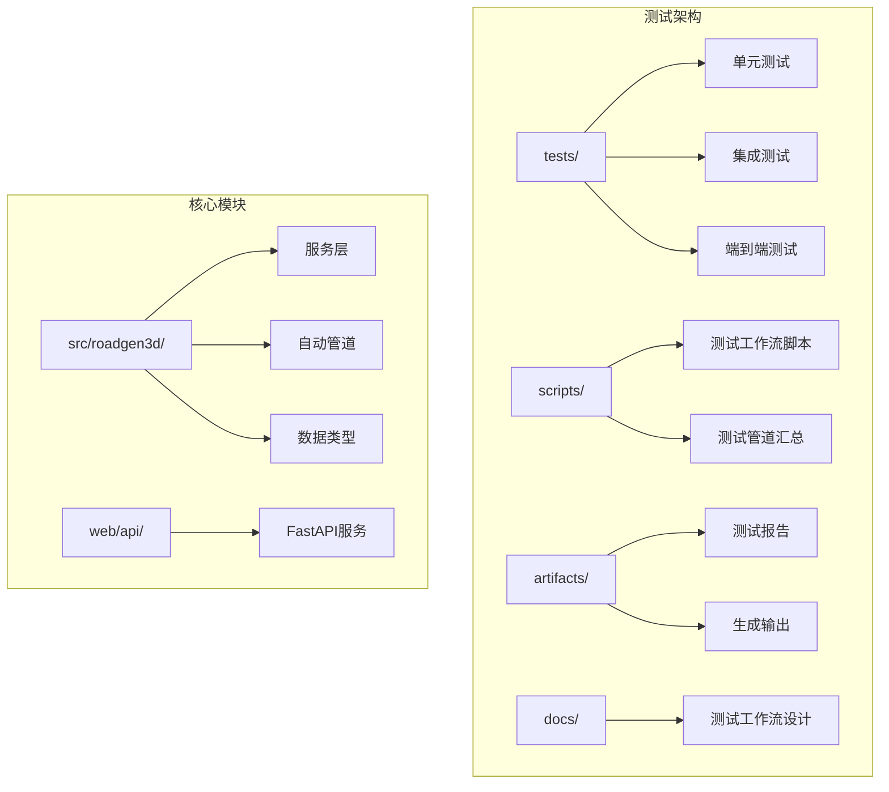
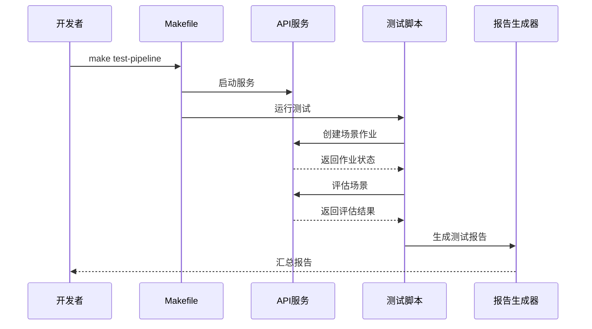
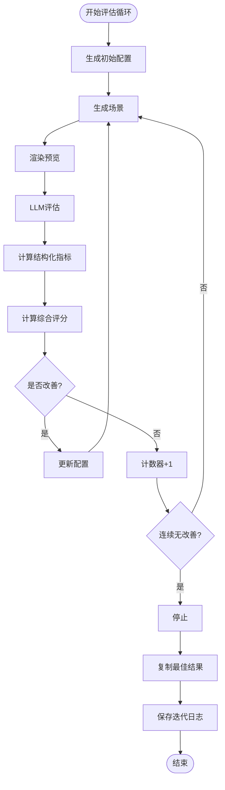
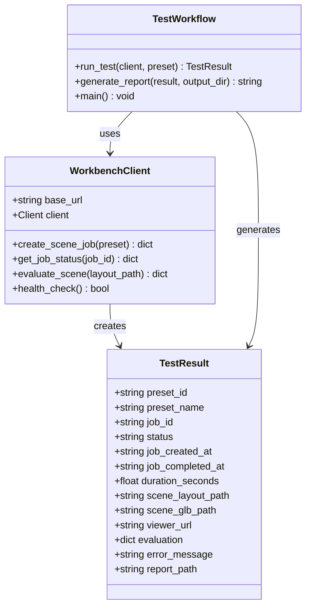
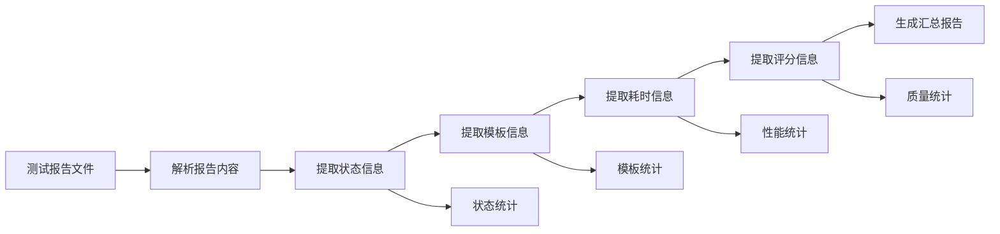
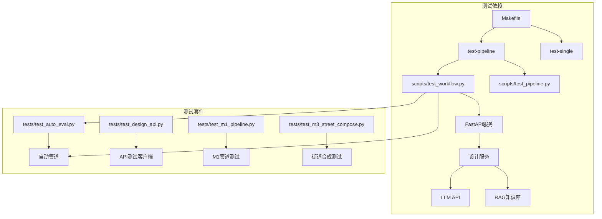

# 测试设计文档

<cite>
**本文档引用的文件**
- [readme.md](file://readme.md)
- [docs/design-test-workflow.md](file://docs/design-test-workflow.md)
- [scripts/test_workflow.py](file://scripts/test_workflow.py)
- [scripts/test_pipeline.py](file://scripts/test_pipeline.py)
- [Makefile](file://Makefile)
- [tests/test_auto_eval.py](file://tests/test_auto_eval.py)
- [tests/test_design_api.py](file://tests/test_design_api.py)
- [tests/test_m1_pipeline.py](file://tests/test_m1_pipeline.py)
- [tests/test_m3_street_compose.py](file://tests/test_m3_street_compose.py)
- [src/roadgen3d/services/design_types.py](file://src/roadgen3d/services/design_types.py)
- [src/roadgen3d/auto_pipeline/iteration_controller.py](file://src/roadgen3d/auto_pipeline/iteration_controller.py)
</cite>

## 更新摘要
**变更内容**
- 新增完整的自动化测试工作流设计文档
- 更新测试流水线架构图和实现细节
- 增强自动化评估循环的技术方案
- 完善测试工作流的完整设计文档

## 目录
1. [简介](#简介)
2. [项目结构](#项目结构)
3. [核心组件](#核心组件)
4. [架构概览](#架构概览)
5. [详细组件分析](#详细组件分析)
6. [依赖关系分析](#依赖关系分析)
7. [性能考虑](#性能考虑)
8. [故障排除指南](#故障排除指南)
9. [结论](#结论)

## 简介

RoadGen3D 是一个基于神经符号系统的文本到3D城市街道场景生成系统。该项目实现了完整的自动化测试体系，包括端到端工作流测试、API测试、管道测试和质量评估测试。

测试设计的核心目标是确保系统的稳定性、可靠性和一致性，涵盖从模板选择到场景生成、评估和可视化的完整工作流程。系统支持多种测试模式，包括真实LLM测试、模拟测试和性能基准测试。

**更新** 新增了完整的自动化测试工作流设计，提供从API启动到测试执行再到报告生成的完整流水线。

## 项目结构

RoadGen3D项目采用模块化架构，测试相关的主要目录结构如下：

**图表来源**
- [Makefile:111-174](file://Makefile#L111-L174)
- [readme.md:132-171](file://readme.md#L132-L171)

**章节来源**
- [Makefile:1-198](file://Makefile#L1-L198)
- [readme.md:132-171](file://readme.md#L132-L171)

## 核心组件

### 测试框架架构

系统包含四个主要的测试组件：

1. **工作流自动化测试** - `scripts/test_workflow.py`
2. **测试管道汇总** - `scripts/test_pipeline.py`
3. **自动化评估测试** - `tests/test_auto_eval.py`
4. **API集成测试** - `tests/test_design_api.py`

### 测试预设模板

系统提供六种预设模板，每种模板都有特定的设计参数和配置：

| 模板ID | 中文名称 | 英文名称 | 设计规则配置 | 需求等级 |
|--------|----------|----------|--------------|----------|
| pedestrian_friendly | 步行友好 | Pedestrian Friendly | pedestrian_priority_v1 | 低-中等 |
| commercial_vitality | 商业活力 | Commercial Vitality | balanced_complete_street_v1 | 高-中等 |
| transit_priority | 公交优先 | Transit Priority | transit_priority_v1 | 高-高 |
| park_landscape | 公园景观 | Park Landscape | pedestrian_priority_v1 | 低-低 |
| quiet_residential | 安静居住 | Quiet Residential | pedestrian_priority_v1 | 低-低 |
| balanced_complete | 平衡街道 | Balanced Complete | balanced_complete_street_v1 | 中等-中等 |

**更新** 新增了完整的测试工作流设计文档，详细描述了测试模板的选择和配置。

**章节来源**
- [scripts/test_workflow.py:39-130](file://scripts/test_workflow.py#L39-L130)
- [docs/design-test-workflow.md:39-47](file://docs/design-test-workflow.md#L39-L47)

## 架构概览

### 测试流水线架构

**图表来源**
- [Makefile:115-148](file://Makefile#L115-L148)
- [scripts/test_workflow.py:536-579](file://scripts/test_workflow.py#L536-L579)

### 自动化评估循环

**图表来源**
- [src/roadgen3d/auto_pipeline/iteration_controller.py:102-273](file://src/roadgen3d/auto_pipeline/iteration_controller.py#L102-L273)

**更新** 新增了完整的自动化评估循环设计，包括早期停止逻辑和配置更新机制。

**章节来源**
- [src/roadgen3d/auto_pipeline/iteration_controller.py:61-273](file://src/roadgen3d/auto_pipeline/iteration_controller.py#L61-L273)

## 详细组件分析

### 工作流自动化测试组件

#### 测试客户端设计

**图表来源**
- [scripts/test_workflow.py:163-320](file://scripts/test_workflow.py#L163-L320)
- [scripts/test_workflow.py:136-159](file://scripts/test_workflow.py#L136-L159)

#### 测试执行流程

测试执行包含四个主要步骤：

1. **场景生成任务创建** - 通过POST `/api/scene/jobs` 创建作业
2. **作业状态轮询** - 通过GET `/api/scene/jobs/{job_id}` 轮询状态
3. **场景评估** - 通过POST `/api/design/evaluate/unified` 调用LLM评估
4. **报告生成** - 生成Markdown格式的测试报告

**更新** 新增了完整的测试工作流设计文档，详细描述了每个步骤的实现细节和错误处理机制。

**章节来源**
- [scripts/test_workflow.py:228-320](file://scripts/test_workflow.py#L228-L320)
- [scripts/test_workflow.py:171-216](file://scripts/test_workflow.py#L171-L216)

### 测试管道汇总组件

#### 报告解析器设计

**图表来源**
- [scripts/test_pipeline.py:17-63](file://scripts/test_pipeline.py#L17-L63)

#### 汇总报告生成

测试管道会生成包含以下信息的汇总报告：

- **统计摘要** - 总测试数、通过率、失败率、超时率
- **性能指标** - 平均耗时、平均评分
- **最近测试** - 最近10次测试的详细信息
- **测试链接** - 所有测试报告的链接

**更新** 新增了测试管道汇总组件的详细设计，包括报告解析和统计分析功能。

**章节来源**
- [scripts/test_pipeline.py:66-140](file://scripts/test_pipeline.py#L66-L140)

### 自动化评估测试组件

#### 多版本评估测试

系统支持多版本场景生成和评估，包含五个测试用例：

1. **多版本生成测试** - 验证不同查询产生不同的配置和迭代
2. **迭代日志格式测试** - 验证iteration_log.json的结构正确性
3. **演示视图渲染测试** - 验证渲染演示视图的功能
4. **评估报告聚合测试** - 验证评估报告的聚合功能
5. **早期停止逻辑测试** - 使用模拟LLM验证早期停止机制

**更新** 新增了完整的自动化评估测试设计，包括早期停止逻辑和配置更新机制。

**章节来源**
- [tests/test_auto_eval.py:248-521](file://tests/test_auto_eval.py#L248-L521)

### API集成测试组件

#### FastAPI端点测试

API测试覆盖了所有主要的HTTP端点：

| 端点 | 方法 | 功能描述 | 测试重点 |
|------|------|----------|----------|
| `/api/design/draft` | POST | 生成设计草稿 | 草稿生成、参数清理、知识检索 |
| `/api/design/generate` | POST | 直接场景生成 | 场景生成、参数验证、错误处理 |
| `/api/scene/jobs` | POST | 提交生成作业 | 作业队列、状态管理 |
| `/api/scene/jobs` | GET | 列出所有作业 | 作业列表、分页 |
| `/api/scene/jobs/{job_id}` | GET | 获取作业状态 | 状态查询、结果获取 |
| `/api/scenes/recent` | GET | 列出最近场景 | 场景历史、缓存管理 |

**更新** 新增了完整的API集成测试设计，包括端点覆盖和测试重点分析。

**章节来源**
- [tests/test_design_api.py:183-523](file://tests/test_design_api.py#L183-L523)

## 依赖关系分析

### 测试依赖图

**图表来源**
- [Makefile:115-148](file://Makefile#L115-L148)
- [scripts/test_workflow.py:536-579](file://scripts/test_workflow.py#L536-L579)

### 关键依赖关系

1. **Makefile依赖** - 提供测试流水线的统一入口
2. **环境依赖** - 需要API服务、LLM服务、知识库服务
3. **数据依赖** - 需要资产清单、模型文件、测试数据
4. **外部服务依赖** - LLM API、RAG服务、文件存储

**更新** 新增了测试工作流设计文档，详细描述了测试依赖关系和环境配置。

**章节来源**
- [Makefile:111-198](file://Makefile#L111-L198)

## 性能考虑

### 测试性能指标

系统在测试中关注以下性能指标：

- **响应时间** - API请求的平均响应时间
- **吞吐量** - 每分钟处理的测试请求数
- **资源利用率** - CPU、内存、GPU的使用情况
- **并发处理** - 同时运行的测试数量

### 性能优化策略

1. **异步处理** - 使用异步作业队列处理场景生成
2. **缓存机制** - 缓存LLM响应和中间结果
3. **资源池管理** - 管理模型加载和资源分配
4. **批处理优化** - 批量处理相似的测试请求

**更新** 新增了测试工作流的性能考虑，包括异步处理和缓存机制。

## 故障排除指南

### 常见测试问题

| 问题类型 | 症状 | 解决方案 | 相关文件 |
|----------|------|----------|----------|
| API连接失败 | HTTP连接错误 | 检查服务端口占用、网络连接 | Makefile, test_workflow.py |
| LLM API不可用 | LLM响应超时 | 配置正确的API密钥和基础URL | test_auto_eval.py |
| 资源加载失败 | 模型文件缺失 | 确保模型文件存在且可访问 | test_m1_pipeline.py |
| 资产清单错误 | 资产路径无效 | 检查资产清单格式和路径 | test_m3_street_compose.py |

### 调试工具

1. **健康检查** - 使用`/api/health`端点检查服务状态
2. **日志分析** - 查看测试报告中的错误信息
3. **环境诊断** - 使用`m1_00_check_env.py`检查环境配置
4. **性能监控** - 监控测试执行时间和资源使用

**更新** 新增了测试工作流的故障排除指南，包括常见问题和调试工具。

**章节来源**
- [scripts/test_workflow.py:307-318](file://scripts/test_workflow.py#L307-L318)
- [tests/test_m1_pipeline.py:161-219](file://tests/test_m1_pipeline.py#L161-L219)

## 结论

RoadGen3D的测试设计体现了现代软件测试的最佳实践，具有以下特点：

1. **多层次测试覆盖** - 从单元测试到端到端测试的完整覆盖
2. **自动化程度高** - 通过Makefile和脚本实现完全自动化
3. **可扩展性强** - 支持新的测试用例和测试场景
4. **报告完善** - 提供详细的测试报告和汇总信息
5. **容错机制** - 包含错误处理和恢复机制

**更新** 新增了完整的自动化测试工作流设计，提供了从API启动到测试执行再到报告生成的完整流水线，确保了系统的稳定性和可靠性。

该测试体系确保了RoadGen3D系统的稳定性和可靠性，为后续的功能扩展和维护提供了坚实的基础。通过持续集成和自动化测试，开发团队可以快速发现和解决问题，保证系统的高质量交付。