# 自动化测试管道

<cite>
**本文档引用的文件**
- [README.md](file://README.md)
- [Makefile](file://Makefile)
- [scripts/test_workflow.py](file://scripts/test_workflow.py)
- [scripts/test_pipeline.py](file://scripts/test_pipeline.py)
- [scripts/test_batch.py](file://scripts/test_batch.py)
- [scripts/test_workflow.py](file://scripts/test_workflow.py)
- [scripts/test_pipeline.py](file://scripts/test_pipeline.py)
- [tests/test_auto_eval.py](file://tests/test_auto_eval.py)
- [tests/test_design_api.py](file://tests/test_design_api.py)
- [web/api/main.py](file://web/api/main.py)
- [src/roadgen3d/services/generation_api.py](file://src/roadgen3d/services/generation_api.py)
- [src/roadgen3d/auto_pipeline/iteration_controller.py](file://src/roadgen3d/auto_pipeline/iteration_controller.py)
- [src/roadgen3d/services/design_runtime.py](file://src/roadgen3d/services/design_runtime.py)
- [src/roadgen3d/llm/design_workflow.py](file://src/roadgen3d/llm/design_workflow.py)
- [scripts/run_auto_eval.py](file://scripts/run_auto_eval.py)
- [docs/design-test-workflow.md](file://docs/design-test-workflow.md)
- [artifacts/test_reports/test_2026-04-12_16-04-50.md](file://artifacts/test_reports/test_2026-04-12_16-04-50.md)
- [artifacts/test_reports/batch_test_2026-04-13_17-01-05.md](file://artifacts/test_reports/batch_test_2026-04-13_17-01-05.md)
</cite>

## 更新摘要
**变更内容**
- 新增test-batch命令，支持并行批量测试功能
- 实现多线程并行场景生成能力，显著提升测试效率
- 新增批量测试报告生成功能，提供专门的批量测试报告格式
- 扩展测试管道架构，支持完整的批量测试工作流
- 增强测试报告系统，支持批量测试报告的统计分析
- **新增**：批量测试脚本支持随机模板分配功能
- **新增**：LLM 动态配置生成功能，支持 GraphRAG + LLM 的智能设计
- **新增**：增强的批量测试可视化反馈和进度监控

## 目录
1. [项目概述](#项目概述)
2. [测试管道架构](#测试管道架构)
3. [核心组件分析](#核心组件分析)
4. [自动化测试流程](#自动化测试流程)
5. [批量测试功能](#批量测试功能)
6. [LLM 生成功能](#llm-生成功能)
7. [测试报告系统](#测试报告系统)
8. [性能与可靠性考虑](#性能与可靠性考虑)
9. [故障排除指南](#故障排除指南)
10. [总结](#总结)

## 项目概述

RoadGen3D是一个基于神经符号系统的3D城市街道场景生成系统，能够将文本描述转换为详细的3D城市街道场景。该项目采用模块化架构，包含多个测试套件来确保系统的稳定性和可靠性。

根据项目文档，系统提供了完整的自动化测试管道，包括：
- Workbench自动化测试脚本
- 多版本自动评估管道
- 测试报告汇总系统
- 持续集成测试支持
- 后台运行和定期执行的测试管道
- **新增**：批量测试功能，支持并行场景生成和批量报告生成
- **新增**：随机模板分配功能，支持不同图形模板的对比测试
- **新增**：LLM 动态配置生成功能，支持智能设计建议和参数优化

## 测试管道架构

### 整体架构图

```mermaid
graph TB
subgraph "测试管道层"
TP[Test Pipeline] --> WT[Workbench Test]
TP --> AE[Auto Evaluation]
TP --> UT[Unit Tests]
TP --> BT[Batch Test]
end
subgraph "API服务层"
API[FastAPI Services]
API --> DA[Design API]
API --> GA[Generation API]
API --> KA[Knowledge API]
end
subgraph "核心业务逻辑"
AP[Auto Pipeline]
DR[Design Runtime]
DW[Design Workflow]
EC[Evaluation Core]
LLM[LLM + RAG Engine]
end
subgraph "测试组件"
TC[Test Client]
TR[Test Reporter]
TS[Test Suite]
BC[Batch Client]
BR[Batch Reporter]
LLMClient[LLM Client]
End
WT --> TC
AE --> TS
UT --> TS
BT --> BC
TC --> API
TR --> API
BC --> API
BR --> API
API --> AP
AP --> DR
DR --> DW
DW --> EC
DW --> LLM
```

**图表来源**
- [Makefile:135-168](file://Makefile#L135-L168)
- [scripts/test_workflow.py:163-224](file://scripts/test_workflow.py#L163-L224)
- [scripts/test_batch.py:158-237](file://scripts/test_batch.py#L158-L237)
- [web/api/main.py:81-280](file://web/api/main.py#L81-L280)

### 测试管道层次结构

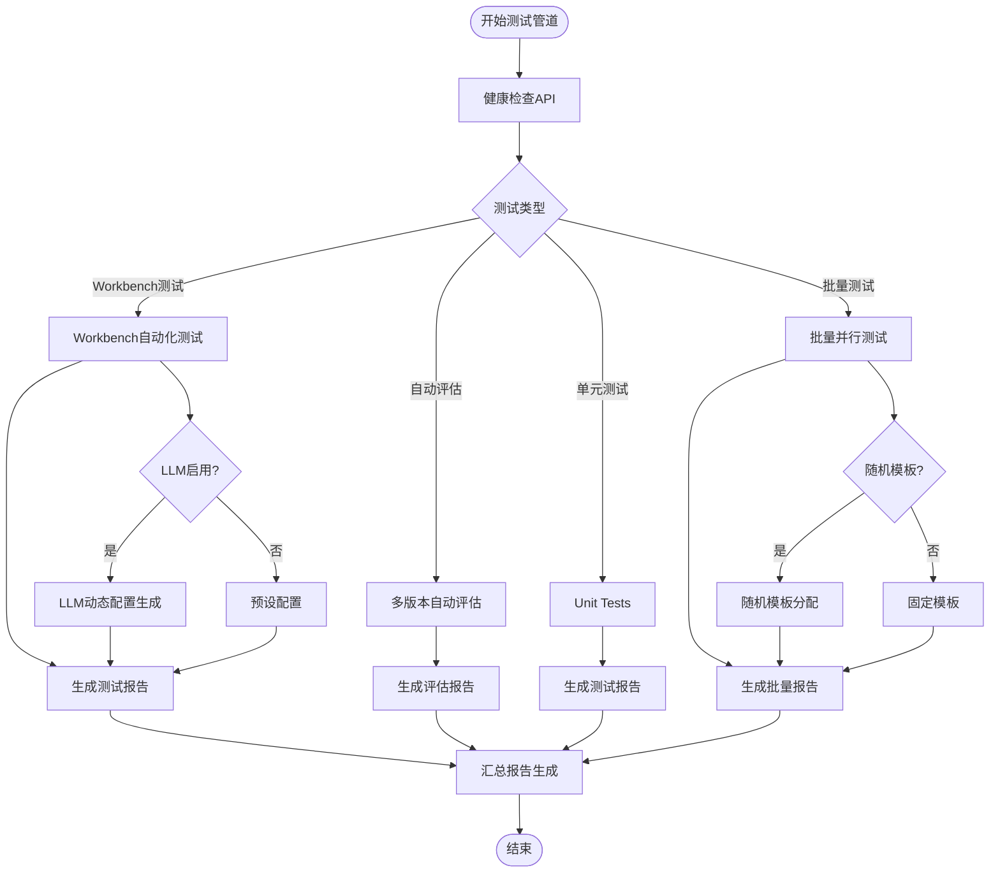

**图表来源**
- [Makefile:135-168](file://Makefile#L135-L168)
- [scripts/test_pipeline.py:66-140](file://scripts/test_pipeline.py#L66-L140)
- [scripts/test_batch.py:381-476](file://scripts/test_batch.py#L381-L476)

## 核心组件分析

### Workbench自动化测试组件

Workbench自动化测试是整个测试管道的核心组件，负责模拟真实用户的工作流程。

#### 测试客户端架构

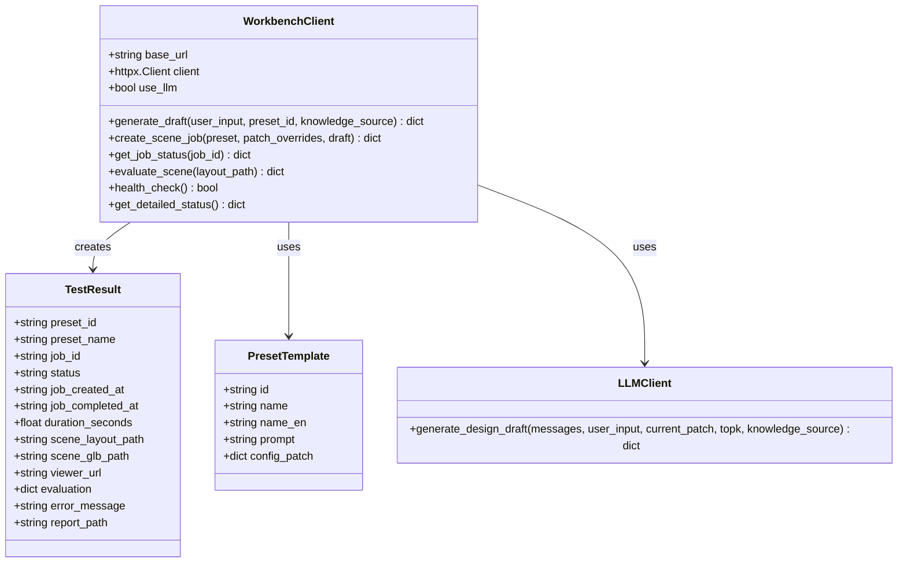

**图表来源**
- [scripts/test_workflow.py:163-224](file://scripts/test_workflow.py#L163-L224)
- [scripts/test_workflow.py:136-159](file://scripts/test_workflow.py#L136-L159)

#### 预设模板系统

系统内置了6种预设模板，每种模板都包含特定的设计参数和配置：

| 模板ID | 中文名称 | 英文名称 | 设计目标 | 关键配置 |
|--------|----------|----------|----------|----------|
| pedestrian_friendly | 步行友好 | Pedestrian Friendly | 行人优先，安全舒适 | 高步行需求，低车流量 |
| commercial_vitality | 商业活力 | Commercial Vitality | 商业活跃，人流密集 | 高商业需求，高公交需求 |
| transit_priority | 公交优先 | Transit Priority | 公交导向，换乘便利 | 高公交需求，高车流量 |
| park_landscape | 公园景观 | Park Landscape | 绿化丰富，自然生态 | 低密度，高绿化 |
| quiet_residential | 安静居住 | Quiet Residential | 住宅区安静，绿树成荫 | 低车流量，低噪音 |
| balanced_complete | 平衡街道 | Balanced Complete | 各类使用者平衡 | 平衡各种需求 |

**章节来源**
- [scripts/test_workflow.py:39-130](file://scripts/test_workflow.py#L39-L130)

### 批量测试组件

**新增功能**：批量测试组件是本次更新的核心，提供了并行场景生成和批量报告生成功能。

#### 批量测试客户端架构

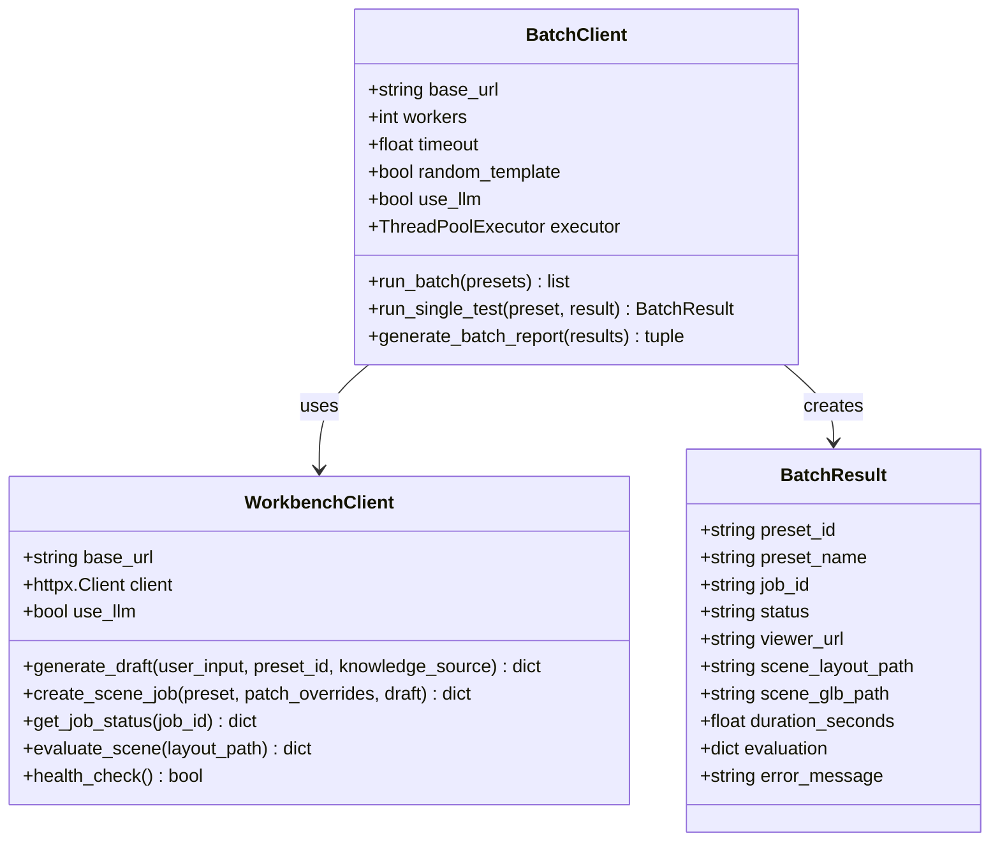

**图表来源**
- [scripts/test_batch.py:158-237](file://scripts/test_batch.py#L158-L237)
- [scripts/test_batch.py:139-154](file://scripts/test_batch.py#L139-L154)

#### 并行执行架构

批量测试系统采用多线程并行执行架构：

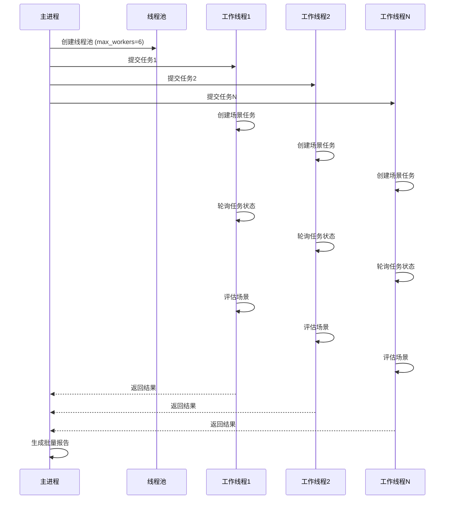

**图表来源**
- [scripts/test_batch.py:315-377](file://scripts/test_batch.py#L315-L377)
- [scripts/test_batch.py:241-313](file://scripts/test_batch.py#L241-L313)

#### 批量测试报告格式

批量测试报告提供了专门的报告格式，包含以下关键信息：

| 报告部分 | 内容 | 用途 |
|----------|------|------|
| 执行摘要 | 测试时间、模板数量、统计摘要 | 快速概览批量测试结果 |
| 统计摘要 | 总任务数、成功数、失败数、超时数 | 批量测试质量指标 |
| Viewer链接 | 每个模板的Viewer URL链接 | 场景可视化访问 |
| 详细结果 | 模板名称、状态、耗时、评分 | 详细性能对比 |
| 原始数据 | JSON格式的完整批量测试结果 | 数据备份和分析 |

**章节来源**
- [scripts/test_batch.py:381-476](file://scripts/test_batch.py#L381-L476)

### 自动评估管道

自动评估管道是测试系统的重要组成部分，用于验证多版本场景生成的质量。

#### 评估流程架构

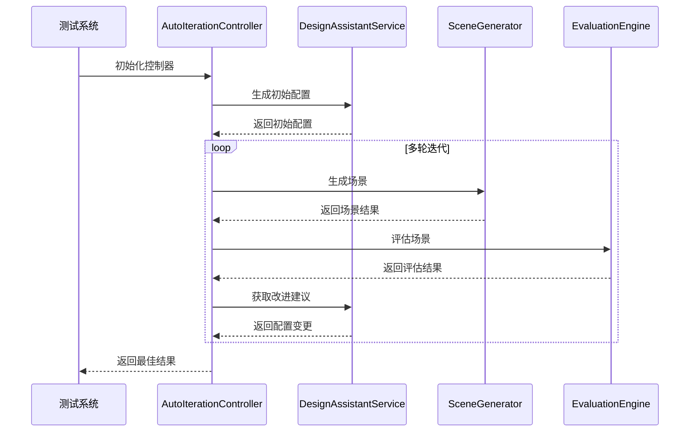

**图表来源**
- [src/roadgen3d/auto_pipeline/iteration_controller.py:102-273](file://src/roadgen3d/auto_pipeline/iteration_controller.py#L102-L273)
- [src/roadgen3d/llm/design_workflow.py:416-447](file://src/roadgen3d/llm/design_workflow.py#L416-L447)

#### 评估指标体系

系统使用多维度评估指标来衡量场景质量：

| 评估维度 | 权重 | 评估指标 | 说明 |
|----------|------|----------|------|
| 步行性 | 45% | 人行道净宽、净空连续性、步行舒适度 | 衡量行人通行便利性 |
| 安全性 | 35% | 净空连续性、交通隔离、安全设施 | 衡量交通安全水平 |
| 美观性 | 20% | 绿化遮荫率、街道家具协调性 | 衡量视觉美感 |

**章节来源**
- [src/roadgen3d/auto_pipeline/iteration_controller.py:165-180](file://src/roadgen3d/auto_pipeline/iteration_controller.py#L165-L180)

### API测试框架

系统提供了完整的API测试框架，包括设计API、生成API和知识检索API的测试。

#### API测试架构

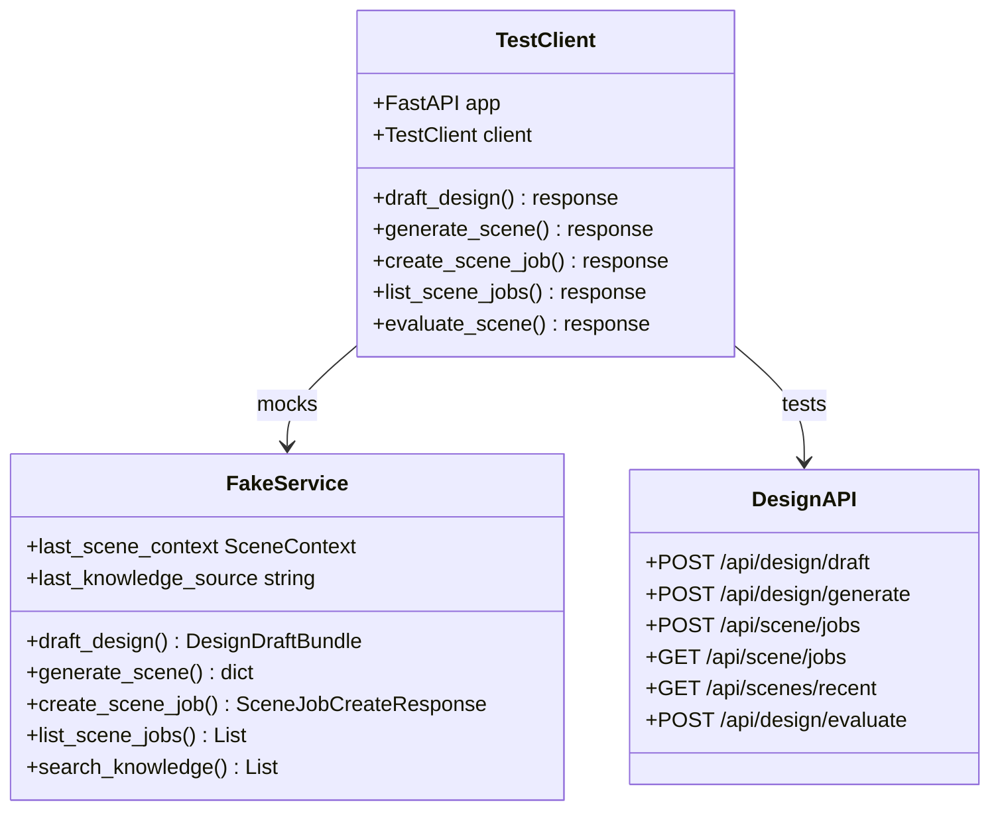

**图表来源**
- [tests/test_design_api.py:29-182](file://tests/test_design_api.py#L29-L182)
- [web/api/main.py:156-280](file://web/api/main.py#L156-L280)

**章节来源**
- [tests/test_design_api.py:183-523](file://tests/test_design_api.py#L183-L523)

## 自动化测试流程

### 测试管道执行流程

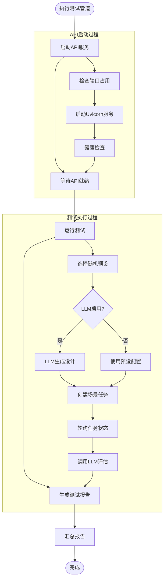

**图表来源**
- [Makefile:142-168](file://Makefile#L142-L168)
- [scripts/test_workflow.py:228-319](file://scripts/test_workflow.py#L228-L319)

### 批量测试执行流程

**新增功能**：批量测试提供了完整的并行执行流程，显著提升了测试效率。

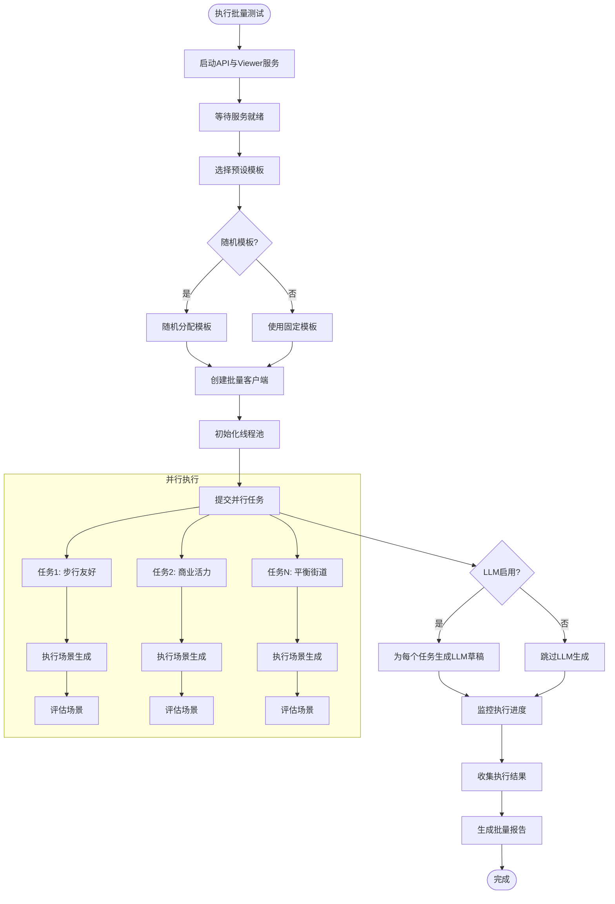

**图表来源**
- [Makefile:211-260](file://Makefile#L211-L260)
- [scripts/test_batch.py:315-377](file://scripts/test_batch.py#L315-L377)

## 批量测试功能

### 批量测试命令详解

系统提供了完整的批量测试命令，支持多种批量测试执行模式：

#### 完整批量测试命令

```bash
# 完整批量测试 Pipeline：启动服务 → 并行测试 → 生成报告
make test-batch

# 指定特定预设进行批量测试
make test-batch PRESETS=pedestrian_friendly commercial_vitality

# 使用所有6个模板进行批量测试
make test-batch PRESETS=all

# 自定义并行工作线程数
make test-batch PRESETS=all WORKERS=3

# 指定超时时间
make test-batch PRESETS=all TIMEOUT=900

# 启用随机模板分配
make test-batch PRESETS=all RANDOM_TEMPLATE=1

# 启用LLM动态配置生成
make test-batch PRESETS=all USE_LLM=1

# 组合使用：随机模板 + LLM生成
make test-batch PRESETS=all RANDOM_TEMPLATE=1 USE_LLM=1
```

**章节来源**
- [README.md:88-131](file://README.md#L88-L131)
- [Makefile:33-43](file://Makefile#L33-L43)
- [Makefile:211-260](file://Makefile#L211-L260)

### 批量测试参数配置

批量测试支持多种参数配置选项：

| 参数 | 默认值 | 说明 | 示例 |
|------|--------|------|------|
| `PRESETS` | 随机选择3个 | 指定要测试的模板ID | `pedestrian_friendly` |
| `WORKERS` | 6 | 并行工作线程数 | `3`, `6`, `12` |
| `TIMEOUT` | 600秒 | 单任务超时时间 | `300`, `600`, `900` |
| `API_BASE` | `http://127.0.0.1:8010` | API基础地址 | `http://localhost:8010` |
| `OUTPUT` | `artifacts/test_reports` | 报告输出目录 | `./test_reports` |
| `GRAPH_TEMPLATE` | `hkust_gz_gate` | 固定图形模板ID | `hkust_gz_gate_all` |
| `RANDOM_TEMPLATE` | `False` | 是否随机分配模板 | `1` (启用) |
| `USE_LLM` | `False` | 是否启用LLM生成 | `1` (启用) |

**章节来源**
- [scripts/test_batch.py:480-532](file://scripts/test_batch.py#L480-L532)

### 批量测试执行架构

批量测试系统采用了高效的并行执行架构：

#### 随机模板分配机制

**新增功能**：批量测试现在支持为每个预设随机分配不同的图形模板，以进行跨模板的对比测试。

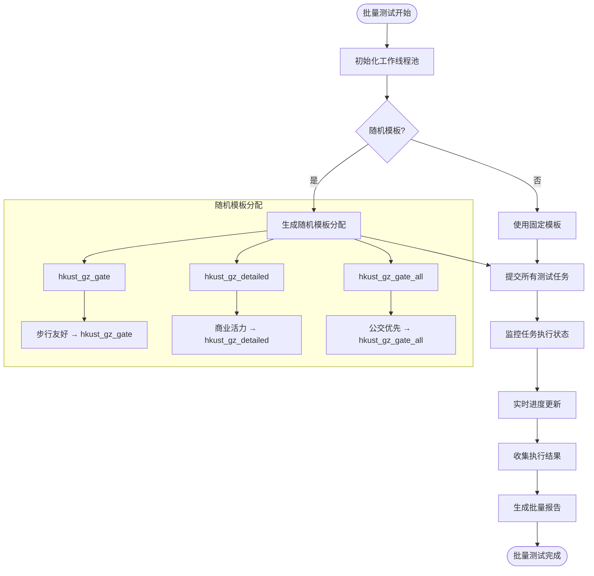

**图表来源**
- [scripts/test_batch.py:381-476](file://scripts/test_batch.py#L381-L476)
- [scripts/test_batch.py:373-450](file://scripts/test_batch.py#L373-L450)

#### 进度监控机制

批量测试系统提供了详细的进度监控功能：

1. **实时进度条**：显示每个任务的执行进度百分比
2. **状态统计**：统计已完成、进行中、失败的任务数量
3. **耗时统计**：记录每个任务的执行耗时
4. **错误处理**：捕获并记录任务执行中的异常
5. **模板分配可视化**：显示每个任务对应的图形模板

**章节来源**
- [scripts/test_batch.py:331-376](file://scripts/test_batch.py#L331-L376)

## LLM生成功能

### LLM动态配置生成功能

**新增功能**：两个测试脚本都集成了LLM动态配置生成功能，支持基于GraphRAG的知识检索和智能设计建议。

#### LLM生成流程

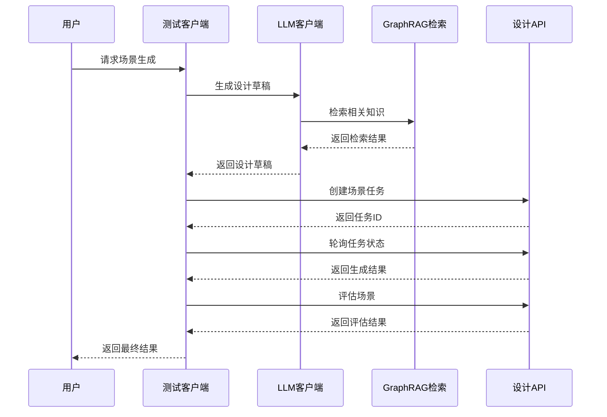

**图表来源**
- [scripts/test_workflow.py:614-630](file://scripts/test_workflow.py#L614-L630)
- [scripts/test_batch.py:301-314](file://scripts/test_batch.py#L301-L314)

#### LLM草稿生成机制

当启用LLM功能时，系统会执行以下步骤：

1. **设计意图解析**：LLM分析用户输入，理解设计需求
2. **知识检索**：通过GraphRAG检索相关的设计规范和案例
3. **参数推理**：基于检索结果推断最优的设计参数
4. **草稿生成**：生成包含完整配置的设计草稿
5. **回退机制**：如果LLM生成失败，自动回退到预设配置

**章节来源**
- [scripts/test_workflow.py:438-450](file://scripts/test_workflow.py#L438-L450)
- [scripts/test_batch.py:180-192](file://scripts/test_batch.py#L180-L192)

### LLM配置参数

LLM生成支持以下配置参数：

| 参数 | 类型 | 默认值 | 说明 |
|------|------|--------|------|
| `messages` | List | 空列表 | 对话历史记录 |
| `user_input` | String | 空字符串 | 用户输入的设计需求 |
| `current_patch` | Dict | 空字典 | 当前配置补丁 |
| `topk` | Int | 6 | 检索结果数量 |
| `knowledge_source` | String | `"graph_rag"` | 知识库来源 |
| `force` | Bool | `True` | 是否强制生成新结果 |

**章节来源**
- [scripts/test_workflow.py:438-447](file://scripts/test_workflow.py#L438-L447)
- [scripts/test_batch.py:180-189](file://scripts/test_batch.py#L180-L189)

## 测试报告系统

### 报告结构设计

系统生成三种类型的测试报告：

#### 单次测试报告结构

| 报告部分 | 内容 | 用途 |
|----------|------|------|
| 执行摘要 | 测试时间、模板、状态、耗时 | 快速概览测试结果 |
| 场景生成 | 状态、布局路径、GLB路径、Viewer URL | 场景生成结果追踪 |
| 评估结果 | 综合评分、详细指标、LLM评价、改进建议 | 场景质量评估 |
| 错误信息 | 异常堆栈、错误原因 | 故障诊断 |
| 原始数据 | JSON格式的完整测试结果 | 数据备份和分析 |

#### 批量测试报告结构

**新增功能**：批量测试报告提供了专门的批量测试报告格式。

| 报告部分 | 内容 | 用途 |
|----------|------|------|
| 执行摘要 | 测试时间、模板数量、统计摘要 | 快速概览批量测试结果 |
| 统计摘要 | 总任务数、成功数、失败数、超时数 | 批量测试质量指标 |
| Viewer链接 | 每个模板的Viewer URL链接 | 场景可视化访问 |
| 详细结果 | 模板名称、状态、耗时、评分 | 详细性能对比 |
| 原始数据 | JSON格式的完整批量测试结果 | 数据备份和分析 |

#### 汇总报告结构

**更新功能**：测试报告汇总系统现在支持批量测试报告的统计分析。

| 汇总指标 | 计算方式 | 说明 |
|----------|----------|------|
| 总测试数 | 所有测试报告数量 | 系统稳定性指标 |
| 通过率 | 通过测试数/总测试数×100% | 系统可靠性指标 |
| 失败率 | 失败测试数/总测试数×100% | 系统问题识别 |
| 超时率 | 超时测试数/总测试数×100% | 性能问题识别 |
| 平均耗时 | 所有测试耗时的平均值 | 性能基准线 |
| 平均评分 | 所有测试评分的平均值 | 质量基准线 |
| 批量测试成功率 | 批量测试成功数/批量测试总数×100% | 批量测试效率指标 |

**章节来源**
- [scripts/test_workflow.py:324-477](file://scripts/test_workflow.py#L324-L477)
- [scripts/test_pipeline.py:66-140](file://scripts/test_pipeline.py#L66-L140)
- [scripts/test_batch.py:381-476](file://scripts/test_batch.py#L381-L476)

### 测试管道命令详解

系统提供了完整的自动化测试管道命令，支持多种测试执行模式：

#### 完整测试管道命令

```bash
# 完整 Pipeline：启动 API → 运行测试 → 生成报告
make test-pipeline

# 批量测试 Pipeline：启动服务 → 并行测试 → 生成批量报告
make test-batch

# 启用随机模板分配的批量测试
make test-batch RANDOM_TEMPLATE=1

# 启用LLM生成的批量测试
make test-batch USE_LLM=1

# 后台运行测试（持续监控）
nohup make test-pipeline > artifacts/test_reports/pipeline.log 2>&1 &
echo "PID: $!"

# 或者使用 watch 定期执行
watch -n 300 make test-single  # 每 5 分钟执行一次

# 查看汇总报告
make test-report

# 查看日志
tail -f artifacts/test_reports/pipeline.log
```

**章节来源**
- [README.md:88-131](file://README.md#L88-L131)
- [Makefile:135-194](file://Makefile#L135-L194)

### 报告输出目录结构

测试报告的输出目录结构如下：

```
artifacts/test_reports/
├── test_2026-04-12_15-30-00.md   # 单次测试报告
├── test_2026-04-12_16-00-00.md
├── batch_test_2026-04-13_17-01-05.md  # 批量测试报告
├── SUMMARY.md                       # 汇总报告
└── pipeline.log                     # Pipeline 运行日志
```

**章节来源**
- [README.md:110-118](file://README.md#L110-L118)

### 测试报告汇总脚本详解

**更新功能**：系统现在包含一个独立的测试报告汇总脚本，专门用于统计分析和生成汇总报告。

#### 汇总脚本功能特性

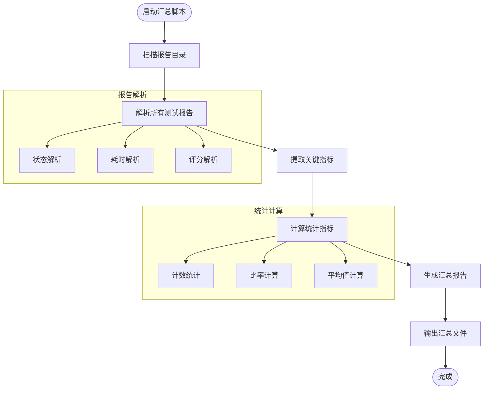

**图表来源**
- [scripts/test_pipeline.py:66-140](file://scripts/test_pipeline.py#L66-L140)

#### 汇总报告内容

汇总报告包含以下关键信息：

1. **统计摘要**：总测试数、通过率、失败率、超时率、平均耗时、平均评分
2. **最近测试**：显示最近10次测试的详细信息
3. **测试列表**：列出所有测试报告的链接和元数据

**章节来源**
- [scripts/test_pipeline.py:66-140](file://scripts/test_pipeline.py#L66-L140)

## 性能与可靠性考虑

### 测试超时机制

系统实现了多层次的超时保护机制：

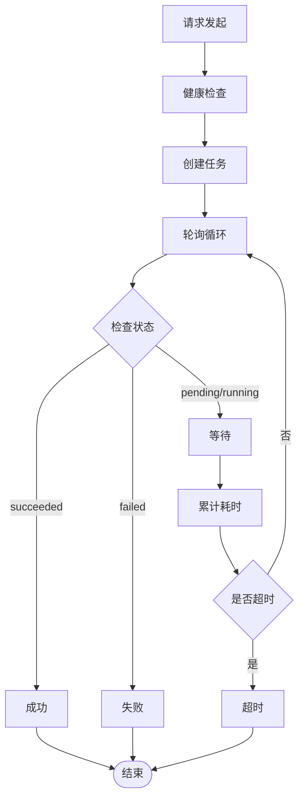

**图表来源**
- [scripts/test_workflow.py:264-291](file://scripts/test_workflow.py#L264-L291)

### 批量测试超时机制

**新增功能**：批量测试系统提供了更精细的超时控制机制：

1. **单任务超时**：每个场景生成任务都有独立的超时控制
2. **总超时控制**：批量测试有总超时限制，防止长时间阻塞
3. **线程池超时**：并行执行的线程池也有超时保护
4. **API调用超时**：每个API调用都有独立的超时设置

**章节来源**
- [scripts/test_batch.py:241-313](file://scripts/test_batch.py#L241-L313)

### 错误处理策略

系统采用了健壮的错误处理策略：

1. **连接错误处理**：网络连接失败时提供清晰的错误信息
2. **超时错误处理**：任务超时自动标记为超时状态
3. **评估失败处理**：LLM评估失败不影响整体测试流程
4. **异常捕获**：全面的异常捕获和错误恢复机制
5. **批量错误处理**：批量测试中单个任务失败不影响其他任务
6. **LLM生成回退**：LLM生成失败时自动回退到预设配置

**章节来源**
- [scripts/test_workflow.py:307-316](file://scripts/test_workflow.py#L307-L316)
- [scripts/test_batch.py:297-312](file://scripts/test_batch.py#L297-L312)

### 健康检查系统

系统提供了详细的API健康检查功能：

#### 健康检查架构

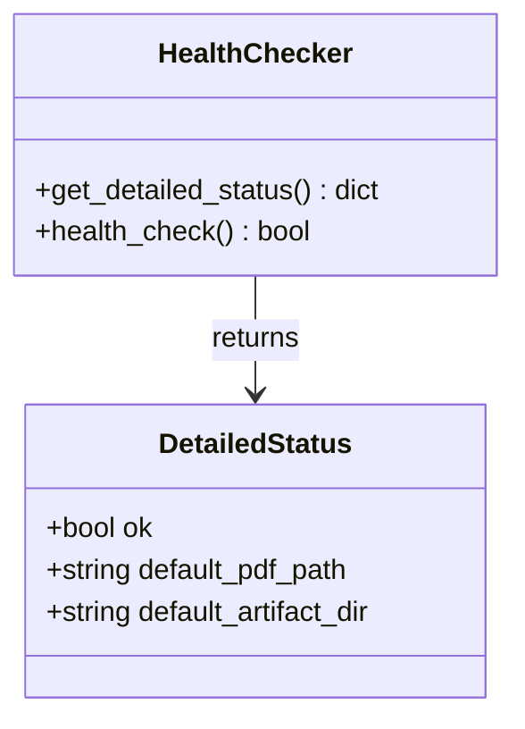

**图表来源**
- [scripts/test_workflow.py:487-519](file://scripts/test_workflow.py#L487-L519)
- [web/api/main.py:92-100](file://web/api/main.py#L92-L100)

#### 健康检查功能

系统提供了两层健康检查机制：

1. **基础健康检查**：简单的可用性检查
2. **详细健康检查**：包含版本信息、模型路径等详细状态信息

**章节来源**
- [scripts/test_workflow.py:487-519](file://scripts/test_workflow.py#L487-L519)

### 可视化界面增强

系统实现了丰富的可视化反馈机制：

#### 可视化组件

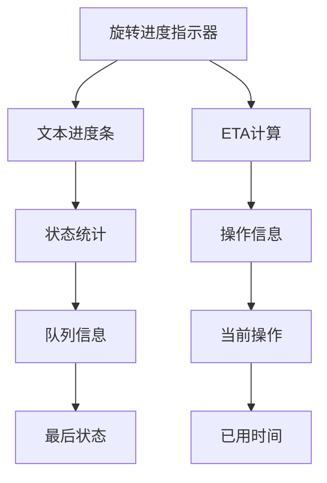

**图表来源**
- [scripts/test_workflow.py:540-675](file://scripts/test_workflow.py#L540-L675)

#### 批量测试可视化

**新增功能**：批量测试系统提供了专门的可视化反馈：

1. **并行进度条**：显示所有并行任务的总体进度
2. **实时状态统计**：显示已完成、进行中、失败的任务数量
3. **任务状态指示器**：每个任务都有独立的状态指示器
4. **Viewer链接展示**：批量测试完成后展示所有Viewer链接
5. **模板分配可视化**：显示每个任务对应的图形模板分配情况

**章节来源**
- [scripts/test_batch.py:331-376](file://scripts/test_batch.py#L331-L376)

## 故障排除指南

### 常见问题诊断

#### API服务不可用

**症状**：测试启动时提示API不可用
**解决方案**：
1. 检查端口占用情况
2. 确认Uvicorn服务正确启动
3. 验证环境变量配置

#### 批量测试超时问题

**症状**：批量测试在指定时间内未完成
**解决方案**：
1. 增加超时时间设置
2. 减少并行工作线程数
3. 检查系统资源使用情况
4. 优化场景生成算法

#### 批量测试报告生成失败

**症状**：批量测试报告无法生成
**解决方案**：
1. 检查 `artifacts/test_reports` 目录是否存在
2. 确认批量测试结果数据格式正确
3. 验证Python依赖项安装完整
4. 检查磁盘空间是否充足

#### 线程池异常

**症状**：批量测试执行过程中出现线程池异常
**解决方案**：
1. 检查Python版本兼容性
2. 确认并发库依赖项安装完整
3. 减少并行工作线程数
4. 检查系统线程限制设置

#### LLM生成失败

**症状**：LLM生成配置失败，回退到预设配置
**解决方案**：
1. 检查LLM API配置和密钥
2. 验证GraphRAG知识库构建状态
3. 确认网络连接正常
4. 检查LLM服务可用性

#### 随机模板分配问题

**症状**：随机模板分配功能异常
**解决方案**：
1. 检查GRAPH_TEMPLATES配置
2. 确认模板ID的有效性
3. 验证模板文件的存在性
4. 检查模板加载权限

### 调试工具使用

系统提供了多种调试工具：

1. **健康检查**：验证API服务状态
2. **日志跟踪**：实时查看测试执行状态
3. **报告分析**：分析测试结果和性能指标
4. **错误回溯**：定位具体失败环节
5. **批量测试监控**：监控并行执行状态
6. **LLM调试**：检查LLM生成过程和配置
7. **模板分配监控**：验证随机模板分配逻辑

**章节来源**
- [scripts/test_workflow.py:540-574](file://scripts/test_workflow.py#L540-L574)

## 总结

RoadGen3D的自动化测试管道是一个高度集成的测试框架，具有以下特点：

### 核心优势

1. **完整性**：覆盖从API层到业务逻辑层的全栈测试
2. **自动化**：完全自动化的测试执行和报告生成
3. **可扩展性**：模块化的架构设计便于功能扩展
4. **可靠性**：多重超时保护和错误处理机制
5. **可视化**：丰富的测试报告和指标展示
6. **持续监控**：支持后台运行和定期执行的测试管道
7. **LLM智能**：集成LLM动态配置生成功能
8. **随机对比**：支持随机模板分配的对比测试
9. **批量高效**：并行执行架构显著提升测试效率

### 技术特色

- **多层测试架构**：从单元测试到端到端测试的完整覆盖
- **智能报告系统**：自动生成详细的测试报告和性能指标
- **灵活的配置**：支持多种测试场景和参数配置
- **持续集成支持**：便于集成到CI/CD流水线
- **后台运行能力**：支持nohup和watch命令的长期监控
- **统计分析能力**：新增的测试报告汇总功能提供数据分析和趋势监控
- **增强的可视化**：改进的进度指示器和状态反馈
- **详细的健康检查**：提供API状态的详细信息
- **批量测试并行执行架构**，显著提升测试效率
- **专门的批量测试报告格式**，提供详细的批量测试分析
- **批量测试参数配置**：灵活的参数控制和自定义选项
- **LLM动态配置生成**：智能设计建议和参数优化
- **随机模板分配**：跨模板对比测试能力
- **LLM生成回退机制**：确保系统稳定性

### 应用价值

该测试管道为RoadGen3D项目提供了：
- **质量保证**：确保系统功能的稳定性和可靠性
- **性能监控**：实时监控系统性能和响应时间
- **问题预警**：及时发现和定位系统问题
- **开发效率**：自动化测试减少人工测试成本
- **持续改进**：通过定期测试和报告分析推动系统优化
- **智能设计**：LLM生成功能提供智能化的设计建议
- **对比分析**：随机模板分配支持跨模板的性能对比
- **批量测试**：显著提升大规模测试的执行效率

**新增功能价值**：批量测试功能的引入使得系统具备了真正的高效测试能力，能够同时对比多个场景模板的生成效果，显著提升了测试效率和分析深度。LLM生成功能的集成为系统提供了智能化的设计能力，能够基于知识库生成最优的设计配置。随机模板分配功能进一步增强了系统的对比测试能力，为设计优化提供了科学的评估方法。改进的可视化界面和健康检查系统显著提升了用户体验和系统的可观测性。批量测试报告的统计分析功能为系统优化和性能监控提供了强有力的数据支撑。

通过这个完善的测试管道，RoadGen3D项目能够持续保持高质量的软件交付标准，为用户提供可靠的3D城市街道场景生成服务，同时通过LLM智能生成和随机对比测试等功能，不断提升系统的智能化水平和设计质量。