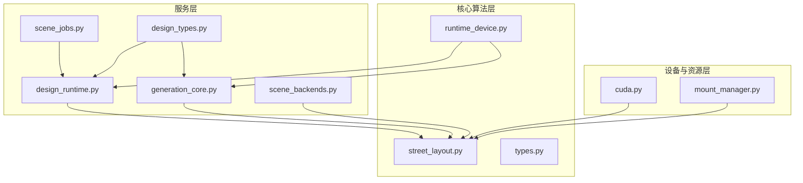
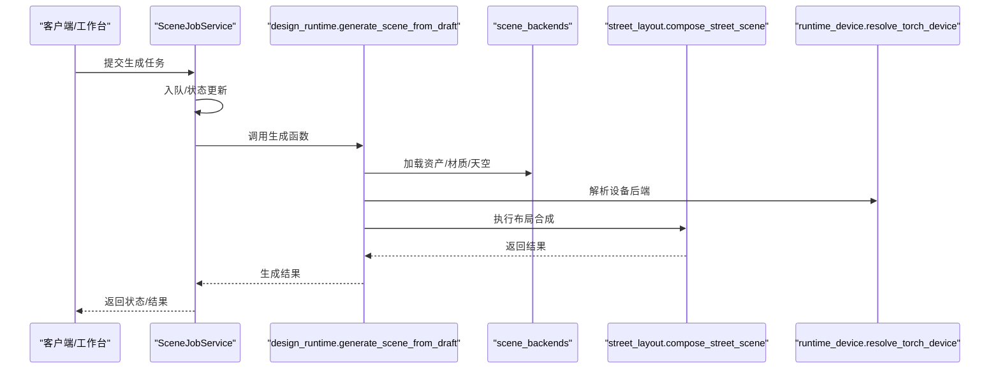
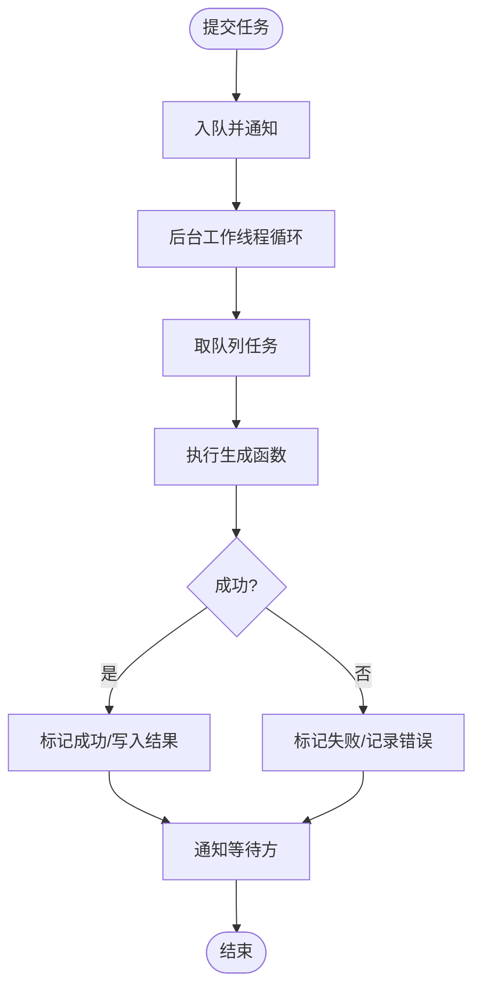
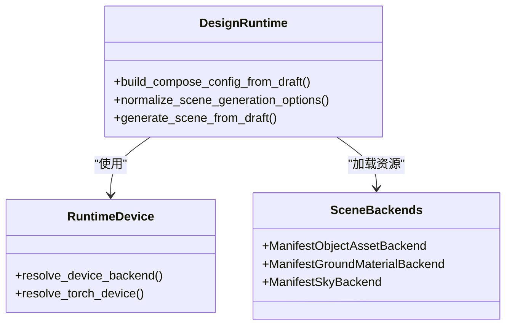
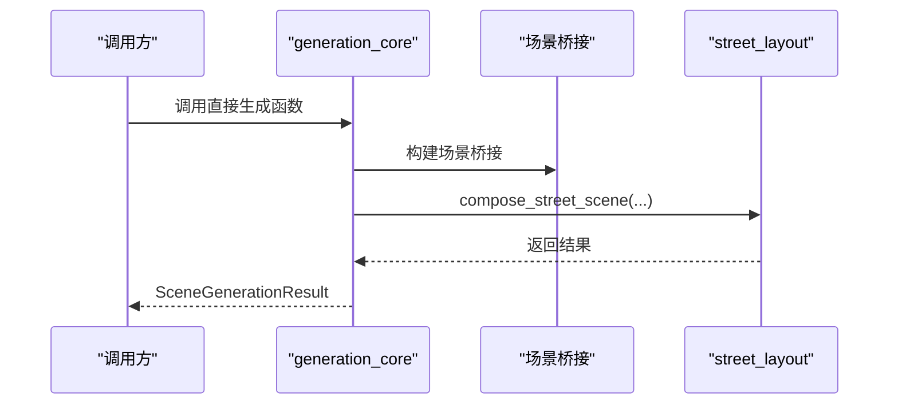
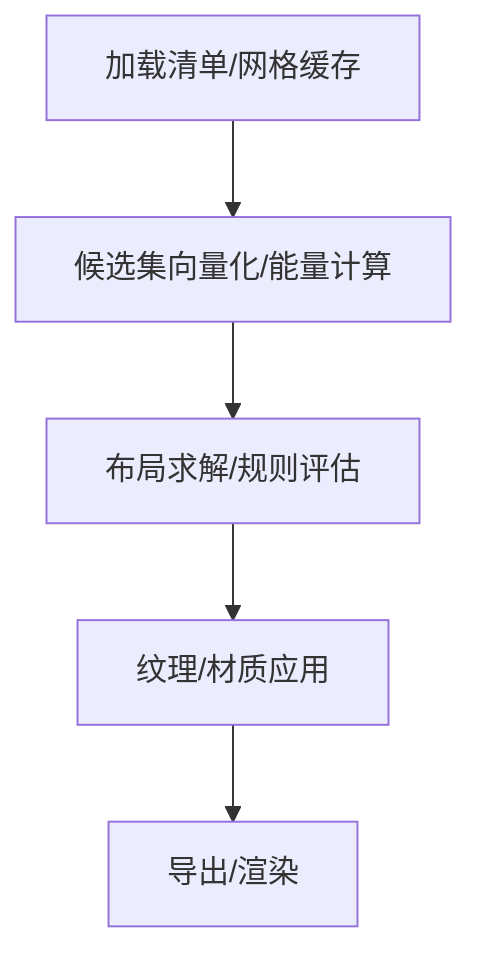
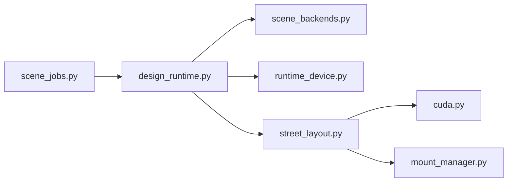

# 调试与性能分析

<cite>
**本文档引用的文件**
- [generation_core.py](file://src/roadgen3d/services/generation_core.py)
- [design_runtime.py](file://src/roadgen3d/services/design_runtime.py)
- [scene_jobs.py](file://src/roadgen3d/services/scene_jobs.py)
- [design_types.py](file://src/roadgen3d/services/design_types.py)
- [runtime_device.py](file://src/roadgen3d/runtime_device.py)
- [street_layout.py](file://src/roadgen3d/street_layout.py)
- [scene_backends.py](file://src/roadgen3d/services/scene_backends.py)
- [types.py](file://src/roadgen3d/types.py)
- [cuda.py](file://metaurban/metaurban/utils/cuda.py)
- [mount_manager.py](file://metaurban/metaurban/render_pipeline/rpcore/mount_manager.py)
</cite>

## 目录
1. [简介](#简介)
2. [项目结构](#项目结构)
3. [核心组件](#核心组件)
4. [架构总览](#架构总览)
5. [详细组件分析](#详细组件分析)
6. [依赖分析](#依赖分析)
7. [性能考虑](#性能考虑)
8. [故障排除指南](#故障排除指南)
9. [结论](#结论)

## 简介
本指南聚焦于 RoadGen3D 的调试技巧与性能分析，覆盖以下主题：
- Python 调试工具：pdb、IDE 调试器、日志调试
- 内存泄漏检测与 GPU 内存管理
- 性能瓶颈识别：CPU 性能分析与 GPU 性能调优
- 大模型推理优化：批处理、缓存、量化
- 分布式与并行处理调试
- 常见错误类型诊断与解决
- 监控指标采集与分析
- 生产环境问题排查流程

## 项目结构
RoadGen3D 的场景生成管线由多模块协作完成，核心路径如下：
- 服务层：设计运行时、场景作业队列、场景后端（资产/材质/天空）
- 核心算法层：街道布局合成、程序生成、布局求解、空间特征等
- 设备与资源层：设备选择、CUDA 工具、渲染管线挂载管理
- 类型定义层：配置、结果、数据结构统一定义

**图表来源**
- [design_runtime.py:1-397](file://src/roadgen3d/services/design_runtime.py#L1-L397)
- [generation_core.py:1-445](file://src/roadgen3d/services/generation_core.py#L1-L445)
- [scene_jobs.py:1-205](file://src/roadgen3d/services/scene_jobs.py#L1-L205)
- [design_types.py:1-368](file://src/roadgen3d/services/design_types.py#L1-L368)
- [street_layout.py:1-800](file://src/roadgen3d/street_layout.py#L1-L800)
- [runtime_device.py:1-72](file://src/roadgen3d/runtime_device.py#L1-L72)
- [scene_backends.py:1-527](file://src/roadgen3d/services/scene_backends.py#L1-L527)
- [cuda.py:1-40](file://metaurban/metaurban/utils/cuda.py#L1-L40)
- [mount_manager.py:127-162](file://metaurban/metaurban/render_pipeline/rpcore/mount_manager.py#L127-L162)

**章节来源**
- [design_runtime.py:1-397](file://src/roadgen3d/services/design_runtime.py#L1-L397)
- [generation_core.py:1-445](file://src/roadgen3d/services/generation_core.py#L1-L445)
- [scene_jobs.py:1-205](file://src/roadgen3d/services/scene_jobs.py#L1-L205)
- [design_types.py:1-368](file://src/roadgen3d/services/design_types.py#L1-L368)
- [street_layout.py:1-800](file://src/roadgen3d/street_layout.py#L1-L800)
- [runtime_device.py:1-72](file://src/roadgen3d/runtime_device.py#L1-L72)
- [scene_backends.py:1-527](file://src/roadgen3d/services/scene_backends.py#L1-L527)
- [cuda.py:1-40](file://metaurban/metaurban/utils/cuda.py#L1-L40)
- [mount_manager.py:127-162](file://metaurban/metaurban/render_pipeline/rpcore/mount_manager.py#L127-L162)

## 核心组件
- 设计运行时：将确认的设计草稿转换为可执行的场景生成配置，并驱动布局合成与导出。
- 场景作业服务：单进程后台工作线程，负责排队与执行生成任务，支持同步等待与状态查询。
- 生成核心：提供直接生成接口（MetaUrban/图模板），绕过 LLM/RAG 流程，便于快速验证。
- 设备解析：自动选择 CPU/MPS/CUDA 后端，支持回退与警告提示。
- 场景后端：从清单加载对象/材质/天空资源，支持合并与评分选择。

**章节来源**
- [design_runtime.py:336-396](file://src/roadgen3d/services/design_runtime.py#L336-L396)
- [scene_jobs.py:42-178](file://src/roadgen3d/services/scene_jobs.py#L42-L178)
- [generation_core.py:267-432](file://src/roadgen3d/services/generation_core.py#L267-L432)
- [runtime_device.py:37-72](file://src/roadgen3d/runtime_device.py#L37-L72)
- [scene_backends.py:205-317](file://src/roadgen3d/services/scene_backends.py#L205-L317)

## 架构总览
下图展示从设计草稿到最终场景输出的关键调用链路与数据流。

**图表来源**
- [scene_jobs.py:115-136](file://src/roadgen3d/services/scene_jobs.py#L115-L136)
- [design_runtime.py:336-396](file://src/roadgen3d/services/design_runtime.py#L336-L396)
- [scene_backends.py:222-233](file://src/roadgen3d/services/scene_backends.py#L222-L233)
- [street_layout.py:1-800](file://src/roadgen3d/street_layout.py#L1-L800)
- [runtime_device.py:65-72](file://src/roadgen3d/runtime_device.py#L65-L72)

## 详细组件分析

### 组件A：场景作业服务（并发与调试）
- 功能要点
  - 单线程后台工作者循环，从队列取出任务并执行。
  - 使用条件变量与锁保证线程安全；支持同步等待与超时控制。
  - 记录任务状态、创建/开始/结束时间、错误信息与最终结果。
- 调试建议
  - 在 worker 循环中增加日志，记录任务入队、开始执行、异常捕获与完成时刻。
  - 使用断点定位异常抛出位置，结合异常栈追踪定位上游问题。
  - 对长时间未完成的任务设置超时告警，避免阻塞。

**图表来源**
- [scene_jobs.py:144-178](file://src/roadgen3d/services/scene_jobs.py#L144-L178)

**章节来源**
- [scene_jobs.py:42-178](file://src/roadgen3d/services/scene_jobs.py#L42-L178)

### 组件B：设计运行时（参数校验与设备解析）
- 功能要点
  - 将设计草稿与上下文合并为可执行配置，支持模板/OSM/MetaUrban 等模式。
  - 校验输入参数与场景上下文，构建输出目录与后端。
  - 设备解析支持自动选择与回退，确保在不同平台可用。
- 调试建议
  - 在参数归一化阶段插入断点，检查字段清洗与默认值填充是否符合预期。
  - 针对设备解析失败场景，打印当前可用后端列表与回退原因。
  - 对不同布局模式（模板/OSM/MetaUrban）分别进行单元测试与边界测试。

**图表来源**
- [design_runtime.py:60-148](file://src/roadgen3d/services/design_runtime.py#L60-L148)
- [runtime_device.py:37-72](file://src/roadgen3d/runtime_device.py#L37-L72)
- [scene_backends.py:205-317](file://src/roadgen3d/services/scene_backends.py#L205-L317)

**章节来源**
- [design_runtime.py:60-148](file://src/roadgen3d/services/design_runtime.py#L60-L148)
- [runtime_device.py:37-72](file://src/roadgen3d/runtime_device.py#L37-L72)
- [scene_backends.py:205-317](file://src/roadgen3d/services/scene_backends.py#L205-L317)

### 组件C：生成核心（直接生成接口）
- 功能要点
  - 提供 MetaUrban/图模板/OSM 的直接生成入口，便于离线或快速验证。
  - 统一封装输出目录、后端与结果封装逻辑。
- 调试建议
  - 对每个生成入口增加参数打印与中间产物路径记录。
  - 对 OSM 生成占位处补充日志，明确“尚未实现”的原因与后续计划。

**图表来源**
- [generation_core.py:267-432](file://src/roadgen3d/services/generation_core.py#L267-L432)
- [street_layout.py:1-800](file://src/roadgen3d/street_layout.py#L1-L800)

**章节来源**
- [generation_core.py:267-432](file://src/roadgen3d/services/generation_core.py#L267-L432)

### 组件D：街道布局合成（性能热点与内存管理）
- 功能要点
  - 负责网格缓存、候选集构建、布局求解、纹理与渲染等。
  - 包含大量数值计算、空间索引与几何操作。
- 调试建议
  - 在关键步骤（网格缓存加载、候选能量计算、布局求解）埋点计时。
  - 对 mesh 缓存条目与几何归一化过程增加日志，定位异常几何导致的崩溃。
  - 关注 CUDA 图像映射与纹理注册生命周期，避免泄漏。

**图表来源**
- [street_layout.py:672-758](file://src/roadgen3d/street_layout.py#L672-L758)
- [cuda.py:16-34](file://metaurban/metaurban/utils/cuda.py#L16-L34)

**章节来源**
- [street_layout.py:672-758](file://src/roadgen3d/street_layout.py#L672-L758)
- [cuda.py:16-34](file://metaurban/metaurban/utils/cuda.py#L16-L34)

## 依赖分析
- 模块耦合
  - 设计运行时依赖场景后端与设备解析，耦合度适中，职责清晰。
  - 街道布局合成依赖多种子系统（索引、程序生成、布局求解），复杂度较高。
- 外部依赖
  - CUDA 运行时与纹理映射用于 GPU 加速渲染路径。
  - 渲染管线挂载管理用于调试时保留临时文件以便分析。

**图表来源**
- [design_runtime.py:1-397](file://src/roadgen3d/services/design_runtime.py#L1-L397)
- [scene_jobs.py:1-205](file://src/roadgen3d/services/scene_jobs.py#L1-L205)
- [street_layout.py:1-800](file://src/roadgen3d/street_layout.py#L1-L800)
- [runtime_device.py:1-72](file://src/roadgen3d/runtime_device.py#L1-L72)
- [scene_backends.py:1-527](file://src/roadgen3d/services/scene_backends.py#L1-L527)
- [cuda.py:1-40](file://metaurban/metaurban/utils/cuda.py#L1-L40)
- [mount_manager.py:127-162](file://metaurban/metaurban/render_pipeline/rpcore/mount_manager.py#L127-L162)

**章节来源**
- [design_runtime.py:1-397](file://src/roadgen3d/services/design_runtime.py#L1-L397)
- [scene_jobs.py:1-205](file://src/roadgen3d/services/scene_jobs.py#L1-L205)
- [street_layout.py:1-800](file://src/roadgen3d/street_layout.py#L1-L800)
- [runtime_device.py:1-72](file://src/roadgen3d/runtime_device.py#L1-L72)
- [scene_backends.py:1-527](file://src/roadgen3d/services/scene_backends.py#L1-L527)
- [cuda.py:1-40](file://metaurban/metaurban/utils/cuda.py#L1-L40)
- [mount_manager.py:127-162](file://metaurban/metaurban/render_pipeline/rpcore/mount_manager.py#L127-L162)

## 性能考虑
- CPU 性能分析
  - 使用 cProfile/Py-Spy 定位耗时函数，重点观察布局求解、候选集向量化与规则评估阶段。
  - 对重复计算（如网格缓存、嵌入检索）建立缓存层，减少重复 IO 与计算。
- GPU 性能调优
  - 利用 CUDA 图像映射与纹理注册机制，避免频繁主机-设备拷贝。
  - 控制渲染分辨率与纹理尺寸，降低带宽压力。
- 大模型推理优化
  - 批处理：将多个查询合并为批次，提升吞吐。
  - 缓存：对相似查询的结果与嵌入进行缓存复用。
  - 量化：在允许范围内采用 INT8/FP4 等量化以降低显存占用与延迟。
- 并行与分布式
  - 通过场景作业服务扩展为多进程/多实例，配合队列分发任务。
  - 对独立场景生成任务进行拆分与并行调度，注意共享资源的互斥访问。

[本节为通用指导，无需特定文件引用]

## 故障排除指南
- 常见错误类型与诊断
  - 设备不可用：检查 MPS/CUDA 可用性与回退逻辑，打印当前可用后端列表。
  - 资源缺失：清单路径不存在或字段不完整，检查清单加载与字段清洗逻辑。
  - 几何异常：网格基座未归零或存在离散几何，关注 mesh 归一化与异常检测日志。
  - CUDA 错误：使用 cudart 包装器捕获并格式化错误码，定位具体调用点。
  - 渲染管线冲突：挂载管理器的锁文件与清理策略，避免多实例竞争。
- 日志与断点
  - 在关键路径（设备解析、清单加载、布局合成、导出）增加结构化日志。
  - 使用 IDE 断点与条件断点，仅在异常条件下触发，减少性能开销。
- 回归与隔离
  - 将复杂场景拆分为最小可复现单元，逐步剔除无关因素。
  - 对第三方依赖（如 trimesh、faiss）版本进行锁定，避免 ABI 不兼容。

**章节来源**
- [runtime_device.py:37-72](file://src/roadgen3d/runtime_device.py#L37-L72)
- [scene_backends.py:319-349](file://src/roadgen3d/services/scene_backends.py#L319-L349)
- [street_layout.py:672-758](file://src/roadgen3d/street_layout.py#L672-L758)
- [cuda.py:9-34](file://metaurban/metaurban/utils/cuda.py#L9-L34)
- [mount_manager.py:127-162](file://metaurban/metaurban/render_pipeline/rpcore/mount_manager.py#L127-L162)

## 结论
通过系统化的调试与性能分析实践，可以有效提升 RoadGen3D 的稳定性与效率。建议在开发与生产环境中持续：
- 强化日志与断点策略，覆盖关键路径与异常分支
- 建立性能基线与回归测试，定期评估优化效果
- 规范设备与资源管理，避免泄漏与竞态
- 完善监控指标体系，实现可观测性闭环

[本节为总结性内容，无需特定文件引用]