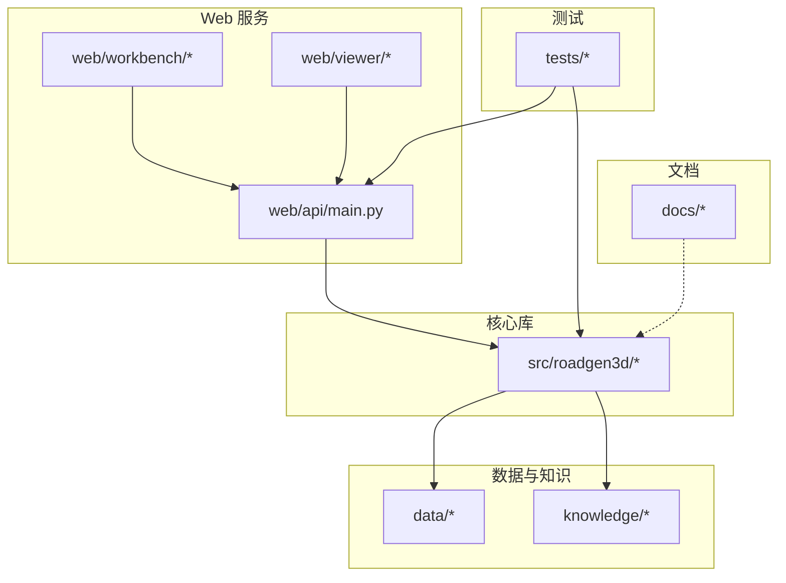
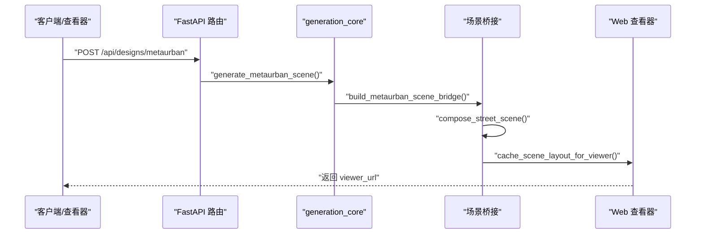
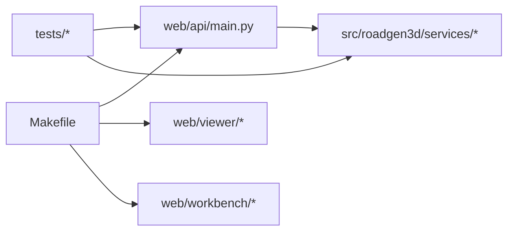

# 贡献流程与协作

<cite>
**本文引用的文件**
- [README.md](file://README.md)
- [readme.md](file://readme.md)
- [API_GUIDE.md](file://API_GUIDE.md)
- [REFACTOR_SUMMARY.md](file://REFACTOR_SUMMARY.md)
- [docs/roadmap.md](file://docs/roadmap.md)
- [docs/architecture_decisions.md](file://docs/architecture_decisions.md)
- [Makefile](file://Makefile)
- [tests/test_design_api.py](file://tests/test_design_api.py)
- [todo.md](file://todo.md)
</cite>

## 目录
1. [引言](#引言)
2. [项目结构](#项目结构)
3. [核心组件](#核心组件)
4. [架构总览](#架构总览)
5. [详细组件分析](#详细组件分析)
6. [依赖分析](#依赖分析)
7. [性能考量](#性能考量)
8. [故障排查指南](#故障排查指南)
9. [结论](#结论)
10. [附录](#附录)

## 引言
本文件旨在为 RoadGen3D 项目建立一套系统化的贡献流程与协作规范，覆盖 Git 工作流、分支策略、功能分支创建与合并流程、Pull Request（PR）创建与审查标准、代码审查检查清单与质量标准、Issue 报告规范与 Bug 修复流程、文档贡献指南、版本发布与变更日志维护、社区参与方式以及许可证与贡献者协议要求。内容基于仓库现有文档与测试规范提炼，并结合项目当前的 API 架构与开发实践，帮助贡献者高效协作。

## 项目结构
RoadGen3D 采用多模块、多服务的混合架构，核心包括：
- 核心库：Python 模块位于 src/roadgen3d，提供生成管线、服务接口与中间表示。
- Web 服务：FastAPI 后端位于 web/api，提供 RESTful API；前端工作台与查看器分别位于 web/workbench 与 web/viewer。
- 数据与知识：data/ 与 knowledge/ 分别存放资产清单、材料与知识库。
- 测试：tests/ 下包含端到端与单元测试，保障 API 与业务逻辑稳定性。
- 文档：docs/ 下包含路线图、架构决策与系统综述等文档。

图表来源
- [README.md:107-130](file://README.md#L107-L130)
- [API_GUIDE.md:75-185](file://API_GUIDE.md#L75-L185)

章节来源
- [README.md:107-130](file://README.md#L107-L130)
- [API_GUIDE.md:75-185](file://API_GUIDE.md#L75-L185)

## 核心组件
- 生成服务与 API：v2.0 重构后，生成主线独立，通过 FastAPI 提供 RESTful 接口，支持异步任务与 Swagger 文档。
- 设计工作流：LLM/RAG 作为可选上游服务，保留设计辅助能力，但不阻塞主流程。
- 测试与验证：测试覆盖设计草稿、生成、作业状态查询、近期场景列表等端点，确保接口契约稳定。

章节来源
- [REFACTOR_SUMMARY.md:31-66](file://REFACTOR_SUMMARY.md#L31-L66)
- [API_GUIDE.md:75-185](file://API_GUIDE.md#L75-L185)
- [tests/test_design_api.py:183-306](file://tests/test_design_api.py#L183-L306)

## 架构总览
v2.0 架构强调“生成主线独立、LLM 可选、RESTful 接口、异步任务”。核心数据流从 Web Viewer 或客户端发起请求，经 FastAPI 路由进入 generation_core，构建场景图并放置资产，最后缓存为 viewer 可读格式并返回 viewer_url。

图表来源
- [API_GUIDE.md:207-223](file://API_GUIDE.md#L207-L223)
- [REFACTOR_SUMMARY.md:50-66](file://REFACTOR_SUMMARY.md#L50-L66)

章节来源
- [API_GUIDE.md:207-223](file://API_GUIDE.md#L207-L223)
- [REFACTOR_SUMMARY.md:50-66](file://REFACTOR_SUMMARY.md#L50-L66)

## 详细组件分析

### Git 工作流与分支策略
- 分支命名与用途
  - main/master：稳定发布分支，合并来自功能分支的 PR。
  - develop：用于集成即将发布的特性，保持与 main 的同步。
  - feature/<topic>：功能开发分支，命名清晰描述改动范围。
  - hotfix/<issue>：紧急修复分支，快速修复线上问题。
  - release/<version>：发布分支，准备版本号与发布材料。
- 提交信息规范
  - 使用约定式提交（如 feat, fix, docs, refactor, test, chore），并在 PR 描述中简要说明动机与影响。
- 合并与冲突解决
  - 合并前确保 CI 通过、测试覆盖、代码审查通过。
  - 避免在分支上直接修改历史，必要时使用 rebase 保持线性历史。

章节来源
- [API_GUIDE.md:269-301](file://API_GUIDE.md#L269-L301)
- [REFACTOR_SUMMARY.md:164-221](file://REFACTOR_SUMMARY.md#L164-L221)

### 功能分支创建与合并流程
- 创建流程
  - 基于 develop 或 main 派生功能分支，命名遵循 feature/<功能点>。
  - 在本地完成开发与自测，提交前运行格式化与测试脚本。
- 合并与清理
  - 发起 PR 到 main/master，关联 Issue 与变更日志条目。
  - 审查通过后合并，随后删除功能分支，保持仓库整洁。

章节来源
- [Makefile:15-28](file://Makefile#L15-L28)

### Pull Request（PR）创建、审查与合并标准
- PR 要求
  - 描述清晰的功能目标、改动范围与风险说明。
  - 包含必要的测试用例与覆盖率说明。
  - 通过 CI 检查与代码风格校验。
- 审查要点
  - 接口契约是否满足（API 端点、参数、响应结构）。
  - 生成逻辑与服务层改动是否引入回归。
  - 文档与注释是否同步更新。
- 合并条件
  - 至少一名维护者批准。
  - CI 与测试全部通过。
  - 无未处理的评论。

章节来源
- [tests/test_design_api.py:183-306](file://tests/test_design_api.py#L183-L306)
- [API_GUIDE.md:303-337](file://API_GUIDE.md#L303-L337)

### 代码审查检查清单与质量标准
- 代码质量
  - 符合项目风格（例如 Python 与 TypeScript 风格）。
  - 函数与模块职责单一，避免过度耦合。
  - 错误处理与边界条件覆盖充分。
- 接口与契约
  - API 参数与响应结构与测试一致。
  - 新增端点需配套测试与文档。
- 性能与可维护性
  - 避免阻塞式长任务，必要时引入异步队列。
  - 生成流程中的内存与 I/O 开销可控。

章节来源
- [tests/test_design_api.py:183-306](file://tests/test_design_api.py#L183-L306)
- [REFACTOR_SUMMARY.md:248-270](file://REFACTOR_SUMMARY.md#L248-L270)

### Issue 报告规范与 Bug 修复流程
- 报告规范
  - 标题简洁明确，描述问题现象与期望行为。
  - 提供最小可复现步骤、环境信息（操作系统、Python/Node 版本、依赖版本）。
  - 附上相关日志、截图或最小示例。
- 修复流程
  - 将 Issue 关联到修复分支（hotfix/<issue>）。
  - 提交修复与测试，确保回归问题不再出现。
  - 合并后在 Issue 中补充修复说明与版本信息。

章节来源
- [API_GUIDE.md:303-337](file://API_GUIDE.md#L303-L337)

### 文档贡献指南
- 更新 README 与子文档
  - 新增功能或变更需同步更新 README 与相关文档（如 API 指南、路线图、架构决策）。
  - 文档应聚焦“当前系统状态”，而非仅罗列里程碑。
- 文档结构与更新节奏
  - 总览（current_system_review）、决策（architecture_decisions）、路线图（roadmap）三件套优先更新。
  - 变更日志以 PR 描述中的“建议变更日志条目”为依据收集。

章节来源
- [docs/architecture_decisions.md:238-255](file://docs/architecture_decisions.md#L238-L255)
- [docs/roadmap.md:1-175](file://docs/roadmap.md#L1-L175)
- [API_GUIDE.md:14-13](file://API_GUIDE.md#L14-L13)

### 版本发布流程与变更日志维护
- 发布流程
  - 在 release/<version> 分支上准备版本号、变更日志与发布说明。
  - 进行回归测试与性能验证，确认无重大缺陷。
  - 合并到 main/master 并打标签。
- 变更日志
  - 以 PR 描述中的“建议变更日志条目”为来源，按功能、修复、改进分类整理。
  - 保持语言简洁、事实准确，便于用户理解影响范围。

章节来源
- [REFACTOR_SUMMARY.md:164-221](file://REFACTOR_SUMMARY.md#L164-L221)

### 社区参与指南
- 讨论与交流
  - 使用 Issue 进行问题与需求讨论，PR 用于代码变更。
  - 对于复杂设计，可在文档（如路线图、架构决策）中沉淀共识。
- 技术分享
  - 通过 PR 与文档分享最佳实践与设计思路。
  - 鼓励对生成管线、服务层与前端工具链的优化建议。

章节来源
- [docs/roadmap.md:1-175](file://docs/roadmap.md#L1-L175)
- [docs/architecture_decisions.md:1-255](file://docs/architecture_decisions.md#L1-L255)

### 许可证要求与贡献者协议
- 许可证
  - 项目整体开发由 GIStudio 负责，具体第三方组件可能附带不同许可证（如 BSD 风格许可）。
- 贡献者协议
  - 贡献即表示同意项目许可证条款，遵守提交与分发的相关规定。

章节来源
- [README.md:255-258](file://README.md#L255-L258)

## 依赖分析
- 模块间依赖
  - web/api 依赖 src/roadgen3d 的生成服务与类型定义。
  - tests 依赖 web/api 的测试客户端与设计服务模拟。
- 外部依赖
  - Python 依赖通过 requirements-m1/2/ui 文件管理；前端依赖通过 npm 管理。
  - Makefile 提供一键安装与开发启动目标，简化环境搭建。

图表来源
- [Makefile:13-92](file://Makefile#L13-L92)
- [API_GUIDE.md:75-185](file://API_GUIDE.md#L75-L185)

章节来源
- [Makefile:13-92](file://Makefile#L13-L92)
- [API_GUIDE.md:75-185](file://API_GUIDE.md#L75-L185)

## 性能考量
- 生成性能
  - 当前生成为同步阻塞，大场景耗时较长；建议引入异步任务队列与持久化存储。
- 接口性能
  - 通过 Swagger UI 与 ReDoc 提供接口文档，便于压测与性能监控。
- 资源与并发
  - 注意模型加载与 GPU/CPU 资源占用，合理设置并发与超时。

章节来源
- [REFACTOR_SUMMARY.md:248-270](file://REFACTOR_SUMMARY.md#L248-L270)
- [API_GUIDE.md:330-337](file://API_GUIDE.md#L330-L337)

## 故障排查指南
- 常见问题
  - 任务状态长期为 queued：可能是首次模型加载或资源不足，建议等待或检查日志。
  - Reference plan not found：确认内置方案 ID 是否正确。
  - 缺少 torch：安装 PyTorch 依赖。
- 测试与验证
  - 使用测试脚本验证端点行为与响应结构，确保无 NaN/Infinity 等异常值。

章节来源
- [API_GUIDE.md:303-337](file://API_GUIDE.md#L303-L337)
- [tests/test_design_api.py:183-306](file://tests/test_design_api.py#L183-L306)

## 结论
本规范以 RoadGen3D 当前 v2.0 架构与开发实践为基础，明确了贡献流程、审查标准与协作方式。建议贡献者在提交 PR 前对照审查清单与测试用例，确保接口契约与生成逻辑的稳定性，并通过文档与路线图持续沉淀系统状态与未来方向。

## 附录
- 快速参考
  - 启动开发环境：make dev
  - 启动 API：make workbench-api
  - 启动前端工作台：make workbench-web
  - 启动查看器：make viewer-web
  - 构建知识库：make knowledge-build
  - 收集/训练/评估：make collect / make train / make eval

章节来源
- [Makefile:15-92](file://Makefile#L15-L92)