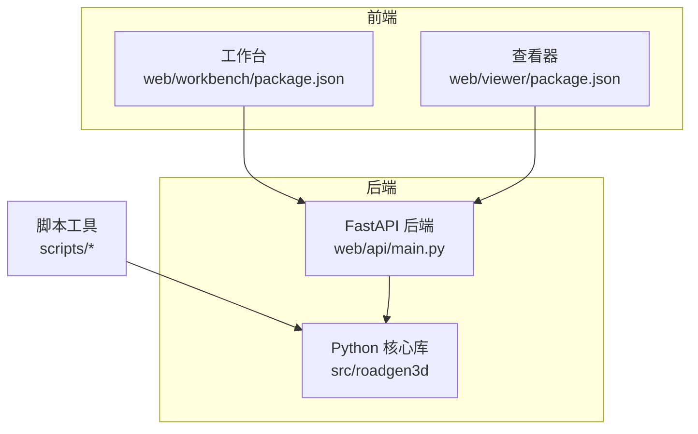
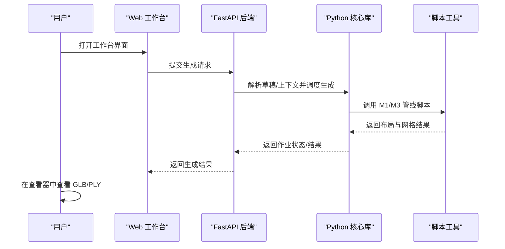
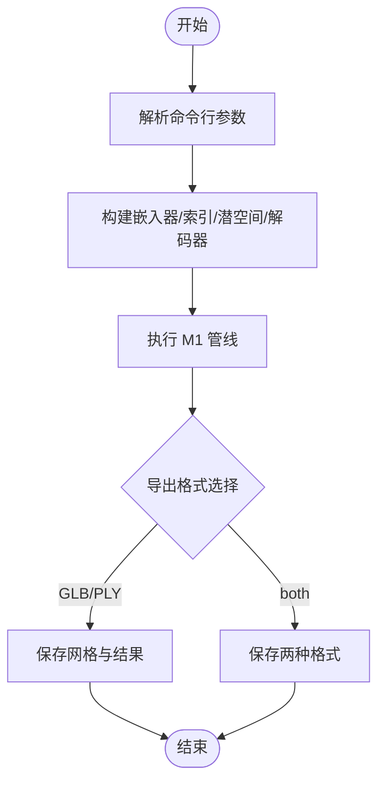
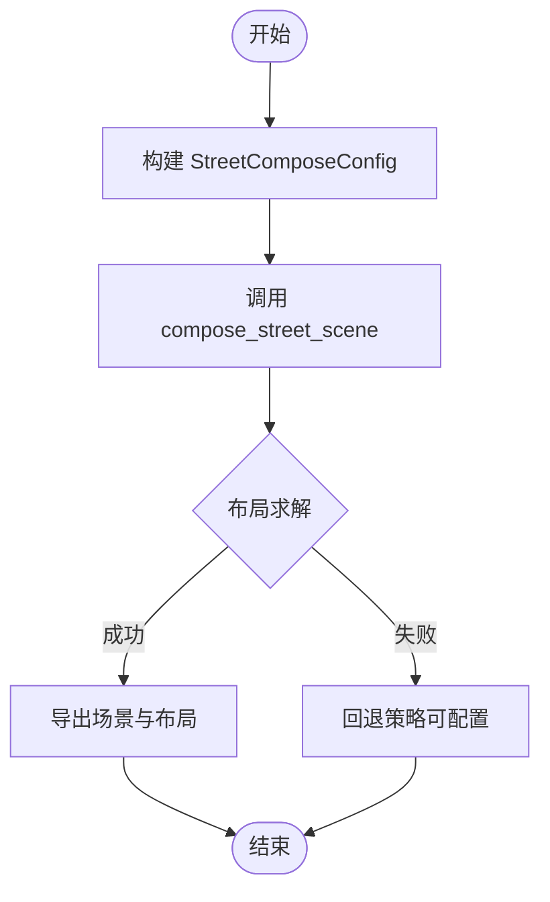

# 快速开始

<cite>
**本文引用的文件**
- [README.md](file://README.md)
- [Makefile](file://Makefile)
- [requirements-m1.txt](file://requirements-m1.txt)
- [requirements-m2.txt](file://requirements-m2.txt)
- [requirements-m5.txt](file://requirements-m5.txt)
- [requirements-ui.txt](file://requirements-ui.txt)
- [scripts/m1_06_run_pipeline.py](file://scripts/m1_06_run_pipeline.py)
- [scripts/m3_01_compose_street.py](file://scripts/m3_01_compose_street.py)
- [web/api/main.py](file://web/api/main.py)
- [web/viewer/package.json](file://web/viewer/package.json)
- [web/workbench/package.json](file://web/workbench/package.json)
</cite>

## 目录
1. [简介](#简介)
2. [项目结构](#项目结构)
3. [核心组件](#核心组件)
4. [架构总览](#架构总览)
5. [详细组件分析](#详细组件分析)
6. [依赖分析](#依赖分析)
7. [性能考虑](#性能考虑)
8. [故障排查指南](#故障排查指南)
9. [结论](#结论)
10. [附录](#附录)

## 简介
本指南面向首次接触 RoadGen3D 的用户，帮助你在约 30 分钟内完成系统前置条件准备、安装与依赖配置、开发环境启动，并成功运行两个典型示例：单资产管线与 M3 多资产街道生成。同时提供常见安装问题的排查建议。

## 项目结构
RoadGen3D 采用“后端 Python 库 + 前端工作台与查看器 + 脚本工具 + 数据与模型资源”的组织方式。核心目录与职责概览如下：
- src/roadgen3d：核心 Python 库，包含检索、解码、布局规划、网格导出等能力
- scripts：里程碑脚本集合（M1/M2/M3/M4/M5 等），用于命令行执行完整流程
- web/api：基于 FastAPI 的设计助手与场景作业 API
- web/workbench：Vite + React 工作台（端口 4174）
- web/viewer：Three.js 场景查看器（端口 4173）
- data、models、artifacts：数据清单、预训练模型与生成产物
- 文档与知识库：docs、knowledge

图表来源
- [web/api/main.py:1-286](file://web/api/main.py#L1-L286)
- [web/workbench/package.json:1-16](file://web/workbench/package.json#L1-L16)
- [web/viewer/package.json:1-20](file://web/viewer/package.json#L1-L20)

章节来源
- [README.md:107-130](file://README.md#L107-L130)

## 核心组件
- 开发环境与端口
  - API：http://127.0.0.1:8010
  - 工作台：http://127.0.0.1:4174
  - 查看器：http://127.0.0.1:4173
- 命令行工具
  - 单资产管线：scripts/m1_06_run_pipeline.py
  - 多资产街道：scripts/m3_01_compose_street.py
- Web API
  - 提供场景作业提交、查询、最近场景列表、知识库重建与搜索等接口

章节来源
- [README.md:31-106](file://README.md#L31-L106)
- [Makefile:6-11](file://Makefile#L6-L11)
- [web/api/main.py:188-221](file://web/api/main.py#L188-L221)

## 架构总览
下图展示了从命令行或 Web 工作台发起请求，到后端 Python 库执行生成与导出的整体流程。

图表来源
- [web/api/main.py:156-221](file://web/api/main.py#L156-L221)
- [scripts/m1_06_run_pipeline.py:60-102](file://scripts/m1_06_run_pipeline.py#L60-L102)
- [scripts/m3_01_compose_street.py:85-157](file://scripts/m3_01_compose_street.py#L85-L157)

## 详细组件分析

### 安装与环境准备
- 前置条件
  - Python 3.11+（已验证于 macOS arm64）
  - Git（含子模块支持）
  - Node.js（用于前端工作台与查看器）
- 安装步骤
  1) 克隆仓库并初始化子模块
  2) 安装 Python 依赖（M1/M2/UI）
  3) 安装前端依赖（工作台与查看器）
- 开发环境启动
  - 使用 make dev 同时启动 API、工作台与查看器
  - 或分别使用 make workbench-api、make workbench-web、make viewer-web

章节来源
- [README.md:33-55](file://README.md#L33-L55)
- [Makefile:15-34](file://Makefile#L15-L34)

### 单资产管线（M1）命令行示例
- 目标：从文本描述生成单个资产的体素/网格
- 关键参数：查询词、检索数量、数据目录、输出目录、模型路径、设备、解码器类型、导出格式等
- 输出：GLB/PLY 网格与布局摘要

图表来源
- [scripts/m1_06_run_pipeline.py:23-102](file://scripts/m1_06_run_pipeline.py#L23-L102)

章节来源
- [README.md:93-105](file://README.md#L93-L105)
- [scripts/m1_06_run_pipeline.py:23-102](file://scripts/m1_06_run_pipeline.py#L23-L102)

### M3 多资产街道生成命令行示例
- 目标：根据文本描述合成多资产街道场景
- 关键参数：道路长度/宽度、人行道宽度、密度、种子、设计规则配置、布局求解器、导出格式等
- 输出：GLB/PLY 场景与布局 JSON

图表来源
- [scripts/m3_01_compose_street.py:85-157](file://scripts/m3_01_compose_street.py#L85-L157)

章节来源
- [README.md:72-91](file://README.md#L72-L91)
- [scripts/m3_01_compose_street.py:21-157](file://scripts/m3_01_compose_street.py#L21-L157)

### Web API 与端口
- API 端点（部分）
  - GET /api/scene/jobs：列出作业
  - GET /api/scene/jobs/{job_id}：查询作业
  - POST /api/scene/jobs：提交作业
  - GET /api/scenes/recent：最近场景
- 默认监听地址与端口
  - API：127.0.0.1:8010
  - 工作台：127.0.0.1:4174
  - 查看器：127.0.0.1:4173

章节来源
- [README.md:194-206](file://README.md#L194-L206)
- [Makefile:6-11](file://Makefile#L6-L11)
- [web/api/main.py:188-221](file://web/api/main.py#L188-L221)
- [web/viewer/package.json:7](file://web/viewer/package.json#L7)
- [web/workbench/package.json:7](file://web/workbench/package.json#L7)

## 依赖分析
- Python 依赖分层
  - M1：NumPy、PyTorch、Transformers、FAISS、pytest
  - M2：Trimesh、scikit-image、pygltflib
  - M5：Shapely、PyProj、Requests、Pillow
  - UI：FastAPI、Uvicorn、HTTPX、Pydantic
- 前端依赖
  - 工作台：Vite + TypeScript
  - 查看器：Three.js + TypeScript + Vite

章节来源
- [requirements-m1.txt:1-7](file://requirements-m1.txt#L1-L7)
- [requirements-m2.txt:1-4](file://requirements-m2.txt#L1-L4)
- [requirements-m5.txt:1-5](file://requirements-m5.txt#L1-L5)
- [requirements-ui.txt:1-12](file://requirements-ui.txt#L1-L12)
- [web/viewer/package.json:11-18](file://web/viewer/package.json#L11-L18)
- [web/workbench/package.json:11-15](file://web/workbench/package.json#L11-L15)

## 性能考虑
- 设备与加速
  - 可通过 --device 指定 CPU/GPU；PyTorch 版本范围已在依赖中限定
- 导出与体积
  - 支持 GLB（展示）与 PLY（调试）；默认使用 Marching Cubes 作为网格化方法
- 计算复杂度
  - FAISS 内积检索与布局求解器的计算量随密度与布局复杂度增长

章节来源
- [requirements-m1.txt:3](file://requirements-m1.txt#L3)
- [README.md:145-156](file://README.md#L145-L156)
- [scripts/m1_06_run_pipeline.py:33-41](file://scripts/m1_06_run_pipeline.py#L33-L41)

## 故障排查指南
- 端口占用
  - 若端口 8010、4173、4174 已被占用，相关服务会提示已存在；请释放端口或修改 Makefile 中的端口配置
- Python 依赖安装失败
  - 确认使用 Python 3.11+；若 FAISS 或 Pillow 安装报错，请检查系统依赖与编译器版本
- 前端依赖安装失败
  - 确保 Node.js 版本满足要求；如 npm 报错，尝试清理缓存或更换镜像源
- 模型加载失败
  - 如遇 ModelLoadError，请确认本地模型目录与 --model-dir 设置正确，或关闭 --local-files-only 并允许在线下载
- 端到端验证
  - 使用 make dev 启动全部服务后，访问 http://127.0.0.1:4174 与 http://127.0.0.1:4173 进行验证

章节来源
- [Makefile:39-67](file://Makefile#L39-L67)
- [requirements-m1.txt:2-6](file://requirements-m1.txt#L2-L6)
- [requirements-ui.txt:2-6](file://requirements-ui.txt#L2-L6)
- [scripts/m1_06_run_pipeline.py:88-93](file://scripts/m1_06_run_pipeline.py#L88-L93)
- [README.md:33-37](file://README.md#L33-L37)

## 结论
按照本指南，你可以在 30 分钟内完成 RoadGen3D 的安装与环境启动，并通过单资产与多资产两条命令行示例快速验证系统功能。后续可结合 Web 工作台与查看器进行交互式体验与结果可视化。

## 附录

### 快速对照表
- 前置条件：Python 3.11+、Git、Node.js
- 安装命令：克隆仓库 → 初始化子模块 → 安装 Python 依赖 → 安装前端依赖
- 启动命令：make dev
- 服务端口：API 8010、工作台 4174、查看器 4173
- 示例命令：
  - 单资产管线：参考 [README.md:93-105](file://README.md#L93-L105)
  - M3 街道生成：参考 [README.md:72-91](file://README.md#L72-L91)