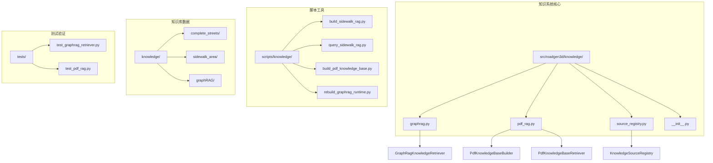
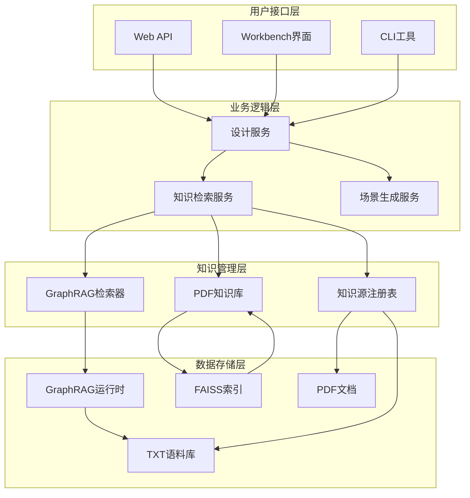
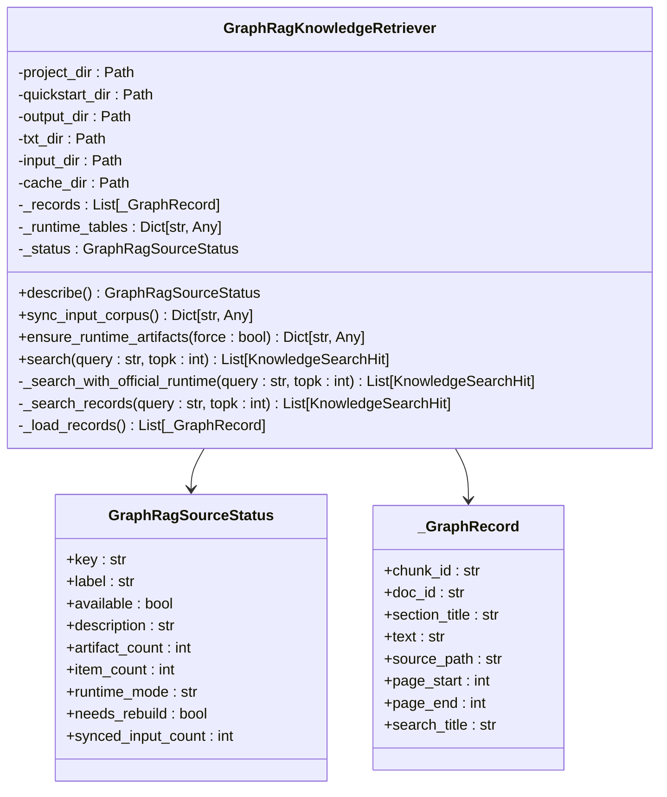
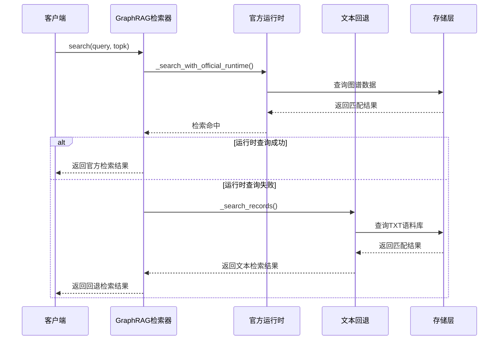
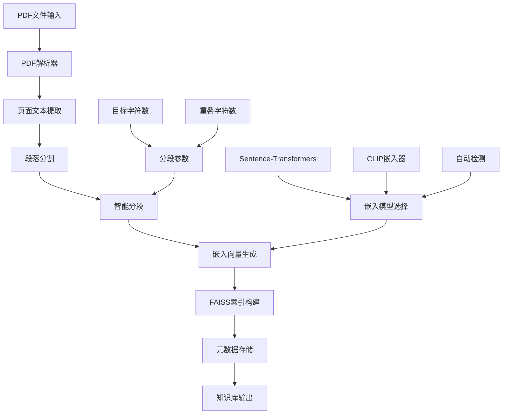
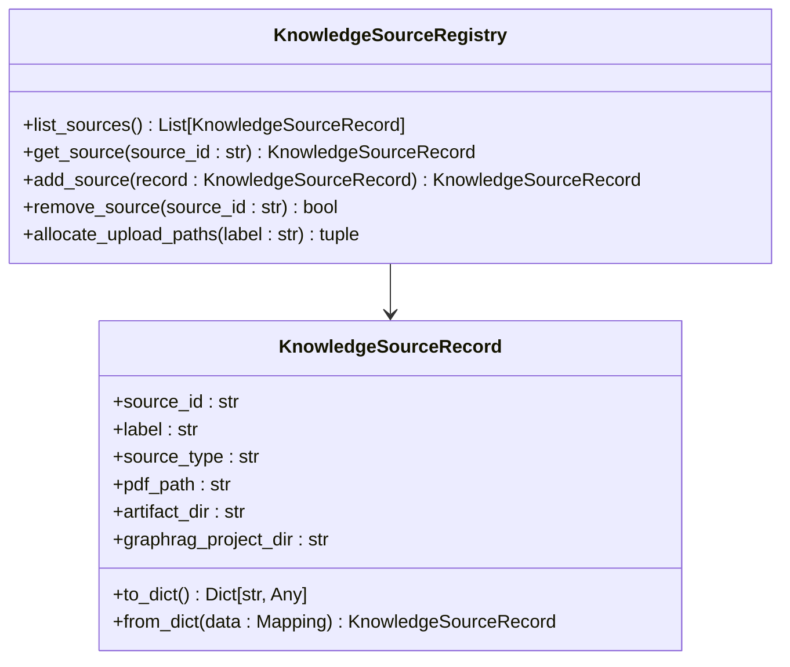
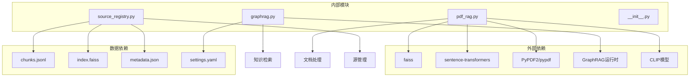

# 知识与RAG系统

<cite>
**本文档引用的文件**
- [graphrag.py](file://src/roadgen3d/knowledge/graphrag.py)
- [pdf_rag.py](file://src/roadgen3d/knowledge/pdf_rag.py)
- [source_registry.py](file://src/roadgen3d/knowledge/source_registry.py)
- [__init__.py](file://src/roadgen3d/knowledge/__init__.py)
- [build_sidewalk_rag.py](file://scripts/knowledge/build_sidewalk_rag.py)
- [query_sidewalk_rag.py](file://scripts/knowledge/query_sidewalk_rag.py)
- [build_pdf_knowledge_base.py](file://scripts/knowledge/build_pdf_knowledge_base.py)
- [rebuild_graphrag_runtime.py](file://scripts/knowledge/rebuild_graphrag_runtime.py)
- [settings.yaml](file://knowledge/graphRAG/graphrag_quickstart/settings.yaml)
- [metadata.json (complete_streets)](file://knowledge/complete_streets/metadata.json)
- [metadata.json (sidewalk_area)](file://knowledge/sidewalk_area/metadata.json)
- [test_graphrag_retriever.py](file://tests/test_graphrag_retriever.py)
- [test_pdf_rag.py](file://tests/test_pdf_rag.py)
- [readme.md](file://readme.md)
</cite>

## 目录
1. [简介](#简介)
2. [项目结构](#项目结构)
3. [核心组件](#核心组件)
4. [架构概览](#架构概览)
5. [详细组件分析](#详细组件分析)
6. [依赖关系分析](#依赖关系分析)
7. [性能考虑](#性能考虑)
8. [故障排除指南](#故障排除指南)
9. [结论](#结论)

## 简介

RoadGen3D项目中的知识与RAG系统是一个多模态的知识检索增强生成框架，专门用于支持3D城市街道场景的生成。该系统结合了PDF文档检索、GraphRAG图谱检索和本地知识库管理，为设计助手提供全面的设计知识支持。

系统的核心目标是：
- 提供结构化的城市设计知识检索能力
- 支持完整的街道设计流程，从文本描述到3D场景生成
- 实现多源知识融合，包括设计规范、最佳实践和约束条件
- 为自动化设计流程提供智能决策支持

## 项目结构

知识与RAG系统主要分布在以下目录结构中：

**图表来源**
- [graphrag.py:1-1118](file://src/roadgen3d/knowledge/graphrag.py#L1-L1118)
- [pdf_rag.py:1-446](file://src/roadgen3d/knowledge/pdf_rag.py#L1-L446)
- [source_registry.py:1-104](file://src/roadgen3d/knowledge/source_registry.py#L1-L104)

**章节来源**
- [readme.md:158-197](file://readme.md#L158-L197)

## 核心组件

### GraphRAG知识检索器

GraphRAG知识检索器是系统的核心组件，实现了官方GraphRAG运行时的优先级策略和文本合并语料库的回退机制。

主要特性：
- **混合检索模式**：优先使用官方GraphRAG运行时，当运行时不可用时自动回退到文本合并语料库
- **智能缓存管理**：维护输入清单和运行时状态，避免不必要的重建
- **多源数据整合**：支持TXT文档、社区报告、实体关系等多种数据源
- **线程安全设计**：使用锁机制确保并发访问的安全性

### PDF知识库构建器

PDF知识库构建器提供了完整的PDF文档处理流水线，从PDF解析到向量索引的完整解决方案。

核心功能：
- **PDF解析**：支持PyPDF2和pypdf两种后端，自动处理文本提取
- **智能分段**：基于段落和标题的智能文本分割算法
- **嵌入生成**：支持Sentence-Transformers和CLIP两种嵌入模型
- **FAISS索引**：高效的向量相似度搜索索引
- **元数据管理**：完整的知识库元数据和版本控制

### 知识源注册表

知识源注册表管理所有可用的知识源，支持动态添加、删除和查询知识源。

关键能力：
- **统一接口**：为不同类型的检索器提供统一的访问接口
- **持久化存储**：使用JSON文件存储知识源配置
- **上传管理**：支持自定义PDF文件的上传和处理
- **类型区分**：明确区分PDF RAG和GraphRAG两种知识源类型

**章节来源**
- [graphrag.py:230-500](file://src/roadgen3d/knowledge/graphrag.py#L230-L500)
- [pdf_rag.py:258-446](file://src/roadgen3d/knowledge/pdf_rag.py#L258-L446)
- [source_registry.py:15-104](file://src/roadgen3d/knowledge/source_registry.py#L15-L104)

## 架构概览

系统采用分层架构设计，实现了知识获取、处理、存储和检索的完整闭环：

**图表来源**
- [graphrag.py:230-423](file://src/roadgen3d/knowledge/graphrag.py#L230-L423)
- [pdf_rag.py:258-423](file://src/roadgen3d/knowledge/pdf_rag.py#L258-L423)
- [source_registry.py:53-86](file://src/roadgen3d/knowledge/source_registry.py#L53-L86)

## 详细组件分析

### GraphRAG知识检索器实现

GraphRAG知识检索器采用了复杂的多阶段检索策略：

**图表来源**
- [graphrag.py:194-268](file://src/roadgen3d/knowledge/graphrag.py#L194-L268)
- [graphrag.py:230-423](file://src/roadgen3d/knowledge/graphrag.py#L230-L423)

检索流程分析：

**图表来源**
- [graphrag.py:403-422](file://src/roadgen3d/knowledge/graphrag.py#L403-L422)
- [graphrag.py:459-490](file://src/roadgen3d/knowledge/graphrag.py#L459-L490)

### PDF知识库构建流程

PDF知识库构建器实现了完整的文档处理流水线：

**图表来源**
- [pdf_rag.py:258-342](file://src/roadgen3d/knowledge/pdf_rag.py#L258-L342)
- [build_sidewalk_rag.py:187-227](file://scripts/knowledge/build_sidewalk_rag.py#L187-L227)

### 知识源管理机制

知识源注册表提供了灵活的知识源管理能力：

**图表来源**
- [source_registry.py:15-44](file://src/roadgen3d/knowledge/source_registry.py#L15-L44)
- [source_registry.py:53-104](file://src/roadgen3d/knowledge/source_registry.py#L53-L104)

**章节来源**
- [graphrag.py:230-800](file://src/roadgen3d/knowledge/graphrag.py#L230-L800)
- [pdf_rag.py:258-446](file://src/roadgen3d/knowledge/pdf_rag.py#L258-L446)
- [source_registry.py:15-104](file://src/roadgen3d/knowledge/source_registry.py#L15-L104)

## 依赖关系分析

系统的关键依赖关系如下：

**图表来源**
- [pdf_rag.py:21-37](file://src/roadgen3d/knowledge/pdf_rag.py#L21-L37)
- [graphrag.py:161-168](file://src/roadgen3d/knowledge/graphrag.py#L161-L168)
- [settings.yaml:1-133](file://knowledge/graphRAG/graphrag_quickstart/settings.yaml#L1-L133)

**章节来源**
- [pdf_rag.py:21-37](file://src/roadgen3d/knowledge/pdf_rag.py#L21-L37)
- [graphrag.py:161-168](file://src/roadgen3d/knowledge/graphrag.py#L161-L168)

## 性能考虑

### 检索性能优化

系统在多个层面实现了性能优化：

1. **缓存策略**：GraphRAG检索器维护输入清单和运行时状态，避免重复构建
2. **索引优化**：FAISS使用IndexFlatIP实现高效的向量相似度搜索
3. **并发控制**：使用线程锁确保多线程环境下的数据一致性
4. **内存管理**：智能的嵌入向量加载和释放机制

### 存储优化

- **增量更新**：支持部分重新构建，只更新变更的文档
- **压缩存储**：FAISS索引采用高效的存储格式
- **元数据管理**：完整的元数据跟踪，便于版本控制和审计

## 故障排除指南

### 常见问题及解决方案

1. **GraphRAG运行时构建失败**
   - 检查环境变量配置（GRAPHRAG_API_KEY、GRAPHRAG_API_BASE）
   - 验证settings.yaml配置文件的正确性
   - 确认输入文档的格式和编码

2. **PDF解析错误**
   - 确保安装了PyPDF2或pypdf依赖
   - 检查PDF文件的完整性
   - 验证文本提取的编码设置

3. **FAISS索引损坏**
   - 重新构建知识库
   - 检查磁盘空间和权限
   - 验证嵌入向量的维度一致性

**章节来源**
- [test_graphrag_retriever.py:16-61](file://tests/test_graphrag_retriever.py#L16-L61)
- [test_pdf_rag.py:39-93](file://tests/test_pdf_rag.py#L39-L93)

## 结论

RoadGen3D的知識與RAG系統是一个高度集成的知识检索框架，具有以下特点：

1. **多模态融合**：结合了PDF文档检索和GraphRAG图谱检索的优势
2. **智能回退机制**：确保在各种环境下都能提供稳定的检索服务
3. **可扩展架构**：支持动态添加新的知识源和检索器
4. **生产就绪**：经过充分的测试验证，适合在实际项目中使用

该系统为3D城市街道场景生成提供了强大的知识基础，通过智能的检索和推理能力，显著提升了设计质量和效率。未来可以进一步扩展支持更多的知识源类型和更复杂的检索策略。