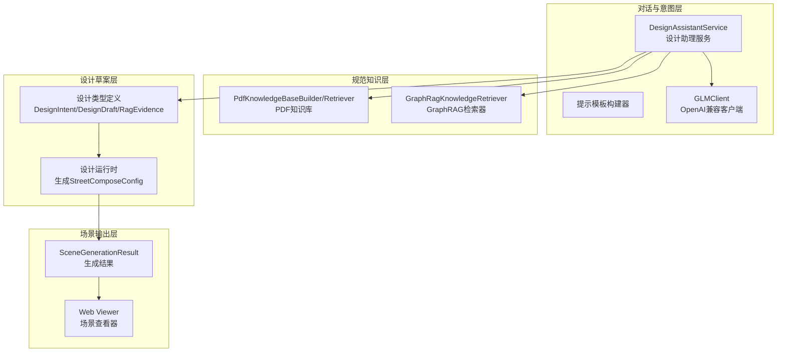
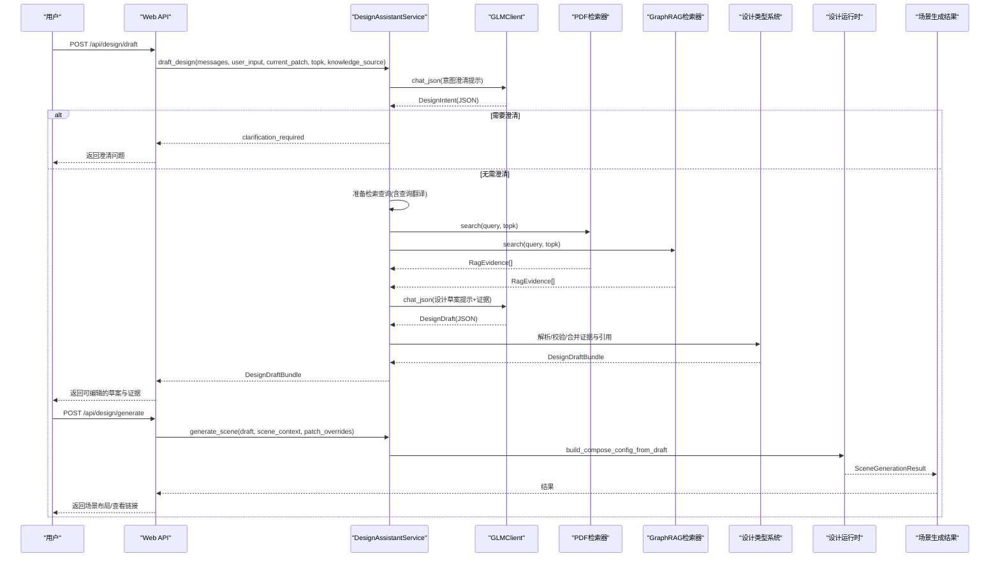
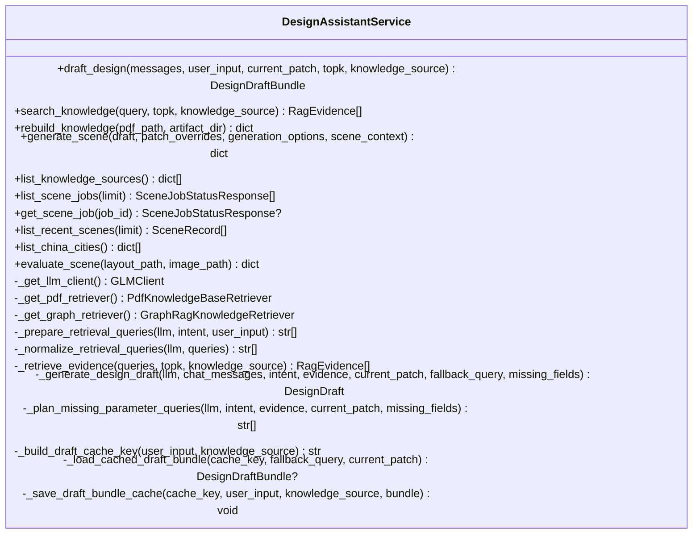
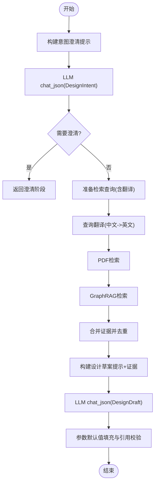
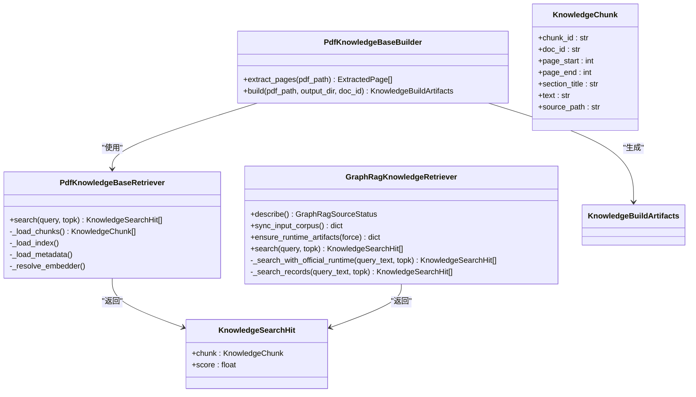
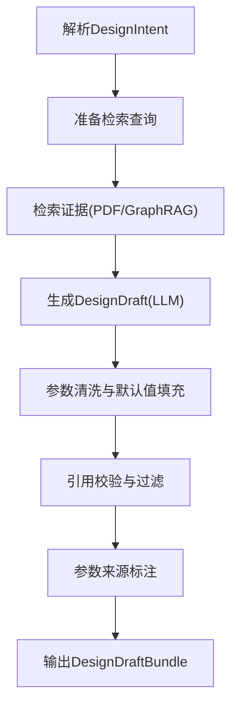
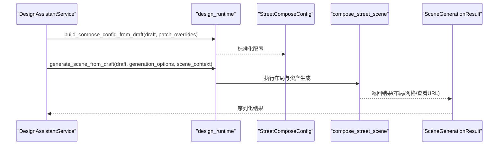
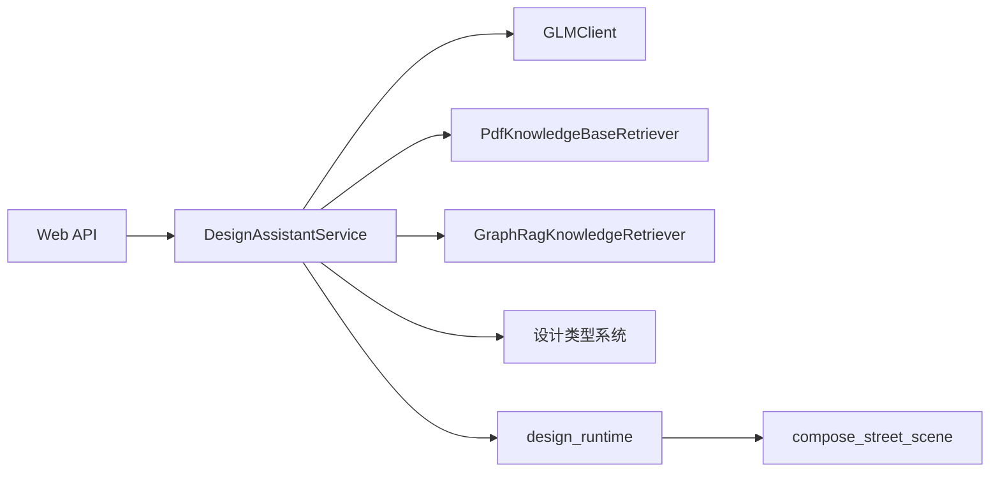

# LLM知识集成

<cite>
**本文档引用的文件**
- [design_workflow.py](file://src/roadgen3d/llm/design_workflow.py)
- [glm_client.py](file://src/roadgen3d/llm/glm_client.py)
- [prompts.py](file://src/roadgen3d/llm/prompts.py)
- [graphrag.py](file://src/roadgen3d/knowledge/graphrag.py)
- [pdf_rag.py](file://src/roadgen3d/knowledge/pdf_rag.py)
- [design_types.py](file://src/roadgen3d/services/design_types.py)
- [design_runtime.py](file://src/roadgen3d/services/design_runtime.py)
- [main.py](file://web/api/main.py)
- [llm_rag_design_outline.md](file://docs/llm_rag_design_outline.md)
- [build_pdf_knowledge_base.py](file://scripts/knowledge/build_pdf_knowledge_base.py)
- [query_sidewalk_rag.py](file://scripts/knowledge/query_sidewalk_rag.py)
- [test_design_assistant_service.py](file://tests/test_design_assistant_service.py)
- [test_graphrag_retriever.py](file://tests/test_graphrag_retriever.py)
- [test_pdf_rag.py](file://tests/test_pdf_rag.py)
- [test_glm_client.py](file://tests/test_glm_client.py)
</cite>

## 目录
1. [简介](#简介)
2. [项目结构](#项目结构)
3. [核心组件](#核心组件)
4. [架构总览](#架构总览)
5. [详细组件分析](#详细组件分析)
6. [依赖关系分析](#依赖关系分析)
7. [性能考虑](#性能考虑)
8. [故障排除指南](#故障排除指南)
9. [结论](#结论)
10. [附录](#附录)

## 简介
本文件面向RoadGen3D项目中的LLM与知识系统集成，系统性阐述设计工作流中的知识检索集成（查询理解、上下文提取、答案生成）、提示工程最佳实践（模板设计、上下文注入、输出约束）、知识增强的对话流程（多轮对话管理、记忆保持、一致性保证）、LLM配置指南（模型选择、参数调优、性能优化）、知识质量控制机制（事实核查、来源标注、可信度评估），以及集成测试方法（单元测试、集成测试、端到端验证）。同时提供扩展开发指南（自定义提示、新模型支持、第三方API集成）。

## 项目结构
本项目围绕"LLM + RAG工作台"构建，采用分层架构：
- 对话与意图层：负责用户意图澄清、RAG查询生成与证据整合
- 规范知识层：负责PDF与GraphRAG知识库的构建与检索
- 设计草案层：负责将意图与证据转化为可解释的参数草案
- 街道方案层：沿用既有StreetProgram/布局求解管线
- 资产与环境后端层：对象/材质/天空清单与检索后端
- 场景输出层：资产摆放、材质应用与场景导出

**图表来源**
- [design_workflow.py:62-310](file://src/roadgen3d/llm/design_workflow.py#L62-L310)
- [prompts.py:11-164](file://src/roadgen3d/llm/prompts.py#L11-L164)
- [pdf_rag.py:258-441](file://src/roadgen3d/knowledge/pdf_rag.py#L258-L441)
- [graphrag.py:230-423](file://src/roadgen3d/knowledge/graphrag.py#L230-L423)
- [design_types.py:13-262](file://src/roadgen3d/services/design_types.py#L13-L262)
- [design_runtime.py:60-396](file://src/roadgen3d/services/design_runtime.py#L60-L396)

**章节来源**
- [llm_rag_design_outline.md:1-545](file://docs/llm_rag_design_outline.md#L1-L545)

## 核心组件
- 设计助理服务（DesignAssistantService）：编排LLM意图解析、RAG检索与场景生成，支持缓存、混合检索与参数补全
- 提示模板构建器（Prompts）：提供意图澄清、查询翻译、参数补全、设计草案、场景评价等提示模板
- 知识检索器：PDF知识库（FAISS向量检索）与GraphRAG（官方runtime优先，txt回退）
- 设计类型系统：统一的意图、证据、草案、场景上下文等数据结构
- 场景生成运行时：将设计草案转换为StreetComposeConfig并执行布局与资产生成
- Web API：FastAPI接口，暴露设计草稿、知识检索、场景生成、作业管理等功能

**章节来源**
- [design_workflow.py:62-310](file://src/roadgen3d/llm/design_workflow.py#L62-L310)
- [prompts.py:11-212](file://src/roadgen3d/llm/prompts.py#L11-L212)
- [pdf_rag.py:258-441](file://src/roadgen3d/knowledge/pdf_rag.py#L258-L441)
- [graphrag.py:230-423](file://src/roadgen3d/knowledge/graphrag.py#L230-L423)
- [design_types.py:13-262](file://src/roadgen3d/services/design_types.py#L13-L262)
- [design_runtime.py:60-396](file://src/roadgen3d/services/design_runtime.py#L60-L396)
- [main.py:81-267](file://web/api/main.py#L81-L267)

## 架构总览
下图展示从用户输入到最终场景输出的完整工作流，突出LLM与RAG在设计流程中的作用：

**图表来源**
- [design_workflow.py:112-239](file://src/roadgen3d/llm/design_workflow.py#L112-L239)
- [prompts.py:11-164](file://src/roadgen3d/llm/prompts.py#L11-L164)
- [pdf_rag.py:409-422](file://src/roadgen3d/knowledge/pdf_rag.py#L409-L422)
- [graphrag.py:403-422](file://src/roadgen3d/knowledge/graphrag.py#L403-L422)
- [design_runtime.py:336-396](file://src/roadgen3d/services/design_runtime.py#L336-L396)
- [main.py:156-201](file://web/api/main.py#L156-L201)

## 详细组件分析

### 设计助理服务（DesignAssistantService）
- 职责：编排意图解析、检索查询准备、证据检索、设计草案生成、参数补全、缓存与状态管理
- 关键能力：
  - 意图澄清：通过LLM将用户自然语言解析为DesignIntent（目标、偏好、优先级、待澄清问题、RAG查询）
  - 查询翻译：对中文查询进行英文翻译与重写，提升跨语言检索效果
  - 多源检索：支持pdf_rag、graph_rag与hybrid模式，自动回退与错误处理
  - 参数补全：对缺失字段发起二次检索，补充证据并重新生成草案
  - 缓存：基于prompt与知识源的哈希缓存，命中时跳过LLM与检索
  - 场景生成：将DesignDraft转换为StreetComposeConfig并执行生成

**图表来源**
- [design_workflow.py:62-310](file://src/roadgen3d/llm/design_workflow.py#L62-L310)

**章节来源**
- [design_workflow.py:112-239](file://src/roadgen3d/llm/design_workflow.py#L112-L239)
- [design_workflow.py:599-634](file://src/roadgen3d/llm/design_workflow.py#L599-L634)

### 提示工程与模板设计
- 意图澄清模板：要求LLM输出JSON，包含用户目标、风格偏好、安全优先级、待澄清问题与RAG查询
- 查询翻译模板：将中文检索短语翻译为英文，便于跨语言检索
- 参数补全模板：针对缺失字段生成英文检索查询
- 设计草案模板：要求LLM输出标准化的compose_config_patch、citations_by_field、design_summary、risk_notes
- 场景评价模板：基于布局与图像输出结构化评价与建议

**图表来源**
- [prompts.py:11-164](file://src/roadgen3d/llm/prompts.py#L11-L164)
- [design_workflow.py:599-634](file://src/roadgen3d/llm/design_workflow.py#L599-L634)

**章节来源**
- [prompts.py:11-212](file://src/roadgen3d/llm/prompts.py#L11-L212)

### 知识检索与证据管理
- PDF知识库：从PDF提取页面、切分为段落块、计算嵌入、构建FAISS索引，支持检索与评分
- GraphRAG：优先使用官方runtime（local/basic搜索），若不可用则回退至合并txt与社区报告
- 证据结构：RagEvidence包含chunk_id、doc_id、section_title、页码范围、文本、来源路径、分数、相关性理由、知识源、参数提示
- 合并策略：按chunk_id去重，按分数降序排序，确保高质量证据优先

**图表来源**
- [pdf_rag.py:258-441](file://src/roadgen3d/knowledge/pdf_rag.py#L258-L441)
- [graphrag.py:230-423](file://src/roadgen3d/knowledge/graphrag.py#L230-L423)

**章节来源**
- [pdf_rag.py:258-441](file://src/roadgen3d/knowledge/pdf_rag.py#L258-L441)
- [graphrag.py:230-423](file://src/roadgen3d/knowledge/graphrag.py#L230-L423)

### 设计草案与参数管理
- DesignDraft：包含归一化场景查询、compose_config_patch、citations_by_field、设计摘要、风险提示、参数来源标注
- 参数默认值：对未提供的字段使用系统默认值，确保生成稳定性
- 引用校验：仅保留存在于证据集合中的chunk_id，避免虚假引用
- 参数来源：标记字段来自RAG、LLM推断或系统默认，便于溯源与审计

**图表来源**
- [design_workflow.py:650-701](file://src/roadgen3d/llm/design_workflow.py#L650-L701)
- [design_types.py:61-84](file://src/roadgen3d/services/design_types.py#L61-L84)

**章节来源**
- [design_workflow.py:650-701](file://src/roadgen3d/llm/design_workflow.py#L650-L701)
- [design_types.py:61-111](file://src/roadgen3d/services/design_types.py#L61-L111)

### 场景生成与后端集成
- 将DesignDraft转换为StreetComposeConfig，合并用户覆盖与默认值
- 根据场景上下文（布局模式、AOI、参考计划、图模板）构建运行时配置
- 调用compose_street_scene执行横断面生成、规则约束、空间求解与资产落位
- 输出布局文件、GLB/PLY网格与Web查看URL

**图表来源**
- [design_runtime.py:60-396](file://src/roadgen3d/services/design_runtime.py#L60-L396)
- [design_workflow.py:268-296](file://src/roadgen3d/llm/design_workflow.py#L268-L296)

**章节来源**
- [design_runtime.py:60-396](file://src/roadgen3d/services/design_runtime.py#L60-L396)

## 依赖关系分析
- 组件耦合：
  - DesignAssistantService依赖GLMClient、PDF/GraphRAG检索器、设计类型系统、场景运行时
  - Prompts模块被LLM调用，输出标准化消息序列
  - Web API作为入口，封装服务调用并处理HTTP错误
- 外部依赖：
  - GLM API（OpenAI兼容）用于意图澄清与设计草案生成
  - FAISS用于PDF知识库向量检索
  - GraphRAG官方runtime（可选）与txt回退
  - FastAPI用于REST接口

**图表来源**
- [main.py:81-267](file://web/api/main.py#L81-L267)
- [design_workflow.py:62-310](file://src/roadgen3d/llm/design_workflow.py#L62-L310)
- [design_runtime.py:336-396](file://src/roadgen3d/services/design_runtime.py#L336-L396)

**章节来源**
- [main.py:81-267](file://web/api/main.py#L81-L267)

## 性能考虑
- 检索性能：
  - FAISS索引预构建，支持高并发相似度搜索
  - GraphRAG优先使用官方runtime，失败时回退txt检索，平衡速度与质量
- LLM调用：
  - 通过缓存避免重复计算相同prompt的意图与草案
  - 温度参数固定为低值，提高输出确定性
- 内存与I/O：
  - 知识库元数据与索引文件本地持久化，减少重复构建
  - 场景生成结果缓存布局文件，加速Web查看器加载

[本节为通用指导，无需特定文件引用]

## 故障排除指南
- LLM配置错误：
  - 现象：初始化GLMClient时报错，提示缺少base_url或api_key
  - 处理：检查环境变量或.env文件，确保设置正确的GLM配置
- LLM响应格式错误：
  - 现象：chat_json抛出响应格式异常
  - 处理：确认提示模板严格输出JSON，必要时启用JSON模式
- 知识库不可用：
  - 现象：GraphRAG或PDF检索器报错或返回空结果
  - 处理：检查知识库构建状态与文件完整性，必要时重建知识库
- 场景生成失败：
  - 现象：生成过程中抛出运行时错误
  - 处理：检查StreetComposeConfig参数合法性与场景上下文，确认资产清单可用

**章节来源**
- [glm_client.py:14-38](file://src/roadgen3d/llm/glm_client.py#L14-L38)
- [glm_client.py:98-108](file://src/roadgen3d/llm/glm_client.py#L98-L108)
- [graphrag.py:269-338](file://src/roadgen3d/knowledge/graphrag.py#L269-L338)
- [pdf_rag.py:388-395](file://src/roadgen3d/knowledge/pdf_rag.py#L388-L395)
- [design_runtime.py:336-396](file://src/roadgen3d/services/design_runtime.py#L336-L396)

## 结论
本集成方案通过LLM与RAG的协同，实现了从用户意图到可解释设计草案再到高质量3D场景的完整闭环。系统在保持既有StreetProgram/布局管线优势的同时，引入规范驱动与证据溯源，提升了设计质量与可解释性。通过缓存、多源检索与参数默认值策略，系统在准确性与性能之间取得良好平衡。建议优先完善提示稳定性、证据引用质量与UI参数编辑体验，随后逐步扩展知识域与检索能力。

[本节为总结性内容，无需特定文件引用]

## 附录

### 提示工程最佳实践
- 模板设计：
  - 明确角色与约束：限定输出格式（JSON）、字段清单与输出长度
  - 任务分解：将复杂任务拆分为意图澄清、查询翻译、参数补全、设计草案、场景评价等子任务
- 上下文注入：
  - 将对话历史、当前参数、证据片段与参数提示注入提示模板
  - 控制上下文长度，避免超出模型上下文窗口
- 输出约束：
  - 使用"只输出JSON"、"不要Markdown"等指令，确保解析稳定性
  - 对关键字段进行Schema校验与默认值填充

**章节来源**
- [prompts.py:11-212](file://src/roadgen3d/llm/prompts.py#L11-L212)
- [design_workflow.py:599-634](file://src/roadgen3d/llm/design_workflow.py#L599-L634)

### LLM配置指南
- 模型选择：
  - 选择具备JSON解析能力与较强推理能力的模型
  - 在本项目中默认使用GLM-4-flash，可通过环境变量调整
- 参数调优：
  - temperature设为较低值以提升确定性
  - 控制max_tokens，避免截断关键字段
- 性能优化：
  - 启用缓存，避免重复计算
  - 并行检索多个知识源，缩短响应时间

**章节来源**
- [glm_client.py:22-38](file://src/roadgen3d/llm/glm_client.py#L22-L38)
- [design_workflow.py:351-354](file://src/roadgen3d/llm/design_workflow.py#L351-L354)

### 知识质量控制机制
- 事实核查：
  - 通过证据来源与页码标注，支持人工复核与交叉验证
  - 对高风险字段（如安全相关）提供风险提示
- 来源标注：
  - citations_by_field仅保留有效chunk_id，避免虚假引用
  - parameter_hints辅助判断字段建议依据
- 可信度评估：
  - 依据检索分数与证据数量评估可信度
  - 对空证据场景提供警告与默认值填充

**章节来源**
- [design_workflow.py:704-744](file://src/roadgen3d/llm/design_workflow.py#L704-L744)
- [design_types.py:87-111](file://src/roadgen3d/services/design_types.py#L87-L111)

### 集成测试方法
- 单元测试：
  - 测试设计助理服务的缓存命中、澄清阶段、混合检索与参数补全
  - 测试GraphRAG检索器的输入同步、状态描述与检索结果
  - 测试PDF知识库构建与检索的产物完整性
  - 测试GLM客户端的JSON解析与OpenAI兼容调用
- 集成测试：
  - 通过Web API端到端验证设计草稿与场景生成流程
  - 验证作业队列与最近场景列表接口
- 端到端验证：
  - 使用真实知识库与LLM，验证从意图澄清到场景生成的完整链路

**章节来源**
- [test_design_assistant_service.py:159-353](file://tests/test_design_assistant_service.py#L159-L353)
- [test_graphrag_retriever.py:16-61](file://tests/test_graphrag_retriever.py#L16-L61)
- [test_pdf_rag.py:39-93](file://tests/test_pdf_rag.py#L39-L93)
- [test_glm_client.py:18-47](file://tests/test_glm_client.py#L18-L47)
- [main.py:156-265](file://web/api/main.py#L156-L265)

### 扩展开发指南
- 自定义提示：
  - 在prompts.py中新增或修改提示模板，确保输出格式与字段清单一致
  - 通过单元测试验证提示模板的稳定性与覆盖率
- 新模型支持：
  - 实现新的LLM客户端适配器，遵循chat与chat_json接口约定
  - 在GLMSettings中添加模型参数，确保环境变量兼容
- 第三方API集成：
  - 通过Web API路由扩展新的知识源或后端服务
  - 实现错误处理与降级策略，保障系统稳定性

**章节来源**
- [prompts.py:11-212](file://src/roadgen3d/llm/prompts.py#L11-L212)
- [glm_client.py:41-108](file://src/roadgen3d/llm/glm_client.py#L41-L108)
- [main.py:81-267](file://web/api/main.py#L81-L267)