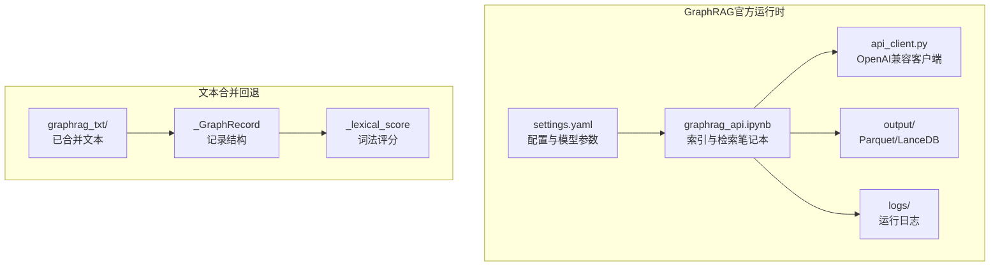
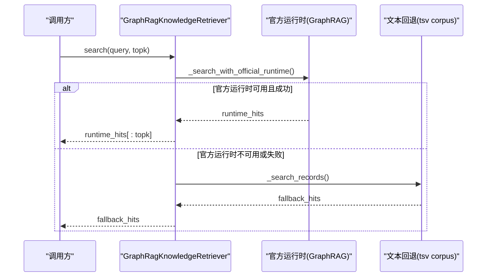
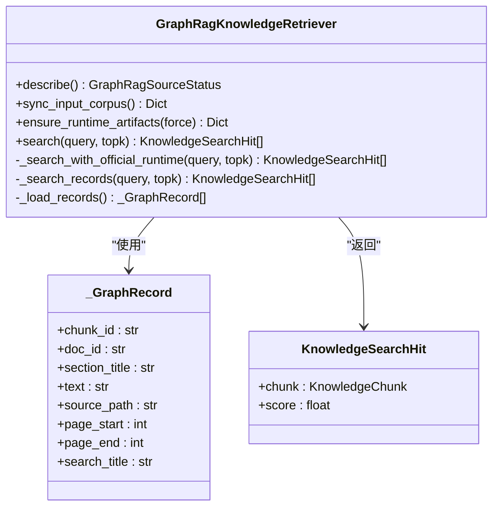
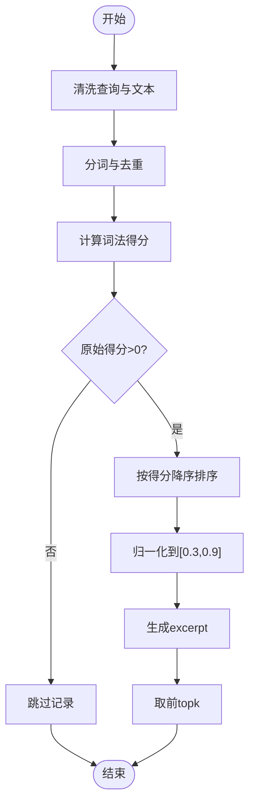
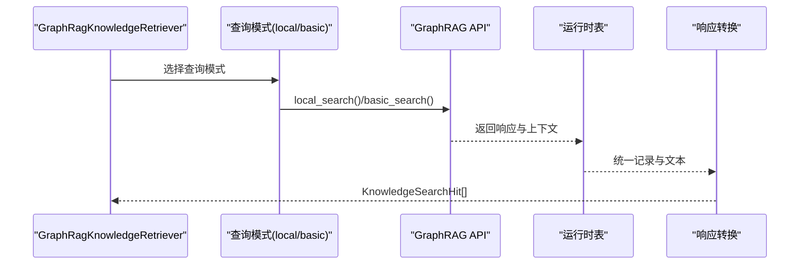
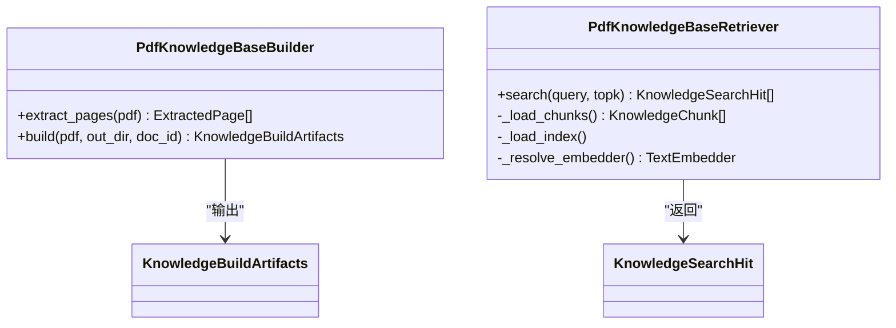
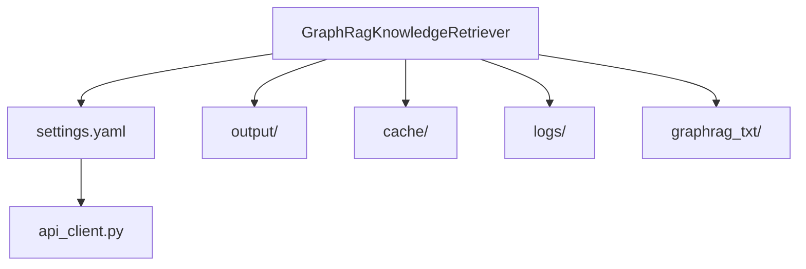

# RAG检索系统

<cite>
**本文档引用的文件**
- [graphrag.py](file://src/roadgen3d/knowledge/graphrag.py)
- [pdf_rag.py](file://src/roadgen3d/knowledge/pdf_rag.py)
- [build_sidewalk_rag.py](file://scripts/knowledge/build_sidewalk_rag.py)
- [query_sidewalk_rag.py](file://scripts/knowledge/query_sidewalk_rag.py)
- [rebuild_graphrag_runtime.py](file://scripts/knowledge/rebuild_graphrag_runtime.py)
- [api_client.py](file://knowledge/graphRAG/graphrag_quickstart/api_client.py)
- [settings.yaml](file://knowledge/graphRAG/graphrag_quickstart/settings.yaml)
- [test_graphrag_retriever.py](file://tests/test_graphrag_retriever.py)
- [README.md](file://knowledge/graphRAG/README.md)
- [llm_rag_design_outline.md](file://docs/llm_rag_design_outline.md)
</cite>

## 目录
1. [简介](#简介)
2. [项目结构](#项目结构)
3. [核心组件](#核心组件)
4. [架构总览](#架构总览)
5. [详细组件分析](#详细组件分析)
6. [依赖关系分析](#依赖关系分析)
7. [性能考虑](#性能考虑)
8. [故障排除指南](#故障排除指南)
9. [结论](#结论)
10. [附录](#附录)

## 简介
本文件面向RoadGen3D项目中的RAG检索系统，聚焦GraphRAG检索器的工作原理与实现细节，涵盖官方GraphRAG运行时优先级、文本合并回退机制、查询预处理、相似性评分与结果排序、性能优化策略、检索API使用指南、后处理流程、质量评估方法以及扩展能力。文档同时结合项目内的PDF RAG与GraphRAG两种知识库实现，帮助读者快速理解并高效使用检索能力。

## 项目结构
本项目围绕两条检索路径构建：
- GraphRAG官方运行时：通过settings.yaml配置LLM与嵌入模型，利用graphrag_api.ipynb与api_client.py进行索引与检索，产物为Parquet与LanceDB。
- 文本合并回退：当官方运行时不可用或未就绪时，系统自动回退至已合并的txt corpus进行词法检索。

**图表来源**
- [settings.yaml:1-133](file://knowledge/graphRAG/graphrag_quickstart/settings.yaml#L1-L133)
- [api_client.py:1-145](file://knowledge/graphRAG/graphrag_quickstart/api_client.py#L1-L145)
- [graphrag.py:667-786](file://src/roadgen3d/knowledge/graphrag.py#L667-L786)

**章节来源**
- [README.md:1-83](file://knowledge/graphRAG/README.md#L1-L83)
- [settings.yaml:1-133](file://knowledge/graphRAG/graphrag_quickstart/settings.yaml#L1-L133)

## 核心组件
- GraphRagKnowledgeRetriever：统一检索入口，优先调用官方GraphRAG运行时，失败或未就绪时回退至txt corpus。
- _GraphRecord：统一的知识记录结构，承载chunk_id、doc_id、section_title、text、source_path、page范围等信息。
- _lexical_score：基于查询词与标题/正文的词法匹配评分函数，用于回退路径的排序。
- PdfKnowledgeBaseBuilder/PdfKnowledgeBaseRetriever：PDF知识库构建与检索（FAISS向量检索），用于PDF类规范文档。
- APIClient：OpenAI兼容聊天补全客户端，用于GraphRAG运行时的LLM调用。

**章节来源**
- [graphrag.py:194-228](file://src/roadgen3d/knowledge/graphrag.py#L194-L228)
- [graphrag.py:106-136](file://src/roadgen3d/knowledge/graphrag.py#L106-L136)
- [pdf_rag.py:116-154](file://src/roadgen3d/knowledge/pdf_rag.py#L116-L154)
- [pdf_rag.py:258-441](file://src/roadgen3d/knowledge/pdf_rag.py#L258-L441)
- [api_client.py:23-145](file://knowledge/graphRAG/graphrag_quickstart/api_client.py#L23-L145)

## 架构总览
检索系统采用“官方运行时优先 + 文本合并回退”的双轨策略，确保在具备完整GraphRAG索引时使用高级检索，在索引缺失或异常时仍能提供基本检索能力。

**图表来源**
- [graphrag.py:403-422](file://src/roadgen3d/knowledge/graphrag.py#L403-L422)
- [graphrag.py:459-490](file://src/roadgen3d/knowledge/graphrag.py#L459-L490)

## 详细组件分析

### GraphRagKnowledgeRetriever：官方运行时优先与回退机制
- 初始化与路径解析：根据project_dir推导quickstart_dir、output_dir、txt_dir、input_dir、cache_dir等。
- describe()：汇总源条目、输出产物数量、输入同步状态、运行模式（official或static_fallback）、重建需求等。
- sync_input_corpus()：将graphrag_txt下的文本同步到quickstart/input，校验SHA256，生成输入清单。
- ensure_runtime_artifacts()：确保官方运行时产物存在，必要时触发重建。
- search()：优先尝试官方运行时，失败则回退至txt corpus；若两者均失败且官方运行时有错误，抛出异常。
- _search_with_official_runtime()：加载运行时模块与配置，检查构建状态，选择local/basic搜索模式，执行异步查询并转换为统一的KnowledgeSearchHit。
- _search_records()：对txt corpus执行词法评分与排序，生成excerpt并返回topk结果。
- _load_records()：聚合txt、community_reports、text_units、documents等来源，形成统一记录集。

**图表来源**
- [graphrag.py:230-786](file://src/roadgen3d/knowledge/graphrag.py#L230-L786)

**章节来源**
- [graphrag.py:269-338](file://src/roadgen3d/knowledge/graphrag.py#L269-L338)
- [graphrag.py:340-397](file://src/roadgen3d/knowledge/graphrag.py#L340-L397)
- [graphrag.py:399-422](file://src/roadgen3d/knowledge/graphrag.py#L399-L422)
- [graphrag.py:459-538](file://src/roadgen3d/knowledge/graphrag.py#L459-L538)
- [graphrag.py:667-786](file://src/roadgen3d/knowledge/graphrag.py#L667-L786)

### 词法评分与排序：_lexical_score与_excerpts
- _lexical_score：对查询词、标题与正文进行归一化与分词，统计子串匹配与词频，综合计算得分，避免零分情况。
- _make_excerpt：基于查询词与token在原文中的位置截取上下文片段，控制最大字符长度，保证结果可读性。
- _search_records：对所有记录计算原始分数，过滤<=0的记录，按分数降序排序，归一化到[0.3, 0.9]区间，生成excerpt并返回topk。

**图表来源**
- [graphrag.py:106-136](file://src/roadgen3d/knowledge/graphrag.py#L106-L136)
- [graphrag.py:85-103](file://src/roadgen3d/knowledge/graphrag.py#L85-L103)
- [graphrag.py:424-457](file://src/roadgen3d/knowledge/graphrag.py#L424-L457)

**章节来源**
- [graphrag.py:106-136](file://src/roadgen3d/knowledge/graphrag.py#L106-L136)
- [graphrag.py:85-103](file://src/roadgen3d/knowledge/graphrag.py#L85-L103)
- [graphrag.py:424-457](file://src/roadgen3d/knowledge/graphrag.py#L424-L457)

### 官方运行时：查询流程与响应转换
- _run_runtime_query_locked：按preferred_mode（local优先，其次basic）尝试不同搜索接口，捕获异常并最终抛出“运行时产物不完整”错误。
- _runtime_hits_from_response：将运行时响应文本与上下文记录转换为统一的KnowledgeSearchHit，响应文本置高分，上下文记录按序递减打分，限制返回数量。
- _coerce_runtime_context_records/_graph_record_from_runtime_row：从多种DataFrame/字典结构中提取记录，清洗字段并生成统一记录。
- _coerce_runtime_response_text：将字符串、列表或字典响应序列化为可读文本，限制长度。

**图表来源**
- [graphrag.py:492-537](file://src/roadgen3d/knowledge/graphrag.py#L492-L537)
- [graphrag.py:539-589](file://src/roadgen3d/knowledge/graphrag.py#L539-L589)
- [graphrag.py:591-646](file://src/roadgen3d/knowledge/graphrag.py#L591-L646)
- [graphrag.py:648-665](file://src/roadgen3d/knowledge/graphrag.py#L648-L665)

**章节来源**
- [graphrag.py:492-537](file://src/roadgen3d/knowledge/graphrag.py#L492-L537)
- [graphrag.py:539-589](file://src/roadgen3d/knowledge/graphrag.py#L539-L589)
- [graphrag.py:591-646](file://src/roadgen3d/knowledge/graphrag.py#L591-L646)
- [graphrag.py:648-665](file://src/roadgen3d/knowledge/graphrag.py#L648-L665)

### PDF RAG：构建与检索
- PdfKnowledgeBaseBuilder：从PDF提取页面、规范化文本、按段落切分为chunks、生成嵌入、构建FAISS索引并持久化。
- PdfKnowledgeBaseRetriever：加载chunks与索引，对查询向量化后检索，返回带分数的结果。
- SentenceTransformerEmbedder/ClipTextEmbedderAdapter：提供可插拔的嵌入器后端。

**图表来源**
- [pdf_rag.py:258-441](file://src/roadgen3d/knowledge/pdf_rag.py#L258-L441)
- [pdf_rag.py:344-423](file://src/roadgen3d/knowledge/pdf_rag.py#L344-L423)

**章节来源**
- [pdf_rag.py:258-441](file://src/roadgen3d/knowledge/pdf_rag.py#L258-L441)
- [pdf_rag.py:344-423](file://src/roadgen3d/knowledge/pdf_rag.py#L344-L423)

### 脚本工具：构建与查询
- build_sidewalk_rag.py：解析PDF、分段切块、检测区域关键词、生成chunks.jsonl、保存嵌入与FAISS索引。
- query_sidewalk_rag.py：加载chunks与索引，对查询向量化后检索，打印结果。
- rebuild_graphrag_runtime.py：封装GraphRagKnowledgeRetriever，提供重建与查询Smoke-test。

**章节来源**
- [build_sidewalk_rag.py:1-252](file://scripts/knowledge/build_sidewalk_rag.py#L1-L252)
- [query_sidewalk_rag.py:1-71](file://scripts/knowledge/query_sidewalk_rag.py#L1-L71)
- [rebuild_graphrag_runtime.py:1-104](file://scripts/knowledge/rebuild_graphrag_runtime.py#L1-L104)

## 依赖关系分析
- GraphRAG官方运行时依赖settings.yaml中的api_base与api_key，通过api_client.py进行LLM调用；索引产物位于output/（Parquet/LanceDB），缓存位于cache/，日志位于logs/。
- 回退路径依赖graphrag_txt/中的已合并文本，通过_pandas读取Parquet（如存在）或直接扫描txt文件。
- PDF RAG依赖sentence-transformers或CLIP嵌入器，FAISS索引与嵌入向量持久化。

**图表来源**
- [settings.yaml:1-133](file://knowledge/graphRAG/graphrag_quickstart/settings.yaml#L1-L133)
- [api_client.py:23-145](file://knowledge/graphRAG/graphrag_quickstart/api_client.py#L23-L145)
- [graphrag.py:269-338](file://src/roadgen3d/knowledge/graphrag.py#L269-L338)

**章节来源**
- [settings.yaml:1-133](file://knowledge/graphRAG/graphrag_quickstart/settings.yaml#L1-L133)
- [api_client.py:23-145](file://knowledge/graphRAG/graphrag_quickstart/api_client.py#L23-L145)
- [graphrag.py:269-338](file://src/roadgen3d/knowledge/graphrag.py#L269-L338)

## 性能考虑
- 官方运行时
  - 并行与异步：通过异步调用GraphRAG API减少等待时间，适合批量查询场景。
  - 缓存与增量：利用cache/与input_manifest.json实现增量同步与重建判断，避免重复构建。
  - 索引优化：LanceDB向量存储与Parquet结构化数据提升查询效率。
- 文本回退
  - 词法评分：基于查询词与标题/正文的匹配统计，避免深度嵌入计算，适合快速回退。
  - 截取excerpt：限制最大字符长度，兼顾可读性与性能。
- PDF RAG
  - 向量检索：FAISS IndexFlatIP支持高维向量内积，适合大规模文档检索。
  - 嵌入器选择：SentenceTransformer与CLIP可按硬件条件切换，平衡精度与速度。

[本节为通用性能讨论，无需特定文件引用]

## 故障排除指南
- 官方运行时未就绪
  - 检查settings.yaml中的api_base与api_key是否正确，确认.env中GRAPHRAG_API_KEY与GRAPHRAG_API_BASE配置一致。
  - 查看logs/indexing-engine.log与cache/roadgen3d_runtime_state.json，定位构建状态与错误信息。
  - 使用rebuild_graphrag_runtime.py进行重建与Smoke-test查询。
- 回退路径无结果
  - 确认graphrag_txt/目录存在且包含有效文本，检查sync_input_corpus()同步状态。
  - 使用test_graphrag_retriever.py验证最小化用例。
- API调用失败
  - 检查api_client.py的URL拼接与代理设置，必要时禁用信任环境代理直连目标主机。

**章节来源**
- [rebuild_graphrag_runtime.py:43-99](file://scripts/knowledge/rebuild_graphrag_runtime.py#L43-L99)
- [test_graphrag_retriever.py:16-61](file://tests/test_graphrag_retriever.py#L16-L61)
- [api_client.py:23-145](file://knowledge/graphRAG/graphrag_quickstart/api_client.py#L23-L145)

## 结论
本检索系统通过“官方运行时优先 + 文本合并回退”的双轨策略，在保证高级检索能力的同时确保稳定性与可用性。结合词法评分、向量检索与统一的数据结构，系统能够灵活适配多种知识源与查询场景。通过缓存、增量同步与异步查询等优化手段，系统在性能与用户体验方面具备良好表现。未来可进一步扩展知识域、引入多阶段检索与自定义评分算法，持续提升检索质量与可解释性。

[本节为总结性内容，无需特定文件引用]

## 附录

### 检索API使用指南
- GraphRAG检索
  - 查询参数：query（必填）、topk（可选，默认5）
  - 返回格式：List[KnowledgeSearchHit]，每项包含chunk（包含chunk_id、doc_id、page范围、section_title、text、source_path）与score
  - 错误处理：官方运行时失败时抛出RuntimeError，包含原始异常信息
- PDF RAG检索
  - 查询参数：query（必填）、topk（可选）
  - 返回格式：List[KnowledgeSearchHit]，包含chunk与score
- CLI工具
  - 构建：python scripts/knowledge/build_sidewalk_rag.py --pdf-path <path> --out-dir <dir> --model <model>
  - 查询：python scripts/knowledge/query_sidewalk_rag.py "<query>" --artifact-dir <dir> --model <model> --topk <k>
  - 重建与Smoke-test：python scripts/knowledge/rebuild_graphrag_runtime.py --project-dir <dir> [--force] [--query "<test_query>"] [--skip-query]

**章节来源**
- [graphrag.py:403-422](file://src/roadgen3d/knowledge/graphrag.py#L403-L422)
- [pdf_rag.py:409-422](file://src/roadgen3d/knowledge/pdf_rag.py#L409-L422)
- [build_sidewalk_rag.py:229-252](file://scripts/knowledge/build_sidewalk_rag.py#L229-L252)
- [query_sidewalk_rag.py:45-71](file://scripts/knowledge/query_sidewalk_rag.py#L45-L71)
- [rebuild_graphrag_runtime.py:18-104](file://scripts/knowledge/rebuild_graphrag_runtime.py#L18-L104)

### 检索后处理流程
- 去重：txt corpus切块时对chunk前若干字符进行去重；FAISS索引本身避免重复向量。
- 过滤：过滤空文本与低分记录；官方运行时对重复chunk_id进行去重。
- 排序：官方运行时优先响应文本（高分），随后按序递减；回退路径按词法得分降序；FAISS检索按内积分数降序。

**章节来源**
- [graphrag.py:139-158](file://src/roadgen3d/knowledge/graphrag.py#L139-L158)
- [graphrag.py:440-457](file://src/roadgen3d/knowledge/graphrag.py#L440-L457)
- [pdf_rag.py:189-214](file://src/roadgen3d/knowledge/pdf_rag.py#L189-L214)
- [pdf_rag.py:416-422](file://src/roadgen3d/knowledge/pdf_rag.py#L416-L422)

### 检索质量评估
- 准确率与召回率：基于人工标注的查询-证据对，统计命中数量与相关性分级。
- 用户满意度：通过问卷调查收集用户对检索结果的相关性、可读性与可解释性的评分。
- 指标建议：Precision@K、Recall@K、NDCG@K、Mean Reciprocal Rank等。

[本节为通用评估方法，无需特定文件引用]

### 扩展能力
- 新文档类型支持
  - PDF：使用PdfKnowledgeBaseBuilder/PdfKnowledgeBaseRetriever
  - GraphRAG：通过settings.yaml扩展输入类型与处理参数
- 自定义评分算法
  - 回退路径：替换_lexical_score为BM25、交叉编码器或混合评分
  - 官方运行时：通过prompt与模型参数微调提升检索质量

**章节来源**
- [pdf_rag.py:258-441](file://src/roadgen3d/knowledge/pdf_rag.py#L258-L441)
- [settings.yaml:32-133](file://knowledge/graphRAG/graphrag_quickstart/settings.yaml#L32-L133)
- [llm_rag_design_outline.md:466-498](file://docs/llm_rag_design_outline.md#L466-L498)